# Technical Specification

# 0. Agent Action Plan

## 0.1 Intent Clarification

### 0.1.1 Core Feature Objective

Based on the prompt, the Blitzy platform understands that the new feature requirement is to:

- **Integrate Express.js framework** into an existing Node.js server tutorial project that currently hosts one endpoint returning "Hello world"
- **Add a new API endpoint** that returns the response "Good evening" when accessed
- **Migrate from native Node.js HTTP server** (implied) to Express.js framework for improved routing and middleware capabilities
- **Maintain existing functionality** while adding the new endpoint, ensuring the original "Hello world" endpoint continues to work

**Implicit Requirements Detected:**

- Initialize a proper Node.js project structure with package.json if not already present
- Install Express.js as a project dependency with appropriate version management
- Refactor existing HTTP server code to use Express.js routing patterns
- Implement proper HTTP response handling using Express.js conventions
- Ensure both endpoints follow RESTful API design principles
- Set up appropriate server configuration (port binding, error handling)

**Feature Dependencies and Prerequisites:**

- Node.js runtime environment (v18.0.0 or higher for Express.js v5 compatibility)
- npm package manager for dependency installation
- Existing server.js or index.js file (to be created if not present)
- package.json for dependency management (to be created if not present)

### 0.1.2 Special Instructions and Constraints

**Specific Directives:**

- Integrate Express.js into the existing project structure without disrupting the current "Hello world" endpoint functionality
- Follow Node.js and Express.js best practices for server initialization and route definition
- Use the latest stable version of Express.js compatible with Node.js v20.19.5
- Implement clean separation between server configuration and route definitions
- Maintain tutorial-friendly code structure with clear, understandable patterns

**Architectural Requirements:**

- Use Express.js application factory pattern for server initialization
- Follow modular routing structure to support future endpoint additions
- Implement proper middleware chain for request processing
- Use conventional Express.js port configuration patterns
- Follow semantic HTTP status codes and response formats

**Environment Variables Provided:**

User provided environment variables (asdAS, sdfsdf) are available but not applicable to this Express.js integration task. No special environment-specific configuration required for basic endpoint implementation.

**Setup Instructions:**

User provided setup instruction "asdasd" appears to be placeholder text. Standard Node.js and Express.js installation procedures will be followed.

### 0.1.3 Technical Interpretation

These feature requirements translate to the following technical implementation strategy:

**To integrate Express.js framework:**
- Create or update package.json with Express.js dependency specification
- Install express package via npm with version constraint for Node.js v20.x compatibility
- Initialize Express application instance in main server file
- Configure Express application with appropriate middleware and settings

**To migrate existing "Hello world" endpoint:**
- Identify current HTTP server implementation (likely using native http module)
- Convert existing route handler to Express.js route definition using app.get() or equivalent
- Ensure response format matches original implementation
- Maintain same HTTP method (likely GET) and endpoint path

**To add "Good evening" endpoint:**
- Define new Express.js route handler using app.get() or app.use()
- Implement response logic to return "Good evening" string
- Choose appropriate endpoint path (e.g., /evening, /goodevening, or /greeting)
- Apply consistent response format with existing endpoint

**To ensure proper server operation:**
- Configure Express app to listen on appropriate port (default 3000 or environment variable)
- Implement server startup logging for confirmation
- Add basic error handling for server initialization
- Structure code to support easy testing and future expansion

**Implementation Pattern:**
```javascript
// Express app initialization
// Route definitions for both endpoints
// Server listening configuration
```

## 0.2 Repository Scope Discovery

### 0.2.1 Current Repository Status

**Existing Repository Structure:**

The repository currently contains minimal files:
- README.md - Repository documentation with title only
- .git/ - Version control directory

**Notable Absence:**
- No package.json file (must be created)
- No server.js or index.js file (must be created)
- No node_modules directory (will be generated on install)
- No existing JavaScript source files
- No test files or test infrastructure
- No configuration files for linting, formatting, or CI/CD

**Repository Root Path:** `/tmp/blitzy/-A-very-long-repo-name-A-very-long-repoA-very-long-repo-name/main`

### 0.2.2 Comprehensive File Analysis

**Files Requiring Creation:**

**Core Application Files:**
- `package.json` - Node.js project manifest with Express.js dependency, scripts, and metadata
- `server.js` or `index.js` - Main application entry point with Express server implementation
- `.gitignore` - Git ignore patterns to exclude node_modules and other generated files
- `.env.example` - Template for environment variables (PORT configuration)

**Configuration Files:**
- No existing configuration files to modify
- May create package-lock.json automatically during npm install

**Documentation Updates:**
- `README.md` - Update with installation instructions, usage examples, and API endpoint documentation

**Test Files (Recommended for Production):**
- `test/server.test.js` - Unit tests for endpoint validation (optional for tutorial)
- `test/integration.test.js` - Integration tests for full request/response cycle (optional)

**Build and Deployment Files:**
- No Dockerfile or deployment configuration required for basic tutorial
- No CI/CD pipeline files needed for simple feature addition

### 0.2.3 Integration Point Discovery

**Application Entry Point:**
- CREATE: `server.js` - Main server file that will initialize Express app, define routes, and start server listening

**Route Definitions:**
Since this is a new Express.js setup, routes will be defined inline within server.js:
- GET endpoint for "Hello world" response (path to be determined: likely `/` or `/hello`)
- GET endpoint for "Good evening" response (path to be determined: likely `/evening` or `/goodevening`)

**Dependency Management:**
- CREATE: `package.json` - Will include express in dependencies section
- GENERATE: `package-lock.json` - Auto-generated by npm install for dependency locking

**Environment Configuration:**
- Optional: `.env` file for PORT configuration (using dotenv package if needed)
- Server will use process.env.PORT or default to port 3000

### 0.2.4 Web Search Research Conducted

**Express.js Version and Compatibility:**
- <cite index="5-2">Express.js latest version: 5.1.0</cite>
- <cite index="1-3,1-4">Express v5 requires Node.js 18 or higher</cite>
- Current Node.js version v20.19.5 is fully compatible with Express v5
- For tutorial stability, may use Express v4.x (mature, widely documented) or v5.x (latest features)

**Best Practices for Express.js Implementation:**
- Standard Express.js project initialization using npm init
- Minimal Express server requires express package installation via npm
- Common pattern: Create Express app instance, define routes, then call app.listen()
- Express.js provides cleaner routing API compared to native Node.js http module

**Common Patterns for Tutorial Projects:**
- Single server.js file for simple applications
- Route definitions using app.get(), app.post(), etc.
- Response methods: res.send(), res.json(), res.status()
- Port configuration typically uses environment variable with fallback default

### 0.2.5 New File Requirements

**New Source Files to Create:**

**Primary Application File:**
- `server.js` - Express.js server implementation with the following structure:
  - Express app initialization
  - Middleware configuration (if needed)
  - Route definition for "Hello world" endpoint
  - Route definition for "Good evening" endpoint
  - Server listening on configured port

**Project Configuration:**
- `package.json` - Node.js project manifest containing:
  - Project name and version
  - Main entry point (server.js)
  - Scripts section with start command
  - Dependencies section with express
  - Node.js engine specification (>=18.0.0)

**Environment and Tooling:**
- `.gitignore` - Patterns to ignore:
  - node_modules/
  - .env
  - npm-debug.log
  - .DS_Store

**Documentation:**
- `README.md` (UPDATE) - Enhanced documentation with:
  - Project description
  - Installation instructions
  - Usage examples with curl commands
  - Available endpoints documentation
  - Development notes

**Optional Test Files:**
- `test/endpoints.test.js` - Endpoint testing using supertest library
- `package.json` (UPDATE) - Add test script and dev dependencies if testing included

## 0.3 Dependency Inventory

### 0.3.1 Runtime and Core Dependencies

**Node.js Runtime:**

| Component | Registry | Name | Current Version | Required Version | Purpose |
|-----------|----------|------|-----------------|------------------|---------|
| Runtime | N/A | Node.js | v20.19.5 | >=18.0.0 | JavaScript runtime environment for server execution |
| Package Manager | N/A | npm | 10.8.2 | >=6.0.0 | Dependency management and package installation |

**Version Selection Rationale:**
- Node.js v20.19.5 is already installed and meets Express v5 minimum requirement of Node.js 18+
- This version provides modern JavaScript features, performance improvements, and security updates
- No additional runtime installation required

### 0.3.2 Primary Package Dependencies

**Production Dependencies:**

| Registry | Package Name | Version | Purpose |
|----------|--------------|---------|---------|
| npm | express | ^5.1.0 or ^4.18.2 | Web application framework for routing and HTTP handling |

**Version Decision:**
- **Option A (Recommended for Stability):** Express v4.18.2 - Most widely used, extensively documented, stable
- **Option B (Latest Features):** Express v5.1.0 - Latest version with modern improvements, requires Node.js 18+

**Selected Version:** Express ^4.18.2
- Rationale: Tutorial context benefits from extensive community documentation and examples
- Stable API with proven production reliability
- Caret (^) range allows minor and patch updates while preventing breaking changes

### 0.3.3 Optional Development Dependencies

**Testing Dependencies (If Test Implementation Included):**

| Registry | Package Name | Version | Purpose |
|----------|--------------|---------|---------|
| npm | jest | ^29.7.0 | Testing framework for unit and integration tests |
| npm | supertest | ^6.3.3 | HTTP assertion library for testing Express endpoints |

**Utility Dependencies (Optional):**

| Registry | Package Name | Version | Purpose |
|----------|--------------|---------|---------|
| npm | dotenv | ^16.3.1 | Load environment variables from .env file |
| npm | nodemon | ^3.0.1 | Auto-restart server on file changes during development |

### 0.3.4 Dependency Installation Commands

**Standard Installation (Production Only):**
```bash
npm install express@^4.18.2
```

**With Development Tools:**
```bash
npm install express@^4.18.2
npm install --save-dev nodemon@^3.0.1
```

**With Testing Framework:**
```bash
npm install express@^4.18.2
npm install --save-dev jest@^29.7.0 supertest@^6.3.3
```

### 0.3.5 Package.json Configuration

**Initial package.json Structure:**

```json
{
  "name": "nodejs-express-tutorial",
  "version": "1.0.0",
  "description": "Node.js server with Express.js featuring multiple endpoints",
  "main": "server.js",
  "scripts": {
    "start": "node server.js",
    "dev": "nodemon server.js"
  },
  "keywords": ["express", "nodejs", "tutorial", "rest-api"],
  "author": "",
  "license": "MIT",
  "engines": {
    "node": ">=18.0.0",
    "npm": ">=6.0.0"
  },
  "dependencies": {
    "express": "^4.18.2"
  },
  "devDependencies": {}
}
```

### 0.3.6 Dependency Updates and Import Transformations

**No Existing Import Updates Required:**
- This is a greenfield implementation with no existing import statements
- All imports will be new additions following Express.js patterns

**New Import Patterns to Implement:**

In `server.js`:
```javascript
const express = require('express');
// or using ES6 modules (if package.json includes "type": "module"):
// import express from 'express';
```

**Module System Selection:**
- **CommonJS (Recommended for Tutorial):** Uses require() syntax, default for Node.js
- **ES6 Modules (Alternative):** Uses import syntax, requires "type": "module" in package.json

**Selected Approach:** CommonJS with require() for maximum compatibility and simplicity

## 0.4 Integration Analysis

### 0.4.1 Existing Code Touchpoints

**No Existing Application Code:**

Since the repository contains only README.md with no application code, there are no existing files to modify for integration. This is a complete greenfield implementation where all application code will be newly created.

**README.md Modifications:**

- **File:** `README.md`
- **Current State:** Contains only repository title: "# -A-very-long-repo-name-A-very-long-repoA-very-long-repo-name"
- **Required Updates:**
  - Add project description explaining Express.js server functionality
  - Add Prerequisites section (Node.js version requirement)
  - Add Installation section with npm install command
  - Add Usage section with server start command
  - Add API Endpoints documentation table
  - Add Example requests using curl or similar tools
  - Optionally add License and Contributing sections

**Example README.md Structure:**
```
# [Project Name]

#### Description
Node.js server built with Express.js featuring multiple API endpoints

#### Prerequisites
- Node.js >= 18.0.0
- npm >= 6.0.0

#### Installation
[installation commands]

#### Usage
[start commands]

#### API Endpoints
[endpoint documentation]
```

### 0.4.2 New File Creation Touchpoints

**Primary Application Entry Point:**

- **CREATE:** `server.js`
- **Purpose:** Main application file that initializes Express, defines routes, and starts server
- **Integration Points:**
  - Imports Express.js framework module
  - Creates Express application instance
  - Registers route handlers for both endpoints
  - Configures server listening on specified port
  - Implements basic error handling

**Project Configuration File:**

- **CREATE:** `package.json`
- **Purpose:** Node.js project manifest defining dependencies and scripts
- **Integration Points:**
  - Specifies express as production dependency
  - Defines main entry point as server.js
  - Includes start script for server execution
  - Optionally includes dev script with nodemon for development

**Environment Configuration:**

- **CREATE:** `.gitignore`
- **Purpose:** Exclude generated files and sensitive data from version control
- **Integration Points:**
  - Excludes node_modules/ directory
  - Excludes environment files (.env)
  - Excludes log files and OS-specific files

### 0.4.3 Dependency Injection and Configuration

**Express Application Initialization:**

The Express app will be configured with the following initialization pattern:

```javascript
const express = require('express');
const app = express();
```

**Port Configuration:**

Server will use environment-based port configuration with fallback:
```javascript
const PORT = process.env.PORT || 3000;
```

**No External Services or Database:**

This tutorial implementation requires no:
- Database connections or schema initialization
- External API integrations
- Authentication or session management
- Message queues or caching layers
- Service discovery or load balancing

### 0.4.4 Server Lifecycle Management

**Startup Sequence:**

1. Load Express module
2. Create Express application instance
3. Define middleware (if any - minimal for tutorial)
4. Register route handlers
5. Start server listening on configured port
6. Log server startup confirmation

**Shutdown Handling (Optional Enhancement):**

Basic implementation will not include graceful shutdown handling, but production-ready version could add:
- SIGTERM signal handling
- SIGINT (Ctrl+C) handling
- Connection draining before exit

### 0.4.5 Route Registration Pattern

**Route Definition Approach:**

Routes will be defined directly on the Express app instance using method-specific functions:

```javascript
app.get('/path', (req, res) => {
  // Handler implementation
});
```

**Two Endpoint Registrations Required:**

1. **"Hello world" Endpoint:**
   - HTTP Method: GET
   - Proposed Path: `/` or `/hello`
   - Response: Plain text "Hello world"
   - Status Code: 200 OK

2. **"Good evening" Endpoint:**
   - HTTP Method: GET
   - Proposed Path: `/evening` or `/goodevening`
   - Response: Plain text "Good evening"
   - Status Code: 200 OK

**No Route Modularization:**

For tutorial simplicity, all routes will be defined inline in server.js rather than using Express Router or separate route modules.

## 0.5 Technical Implementation

### 0.5.1 File-by-File Execution Plan

**Group 1 - Project Initialization Files (Created First):**

**File: package.json**
- **Action:** CREATE
- **Purpose:** Initialize Node.js project with dependency management and scripts
- **Implementation Details:**
  - Set project name, version, and description
  - Define main entry point as "server.js"
  - Add express dependency with version ^4.18.2
  - Include start script: "node server.js"
  - Specify Node.js engine requirement >=18.0.0
  - Set license and keywords for project metadata

**File: .gitignore**
- **Action:** CREATE
- **Purpose:** Exclude generated and environment-specific files from version control
- **Implementation Details:**
  - Add node_modules/ pattern
  - Add .env pattern for environment files
  - Add npm-debug.log* pattern
  - Add .DS_Store for macOS systems
  - Add coverage/ if tests are implemented

**Group 2 - Core Application Implementation:**

**File: server.js**
- **Action:** CREATE
- **Purpose:** Implement Express.js server with both API endpoints
- **Implementation Details:**
  - Import Express module using require('express')
  - Create Express application instance
  - Define GET route for "Hello world" endpoint at root path '/'
  - Define GET route for "Good evening" endpoint at '/evening' path
  - Configure server to listen on PORT environment variable or default 3000
  - Add console.log statement confirming server start with port number
  - Implement basic error handling for server startup
- **Code Structure:**
  ```javascript
  // Express initialization
  // Route definitions
  // Server listening configuration
  ```

**Group 3 - Documentation Updates:**

**File: README.md**
- **Action:** MODIFY
- **Purpose:** Document project setup, usage, and available endpoints
- **Implementation Details:**
  - Retain existing repository title
  - Add comprehensive project description
  - Add Prerequisites section listing Node.js and npm requirements
  - Add Installation section with step-by-step npm install command
  - Add Usage section with server start command
  - Add API Endpoints section with table of available routes
  - Add Example requests section with curl commands
  - Optionally add Development and Contributing sections

**Group 4 - Optional Enhancement Files:**

**File: .env.example (Optional)**
- **Action:** CREATE
- **Purpose:** Provide template for environment variable configuration
- **Implementation Details:**
  - Include PORT variable with example value
  - Add comments explaining each variable's purpose

**File: package-lock.json**
- **Action:** AUTO-GENERATED
- **Purpose:** Lock dependency versions for consistent installations
- **Implementation Details:**
  - Automatically created by npm install command
  - Contains complete dependency tree with exact versions
  - Should be committed to version control

### 0.5.2 Implementation Approach Per File

**Phase 1: Project Foundation (package.json and .gitignore)**

Initialize the Node.js project structure by creating the package.json manifest file with all necessary metadata, dependencies, and scripts. This establishes the project configuration and dependency management system. Simultaneously create .gitignore to ensure clean version control practices from the start.

**Phase 2: Dependency Installation**

Execute npm install to download and install Express.js framework along with all transitive dependencies. This creates the node_modules directory and generates package-lock.json for deterministic dependency resolution. Verify installation success by checking for node_modules/express directory.

**Phase 3: Server Implementation (server.js)**

Develop the core Express.js server implementation by creating server.js with proper module imports, Express app initialization, route definitions for both endpoints, and server listening configuration. Implement clear separation between setup, routing, and server startup phases. Include appropriate console logging for debugging and confirmation of server state.

**Phase 4: Documentation Enhancement (README.md)**

Update the existing README.md file to provide comprehensive documentation for developers and users. Transform the minimal title-only content into full project documentation including installation instructions, usage examples, and complete API endpoint reference. Ensure documentation includes practical examples that users can copy and execute.

**Phase 5: Testing and Validation**

Manually test both endpoints by starting the server and making HTTP requests using curl or browser. Verify that both the "Hello world" and "Good evening" endpoints return expected responses with correct HTTP status codes. Confirm server starts on correct port and handles basic error scenarios appropriately.

### 0.5.3 Execution Sequence and Dependencies

**Critical Path Dependencies:**

1. package.json must exist before npm install can execute
2. Express.js must be installed before server.js can import it
3. server.js must be implemented before server can be started
4. Documentation can be updated at any point but should reflect actual implementation

**Parallel Execution Opportunities:**

- .gitignore creation is independent and can occur anytime
- README.md updates can happen concurrently with server.js development
- .env.example creation is independent of core implementation

**Validation Checkpoints:**

- After package.json creation: Validate JSON syntax with `npm install --dry-run`
- After npm install: Verify express module exists with `npm list express`
- After server.js creation: Check syntax with `node --check server.js`
- After server start: Test endpoints with curl or HTTP client
- After README update: Verify markdown rendering with preview tool

### 0.5.4 Implementation Best Practices

**Code Quality Standards:**

- Use consistent indentation (2 or 4 spaces)
- Include comments for complex logic or non-obvious patterns
- Follow Express.js naming conventions for app, req, res parameters
- Use meaningful variable names (PORT, app, express)
- Implement proper error handling for server.listen()

**Configuration Management:**

- Use environment variables for configurable values (PORT)
- Provide sensible defaults for all configuration
- Document all environment variables in README and .env.example
- Avoid hardcoding values that may vary between environments

**Response Handling:**

- Use res.send() for simple text responses
- Include appropriate HTTP status codes (200 for success)
- Consider response format consistency across endpoints
- Handle invalid routes with 404 response (Express default)

**Server Management:**

- Log server start with port information
- Implement graceful error handling for port already in use
- Consider adding basic health check endpoint for monitoring
- Document how to stop server (Ctrl+C) in README

## 0.6 Scope Boundaries

### 0.6.1 Exhaustively In Scope

**Core Application Files:**

- `package.json` - Complete Node.js project manifest with Express.js dependency, scripts, and metadata
- `server.js` - Express.js server implementation with route handlers for both endpoints
- `.gitignore` - Version control ignore patterns for node_modules and generated files
- `package-lock.json` - Auto-generated dependency lock file (created by npm)
- `node_modules/` - Installed dependencies directory (generated by npm install)

**Documentation Files:**

- `README.md` - Updated project documentation with:
  - Project description and overview
  - Prerequisites section
  - Installation instructions
  - Usage instructions with start commands
  - API endpoints documentation table
  - Example curl requests for testing
  - Development notes and troubleshooting

**Configuration Files:**

- `.env.example` (Optional) - Environment variable template with PORT configuration example

**Implementation Scope:**

- Express.js framework integration and initialization
- HTTP GET endpoint returning "Hello world" at root path `/` or `/hello`
- HTTP GET endpoint returning "Good evening" at path `/evening` or `/goodevening`
- Server listening configuration with environment variable support
- Console logging for server startup confirmation
- Basic error handling for server initialization

**Dependency Management:**

- Express.js installation via npm (version ^4.18.2)
- All transitive dependencies required by Express.js
- Package version locking via package-lock.json

**Development Workflow:**

- npm install command execution for dependency installation
- npm start or node server.js command for server execution
- Manual testing of endpoints via curl, browser, or HTTP client
- Basic debugging with console.log statements

### 0.6.2 Explicitly Out of Scope

**Advanced Express.js Features:**

- Middleware chain implementation beyond basic routing
- Request body parsing (no POST/PUT/PATCH endpoints)
- Cookie parsing and session management
- Template engine integration (Pug, EJS, Handlebars)
- Static file serving (express.static)
- Advanced routing patterns or route parameters
- Router modularization into separate files
- Custom error handling middleware
- Request validation or sanitization

**Database and Persistence:**

- Database connections (MongoDB, PostgreSQL, MySQL, etc.)
- ORM or ODM integration (Sequelize, Mongoose, Prisma)
- Data models and schema definitions
- Migration files or seed data
- Connection pooling or database configuration

**Authentication and Security:**

- User authentication systems
- JWT token generation and validation
- Password hashing and bcrypt integration
- OAuth or third-party authentication providers
- Rate limiting middleware
- CORS configuration
- Helmet.js security headers
- Input validation libraries (Joi, express-validator)

**Testing Infrastructure:**

- Unit test files and test framework setup (Jest, Mocha)
- Integration test suites
- Endpoint testing with supertest library
- Test coverage reporting
- Continuous testing or test automation
- Mocking and stubbing utilities

**Production Features:**

- Environment-specific configuration (development, staging, production)
- Logging frameworks (Winston, Morgan, Bunyan)
- Monitoring and observability tools
- Health check endpoints beyond basic server start
- Graceful shutdown handling (SIGTERM, SIGINT)
- Process management (PM2, systemd)
- Load balancing or clustering
- Performance optimization and caching

**DevOps and Deployment:**

- Docker containerization (Dockerfile, docker-compose.yml)
- CI/CD pipeline configuration (.github/workflows, .gitlab-ci.yml)
- Cloud deployment configurations (AWS, Azure, GCP)
- Infrastructure as Code (Terraform, CloudFormation)
- Kubernetes manifests
- Environment provisioning scripts

**Additional API Features:**

- POST, PUT, PATCH, DELETE endpoints
- Request body parsing and validation
- Query parameter handling
- URL parameter extraction
- File upload handling
- WebSocket implementation
- GraphQL integration
- API versioning strategy
- Response pagination or filtering

**Code Quality Tools:**

- ESLint configuration for linting
- Prettier configuration for formatting
- Husky pre-commit hooks
- TypeScript migration or type definitions
- Code coverage thresholds
- Static analysis tools

**Documentation Beyond README:**

- API documentation generators (Swagger, OpenAPI)
- JSDoc comments and generated documentation
- Architecture diagrams or system design documents
- Deployment guides or runbooks
- Contributing guidelines beyond basic README

### 0.6.3 Scope Rationale

**In Scope Justification:**

The included items represent the minimal viable implementation to satisfy the user's stated requirements: adding Express.js to the project and creating a new endpoint. These files and features are essential for a functioning Express.js server with multiple endpoints while maintaining tutorial-appropriate simplicity.

**Out of Scope Justification:**

Excluded items represent advanced features, production hardening, and ecosystem tooling that exceed the tutorial requirements. These can be added incrementally as the project evolves from tutorial to production-ready application, but are not necessary to demonstrate Express.js endpoint creation and basic server functionality.

**Boundary Clarity:**

This scope focuses exclusively on transforming a minimal Node.js project into a functioning Express.js server with two simple GET endpoints. Any feature beyond basic routing, dependency management, and server initialization is deferred to future enhancements.

## 0.7 Special Instructions for Feature Addition

### 0.7.1 Tutorial-Focused Implementation Requirements

**Code Simplicity and Clarity:**

- Maintain single-file server implementation for easy understanding
- Use clear, descriptive variable names that explain purpose
- Include inline comments explaining Express.js concepts for learners
- Avoid abstractions or patterns that obscure basic functionality
- Keep route handlers simple with direct response logic
- Demonstrate Express.js conventions without over-engineering

**Progressive Enhancement Approach:**

- Start with minimal working implementation
- Ensure each endpoint works independently
- Structure code to facilitate future additions
- Demonstrate clear Express.js patterns for route definition
- Show proper separation between configuration and logic

### 0.7.2 Express.js Integration Patterns

**Framework Migration Strategy:**

Since the repository implies an existing "Hello world" endpoint but contains no code, the implementation should:

- Create the Express.js server from scratch using standard initialization pattern
- Structure code as if migrating from native http module to Express
- Demonstrate Express.js advantages: cleaner routing, built-in response methods, middleware support
- Use `app.get()` method for route definition showing Express.js convention
- Apply `res.send()` for text responses demonstrating Express.js response API

**Recommended Server Structure:**

```javascript
// Module imports
// Express app initialization  
// Route definitions (existing + new)
// Server startup
```

**Route Path Selection:**

- Consider semantic, RESTful path naming conventions
- Suggested path for "Hello world": `/` (root) or `/hello`
- Suggested path for "Good evening": `/evening` or `/goodevening`
- Ensure paths are intuitive and self-documenting
- Avoid complex path parameters or wildcards for tutorial simplicity

### 0.7.3 Response Format Consistency

**Text Response Pattern:**

Both endpoints should use consistent response format:
- Plain text responses using `res.send()` method
- HTTP 200 OK status (Express.js default for successful responses)
- No JSON formatting or structured response objects
- Simple string responses matching user specifications exactly

**Example Response Patterns:**
```javascript
res.send('Hello world');
res.send('Good evening');
```

### 0.7.4 Environment Configuration Best Practices

**Port Configuration:**

- Use environment variable PORT with fallback default
- Standard pattern: `const PORT = process.env.PORT || 3000;`
- Document PORT configuration in README.md
- Provide .env.example showing PORT=3000
- Avoid hardcoding port values directly in server.listen()

**No Additional Environment Variables:**

User-provided environment variables (asdAS, sdfsdf) are not relevant to Express.js server implementation and should be ignored for this feature. Focus only on standard Node.js/Express.js configuration patterns.

### 0.7.5 Backward Compatibility Considerations

**Preserving Original Functionality:**

While no existing code exists, the implementation should:
- Ensure "Hello world" endpoint remains accessible at intuitive path
- Maintain simple, stateless request-response pattern
- Avoid introducing dependencies or complexity that obscure original tutorial purpose
- Keep response formats simple and consistent with tutorial expectations

**Future Extensibility:**

Structure code to support easy addition of future endpoints:
- Use clear, replicable pattern for route definition
- Keep route handlers separate and independent
- Demonstrate Express.js conventions that scale to larger applications
- Avoid coupling between different endpoint implementations

### 0.7.6 Testing and Validation Instructions

**Manual Testing Approach:**

After implementation, developers should validate:

1. Server starts successfully and logs port information
2. Accessing root endpoint returns "Hello world"
3. Accessing evening endpoint returns "Good evening"
4. Server responds with 404 for undefined routes (Express.js default)
5. Server can be stopped cleanly with Ctrl+C

**Example Test Commands:**

```bash
# Start server
npm start

#### Test in separate terminal
curl http://localhost:3000/
curl http://localhost:3000/evening
```

### 0.7.7 Documentation Standards

**README.md Requirements:**

- Include working example commands that users can copy-paste
- Provide expected output for each command
- Document troubleshooting steps for common issues
- Explain what each endpoint does and when to use it
- Include prerequisites with specific version requirements
- Show both npm start and direct node server.js execution options

**Code Documentation:**

- Add file-level comments explaining server.js purpose
- Include inline comments for Express.js initialization steps
- Comment route definitions with endpoint purpose
- Document any environment variables or configuration options

### 0.7.8 Performance and Security Considerations

**Tutorial-Appropriate Simplifications:**

This tutorial implementation intentionally omits:
- Production security headers and middleware
- Request rate limiting or throttling
- Input validation (no user inputs accepted)
- Logging beyond console.log
- Error handling middleware beyond basics
- Performance optimization techniques

**Notes for Production Use:**

Documentation should include disclaimer that this is a tutorial implementation and production applications should add:
- Proper error handling and logging
- Security middleware (helmet, cors)
- Input validation and sanitization
- Environment-specific configuration
- Monitoring and observability
- Process management and scaling

### 0.7.9 Common Pitfalls to Avoid

**Implementation Mistakes to Prevent:**

- Not installing Express.js before running server
- Forgetting to call app.listen() to start server
- Using port 80 without elevated permissions
- Hardcoding port instead of using environment variables
- Not committing package.json and package-lock.json
- Committing node_modules directory to version control
- Missing semicolons or improper JavaScript syntax
- Incorrect require() statement for Express module
- Not exporting app for testing purposes (if tests added later)

**Setup Issues to Document:**

- PORT already in use error: change port or kill existing process
- Express not found error: run npm install first
- Permission denied on port 80/443: use port >= 1024 or sudo
- Module not found errors: ensure package.json exists and npm install completed


# 1. Introduction

## 1.1 Executive Summary

### 1.1.1 Project Overview

This Technical Specification documents the **-A-very-long-repo-name-A-very-long-repoA-very-long-repo-name** project, a newly initialized repository established on November 14, 2025. At the current stage of development, the repository represents a foundational structure awaiting implementation of its intended system capabilities.

The repository is maintained under the GitHub organization **ShaliniTesting** and serves as the primary codebase location for future development activities.

### 1.1.2 Current Development Status

| Aspect | Status |
|--------|--------|
| Repository State | Initialized (skeleton structure) |
| Initial Commit Date | November 14, 2025 |
| Implementation Phase | Pre-development/Planning |

**Note:** This specification documents the current repository state and establishes a framework for future technical documentation. As the project progresses through implementation phases, this specification will be updated to reflect actual system architecture, business requirements, and technical implementations.

### 1.1.3 Documentation Purpose

This Technical Specification serves multiple purposes:

- **Planning Foundation**: Establishes the documentation structure for capturing future system design decisions and architectural patterns
- **Stakeholder Communication**: Provides a standardized format for communicating technical details as they are developed
- **Development Guidance**: Creates a reference framework that will guide implementation teams once requirements are defined
- **Knowledge Repository**: Serves as the authoritative technical reference for the system throughout its lifecycle

### 1.1.4 Information Availability

At the present stage, the following information elements are **pending definition**:

- Core business problem and solution approach
- Key stakeholders and target user groups
- Expected business impact and value metrics
- System capabilities and feature set
- Technical architecture and component design
- Integration requirements and dependencies

These elements will be incorporated into this specification as project definition activities progress and requirements are formally established.

## 1.2 System Overview

### 1.2.1 Project Context

#### Current State

The **-A-very-long-repo-name-A-very-long-repoA-very-long-repo-name** repository currently exists in its foundational state, containing minimal scaffolding for future development. The repository structure reflects a greenfield project without legacy system constraints or existing technical debt.

| Context Element | Current Status |
|----------------|----------------|
| Business Context | To be defined |
| Market Positioning | To be defined |
| Existing System Replacement | Not applicable (new system) |

#### Repository Metadata

The following factual information has been verified from the repository:

- **Repository Name**: `-A-very-long-repo-name-A-very-long-repoA-very-long-repo-name`
- **Repository Owner**: ShaliniTesting
- **Repository Location**: `github.com/ShaliniTesting/-A-very-long-repo-name-A-very-long-repoA-very-long-repo-name.git`
- **Primary Branch**: main
- **Initialization Date**: November 14, 2025
- **Initial Commit**: "Initial commit" by ShaliniTesting

### 1.2.2 High-Level Description

#### System Capabilities

**Status**: Pending implementation and requirements definition.

The system capabilities section will be populated once:
- Functional requirements have been gathered from stakeholders
- Business objectives have been formally documented
- Use cases and user workflows have been defined
- Technical feasibility assessments have been completed

#### Major System Components

**Status**: No components currently implemented.

The repository contains only foundational elements:

| Repository Element | Purpose | Status |
|-------------------|---------|--------|
| README.md | Project identification | Present (title only) |
| .git/ | Version control metadata | Active |

As the system architecture is designed and implemented, this section will document:
- Core architectural components and their responsibilities
- Inter-component communication patterns
- Data flow and processing pipelines
- Infrastructure and deployment components

#### Core Technical Approach

**Status**: Awaiting architectural design decisions.

Technical approach documentation will be developed to address:
- Programming languages and frameworks selection
- Architectural patterns and design principles
- Development methodologies and practices
- Quality assurance and testing strategies
- Deployment and operational approaches

### 1.2.3 Success Criteria

#### Measurable Objectives

**Status**: Pending stakeholder definition and business case development.

Success criteria will be established through collaboration with stakeholders to define:

- **Performance Objectives**: Response time, throughput, and scalability targets
- **Quality Objectives**: Reliability, availability, and maintainability standards
- **Business Objectives**: User adoption, efficiency gains, and cost reduction metrics
- **Security Objectives**: Compliance requirements and security posture goals

#### Critical Success Factors

The following framework will guide the definition of critical success factors:

| Category | Success Factor Type |
|----------|-------------------|
| Technical | Architecture scalability, code quality, system performance |
| Operational | Deployment efficiency, monitoring coverage, incident response |
| Business | User satisfaction, feature adoption, business value delivery |

#### Key Performance Indicators (KPIs)

**Status**: KPIs will be defined in conjunction with business requirements and system objectives.

KPI categories for future definition include:
- System performance metrics
- User engagement and satisfaction metrics
- Business outcome metrics
- Technical quality metrics

## 1.3 Scope

### 1.3.1 In-Scope Elements

#### Core Features and Functionalities

**Status**: Feature set pending requirements gathering and prioritization activities.

The following process will determine in-scope features:
1. Stakeholder requirement elicitation sessions
2. Use case identification and documentation
3. Feature prioritization based on business value
4. Technical feasibility assessment
5. MVP (Minimum Viable Product) scope definition

Once requirements are established, this section will detail:
- Must-have capabilities for initial release
- Primary user workflows and interactions
- Essential integrations with external systems
- Key technical requirements and constraints

#### Implementation Boundaries

**Status**: Boundaries will be defined following system architecture design.

| Boundary Type | Definition Status |
|--------------|------------------|
| System Boundaries | To be defined |
| User Groups Covered | To be defined |
| Geographic/Market Coverage | To be defined |
| Data Domains Included | To be defined |

Implementation boundary documentation will specify:
- System interfaces and integration points
- Supported user roles and personas
- Geographic regions and localization requirements
- Data entities and information domains managed by the system

### 1.3.2 Out-of-Scope Elements

#### Explicitly Excluded Features

**Status**: Exclusions will be documented as part of scope definition process.

Scope exclusions serve important purposes:
- Set clear stakeholder expectations
- Prevent scope creep during development
- Identify candidates for future phases
- Focus development resources on highest-priority items

This section will be populated with:
- Features considered but explicitly excluded from current phase
- Capabilities deferred to future releases
- Integration points not addressed in current scope
- Use cases or user groups not supported in initial implementation

#### Future Phase Considerations

**Status**: Future roadmap pending initial scope definition.

Potential future phase elements will be tracked to:
- Maintain long-term product vision
- Inform architectural decisions for extensibility
- Plan resource allocation for subsequent releases
- Communicate product evolution to stakeholders

#### Integration Points Not Covered

**Status**: Integration requirements pending system design.

As the system architecture evolves, this section will document:
- External systems with which integration is not planned
- Data sources explicitly excluded from integration
- Third-party services not utilized in current design

#### Unsupported Use Cases

**Status**: Use cases pending user research and requirements definition.

Documentation of unsupported use cases will clarify:
- User workflows explicitly not addressed by the system
- Edge cases and scenarios outside system design parameters
- User roles or personas not targeted in current release

## 1.4 Document Evolution

### 1.4.1 Specification Maturity

This Technical Specification is currently in its **initial state**, reflecting the early stage of the project lifecycle. As the project progresses through planning, design, and implementation phases, this document will evolve through the following maturity stages:

| Stage | Characteristics | Expected Completeness |
|-------|----------------|---------------------|
| Initial (Current) | Repository structure established, documentation framework created | < 5% |
| Planning | Requirements gathered, business case defined, stakeholders identified | 20-40% |
| Design | Architecture defined, component design completed, technology selections made | 60-80% |
| Implementation | Detailed technical specifications documented, implementation patterns established | 90-100% |

### 1.4.2 Update Expectations

This specification should be updated at the following key milestones:

- **Requirements Definition**: Upon completion of stakeholder interviews and requirements gathering
- **Architecture Design**: Following architectural design decisions and technology stack selection
- **Implementation Start**: As development begins and actual system components are created
- **Feature Completion**: When each major feature or capability is implemented
- **Release Preparation**: Before each deployment to ensure documentation accuracy

### 1.4.3 Stakeholder Communication

Given the current early stage of the project, stakeholders should be aware that:

1. **Limited Information Available**: This specification documents the current repository state, which is minimal by design at this early stage
2. **Framework Established**: The specification structure provides a clear framework for capturing technical details as they become available
3. **Collaborative Process**: Populating this specification requires active participation from business stakeholders, technical teams, and product owners
4. **Living Document**: This specification will be continuously updated as the project evolves and should be treated as a dynamic reference rather than a static snapshot

## 1.5 References

### 1.5.1 Repository Files Examined

- `README.md` - Repository title and identification

### 1.5.2 Repository Structure Analyzed

- `` (root directory) - Complete repository structure exploration
- `.git/` - Version control metadata and commit history

### 1.5.3 Verification Methods

- Direct file content analysis of README.md
- Git commit history inspection for repository metadata
- Repository structure enumeration for completeness verification
- Branch and tag analysis for version control state

# 2. Product Requirements

## 2.1 Current Status

### 2.1.1 Requirements Definition Status

**Development Phase**: Pre-development/Planning

The **-A-very-long-repo-name-A-very-long-repoA-very-long-repo-name** project is currently in its initial planning phase, established on November 14, 2025. At this stage, no product requirements, features, or functional specifications have been defined. The repository contains only foundational scaffolding (README.md and version control metadata) awaiting requirements gathering and system design activities.

| Requirements Element | Current Status |
|---------------------|----------------|
| Feature Catalog | Pending requirements gathering |
| Functional Requirements | Pending stakeholder elicitation |
| User Stories/Use Cases | Pending user research |
| Acceptance Criteria | Pending requirements definition |
| Feature Dependencies | Pending feature identification |
| Implementation Specifications | Pending technical design |

### 2.1.2 Documentation Framework

This section establishes the framework structure for documenting product requirements once they are defined through formal requirements gathering activities. The framework follows industry best practices for requirements documentation, ensuring testability, traceability, and completeness when requirements are established.

**Framework Components:**
- Feature Catalog with unique identifiers and metadata
- Functional Requirements Tables with acceptance criteria
- Feature Relationship mapping and dependency tracking
- Implementation Considerations for technical planning
- Traceability matrices linking requirements to features

### 2.1.3 Prerequisites for Requirements Definition

Before product requirements can be documented in this section, the following activities must be completed:

1. **Stakeholder Identification**: Determine key stakeholders, decision-makers, and system users
2. **Business Case Development**: Define the business problem, solution approach, and expected value
3. **User Research**: Conduct user interviews, surveys, and workflow analysis
4. **Market Analysis**: Assess competitive landscape and market positioning
5. **Technical Feasibility**: Evaluate technical constraints and architectural options

## 2.2 Feature Catalog

### 2.2.1 Feature Catalog Framework

The Feature Catalog will provide a comprehensive inventory of all system features, organized by category and priority. Each feature will be assigned a unique identifier following the format **F-XXX** and documented according to the structure defined below.

#### 2.2.1.1 Feature Metadata Structure

Each feature entry will include the following metadata elements:

| Metadata Element | Description | Format/Values |
|-----------------|-------------|---------------|
| Feature ID | Unique identifier | F-XXX (e.g., F-001, F-002) |
| Feature Name | Descriptive name | Short, action-oriented phrase |
| Feature Category | Functional grouping | User Management, Data Processing, Reporting, etc. |
| Priority Level | Business/technical priority | Critical / High / Medium / Low |
| Status | Development lifecycle stage | Proposed / Approved / In Development / Completed |

#### 2.2.1.2 Feature Description Components

Each feature will be documented with comprehensive details:

**Overview**: High-level description of the feature's purpose and functionality

**Business Value**: Quantifiable or qualitative benefits to the organization, including:
- Cost reduction or efficiency gains
- Revenue generation opportunities
- Risk mitigation
- Strategic alignment with business objectives

**User Benefits**: Direct advantages for end users, such as:
- Improved user experience
- Time savings in workflows
- Enhanced capabilities or functionality
- Reduced complexity or learning curve

**Technical Context**: Architectural and implementation considerations including:
- System components affected
- Integration requirements
- Technology stack implications
- Performance and scalability considerations

#### 2.2.1.3 Feature Dependencies Structure

Dependencies will be tracked to ensure proper implementation sequencing and integration planning:

| Dependency Type | Description |
|----------------|-------------|
| Prerequisite Features | Features that must be completed before this feature can be implemented |
| System Dependencies | Required infrastructure, platforms, or frameworks |
| External Dependencies | Third-party services, APIs, or data sources |
| Integration Requirements | Connection points with other features or external systems |

### 2.2.2 Pending Feature Definition

**Status**: No features currently defined.

The Feature Catalog will be populated following the requirements gathering process outlined in Section 2.6. Features will be identified through:
- Stakeholder requirement elicitation sessions
- Use case analysis and user journey mapping
- Business objective alignment
- Technical feasibility assessment
- MVP scope prioritization

**Placeholder for Feature Catalog Entries**: This space will contain detailed feature documentation once requirements are established. Each feature will follow the metadata and description structure defined in Section 2.2.1.

## 2.3 Functional Requirements

### 2.3.1 Requirements Table Framework

Functional requirements will be documented in structured tables that provide comprehensive specifications for each feature. Requirements will be uniquely identified using the format **F-XXX-RQ-YYY**, where XXX is the parent feature ID and YYY is the sequential requirement number.

#### 2.3.1.1 Requirement Details Structure

Each functional requirement will include core identification and specification elements:

| Field | Description | Purpose |
|-------|-------------|---------|
| Requirement ID | Unique identifier (F-XXX-RQ-YYY) | Traceability and version control |
| Description | Clear statement of what the system must do | Unambiguous requirement specification |
| Acceptance Criteria | Measurable conditions for requirement satisfaction | Testing and validation |
| Priority | MoSCoW classification | Implementation sequencing |

**Priority Classifications:**
- **Must-Have**: Critical for system operation; release blockers if not implemented
- **Should-Have**: Important requirements that significantly impact value but have workarounds
- **Could-Have**: Desirable enhancements that improve user experience but are not essential
- **Won't-Have**: Explicitly excluded from current scope; documented for future consideration

#### 2.3.1.2 Technical Specifications Structure

Technical specifications provide implementation guidance for each requirement:

**Input Parameters**: Data inputs required for the requirement, including:
- Parameter names and data types
- Valid ranges and constraints
- Required vs. optional parameters
- Default values where applicable

**Output/Response**: Expected system outputs, including:
- Return values and data structures
- Success and error response formats
- Side effects and state changes
- Notification or logging requirements

**Performance Criteria**: Quantifiable performance targets such as:
- Response time thresholds (e.g., < 200ms for API calls)
- Throughput requirements (e.g., 1000 transactions per second)
- Concurrency support (e.g., 500 simultaneous users)
- Resource utilization limits (e.g., < 80% CPU usage)

**Data Requirements**: Data-related specifications including:
- Data models and schemas
- Storage requirements and retention policies
- Data transformation rules
- Backup and recovery requirements

#### 2.3.1.3 Validation Rules Structure

Validation rules ensure requirements meet business, technical, and compliance standards:

| Rule Category | Description |
|--------------|-------------|
| Business Rules | Domain-specific logic and workflow rules governing system behavior |
| Data Validation | Input validation rules, format requirements, and data integrity constraints |
| Security Requirements | Authentication, authorization, encryption, and audit requirements |
| Compliance Requirements | Regulatory, legal, and organizational policy adherence requirements |

### 2.3.2 Pending Requirements Definition

**Status**: No functional requirements currently defined.

Functional requirements tables will be populated for each feature once requirements gathering activities are completed. Each feature identified in the Feature Catalog (Section 2.2) will have a corresponding requirements table documenting all functional specifications.

**Requirements Documentation Process**:
1. Feature identification and categorization
2. Detailed requirement elicitation for each feature
3. Acceptance criteria definition with stakeholder validation
4. Technical specification development
5. Validation rule establishment
6. Traceability matrix creation

**Placeholder for Functional Requirements Tables**: This space will contain detailed requirements tables following the structure defined in Section 2.3.1 once requirements are established.

## 2.4 Feature Relationships

### 2.4.1 Relationship Mapping Framework

Feature relationships documentation will capture dependencies, integration points, and shared resources between features to ensure coordinated implementation and maintain system coherence.

#### 2.4.1.1 Feature Dependencies Map

The feature dependencies map will visualize prerequisite relationships between features, enabling:
- Proper implementation sequencing
- Impact analysis for changes
- Critical path identification for project planning
- Risk assessment for dependent features

**Dependency Representation Format**:
```
Feature ID → Dependent Feature IDs
Dependency Type: Technical / Functional / Data
Coupling Strength: Tight / Moderate / Loose
```

#### 2.4.1.2 Integration Points

Integration points documentation will identify where features interact with each other:

| Integration Aspect | Description |
|-------------------|-------------|
| Shared Data Models | Data structures used by multiple features |
| API Contracts | Interface definitions between features |
| Event Notifications | Publish-subscribe patterns for feature communication |
| Shared State | Common state management or caching mechanisms |

#### 2.4.1.3 Shared Components

Shared components documentation will track common services and modules:

**Common Service Categories:**
- Authentication and authorization services
- Data access layers and repositories
- Logging and monitoring infrastructure
- Configuration management
- Utility libraries and helper functions

**Component Reuse Analysis:**
- Components used across multiple features
- Dependencies on shared infrastructure
- Version compatibility requirements
- Update impact assessment

#### 2.4.1.4 Common Services

Common services provide cross-cutting functionality utilized by multiple features:

| Service Type | Purpose | Consumers |
|--------------|---------|-----------|
| Infrastructure Services | Deployment, hosting, networking | All features |
| Platform Services | Authentication, logging, monitoring | Feature-dependent |
| Business Services | Shared business logic | Related features |
| Data Services | Database access, caching | Data-dependent features |

### 2.4.2 Pending Relationship Documentation

**Status**: No feature relationships currently exist.

Feature relationship documentation requires defined features and their implementations to identify actual dependencies and integration points. This section will be populated only with relationships that are clearly evident in:
- Source code analysis showing component interactions
- API contracts and interface definitions
- Data flow diagrams showing information exchange
- Architectural documentation specifying component dependencies

**Important Constraint**: Feature relationships will not be speculated or assumed. Only relationships with concrete evidence in the codebase or requirements documentation will be included.

**Placeholder for Feature Relationship Diagrams**: This space will contain dependency graphs, integration maps, and component relationship diagrams once features are implemented and relationships are observable.

## 2.5 Implementation Considerations

### 2.5.1 Considerations Framework

Implementation considerations provide guidance for development teams on technical constraints, performance requirements, and operational concerns for each feature. This framework ensures consistent evaluation of implementation factors across all features.

#### 2.5.1.1 Technical Constraints

Technical constraints documentation will identify limitations and requirements imposed by:

| Constraint Category | Description |
|--------------------|-------------|
| Technology Stack | Required or prohibited technologies, frameworks, and libraries |
| Platform Requirements | Operating systems, runtime environments, and infrastructure dependencies |
| Integration Constraints | Compatibility requirements with existing systems |
| Development Standards | Coding standards, architectural patterns, and best practices |

#### 2.5.1.2 Performance Requirements

Performance requirements will specify measurable targets for system behavior:

**Response Time Targets:**
- User interface interactions (e.g., < 100ms for UI responsiveness)
- API endpoint response times (e.g., < 500ms for 95th percentile)
- Background processing completion times
- Report generation and data export durations

**Throughput Requirements:**
- Transactions per second (TPS)
- Requests per second (RPS)
- Data processing rates
- Concurrent user support

**Resource Utilization:**
- CPU usage limits
- Memory allocation constraints
- Storage capacity requirements
- Network bandwidth consumption

#### 2.5.1.3 Scalability Considerations

Scalability considerations address system growth and expansion:

**Horizontal Scalability:**
- Stateless design requirements
- Load balancing strategies
- Session management approaches
- Data partitioning schemes

**Vertical Scalability:**
- Resource optimization techniques
- Caching strategies
- Database query optimization
- Code efficiency improvements

**Growth Planning:**
- Anticipated user growth rates
- Data volume projections
- Transaction volume trends
- Infrastructure scaling triggers

#### 2.5.1.4 Security Implications

Security implications for each feature will be documented:

| Security Aspect | Considerations |
|----------------|----------------|
| Authentication | Identity verification mechanisms and credential management |
| Authorization | Access control policies and permission models |
| Data Protection | Encryption at rest and in transit, data masking, tokenization |
| Audit and Compliance | Logging requirements, audit trails, regulatory compliance |
| Threat Mitigation | Vulnerability assessments, security testing, incident response |

#### 2.5.1.5 Maintenance Requirements

Maintenance requirements ensure long-term system sustainability:

**Operational Maintenance:**
- Monitoring and alerting requirements
- Backup and recovery procedures
- Patch management and update processes
- Performance tuning activities

**Code Maintenance:**
- Documentation standards
- Test coverage requirements
- Code review processes
- Technical debt management

**Support Requirements:**
- User support procedures
- Issue tracking and resolution
- Knowledge base maintenance
- Training and documentation updates

### 2.5.2 Pending Implementation Analysis

**Status**: No implementation considerations currently defined.

Implementation considerations will be documented for each feature during the technical design phase, incorporating:
- Architectural design decisions
- Technology selection rationale
- Performance testing results
- Security assessment findings
- Operational readiness reviews

**Placeholder for Implementation Considerations**: This space will contain detailed implementation guidance for each feature once technical specifications are developed.

## 2.6 Requirements Gathering Process

### 2.6.1 Requirements Elicitation Activities

The following structured process will guide requirements definition for this project, as established in the Scope section (Section 1.3):

#### 2.6.1.1 Stakeholder Requirement Elicitation

**Objective**: Identify and document requirements from all relevant stakeholders.

**Activities:**
1. **Stakeholder Identification**: Map all stakeholders including business owners, end users, technical teams, and compliance representatives
2. **Interview Sessions**: Conduct structured interviews to understand needs, pain points, and desired outcomes
3. **Workshop Facilitation**: Host collaborative requirements workshops for consensus building
4. **Requirement Documentation**: Capture requirements in standardized format with clear acceptance criteria
5. **Validation Cycles**: Review documented requirements with stakeholders for accuracy and completeness

**Outputs:**
- Stakeholder registry with roles and responsibilities
- Documented requirements with source attribution
- Requirement validation records
- Conflicting requirement resolution log

#### 2.6.1.2 Use Case Identification

**Objective**: Document user interactions with the system through use case analysis.

**Activities:**
1. **User Role Definition**: Identify distinct user types and their characteristics
2. **Workflow Analysis**: Map current workflows and identify improvement opportunities
3. **Scenario Documentation**: Create detailed use case scenarios with preconditions, main flows, and postconditions
4. **Edge Case Analysis**: Identify exception paths and error handling requirements
5. **Use Case Prioritization**: Rank use cases by business value and implementation complexity

**Outputs:**
- User persona definitions
- Use case catalog with detailed scenarios
- User journey maps
- Workflow diagrams

#### 2.6.1.3 Feature Prioritization

**Objective**: Determine implementation priority based on business value and technical feasibility.

**Activities:**
1. **Business Value Assessment**: Evaluate each feature's contribution to business objectives
2. **Technical Feasibility Analysis**: Assess implementation complexity and risk
3. **Dependency Analysis**: Identify prerequisite features and logical groupings
4. **MoSCoW Classification**: Categorize features as Must-Have, Should-Have, Could-Have, or Won't-Have
5. **Release Planning**: Group features into logical releases aligned with business milestones

**Prioritization Criteria:**
- Strategic alignment with business goals
- User impact and adoption potential
- Technical complexity and risk
- Resource availability and constraints
- Time-to-market considerations

#### 2.6.1.4 Technical Feasibility Assessment

**Objective**: Validate that proposed features are technically achievable within project constraints.

**Activities:**
1. **Architecture Review**: Assess compatibility with planned system architecture
2. **Technology Evaluation**: Evaluate tools, frameworks, and platforms required
3. **Prototype Development**: Build proof-of-concept implementations for high-risk features
4. **Performance Analysis**: Model expected performance under anticipated load
5. **Risk Assessment**: Identify technical risks and mitigation strategies

**Outputs:**
- Technical feasibility report for each major feature
- Technology recommendation documents
- Proof-of-concept implementations
- Risk register with mitigation plans

#### 2.6.1.5 MVP Scope Definition

**Objective**: Define Minimum Viable Product scope for initial release.

**Activities:**
1. **Core Feature Selection**: Identify minimum feature set for viable product
2. **Acceptance Criteria Definition**: Establish clear success criteria for MVP
3. **Timeline Estimation**: Develop realistic schedule for MVP delivery
4. **Resource Planning**: Allocate development resources to MVP features
5. **Success Metrics Definition**: Define KPIs to measure MVP success

**MVP Criteria:**
- Solves core business problem
- Provides measurable user value
- Technically feasible within timeline
- Establishes foundation for future enhancements

### 2.6.2 Documentation Population Roadmap

Once requirements gathering activities are completed, this Product Requirements section will be populated according to the following roadmap:

#### 2.6.2.1 Phase 1: Feature Catalog Population

**Timeline**: Immediately following feature prioritization completion

**Activities:**
1. Assign unique Feature IDs (F-001, F-002, etc.)
2. Document feature metadata (name, category, priority, status)
3. Write comprehensive feature descriptions
4. Identify and document feature dependencies
5. Create feature category groupings

**Deliverable**: Complete Feature Catalog (Section 2.2) with all identified features

#### 2.6.2.2 Phase 2: Functional Requirements Documentation

**Timeline**: Following feature catalog completion and technical design initiation

**Activities:**
1. Create requirements tables for each feature
2. Assign Requirement IDs (F-XXX-RQ-YYY format)
3. Document acceptance criteria for each requirement
4. Specify technical specifications (inputs, outputs, performance criteria)
5. Define validation rules (business, data, security, compliance)
6. Establish traceability matrix linking requirements to features

**Deliverable**: Complete Functional Requirements section (Section 2.3) with detailed requirements tables

#### 2.6.2.3 Phase 3: Feature Relationships Mapping

**Timeline**: Following implementation of initial features (evidence-based documentation)

**Activities:**
1. Analyze codebase to identify actual feature dependencies
2. Document integration points between features
3. Identify shared components and common services
4. Create feature dependency diagrams
5. Map data flow between features

**Deliverable**: Complete Feature Relationships section (Section 2.4) with evidence-based relationship documentation

#### 2.6.2.4 Phase 4: Implementation Considerations

**Timeline**: During technical design and early implementation phases

**Activities:**
1. Document technical constraints for each feature
2. Establish performance requirements based on load testing
3. Define scalability considerations from architecture design
4. Conduct security assessments and document implications
5. Specify maintenance requirements for operational readiness

**Deliverable**: Complete Implementation Considerations section (Section 2.5) with detailed guidance for each feature

### 2.6.3 Continuous Documentation Maintenance

**Commitment**: This Product Requirements section will be maintained as a living document throughout the project lifecycle.

**Update Triggers:**
- New features added to project scope
- Requirement changes or refinements
- Feature implementations revealing new dependencies
- Performance testing results informing requirement adjustments
- Stakeholder feedback necessitating requirement updates

**Version Control**: All requirement changes will be tracked through version control with clear change descriptions and rationale.

## 2.7 Traceability and Tracking

### 2.7.1 Traceability Matrix Framework

A traceability matrix will be established to maintain links between:
- Business objectives and features
- Features and functional requirements
- Functional requirements and test cases
- Requirements and implementation components
- Requirements and acceptance criteria validation

**Matrix Format:**

| Business Objective | Feature ID | Requirement ID | Test Case ID | Implementation Status |
|-------------------|-----------|----------------|--------------|----------------------|
| TBD | TBD | TBD | TBD | TBD |

### 2.7.2 Requirement Version Tracking

Each requirement will maintain version history including:
- Version number
- Change date
- Change description
- Change rationale
- Impacted features and components
- Approval status and approver

### 2.7.3 Assumptions and Constraints

**Assumptions**: To be documented as requirements are defined
**Constraints**: To be documented during requirements gathering and technical design

## 2.8 References

### 2.8.1 Repository Files Examined

- `README.md` - Repository title and identification; confirms absence of requirements documentation

### 2.8.2 Repository Folders Analyzed

- `"" (root directory)` - Confirmed no source code, configuration files, or additional documentation exists beyond README.md
- `.git/` - Version control metadata; confirms repository initialized November 14, 2025 with single initial commit

### 2.8.3 Technical Specification Sections Referenced

- **Section 1.1 Executive Summary** - Project overview, development status, and documentation purpose
- **Section 1.2 System Overview** - System capabilities status, component inventory, and success criteria framework
- **Section 1.3 Scope** - Requirements gathering process, scope definition framework, and future phase considerations
- **Section 1.4 Document Evolution** - Specification maturity level and update expectations

### 2.8.4 Requirements Gathering Framework References

This section's framework structure is based on:
- Industry-standard requirements engineering practices
- MoSCoW prioritization methodology (Must-Have, Should-Have, Could-Have, Won't-Have)
- Feature-driven development principles
- Traceability best practices from systems engineering
- Agile user story and acceptance criteria formats

### 2.8.5 Verification Methods

- Repository file system analysis via source exploration tools
- Git repository metadata inspection
- Technical Specification section content retrieval and cross-reference
- Documentation structure consistency validation

# 3. Technology Stack

## 3.1 Overview and Selection Rationale

### 3.1.1 Technology Stack Status

The **-A-very-long-repo-name-A-very-long-repoA-very-long-repo-name** project is currently in its pre-development planning phase, as documented in Section 2.1.1. No implementation code, dependency configurations, or infrastructure components currently exist in the repository. This section presents the **recommended technology stack** for system implementation, based on enterprise best practices, scalability requirements, and modern development standards.

The technology selections documented herein represent a cohesive, production-ready stack designed to support:
- Rapid development and iteration cycles
- Enterprise-grade security and compliance
- Horizontal and vertical scalability
- Cross-platform deployment capabilities
- Maintainability and long-term sustainability

### 3.1.2 Selection Principles

Technology choices for this project follow these guiding principles:

| Principle | Description | Impact |
|-----------|-------------|---------|
| **Maturity and Stability** | Prefer established technologies with proven track records in production environments | Reduces implementation risk and ensures community support |
| **Ecosystem Integration** | Select technologies that integrate seamlessly within the stack | Minimizes integration complexity and development overhead |
| **Developer Productivity** | Prioritize technologies with strong developer tooling and documentation | Accelerates development velocity and reduces onboarding time |
| **Scalability First** | Choose technologies designed for horizontal and vertical scaling | Ensures system can grow with user demand |
| **Security by Design** | Integrate security considerations into technology selection | Reduces vulnerability surface and compliance risks |
| **Cloud-Native Architecture** | Select technologies optimized for cloud deployment and containerization | Enables flexible infrastructure and cost optimization |

## 3.2 Programming Languages

### 3.2.1 Backend Language: Python 3.11+

**Primary Use Case**: Server-side application logic, API development, and AI/ML integration

**Version Recommendation**: Python 3.11 or later (latest stable: 3.12)

**Selection Justification**:
- **AI/ML Integration**: Native support for AI frameworks (Langchain) and extensive machine learning ecosystem (NumPy, Pandas, scikit-learn)
- **Developer Productivity**: Clean syntax and extensive standard library enable rapid development cycles
- **Flask Compatibility**: Seamless integration with Flask framework for RESTful API development
- **Type Safety**: Python 3.10+ type hints provide static analysis capabilities for improved code quality
- **Community and Libraries**: Largest repository of open-source packages via PyPI (Python Package Index)
- **Async Support**: Native async/await support for high-concurrency scenarios

**Platform Integration**:
- Backend services and REST API endpoints
- Data processing and transformation pipelines
- AI/ML model integration and inference
- Background task processing and job scheduling
- Database access layer and ORM implementations

### 3.2.2 Frontend Language: TypeScript 5.x

**Primary Use Case**: Web and mobile application development with static type safety

**Version Recommendation**: TypeScript 5.3 or later

**Selection Justification**:
- **Type Safety**: Compile-time type checking prevents runtime errors and improves code maintainability
- **React Compatibility**: First-class support for React and React Native development
- **Developer Experience**: Superior IDE support with IntelliSense, auto-completion, and refactoring tools
- **JavaScript Interoperability**: Superset of JavaScript allows gradual adoption and library compatibility
- **Enterprise Adoption**: Industry standard for large-scale frontend applications
- **Build-Time Optimization**: Type erasure produces optimized JavaScript with no runtime overhead

**Platform Integration**:
- Web frontend (React with TypeScript)
- Mobile applications (React Native with TypeScript)
- Shared type definitions between frontend and backend
- Component library development
- State management implementations

### 3.2.3 Native Mobile Languages

#### 3.2.3.1 iOS: Swift 5.9+

**Primary Use Case**: Native iOS application development for performance-critical features

**Version Recommendation**: Swift 5.9 or later

**Selection Justification**:
- **Performance**: Compiled language with performance comparable to C++
- **Apple Ecosystem**: First-class support for all Apple platforms and frameworks
- **Safety**: Memory safety guarantees through automatic reference counting (ARC)
- **Modern Syntax**: Clean, expressive syntax reduces code verbosity and errors
- **SwiftUI Support**: Declarative UI framework for rapid iOS development

**Use Cases**:
- Platform-specific features requiring native iOS APIs
- Performance-critical components (video processing, graphics, real-time audio)
- Deep integration with iOS system frameworks (HealthKit, ARKit, Core ML)

#### 3.2.3.2 Android: Kotlin 1.9+

**Primary Use Case**: Native Android application development

**Version Recommendation**: Kotlin 1.9 or later

**Selection Justification**:
- **Official Android Language**: Google-endorsed language for Android development
- **Null Safety**: Built-in null safety eliminates NullPointerException errors
- **Java Interoperability**: Seamless integration with existing Java libraries and Android SDK
- **Concise Syntax**: Reduces boilerplate code compared to Java
- **Coroutines**: First-class support for asynchronous programming

**Use Cases**:
- Native Android features unavailable in React Native
- Performance-optimized Android modules
- Android system integration (notifications, background services, sensors)

#### 3.2.3.3 macOS: Objective-C / Swift

**Primary Use Case**: Native macOS desktop application development

**Version Recommendation**: Objective-C 2.0 or Swift 5.9+

**Selection Justification**:
- **Legacy Support**: Objective-C provides compatibility with mature macOS frameworks
- **macOS APIs**: Direct access to macOS-specific system APIs and frameworks
- **App Store Distribution**: Native development required for certain App Store features
- **Performance**: Native compilation for optimal macOS performance

**Use Cases**:
- macOS-specific application features
- Integration with macOS system services
- Menu bar applications and system extensions

### 3.2.4 Desktop Application: JavaScript/TypeScript (Electron)

**Primary Use Case**: Cross-platform desktop application development

**Version Recommendation**: Node.js 20.x LTS with TypeScript 5.x

**Selection Justification**:
- **Cross-Platform**: Single codebase deploys to Windows, macOS, and Linux
- **Code Reuse**: Shares codebase with web frontend (React)
- **Rapid Development**: Web technologies enable fast iteration cycles
- **Rich Ecosystem**: Access to npm packages and web development tools
- **Auto-Update**: Built-in support for application auto-updates

**Platform Integration**:
- Desktop versions of web application
- Cross-platform tools and utilities
- Development tools and internal applications

## 3.3 Frameworks & Libraries

### 3.3.1 Backend Framework: Flask 3.0+

**Category**: Python web framework for REST API development

**Version Recommendation**: Flask 3.0.0 or later

**Selection Justification**:
- **Lightweight and Flexible**: Minimal framework overhead with modular extension system
- **RESTful API Development**: Designed for building REST APIs with minimal boilerplate
- **Python Ecosystem**: Seamless integration with Python data processing and AI libraries
- **Production-Ready**: Proven scalability with WSGI server deployment (Gunicorn, uWSGI)
- **Extension Ecosystem**: Rich ecosystem of official and community extensions

**Key Extensions**:
- **Flask-CORS**: Cross-Origin Resource Sharing support for frontend integration
- **Flask-SQLAlchemy**: ORM integration for database operations
- **Flask-Migrate**: Database migration management using Alembic
- **Flask-JWT-Extended**: JWT authentication token management
- **Flask-RESTful**: REST API resource management and request parsing

**Compatibility Requirements**:
- Python 3.11+ runtime environment
- WSGI-compatible application server (Gunicorn 21.0+)
- Compatible with Auth0 authentication integration
- MongoDB ODM integration via MongoEngine or Motor

### 3.3.2 Frontend Framework: React 18.x

**Category**: Component-based UI library for web applications

**Version Recommendation**: React 18.2 or later

**Selection Justification**:
- **Component Reusability**: Modular component architecture promotes code reuse
- **Virtual DOM**: Optimized rendering performance for complex UIs
- **Ecosystem Maturity**: Largest ecosystem of UI components and development tools
- **Concurrent Rendering**: React 18 concurrent features improve user experience
- **TypeScript Support**: First-class TypeScript integration with type definitions
- **Community Support**: Extensive documentation, tutorials, and community resources

**Core Dependencies**:
- **React Router 6.x**: Client-side routing and navigation
- **React Query 5.x** (TanStack Query): Server state management and data fetching
- **React Hook Form 7.x**: Form state management and validation
- **React Testing Library 14.x**: Component testing utilities

**Compatibility Requirements**:
- TypeScript 5.x for type-safe component development
- Node.js 20.x LTS for build tooling
- Compatible with TailwindCSS for styling
- Supports Server-Side Rendering (SSR) if needed via Next.js

### 3.3.3 Mobile Framework: React Native 0.73+

**Category**: Cross-platform mobile application framework

**Version Recommendation**: React Native 0.73 or later

**Selection Justification**:
- **Code Sharing**: Shares React knowledge and components with web frontend
- **Cross-Platform**: Single codebase for iOS and Android with platform-specific optimizations
- **Native Performance**: Bridge architecture provides near-native performance
- **Hot Reload**: Fast development iteration with hot module replacement
- **Native Module Support**: Ability to write native modules in Swift/Kotlin when needed
- **Large Ecosystem**: Extensive library of pre-built components and native modules

**Core Dependencies**:
- **React Navigation 6.x**: Navigation library for mobile apps
- **React Native Paper 5.x** or **Native Base 3.x**: Material Design/native component libraries
- **React Native Vector Icons 10.x**: Icon library for mobile UIs
- **React Native Async Storage 1.x**: Persistent key-value storage

**Platform-Specific Considerations**:
- iOS deployment requires Xcode 15+ and CocoaPods 1.15+
- Android deployment requires Android Studio and Gradle 8.0+
- New Architecture support for improved performance (Turbo Modules, Fabric)

### 3.3.4 AI Framework: LangChain 0.1.x

**Category**: Framework for building AI-powered applications with Large Language Models

**Version Recommendation**: LangChain 0.1.0 or later (Python)

**Selection Justification**:
- **LLM Integration**: Unified interface for multiple LLM providers (OpenAI, Anthropic, HuggingFace)
- **Chain Composition**: Modular approach to building complex AI workflows
- **Memory Management**: Built-in conversation memory and context management
- **Document Processing**: Native support for document loading, splitting, and vectorization
- **Agent Framework**: Support for autonomous AI agents with tool usage
- **Production-Ready**: Designed for production deployment with error handling and retries

**Integration Components**:
- **LangChain Core**: Base abstractions and runtime
- **LangChain Community**: Third-party integrations and extensions
- **LangChain OpenAI**: OpenAI-specific integrations
- **LangServe**: Deployment of LangChain applications as REST APIs

**Compatibility Requirements**:
- Python 3.11+ runtime
- Vector database integration (see Section 3.5.3)
- Compatible with Flask for API serving
- OpenAI API or alternative LLM provider API keys

### 3.3.5 CSS Framework: TailwindCSS 3.4+

**Category**: Utility-first CSS framework for rapid UI development

**Version Recommendation**: TailwindCSS 3.4 or later

**Selection Justification**:
- **Utility-First Approach**: Compose designs using utility classes without writing custom CSS
- **Design Consistency**: Built-in design system ensures consistent spacing, colors, and typography
- **Performance**: PurgeCSS integration removes unused styles for optimal bundle size
- **Customization**: Highly configurable through tailwind.config.js
- **Developer Experience**: IntelliSense support in modern IDEs
- **Responsive Design**: Mobile-first responsive design utilities

**Plugin Ecosystem**:
- **@tailwindcss/forms**: Improved form styling and consistency
- **@tailwindcss/typography**: Beautiful typographic defaults for content-heavy pages
- **@tailwindcss/aspect-ratio**: Aspect ratio utilities for responsive media
- **tailwindcss-animate**: Animation utilities for interactive UIs

**Integration Requirements**:
- PostCSS 8.x for CSS processing
- Compatible with React, React Native (via NativeWind), and Electron
- Build tool integration (Vite, Webpack, or similar)

## 3.4 Open Source Dependencies

### 3.4.1 Package Management

#### 3.4.1.1 Python Dependencies: pip/Poetry

**Package Registry**: PyPI (Python Package Index)

**Recommended Package Manager**: Poetry 1.7+ for dependency management and virtual environments

**Core Python Dependencies**:

```
# Web Framework
flask==3.0.0
flask-cors==4.0.0
flask-sqlalchemy==3.1.1
flask-migrate==4.0.5
flask-jwt-extended==4.6.0

#### Database
pymongo==4.6.1
mongoengine==0.28.0

#### AI/ML Framework
langchain==0.1.0
langchain-openai==0.0.2
langchain-community==0.0.10

#### Authentication
auth0-python==4.7.1

#### AWS SDK
boto3==1.34.20

#### Utilities
python-dotenv==1.0.0
pydantic==2.5.3
requests==2.31.0

#### WSGI Server
gunicorn==21.2.0

#### Testing
pytest==7.4.4
pytest-cov==4.1.0
pytest-mock==3.12.0
```

**Dependency Management Strategy**:
- Use Poetry for reproducible builds and dependency resolution
- Pin major and minor versions, allow patch updates (e.g., `^3.0.0`)
- Separate production and development dependencies
- Regular security audits using `pip-audit` or `safety`

#### 3.4.1.2 JavaScript/TypeScript Dependencies: npm/yarn

**Package Registry**: npm (Node Package Manager)

**Recommended Package Manager**: npm 10.x or yarn 4.x (Yarn Berry)

**Core Frontend Dependencies**:

```json
{
  "dependencies": {
    "react": "^18.2.0",
    "react-dom": "^18.2.0",
    "react-router-dom": "^6.21.0",
    "@tanstack/react-query": "^5.17.0",
    "react-hook-form": "^7.49.0",
    "axios": "^1.6.5",
    "tailwindcss": "^3.4.0",
    "@auth0/auth0-react": "^2.2.4",
    "zustand": "^4.4.7"
  },
  "devDependencies": {
    "typescript": "^5.3.3",
    "vite": "^5.0.11",
    "@types/react": "^18.2.48",
    "@types/react-dom": "^18.2.18",
    "@testing-library/react": "^14.1.2",
    "@testing-library/jest-dom": "^6.2.0",
    "eslint": "^8.56.0",
    "prettier": "^3.1.1"
  }
}
```

**React Native Dependencies**:

```json
{
  "dependencies": {
    "react-native": "^0.73.0",
    "@react-navigation/native": "^6.1.9",
    "@react-navigation/stack": "^6.3.20",
    "react-native-paper": "^5.11.6",
    "react-native-vector-icons": "^10.0.3",
    "@react-native-async-storage/async-storage": "^1.21.0",
    "react-native-auth0": "^3.1.0"
  }
}
```

### 3.4.2 Dependency Security and Maintenance

**Security Scanning Tools**:
- **npm audit**: Built-in npm vulnerability scanner
- **Dependabot**: Automated dependency updates and security alerts (GitHub)
- **Snyk**: Continuous security monitoring and automated fixes
- **OWASP Dependency-Check**: Software composition analysis

**Update Strategy**:
- Monitor security advisories for all direct and transitive dependencies
- Automated pull requests for security patches via Dependabot
- Quarterly major version review and upgrade planning
- Maintain compatibility matrix for framework versions

**License Compliance**:
- Automated license scanning using `license-checker` (npm) and `pip-licenses` (Python)
- Ensure all dependencies use permissive licenses (MIT, Apache 2.0, BSD)
- Maintain SBOM (Software Bill of Materials) for compliance reporting

## 3.5 Third-Party Services

### 3.5.1 Authentication Service: Auth0

**Category**: Identity and Access Management (IAM) platform

**Integration Approach**: OAuth 2.0 / OpenID Connect (OIDC)

**Selection Justification**:
- **Universal Login**: Secure, customizable authentication flow hosted by Auth0
- **Multi-Factor Authentication**: Built-in MFA support (SMS, authenticator apps, email)
- **Social Login**: Pre-built integrations with Google, Facebook, GitHub, etc.
- **Enterprise SSO**: SAML and WS-Federation support for enterprise identity providers
- **Token Management**: Secure JWT token generation, validation, and refresh
- **Attack Protection**: Brute force protection, breached password detection, bot detection
- **Compliance**: SOC 2 Type II, ISO 27001, GDPR-compliant infrastructure

**Integration Components**:
- **Frontend**: `@auth0/auth0-react` (web), `react-native-auth0` (mobile)
- **Backend**: `auth0-python` SDK for token validation and user management API
- **Authentication Flow**: Authorization Code Flow with PKCE for SPAs and mobile apps
- **API Authorization**: Access token validation for protected API endpoints

**Configuration Requirements**:
- Auth0 tenant creation and application registration
- Callback URLs configuration for each platform (web, mobile, desktop)
- API audience configuration for backend JWT validation
- Custom domain setup for branded authentication experience
- Role-Based Access Control (RBAC) configuration

### 3.5.2 Cloud Platform: Amazon Web Services (AWS)

**Category**: Cloud infrastructure and managed services

**Primary Services**:

| Service | Purpose | Integration |
|---------|---------|-------------|
| **AWS EC2** | Compute instances for application hosting | Docker container deployment |
| **AWS ECS/Fargate** | Container orchestration and serverless compute | Flask API and background workers |
| **AWS Lambda** | Serverless function execution | Event-driven processing, API Gateway integration |
| **AWS S3** | Object storage | Static asset hosting, file uploads, backups |
| **AWS CloudFront** | Content Delivery Network (CDN) | Static asset distribution, edge caching |
| **AWS Route 53** | DNS management and routing | Domain management, health checks |
| **AWS VPC** | Virtual Private Cloud networking | Network isolation and security |
| **AWS IAM** | Identity and access management | Service authentication, role-based permissions |
| **AWS Secrets Manager** | Secrets and credential management | API keys, database credentials, certificates |
| **AWS CloudWatch** | Monitoring and logging | Application metrics, log aggregation, alarms |
| **AWS Application Load Balancer** | Load balancing and SSL termination | Traffic distribution, HTTPS enforcement |

**Selection Justification**:
- **Market Leader**: Most mature cloud platform with broadest service portfolio
- **Global Infrastructure**: 33 geographic regions with low-latency edge locations
- **Managed Services**: Reduced operational overhead with fully managed databases and compute
- **Security and Compliance**: Comprehensive compliance certifications (HIPAA, PCI-DSS, SOC 2)
- **Cost Optimization**: Reserved instances, spot instances, and savings plans for cost efficiency
- **Ecosystem Integration**: Native integrations with development tools and monitoring platforms

**Infrastructure Management**:
- Terraform for infrastructure as code (see Section 3.6.4)
- AWS CloudFormation as secondary IaC option
- AWS CLI for operational tasks and automation

### 3.5.3 Monitoring and Observability

**Application Performance Monitoring (APM)**:
- **Primary Option**: AWS CloudWatch with Application Insights
- **Alternative Options**: 
  - Datadog: Unified monitoring for cloud applications
  - New Relic: Full-stack observability platform
  - Sentry: Error tracking and performance monitoring

**Log Management**:
- **AWS CloudWatch Logs**: Centralized log aggregation
- **Log Retention**: 30-day retention for application logs, 90-day for audit logs
- **Log Analysis**: CloudWatch Logs Insights for querying and analysis

**Metrics and Alerting**:
- **System Metrics**: CPU, memory, disk, network utilization
- **Application Metrics**: Request rates, error rates, response times
- **Business Metrics**: User signups, feature usage, conversion rates
- **Alert Channels**: Email, Slack, PagerDuty for incident notifications

### 3.5.4 External API Integrations

**LLM Providers**:
- **Primary**: OpenAI API (GPT-4, GPT-3.5-turbo) via LangChain
- **Alternative**: Anthropic Claude API for fallback and diversity
- **Rate Limiting**: Token bucket algorithm for API quota management
- **Cost Monitoring**: Usage tracking and budget alerts

**Payment Processing** (if applicable):
- **Stripe**: Payment processing and subscription management
- **PayPal**: Alternative payment option
- **PCI Compliance**: No credit card data stored in application

**Email Services**:
- **AWS SES**: Transactional email delivery
- **SendGrid**: Alternative email delivery service
- **Email Templates**: Templating engine for consistent branding

## 3.6 Databases & Storage

### 3.6.1 Primary Database: MongoDB 7.0+

**Category**: NoSQL document database

**Version Recommendation**: MongoDB 7.0 or later

**Deployment Option**: 
- **Production**: MongoDB Atlas (fully managed cloud service)
- **Development**: Local MongoDB instance or Docker container

**Selection Justification**:
- **Schema Flexibility**: Document model accommodates evolving data structures without migrations
- **JSON-Native**: Native JSON storage aligns with JavaScript/TypeScript frontend data structures
- **Horizontal Scalability**: Sharding support for distributing data across multiple servers
- **Rich Query Language**: Powerful aggregation framework for complex data analysis
- **Full-Text Search**: Built-in text search capabilities with MongoDB Atlas Search
- **High Availability**: Replica sets provide automatic failover and data redundancy
- **Change Streams**: Real-time data synchronization and event-driven architectures

**Data Modeling Approach**:
- **Embedded Documents**: Denormalize related data for read-optimized queries
- **References**: Use references for large, frequently changing subdocuments
- **Indexing Strategy**: Compound indexes for common query patterns
- **Schema Validation**: JSON Schema validation for data integrity

**MongoDB Atlas Features**:
- **Automated Backups**: Continuous backups with point-in-time recovery
- **Performance Monitoring**: Query performance insights and index recommendations
- **Global Clusters**: Multi-region data distribution for low latency
- **Security**: VPC peering, encryption at rest, field-level encryption

**Connection and ORM**:
- **Python**: MongoEngine 0.28+ for ODM (Object-Document Mapper)
- **Node.js**: Mongoose 8.x for JavaScript/TypeScript applications
- **Connection Pooling**: Maintain connection pool for efficient database access
- **Connection String**: MongoDB Atlas connection string with authentication

### 3.6.2 Caching Layer: Redis 7.2+

**Category**: In-memory data store for caching and session management

**Version Recommendation**: Redis 7.2 or later

**Deployment Option**:
- **Production**: AWS ElastiCache for Redis (managed service)
- **Development**: Local Redis instance or Docker container

**Selection Justification**:
- **Performance**: Sub-millisecond latency for cached data access
- **Data Structures**: Native support for strings, hashes, lists, sets, sorted sets
- **Pub/Sub**: Message broker capabilities for real-time features
- **Persistence**: Optional persistence with RDB snapshots and AOF logs
- **Clustering**: Redis Cluster for horizontal scalability
- **Expiration**: Time-to-live (TTL) support for automatic cache invalidation

**Use Cases**:
- **API Response Caching**: Cache frequently accessed API responses
- **Session Storage**: Store user session data for stateless authentication
- **Rate Limiting**: Implement API rate limiting using Redis counters
- **Real-Time Features**: Pub/Sub for real-time notifications and updates
- **Job Queues**: Task queue management for background processing (via Celery)

**Caching Strategy**:
- **Cache-Aside Pattern**: Application manages cache population on cache miss
- **Write-Through Pattern**: Update cache synchronously with database writes
- **TTL Configuration**: Short TTL (5-15 minutes) for frequently changing data, longer TTL (1-24 hours) for static data
- **Cache Invalidation**: Event-driven invalidation on data updates

**Redis Client Libraries**:
- **Python**: `redis-py` 5.0+ for Redis operations
- **Node.js**: `ioredis` 5.x for JavaScript/TypeScript applications

### 3.6.3 Vector Database: Pinecone / ChromaDB

**Category**: Vector database for AI/ML embeddings and semantic search

**Primary Option**: Pinecone (managed cloud service)

**Alternative Option**: ChromaDB (self-hosted or cloud)

**Selection Justification**:
- **Semantic Search**: Store and query high-dimensional vector embeddings
- **LangChain Integration**: Native LangChain support for retrieval-augmented generation (RAG)
- **Similarity Search**: Fast approximate nearest neighbor (ANN) search
- **Scalability**: Handles billions of vectors with low-latency queries
- **Metadata Filtering**: Combine vector search with metadata filters

**Use Cases**:
- **Document Retrieval**: Semantic search over knowledge bases and documentation
- **Recommendation Systems**: Content recommendations based on embedding similarity
- **Conversational AI**: Context retrieval for AI-powered chatbots
- **Anomaly Detection**: Identify outliers in high-dimensional data

**Integration with LangChain**:
```python
# Example integration pattern (not implementation code)
from langchain.vectorstores import Pinecone
from langchain.embeddings import OpenAIEmbeddings

#### Vector store initialization with embeddings
vectorstore = Pinecone(embedding=OpenAIEmbeddings())
```

**Embedding Models**:
- **OpenAI Embeddings**: `text-embedding-ada-002` for general-purpose embeddings
- **Alternative**: HuggingFace sentence transformers for self-hosted embeddings

### 3.6.4 Object Storage: AWS S3

**Category**: Scalable object storage for files and static assets

**Service**: Amazon S3 (Simple Storage Service)

**Selection Justification**:
- **Durability**: 99.999999999% (11 nines) durability with cross-AZ replication
- **Scalability**: Unlimited storage capacity with automatic scaling
- **Performance**: High throughput and low latency for object access
- **Versioning**: Track and restore previous versions of objects
- **Lifecycle Policies**: Automatic transition to cheaper storage classes (Glacier, Deep Archive)
- **Security**: Server-side encryption, access control lists (ACLs), bucket policies

**Use Cases**:
- **User Uploads**: Store user-uploaded files (images, documents, videos)
- **Static Assets**: Host static website assets (HTML, CSS, JavaScript, images)
- **Backups**: Database backups and application snapshots
- **Data Lakes**: Long-term storage for analytics and machine learning datasets

**S3 Storage Classes**:
- **S3 Standard**: Frequently accessed data with low latency
- **S3 Intelligent-Tiering**: Automatic cost optimization for unpredictable access patterns
- **S3 Glacier**: Long-term archival storage with retrieval times of minutes to hours

**Access Patterns**:
- **Direct Upload**: Pre-signed URLs for direct client-to-S3 uploads
- **CloudFront Distribution**: CDN integration for global content delivery
- **Boto3 SDK**: Python SDK for programmatic S3 operations

## 3.7 Development & Deployment

### 3.7.1 Version Control: Git and GitHub

**Version Control System**: Git 2.43+

**Repository Hosting**: GitHub

**Branch Strategy**: GitFlow workflow

| Branch Type | Purpose | Naming Convention |
|-------------|---------|-------------------|
| `main` | Production-ready code | `main` |
| `develop` | Integration branch for features | `develop` |
| `feature/*` | New feature development | `feature/user-authentication` |
| `bugfix/*` | Bug fixes | `bugfix/fix-login-error` |
| `hotfix/*` | Emergency production fixes | `hotfix/security-patch` |
| `release/*` | Release preparation | `release/v1.2.0` |

**Commit Conventions**: Conventional Commits specification
```
<type>(<scope>): <description>

feat(auth): add OAuth2 authentication flow
fix(api): resolve race condition in data sync
docs(readme): update installation instructions
```

**Code Review Requirements**:
- Minimum 1 approving review for feature branches
- Minimum 2 approving reviews for main branch merges
- Automated checks must pass (linting, tests, security scans)
- No direct commits to main or develop branches

### 3.7.2 Containerization: Docker 24.x

**Container Runtime**: Docker Engine 24.x or later

**Container Orchestration**: 
- **Development**: Docker Compose 2.x for local multi-container environments
- **Production**: AWS ECS with Fargate for serverless container orchestration

**Selection Justification**:
- **Consistency**: Identical environments across development, staging, and production
- **Isolation**: Process and filesystem isolation for security and stability
- **Portability**: Run anywhere Docker is supported (local, cloud, on-premises)
- **Efficiency**: Lightweight containers with fast startup times
- **Ecosystem**: Extensive library of official and community images

**Container Strategy**:

**Backend Container (Flask API)**:
```dockerfile
# Multi-stage build pattern
FROM python:3.11-slim as builder
# Dependency installation
FROM python:3.11-slim
# Application runtime
EXPOSE 5000
CMD ["gunicorn", "app:app"]
```

**Frontend Container (React)**:
```dockerfile
# Build stage with Node.js
FROM node:20-alpine as build
# Production nginx serving
FROM nginx:alpine
EXPOSE 80
```

**Docker Compose Development Environment**:
```yaml
# Local development stack
services:
  - backend (Flask API)
  - frontend (React dev server)
  - mongodb (database)
  - redis (cache)
  - nginx (reverse proxy)
```

**Image Registry**: Amazon ECR (Elastic Container Registry)

**Container Security**:
- Use official base images from Docker Hub
- Scan images for vulnerabilities using Docker Scout or Trivy
- Non-root user execution for runtime security
- Minimal base images (Alpine Linux) to reduce attack surface
- Multi-stage builds to exclude build tools from production images

### 3.7.3 Infrastructure as Code: Terraform 1.6+

**Version**: Terraform 1.6 or later by HashiCorp

**Provider**: AWS Provider 5.x

**Selection Justification**:
- **Declarative Syntax**: Define desired infrastructure state, Terraform handles the rest
- **Version Control**: Infrastructure definitions stored in Git with change history
- **Plan and Apply**: Preview changes before applying to production
- **State Management**: Track current infrastructure state for drift detection
- **Multi-Cloud Support**: Portable to other cloud providers if needed
- **Module Ecosystem**: Reusable modules from Terraform Registry

**Infrastructure Components Managed by Terraform**:
- VPC, subnets, security groups, and network ACLs
- ECS clusters, task definitions, and services
- Application Load Balancers and target groups
- S3 buckets with bucket policies and lifecycle rules
- IAM roles, policies, and service accounts
- RDS/MongoDB Atlas configuration
- CloudWatch log groups and metric alarms
- Route 53 DNS records

**Terraform Module Structure**:
```
terraform/
├── modules/
│   ├── vpc/
│   ├── ecs/
│   ├── alb/
│   └── s3/
├── environments/
│   ├── dev/
│   ├── staging/
│   └── production/
└── main.tf
```

**State Management**:
- **Backend**: S3 bucket with DynamoDB table for state locking
- **State Encryption**: Server-side encryption for Terraform state files
- **Remote State**: Team collaboration with shared state storage

**Terraform Workflow**:
1. `terraform init`: Initialize providers and backend
2. `terraform plan`: Preview infrastructure changes
3. `terraform apply`: Apply changes to infrastructure
4. `terraform destroy`: (development only) Tear down infrastructure

### 3.7.4 CI/CD: GitHub Actions

**Platform**: GitHub Actions (native GitHub CI/CD)

**Selection Justification**:
- **Native Integration**: Seamless integration with GitHub repositories
- **Matrix Builds**: Test across multiple versions and platforms simultaneously
- **Secrets Management**: Encrypted secrets for credentials and API keys
- **Marketplace**: Extensive marketplace of pre-built actions
- **Self-Hosted Runners**: Option to run on private infrastructure
- **Free Tier**: Generous free tier for public and private repositories

**Pipeline Stages**:

#### 3.7.4.1 Continuous Integration (CI) Pipeline

**Triggered On**: Pull request creation and updates, commits to develop/main branches

**Backend CI Pipeline**:
1. **Checkout**: Clone repository code
2. **Setup**: Install Python 3.11 and dependencies
3. **Lint**: Run Flake8 and Black for code quality
4. **Type Check**: Execute MyPy for type checking
5. **Test**: Run pytest suite with coverage report
6. **Security Scan**: Dependency vulnerability scan with pip-audit
7. **Build**: Build Docker image
8. **Image Scan**: Scan Docker image for vulnerabilities

**Frontend CI Pipeline**:
1. **Checkout**: Clone repository code
2. **Setup**: Install Node.js 20.x and npm dependencies
3. **Lint**: Run ESLint and Prettier
4. **Type Check**: Execute TypeScript compiler check
5. **Test**: Run Jest/React Testing Library test suite
6. **Build**: Create production build bundle
7. **Bundle Analysis**: Analyze bundle size and composition

**Quality Gates**:
- Test coverage minimum: 80%
- No high or critical severity vulnerabilities
- All linting and type checking must pass
- Build must complete successfully

#### 3.7.4.2 Continuous Deployment (CD) Pipeline

**Triggered On**: Merge to main branch, Git tags (releases)

**Deployment Stages**:

1. **Development Environment** (Auto-deploy on merge to develop):
   - Build and tag Docker images
   - Push images to ECR
   - Update ECS task definitions
   - Deploy to development cluster
   - Run smoke tests

2. **Staging Environment** (Auto-deploy on merge to main):
   - Build production Docker images
   - Push images to ECR with version tags
   - Deploy to staging cluster
   - Run integration tests
   - Run end-to-end tests

3. **Production Environment** (Manual approval required):
   - Manual approval gate
   - Blue-green deployment to production
   - Health checks and monitoring
   - Rollback capability if health checks fail

**Deployment Strategy**:
- **Blue-Green Deployment**: Zero-downtime deployments with instant rollback
- **Canary Releases**: Gradual traffic shifting for major releases (10% → 50% → 100%)
- **Database Migrations**: Automated migrations with rollback scripts
- **Feature Flags**: LaunchDarkly or custom feature flag service for gradual feature rollout

**Environment Variables and Secrets**:
- Stored in GitHub Secrets (encrypted)
- Injected into containers at runtime
- Environment-specific configurations (dev, staging, prod)

### 3.7.5 Development Tools

#### 3.7.5.1 Code Editors and IDEs

**Primary**: Visual Studio Code 1.85+

**Extensions**:
- **Python**: Python extension with Pylance, Jupyter
- **JavaScript/TypeScript**: ESLint, Prettier, TypeScript
- **Docker**: Docker extension for container management
- **Git**: GitLens for enhanced Git integration
- **Remote Development**: Remote-Containers, Remote-SSH

**Alternative**: JetBrains IDEs (PyCharm Professional, WebStorm)

#### 3.7.5.2 Code Quality Tools

**Linting and Formatting**:
- **Python**: Flake8, Black, isort
- **JavaScript/TypeScript**: ESLint, Prettier
- **Configuration**: .editorconfig for consistent formatting across editors

**Static Analysis**:
- **Python**: MyPy for type checking, Bandit for security analysis
- **JavaScript/TypeScript**: TypeScript compiler, ESLint rules

**Code Review Tools**:
- **GitHub Code Review**: Native pull request review
- **CodeClimate**: Automated code quality analysis
- **SonarQube**: Continuous code quality inspection (optional)

#### 3.7.5.3 Testing Frameworks

**Backend Testing (Python)**:
- **Unit Testing**: pytest 7.4+
- **Test Coverage**: pytest-cov
- **Mocking**: pytest-mock, unittest.mock
- **API Testing**: pytest-flask for API endpoint testing

**Frontend Testing (JavaScript/TypeScript)**:
- **Unit Testing**: Jest 29.x
- **Component Testing**: React Testing Library 14.x
- **End-to-End Testing**: Playwright 1.40+ or Cypress 13.x
- **Visual Regression**: Percy or Chromatic (optional)

**Test Strategy**:
- **Unit Tests**: 70% of test coverage (individual functions and components)
- **Integration Tests**: 20% of test coverage (component interactions)
- **End-to-End Tests**: 10% of test coverage (critical user journeys)

#### 3.7.5.4 API Development Tools

**API Documentation**: 
- **OpenAPI/Swagger**: API specification and documentation
- **Postman**: API testing and collection management
- **Insomnia**: Alternative REST client

**API Mocking**:
- **Mock Service Worker (MSW)**: Frontend API mocking for development
- **JSON Server**: Quick REST API prototyping

#### 3.7.5.5 Database Tools

**MongoDB Tools**:
- **MongoDB Compass**: GUI for database browsing and query building
- **Mongo Shell (mongosh)**: Command-line interface for database operations
- **MongoDB Atlas Console**: Cloud-based database management

**Redis Tools**:
- **Redis CLI**: Command-line interface
- **RedisInsight**: Desktop GUI for Redis management

## 3.8 Technology Integration Architecture

### 3.8.1 System Architecture Diagram

The following diagram illustrates how the technology stack components integrate to form the complete system architecture:

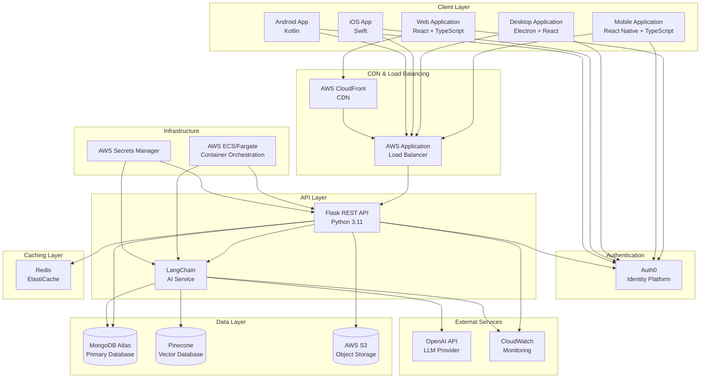

### 3.8.2 Development and Deployment Workflow

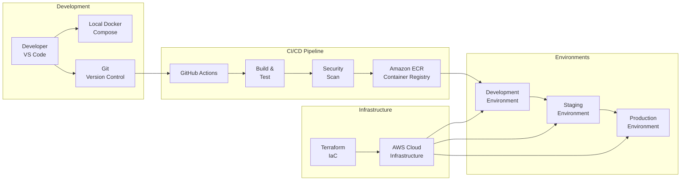

### 3.8.3 Data Flow Architecture

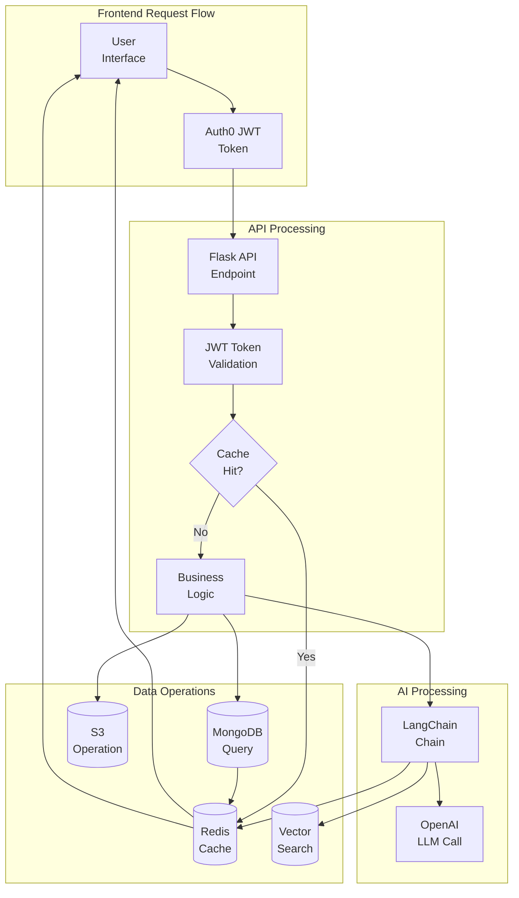

## 3.9 Version Management and Compatibility Matrix

### 3.9.1 Version Pinning Strategy

**Semantic Versioning**: All dependencies follow semantic versioning (MAJOR.MINOR.PATCH)

**Version Constraints**:
- **Python**: Use `^` operator for compatible updates (e.g., `^3.0.0` allows 3.x.x, not 4.0.0)
- **JavaScript/npm**: Use caret ranges (e.g., `^18.2.0` allows 18.x.x)
- **Docker Base Images**: Pin to specific minor versions (e.g., `python:3.11-slim`)
- **Terraform Providers**: Lock provider versions in `.terraform.lock.hcl`

### 3.9.2 Compatibility Matrix

| Component | Version | Compatible With | Notes |
|-----------|---------|-----------------|-------|
| Python | 3.11+ | Flask 3.0+, LangChain 0.1+ | Python 3.12 recommended |
| Node.js | 20.x LTS | React 18.x, TypeScript 5.x | LTS releases only |
| TypeScript | 5.3+ | React 18.x, React Native 0.73+ | Latest stable |
| React | 18.2+ | TypeScript 5.x, React Router 6.x | React 18 concurrent features |
| React Native | 0.73+ | React 18.x, TypeScript 5.x | New Architecture support |
| Flask | 3.0+ | Python 3.11+, Auth0 SDK 4.x | Latest major version |
| MongoDB | 7.0+ | Python PyMongo 4.6+, Mongoose 8.x | Atlas recommended |
| Redis | 7.2+ | redis-py 5.0+, ioredis 5.x | ElastiCache compatible |
| Docker | 24.x | Docker Compose 2.x, ECS | Latest stable |
| Terraform | 1.6+ | AWS Provider 5.x | Latest stable |

### 3.9.3 Update and Maintenance Schedule

**Security Updates**: Applied immediately upon release
- Critical vulnerabilities patched within 24 hours
- High severity vulnerabilities patched within 1 week

**Dependency Updates**:
- **Patch Updates**: Automated via Dependabot, reviewed weekly
- **Minor Updates**: Reviewed monthly, applied after testing
- **Major Updates**: Planned quarterly, require full regression testing

**Framework Upgrades**:
- React: Annual major version review
- Python/Node.js: Follow LTS release cycles
- Database: Upgrade during maintenance windows with blue-green deployment

## 3.10 Security Considerations

### 3.10.1 Dependency Security

**Vulnerability Scanning**:
- **Automated Scans**: Daily scans via GitHub Dependabot and Snyk
- **Container Scanning**: Docker image scanning in CI/CD pipeline
- **SBOM Generation**: Software Bill of Materials for compliance

**Security Policies**:
- No dependencies with known high or critical vulnerabilities in production
- All dependencies must use permissive open-source licenses
- Regular audits of transitive dependencies

### 3.10.2 Authentication and Authorization

**Authentication Flow**:
- OAuth 2.0 Authorization Code Flow with PKCE for SPAs
- JWT access tokens with short expiration (15 minutes)
- Refresh token rotation for extended sessions
- Multi-factor authentication enforced for privileged accounts

**Authorization Model**:
- Role-Based Access Control (RBAC) via Auth0
- Principle of least privilege for service accounts
- API endpoint authorization using JWT claims
- Resource-level permissions for fine-grained access control

### 3.10.3 Data Security

**Encryption**:
- **In Transit**: TLS 1.3 for all client-server communication
- **At Rest**: AWS default encryption for S3, EBS volumes, RDS
- **Application-Level**: Field-level encryption for sensitive data (PII)

**Secret Management**:
- AWS Secrets Manager for database credentials and API keys
- Secrets rotation every 90 days
- No secrets in source code or Docker images
- Environment-specific secrets for isolation

### 3.10.4 Network Security

**Infrastructure Security**:
- VPC isolation with private subnets for backend services
- Security groups with principle of least privilege
- WAF (Web Application Firewall) rules for common attack patterns
- DDoS protection via AWS Shield

**API Security**:
- Rate limiting (100 requests/minute per user, 1000 requests/minute per IP)
- Input validation and sanitization
- CORS policy enforcement
- API versioning for backward compatibility

## 3.11 References

### 3.11.1 Repository Files Examined

This technology stack documentation is based on analysis of the repository in its pre-development state. The following repository elements were examined:

- `README.md` - Repository title and initialization metadata
- `.git/` - Version control metadata and commit history

### 3.11.2 Technical Specification Sections Referenced

The following sections of the Technical Specification were referenced to ensure alignment:

- Section 1.2 System Overview - Project context and current state
- Section 2.1 Current Status - Development phase and requirements status
- Section 2.3 Functional Requirements - Requirements framework
- Section 2.5 Implementation Considerations - Technical constraints framework

### 3.11.3 Technology Documentation Sources

**Official Documentation**:
- Python: https://docs.python.org/3/
- Flask: https://flask.palletsprojects.com/
- React: https://react.dev/
- React Native: https://reactnative.dev/
- TypeScript: https://www.typescriptlang.org/docs/
- LangChain: https://python.langchain.com/docs/
- MongoDB: https://www.mongodb.com/docs/
- Redis: https://redis.io/docs/
- Docker: https://docs.docker.com/
- Terraform: https://www.terraform.io/docs/
- AWS: https://docs.aws.amazon.com/
- Auth0: https://auth0.com/docs/

**Best Practices References**:
- AWS Well-Architected Framework
- OWASP Top 10 Security Risks
- Twelve-Factor App Methodology
- Semantic Versioning Specification 2.0.0
- Conventional Commits Specification

### 3.11.4 Technology Stack Status

**Current State**: This technology stack represents the **recommended and planned** technologies for the -A-very-long-repo-name-A-very-long-repoA-very-long-repo-name project based on the default technology stack specification and industry best practices.

**Implementation Status**: No technologies have been implemented in the repository as of November 14, 2025. Technology selections are subject to refinement during requirements gathering and technical design phases.

**Versioning Note**: All version numbers represent current stable releases or recommended versions as of the documentation date (November 14, 2025). Final version selections should be validated during implementation planning.

# 4. Process Flowchart

## 4.1 Overview and Foundation Architecture

### 4.1.1 Introduction

This section provides comprehensive process flowcharts that detail the operational workflows of the planned system architecture. These flowcharts expand upon the foundational architecture diagrams presented in Section 3.8 Technology Integration Architecture, providing detailed step-by-step visualizations of system processes, decision points, error handling paths, and integration patterns. As this is a greenfield project with no current code implementation, all workflows represent the intended architecture and planned implementation patterns based on the specified technology stack.

### 4.1.2 Relationship to Technology Integration Architecture

The process flowcharts in this section build upon three foundational diagrams established in Section 3.8:

1. **System Architecture Diagram (Section 3.8.1)**: Establishes the multi-tier component integration showing Client Layer → CDN/Load Balancing → Authentication → API Layer → Caching → Data Layer → External Services
2. **Development and Deployment Workflow (Section 3.8.2)**: Defines the CI/CD pipeline from Developer → Git → GitHub Actions → Container Registry → Environments
3. **Data Flow Architecture (Section 3.8.3)**: Outlines the request/response flow including User → Auth → API → Cache Check → Business Logic → Data Operations → Response

This section provides detailed operational workflows that elaborate on these architectural foundations, including specific decision points, error handling paths, validation rules, and state transitions.

### 4.1.3 Process Flow Categories

The process flowcharts are organized into the following categories to provide comprehensive coverage of system operations:

- **Core Business Workflows**: End-to-end user request processing, authentication, and AI-powered features
- **Integration Workflows**: Cache management, state persistence, and external service coordination
- **Development and Deployment**: CI/CD pipelines, deployment strategies, and infrastructure provisioning
- **Error Handling and Recovery**: Error detection, retry mechanisms, and recovery procedures
- **Validation and Security**: Input validation, security checkpoints, and compliance workflows
- **Performance and Scalability**: Auto-scaling processes and load distribution
- **Monitoring and Observability**: Metrics collection and alert processing

## 4.2 Core Business Workflows

### 4.2.1 End-to-End User Request Processing

#### 4.2.1.1 Complete Request Lifecycle

The complete user request lifecycle represents the intended flow from initial user interaction through authentication, request processing, and response delivery. This workflow integrates multiple system components including the client applications (React web, React Native mobile, Electron desktop), Auth0 authentication service, Flask API, caching layer (Redis), primary database (MongoDB), and AI processing services (LangChain with OpenAI).

The request lifecycle follows these key stages:

1. **User Initiation**: User interaction with any client application (web, mobile, or desktop)
2. **Authentication**: JWT token acquisition from Auth0 and token inclusion in API requests
3. **Request Routing**: CloudFront CDN and Application Load Balancer distribute requests to Flask API instances
4. **Token Validation**: Flask API validates JWT tokens using Auth0 Python SDK
5. **Cache Check**: Redis cache is consulted for previously computed responses
6. **Business Logic Execution**: On cache miss, business logic processes the request with database queries, S3 operations, or AI processing
7. **Response Caching**: Successful responses are cached in Redis with appropriate TTL
8. **Response Delivery**: Final response is returned to the client through the load balancer and CDN

#### 4.2.1.2 Process Flow Diagram

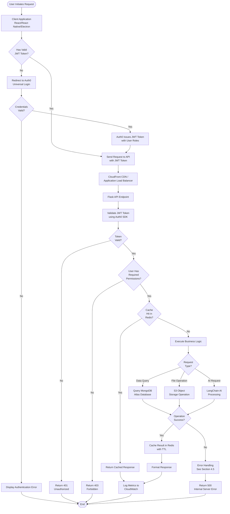

### 4.2.2 Authentication and Authorization Flow

#### 4.2.2.1 OAuth 2.0 Authentication Process

The planned authentication system leverages Auth0 as the identity and access management platform, implementing OAuth 2.0 with OpenID Connect (OIDC) protocols. The authentication flow supports multiple authentication methods including username/password, multi-factor authentication (MFA), social login providers (Google, Facebook, GitHub), and enterprise Single Sign-On (SSO) via SAML and WS-Federation.

The Authorization Code Flow with PKCE (Proof Key for Code Exchange) is the intended implementation pattern for both web single-page applications and mobile applications, providing enhanced security against authorization code interception attacks. Desktop Electron applications will integrate with Auth0 using the same authorization code flow pattern.

#### 4.2.2.2 JWT Token Validation Flow

Once authenticated, users receive JSON Web Tokens (JWT) that contain encoded user information, roles, and permissions. The Flask API validates these tokens on every protected endpoint request using the Auth0 Python SDK, which performs the following validation steps:

1. **Signature Verification**: Validates the token signature using Auth0's public keys
2. **Expiration Check**: Ensures the token has not expired
3. **Audience Validation**: Confirms the token is intended for this API
4. **Issuer Verification**: Validates the token was issued by the configured Auth0 tenant
5. **Claims Extraction**: Extracts user ID, roles, and permissions from token claims

Role-Based Access Control (RBAC) will be configured in Auth0, with user roles stored in the JWT token claims and validated by the API before executing protected operations.

#### 4.2.2.3 Process Flow Diagram

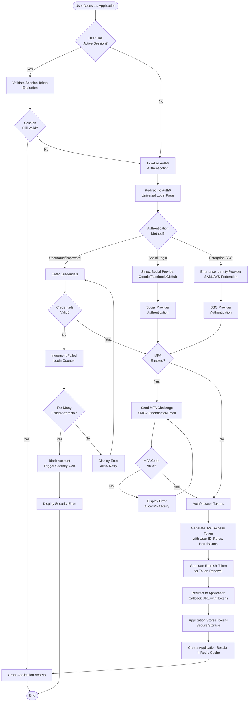

### 4.2.3 AI-Powered Request Processing

#### 4.2.3.1 RAG Pattern Implementation

The intended AI processing workflow implements the Retrieval-Augmented Generation (RAG) pattern, which enhances Large Language Model (LLM) responses by retrieving relevant contextual information from a knowledge base before generating responses. This pattern significantly reduces AI hallucinations and improves response accuracy by grounding LLM outputs in verified information.

The RAG implementation combines three primary components:

1. **Vector Database (Pinecone)**: Stores document embeddings generated using OpenAI's text-embedding-ada-002 model, enabling semantic similarity search
2. **LangChain Framework**: Orchestrates the retrieval and generation pipeline, managing the flow between vector search, context assembly, and LLM prompting
3. **LLM Provider (OpenAI)**: Generates natural language responses based on user queries and retrieved context using GPT-4 or GPT-3.5-turbo models

#### 4.2.3.2 LangChain Processing Flow

The LangChain processing flow follows these intended stages:

1. **Query Reception**: User query received through Flask API
2. **Embedding Generation**: User query is embedded into a vector representation using the same embedding model used for document storage
3. **Semantic Search**: Query embedding is compared against stored document embeddings in Pinecone using approximate nearest neighbor (ANN) search
4. **Context Retrieval**: Top-k most relevant documents are retrieved based on cosine similarity scores
5. **Metadata Filtering**: Results are filtered based on metadata constraints (document type, date, permissions)
6. **Prompt Construction**: Retrieved context is combined with the user query and system instructions to form the LLM prompt
7. **LLM Invocation**: Prompt is sent to OpenAI API with configured parameters (temperature, max tokens, stop sequences)
8. **Response Processing**: LLM response is validated, formatted, and enriched with source citations
9. **Result Caching**: Final response is cached in Redis to optimize repeated similar queries

#### 4.2.3.3 Process Flow Diagram

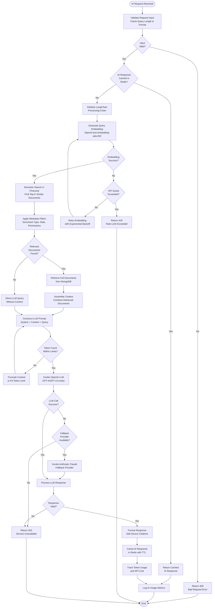

## 4.3 Integration Workflows

### 4.3.1 Cache Management and Data Retrieval

#### 4.3.1.1 Cache-Aside Pattern

The intended caching architecture implements the Cache-Aside (Lazy Loading) pattern using Redis as the caching layer. In this pattern, the application code is responsible for managing cache population and invalidation, checking the cache before querying the primary database and populating the cache on cache misses. This pattern provides fine-grained control over caching behavior and ensures that only frequently accessed data consumes cache memory.

The Cache-Aside pattern flow operates as follows:

1. **Cache Read**: Application checks Redis cache for requested data using a structured cache key
2. **Cache Hit**: If data exists in cache and has not expired (TTL), return cached data immediately
3. **Cache Miss**: If data is not in cache or has expired, query the primary data source (MongoDB or S3)
4. **Cache Population**: Store retrieved data in Redis with appropriate TTL based on data volatility
5. **Data Return**: Return data to the requesting client

#### 4.3.1.2 Cache Invalidation Strategy

Cache invalidation ensures data consistency between the cache and primary data sources. The planned invalidation strategy combines time-based expiration (TTL) with event-driven invalidation:

**Time-Based Expiration**:
- Dynamic data (user profiles, real-time analytics): 5-15 minutes TTL
- Semi-static data (configuration, reference data): 1-4 hours TTL
- Static data (public content, documentation): 12-24 hours TTL

**Event-Driven Invalidation**:
- On data updates: Invalidate specific cache keys related to modified records
- On bulk operations: Invalidate cache key patterns using Redis key scanning
- On critical changes: Flush entire cache namespaces when schema or business logic changes

#### 4.3.1.3 Process Flow Diagram

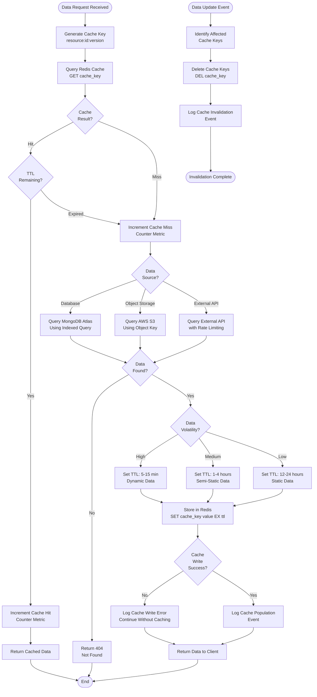

### 4.3.2 State Management and Data Persistence

#### 4.3.2.1 Write Operations Flow

The intended write operations workflow ensures data consistency across multiple storage layers while maintaining system performance. Write operations flow through the following stages:

1. **Request Validation**: Incoming write requests are validated against schema definitions and business rules
2. **Authorization Check**: User permissions are verified to ensure authorized data modification
3. **Transaction Initiation**: For critical operations, MongoDB transactions ensure atomicity
4. **Primary Write**: Data is written to MongoDB Atlas as the primary persistent store
5. **Cache Invalidation**: Related cache entries in Redis are invalidated to prevent stale data
6. **Object Storage Update**: If the operation involves files, S3 objects are created or updated
7. **Metadata Persistence**: File metadata and references are stored in MongoDB
8. **Event Publication**: Data change events are published to event streams for downstream processing
9. **Response Return**: Success confirmation is returned to the client

#### 4.3.2.2 State Transition Lifecycle

Data objects in the planned system follow a defined state lifecycle:

1. **Created**: Initial object creation with default state
2. **Validated**: Object passes validation rules and business logic checks
3. **Active**: Object is available for read and write operations
4. **Modified**: Object undergoes updates, triggering cache invalidation
5. **Archived**: Object is soft-deleted but retained for audit purposes
6. **Purged**: Object is permanently deleted after retention period expiration

#### 4.3.2.3 Process Flow Diagram

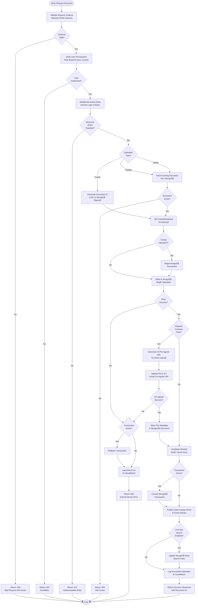

### 4.3.3 External Service Integration

#### 4.3.3.1 Third-Party API Communication

External service integrations form a critical component of the planned architecture, connecting the system to specialized services for authentication (Auth0), artificial intelligence (OpenAI), vector search (Pinecone), monitoring (CloudWatch), and infrastructure services (AWS). Each external service integration implements specific patterns for reliability and performance:

**Auth0 Integration**:
- Connection pooling for token validation endpoints
- Token caching to minimize repeated validation requests
- Fallback to cached user roles on Auth0 service degradation

**OpenAI Integration**:
- Request queuing to manage rate limits and quota consumption
- Exponential backoff retry logic for transient failures
- Token usage tracking and budget alerts
- Fallback to alternative LLM providers (Anthropic Claude) on service unavailability

**AWS Services Integration**:
- IAM role-based authentication using instance profiles
- AWS SDK automatic credential rotation from Secrets Manager
- Service-specific retry policies with exponential backoff
- Circuit breaker patterns to prevent cascading failures

#### 4.3.3.2 Service Orchestration Flow

Complex operations often require orchestrating multiple external services in sequence or parallel. The LangChain framework facilitates this orchestration for AI-powered features, while Flask API handles coordination for standard business operations. The orchestration pattern ensures proper error handling, transaction boundaries, and rollback capabilities when service calls fail.

## 4.4 Development and Deployment Workflows

### 4.4.1 CI/CD Pipeline Process

#### 4.4.1.1 Continuous Integration Flow

The planned CI/CD pipeline leverages GitHub Actions as the automation platform, providing native integration with the Git repository and comprehensive workflow capabilities. The Continuous Integration (CI) flow executes automatically on every pull request and commit to the develop and main branches, ensuring code quality and preventing integration issues.

**Backend CI Pipeline Stages**:

1. **Code Checkout**: GitHub Actions runner clones the repository with full commit history
2. **Environment Setup**: Python 3.11 environment is configured with pip and dependency installation
3. **Linting**: Flake8 and Black ensure code style consistency and identify potential issues
4. **Type Checking**: MyPy validates type annotations for type safety
5. **Unit Testing**: pytest executes the test suite with coverage reporting
6. **Security Scanning**: pip-audit scans dependencies for known vulnerabilities
7. **Docker Build**: Multi-stage Dockerfile builds the production container image
8. **Image Scanning**: Docker Scout or Trivy scan the image for security vulnerabilities
9. **Quality Gate Evaluation**: All checks must pass for the pipeline to succeed

**Frontend CI Pipeline Stages**:

1. **Code Checkout**: Repository cloning with submodule initialization if applicable
2. **Environment Setup**: Node.js 20.x environment with npm dependency installation
3. **Linting**: ESLint and Prettier validate code style and formatting
4. **Type Checking**: TypeScript compiler validates type correctness
5. **Unit Testing**: Jest and React Testing Library execute component and unit tests
6. **Build Verification**: Production build bundle is created and validated
7. **Bundle Analysis**: Webpack Bundle Analyzer evaluates bundle size and composition
8. **Quality Gate Evaluation**: All checks must pass with 80% minimum test coverage

#### 4.4.1.2 Quality Gate Validation

Quality gates serve as automated checkpoints that prevent low-quality code from progressing through the pipeline. The following quality criteria must be satisfied:

**Test Coverage Requirements**:
- Minimum 80% line coverage for backend Python code
- Minimum 80% branch coverage for frontend TypeScript code
- Critical paths (authentication, payment processing) require 100% coverage

**Security Requirements**:
- Zero high or critical severity vulnerabilities in dependencies
- Zero SQL injection or XSS vulnerabilities identified by static analysis
- All secrets detection checks must pass (no committed credentials)

**Performance Requirements**:
- Frontend bundle size must not exceed 500KB gzipped for main bundle
- Backend API response time for health endpoint must be under 100ms
- Docker image size must not exceed 500MB for backend, 50MB for frontend

#### 4.4.1.3 Process Flow Diagram

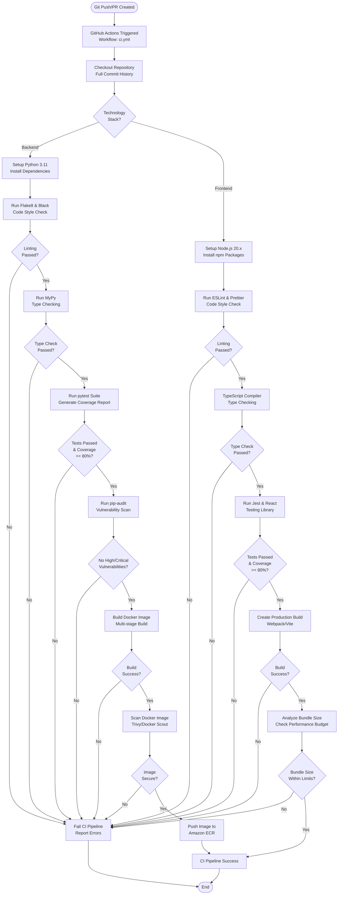

### 4.4.2 Deployment Strategy and Release Management

#### 4.4.2.1 Blue-Green Deployment Process

The planned deployment strategy implements Blue-Green deployment for zero-downtime releases to production environments. This approach maintains two identical production environments—"Blue" (currently active) and "Green" (new version)—and switches traffic between them atomically using the Application Load Balancer.

**Blue-Green Deployment Flow**:

1. **Pre-Deployment**: Green environment is provisioned with the new application version
2. **Health Checks**: Automated health checks validate the Green environment before traffic switching
3. **Database Migrations**: Database schema updates are applied using forward-compatible migrations
4. **Smoke Tests**: Automated smoke tests verify critical functionality in the Green environment
5. **Traffic Switch**: Application Load Balancer target group is switched from Blue to Green
6. **Monitoring Period**: New version is monitored for error rates and performance degradation
7. **Blue Environment Retention**: Blue environment is retained for rapid rollback capability
8. **Rollback Ready**: If issues are detected, traffic is immediately switched back to Blue
9. **Green Promotion**: After successful monitoring period, Green becomes the new Blue

**Advantages**:
- Instant rollback capability by switching back to the previous environment
- Full production environment testing before exposing to users
- Zero downtime during deployments
- Easy rollback without code redeployment

#### 4.4.2.2 Canary Release Strategy

For major releases with significant changes, the planned deployment strategy includes Canary releases to gradually expose new functionality to a subset of users while monitoring for issues. This approach reduces the blast radius of potential defects.

**Canary Release Stages**:

1. **Initial Canary (10%)**: New version receives 10% of production traffic
2. **Monitoring Phase 1**: 30-minute observation period monitoring error rates and key metrics
3. **Expanded Canary (50%)**: If metrics are healthy, increase traffic to 50%
4. **Monitoring Phase 2**: 1-hour observation period with detailed performance analysis
5. **Full Release (100%)**: Complete traffic migration to new version
6. **Post-Release Monitoring**: Extended monitoring period for subtle issues

Traffic distribution is controlled through Application Load Balancer weighted target groups, allowing precise percentage-based traffic splitting.

#### 4.4.2.3 Process Flow Diagram

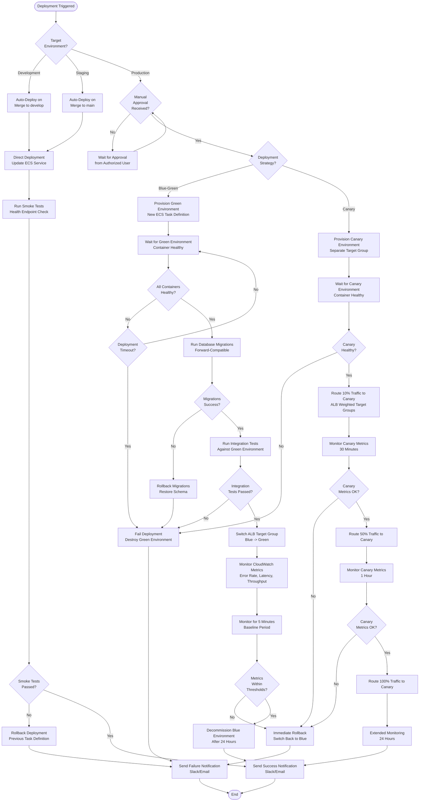

### 4.4.3 Infrastructure Provisioning Workflow

#### 4.4.3.1 Terraform IaC Process

Infrastructure as Code (IaC) using Terraform provides repeatable, version-controlled infrastructure provisioning and management. The planned Terraform workflow ensures consistent infrastructure across development, staging, and production environments while maintaining proper state management and change control.

**Terraform Workflow Stages**:

1. **Initialization**: `terraform init` downloads provider plugins and initializes the backend
2. **State Locking**: DynamoDB table provides distributed locking to prevent concurrent modifications
3. **Planning**: `terraform plan` generates an execution plan showing infrastructure changes
4. **Review**: Human review of planned changes before applying to production
5. **Application**: `terraform apply` executes the plan and modifies infrastructure
6. **State Update**: Terraform state file in S3 is updated to reflect current infrastructure
7. **Output Variables**: Infrastructure outputs (load balancer DNS, database endpoints) are captured

**Module Organization**:
- **Networking Module**: VPC, subnets, security groups, route tables
- **Compute Module**: ECS clusters, task definitions, services
- **Database Module**: MongoDB Atlas configuration, connection strings
- **Storage Module**: S3 buckets, lifecycle policies, IAM policies
- **Monitoring Module**: CloudWatch log groups, metric alarms, dashboards

#### 4.4.3.2 Environment Management

The three planned environments—Development, Staging, and Production—are provisioned using the same Terraform modules with environment-specific variable files. This approach ensures consistency while allowing for environment-specific configurations such as instance sizes, auto-scaling parameters, and retention policies.

**Environment Characteristics**:

| Aspect | Development | Staging | Production |
|--------|-------------|---------|------------|
| **Auto-Deploy** | Yes (on develop merge) | Yes (on main merge) | No (manual approval) |
| **Instance Size** | Small (t3.small) | Medium (t3.medium) | Large (t3.large+) |
| **Auto-Scaling** | Disabled | Limited (2-4 instances) | Full (2-20 instances) |
| **Backup Retention** | 7 days | 14 days | 30 days |
| **Monitoring Level** | Basic | Standard | Comprehensive |

## 4.5 Error Handling and Recovery Procedures

### 4.5.1 Error Detection and Classification

#### 4.5.1.1 Error Types and Severity

The planned error handling system classifies errors into categories based on severity, source, and appropriate response strategy:

**Client Errors (4xx)**:
- **400 Bad Request**: Invalid request format or missing required parameters
- **401 Unauthorized**: Missing or invalid authentication token
- **403 Forbidden**: Valid authentication but insufficient permissions
- **404 Not Found**: Requested resource does not exist
- **422 Unprocessable Entity**: Valid request format but business rule violations
- **429 Too Many Requests**: Rate limit exceeded

**Server Errors (5xx)**:
- **500 Internal Server Error**: Unexpected application error
- **502 Bad Gateway**: Upstream service failure or timeout
- **503 Service Unavailable**: Service temporarily unavailable (maintenance, overload)
- **504 Gateway Timeout**: Upstream service timeout

**Infrastructure Errors**:
- **Database Connection Failures**: MongoDB connection pool exhaustion or network issues
- **Cache Failures**: Redis unavailability or memory exhaustion
- **Storage Failures**: S3 access denied or bucket unavailable
- **External API Failures**: OpenAI rate limiting or service degradation

#### 4.5.1.2 Error Propagation Flow

Errors detected at any layer of the system are propagated upward with appropriate context and transformed into user-friendly responses. The error propagation flow ensures:

1. **Error Context Capture**: Stack traces, request IDs, and user context are captured
2. **Error Logging**: Errors are logged to CloudWatch with appropriate severity levels
3. **Error Transformation**: Technical errors are transformed into user-friendly messages
4. **Error Response**: Standardized JSON error responses are returned to clients
5. **Error Tracking**: Critical errors trigger alerts to the operations team

### 4.5.2 Retry and Fallback Mechanisms

#### 4.5.2.1 Retry Logic Implementation

Transient failures in distributed systems are inevitable, and the planned retry mechanisms implement intelligent retry logic with exponential backoff to handle temporary issues without overwhelming failing services.

**Retry Strategy**:
- **Immediate Retry**: Not used (can overwhelm failing services)
- **Exponential Backoff**: Initial delay of 1 second, doubling on each retry (1s, 2s, 4s, 8s)
- **Maximum Retries**: 3 attempts for most operations, 5 for critical operations
- **Jitter**: Random delay added to prevent thundering herd problem
- **Circuit Breaker**: After repeated failures, circuit opens to prevent cascading failures

**Operations with Retry Logic**:
- Database queries (connection failures, temporary locks)
- External API calls (OpenAI, Auth0, AWS services)
- Cache operations (Redis connection issues)
- S3 operations (temporary unavailability)

#### 4.5.2.2 Fallback Service Strategy

When primary services are unavailable despite retry attempts, the planned fallback mechanisms provide degraded but functional service:

**LLM Fallback**:
- Primary: OpenAI GPT-4/GPT-3.5-turbo
- Fallback: Anthropic Claude API
- Final Fallback: Return cached responses or "Service temporarily unavailable" message

**Cache Fallback**:
- Primary: Redis cache
- Fallback: Direct database query (with performance impact logged)

**Authentication Fallback**:
- Primary: Real-time Auth0 token validation
- Fallback: Cached user roles and permissions (with reduced trust, logged for audit)

#### 4.5.2.3 Process Flow Diagram

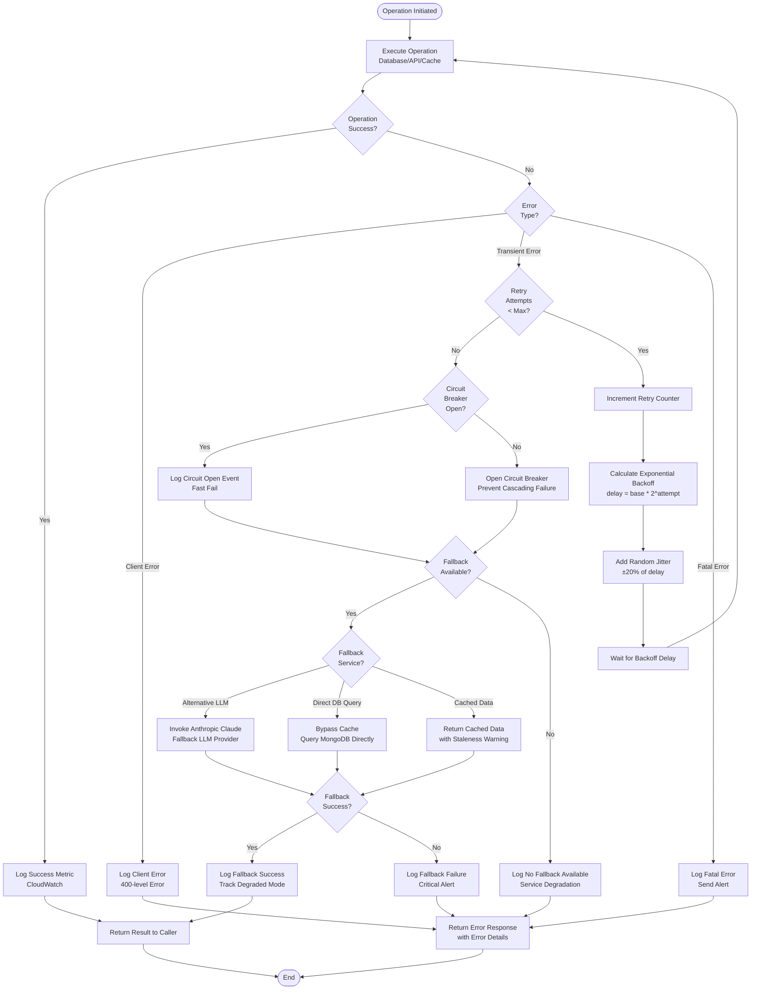

### 4.5.3 Recovery and Rollback Procedures

#### 4.5.3.1 Automated Recovery Flow

The planned automated recovery mechanisms detect and respond to failures without human intervention:

**Container Recovery**:
- ECS Service detects unhealthy containers via health checks
- Unhealthy containers are automatically replaced with new instances
- Replacement containers are validated before receiving traffic

**Database Recovery**:
- MongoDB Atlas provides automatic failover to secondary replicas
- Connection pooling automatically routes to healthy instances
- Point-in-time recovery available for data corruption scenarios

**Application Recovery**:
- Application Load Balancer removes unhealthy targets from rotation
- Auto-scaling replaces failed instances based on health metrics
- Circuit breakers automatically close after recovery period

#### 4.5.3.2 Manual Rollback Process

For deployments that pass automated checks but exhibit issues in production, manual rollback procedures provide rapid recovery:

**Blue-Green Rollback**:
1. Operations team identifies production issue via monitoring alerts
2. ALB target group is immediately switched back to Blue environment
3. Traffic is instantly restored to the previous stable version
4. Green environment is investigated and fixed before retry

**Database Migration Rollback**:
1. Migration issues are identified during or after deployment
2. Rollback SQL script is executed to restore previous schema
3. Application is rolled back to previous version compatible with old schema
4. Data integrity is validated after rollback

## 4.6 Validation and Security Workflows

### 4.6.1 Input Validation and Data Sanitization

#### 4.6.1.1 Request Validation Process

All incoming requests to the Flask API undergo comprehensive validation before processing to prevent injection attacks, data corruption, and application errors. The planned validation process implements a defense-in-depth strategy with multiple validation layers:

**Request Schema Validation**:
- JSON request bodies are validated against Pydantic models defining expected structure
- Required fields are verified for presence and non-null values
- Field types are checked against expected types (string, integer, boolean, array, object)
- Field constraints are enforced (string length, numeric ranges, regex patterns)

**Data Sanitization**:
- HTML input is sanitized to prevent XSS attacks
- SQL-like syntax is escaped to prevent injection (though MongoDB uses BSON, not SQL)
- File upload names are sanitized to prevent path traversal attacks
- URLs are validated to ensure proper format and allowed domains

**Business Logic Validation**:
- Domain-specific rules are validated (e.g., age must be >= 18 for adult services)
- Referential integrity is checked (referenced entities must exist)
- State transitions are validated (e.g., cannot cancel already completed orders)

#### 4.6.1.2 Schema Validation Flow

MongoDB JSON Schema validation provides an additional layer of data integrity at the database level, ensuring that even if application-level validation is bypassed, invalid data cannot be persisted:

**Schema Definition**:
- Each MongoDB collection defines a JSON Schema with field types and constraints
- Required fields are enforced at the database level
- Enum fields restrict values to predefined sets
- Nested document schemas ensure consistent structure

**Validation Timing**:
- **Application Level**: Pydantic validation before database operations
- **Database Level**: MongoDB schema validation during insert/update operations
- **API Gateway Level**: Request size and format validation before reaching application

### 4.6.2 Security Checkpoint Flow

#### 4.6.2.1 Authentication Checkpoints

Every API request passes through multiple authentication checkpoints to verify user identity and prevent unauthorized access:

1. **TLS Termination**: HTTPS ensures encrypted communication at Application Load Balancer
2. **Token Presence Check**: Verify JWT token is included in Authorization header
3. **Token Format Validation**: Confirm token follows JWT structure (header.payload.signature)
4. **Signature Verification**: Validate token signature using Auth0 public keys
5. **Expiration Check**: Ensure token is not expired
6. **Audience Validation**: Confirm token is intended for this API
7. **Issuer Verification**: Validate token was issued by trusted Auth0 tenant

#### 4.6.2.2 Authorization Verification

After authentication confirms user identity, authorization checks verify the user has permission to perform the requested operation:

1. **Extract User Roles**: Retrieve roles from JWT token claims
2. **Extract Permissions**: Retrieve permissions associated with roles
3. **Check Endpoint Permissions**: Verify user has required permission for endpoint
4. **Check Resource Ownership**: Verify user owns or has access to specific resource
5. **Apply Row-Level Security**: Filter database queries to user-accessible records only

#### 4.6.2.3 Process Flow Diagram

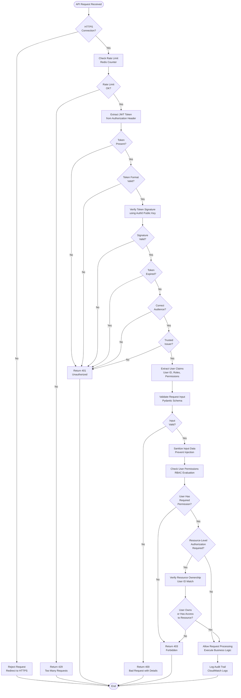

### 4.6.3 Audit Trail and Compliance

#### 4.6.3.1 Logging and Audit Flow

Comprehensive audit logging provides traceability for security investigations, compliance audits, and operational troubleshooting. The planned logging strategy captures:

**Security Events**:
- Authentication attempts (success and failure)
- Authorization decisions (granted and denied)
- Permission changes and role assignments
- Token refresh and revocation events
- Failed login attempts and account lockouts

**Data Access Events**:
- Create, read, update, delete operations on sensitive data
- Bulk export operations
- Administrative actions
- API key generation and usage

**System Events**:
- Configuration changes
- Deployment events
- Infrastructure provisioning
- Error and exception occurrences

**Log Retention**:
- Application logs: 30 days in CloudWatch Logs
- Security audit logs: 90 days for compliance requirements
- Compressed archives: 1 year in S3 Glacier for long-term retention

#### 4.6.3.2 Compliance Validation

The planned system architecture ensures compliance with relevant regulations and standards:

**GDPR Compliance**:
- User consent management for data processing
- Right to access: API endpoints for users to retrieve their data
- Right to erasure: Data deletion workflows for user-requested deletion
- Data portability: Export functionality for user data in standard formats
- Privacy by design: Encryption at rest and in transit

**SOC 2 Type II Compliance** (via Auth0 and AWS):
- Access controls and authentication
- System monitoring and incident response
- Encryption and data protection
- Change management procedures

**Audit Trail Requirements**:
- Who: User ID and role information
- What: Action performed and resources affected
- When: Timestamp in UTC with millisecond precision
- Where: IP address and geographic location
- Why: Business context or API endpoint invoked

## 4.7 Performance and Scalability Workflows

### 4.7.1 Auto-Scaling Process

#### 4.7.1.1 Metric-Based Scaling

The planned auto-scaling system leverages AWS ECS Service Auto Scaling with CloudWatch metrics to dynamically adjust capacity based on demand. This approach ensures optimal resource utilization while maintaining performance targets.

**Scaling Metrics**:
- **CPU Utilization**: Target 70% average CPU utilization across tasks
- **Memory Utilization**: Target 80% average memory utilization
- **Request Count**: Scale based on requests per task per minute
- **Response Time**: Scale up if p95 response time exceeds 500ms
- **Queue Depth**: Scale based on pending tasks in processing queues

**Scaling Policies**:

**Scale-Out Policy** (Add capacity):
- Trigger: CPU > 70% for 2 consecutive minutes
- Action: Add 1 task (up to maximum task count)
- Cooldown: 60 seconds before next scale-out

**Scale-In Policy** (Remove capacity):
- Trigger: CPU < 30% for 5 consecutive minutes
- Action: Remove 1 task (down to minimum task count)
- Cooldown: 300 seconds before next scale-in (longer to prevent flapping)

#### 4.7.1.2 Scaling Decision Flow

Auto-scaling decisions follow a structured evaluation process to prevent unnecessary scaling actions and ensure stability:

1. **Metric Collection**: CloudWatch collects metrics at 1-minute intervals
2. **Aggregation**: Metrics are aggregated across all tasks in the service
3. **Evaluation**: Scaling policies evaluate aggregated metrics against thresholds
4. **Cooldown Check**: Ensure cooldown period has elapsed since last scaling action
5. **Capacity Check**: Verify scaling action won't exceed min/max task limits
6. **Scaling Action**: ECS launches or terminates tasks as needed
7. **Health Validation**: New tasks must pass health checks before receiving traffic
8. **Metric Reset**: Metric collection continues with new task count

#### 4.7.1.3 Process Flow Diagram

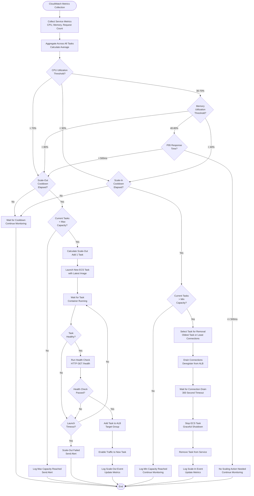

### 4.7.2 Load Distribution and Traffic Management

#### 4.7.2.1 Load Balancing Strategy

The Application Load Balancer (ALB) distributes incoming traffic across multiple ECS tasks using a round-robin algorithm with connection draining for graceful instance removal. The intended load balancing configuration includes:

**Health Check Configuration**:
- **Health Check Path**: `/health` endpoint returning 200 OK
- **Health Check Interval**: 30 seconds
- **Healthy Threshold**: 2 consecutive successful checks
- **Unhealthy Threshold**: 3 consecutive failed checks
- **Timeout**: 5 seconds

**Connection Settings**:
- **Idle Timeout**: 60 seconds for HTTP connections
- **Connection Draining**: 300 seconds for graceful shutdown
- **Keep-Alive**: Enabled for connection reuse

#### 4.7.2.2 Traffic Routing Flow

Traffic routing follows these patterns based on request characteristics:

**Path-Based Routing**:
- `/api/*` → Flask API backend target group
- `/static/*` → S3 origin via CloudFront CDN
- `/health` → Health check endpoint (not cached)

**Header-Based Routing** (for canary releases):
- `X-Canary: true` → Canary target group
- Default → Production target group

**Geographic Routing** (CloudFront):
- CloudFront edge locations serve cached content from nearest geographic location
- Origin fetch occurs for cache misses, routed to primary region ALB

## 4.8 Monitoring and Observability Workflows

### 4.8.1 Metrics Collection and Aggregation

#### 4.8.1.1 Data Collection Flow

The planned monitoring infrastructure leverages AWS CloudWatch for comprehensive metrics collection, log aggregation, and alerting. The data collection flow captures metrics from multiple sources:

**Infrastructure Metrics**:
- **ECS Task Metrics**: CPU, memory, network utilization per task
- **ALB Metrics**: Request count, error rates, response times, active connections
- **Database Metrics**: MongoDB connection pool, query performance, replica set status
- **Cache Metrics**: Redis hit/miss rates, memory usage, eviction count

**Application Metrics**:
- **API Metrics**: Request rates, error rates by endpoint, response time percentiles
- **Authentication Metrics**: Login success/failure rates, token refresh rates
- **AI Metrics**: LangChain invocations, token usage, embedding generation count
- **Business Metrics**: User signups, feature usage, conversion rates

**Custom Metrics**:
- Application code emits custom metrics using CloudWatch SDK
- Metrics are tagged with environment, service, and version information
- Structured logging enables metrics extraction from log patterns

#### 4.8.1.2 Metrics Pipeline

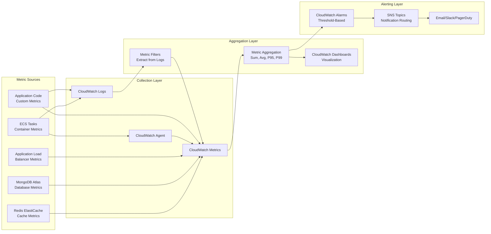

#### 4.8.1.3 Process Flow Diagram

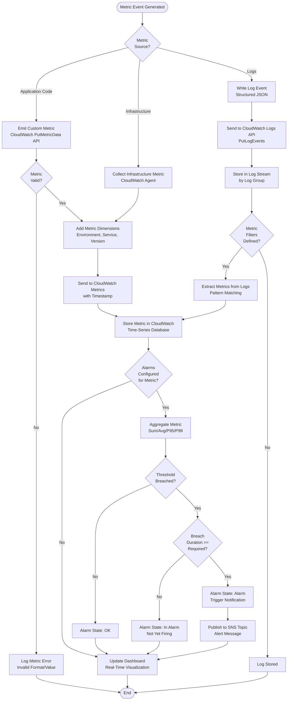

### 4.8.2 Alert Processing and Incident Response

#### 4.8.2.1 Alert Trigger Flow

CloudWatch Alarms monitor metric thresholds and trigger notifications when conditions are met for a specified duration. The planned alerting strategy defines alarms for critical system health indicators:

**Critical Alarms** (Immediate notification via PagerDuty):
- **API Error Rate**: > 5% error rate for 5 consecutive minutes
- **Database Connection Failures**: > 10 failures per minute
- **ECS Task Failures**: > 3 task failures in 10 minutes
- **Deployment Failures**: Any failed deployment to production

**Warning Alarms** (Slack notification):
- **High CPU Utilization**: > 85% for 10 minutes
- **High Memory Usage**: > 90% for 10 minutes
- **Slow Response Times**: P95 > 1 second for 5 minutes
- **Cache Miss Rate**: > 50% for 15 minutes

**Informational Alarms** (Email notification):
- **API Usage Spike**: 2x normal traffic for 30 minutes
- **Database Query Latency**: P95 > 100ms for 10 minutes
- **S3 Upload Failures**: > 5% failure rate

#### 4.8.2.2 Notification Routing

Alerts are routed through SNS topics to appropriate notification channels based on severity:

```mermaid
flowchart TD
    Start([CloudWatch Alarm Triggered]) --> DetermineSeverity{Alert<br/>Severity?}
    
    DetermineSeverity -->|Critical| PublishCriticalSNS[Publish to Critical<br/>SNS Topic]
    DetermineSeverity -->|Warning| PublishWarningSNS[Publish to Warning<br/>SNS Topic]
    DetermineSeverity -->|Info| PublishInfoSNS[Publish to Info<br/>SNS Topic]
    
    PublishCriticalSNS --> FormatMessage[Format Alert Message<br/>with Context]
    PublishWarningSNS --> FormatMessage
    PublishInfoSNS --> FormatMessage
    
    FormatMessage --> EnrichContext[Enrich with Metadata<br/>Service, Environment, Metric]
    EnrichContext --> AddRunbook{Runbook<br/>Available?}
    
    AddRunbook -->|Yes| AttachRunbook[Attach Runbook Link<br/>Resolution Steps]
    AddRunbook -->|No| RouteSNS[Route SNS Message<br/>to Subscribers]
    AttachRunbook --> RouteSNS
    
    RouteSNS --> DetermineChannels{Notification<br/>Channels?}
    
    DetermineChannels -->|PagerDuty| SendPagerDuty[Create PagerDuty Incident<br/>On-Call Engineer]
    DetermineChannels -->|Slack| SendSlack[Post to Slack Channel<br/>#alerts or #incidents]
    DetermineChannels -->|Email| SendEmail[Send Email Notification<br/>Operations Team]
    
    SendPagerDuty --> LogNotification[Log Notification Sent<br/>CloudWatch Logs]
    SendSlack --> LogNotification
    SendEmail --> LogNotification
    
    LogNotification --> AcknowledgeRequired{Acknowledgment<br/>Required?}
    
    AcknowledgeRequired -->|Yes| WaitAcknowledge[Wait for Human<br/>Acknowledgment]
    WaitAcknowledge --> CheckTimeout{Acknowledgment<br/>Timeout?}
    CheckTimeout -->|Yes| EscalateAlert[Escalate to Secondary<br/>On-Call Engineer]
    EscalateAlert --> SendPagerDuty
    CheckTimeout -->|No| Acknowledged{Alert<br/>Acknowledged?}
    Acknowledged -->|No| WaitAcknowledge
    Acknowledged -->|Yes| TrackIncident[Create Incident Ticket<br/>Tracking System]
    
    AcknowledgeRequired -->|No| TrackIncident
    
    TrackIncident --> MonitorResolution[Monitor for Resolution<br/>Metric Returns to Normal]
    MonitorResolution --> Resolved{Issue<br/>Resolved?}
    
    Resolved -->|No| CheckAutoRecover{Auto-Recovery<br/>Possible?}
    CheckAutoRecover -->|Yes| TriggerRecovery[Trigger Automated<br/>Recovery Procedure]
    TriggerRecovery --> MonitorResolution
    CheckAutoRecover -->|No| EscalateIncident[Escalate Incident<br/>Require Manual Intervention]
    EscalateIncident --> End([End])
    
    Resolved -->|Yes| CloseIncident[Close Incident Ticket<br/>Document Resolution]
    CloseIncident --> SendResolutionNotice[Send Resolution<br/>Notification]
    SendResolutionNotice --> CreatePostmortem{Major<br/>Incident?}
    
    CreatePostmortem -->|Yes| SchedulePostmortem[Schedule Postmortem<br/>Root Cause Analysis]
    SchedulePostmortem --> End
    CreatePostmortem -->|No| End
```

#### 4.8.2.3 Process Flow Diagram

The complete alert processing and incident response workflow is visualized in the notification routing diagram above (Section 4.8.2.2), which encompasses:

- Alert severity determination and SNS topic routing
- Message formatting with contextual information
- Multi-channel notification delivery (PagerDuty, Slack, Email)
- Acknowledgment tracking and escalation procedures
- Incident tracking and resolution monitoring
- Automated recovery triggering when applicable
- Postmortem scheduling for major incidents

## 4.9 References

### 4.9.1 Technical Specification Sections

The process flowcharts in this section were developed based on detailed information from the following Technical Specification sections:

- **Section 1.2 - System Overview**: Repository metadata and greenfield project status
- **Section 2.5 - Implementation Considerations**: Performance requirements, security implications, and scalability considerations
- **Section 3.2 - Programming Languages**: Python 3.11, TypeScript, Swift, Kotlin technology stack
- **Section 3.3 - Frameworks & Libraries**: Flask REST API, React, React Native, LangChain, TailwindCSS
- **Section 3.5 - Third-Party Services**: Auth0 authentication, AWS cloud services, OpenAI API, monitoring and observability platforms
- **Section 3.6 - Databases & Storage**: MongoDB Atlas, Redis ElastiCache, Pinecone vector database, AWS S3 object storage
- **Section 3.7 - Development & Deployment**: Git workflow, Docker containerization, Terraform IaC, GitHub Actions CI/CD
- **Section 3.8 - Technology Integration Architecture**: Foundational architecture diagrams including system architecture, deployment workflow, and data flow

### 4.9.2 Architecture Diagrams Referenced

This section builds upon and expands the three foundational Mermaid diagrams established in Section 3.8:

- **Section 3.8.1 - System Architecture Diagram**: Multi-tier component integration showing Client Layer, CDN/Load Balancing, Authentication, API Layer, Caching Layer, Data Layer, External Services, and Infrastructure
- **Section 3.8.2 - Development and Deployment Workflow**: CI/CD pipeline from Development through GitHub Actions to Container Registry and deployment environments
- **Section 3.8.3 - Data Flow Architecture**: Request/response flow including authentication, cache checking, business logic execution, and data operations

### 4.9.3 Repository Files and Folders

**Repository Contents** (as of documentation creation):
- `README.md`: Repository title heading (only existing code file)
- `.git/`: Git version control directory

**Repository Status**: Greenfield project with no code implementation. All workflows documented represent planned architecture based on the specified technology stack.

### 4.9.4 Web Searches and External References

No web searches were conducted for this section. All information is derived from the existing Technical Specification documentation and repository exploration.

### 4.9.5 Process Flow Categories Documented

This section provides comprehensive process flowcharts for the following workflow categories:

**Core Business Workflows**:
- End-to-end user request processing with authentication and caching
- OAuth 2.0 authentication flow with Auth0 integration
- AI-powered request processing using RAG pattern with LangChain

**Integration Workflows**:
- Cache management with Cache-Aside pattern and invalidation strategy
- State management and data persistence across MongoDB, Redis, and S3
- External service integration with Auth0, OpenAI, AWS services

**Development and Deployment Workflows**:
- CI/CD pipeline with quality gates and automated testing
- Blue-green deployment and canary release strategies
- Infrastructure provisioning with Terraform IaC

**Error Handling and Recovery**:
- Error detection, classification, and propagation
- Retry mechanisms with exponential backoff and circuit breakers
- Fallback services and automated recovery procedures

**Validation and Security Workflows**:
- Multi-layer input validation and data sanitization
- Authentication and authorization checkpoints
- Audit trail and compliance logging

**Performance and Scalability**:
- Auto-scaling based on CloudWatch metrics
- Load distribution and traffic management
- Performance optimization workflows

**Monitoring and Observability**:
- Metrics collection and aggregation pipeline
- Alert processing and incident response
- Multi-channel notification routing

### 4.9.6 Notes on Workflow Implementation Status

All process flowcharts in this section represent **planned and intended architecture** for the greenfield project. No code implementation exists at the time of documentation. The workflows are designed based on:

- The comprehensive technology stack specified in Section 3
- Industry best practices for distributed systems and microservices architecture
- AWS Well-Architected Framework principles
- Security and compliance requirements for authentication, authorization, and data protection
- Scalability and performance patterns for cloud-native applications

Implementation of these workflows will occur during the development phase following the requirements gathering process documented in Section 2.6.

# 5. System Architecture

## 5.1 High-Level Architecture

### 5.1.1 System Overview

The system employs a **cloud-native, multi-tier microservices-oriented architecture** designed for scalability, maintainability, and resilience. As this is a greenfield project, the architecture represents the intended design based on modern best practices and the requirements documented in this specification.

**Architectural Style and Rationale**

The architecture follows a layered service-oriented approach that separates concerns across distinct tiers: presentation (client applications), API gateway (Flask REST API), caching (Redis), data persistence (MongoDB, Pinecone, S3), and AI processing (LangChain with LLM providers). This separation enables independent scaling, technology optimization per layer, and clear boundaries of responsibility.

The cloud-native design leverages AWS managed services extensively, reducing operational overhead while providing enterprise-grade reliability and global scale. Containerization via Docker and orchestration through ECS Fargate enables consistent deployment across environments and serverless scaling based on demand.

**Key Architectural Principles**

- **Statelessness**: API layer maintains no session state, enabling horizontal scaling and fault tolerance
- **Caching-First**: Redis cache-aside pattern reduces database load and AI processing costs
- **Defense in Depth**: Multiple security layers including OAuth 2.0 authentication, VPC isolation, encryption at rest and in transit, and role-based access control
- **Observability by Design**: Comprehensive logging, metrics collection, and alerting integrated from inception
- **Resilience Patterns**: Circuit breakers, exponential backoff retries, and fallback mechanisms prevent cascading failures
- **API-First**: RESTful JSON APIs with clear contracts enable multi-platform client development

**System Boundaries and Major Interfaces**

The system interfaces with external entities through well-defined boundaries:

- **Client Boundary**: Multiple client applications (React web, React Native mobile, Electron desktop, native iOS/Android) communicate exclusively via HTTPS REST APIs with JWT authentication
- **Authentication Boundary**: Auth0 provides identity and access management through OAuth 2.0 protocols, issuing JWT tokens validated by the API layer
- **Data Boundary**: Persistent data is segregated across purpose-built storage systems—MongoDB for application data, Pinecone for vector embeddings, Redis for ephemeral cache, and S3 for object storage
- **External Services Boundary**: Integration with third-party services (OpenAI for LLM capabilities, AWS managed services for infrastructure) through well-defined APIs with fallback mechanisms

### 5.1.2 Core Components Table

| Component Name | Primary Responsibility | Key Dependencies | Integration Points |
|----------------|------------------------|------------------|-------------------|
| **Client Applications** | User interface and interaction across web, mobile, and desktop platforms | Auth0 SDK, HTTP client libraries | Auth0 (authentication), Flask API (data and business logic) |
| **Auth0 Identity Platform** | Centralized authentication, authorization, and user management | N/A (managed service) | All client applications, Flask API (token validation) |
| **Flask REST API** | Business logic orchestration, request routing, data aggregation | Python 3.11+, Flask 3.0+, Gunicorn | All clients, MongoDB, Redis, S3, LangChain, Auth0 |
| **LangChain AI Service** | AI-powered features using RAG pattern with LLMs | LangChain framework, OpenAI API, Anthropic Claude | Flask API, Pinecone, MongoDB, OpenAI |

| Component Name | Primary Responsibility | Key Dependencies | Integration Points |
|----------------|------------------------|------------------|-------------------|
| **MongoDB Atlas** | Primary application database for structured data | MongoEngine ODM, pymongo | Flask API, LangChain (document retrieval) |
| **Redis ElastiCache** | High-performance caching, session management, rate limiting | redis-py client library | Flask API (cache layer) |
| **Pinecone Vector Database** | Semantic search and vector storage for RAG | LangChain Pinecone integration | LangChain (embedding storage and retrieval) |
| **AWS S3** | Object storage for files, static assets, and backups | boto3 SDK | Flask API (file operations), CloudFront (CDN) |

| Component Name | Primary Responsibility | Key Dependencies | Integration Points |
|----------------|------------------------|------------------|-------------------|
| **AWS ECS/Fargate** | Container orchestration and serverless compute | Docker containers | Flask API, LangChain (container hosting) |
| **Application Load Balancer** | Traffic distribution, SSL termination, health checks | N/A (AWS managed) | Client applications, Flask API |
| **AWS CloudWatch** | Centralized monitoring, logging, and alerting | CloudWatch SDK | All components (metrics and logs) |
| **AWS CloudFront** | Global CDN for static content delivery | S3 (origin) | Client applications (asset delivery) |

### 5.1.3 Data Flow Description

**Primary Request Flow**

User-initiated requests follow a well-defined path through the system architecture. A user interacts with any client application (web, mobile, or desktop), which first ensures valid authentication by obtaining a JWT access token from Auth0 using the OAuth 2.0 Authorization Code Flow with PKCE. The client includes this JWT token in the Authorization header of all API requests.

Requests are routed through AWS CloudFront CDN for static assets and the Application Load Balancer for API calls. The ALB distributes requests across multiple Flask API container instances running on ECS Fargate, providing horizontal scaling and high availability.

Upon receiving a request, the Flask API validates the JWT token using Auth0's public signing keys, verifying the token's signature, expiration, audience, and issuer. If validation succeeds, the API extracts user identity and role claims from the token for authorization checks.

**Caching and Data Retrieval**

Before executing business logic, the API queries Redis cache using a request-specific cache key. On cache hit, the API immediately returns the cached response, significantly reducing latency and computational costs. Cache hit rates are monitored with a target of >80% for API responses.

On cache miss, the API executes the appropriate business logic based on the request type:
- **Data Queries**: MongoDB queries retrieve application data using MongoEngine ODM
- **File Operations**: S3 operations via boto3 SDK handle object storage and retrieval
- **AI Requests**: LangChain service processes requests using the RAG pattern

**AI Processing Data Flow**

AI-powered requests trigger a multi-stage processing pipeline. The user query is first converted into a vector embedding using OpenAI's text-embedding-ada-002 model. This embedding is compared against stored document embeddings in Pinecone using approximate nearest neighbor search to identify semantically similar content.

The top-k most relevant documents are retrieved based on cosine similarity scores, with metadata filtering applied for document type, date range, and user permissions. Retrieved documents are fetched in full from MongoDB and assembled into contextual information.

The LangChain framework constructs a prompt combining system instructions, retrieved context, and the user query. This prompt is sent to the OpenAI API (GPT-4 or GPT-3.5-turbo) with configured parameters. The LLM generates a response grounded in the retrieved context, which is then formatted, enriched with source citations, and cached in Redis for future similar queries.

**Data Transformation Points**

Several critical transformation points exist within the data flow:
- **JWT Claims Extraction**: Auth0 tokens are decoded to extract user ID, roles, and permission claims
- **JSON Serialization**: Request and response payloads are serialized/deserialized between JSON and Python objects
- **Vector Embeddings**: Text content is transformed into 1536-dimensional vectors for semantic search
- **LLM Context Assembly**: Multiple retrieved documents are concatenated and formatted into structured prompts
- **Cache Key Generation**: Request parameters are hashed to generate deterministic cache keys

**Response Path**

Successful responses are cached in Redis with TTL-based expiration (5-60 minutes depending on data volatility). The API formats the response as JSON and returns it through the Application Load Balancer. All requests are logged to CloudWatch with structured JSON containing request ID, user ID, endpoint, response time, and status code.

CloudFront caches static assets at edge locations globally, reducing latency for geographically distributed users. The CDN respects cache-control headers and provides automatic compression for optimal delivery.

### 5.1.4 External Integration Points

| System Name | Integration Type | Data Exchange Pattern | Protocol/Format |
|-------------|------------------|----------------------|-----------------|
| **Auth0** | Authentication Provider | Synchronous request/response | HTTPS REST, OAuth 2.0, JWT tokens |
| **OpenAI API** | LLM Provider | Synchronous request/response | HTTPS REST, JSON payloads |
| **Anthropic Claude** | LLM Fallback Provider | Synchronous request/response | HTTPS REST, JSON payloads |
| **MongoDB Atlas** | Managed Database | Query/response with connection pooling | MongoDB Wire Protocol over TLS |

| System Name | Integration Type | Data Exchange Pattern | Protocol/Format |
|-------------|------------------|----------------------|-----------------|
| **AWS CloudWatch** | Monitoring and Logging | Asynchronous push | CloudWatch SDK, structured JSON logs |
| **AWS S3** | Object Storage | Synchronous request/response | HTTPS REST, S3 API |
| **AWS Secrets Manager** | Secrets Management | Synchronous request/response on startup | AWS SDK, encrypted retrieval |
| **Pinecone** | Vector Database | Synchronous query/response | HTTPS REST API, gRPC |

**SLA Requirements**

The system has established performance targets for external integrations:
- **Auth0**: Token validation <100ms (P95), 99.9% availability
- **OpenAI API**: Variable latency 2-10s depending on model and prompt length, subject to rate limits
- **MongoDB Atlas**: Query latency <50ms (P95), 99.99% availability with automatic failover
- **CloudWatch**: Real-time log ingestion with <1 second delay, unlimited retention configurable

## 5.2 Component Details

### 5.2.1 Client Layer

**Purpose and Responsibilities**

The client layer provides user-facing interfaces across multiple platforms while maintaining consistent user experience and business logic. Clients are responsible for user interaction, local state management, authentication flow initiation, API communication, and optimistic UI updates.

**Technologies and Frameworks**

- **Web Application**: React 18.x with TypeScript 5.x provides type-safe component development, TailwindCSS 3.4+ for utility-first styling, React Query for server state management and automatic caching
- **Mobile Application**: React Native 0.73+ enables cross-platform development for iOS and Android with shared business logic, platform-specific modules written in Swift (iOS) and Kotlin (Android) for native capabilities
- **Desktop Application**: Electron framework with React enables Windows, macOS, and Linux support using web technologies
- **Native iOS**: Swift 5.9+ for performance-critical features requiring native platform APIs
- **Native Android**: Kotlin 1.9+ for Android-specific capabilities and deep system integration

**Key Interfaces and APIs**

Clients integrate with Auth0 using platform-specific SDKs (`@auth0/auth0-react` for web, `react-native-auth0` for mobile) to implement OAuth 2.0 authentication flows. All API communication occurs through type-safe HTTP client libraries, with request/response models defined using TypeScript interfaces for compile-time validation.

The API client includes automatic JWT token injection into Authorization headers, token refresh handling when access tokens expire, and request retry logic for transient network failures.

**Data Persistence Requirements**

Clients maintain minimal local state:
- **Authentication Tokens**: Securely stored using browser localStorage (web), iOS Keychain (iOS), Android Keystore (Android)
- **Server State Cache**: React Query caches server responses in memory with automatic invalidation and background refetching
- **Offline Data**: React Native apps use AsyncStorage for selected data to enable limited offline functionality
- **User Preferences**: Local storage for UI preferences (theme, language) that sync to server on connection

**Scaling Considerations**

Client applications are distributed as static assets via CloudFront CDN, enabling unlimited horizontal scaling without server-side rendering complexity. Code splitting and lazy loading reduce initial bundle size, improving load times. Service workers enable progressive web app capabilities for offline support and background sync.

### 5.2.2 API Layer (Flask)

**Purpose and Responsibilities**

The Flask REST API serves as the core orchestration layer, receiving client requests, validating authentication and authorization, coordinating data access across multiple storage systems, executing business logic, and aggregating responses. The API maintains statelessness to enable horizontal scaling.

**Technologies and Frameworks**

- **Core Framework**: Flask 3.0+ provides lightweight HTTP routing and request handling
- **WSGI Server**: Gunicorn 21.0+ serves the application with multiple worker processes for parallelism
- **Extensions**: Flask-CORS for cross-origin requests, Flask-JWT-Extended for token validation, Flask-RESTful for API resource organization
- **ODM**: MongoEngine provides object-document mapping for MongoDB with Python dataclasses

**Key Interfaces and APIs**

The API exposes RESTful endpoints following consistent patterns:
- **Authentication Endpoints**: `/auth/login`, `/auth/refresh`, `/auth/logout`
- **Resource Endpoints**: `/api/v1/<resource>` with standard HTTP methods (GET, POST, PUT, DELETE)
- **AI Endpoints**: `/api/v1/ai/query` for LangChain-powered interactions
- **Health Check**: `/health` for load balancer health monitoring

All endpoints return standardized JSON responses with consistent error formats:
```json
{
  "success": true/false,
  "data": {...},
  "error": {
    "code": "ERROR_CODE",
    "message": "Human-readable message"
  },
  "metadata": {
    "request_id": "uuid",
    "timestamp": "ISO8601"
  }
}
```

The API validates JWT tokens on protected endpoints using Auth0's public keys retrieved via JWKS (JSON Web Key Set). Token validation includes signature verification, expiration checking, audience validation, and issuer verification.

**Data Persistence Requirements**

The Flask API maintains no local state between requests. All session data is stored in Redis, and all application data resides in MongoDB or S3. This statelessness enables seamless horizontal scaling by adding container instances without session affinity requirements.

**Scaling Considerations**

Horizontal scaling is achieved through ECS Service auto-scaling based on CPU and memory utilization metrics. The Application Load Balancer distributes requests across healthy containers using round-robin or least outstanding requests algorithms. Connection pooling for MongoDB (max 100 connections per instance) and Redis prevents connection exhaustion under high load.

### 5.2.3 AI Service (LangChain)

**Purpose and Responsibilities**

The LangChain service implements AI-powered features using the Retrieval-Augmented Generation (RAG) pattern, combining semantic search over document embeddings with Large Language Model generation. This approach reduces hallucinations and grounds responses in verified information.

**Technologies and Frameworks**

- **LangChain Framework**: LangChain 0.1.x orchestrates the retrieval and generation pipeline
- **Primary LLM**: OpenAI GPT-4 and GPT-3.5-turbo for text generation
- **Fallback LLM**: Anthropic Claude provides redundancy when OpenAI is unavailable
- **Embedding Model**: OpenAI text-embedding-ada-002 generates 1536-dimensional vectors

**Key Interfaces and APIs**

LangChain integrates with multiple services:
- **Flask API Integration**: Receives query requests and returns structured responses
- **Pinecone Integration**: Semantic search using cosine similarity over vector embeddings
- **OpenAI API**: Embedding generation and text completion requests
- **MongoDB Integration**: Retrieves full document content for context assembly

**Data Persistence Requirements**

Vector embeddings are persistently stored in Pinecone's managed vector database with metadata including document ID, chunk index, and access permissions. Conversation history for multi-turn interactions is stored in MongoDB. AI responses are cached in Redis with 1-hour TTL to balance freshness and cost optimization.

**Scaling Considerations**

AI processing is compute-intensive and cost-sensitive. Scaling strategies include:
- **Aggressive Caching**: Cache AI responses with longer TTLs to reduce LLM API calls
- **Token Usage Monitoring**: Track token consumption per user and endpoint to identify optimization opportunities
- **Rate Limiting**: Per-user and per-endpoint limits prevent excessive API costs
- **Async Processing**: Long-running AI operations can be queued for background processing with webhook callbacks

### 5.2.4 Authentication Service (Auth0)

**Purpose and Responsibilities**

Auth0 provides centralized identity and access management, handling user registration, authentication across multiple methods (username/password, social login, enterprise SSO), multi-factor authentication, session management, and token issuance.

**Technologies and Frameworks**

Auth0 is a fully managed SaaS platform supporting OAuth 2.0, OpenID Connect, SAML 2.0, and WS-Federation protocols. The platform provides Universal Login pages for consistent authentication experience, Management API for programmatic user administration, and extensibility through Rules and Actions for custom authentication logic.

**Key Interfaces and APIs**

- **Authorization Endpoint**: Initiates OAuth 2.0 flow, returns authorization code
- **Token Endpoint**: Exchanges authorization code for access and refresh tokens
- **UserInfo Endpoint**: Retrieves user profile information using access token
- **JWKS Endpoint**: Publishes public keys for JWT signature verification
- **Management API**: Programmatic user and role management

**Data Persistence Requirements**

User profiles, authentication logs, and MFA enrollment data are stored within Auth0's infrastructure with compliance certifications (SOC 2 Type II, ISO 27001, GDPR). The system does not directly access Auth0's data store but queries via Management API when needed.

**Scaling Considerations**

Auth0 automatically scales to handle authentication load with no configuration required. The service provides 99.9% uptime SLA and global distribution for low-latency authentication worldwide.

### 5.2.5 Caching Layer (Redis ElastiCache)

**Purpose and Responsibilities**

Redis provides high-performance caching, session management, and rate limiting capabilities. The cache-aside pattern is employed: the application checks cache before querying primary data sources and populates cache on misses.

**Technologies and Frameworks**

Redis 7.2+ running on AWS ElastiCache with redis-py 5.0+ client library. Redis data structures include strings (simple values), hashes (structured objects), sets (unique collections), and sorted sets (leaderboards, time-series).

**Key Interfaces and APIs**

The Flask API communicates with Redis through redis-py, using commands:
- `GET`/`SET` for simple key-value caching
- `HGET`/`HSET` for structured object caching
- `EXPIRE`/`TTL` for TTL management
- `INCR`/`DECR` for rate limiting counters
- `ZADD`/`ZRANGE` for time-ordered data

**Data Persistence Requirements**

Redis can operate in ephemeral mode or with persistence enabled via RDB snapshots (every 6 hours) and AOF (Append-Only File) logs. For this system, hybrid persistence is planned: critical session data uses AOF for durability, while pure cache entries remain ephemeral.

**Scaling Considerations**

Redis scales vertically (larger instance types) and horizontally (Redis Cluster mode) for datasets exceeding single-instance memory. Read replicas can offload read-heavy workloads. Memory eviction policies (allkeys-lru) automatically remove least-recently-used keys when memory is exhausted.

### 5.2.6 Data Layer Components

#### 5.2.6.1 MongoDB Atlas

**Purpose**: Primary application database storing structured and semi-structured application data including user profiles, application entities, and document content.

**Technologies**: MongoDB 7.0+ with MongoEngine ODM for Python object mapping.

**Key Interfaces**: MongoDB Wire Protocol over TLS, MongoEngine provides Pythonic query API.

**Data Persistence**: Data is replicated across three nodes minimum (primary + two secondaries) with automatic failover. Continuous backups with point-in-time recovery.

**Scaling**: Horizontal sharding distributes collections across multiple shards based on shard keys. Auto-scaling storage capacity.

#### 5.2.6.2 Pinecone Vector Database

**Purpose**: Purpose-built vector database for storing and querying high-dimensional embeddings used in semantic search.

**Technologies**: Pinecone managed service with LangChain integration.

**Key Interfaces**: HTTPS REST API and gRPC for vector operations (upsert, query, delete).

**Data Persistence**: Vectors stored with metadata and indexed for sub-100ms approximate nearest neighbor search.

**Scaling**: Managed auto-scaling handles billions of vectors with consistent query performance.

#### 5.2.6.3 AWS S3

**Purpose**: Object storage for user-uploaded files, static assets, backups, and large binary objects.

**Technologies**: AWS S3 with boto3 SDK for Python.

**Key Interfaces**: S3 REST API for object operations (PUT, GET, DELETE), CloudFront integration for CDN delivery.

**Data Persistence**: 99.999999999% durability through redundant storage, versioning enabled for accidental deletion protection.

**Scaling**: Unlimited storage capacity with automatic scaling, no pre-provisioning required.

### 5.2.7 Infrastructure Layer (AWS)

**Purpose and Responsibilities**

AWS infrastructure services provide the foundation for container orchestration, networking, security, and monitoring.

**Key Services and Technologies**

- **ECS/Fargate**: Serverless container orchestration eliminates EC2 instance management
- **Application Load Balancer**: Layer 7 load balancing with SSL termination, health checks, and target groups
- **VPC**: Network isolation with public subnets (ALB, NAT Gateway) and private subnets (ECS tasks, databases)
- **Security Groups**: Stateful firewall rules controlling ingress/egress traffic
- **IAM**: Identity and access management for AWS resources with least-privilege policies
- **Secrets Manager**: Secure storage and automatic rotation of API keys, database credentials
- **CloudFront**: Global CDN with edge caching for static content
- **CloudWatch**: Unified monitoring, logging, and alerting platform

**Integration Architecture**

The following diagram illustrates the complete system architecture with all components and their interactions:


### 5.2.8 Component Interaction Diagram

The following sequence diagram illustrates the detailed interaction between components for a typical AI-powered request:

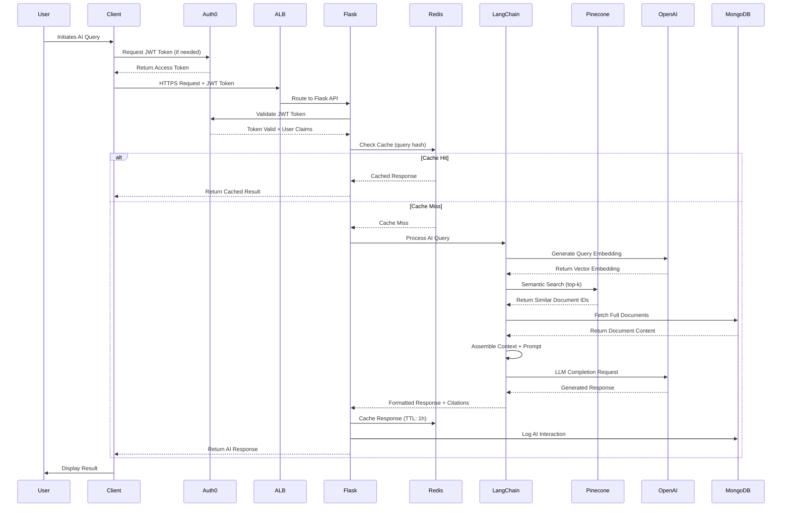

### 5.2.9 State Transition Diagram

The following diagram illustrates the state transitions for the core request processing lifecycle:

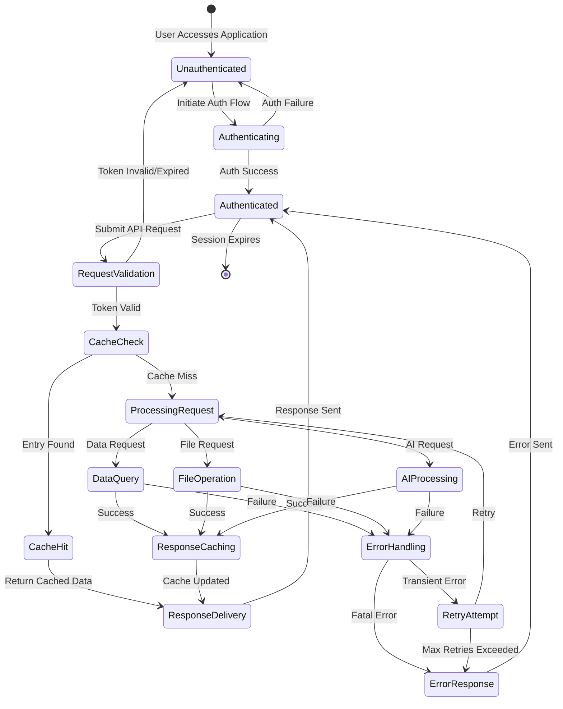

## 5.3 Technical Decisions

### 5.3.1 Architecture Style Decisions

The selection of a multi-tier microservices-oriented architecture over monolithic or pure microservices approaches reflects careful consideration of project requirements and team capabilities.

**Decision: Multi-Tier with Service-Oriented Components**

| Aspect | Rationale | Tradeoffs |
|--------|-----------|-----------|
| **Pattern Choice** | Balances simplicity of fewer services with scalability of separation | More complex than monolith, simpler than full microservices |
| **Team Velocity** | Enables rapid development with clear module boundaries | Requires discipline in maintaining boundaries |
| **Operational Complexity** | Manageable with AWS managed services and container orchestration | More moving parts than monolith, fewer than 10+ microservices |

The architecture separates concerns into distinct tiers (presentation, API, data, AI) rather than business domain microservices. This approach is well-suited for the current project scale while maintaining clear upgrade paths to finer-grained microservices if needed.

**Decision: Cloud-Native AWS Deployment**

| Aspect | Rationale | Tradeoffs |
|--------|-----------|-----------|
| **Managed Services** | Reduces operational burden, provides enterprise reliability | Vendor lock-in, less control vs. self-managed |
| **Global Scale** | CloudFront CDN and multi-region capability support worldwide users | Higher costs than single-region deployment |
| **Auto-Scaling** | Elastic scaling matches demand without over-provisioning | Cost optimization requires monitoring and tuning |

The cloud-native approach leverages AWS's mature ecosystem of managed services, eliminating undifferentiated heavy lifting in infrastructure management and enabling the team to focus on application logic.

**Decision: Container-Based Deployment (ECS Fargate)**

| Aspect | Rationale | Tradeoffs |
|--------|-----------|-----------|
| **Portability** | Docker containers ensure consistency across dev, staging, production | Overhead vs. native processes |
| **Serverless Orchestration** | Fargate eliminates EC2 instance management | Higher per-compute cost than EC2, less control |
| **Deployment Velocity** | Blue-green deployments enable zero-downtime releases | Complexity in rollback procedures |

ECS Fargate provides container orchestration without the operational overhead of Kubernetes while maintaining the benefits of containerization.

### 5.3.2 Communication Pattern Choices

**Decision: REST APIs with JSON**

| Aspect | Rationale | Tradeoffs |
|--------|-----------|-----------|
| **Ubiquity** | Universal client support, extensive tooling ecosystem | Less efficient than gRPC for high-frequency calls |
| **Human-Readable** | JSON is debuggable and developer-friendly | Larger payload sizes than binary protocols |
| **Stateless** | Enables horizontal scaling without session affinity | Client must manage token refresh |

REST with JSON remains the most pragmatic choice for the initial implementation, with gRPC as a potential optimization for specific high-throughput endpoints in future iterations.

**Decision: OAuth 2.0 with JWT Tokens**

| Aspect | Rationale | Tradeoffs |
|--------|-----------|-----------|
| **Industry Standard** | Well-understood, audited implementations available | Token size larger than session IDs |
| **Stateless Auth** | No server-side session storage required for validation | Cannot revoke tokens before expiration (requires short TTLs) |
| **RBAC Support** | Roles embedded in claims for efficient authorization | Token claims are visible (not encrypted, only signed) |

OAuth 2.0 with JWT provides the right balance of security, scalability, and developer experience for the authentication requirements.

**Decision: Synchronous Request-Response**

| Aspect | Rationale | Tradeoffs |
|--------|-----------|-----------|
| **Simplicity** | Direct request-response easier to reason about and debug | Long-running operations block client |
| **Immediate Feedback** | Users receive instant feedback for most operations | Timeouts required for slow operations |
| **Future Async Path** | Asynchronous processing can be added for specific use cases | Initial implementation simpler without message queues |

Synchronous communication satisfies current requirements with acceptable latency targets. Asynchronous patterns (queues, webhooks) can be introduced for specific long-running workflows as needed.

### 5.3.3 Data Storage Solution Rationale

**Decision: MongoDB Atlas for Primary Database**

| Aspect | Rationale | Tradeoffs |
|--------|-----------|-----------|
| **Schema Flexibility** | Document model accommodates evolving data structures | No multi-document ACID transactions by default |
| **JSON-Native** | Natural mapping to/from API JSON payloads | Query complexity vs. relational databases |
| **Managed Service** | Automatic backups, scaling, security patches | Cost premium vs. self-managed |
| **Developer Productivity** | MongoEngine ODM provides Pythonic interface | ORM abstraction can obscure performance issues |

MongoDB's document model aligns well with the JSON-centric API design and provides the flexibility needed during rapid feature development.

**Decision: Redis ElastiCache for Caching**

| Aspect | Rationale | Tradeoffs |
|--------|-----------|-----------|
| **Sub-Millisecond Latency** | In-memory storage enables <1ms response times | Memory-bound, more expensive than disk storage |
| **Rich Data Structures** | Supports complex caching patterns beyond key-value | Requires careful memory management |
| **Managed Service** | Automatic failover, scaling, maintenance | Limited customization vs. self-managed Redis |

Redis is the industry-standard caching solution with proven performance at scale and extensive client library support.

**Decision: Pinecone for Vector Storage**

| Aspect | Rationale | Tradeoffs |
|--------|-----------|-----------|
| **Purpose-Built** | Optimized for high-dimensional vector similarity search | Cost per query higher than general databases |
| **Managed Service** | No infrastructure to manage, automatic scaling | Vendor lock-in, limited control |
| **LangChain Integration** | First-class integration with LangChain framework | Alternative vector databases (Weaviate, Milvus) exist |

Pinecone provides the specialized capabilities required for semantic search in the RAG pattern without the complexity of self-managing vector indexes.

**Decision: AWS S3 for Object Storage**

| Aspect | Rationale | Tradeoffs |
|--------|-----------|-----------|
| **Durability** | 11 nines durability guarantees data safety | Higher latency than block storage |
| **Unlimited Scale** | No capacity planning required | Eventual consistency for overwrites |
| **Lifecycle Policies** | Automatic archival to Glacier for cost optimization | API calls have per-request costs |

S3 is the de facto standard for cloud object storage with unmatched durability and scalability characteristics.

### 5.3.4 Caching Strategy Justification

**Cache-Aside Pattern Implementation**

The cache-aside (lazy loading) pattern is implemented where the application code explicitly manages cache population and invalidation. This approach provides fine-grained control over what is cached and when, enabling optimization for specific access patterns.

**TTL Strategy**

| Data Type | TTL Duration | Rationale |
|-----------|-------------|-----------|
| **User Session Data** | 24 hours | Balance security (shorter is more secure) with UX (longer reduces re-auth) |
| **API Responses (Frequently Changing)** | 5-15 minutes | Tolerable staleness for real-time-like experience |
| **API Responses (Semi-Static)** | 1-4 hours | Reduces database load for rarely changing reference data |
| **AI Responses** | 1 hour | Balance freshness with cost (LLM API calls are expensive) |

TTL values are configurable per cache key pattern, enabling tuning based on observed access patterns and staleness tolerance.

**Cache Invalidation Strategy**

- **Write-Through Invalidation**: Updates to primary data trigger immediate cache invalidation for affected keys
- **Event-Driven Invalidation**: Pub/sub patterns notify cache invalidation for distributed scenarios (future enhancement)
- **Proactive Invalidation**: Administrative actions can manually clear cache entries or patterns

**Cost-Benefit Analysis**

Caching provides measurable benefits:
- **Latency Reduction**: Redis queries (<1ms) vs. MongoDB queries (10-50ms) provides 10-50x speedup
- **Database Load Reduction**: 80% cache hit rate offloads 80% of read queries from MongoDB
- **AI Cost Optimization**: Caching LLM responses can reduce OpenAI API costs by 60-80% for repeated queries

### 5.3.5 Security Mechanism Selection

**Decision: Auth0 for Identity Management**

| Security Layer | Mechanism | Rationale |
|----------------|-----------|-----------|
| **Authentication** | Auth0 OAuth 2.0 with PKCE | Industry-leading security, compliance certifications, MFA support |
| **Authorization** | RBAC with JWT Claims | Scalable, stateless, fine-grained access control |
| **Token Security** | Short-lived access tokens (15min) + long-lived refresh tokens (30 days) | Limits blast radius of token compromise |

Auth0's managed service provides enterprise-grade security without requiring in-house security expertise for authentication infrastructure.

**Decision: Encryption at All Layers**

| Layer | Encryption Type | Rationale |
|-------|----------------|-----------|
| **Data in Transit** | TLS 1.3 for all connections | Industry standard, forward secrecy, prevents eavesdropping |
| **Data at Rest** | AWS KMS encryption for S3, EBS, RDS | Transparent encryption, key rotation, audit logging |
| **Application Secrets** | AWS Secrets Manager with IAM policies | Centralized secret management, automatic rotation capability |

Comprehensive encryption provides defense-in-depth against data breaches at multiple potential points of failure.

**Decision: Network Isolation with VPC**

| Security Control | Implementation | Rationale |
|------------------|----------------|-----------|
| **Network Segmentation** | Public subnets (ALB, NAT) + private subnets (ECS, databases) | Limits attack surface, enforces traffic flow |
| **Security Groups** | Least-privilege ingress/egress rules | Only required ports open, deny-by-default |
| **NAT Gateway** | Outbound internet for private subnets without inbound access | Enables API calls while preventing direct internet exposure |

VPC architecture follows AWS security best practices for defense-in-depth.

**Decision: API Security Mechanisms**

| Mechanism | Implementation | Purpose |
|-----------|----------------|---------|
| **Rate Limiting** | Redis-backed token bucket algorithm | Prevents DoS attacks, controls API costs |
| **Input Validation** | JSON schema validation + type checking | Prevents injection attacks (SQL, NoSQL, XSS) |
| **CORS Configuration** | Strict origin allowlisting | Prevents unauthorized cross-origin requests |
| **Request Signing** | HMAC validation for webhook callbacks | Ensures callbacks originate from authorized sources |

Layered API security controls provide multiple barriers against common attack vectors.

## 5.4 Cross-Cutting Concerns

### 5.4.1 Monitoring and Observability Approach

The system implements comprehensive monitoring and observability through AWS CloudWatch, capturing metrics, logs, and traces to enable rapid issue detection and resolution.

**Metrics Collection Strategy**

Metrics are collected from multiple sources and aggregated in CloudWatch:

- **Infrastructure Metrics**: ECS task CPU/memory utilization, ALB request rates and error rates, database connection pool metrics, cache hit/miss ratios
- **Application Metrics**: API endpoint response times (P50, P95, P99), error rates by endpoint and status code, authentication success/failure rates, business metrics (user signups, feature usage)
- **AI Metrics**: LangChain invocation counts, OpenAI token usage and costs, embedding generation latency, RAG context retrieval times

Custom application metrics are emitted using the CloudWatch SDK with dimensions for environment, service, and version, enabling filtering and aggregation.

**Dashboard Configuration**

CloudWatch dashboards provide real-time system health visualization:
- **System Health Dashboard**: Overall system status, error rates, latency percentiles
- **Infrastructure Dashboard**: Container metrics, database performance, cache efficiency
- **AI Operations Dashboard**: LLM API usage, costs, token consumption trends
- **Business Metrics Dashboard**: User activity, feature adoption, conversion funnels

The following diagram illustrates the metrics collection and aggregation pipeline:


### 5.4.2 Logging and Tracing Strategy

**Structured Logging Standard**

All application logs follow a consistent JSON structure for machine parsing and correlation:

```json
{
  "timestamp": "2024-01-15T10:30:00.000Z",
  "level": "INFO|WARN|ERROR",
  "service": "flask-api|langchain-service",
  "request_id": "550e8400-e29b-41d4-a716-446655440000",
  "user_id": "user_12345",
  "message": "Human-readable log message",
  "context": {
    "endpoint": "/api/v1/query",
    "method": "POST",
    "status_code": 200,
    "duration_ms": 145
  },
  "error": {
    "type": "ValueError",
    "message": "Invalid input parameter",
    "stack_trace": "..."
  }
}
```

**Log Level Guidelines**

- **ERROR**: Application failures requiring immediate attention, unhandled exceptions, dependency failures
- **WARN**: Degraded functionality, fallback activations, approaching resource limits, slow query warnings
- **INFO**: Business events (user registration, AI query processing), successful API calls, authentication events
- **DEBUG**: Detailed execution flow for troubleshooting (enabled only in development/staging)

**Request Tracing**

Each request is assigned a unique UUID (`request_id`) at the API gateway, propagated through all downstream service calls, and included in all log entries and metrics. This enables end-to-end request tracing across distributed components.

**Log Retention and Archival**

- **Production Logs**: Retained in CloudWatch Logs for 90 days, then archived to S3 for long-term storage
- **Staging Logs**: Retained for 30 days
- **Development Logs**: Retained for 7 days

### 5.4.3 Error Handling Patterns

The system implements comprehensive error handling with classification, retry logic, fallback mechanisms, and circuit breakers to maintain resilience under failure conditions.

**Error Classification**

Errors are categorized into three classes that determine the handling strategy:

1. **Client Errors (4xx)**: Caused by invalid client requests—invalid input format, missing required parameters, authentication failures, insufficient permissions. These errors are returned immediately without retry.

2. **Transient Errors (5xx)**: Temporary failures that may succeed on retry—network timeouts, database connection pool exhaustion, rate limiting by external APIs. These errors trigger retry logic with exponential backoff.

3. **Fatal Errors (5xx)**: Permanent failures that will not succeed on retry—invalid credentials, configuration errors, unsupported operations. These errors are logged, alerted, and returned immediately.

**Retry Logic with Exponential Backoff**

Transient errors trigger automatic retry with intelligent backoff:
- **Initial Delay**: 1 second
- **Backoff Multiplier**: 2x (delays of 1s, 2s, 4s, 8s)
- **Maximum Retries**: 3 attempts for most operations, 5 for critical operations
- **Jitter**: ±20% random variance added to prevent thundering herd

**Circuit Breaker Pattern**

Circuit breakers prevent cascading failures by fast-failing when dependencies are consistently unavailable:
- **Closed State**: Normal operation, requests pass through
- **Open State**: After threshold failures (e.g., 5 consecutive), circuit opens and requests fail immediately
- **Half-Open State**: After timeout period, one request is allowed to test if dependency has recovered

**Fallback Mechanisms**

When primary services fail despite retries, fallback strategies provide degraded but functional service:

| Primary Service | Fallback Strategy | Tradeoff |
|----------------|-------------------|----------|
| **OpenAI LLM** | Anthropic Claude API | Different model characteristics, separate rate limits |
| **Redis Cache** | Direct MongoDB query | Higher latency (10-50ms vs <1ms), increased database load |
| **Auth0 Real-Time Validation** | Cached user roles (time-limited) | Reduced security (stale permissions), logged for audit |
| **Vector Search** | Direct LLM query without context | Lower quality responses, higher hallucination risk |

The following comprehensive error handling flow diagram illustrates the complete decision tree:

```mermaid
flowchart TD
    Start([Operation Initiated]) --> ExecuteOp[Execute Operation<br/>Database/API/Cache]
    ExecuteOp --> OpSuccess{Operation<br/>Success?}
    
    OpSuccess -->|Yes| LogSuccess[Log Success Metric<br/>CloudWatch]
    LogSuccess --> ReturnResult[Return Result to Caller]
    ReturnResult --> End([End])
    
    OpSuccess -->|No| ClassifyError{Error<br/>Type?}
    
    ClassifyError -->|Client Error| LogClientError[Log Client Error<br/>400-level Error]
    LogClientError --> ReturnError[Return Error Response<br/>with Error Details]
    ReturnError --> End
    
    ClassifyError -->|Transient Error| CheckRetries{Retry<br/>Attempts<br/>< Max?}
    ClassifyError -->|Fatal Error| LogFatalError[Log Fatal Error<br/>Send Alert]
    LogFatalError --> ReturnError
    
    CheckRetries -->|No| CheckCircuit{Circuit<br/>Breaker<br/>Open?}
    CheckCircuit -->|Yes| LogCircuitOpen[Log Circuit Open Event<br/>Fast Fail]
    LogCircuitOpen --> CheckFallback{Fallback<br/>Available?}
    
    CheckRetries -->|Yes| IncrementCounter[Increment Retry Counter]
    IncrementCounter --> CalculateBackoff[Calculate Exponential Backoff<br/>delay = base * 2^attempt]
    CalculateBackoff --> AddJitter[Add Random Jitter<br/>±20% of delay]
    AddJitter --> WaitDelay[Wait for Backoff Delay]
    WaitDelay --> ExecuteOp
    
    CheckCircuit -->|No| OpenCircuit[Open Circuit Breaker<br/>Prevent Cascading Failure]
    OpenCircuit --> CheckFallback
    
    CheckFallback -->|Yes| DetermineFallback{Fallback<br/>Service?}
    
    DetermineFallback -->|Alternative LLM| InvokeAnthropic[Invoke Anthropic Claude<br/>Fallback LLM Provider]
    InvokeAnthropic --> FallbackSuccess{Fallback<br/>Success?}
    
    DetermineFallback -->|Direct DB Query| QueryDirect[Bypass Cache<br/>Query MongoDB Directly]
    QueryDirect --> FallbackSuccess
    
    DetermineFallback -->|Cached Data| ReturnCached[Return Cached Data<br/>with Staleness Warning]
    ReturnCached --> FallbackSuccess
    
    FallbackSuccess -->|Yes| LogFallbackSuccess[Log Fallback Success<br/>Track Degraded Mode]
    LogFallbackSuccess --> ReturnResult
    
    FallbackSuccess -->|No| LogFallbackFailure[Log Fallback Failure<br/>Critical Alert]
    LogFallbackFailure --> ReturnError
    
    CheckFallback -->|No| LogNoFallback[Log No Fallback Available<br/>Service Degradation]
    LogNoFallback --> ReturnError
```

### 5.4.4 Authentication and Authorization Framework

The system implements comprehensive authentication and authorization using Auth0 as the identity provider and JWT-based stateless authorization.

**OAuth 2.0 Authentication Flow**

User authentication follows the OAuth 2.0 Authorization Code Flow with PKCE (Proof Key for Code Exchange) for enhanced security:

1. **Initiation**: User clicks "Login" in client application
2. **Authorization Request**: Client redirects to Auth0 Universal Login with `client_id`, `redirect_uri`, `response_type=code`, and PKCE parameters
3. **User Authentication**: User authenticates using username/password, social login, or enterprise SSO
4. **Multi-Factor Authentication**: If enabled, Auth0 prompts for MFA challenge (SMS, authenticator app, email)
5. **Authorization Code**: Auth0 redirects to application callback URL with authorization code
6. **Token Exchange**: Client exchanges code for access token and refresh token using PKCE verifier
7. **Token Storage**: Client securely stores tokens (browser localStorage, mobile secure storage)

The complete authentication flow is visualized in the following diagram:

```mermaid
flowchart TD
    Start([User Accesses Application]) --> AppCheck{User Has<br/>Active Session?}
    
    AppCheck -->|Yes| ValidateSession[Validate Session Token<br/>Expiration]
    ValidateSession --> SessionValid{Session<br/>Still Valid?}
    SessionValid -->|Yes| AllowAccess[Grant Application Access]
    AllowAccess --> End([End])
    
    AppCheck -->|No| InitAuth[Initialize Auth0<br/>Authentication]
    SessionValid -->|No| InitAuth
    
    InitAuth --> RedirectAuth0[Redirect to Auth0<br/>Universal Login Page]
    RedirectAuth0 --> UserChoice{Authentication<br/>Method?}
    
    UserChoice -->|Username/Password| EnterCreds[Enter Credentials]
    UserChoice -->|Social Login| SocialProvider[Select Social Provider<br/>Google/Facebook/GitHub]
    UserChoice -->|Enterprise SSO| EnterpriseSSO[Enterprise Identity Provider<br/>SAML/WS-Federation]
    
    EnterCreds --> ValidateCreds{Credentials<br/>Valid?}
    ValidateCreds -->|No| LoginAttempt[Increment Failed<br/>Login Counter]
    LoginAttempt --> BruteForceSuspicious{Too Many<br/>Failed Attempts?}
    BruteForceSuspicious -->|Yes| BlockAccount[Block Account<br/>Trigger Security Alert]
    BlockAccount --> DisplayError[Display Security Error]
    DisplayError --> End
    BruteForceSuspicious -->|No| RetryLogin[Display Error<br/>Allow Retry]
    RetryLogin --> EnterCreds
    
    ValidateCreds -->|Yes| MFAEnabled{MFA<br/>Enabled?}
    SocialProvider --> SocialAuth[Social Provider<br/>Authentication]
    SocialAuth --> MFAEnabled
    EnterpriseSSO --> SSOAuth[SSO Provider<br/>Authentication]
    SSOAuth --> MFAEnabled
    
    MFAEnabled -->|Yes| SendMFA[Send MFA Challenge<br/>SMS/Authenticator/Email]
    SendMFA --> ValidateMFA{MFA Code<br/>Valid?}
    ValidateMFA -->|No| MFARetry[Display Error<br/>Allow MFA Retry]
    MFARetry --> SendMFA
    ValidateMFA -->|Yes| IssueTokens[Auth0 Issues Tokens]
    
    MFAEnabled -->|No| IssueTokens
    
    IssueTokens --> GenerateJWT[Generate JWT Access Token<br/>with User ID, Roles, Permissions]
    GenerateJWT --> GenerateRefresh[Generate Refresh Token<br/>for Token Renewal]
    GenerateRefresh --> CallbackRedirect[Redirect to Application<br/>Callback URL with Tokens]
    
    CallbackRedirect --> StoreTokens[Application Stores Tokens<br/>Secure Storage]
    StoreTokens --> CreateSession[Create Application Session<br/>in Redis Cache]
    CreateSession --> AllowAccess
```

**JWT Token Structure and Validation**

Access tokens are JWT (JSON Web Tokens) with the following structure:

**Header**:
```json
{
  "alg": "RS256",
  "typ": "JWT",
  "kid": "key-id-12345"
}
```

**Payload (Claims)**:
```json
{
  "iss": "https://your-tenant.auth0.com/",
  "sub": "auth0|user-id-67890",
  "aud": "your-api-identifier",
  "iat": 1705315200,
  "exp": 1705318800,
  "scope": "read:data write:data",
  "https://yourdomain.com/roles": ["user", "premium"],
  "https://yourdomain.com/permissions": ["access:ai", "upload:files"]
}
```

**Signature**: RSA signature using Auth0's private key

The Flask API validates tokens on every protected endpoint request:
1. **Retrieve Public Keys**: Fetch Auth0's public keys from JWKS endpoint (cached)
2. **Verify Signature**: Validate JWT signature using public key matching `kid` header
3. **Check Expiration**: Ensure current time is before `exp` claim
4. **Validate Audience**: Confirm `aud` matches API identifier
5. **Validate Issuer**: Confirm `iss` matches Auth0 tenant URL
6. **Extract Claims**: Parse user ID, roles, and permissions for authorization

**Role-Based Access Control (RBAC)**

Authorization is implemented using roles and permissions:

- **Roles**: Coarse-grained groupings (e.g., `guest`, `user`, `premium`, `admin`)
- **Permissions**: Fine-grained capabilities (e.g., `read:documents`, `write:documents`, `access:ai`, `manage:users`)
- **Role Assignment**: Configured in Auth0, assigned to users
- **Permission Mapping**: Roles map to sets of permissions

API endpoints declare required permissions:
```python
@app.route('/api/v1/documents', methods=['POST'])
@require_permissions(['write:documents'])
def create_document():
    # Only users with write:documents permission can access
    pass
```

**Token Refresh Flow**

Access tokens expire after 15 minutes to limit the blast radius of token compromise. Refresh tokens (30-day expiration) enable obtaining new access tokens without re-authentication:

1. Client detects access token expiration (via `exp` claim or 401 response)
2. Client sends refresh token to Auth0 token endpoint
3. Auth0 validates refresh token and issues new access token
4. Client updates stored access token and retries original request

### 5.4.5 Performance Requirements and SLAs

The system establishes clear performance targets to ensure acceptable user experience and operational efficiency. These targets represent goals for the intended system, not contractual obligations.

**API Performance Targets**

| Metric | Target | Measurement Method | Rationale |
|--------|--------|-------------------|-----------|
| **API Response Time** | P95 < 500ms, P99 < 1s | CloudWatch metrics | Acceptable latency for interactive applications |
| **AI Response Time** | P95 < 5s, P99 < 10s | CloudWatch metrics | LLM processing is inherently slower, users accept longer wait for AI |
| **Authentication Latency** | P95 < 200ms | Auth0 monitoring | Fast login critical for user onboarding |
| **Cache Hit Latency** | P95 < 5ms | Redis metrics | Sub-second response for cached data |

**System Availability Targets**

| Component | Target Availability | Measurement | Acceptable Downtime |
|-----------|-------------------|-------------|---------------------|
| **Overall System** | 99.9% uptime | Uptime monitoring | ~43 minutes/month |
| **Flask API** | 99.95% | ALB health checks | ~22 minutes/month |
| **MongoDB Atlas** | 99.99% | Atlas SLA | ~4 minutes/month |
| **Auth0** | 99.9% | Auth0 SLA | Provider-guaranteed |

**Throughput Targets**

| Workload | Target Throughput | Measurement |
|----------|------------------|-------------|
| **API Requests** | 1000 req/sec sustained, 5000 req/sec peak | CloudWatch metrics |
| **AI Queries** | 100 queries/sec sustained | LangChain metrics |
| **Database Operations** | 10,000 ops/sec | MongoDB Atlas metrics |
| **Cache Operations** | 100,000 ops/sec | Redis metrics |

**Quality Targets**

| Metric | Target | Measurement | Impact |
|--------|--------|-------------|--------|
| **API Error Rate** | < 1% | CloudWatch alarms | Maintains user trust |
| **Cache Hit Rate** | > 80% | Redis metrics | Reduces database load and costs |
| **AI Response Quality** | User satisfaction > 4/5 | User feedback | Ensures AI value proposition |

**Scalability Requirements**

The architecture supports the following scale:
- **Concurrent Users**: 10,000+ simultaneous active sessions
- **Data Volume**: MongoDB supports 1TB+ application data with sharding
- **Vector Storage**: Pinecone handles millions of embeddings
- **Object Storage**: S3 provides unlimited capacity

### 5.4.6 Disaster Recovery Procedures

The system implements comprehensive backup and recovery procedures to minimize data loss and downtime in the event of failures.

**Backup Strategy**

| Data Store | Backup Method | Frequency | Retention | Recovery Point Objective (RPO) |
|-----------|---------------|-----------|-----------|-------------------------------|
| **MongoDB Atlas** | Continuous backup with point-in-time recovery | Continuous | 7 days point-in-time, snapshots 30 days | < 1 minute |
| **S3 Objects** | Versioning + cross-region replication | Real-time | All versions retained 90 days | 0 (synchronous replication) |
| **Redis Cache** | RDB snapshots + AOF logs | Every 6 hours (RDB), continuous (AOF) | 48 hours | Up to 1 second (AOF) |
| **Application Config** | Git repository | On change | Infinite | 0 (version controlled) |

**Automated Recovery Procedures**

The infrastructure includes self-healing capabilities that automatically respond to common failure scenarios:

**Container Failure Recovery**:
- ECS Service monitors container health via HTTP health check endpoint (`/health`)
- Unhealthy containers are terminated and replaced automatically
- New containers must pass health checks before receiving traffic from ALB
- Recovery time: < 2 minutes from failure detection to restored capacity

**Database Failover**:
- MongoDB Atlas replica set automatically elects new primary if primary fails
- Connection strings include all replica set members, drivers automatically reconnect
- Failover typically completes in < 30 seconds
- Application experiences brief connection errors during failover, then auto-recovers

**Application Load Balancer Health Management**:
- ALB performs health checks every 30 seconds on each ECS task
- Two consecutive failed checks mark task as unhealthy
- Unhealthy tasks are removed from rotation immediately
- Auto-scaling replaces failed tasks based on desired count

**Manual Rollback Procedures**

For issues requiring human intervention, documented procedures enable rapid recovery:

**Deployment Rollback (Blue-Green)**:
1. Operations team identifies production issue via monitoring alerts or user reports
2. Team lead authorizes rollback to previous stable version
3. ALB target group is switched back to Blue environment (previous version)
4. Traffic is instantly restored to previous stable version
5. Green environment (problematic version) is investigated offline
6. Root cause is identified and fixed before retry deployment

**Recovery Time Objective**: < 5 minutes from decision to rollback completion

**Database Migration Rollback**:
1. Migration issues are identified during or after deployment
2. Rollback migration script (tested in staging) is executed
3. Application is rolled back to previous version compatible with old schema
4. Data integrity validation queries are run to confirm consistency
5. Full system smoke tests verify functionality

**Recovery Time Objective**: < 15 minutes for typical schema rollback

**Data Restoration from Backup**:
1. Data loss or corruption is identified (e.g., accidental deletion, application bug)
2. Team determines recovery point (e.g., "restore to 1 hour ago")
3. MongoDB Atlas point-in-time restore is initiated to temporary cluster
4. Affected data is exported from backup cluster and imported to production
5. Application is verified to work with restored data

**Recovery Time Objective**: < 1 hour for targeted data restoration

**Region Failure Recovery**:

In the event of complete AWS region failure (rare but possible):
1. Incident commander is paged via PagerDuty critical alert
2. Team assesses scope and determines if failover is warranted
3. DNS is updated to point to backup region (if implemented)
4. Database restore from latest backup is initiated in new region
5. Application containers are deployed to new region
6. Smoke tests verify functionality before DNS cutover

**Recovery Time Objective**: < 1 hour (manual process, not automated in MVP)

**Note**: Multi-region disaster recovery is planned for future phases but not implemented in initial MVP. Current architecture supports single-region deployment with cross-AZ redundancy for high availability.

### 5.4.7 Development and Deployment Workflow

The system employs a structured CI/CD pipeline that ensures code quality, security, and reliable deployments across multiple environments.

**Development Workflow**

Developers follow this process for implementing features and fixes:

1. **Local Development**: Docker Compose environment mimics production with local MongoDB, Redis, and mocked external services
2. **Feature Branch**: Create branch from `develop` following naming convention (`feature/description`, `bugfix/description`)
3. **Implementation**: Write code following style guides (Black for Python, Prettier for TypeScript)
4. **Local Testing**: Run unit tests, integration tests, and linting locally
5. **Commit**: Atomic commits with descriptive messages following Conventional Commits format
6. **Pull Request**: Submit PR to `develop` branch with description and testing notes
7. **Code Review**: At least one peer review required before merge
8. **CI Validation**: GitHub Actions runs automated checks (lint, test, security scan)
9. **Merge**: PR is merged to `develop` after approval and passing checks

**CI/CD Pipeline Architecture**

The following diagram illustrates the complete development and deployment workflow:

```mermaid
graph LR
    subgraph "Development"
        Dev[Developer<br/>VS Code]
        Local[Local Docker<br/>Compose]
        Git[Git<br/>Version Control]
    end

    subgraph "CI/CD Pipeline"
        GHA[GitHub Actions]
        Build[Build &<br/>Test]
        Scan[Security<br/>Scan]
        ECR[Amazon ECR<br/>Container Registry]
    end

    subgraph "Infrastructure"
        Terraform[Terraform<br/>IaC]
        AWS[AWS Cloud<br/>Infrastructure]
    end

    subgraph "Environments"
        DevEnv[Development<br/>Environment]
        StagingEnv[Staging<br/>Environment]
        ProdEnv[Production<br/>Environment]
    end

    Dev --> Local
    Dev --> Git
    Git --> GHA
    GHA --> Build
    Build --> Scan
    Scan --> ECR
    
    Terraform --> AWS
    
    ECR --> DevEnv
    DevEnv --> StagingEnv
    StagingEnv --> ProdEnv
    
    AWS --> DevEnv
    AWS --> StagingEnv
    AWS --> ProdEnv
```

**Continuous Integration (GitHub Actions)**

On every push to feature branches and `develop`, the CI pipeline executes:

1. **Linting**: Validate code style (Black, Flake8, ESLint, TypeScript compiler)
2. **Type Checking**: TypeScript and Python type hints validation
3. **Unit Tests**: Fast tests with mocked dependencies (target: <2 min runtime)
4. **Integration Tests**: Tests against real MongoDB and Redis (Docker containers)
5. **Security Scanning**: Dependency vulnerability scan (Snyk, npm audit, safety)
6. **Docker Build**: Build container images for Flask API and LangChain service
7. **Image Push**: Push tagged images to Amazon ECR

**Continuous Deployment**

Deployment automation varies by environment:

**Development Environment**:
- **Trigger**: Automatic on merge to `develop` branch
- **Process**: Deploy latest images to ECS Development cluster
- **Validation**: Health checks only, no manual approval required
- **Purpose**: Rapid feedback for ongoing development

**Staging Environment**:
- **Trigger**: Automatic on merge to `main` branch
- **Process**: Deploy latest images to ECS Staging cluster
- **Validation**: Automated smoke tests, full integration test suite
- **Purpose**: Pre-production validation with production-like configuration

**Production Environment**:
- **Trigger**: Manual approval after staging validation
- **Process**: Blue-green deployment to ECS Production cluster
- **Validation**: Health checks, smoke tests, gradual traffic shift
- **Rollback**: Automatic rollback on health check failures, manual rollback on issues

**Blue-Green Deployment Process**

Production deployments use blue-green strategy for zero-downtime releases:

1. **Green Deployment**: New version is deployed alongside existing Blue version
2. **Health Validation**: Green environment must pass health checks for 5 minutes
3. **Smoke Tests**: Automated tests run against Green environment
4. **Traffic Shift**: ALB target group gradually shifts traffic (10%, 50%, 100% over 15 minutes)
5. **Monitoring**: Error rates and latency monitored during shift
6. **Completion**: Once 100% traffic is on Green, Blue is decommissioned after 24-hour retention
7. **Rollback**: If issues detected, instant rollback to Blue by reverting ALB target group

**Infrastructure as Code (Terraform)**

All AWS infrastructure is defined in Terraform configuration:
- **VPC**: Network topology, subnets, route tables, security groups
- **ECS**: Cluster, services, task definitions
- **ALB**: Load balancer, target groups, listeners
- **Databases**: MongoDB Atlas cluster configuration (via provider)
- **Monitoring**: CloudWatch dashboards, alarms, log groups

Infrastructure changes follow the same review process as application code and are applied via Terraform Cloud with approval gates for production.

### 5.4.8 Data Flow Architecture Diagram

The following diagram provides a comprehensive view of request processing, caching, and data flow through all system components:

```mermaid
graph TD
    subgraph "Frontend Request Flow"
        User[User<br/>Interface]
        AuthToken[Auth0 JWT<br/>Token]
    end

    subgraph "API Processing"
        APIEndpoint[Flask API<br/>Endpoint]
        TokenValidation[JWT Token<br/>Validation]
        CacheCheck{Cache<br/>Hit?}
        BusinessLogic[Business<br/>Logic]
    end

    subgraph "Data Operations"
        RedisCache[(Redis<br/>Cache)]
        MongoQuery[(MongoDB<br/>Query)]
        S3Operation[(S3<br/>Operation)]
        VectorSearch[(Vector<br/>Search)]
    end

    subgraph "AI Processing"
        LangChainChain[LangChain<br/>Chain]
        LLMCall[OpenAI<br/>LLM Call]
    end

    User --> AuthToken
    AuthToken --> APIEndpoint
    APIEndpoint --> TokenValidation
    TokenValidation --> CacheCheck
    
    CacheCheck -->|Yes| RedisCache
    RedisCache --> User
    
    CacheCheck -->|No| BusinessLogic
    BusinessLogic --> MongoQuery
    BusinessLogic --> S3Operation
    BusinessLogic --> LangChainChain
    
    LangChainChain --> VectorSearch
    LangChainChain --> LLMCall
    
    MongoQuery --> RedisCache
    LangChainChain --> RedisCache
    RedisCache --> User
```

### 5.4.9 AI Processing Flow Diagram

The complete AI request processing workflow with RAG pattern implementation:

```mermaid
flowchart TD
    Start([AI Request Received]) --> ValidateInput[Validate Request Input<br/>Check Query Length & Format]
    ValidateInput --> InputValid{Input<br/>Valid?}
    
    InputValid -->|No| ReturnValidationError[Return 400<br/>Bad Request Error]
    ReturnValidationError --> End([End])
    
    InputValid -->|Yes| CheckAICache{AI Response<br/>Cached in<br/>Redis?}
    
    CheckAICache -->|Yes| ReturnCached[Return Cached<br/>AI Response]
    ReturnCached --> LogUsage[Log AI Usage Metrics]
    LogUsage --> End
    
    CheckAICache -->|No| InitLangChain[Initialize LangChain<br/>Processing Chain]
    InitLangChain --> EmbedQuery[Generate Query Embedding<br/>OpenAI text-embedding-ada-002]
    
    EmbedQuery --> EmbedSuccess{Embedding<br/>Success?}
    EmbedSuccess -->|No| CheckQuota{API Quota<br/>Exceeded?}
    CheckQuota -->|Yes| ReturnQuotaError[Return 429<br/>Rate Limit Exceeded]
    ReturnQuotaError --> End
    CheckQuota -->|No| RetryEmbed[Retry Embedding<br/>with Exponential Backoff]
    RetryEmbed --> EmbedQuery
    
    EmbedSuccess -->|Yes| VectorSearch[Semantic Search in Pinecone<br/>Find Top-K Similar Documents]
    VectorSearch --> ApplyFilters[Apply Metadata Filters<br/>Document Type, Date, Permissions]
    ApplyFilters --> CheckResults{Relevant<br/>Documents<br/>Found?}
    
    CheckResults -->|No| DirectLLM[Direct LLM Query<br/>Without Context]
    CheckResults -->|Yes| RetrieveDocs[Retrieve Full Documents<br/>from MongoDB]
    
    RetrieveDocs --> AssembleContext[Assemble Context<br/>Combine Retrieved Documents]
    AssembleContext --> ConstructPrompt[Construct LLM Prompt<br/>System + Context + Query]
    DirectLLM --> ConstructPrompt
    
    ConstructPrompt --> CheckTokens{Token Count<br/>Within Limits?}
    CheckTokens -->|No| TruncateContext[Truncate Context<br/>to Fit Token Limit]
    TruncateContext --> ConstructPrompt
    
    CheckTokens -->|Yes| InvokeLLM[Invoke OpenAI LLM<br/>GPT-4/GPT-3.5-turbo]
    InvokeLLM --> LLMSuccess{LLM Call<br/>Success?}
    
    LLMSuccess -->|No| CheckFallback{Fallback<br/>Provider<br/>Available?}
    CheckFallback -->|Yes| InvokeAnthropic[Invoke Anthropic Claude<br/>Fallback Provider]
    InvokeAnthropic --> ProcessResponse[Process LLM Response]
    CheckFallback -->|No| ReturnAIError[Return 503<br/>Service Unavailable]
    ReturnAIError --> End
    
    LLMSuccess -->|Yes| ProcessResponse
    ProcessResponse --> ValidateResponse{Response<br/>Valid?}
    ValidateResponse -->|No| ReturnAIError
    
    ValidateResponse -->|Yes| FormatResponse[Format Response<br/>Add Source Citations]
    FormatResponse --> CacheResult[Cache AI Response<br/>in Redis with TTL]
    CacheResult --> TrackCost[Track Token Usage<br/>and API Cost]
    TrackCost --> LogUsage
```

### 5.4.10 Alert Processing and Incident Response Flow

The complete alerting and incident response workflow:

```mermaid
flowchart TD
    Start([CloudWatch Alarm Triggered]) --> DetermineSeverity{Alert<br/>Severity?}
    
    DetermineSeverity -->|Critical| PublishCriticalSNS[Publish to Critical<br/>SNS Topic]
    DetermineSeverity -->|Warning| PublishWarningSNS[Publish to Warning<br/>SNS Topic]
    DetermineSeverity -->|Info| PublishInfoSNS[Publish to Info<br/>SNS Topic]
    
    PublishCriticalSNS --> FormatMessage[Format Alert Message<br/>with Context]
    PublishWarningSNS --> FormatMessage
    PublishInfoSNS --> FormatMessage
    
    FormatMessage --> EnrichContext[Enrich with Metadata<br/>Service, Environment, Metric]
    EnrichContext --> AddRunbook{Runbook<br/>Available?}
    
    AddRunbook -->|Yes| AttachRunbook[Attach Runbook Link<br/>Resolution Steps]
    AddRunbook -->|No| RouteSNS[Route SNS Message<br/>to Subscribers]
    AttachRunbook --> RouteSNS
    
    RouteSNS --> DetermineChannels{Notification<br/>Channels?}
    
    DetermineChannels -->|PagerDuty| SendPagerDuty[Create PagerDuty Incident<br/>On-Call Engineer]
    DetermineChannels -->|Slack| SendSlack[Post to Slack Channel<br/>#alerts or #incidents]
    DetermineChannels -->|Email| SendEmail[Send Email Notification<br/>Operations Team]
    
    SendPagerDuty --> LogNotification[Log Notification Sent<br/>CloudWatch Logs]
    SendSlack --> LogNotification
    SendEmail --> LogNotification
    
    LogNotification --> AcknowledgeRequired{Acknowledgment<br/>Required?}
    
    AcknowledgeRequired -->|Yes| WaitAcknowledge[Wait for Human<br/>Acknowledgment]
    WaitAcknowledge --> CheckTimeout{Acknowledgment<br/>Timeout?}
    CheckTimeout -->|Yes| EscalateAlert[Escalate to Secondary<br/>On-Call Engineer]
    EscalateAlert --> SendPagerDuty
    CheckTimeout -->|No| Acknowledged{Alert<br/>Acknowledged?}
    Acknowledged -->|No| WaitAcknowledge
    Acknowledged -->|Yes| TrackIncident[Create Incident Ticket<br/>Tracking System]
    
    AcknowledgeRequired -->|No| TrackIncident
    
    TrackIncident --> MonitorResolution[Monitor for Resolution<br/>Metric Returns to Normal]
    MonitorResolution --> Resolved{Issue<br/>Resolved?}
    
    Resolved -->|No| CheckAutoRecover{Auto-Recovery<br/>Possible?}
    CheckAutoRecover -->|Yes| TriggerRecovery[Trigger Automated<br/>Recovery Procedure]
    TriggerRecovery --> MonitorResolution
    CheckAutoRecover -->|No| EscalateIncident[Escalate Incident<br/>Require Manual Intervention]
    EscalateIncident --> End([End])
    
    Resolved -->|Yes| CloseIncident[Close Incident Ticket<br/>Document Resolution]
    CloseIncident --> SendResolutionNotice[Send Resolution<br/>Notification]
    SendResolutionNotice --> CreatePostmortem{Major<br/>Incident?}
    
    CreatePostmortem -->|Yes| SchedulePostmortem[Schedule Postmortem<br/>Root Cause Analysis]
    SchedulePostmortem --> End
    CreatePostmortem -->|No| End
```

## 5.5 References

### 5.5.1 Repository Files and Folders

This is a greenfield project with no implementation code. The repository currently contains:

- `README.md` - Single-line project title, no technical content
- `.git/` - Git version control metadata

**Note**: All architecture described in this section represents the intended/planned design documented in the technical specification. No code has been implemented yet.

### 5.5.2 Technical Specification Sections Referenced

The following technical specification sections were retrieved and analyzed to compile this architecture documentation:

- **Section 1.2 (System Overview)** - Project context and repository metadata
- **Section 1.3 (Scope)** - In-scope and out-of-scope system boundaries
- **Section 2.2 (Feature Catalog)** - Feature framework structure
- **Section 2.3 (Functional Requirements)** - Requirements framework
- **Section 3.1 (Overview and Selection Rationale)** - Technology selection principles and rationale
- **Section 3.2 (Programming Languages)** - Python, TypeScript, Swift, Kotlin specifications
- **Section 3.3 (Frameworks & Libraries)** - Flask, React, React Native, LangChain, TailwindCSS details
- **Section 3.5 (Third-Party Services)** - Auth0, AWS services, OpenAI, Anthropic integrations
- **Section 3.6 (Databases & Storage)** - MongoDB, Redis, Pinecone, S3 specifications
- **Section 3.7 (Development & Deployment)** - Git, Docker, Terraform, GitHub Actions, testing tools
- **Section 3.8 (Technology Integration Architecture)** - System diagrams, deployment workflow, data flow architecture
- **Section 3.10 (Security Considerations)** - Security mechanisms and patterns
- **Section 4.1 (Overview and Foundation Architecture)** - Process flow overview and integration patterns
- **Section 4.2 (Core Business Workflows)** - User request processing, authentication flow, AI processing with RAG
- **Section 4.5 (Error Handling and Recovery Procedures)** - Error classification, retry logic, fallback mechanisms, circuit breakers
- **Section 4.8 (Monitoring and Observability Workflows)** - Metrics collection, alerting, incident response

### 5.5.3 Architectural Patterns and Best Practices

This architecture incorporates established patterns and best practices:

- **Multi-Tier Architecture**: Separation of concerns across presentation, API, data, and AI layers
- **Cache-Aside Pattern**: Explicit cache management with fallback to primary data source
- **Circuit Breaker Pattern**: Prevents cascading failures in distributed systems
- **Retry with Exponential Backoff**: Handles transient failures gracefully
- **Blue-Green Deployment**: Zero-downtime releases with instant rollback capability
- **Infrastructure as Code**: Terraform-managed infrastructure for consistency and repeatability
- **Stateless API Design**: Enables horizontal scaling and fault tolerance
- **OAuth 2.0 with PKCE**: Industry-standard authentication with enhanced security
- **RAG Pattern**: Retrieval-Augmented Generation reduces AI hallucinations
- **Observability by Design**: Comprehensive logging, metrics, and tracing from inception

---

**Document Status**: This System Architecture section documents the intended/planned architecture for a greenfield project. Implementation is pending, and this specification serves as the authoritative reference for development.

# 6. SYSTEM COMPONENTS DESIGN

## 6.1 Core Services Architecture

#### SYSTEM ARCHITECTURE

## 6.1 Core Services Architecture

The planned system architecture employs a **cloud-native, multi-tier microservices-oriented approach** designed for scalability, resilience, and maintainability. As this is a greenfield project established in November 2025, this section documents the intended service architecture based on modern best practices and the requirements specified in this document.

The architecture leverages AWS managed services extensively, implementing containerized services orchestrated through ECS Fargate, with comprehensive auto-scaling, health monitoring, and resilience patterns to ensure high availability and optimal performance under varying load conditions.

### 6.1.1 Service Components

#### 6.1.1.1 Core Service Inventory

The system architecture comprises two primary application services supported by multiple managed and external services:

**Primary Application Services:**

| Service Name | Technology Stack | Deployment Platform | Primary Responsibility |
|--------------|------------------|---------------------|------------------------|
| **Flask REST API Service** | Flask 3.0+, Python 3.11+, Gunicorn 21.0+ | AWS ECS Fargate | Business logic orchestration, request routing, data aggregation, API gateway |
| **LangChain AI Service** | LangChain 0.1.x, OpenAI SDK, Python 3.11+ | AWS ECS Fargate | AI-powered features using RAG pattern with large language models |

**Supporting Managed Services:**

| Service Name | Service Type | Primary Responsibility | Integration Method |
|--------------|--------------|------------------------|-------------------|
| **Auth0** | Identity Platform (SaaS) | Authentication, authorization, user management via OAuth 2.0/OIDC | HTTPS REST API, JWT validation |
| **MongoDB Atlas** | Managed Database (DBaaS) | Primary application database for structured and semi-structured data | MongoDB Wire Protocol over TLS |
| **Redis ElastiCache** | Managed Cache (AWS) | High-performance caching, session management, rate limiting | Redis protocol, redis-py client |
| **Pinecone** | Vector Database (SaaS) | Semantic search, vector storage for RAG pattern | HTTPS REST API, gRPC |
| **AWS S3** | Object Storage (AWS) | File storage, static assets, backup storage | S3 API via boto3 SDK |
| **OpenAI** | LLM Provider (SaaS) | Primary language model inference (GPT-4, GPT-3.5-turbo) | HTTPS REST API |
| **Anthropic Claude** | LLM Provider (SaaS) | Fallback language model inference | HTTPS REST API |

**Design Rationale:**

The Flask REST API Service implements a **stateless design** with no local session state, enabling seamless horizontal scaling and fault tolerance. All session data is externalized to Redis, allowing any API instance to serve any request without affinity requirements.

The LangChain AI Service operates as a **specialized compute-intensive service** separate from the main API layer, enabling independent scaling based on AI workload characteristics. This separation prevents AI processing from impacting standard API performance and allows optimization of compute resources specifically for embedding generation and LLM interactions.

#### 6.1.1.2 Service Boundaries and Responsibilities

The architecture establishes clear boundaries between services to ensure proper separation of concerns and maintainable integration points:

```mermaid
graph TB
    subgraph "Client Layer"
        WebApp[React Web Application]
        MobileApp[React Native Mobile App]
        DesktopApp[Electron Desktop App]
        NativeApps[Native iOS/Android Apps]
    end
    
    subgraph "Edge Layer"
        CloudFront[AWS CloudFront CDN<br/>Static Asset Delivery]
        ALB[Application Load Balancer<br/>SSL Termination & Traffic Distribution]
    end
    
    subgraph "API Layer - Stateless & Horizontally Scalable"
        FlaskAPI1[Flask REST API<br/>Instance 1]
        FlaskAPI2[Flask REST API<br/>Instance 2]
        FlaskAPIN[Flask REST API<br/>Instance N]
    end
    
    subgraph "AI Processing Layer"
        LangChain1[LangChain Service<br/>Instance 1]
        LangChain2[LangChain Service<br/>Instance 2]
    end
    
    subgraph "Caching Layer"
        Redis[(Redis ElastiCache<br/>Session & Response Cache)]
    end
    
    subgraph "Data Layer"
        MongoDB[(MongoDB Atlas<br/>Application Data)]
        S3[(AWS S3<br/>Object Storage)]
        Pinecone[(Pinecone<br/>Vector Database)]
    end
    
    subgraph "External Services"
        Auth0[Auth0<br/>Identity Provider]
        OpenAI[OpenAI API<br/>LLM Inference]
        Anthropic[Anthropic Claude<br/>Fallback LLM]
    end
    
    WebApp --> CloudFront
    WebApp --> ALB
    MobileApp --> ALB
    DesktopApp --> ALB
    NativeApps --> ALB
    
    CloudFront --> S3
    
    ALB --> FlaskAPI1
    ALB --> FlaskAPI2
    ALB --> FlaskAPIN
    
    FlaskAPI1 --> Redis
    FlaskAPI2 --> Redis
    FlaskAPIN --> Redis
    
    FlaskAPI1 --> MongoDB
    FlaskAPI1 --> S3
    FlaskAPI1 --> LangChain1
    FlaskAPI1 --> Auth0
    
    LangChain1 --> Pinecone
    LangChain2 --> Pinecone
    LangChain1 --> MongoDB
    LangChain1 --> OpenAI
    LangChain1 --> Anthropic
```

**Boundary Definitions:**

- **Presentation Boundary**: All client applications communicate exclusively via HTTPS REST APIs with JWT authentication. No direct database or cache access is permitted from client layers.

- **Authentication Boundary**: Auth0 provides centralized identity management. The Flask API validates JWT tokens on every protected endpoint using Auth0's public signing keys, extracting user identity and role claims for authorization checks.

- **Data Boundary**: Data is segregated across purpose-built storage systems:
  - **MongoDB**: Structured application data, user profiles, document metadata
  - **Pinecone**: Vector embeddings for semantic search (1536-dimensional vectors)
  - **Redis**: Ephemeral cache data, session state, rate limit counters
  - **S3**: Object storage for files, static assets, backups

- **External Services Boundary**: Integration with third-party services occurs through well-defined APIs with comprehensive error handling, retry logic, and fallback mechanisms to prevent external dependencies from causing system-wide failures.

**Service Responsibilities:**

| Service | Core Responsibilities | Key Operations | Dependencies |
|---------|----------------------|----------------|--------------|
| **Flask REST API** | • Request validation and routing<br/>• Business logic orchestration<br/>• Data aggregation and transformation<br/>• Response caching and serialization | • User authentication/authorization<br/>• CRUD operations on resources<br/>• Cache management<br/>• AI service coordination | Auth0, MongoDB, Redis, S3, LangChain |
| **LangChain AI** | • Vector embedding generation<br/>• Semantic search execution<br/>• LLM prompt construction<br/>• AI response processing | • Text embedding (OpenAI ada-002)<br/>• Vector similarity search<br/>• RAG context retrieval<br/>• LLM inference | Pinecone, OpenAI, Anthropic, MongoDB |

#### 6.1.1.3 Inter-Service Communication Patterns

All inter-service communication in the planned architecture follows **synchronous request-response patterns** using REST APIs with JSON payloads over HTTPS.

**Communication Protocol Specifications:**

- **Transport Protocol**: HTTPS with TLS 1.3 encryption
- **Application Protocol**: RESTful HTTP with standard methods (GET, POST, PUT, PATCH, DELETE)
- **Data Format**: JSON with UTF-8 encoding
- **Authentication**: JWT Bearer tokens in Authorization header
- **Content Negotiation**: `application/json` content type

**API Endpoint Structure:**

The Flask REST API exposes the following endpoint categories:

```
Authentication Endpoints:
├── POST   /auth/login           # Initiate OAuth 2.0 flow
├── POST   /auth/refresh         # Refresh access token
└── POST   /auth/logout          # Invalidate session

Resource Endpoints (versioned):
├── GET    /api/v1/{resource}           # List resources
├── POST   /api/v1/{resource}           # Create resource
├── GET    /api/v1/{resource}/{id}      # Retrieve resource
├── PUT    /api/v1/{resource}/{id}      # Update resource (full)
├── PATCH  /api/v1/{resource}/{id}      # Update resource (partial)
└── DELETE /api/v1/{resource}/{id}      # Delete resource

AI Operations:
└── POST   /api/v1/ai/query      # Submit AI query (RAG processing)

Health & Monitoring:
└── GET    /health                # Health check endpoint
```

**Standardized Response Format:**

All API responses follow a consistent structure for predictable client integration:

```json
{
  "success": true,
  "data": {
    "id": "resource-id-123",
    "attributes": {...}
  },
  "error": {
    "code": "ERROR_CODE",
    "message": "Human-readable error description",
    "details": {...}
  },
  "metadata": {
    "request_id": "550e8400-e29b-41d4-a716-446655440000",
    "timestamp": "2025-01-15T10:30:00.000Z",
    "version": "v1"
  }
}
```

**Request Correlation and Tracing:**

Each incoming request receives a unique UUID (`request_id`) generated at the Application Load Balancer ingress point. This identifier propagates through all downstream service calls and appears in:
- HTTP response headers (`X-Request-ID`)
- All structured log entries
- CloudWatch metrics dimensions
- Error reports and alerts

This design enables end-to-end request tracing across distributed components for debugging and performance analysis.

#### 6.1.1.4 Service Discovery Mechanisms

The planned architecture implements **AWS-native service discovery** through ECS Service integration with Application Load Balancer, eliminating the need for external service registry systems (Consul, Eureka, etcd).

**Service Discovery Implementation:**

```mermaid
flowchart TD
    Start([ECS Task Launch Initiated]) --> LaunchTask[ECS Launches New<br/>Container Task]
    LaunchTask --> ContainerStart[Container Starts<br/>Flask/LangChain Application]
    ContainerStart --> BindPort[Application Binds to<br/>Container Port 8000]
    
    BindPort --> RegisterALB[ECS Registers Task with<br/>ALB Target Group]
    RegisterALB --> WaitInitial[Wait Initial Delay<br/>30 Seconds]
    
    WaitInitial --> PerformHealthCheck[ALB Performs Health Check<br/>HTTP GET /health]
    PerformHealthCheck --> HealthResponse{Health Check<br/>Response?}
    
    HealthResponse -->|200 OK| IncrementHealthy[Increment Healthy<br/>Check Counter]
    HealthResponse -->|Non-200 or Timeout| IncrementUnhealthy[Increment Unhealthy<br/>Check Counter]
    
    IncrementHealthy --> CheckThreshold{Healthy Count<br/>>= 2?}
    CheckThreshold -->|No| WaitInterval[Wait 30 Seconds]
    WaitInterval --> PerformHealthCheck
    
    CheckThreshold -->|Yes| MarkHealthy[Mark Task as Healthy<br/>in ALB Target Group]
    MarkHealthy --> EnableTraffic[Enable Traffic Routing<br/>to Task]
    EnableTraffic --> MonitorHealth[Continuous Health<br/>Monitoring Every 30s]
    
    IncrementUnhealthy --> CheckUnhealthyThreshold{Unhealthy<br/>Count >= 3?}
    CheckUnhealthyThreshold -->|No| WaitInterval
    CheckUnhealthyThreshold -->|Yes| MarkUnhealthy[Mark Task as Unhealthy<br/>Remove from Rotation]
    MarkUnhealthy --> DrainConnections[Drain Existing Connections<br/>300 Second Timeout]
    DrainConnections --> TerminateTask[ECS Terminates Task<br/>Auto-Scaling Replaces]
    
    MonitorHealth --> ContinuousCheck[Periodic Health Check]
    ContinuousCheck --> StillHealthy{Still<br/>Healthy?}
    StillHealthy -->|Yes| MonitorHealth
    StillHealthy -->|No| MarkUnhealthy
    
    TerminateTask --> End([End])
```

**Health Check Configuration:**

| Parameter | Value | Rationale |
|-----------|-------|-----------|
| **Health Check Path** | `/health` | Lightweight endpoint returning container health status |
| **Health Check Interval** | 30 seconds | Balanced between rapid detection and overhead |
| **Healthy Threshold** | 2 consecutive successful checks | Prevents transient issues from routing traffic |
| **Unhealthy Threshold** | 3 consecutive failed checks | Tolerates brief unavailability before removal |
| **Timeout** | 5 seconds | Sufficient for healthy container response |

**Health Endpoint Implementation:**

The `/health` endpoint performs comprehensive readiness checks:
- Application process running and responsive
- MongoDB connection pool available
- Redis connection established
- Critical environment variables configured
- Returns HTTP 200 with JSON payload: `{"status": "healthy", "timestamp": "..."}`

**Service Registration Benefits:**

This AWS-native approach provides several advantages:
- **Automatic Registration**: No manual service registry configuration required
- **Integrated Health Checks**: ALB health monitoring automatically removes failed instances
- **Zero-Downtime Deployments**: New tasks validated before receiving traffic
- **Built-in Load Balancing**: Service discovery and load distribution handled by single component

#### 6.1.1.5 Load Balancing Strategy

The Application Load Balancer distributes traffic across healthy Flask API and LangChain service instances using intelligent algorithms designed for optimal resource utilization and performance.

**Load Distribution Algorithm:**

- **Primary Algorithm**: Round-robin distribution across all healthy targets in the target group
- **Alternative Algorithm**: Least outstanding requests (routes to instance with fewest active connections)
- **Session Affinity**: Not required due to stateless API design; any instance can serve any request

**ALB Configuration Parameters:**

| Configuration | Value | Purpose |
|--------------|-------|---------|
| **Idle Timeout** | 60 seconds | HTTP connection timeout for inactive connections |
| **Connection Draining** | 300 seconds | Graceful shutdown period for deregistering tasks |
| **Keep-Alive** | Enabled | Connection reuse reduces overhead |
| **Cross-Zone Load Balancing** | Enabled | Distribute traffic evenly across availability zones |

**Traffic Routing Rules:**

The ALB implements path-based and header-based routing for different traffic types:

**Path-Based Routing:**
- `/api/*` → Flask API target group (application logic)
- `/static/*` → CloudFront CDN origin (static assets, not directly to ALB)
- `/health` → Health check endpoint (excluded from caching)

**Header-Based Routing (Canary Deployments):**
- Requests with `X-Canary: true` header → Canary target group (new version)
- All other requests → Production target group (stable version)

**Geographic Routing:**
CloudFront edge locations cache static content globally, routing API requests to the primary region Application Load Balancer. This reduces latency for geographically distributed users while maintaining centralized application logic.

**SSL/TLS Termination:**

The ALB terminates SSL/TLS connections at the edge, decrypting HTTPS traffic before forwarding to backend containers over HTTP within the secure VPC private subnet. This approach:
- Offloads encryption overhead from application containers
- Enables HTTP/2 connection multiplexing
- Simplifies certificate management (centralized at ALB)
- Maintains security within VPC through network isolation

**Connection Draining During Scale-In:**

When auto-scaling removes a task or during deployments, connection draining ensures graceful shutdown:
1. Task marked for deregistration in ALB target group
2. ALB stops routing new requests to the task
3. Existing connections allowed to complete naturally (up to 300 seconds)
4. After drain period or when connections complete, task is terminated
5. In-flight requests complete successfully without client errors

#### 6.1.1.6 Circuit Breaker Patterns

The planned architecture implements **application-level circuit breakers** to prevent cascading failures when external dependencies experience issues. Circuit breakers provide fast-fail behavior and automatic recovery detection.

**Circuit Breaker State Machine:**

```mermaid
stateDiagram-v2
    [*] --> Closed: Initial State
    
    Closed --> Open: Failure Threshold Exceeded<br/>(5 consecutive failures)
    Closed --> Closed: Successful Request<br/>(Reset failure count)
    
    Open --> HalfOpen: Timeout Elapsed<br/>(30-60 seconds)
    Open --> Open: Request Arrives<br/>(Fail immediately)
    
    HalfOpen --> Closed: Test Request Succeeds<br/>(Service recovered)
    HalfOpen --> Open: Test Request Fails<br/>(Service still down)
    
    note right of Closed
        Normal Operation
        - Requests pass through
        - Track consecutive failures
        - Reset counter on success
    end note
    
    note right of Open
        Circuit Tripped
        - Fail immediately
        - No downstream calls
        - Wait for timeout
    end note
    
    note right of HalfOpen
        Recovery Test
        - Allow one test request
        - Monitor result
        - Decide next state
    end note
```

**Circuit Breaker Configuration:**

| Protected Dependency | Failure Threshold | Timeout Period | Success Threshold | Failure Criteria |
|---------------------|------------------|----------------|------------------|------------------|
| **OpenAI API** | 5 consecutive failures | 60 seconds | 1 successful call | Network timeout, 5xx errors, rate limits |
| **Anthropic Claude API** | 5 consecutive failures | 60 seconds | 1 successful call | Network timeout, 5xx errors |
| **MongoDB** | 5 consecutive failures | 30 seconds | 2 successful calls | Connection failures, query timeouts |
| **Redis** | 3 consecutive failures | 30 seconds | 1 successful call | Connection failures, command timeouts |
| **Auth0** | 5 consecutive failures | 60 seconds | 2 successful calls | Token validation timeouts, API errors |

**Circuit Breaker Behavior:**

**Closed State (Normal Operation):**
- All requests pass through to the protected dependency
- Circuit breaker tracks consecutive failures
- Success resets the failure counter to zero
- System operates with normal latency and throughput

**Open State (Failure Protection):**
- Circuit breaker immediately rejects requests without calling the dependency
- Fast-fail response returned to caller (HTTP 503 Service Unavailable)
- Prevents cascading resource exhaustion (thread pools, connection pools)
- Logs circuit open event and triggers monitoring alerts
- After timeout period expires, transitions to Half-Open state

**Half-Open State (Recovery Testing):**
- Circuit breaker allows one test request to pass through
- If test request succeeds, circuit transitions to Closed (service recovered)
- If test request fails, circuit returns to Open state and resets timeout
- Prevents premature recovery attempts while dependency is still failing

**Integration with Fallback Mechanisms:**

When a circuit breaker opens, the system activates fallback strategies (detailed in section 6.1.1.7) to maintain functionality. For example:
- OpenAI circuit opens → Activate Anthropic Claude fallback
- Redis circuit opens → Direct database queries
- Auth0 circuit opens → Cached permission validation (time-limited)

#### 6.1.1.7 Retry and Fallback Mechanisms

The planned architecture implements comprehensive retry logic with exponential backoff for transient failures and multi-tier fallback strategies for sustained outages.

**Retry Logic with Exponential Backoff:**

```mermaid
flowchart TD
    Start([Operation Attempted]) --> Execute[Execute Request<br/>to External Service]
    Execute --> Success{Request<br/>Successful?}
    
    Success -->|Yes| ResetCounter[Reset Retry Counter]
    ResetCounter --> Return[Return Response<br/>to Caller]
    Return --> End([End])
    
    Success -->|No| ClassifyError{Error<br/>Type?}
    
    ClassifyError -->|Client Error 4xx| LogClient[Log Client Error<br/>No Retry]
    LogClient --> ReturnError[Return Error Response]
    ReturnError --> End
    
    ClassifyError -->|Fatal 5xx| LogFatal[Log Fatal Error<br/>No Retry]
    LogFatal --> ReturnError
    
    ClassifyError -->|Transient Error| CheckRetries{Retry Attempts<br/>< Maximum?}
    
    CheckRetries -->|No| ExhaustedRetries[Retries Exhausted<br/>Log Failure]
    ExhaustedRetries --> CheckFallback{Fallback<br/>Available?}
    
    CheckRetries -->|Yes| IncrementCounter[Increment Retry Counter<br/>attempt++]
    IncrementCounter --> CalculateDelay[Calculate Delay<br/>delay = base * 2^attempt]
    
    CalculateDelay --> AddJitter[Add Random Jitter<br/>±20% of delay]
    AddJitter --> WaitDelay[Wait for Calculated Delay]
    WaitDelay --> LogRetry[Log Retry Attempt<br/>with Context]
    LogRetry --> Execute
    
    CheckFallback -->|Yes| ActivateFallback[Activate Fallback<br/>Mechanism]
    ActivateFallback --> Return
    CheckFallback -->|No| ReturnError
```

**Retry Configuration Parameters:**

| Parameter | Value | Purpose |
|-----------|-------|---------|
| **Initial Delay** | 1 second | Starting backoff delay |
| **Backoff Multiplier** | 2x | Exponential growth factor (1s, 2s, 4s, 8s) |
| **Maximum Retries** | 3 attempts (standard operations)<br/>5 attempts (critical operations) | Prevent infinite retry loops |
| **Jitter Range** | ±20% random variance | Prevent thundering herd problem |
| **Maximum Delay** | 16 seconds | Cap on exponential growth |

**Retry Trigger Conditions:**

Retries are attempted only for transient errors that may succeed on subsequent attempts:
- Network timeouts and connection failures
- HTTP 503 Service Unavailable responses
- HTTP 429 Rate Limit Exceeded (with exponential backoff)
- Database connection pool exhaustion
- Temporary infrastructure failures

**No-Retry Conditions:**

The following errors fail immediately without retry:
- HTTP 400-level client errors (invalid request, authentication failure)
- HTTP 500 Internal Server Error (application bug, not transient)
- Invalid credentials or configuration errors
- Data validation failures

**Fallback Service Strategy:**

When primary services fail despite retries, fallback mechanisms provide degraded but functional service:

| Primary Service | Fallback Strategy | Degradation Tradeoff | Activation Trigger |
|----------------|-------------------|---------------------|-------------------|
| **OpenAI LLM** | Anthropic Claude API | Different model characteristics, potential quality variations | OpenAI circuit breaker open or rate limit exhausted |
| **Redis Cache** | Direct MongoDB query | Higher latency (10-50ms vs <1ms), increased database load | Redis connection failure or timeout |
| **Auth0 Real-Time Validation** | Cached user roles with time-limited trust | Stale permissions risk, cannot revoke until recovery | Auth0 API timeout or circuit breaker open |
| **Vector Search (Pinecone)** | Direct LLM query without retrieval context | Lower response quality, higher hallucination risk | Pinecone unavailable or query timeout |
| **Primary MongoDB Connection** | Read from secondary replica | Eventual consistency, potential stale data (seconds) | Primary node failure or write concern timeout |

**Fallback Activation Flow:**

When a fallback activates, the system:
1. Logs the fallback activation with full context (timestamp, service, reason)
2. Emits CloudWatch metrics for fallback usage tracking
3. Triggers monitoring alerts for persistent fallback usage (>5 minutes)
4. Returns response with degradation indicator in metadata
5. Continues monitoring primary service for recovery
6. Automatically returns to primary service when health restores

**Cost and Performance Optimization:**

Retry and fallback mechanisms are optimized to balance reliability with cost:
- **Caching**: Aggressive caching of LLM responses reduces fallback activation frequency
- **Rate Limiting**: Per-user rate limits prevent exhausting external API quotas
- **Circuit Breakers**: Fast-fail reduces wasted resources on failed dependencies
- **Exponential Backoff**: Prevents overwhelming recovering services

### 6.1.2 Scalability Design

#### 6.1.2.1 Horizontal Scaling Approach

The planned architecture prioritizes **horizontal scaling** as the primary mechanism for handling increased load, adding or removing containerized service instances based on demand.

**Horizontal Scaling Characteristics:**

**Flask REST API Service:**
- **Scaling Method**: ECS Service Auto Scaling adds/removes Fargate tasks
- **Stateless Design**: No session affinity required; any instance serves any request
- **Connection Pooling**: Each instance maintains connection pools (MongoDB: 100 connections, Redis: 50 connections)
- **Scale Range**: Minimum 2 tasks (high availability), maximum configurable (e.g., 50+ tasks for high traffic)
- **Scaling Unit**: Individual Fargate task (0.5 vCPU, 1 GB memory)

**LangChain AI Service:**
- **Scaling Method**: Independent ECS Service Auto Scaling
- **Resource Profile**: Compute and memory intensive (1.0 vCPU, 2 GB memory per task)
- **Scaling Independence**: AI service scales separately from Flask API based on AI-specific metrics
- **Queue-Based Scaling**: Can scale based on pending AI request queue depth

**Advantages of Horizontal Scaling:**

- **Cost Efficiency**: Pay only for active capacity; scale down during low traffic periods
- **Fault Tolerance**: Instance failures impact smaller percentage of capacity
- **Deployment Flexibility**: Rolling updates and blue-green deployments easier with multiple instances
- **Geographic Distribution**: Future expansion to multi-region deployments simplified

**Scaling Limitations and Mitigation:**

| Limitation | Mitigation Strategy |
|------------|-------------------|
| **Database Connection Limits** | Connection pooling, replica read distribution, connection management |
| **External API Rate Limits** | Aggressive caching, rate limiting, queue-based processing |
| **Network Bandwidth** | CloudFront CDN for static content, response compression |
| **Coordination Overhead** | Stateless design eliminates most coordination needs |

#### 6.1.2.2 Vertical Scaling Approach

**Vertical scaling** serves as a complementary strategy when single-instance performance becomes a bottleneck despite horizontal scaling.

**Vertical Scaling Use Cases:**

- **Memory-Intensive Operations**: Large document processing, vector embedding generation
- **Compute-Intensive AI Tasks**: Complex LLM inference, batch processing
- **Database Connection Pools**: Larger tasks support more concurrent connections

**ECS Fargate Task Sizing Options:**

| Task Size | vCPU | Memory | Use Case | Cost Multiplier |
|-----------|------|--------|----------|----------------|
| **Small** | 0.25 vCPU | 0.5 GB | Development/testing only | 1x (baseline) |
| **Standard** | 0.5 vCPU | 1 GB | Flask API production | 2x |
| **Medium** | 1.0 vCPU | 2 GB | LangChain AI service | 4x |
| **Large** | 2.0 vCPU | 4 GB | Batch processing tasks | 8x |
| **X-Large** | 4.0 vCPU | 8-30 GB | Heavy compute workloads | 16x+ |

**Vertical Scaling Limits:**

AWS Fargate imposes maximum task size constraints:
- **Maximum vCPU**: 4.0 vCPU per task
- **Maximum Memory**: 30 GB per task
- **Network Bandwidth**: Scales with vCPU allocation

Beyond these limits, horizontal scaling becomes the only option for capacity expansion.

**Hybrid Scaling Strategy:**

The optimal approach combines both scaling dimensions:
1. **Horizontal Scaling** as primary mechanism for handling traffic growth
2. **Vertical Scaling** for improving single-instance performance before adding instances
3. **Cost Optimization**: Balance between few large instances vs. many small instances

**Data Layer Scaling:**

| Data Store | Horizontal Scaling | Vertical Scaling |
|------------|-------------------|------------------|
| **MongoDB Atlas** | Sharding for datasets >1TB, distribute across shards | Increase replica instance size (RAM, IOPS) |
| **Redis ElastiCache** | Redis Cluster mode with multiple shards | Upgrade to larger instance type (more memory) |
| **Pinecone** | Auto-scaling managed by Pinecone service | N/A (fully managed) |
| **S3** | Unlimited automatic horizontal scaling | N/A (not applicable) |

#### 6.1.2.3 Auto-Scaling Triggers and Rules

The planned auto-scaling system uses **AWS ECS Service Auto Scaling** integrated with CloudWatch metrics to dynamically adjust capacity based on real-time demand signals.

**Monitored Scaling Metrics:**

```mermaid
flowchart TD
    subgraph "Metric Sources"
        CPU[CPU Utilization<br/>Target: 70%]
        Memory[Memory Utilization<br/>Target: 80%]
        ReqCount[Request Count<br/>Per Task Per Minute]
        RespTime[P95 Response Time<br/>Threshold: 500ms]
        QueueDepth[AI Queue Depth<br/>Pending Requests]
    end
    
    subgraph "CloudWatch Aggregation"
        Aggregate[Aggregate Metrics<br/>Across All Tasks]
        Evaluate[Evaluate Against<br/>Scaling Policies]
    end
    
    subgraph "Scaling Decisions"
        ScaleOut[Scale-Out Decision<br/>Add Capacity]
        ScaleIn[Scale-In Decision<br/>Remove Capacity]
        NoAction[No Scaling Needed<br/>Continue Monitoring]
    end
    
    subgraph "ECS Actions"
        LaunchTask[Launch New<br/>ECS Task]
        TerminateTask[Terminate<br/>Existing Task]
    end
    
    CPU --> Aggregate
    Memory --> Aggregate
    ReqCount --> Aggregate
    RespTime --> Aggregate
    QueueDepth --> Aggregate
    
    Aggregate --> Evaluate
    
    Evaluate --> ScaleOut
    Evaluate --> ScaleIn
    Evaluate --> NoAction
    
    ScaleOut --> LaunchTask
    ScaleIn --> TerminateTask
    
    LaunchTask --> Aggregate
    TerminateTask --> Aggregate
    NoAction --> Aggregate
```

**Scale-Out Policy (Add Capacity):**

| Trigger Condition | Threshold | Evaluation Period | Action | Cooldown |
|------------------|-----------|-------------------|--------|----------|
| CPU Utilization | > 70% average | 2 consecutive minutes | Add 1 task | 60 seconds |
| Memory Utilization | > 80% average | 2 consecutive minutes | Add 1 task | 60 seconds |
| P95 Response Time | > 500ms | 3 consecutive minutes | Add 1 task | 60 seconds |
| Request Count | > 100 req/min per task | 1 minute | Add 1 task | 60 seconds |
| AI Queue Depth | > 50 pending requests | 2 consecutive minutes | Add 1 AI task | 60 seconds |

**Scale-In Policy (Remove Capacity):**

| Trigger Condition | Threshold | Evaluation Period | Action | Cooldown |
|------------------|-----------|-------------------|--------|----------|
| CPU Utilization | < 30% average | 5 consecutive minutes | Remove 1 task | 300 seconds |
| Memory Utilization | < 40% average | 5 consecutive minutes | Remove 1 task | 300 seconds |
| Request Count | < 20 req/min per task | 10 consecutive minutes | Remove 1 task | 300 seconds |

**Policy Rationale:**

- **Longer Scale-In Cooldown**: 300 seconds vs. 60 seconds for scale-out prevents rapid oscillation ("flapping")
- **Higher Scale-In Threshold**: Only scales in when utilization is very low (< 30% CPU) to maintain buffer capacity
- **Multiple Evaluation Periods**: Scale-in requires sustained low utilization to avoid premature capacity reduction
- **Shorter Scale-Out Response**: Aggressive scale-out (2-minute evaluation) ensures rapid response to traffic spikes

**Capacity Constraints:**

```
Minimum Task Count: 2 tasks (high availability)
Maximum Task Count: Configurable per environment
  - Development: 5 tasks
  - Staging: 10 tasks
  - Production: 50+ tasks (based on capacity planning)
```

**Auto-Scaling Decision Process:**

1. **Metric Collection**: CloudWatch collects metrics at 1-minute intervals from all running tasks
2. **Aggregation**: Metrics aggregated across the entire service (average CPU across all tasks)
3. **Policy Evaluation**: Each scaling policy evaluates aggregated metrics against thresholds
4. **Cooldown Verification**: Ensure cooldown period has elapsed since last scaling action
5. **Capacity Validation**: Verify scaling action won't violate min/max task limits
6. **Scaling Execution**: ECS Service updates desired task count, launches/terminates tasks
7. **Health Validation**: New tasks must pass health checks before receiving traffic
8. **Monitoring Continuation**: Metric collection continues with updated task count

#### 6.1.2.4 Resource Allocation Strategy

The planned architecture allocates compute, memory, and network resources based on service workload characteristics and performance requirements.

**Container Resource Allocation:**

| Service | vCPU Allocation | Memory Allocation | Rationale | Concurrent Capacity |
|---------|----------------|-------------------|-----------|---------------------|
| **Flask REST API** | 0.5 vCPU (512 CPU units) | 1 GB | Lightweight I/O-bound operations, minimal compute | ~20-50 concurrent requests per task |
| **LangChain AI Service** | 1.0 vCPU (1024 CPU units) | 2 GB | Compute-intensive embedding generation, vector operations | ~5-10 concurrent AI requests per task |
| **MongoDB Connection Pool** | N/A | ~100 MB per pool | Connection metadata, query buffers | 100 connections per API task |
| **Redis Connection Pool** | N/A | ~20 MB per pool | Lightweight connection pool | 50 connections per API task |

**Network Bandwidth Allocation:**

AWS Fargate provides network bandwidth correlated with vCPU allocation:
- **0.5 vCPU**: ~1 Gbps network bandwidth (sufficient for API traffic)
- **1.0 vCPU**: ~2 Gbps network bandwidth (adequate for AI service with vector data transfer)
- **2.0+ vCPU**: ~5-10 Gbps network bandwidth (excess capacity for future needs)

**Connection Pool Configuration:**

Connection pools optimize resource utilization by reusing expensive network connections:

**MongoDB Connection Pools:**
- **Pool Size**: 100 connections per Flask API task
- **Connection Timeout**: 5 seconds for new connection establishment
- **Idle Timeout**: 300 seconds (close idle connections)
- **Retry Logic**: Automatic reconnection on connection failure
- **Monitoring**: Emit metrics for pool utilization, wait time, timeouts

**Redis Connection Pools:**
- **Pool Size**: 50 connections per task (Redis handles high concurrency efficiently)
- **Connection Timeout**: 2 seconds
- **Idle Timeout**: 600 seconds
- **Pipeline Support**: Batch multiple commands for efficiency

**HTTP Client Connection Pools (External APIs):**
- **OpenAI API**: 10 concurrent connections per LangChain task
- **Anthropic API**: 5 concurrent connections (fallback service)
- **Auth0 API**: 20 connections per Flask API task (token validation)

#### 6.1.2.5 Performance Optimization Techniques

The planned architecture employs multiple optimization strategies to maximize throughput, minimize latency, and reduce operational costs.

**Caching Strategy (Cache-Aside Pattern):**

Redis serves as a high-performance cache layer between the API and primary data sources:

| Data Type | Cache Key Pattern | TTL | Cache Hit Target | Latency Improvement |
|-----------|------------------|-----|------------------|---------------------|
| **API Responses** | `api:{endpoint}:{params_hash}` | 5-15 minutes | > 80% | 10-50ms → <1ms |
| **User Sessions** | `session:{user_id}` | 24 hours | > 95% | Auth0 API call → <1ms |
| **AI Responses** | `ai:{query_hash}:{context_hash}` | 1 hour | 60-80% | 5-10s → <1ms |
| **Database Queries** | `db:{collection}:{query_hash}` | 5 minutes | > 70% | 10-50ms → <1ms |
| **Auth Tokens** | `token:{token_id}` | 15 minutes | > 90% | Token validation → <1ms |

**Cache Invalidation Strategies:**

- **Time-Based (TTL)**: Primary invalidation mechanism, automatic expiration
- **Event-Based**: Manual invalidation on data mutation (UPDATE, DELETE operations)
- **Namespace Clearing**: Bulk invalidation by key pattern (e.g., `api:users:*` on user data update)

**Database Query Optimization:**

MongoDB queries are optimized through strategic indexing and query patterns:

**Index Strategy:**
- **Compound Indexes**: Multi-field indexes for common query patterns (e.g., `{user_id: 1, created_at: -1}`)
- **Partial Indexes**: Indexes on subset of documents matching filter criteria (reduce index size)
- **Text Indexes**: Full-text search on document content fields
- **TTL Indexes**: Automatic document expiration for temporary data

**Query Optimization:**
- **Projection**: Return only required fields to reduce network transfer
- **Pagination**: Cursor-based pagination for large result sets
- **Aggregation Pipeline**: Server-side data processing reduces client-side work
- **Connection Pooling**: Reuse database connections to avoid handshake overhead

**CDN Integration (CloudFront):**

Static assets are served through CloudFront CDN for global low-latency delivery:

- **Edge Caching**: 200+ global edge locations cache content near users
- **Cache-Control Headers**: Fine-grained control over cache duration per resource type
- **Compression**: Automatic gzip and Brotli compression (60-80% size reduction)
- **HTTP/2**: Multiplexed connections reduce latency for multiple asset requests

**API Response Optimization:**

- **JSON Serialization**: Optimized serializers for fast Python object to JSON conversion
- **Response Compression**: gzip compression for responses >1KB (enabled at ALB)
- **Pagination**: Large collections return paginated results with cursors
- **Field Filtering**: Clients specify desired fields to reduce payload size

**AI Cost Optimization:**

LLM API costs constitute a significant operational expense; optimization strategies include:

- **Aggressive Caching**: Cache AI responses for identical or semantically similar queries (60-80% cost reduction)
- **Token Usage Monitoring**: Track and optimize prompt sizes, limit max_tokens parameter
- **Model Selection**: Use GPT-3.5-turbo for simpler queries, reserve GPT-4 for complex reasoning
- **Rate Limiting**: Per-user and per-endpoint limits prevent abuse and runaway costs
- **Prompt Engineering**: Optimize system prompts for conciseness while maintaining quality

#### 6.1.2.6 Capacity Planning Guidelines

The planned system establishes clear performance targets and capacity thresholds to guide infrastructure provisioning and scaling decisions.

**Performance Targets:**

| Metric | Target Value | Measurement Method | Consequence of Violation |
|--------|--------------|-------------------|-------------------------|
| **API Response Time (P95)** | < 500ms | CloudWatch metrics, percentile aggregation | User experience degradation, potential churn |
| **API Response Time (P99)** | < 1 second | CloudWatch metrics, percentile aggregation | Poor experience for tail of users |
| **AI Response Time (P95)** | < 5 seconds | CloudWatch metrics, LangChain instrumentation | Acceptable for AI (inherently slower) |
| **AI Response Time (P99)** | < 10 seconds | CloudWatch metrics | User patience limit for interactive AI |
| **Cache Hit Latency (P95)** | < 5ms | Redis monitoring | Sub-second cached responses critical |
| **Database Query Time (P95)** | < 50ms | MongoDB Atlas monitoring | Maintain API response time targets |

**Throughput Targets:**

| Workload Type | Sustained Throughput | Peak Throughput | Measurement | Scaling Trigger |
|--------------|---------------------|----------------|-------------|----------------|
| **API Requests** | 1,000 req/sec | 5,000 req/sec | ALB CloudWatch metrics | > 80% of sustained = scale out |
| **AI Queries** | 100 queries/sec | 300 queries/sec | LangChain service metrics | Queue depth > 50 = scale out |
| **Database Operations** | 10,000 ops/sec | 30,000 ops/sec | MongoDB Atlas metrics | > 70% utilization = consider scaling |
| **Cache Operations** | 100,000 ops/sec | 500,000 ops/sec | Redis metrics | Redis CPU > 60% = scale up |

**Scalability Requirements:**

The architecture is designed to support the following scale over the system's lifecycle:

| Dimension | Initial Target | Growth Target (Year 1) | Growth Target (Year 2+) |
|-----------|---------------|----------------------|------------------------|
| **Concurrent Users** | 1,000 active sessions | 10,000 active sessions | 50,000+ active sessions |
| **Total Users** | 10,000 registered | 100,000 registered | 1,000,000+ registered |
| **Data Volume (MongoDB)** | 10 GB | 100 GB | 1 TB+ (implement sharding) |
| **Vector Embeddings** | 100,000 documents | 1,000,000 documents | 10,000,000+ documents |
| **Object Storage (S3)** | 100 GB | 1 TB | Unlimited (S3 auto-scales) |
| **API Request Volume** | 1M requests/day | 10M requests/day | 100M+ requests/day |

**Capacity Planning Formula:**

To determine required task count for target throughput:

```
Required Tasks = (Target Requests Per Second × Average Response Time) / (1000ms × Target CPU Utilization)

Example:
Target: 1,000 req/sec
Average Response Time: 100ms
Target CPU: 70%

Required Tasks = (1,000 × 100) / (1,000 × 0.70) = 142.8 ≈ 143 tasks

Add buffer for fault tolerance: 143 × 1.3 ≈ 186 tasks minimum
```

**Cost Projections:**

Capacity planning must consider operational cost implications:

| Resource | Unit Cost (Estimated) | Scaling Impact | Optimization Strategy |
|----------|----------------------|---------------|----------------------|
| **ECS Fargate (0.5 vCPU, 1 GB)** | ~$0.04/hour per task | Linear with task count | Right-size tasks, aggressive scale-in |
| **MongoDB Atlas (M10 cluster)** | ~$0.08/hour | Step function at storage/throughput limits | Index optimization, caching |
| **Redis ElastiCache (cache.r6g.large)** | ~$0.15/hour | Step function at memory limits | TTL tuning, eviction policies |
| **OpenAI API (GPT-4)** | ~$0.03/1K tokens | Linear with AI query volume | Aggressive caching, prompt optimization |
| **Data Transfer** | ~$0.09/GB egress | Linear with response sizes | Compression, CDN caching |

**Monitoring and Adjustment:**

Capacity planning is an iterative process requiring continuous monitoring:
- **Weekly**: Review CloudWatch dashboards for utilization trends
- **Monthly**: Analyze cost reports and optimize resource allocation
- **Quarterly**: Reassess performance targets and scaling thresholds
- **Annually**: Comprehensive capacity planning for next year's growth projections

### 6.1.3 Resilience Patterns

#### 6.1.3.1 Fault Tolerance Mechanisms

The planned architecture implements multiple layers of fault tolerance to ensure system availability despite component failures.

**Container-Level Resilience:**

ECS Fargate provides automatic container health monitoring and replacement:

```mermaid
flowchart TD
    Start([Container Running]) --> HealthCheck[ECS Performs<br/>Health Check<br/>/health endpoint]
    HealthCheck --> HealthResponse{HTTP 200<br/>Response?}
    
    HealthResponse -->|Yes| IncrementHealthy[Increment Healthy<br/>Check Counter]
    IncrementHealthy --> ResetUnhealthy[Reset Unhealthy<br/>Counter to 0]
    ResetUnhealthy --> ContinueMonitor[Continue Monitoring<br/>Next Check in 30s]
    ContinueMonitor --> HealthCheck
    
    HealthResponse -->|No| IncrementUnhealthy[Increment Unhealthy<br/>Check Counter]
    IncrementUnhealthy --> CheckThreshold{Unhealthy<br/>Count >= 3?}
    
    CheckThreshold -->|No| WaitRetry[Wait for Next<br/>Health Check<br/>30 Second Interval]
    WaitRetry --> HealthCheck
    
    CheckThreshold -->|Yes| MarkUnhealthy[Mark Task as<br/>Unhealthy]
    MarkUnhealthy --> RemoveFromALB[Remove Task from<br/>ALB Target Group]
    RemoveFromALB --> DrainConnections[Drain Existing<br/>Connections<br/>300 Second Timeout]
    
    DrainConnections --> TerminateTask[Terminate Task<br/>Force Kill if Needed]
    TerminateTask --> LogFailure[Log Task Failure<br/>CloudWatch + Metrics]
    LogFailure --> TriggerAutoScale[Trigger Auto-Scaling<br/>Replacement Task]
    
    TriggerAutoScale --> LaunchNew[Launch New<br/>Replacement Task]
    LaunchNew --> WaitNewReady[Wait for New Task<br/>Health Validation]
    WaitNewReady --> NewHealthy{New Task<br/>Healthy?}
    
    NewHealthy -->|Yes| AddToALB[Add to ALB<br/>Target Group]
    AddToALB --> RestoreCapacity[Capacity Restored<br/>RTO: <2 Minutes]
    RestoreCapacity --> End([End])
    
    NewHealthy -->|No| RetryLaunch[Retry Task Launch<br/>Different AZ if Available]
    RetryLaunch --> LaunchNew
```

**Container Failure Recovery Characteristics:**
- **Detection Time**: 90 seconds (3 failed health checks × 30-second interval)
- **Replacement Time**: 60-90 seconds (container start + health validation)
- **Total Recovery Time Objective (RTO)**: < 2 minutes from failure to restored capacity
- **Impact**: Single task failure affects <1% of capacity with 100+ task deployment

**Application-Level Resilience:**

Application code implements defensive programming patterns:

- **Retry Logic**: Automatic retry with exponential backoff for transient errors
- **Circuit Breakers**: Fast-fail when dependencies consistently unavailable (detailed in section 6.1.1.6)
- **Fallback Services**: Alternative providers when primary services fail (detailed in section 6.1.1.7)
- **Graceful Degradation**: Return cached data when real-time sources unavailable
- **Timeout Enforcement**: All external calls have strict timeout limits (5-30 seconds)

**Network-Level Resilience:**

VPC architecture provides network isolation and fault tolerance:

- **Multi-AZ Deployment**: Resources distributed across multiple availability zones
- **Private Subnets**: Backend services isolated from public internet (ALB in public subnet only)
- **Security Groups**: Stateful firewall rules control inter-service traffic
- **NAT Gateway**: Redundant NAT gateways in multiple AZs for outbound connectivity
- **Network ACLs**: Additional subnet-level network filtering

**Database-Level Resilience:**

**MongoDB Atlas Replica Set:**
- **Configuration**: Minimum 3-node replica set (1 primary + 2 secondaries)
- **Replication**: Synchronous write to primary, asynchronous to secondaries
- **Automatic Failover**: Elections complete in <30 seconds if primary fails
- **Connection String**: Includes all replica members for automatic driver reconnection
- **Write Concern**: Majority write concern ensures durability across nodes

**Redis ElastiCache:**
- **Persistence**: RDB snapshots every 6 hours + AOF logs for continuous persistence
- **Multi-AZ**: Automatic failover to read replica in different AZ
- **Backup Retention**: 48-hour snapshot retention for point-in-time recovery
- **Connection Pooling**: Automatic reconnection on connection failures

#### 6.1.3.2 Disaster Recovery Procedures

The planned system implements comprehensive backup and recovery procedures to minimize data loss (Recovery Point Objective) and downtime (Recovery Time Objective).

**Backup Strategy and RPO/RTO Targets:**

| Data Store | Backup Method | Frequency | Retention Policy | RPO (Data Loss) | RTO (Recovery Time) |
|------------|--------------|-----------|------------------|----------------|---------------------|
| **MongoDB Atlas** | Continuous backup + point-in-time recovery (PITR) | Continuous oplog capture | 7 days PITR window,<br/>30 days daily snapshots | < 1 minute | < 30 minutes (PITR restore) |
| **S3 Objects** | Versioning + cross-region replication | Real-time (synchronous replication) | 90 days version retention | 0 (synchronous) | 0 (immediate access to versions) |
| **Redis Cache** | RDB snapshots + AOF logs | RDB: every 6 hours<br/>AOF: continuous write log | 48 hours | Up to 1 second (AOF) | < 10 minutes (restore from AOF) |
| **Application Config** | Git repository version control | On every commit | Infinite (Git history) | 0 (version controlled) | < 5 minutes (deploy previous version) |
| **Infrastructure Config** | Terraform state in S3 + versioning | On every Terraform apply | Infinite (S3 versioning) | 0 (version controlled) | < 15 minutes (Terraform apply previous state) |

**Automated Recovery Procedures:**

The system implements self-healing capabilities for common failure scenarios:

**1. Container Failure Recovery:**
- **Detection**: ECS health checks every 30 seconds identify unhealthy tasks
- **Action**: Automatic task termination and replacement
- **Validation**: New task passes health checks before traffic routing
- **RTO**: < 2 minutes from failure detection to capacity restoration

**2. Database Primary Failover:**
- **Detection**: MongoDB replica set members detect primary unavailability via heartbeat
- **Action**: Automatic election of new primary from secondary replicas
- **Application Impact**: Brief connection errors (30-60 seconds) during election
- **Driver Behavior**: Automatic reconnection to new primary
- **RTO**: < 30 seconds for failover completion

**3. Application Load Balancer Health Management:**
- **Detection**: Health check failures (3 consecutive) mark task unhealthy
- **Action**: Immediate removal from target group rotation
- **Traffic Shift**: No new requests routed to unhealthy task
- **Connection Draining**: Existing connections complete gracefully (300-second timeout)
- **RTO**: < 90 seconds from first health check failure to traffic removal

**Manual Rollback Procedures:**

**Blue-Green Deployment Rollback:**

For production deployments with issues requiring immediate rollback:

1. **Issue Detection**: Monitoring alerts or user reports identify problems with new deployment (Green)
2. **Decision Authorization**: Team lead or on-call engineer authorizes rollback
3. **ALB Target Group Switch**: Route 100% traffic back to Blue environment (previous stable version)
4. **Validation**: Confirm error rates return to normal, users report functionality restored
5. **RTO**: < 5 minutes from rollback decision to traffic restoration

**Database Migration Rollback:**

For schema migrations causing issues:

1. **Issue Identification**: Application errors or data inconsistencies detected
2. **Determine Recovery Point**: Identify target state (typically pre-migration)
3. **Execute Rollback Script**: Run tested rollback migration (tested in staging first)
4. **Application Rollback**: Deploy previous application version compatible with old schema
5. **Data Integrity Validation**: Run validation queries to confirm consistency
6. **RTO**: < 15 minutes for typical schema rollback

**Data Restoration from Backup:**

For data loss or corruption events:

1. **Loss Detection**: Identify data loss event (accidental deletion, application bug corruption)
2. **Determine Recovery Point**: Specify target timestamp (e.g., "restore to 1 hour ago")
3. **MongoDB PITR Restore**: Initiate point-in-time restore to temporary cluster in MongoDB Atlas
4. **Data Export**: Export affected collections/documents from temporary cluster
5. **Data Import**: Import recovered data to production cluster (merge or replace as appropriate)
6. **Validation**: Run integrity checks, verify application functionality
7. **Cleanup**: Delete temporary restore cluster
8. **RTO**: < 1 hour for targeted data restoration

**Complete Region Failure Recovery:**

In the rare event of total AWS region failure:

1. **Incident Detection**: PagerDuty critical alert for complete region unavailability
2. **Incident Commander**: Designated leader coordinates recovery efforts
3. **Scope Assessment**: Determine if failover to backup region is warranted vs. waiting for region recovery
4. **DNS Cutover**: Update Route 53 DNS records to point to backup region (if multi-region implemented)
5. **Database Restore**: Restore latest MongoDB backup in new region
6. **Application Deployment**: Deploy application containers to new region ECS cluster
7. **Smoke Tests**: Validate critical functionality before DNS cutover
8. **RTO**: < 1 hour (manual process, not automated in MVP)

**Note**: Multi-region disaster recovery is planned for future phases but not implemented in the initial MVP. The current architecture provides cross-AZ redundancy within a single region for high availability but does not protect against complete region failure.

#### 6.1.3.3 Data Redundancy Approach

The planned architecture implements multiple levels of data redundancy to ensure durability and availability across all storage systems.

**MongoDB Atlas Redundancy:**

| Redundancy Layer | Implementation | Durability Benefit | Availability Benefit |
|------------------|----------------|-------------------|---------------------|
| **Replica Set** | 3-node cluster (1 primary + 2 secondaries) | Data replicated to multiple nodes | Automatic failover on primary failure |
| **Multi-AZ Deployment** | Nodes distributed across 3 availability zones | Protection against AZ failure | Continue operation if 1 AZ fails |
| **Continuous Backup** | Oplog-based point-in-time recovery | Restore to any second in last 7 days | Recover from data corruption/deletion |
| **Daily Snapshots** | Full cluster snapshots retained 30 days | Long-term recovery point | Restore entire cluster to prior state |

**Data Replication Flow:**

```mermaid
flowchart LR
    subgraph "Application Layer"
        App[Flask API<br/>Write Request]
    end
    
    subgraph "MongoDB Replica Set - Multi-AZ"
        Primary[(Primary Node<br/>AZ-1)]
        Secondary1[(Secondary Node<br/>AZ-2)]
        Secondary2[(Secondary Node<br/>AZ-3)]
    end
    
    subgraph "Backup Layer"
        OpLog[Oplog Capture<br/>Continuous]
        Snapshot[Daily Snapshots<br/>Full Cluster]
    end
    
    App -->|Write with<br/>Majority Concern| Primary
    Primary -->|Synchronous<br/>Replication| Secondary1
    Primary -->|Synchronous<br/>Replication| Secondary2
    Secondary1 -->|Acknowledge| Primary
    Secondary2 -->|Acknowledge| Primary
    Primary -->|Write Confirmed<br/>Majority Achieved| App
    
    Primary --> OpLog
    Secondary1 --> OpLog
    Secondary2 --> OpLog
    
    Primary --> Snapshot
    Secondary1 --> Snapshot
    Secondary2 --> Snapshot
```

**Write Concern Strategy:**

The application uses **majority write concern** for critical data:
- Writes must be acknowledged by primary AND at least one secondary
- Ensures data durability even if primary fails immediately after write
- Slight latency increase (5-10ms) acceptable for durability guarantee

**S3 Object Storage Redundancy:**

| Redundancy Feature | Implementation | Durability | Availability |
|-------------------|----------------|-----------|--------------|
| **Cross-AZ Replication** | Automatic replication to ≥3 AZs | 99.999999999% (11 nines) | 99.99% (4 nines) |
| **Versioning** | Retain all versions of objects | Protection against accidental deletion | Immediate recovery to prior version |
| **Cross-Region Replication** | Optional asynchronous replication | Protection against region failure | Geo-redundant backup |
| **Lifecycle Policies** | Automatic transition to Glacier for archival | Cost-optimized long-term retention | Compliance with retention requirements |

**Redis ElastiCache Redundancy:**

| Redundancy Layer | Implementation | Purpose | Recovery Time |
|------------------|----------------|---------|--------------|
| **RDB Snapshots** | Full memory dump every 6 hours | Point-in-time recovery | < 10 minutes to restore |
| **AOF (Append-Only File)** | Continuous write log | Up-to-1-second durability | < 5 minutes to restore |
| **Multi-AZ with Auto Failover** | Primary + read replica in different AZ | High availability | < 2 minutes failover |
| **Read Replicas** | Asynchronous replication to replicas | Read scalability + redundancy | Immediate (already running) |

**Application Redundancy:**

| Component | Redundancy Strategy | Minimum Count | Failure Impact |
|-----------|-------------------|---------------|----------------|
| **Flask API Tasks** | Multi-AZ deployment, ALB distribution | 2 tasks | <1% capacity loss per task failure |
| **LangChain AI Tasks** | Multi-AZ deployment, independent scaling | 2 tasks | AI requests queue until recovery |
| **Application Load Balancer** | AWS-managed multi-AZ | N/A (managed) | Transparent failover |
| **NAT Gateway** | One per AZ for outbound connectivity | 2+ (multi-AZ) | AZ-level redundancy |

**Redundancy vs. Cost Tradeoff:**

The architecture balances redundancy with operational cost:
- **Critical Components**: Full redundancy (MongoDB 3-node, multi-AZ ECS, S3 versioning)
- **Managed Services**: Leverage AWS/provider redundancy (reduces operational burden)
- **Ephemeral Data**: Lower redundancy acceptable (Redis cache can be rebuilt from source)

#### 6.1.3.4 Failover Configurations

The planned system implements automatic failover for critical components and manual failover procedures for complex scenarios.

**Database Failover (MongoDB Atlas):**

| Failure Scenario | Detection Method | Failover Trigger | Failover Process | Recovery Time |
|-----------------|------------------|------------------|------------------|---------------|
| **Primary Node Failure** | Replica set heartbeat (2-second intervals) | 10 seconds of missed heartbeats | Automatic election of secondary to primary | < 30 seconds |
| **Primary AZ Failure** | Heartbeat timeout from all nodes in AZ | Same as node failure | Promote secondary in different AZ | < 30 seconds |
| **Network Partition** | Split-brain detection via majority voting | Minority partition cannot elect primary | Majority partition continues operation | < 30 seconds |

**Failover Process Detail:**

```mermaid
sequenceDiagram
    participant App as Application
    participant Primary as Primary Node (AZ-1)
    participant Secondary1 as Secondary Node (AZ-2)
    participant Secondary2 as Secondary Node (AZ-3)
    participant Driver as MongoDB Driver
    
    App->>Primary: Write Request
    Primary--xSecondary1: Heartbeat Missed
    Primary--xSecondary2: Heartbeat Missed
    
    Note over Secondary1,Secondary2: Primary Unavailable<br/>10 seconds timeout
    
    Secondary1->>Secondary2: Request Vote for Primary
    Secondary2->>Secondary1: Vote Granted
    
    Note over Secondary1: Wins Election<br/>Becomes New Primary
    
    Secondary1->>Driver: Topology Change Notification
    Driver->>App: Connection Error (brief)
    App->>Driver: Retry Write Request
    Driver->>Secondary1: Reconnect to New Primary
    Secondary1->>App: Write Acknowledged
    
    Note over App,Secondary1: Failover Complete<br/>RTO: <30 seconds
```

**Application Connection Behavior:**

The MongoDB driver handles failover automatically:
1. Driver maintains connections to all replica set members
2. On primary failure, driver detects topology change
3. Brief connection errors returned to application (30-60 seconds)
4. Application retry logic (exponential backoff) handles transient errors
5. Driver reconnects to newly elected primary
6. Normal operation resumes

**Redis ElastiCache Failover:**

| Configuration | Failover Type | Trigger | Process | RTO |
|--------------|---------------|---------|---------|-----|
| **Multi-AZ with Auto Failover** | Automatic | Primary node failure detected | Promote read replica to primary | < 2 minutes |
| **Cluster Mode** | Automatic | Shard primary failure | Promote shard replica to primary | < 1 minute |

**Application Load Balancer Failover:**

ALB provides built-in redundancy and failover:
- **Multi-AZ Deployment**: ALB automatically routes to healthy targets across AZs
- **Health-Based Routing**: Unhealthy targets immediately removed from rotation
- **Automatic Replacement**: Failed targets replaced by auto-scaling
- **RTO**: Transparent to clients (no perceptible downtime)

**External Service Failover:**

When external services become unavailable, the system activates fallback providers:

| Primary Service | Fallback Service | Activation Trigger | Failover Decision | RTO |
|----------------|------------------|-------------------|-------------------|-----|
| **OpenAI API** | Anthropic Claude | Circuit breaker open (5 failures) OR rate limit exhausted | Automatic (circuit breaker logic) | < 5 seconds (fast-fail) |
| **Auth0 Real-Time** | Cached User Permissions | Auth0 timeout (> 2 seconds) OR circuit breaker | Automatic with time-limited cache trust | < 1 second (cache hit) |
| **Pinecone Vector Search** | Direct LLM (no retrieval) | Pinecone timeout OR circuit breaker | Automatic with quality warning | Immediate |
| **Primary MongoDB** | Read from Secondary | Write failure on primary | Automatic (eventual consistency) | Immediate |

**Manual Failover Procedures:**

Some scenarios require human decision-making for failover:

**Multi-Region Failover (Future Implementation):**
1. Incident commander declares region failure after assessment
2. Update Route 53 DNS records to secondary region (5-minute TTL)
3. Initiate database restore from latest backup in secondary region
4. Deploy application containers to secondary region
5. Validate functionality with smoke tests
6. Cutover DNS once validation complete
7. **RTO**: < 1 hour (manual orchestration required)

**Blue-Green Deployment Failover:**
Covered in section 6.1.3.2 (Manual Rollback Procedures).

#### 6.1.3.5 Service Degradation Policies

When components fail despite failover mechanisms, the planned system implements **graceful degradation** to maintain core functionality while clearly communicating limitations to users.

**Degradation Strategies by Component:**

```mermaid
flowchart TD
    Start([Service Failure Detected]) --> IdentifyComponent{Which<br/>Component<br/>Failed?}
    
    IdentifyComponent -->|Redis Cache| CacheFallback[Fallback: Direct Database Queries]
    CacheFallback --> CacheImpact[Impact: Increased Latency<br/>10-50ms vs <1ms]
    CacheImpact --> LogCacheDegradation[Log Cache Degradation<br/>CloudWatch Alert]
    LogCacheDegradation --> MonitorRecovery[Monitor for Recovery]
    
    IdentifyComponent -->|OpenAI LLM| LLMFallback[Fallback 1: Anthropic Claude]
    LLMFallback --> AnthropicAvail{Anthropic<br/>Available?}
    AnthropicAvail -->|Yes| LLMImpact[Impact: Different Model<br/>Potential Quality Variance]
    AnthropicAvail -->|No| CachedLLM[Fallback 2: Cached Responses]
    CachedLLM --> CachedImpact[Impact: No New AI Interactions<br/>Stale Response Warning]
    LLMImpact --> LogLLMDegradation[Log LLM Fallback<br/>Track Token Usage]
    CachedImpact --> LogLLMDegradation
    LogLLMDegradation --> MonitorRecovery
    
    IdentifyComponent -->|Auth0 Real-Time| AuthFallback[Fallback: Cached User Roles]
    AuthFallback --> AuthImpact[Impact: Stale Permissions<br/>Cannot Revoke Until Recovery]
    AuthImpact --> AuthTimeout[Set Cache Trust Timeout<br/>Maximum 15 Minutes]
    AuthTimeout --> LogAuthDegradation[Log Auth Fallback<br/>Audit All Fallback Actions]
    LogAuthDegradation --> MonitorRecovery
    
    IdentifyComponent -->|Pinecone Vector Search| VectorFallback[Fallback: Direct LLM Query<br/>No RAG Context]
    VectorFallback --> VectorImpact[Impact: Lower Response Quality<br/>Higher Hallucination Risk]
    VectorImpact --> VectorWarning[Add Warning to Response<br/>Explain Reduced Quality]
    VectorWarning --> LogVectorDegradation[Log Vector Search Degradation]
    LogVectorDegradation --> MonitorRecovery
    
    IdentifyComponent -->|MongoDB Write Failure| DBFallback[Fallback: Read from Secondary]
    DBFallback --> DBImpact[Impact: Eventual Consistency<br/>Potential Stale Data]
    DBImpact --> DBWarning[Add Staleness Indicator<br/>to Response]
    DBWarning --> LogDBDegradation[Log Database Degradation]
    LogDBDegradation --> MonitorRecovery
    
    MonitorRecovery --> CheckRecovery{Primary Service<br/>Recovered?}
    CheckRecovery -->|No| ContinueDegradation[Continue Degraded Operation<br/>Check Every 30s]
    ContinueDegradation --> CheckRecovery
    
    CheckRecovery -->|Yes| ValidateRecovery[Validate Service Health<br/>Test Requests]
    ValidateRecovery --> RestorePrimary[Restore Primary Service<br/>Disable Fallback]
    RestorePrimary --> LogRestoration[Log Service Restoration<br/>Normal Operation Resumed]
    LogRestoration --> End([End])
```

**Degradation Communication:**

When operating in degraded mode, the API communicates status through multiple channels:

**API Response Metadata:**
```json
{
  "success": true,
  "data": {...},
  "metadata": {
    "degraded_mode": true,
    "degraded_services": ["cache", "llm_primary"],
    "active_fallbacks": ["direct_db_query", "anthropic_llm"],
    "quality_warning": "AI responses may have reduced quality due to primary LLM unavailability"
  }
}
```

**HTTP Headers:**
- `X-Degraded-Mode: true` - Indicates system operating in degraded state
- `X-Fallback-Active: cache,llm` - Lists active fallbacks

**User Interface Indicators:**
- Banner notification: "System operating in reduced capacity mode. Some features may be slower."
- Specific feature warnings: "AI responses may take longer or have reduced quality."

**Degradation Thresholds and Escalation:**

| Degraded Component | Acceptable Duration | Escalation Trigger | Escalation Action |
|-------------------|-------------------|-------------------|------------------|
| **Cache Unavailable** | 30 minutes | > 30 minutes | PagerDuty escalation, investigate Redis cluster |
| **Primary LLM Fallback** | 1 hour | > 1 hour OR cost spike | Incident commander paged, vendor escalation |
| **Auth0 Cached Permissions** | 15 minutes | > 15 minutes | Critical alert, block new logins if needed |
| **Vector Search Unavailable** | 2 hours | > 2 hours | Incident response, Pinecone support ticket |

**Partial Degradation vs. Complete Failure:**

The system distinguishes between partial degradation (reduced functionality) and complete failure (service unavailable):

| Scenario | Classification | User Impact | HTTP Status |
|----------|---------------|-------------|-------------|
| Cache unavailable, DB operational | Partial Degradation | Slower responses, core functionality intact | 200 OK (with degraded metadata) |
| Primary LLM down, fallback active | Partial Degradation | AI responses from different model | 200 OK (with quality warning) |
| Both LLMs unavailable, no cache | Severe Degradation | No new AI requests, cached only | 200 OK (cached) OR 503 (no cache) |
| Database completely unavailable | Complete Failure | Cannot serve requests | 503 Service Unavailable |
| All authentication methods failed | Complete Failure | Cannot validate users | 503 Service Unavailable |

**Recovery Prioritization:**

When multiple components fail simultaneously, recovery efforts prioritize based on impact:

1. **Critical Path**: Database, Authentication (block all functionality)
2. **High Impact**: Primary API services, Load Balancer
3. **Medium Impact**: Primary LLM, Cache layer
4. **Low Impact**: Secondary fallback services, Monitoring dashboards

### 6.1.4 Service Interaction Diagram

The following diagram illustrates the complete request flow through all system components, showing synchronous interactions, caching layers, and external service integrations:

```mermaid
flowchart TB
    subgraph "Client Layer"
        User[User<br/>Web/Mobile/Desktop]
    end
    
    subgraph "Edge Layer - Global Distribution"
        CloudFront[CloudFront CDN<br/>Static Assets]
        ALB[Application Load Balancer<br/>SSL Termination<br/>Traffic Distribution]
    end
    
    subgraph "API Layer - Stateless & Horizontally Scalable"
        Flask1[Flask REST API<br/>Instance 1<br/>request_id: uuid-1]
        Flask2[Flask REST API<br/>Instance 2<br/>request_id: uuid-2]
        FlaskN[Flask REST API<br/>Instance N<br/>request_id: uuid-n]
    end
    
    subgraph "Caching Layer - Sub-millisecond Latency"
        Redis[(Redis ElastiCache<br/>Sessions & Response Cache<br/>TTL-based Expiration)]
    end
    
    subgraph "Data Layer - Persistent Storage"
        MongoDB[(MongoDB Atlas<br/>Application Data<br/>3-Node Replica Set)]
        S3[(AWS S3<br/>Object Storage<br/>Files & Assets)]
    end
    
    subgraph "AI Processing Layer - RAG Pattern"
        LangChain[LangChain Service<br/>AI Orchestration]
        Pinecone[(Pinecone<br/>Vector Database<br/>Semantic Search)]
    end
    
    subgraph "External Services"
        Auth0[Auth0<br/>Identity Provider<br/>JWT Validation]
        OpenAI[OpenAI API<br/>GPT-4/3.5-turbo<br/>Embeddings]
        Anthropic[Anthropic Claude<br/>Fallback LLM]
    end
    
    User -->|1. Request with JWT| ALB
    User <-->|Static Assets| CloudFront
    CloudFront <-->|Origin Fetch| S3
    
    ALB -->|2. Route with Load Balancing| Flask1
    ALB -->|2. Route with Load Balancing| Flask2
    ALB -->|2. Route with Load Balancing| FlaskN
    
    Flask1 -->|3. Validate JWT Token| Auth0
    Auth0 -->|4. Token Valid + User Claims| Flask1
    
    Flask1 -->|5. Check Cache<br/>cache_key: hash| Redis
    Redis -->|6a. Cache Hit<br/>Return Cached Response| Flask1
    
    Flask1 -->|6b. Cache Miss| MongoDB
    Flask1 -->|File Operations| S3
    Flask1 -->|AI Query Request| LangChain
    
    LangChain -->|7. Generate Embedding| OpenAI
    LangChain -->|8. Semantic Search| Pinecone
    Pinecone -->|9. Top-K Similar Vectors| LangChain
    LangChain -->|10. Retrieve Full Documents| MongoDB
    LangChain -->|11. LLM Inference| OpenAI
    LangChain -->|Fallback on Failure| Anthropic
    
    LangChain -->|12. AI Response| Flask1
    Flask1 -->|13. Cache Result| Redis
    Flask1 -->|14. HTTP Response| ALB
    ALB -->|15. Return to Client| User
    
    style Redis fill:#ff9999
    style MongoDB fill:#99ccff
    style S3 fill:#99ccff
    style Pinecone fill:#99ccff
    style OpenAI fill:#ffcc99
    style Auth0 fill:#ffcc99
    style Anthropic fill:#ffcc99
```

**Request Flow Description:**

1. **Client Request**: User initiates request with JWT token in Authorization header
2. **Load Balancing**: ALB distributes request to healthy Flask API instance using round-robin
3. **Authentication**: Flask API validates JWT token with Auth0, extracts user claims
4. **Authorization**: API checks user roles/permissions against endpoint requirements
5. **Cache Check**: Query Redis cache using request-specific cache key
6. **Cache Hit Path**: If cached, return response immediately (<1ms latency)
7. **Cache Miss Path**: If not cached, execute business logic
8. **Data Operations**: Query MongoDB for application data, S3 for files
9. **AI Processing**: For AI requests, LangChain orchestrates RAG pipeline
10. **Embedding Generation**: Convert query to vector using OpenAI embedding model
11. **Vector Search**: Query Pinecone for semantically similar documents
12. **Context Retrieval**: Fetch full documents from MongoDB based on vector matches
13. **LLM Inference**: Submit prompt with context to OpenAI for response generation
14. **Fallback Activation**: If OpenAI fails, automatically retry with Anthropic Claude
15. **Cache Population**: Store response in Redis with appropriate TTL
16. **Response Return**: Return formatted JSON response through ALB to client

### 6.1.5 Scalability Architecture Diagram

The following diagram illustrates the complete auto-scaling architecture, showing metric collection, policy evaluation, and scaling actions:

```mermaid
flowchart TB
    subgraph "Metric Sources"
        ECSMetrics[ECS Task Metrics<br/>CPU, Memory, Network]
        ALBMetrics[ALB Metrics<br/>Request Count, Latency]
        AppMetrics[Application Metrics<br/>Custom CloudWatch]
    end
    
    subgraph "CloudWatch Monitoring"
        Collect[Metric Collection<br/>1-Minute Intervals]
        Aggregate[Aggregate Across Tasks<br/>Calculate Averages & Percentiles]
    end
    
    subgraph "Auto-Scaling Policies"
        CPUPolicy[CPU Utilization Policy<br/>Target: 70%]
        MemPolicy[Memory Utilization Policy<br/>Target: 80%]
        RespTimePolicy["Response Time Policy<br/>P95 < 500ms"]
        ReqCountPolicy["Request Count Policy<br/>>100 req/min per task"]
    end
    
    subgraph "Scaling Decision Engine"
        Evaluate{Evaluate Policies<br/>Against Thresholds}
        CheckCooldown{Cooldown<br/>Period<br/>Elapsed?}
        CheckLimits{Within<br/>Min/Max<br/>Limits?}
    end
    
    subgraph "Scaling Actions"
        ScaleOut[Scale-Out Action<br/>Add 1 Task<br/>Cooldown: 60s]
        ScaleIn[Scale-In Action<br/>Remove 1 Task<br/>Cooldown: 300s]
        NoAction[No Action<br/>Continue Monitoring]
    end
    
    subgraph "ECS Service"
        CurrentTasks["Current Task Count<br/>Min: 2 | Max: 50"]
        LaunchTask[Launch New<br/>Fargate Task]
        TerminateTask[Terminate<br/>Existing Task]
    end
    
    subgraph "Health Validation"
        HealthCheck[ALB Health Check<br/>/health endpoint]
        TargetGroup[Add to ALB<br/>Target Group]
        EnableTraffic[Enable Traffic<br/>Routing]
    end
    
    ECSMetrics --> Collect
    ALBMetrics --> Collect
    AppMetrics --> Collect
    
    Collect --> Aggregate
    Aggregate --> CPUPolicy
    Aggregate --> MemPolicy
    Aggregate --> RespTimePolicy
    Aggregate --> ReqCountPolicy
    
    CPUPolicy --> Evaluate
    MemPolicy --> Evaluate
    RespTimePolicy --> Evaluate
    ReqCountPolicy --> Evaluate
    
    Evaluate -->|Threshold Exceeded| CheckCooldown
    Evaluate -->|Within Range| NoAction
    
    CheckCooldown -->|Yes| CheckLimits
    CheckCooldown -->|No| NoAction
    
    CheckLimits -->|Yes| ScaleOut
    CheckLimits -->|At Max| NoAction
    
    Evaluate -->|Below Threshold| CheckCooldown
    CheckLimits -->|Yes| ScaleIn
    CheckLimits -->|At Min| NoAction
    
    ScaleOut --> CurrentTasks
    ScaleIn --> CurrentTasks
    
    CurrentTasks -->|Scale-Out| LaunchTask
    CurrentTasks -->|Scale-In| TerminateTask
    
    LaunchTask --> HealthCheck
    HealthCheck -->|Pass| TargetGroup
    TargetGroup --> EnableTraffic
    EnableTraffic --> Collect
    
    TerminateTask -->|Connection Drain| Collect
    NoAction --> Collect
    
    style ScaleOut fill:#90EE90
    style ScaleIn fill:#FFB6C1
    style NoAction fill:#D3D3D3
```

**Auto-Scaling Process Flow:**

1. **Metric Collection**: CloudWatch collects metrics from ECS, ALB, and application at 1-minute intervals
2. **Aggregation**: Metrics aggregated across all running tasks (e.g., average CPU across 10 tasks)
3. **Policy Evaluation**: Each scaling policy evaluates aggregated metrics against configured thresholds
4. **Cooldown Check**: Verify sufficient time elapsed since last scaling action to prevent flapping
5. **Limit Validation**: Ensure scaling action won't violate minimum or maximum task count
6. **Scale-Out Execution**: If CPU > 70% (or other trigger), launch new ECS Fargate task
7. **Health Validation**: New task must pass ALB health checks before receiving traffic
8. **Traffic Enablement**: Healthy task added to ALB target group for request distribution
9. **Scale-In Execution**: If CPU < 30% for 5 minutes, terminate least-utilized task
10. **Connection Draining**: Existing connections complete gracefully before task termination

**Scaling Example Scenario:**

**Initial State**: 10 Flask API tasks running, CPU at 65%

**Load Spike**: User traffic increases 3x over 5 minutes
- **T+1min**: CPU rises to 75% → Scale-out policy triggered
- **T+2min**: New task launching, current 10 tasks at 78% CPU
- **T+3min**: New task (11th) healthy, added to ALB, CPU drops to 71%
- **T+4min**: Traffic continues rising, CPU at 76% → Another scale-out
- **T+5min**: 12th task healthy, CPU stabilizes at 68%

**Load Decrease**: Traffic returns to normal over 20 minutes
- **T+20min**: CPU drops to 40% average
- **T+25min**: CPU sustained at 28% for 5 minutes → Scale-in triggered
- **T+30min**: 11th task drained and terminated, CPU at 31% with 11 tasks
- **T+35min**: CPU sustained at 27% → Another scale-in
- **T+40min**: 10th task terminated, back to baseline 10 tasks at 30% CPU

### 6.1.6 Resilience Pattern Implementation Diagram

The following diagram illustrates the circuit breaker, retry, and fallback mechanisms working together to maintain system resilience:

```mermaid
stateDiagram-v2
    [*] --> NormalOperation: System Start
    
    state NormalOperation {
        [*] --> AttemptRequest
        AttemptRequest --> CheckCircuit: Request Initiated
        
        state CheckCircuit <<choice>>
        CheckCircuit --> CircuitClosed: Circuit Closed
        CheckCircuit --> CircuitOpen: Circuit Open
        CheckCircuit --> CircuitHalfOpen: Circuit Half-Open
        
        state CircuitClosed {
            [*] --> SendRequest
            SendRequest --> RequestSuccessful: Success
            SendRequest --> RequestFailed: Failure
            
            RequestSuccessful --> ResetFailureCount
            ResetFailureCount --> [*]: Return Response
            
            RequestFailed --> IncrementFailureCount
            IncrementFailureCount --> CheckThreshold: Failure Count++
            
            state CheckThreshold <<choice>>
            CheckThreshold --> RetryLogic: Count < 5
            CheckThreshold --> OpenCircuit: Count >= 5
            
            state RetryLogic {
                [*] --> CheckRetryAttempts
                CheckRetryAttempts --> CalculateBackoff: Attempts < Max
                CalculateBackoff --> WaitBackoff: delay = 1s * 2^attempt
                WaitBackoff --> AddJitter: ±20% variance
                AddJitter --> RetrySend
                RetrySend --> [*]: Retry Request
                
                CheckRetryAttempts --> ActivateFallback: Attempts >= Max
            }
            
            OpenCircuit --> [*]: Circuit Opens
        }
        
        state CircuitOpen {
            [*] --> FastFail
            FastFail --> LogCircuitOpen: Immediate 503
            LogCircuitOpen --> CheckTimeout: Wait
            
            state CheckTimeout <<choice>>
            CheckTimeout --> StillOpen: Timeout Not Elapsed
            CheckTimeout --> TransitionHalfOpen: Timeout Elapsed (60s)
            
            StillOpen --> [*]: Reject Request
            TransitionHalfOpen --> [*]: Allow Test Request
        }
        
        state CircuitHalfOpen {
            [*] --> AllowTestRequest
            AllowTestRequest --> TestRequestSent
            
            TestRequestSent --> TestSuccess: Success
            TestRequestSent --> TestFailed: Failure
            
            TestSuccess --> CloseCircuit: Service Recovered
            TestFailed --> ReopenCircuit: Still Failing
            
            CloseCircuit --> [*]: Resume Normal
            ReopenCircuit --> [*]: Back to Open
        }
        
        state ActivateFallback {
            [*] --> DetermineFallback
            
            state DetermineFallback <<choice>>
            DetermineFallback --> UseAnthropicLLM: OpenAI Failed
            DetermineFallback --> UseDirectDB: Redis Failed
            DetermineFallback --> UseCachedAuth: Auth0 Failed
            DetermineFallback --> UseDirectLLM: Pinecone Failed
            
            UseAnthropicLLM --> LogFallbackActivation
            UseDirectDB --> LogFallbackActivation
            UseCachedAuth --> LogFallbackActivation
            UseDirectLLM --> LogFallbackActivation
            
            LogFallbackActivation --> ExecuteFallback
            ExecuteFallback --> FallbackSuccess: Success
            ExecuteFallback --> FallbackFailed: All Options Exhausted
            
            FallbackSuccess --> [*]: Return Degraded Response
            FallbackFailed --> [*]: Return 503 Error
        }
    }
    
    NormalOperation --> [*]: Response Returned
    
    note right of CircuitClosed
        Normal Operation
        - Track consecutive failures
        - Reset count on success
        - Open circuit at threshold
    end note
    
    note right of CircuitOpen
        Protection Mode
        - Fast-fail immediately
        - Prevent resource exhaustion
        - Test recovery after timeout
    end note
    
    note right of CircuitHalfOpen
        Recovery Testing
        - Allow one test request
        - Close on success
        - Reopen on failure
    end note
    
    note right of ActivateFallback
        Graceful Degradation
        - Alternative providers
        - Cached data
        - Reduced functionality
    end note
```

**Resilience Pattern Integration:**

The diagram shows how three resilience patterns work together:

1. **Circuit Breaker**: Prevents cascading failures by fast-failing when services are down
   - **Closed State**: Normal operation with failure tracking
   - **Open State**: Fast-fail for 60 seconds to allow service recovery
   - **Half-Open State**: Test with single request to detect recovery

2. **Retry Logic**: Handles transient failures with exponential backoff
   - **Initial Delay**: 1 second
   - **Backoff**: 2x multiplier (1s, 2s, 4s, 8s)
   - **Jitter**: ±20% randomization prevents thundering herd
   - **Max Attempts**: 3-5 retries before giving up

3. **Fallback Mechanisms**: Maintain functionality when primary services fail
   - **OpenAI → Anthropic**: Alternative LLM provider
   - **Redis → MongoDB**: Direct database query (higher latency)
   - **Auth0 → Cached**: Time-limited permission cache
   - **Pinecone → Direct**: LLM without retrieval context (lower quality)

**Failure Scenario Example:**

**Scenario**: OpenAI API experiencing outage

1. **T+0s**: First request to OpenAI times out after 5 seconds
2. **T+5s**: Retry with 1-second backoff (Attempt 2)
3. **T+6s**: Second retry times out after 5 seconds
4. **T+11s**: Retry with 2-second backoff (Attempt 3)
5. **T+13s**: Third retry times out, retries exhausted
6. **T+18s**: Circuit breaker increments failure count (now 1)
7. **Subsequent Requests**: Same pattern, failure count reaches 5
8. **Circuit Opens**: After 5 consecutive failures, circuit breaker opens
9. **Fast-Fail**: Next request immediately fails without calling OpenAI
10. **Fallback Activation**: System automatically uses Anthropic Claude
11. **T+60s**: Circuit transitions to half-open, allows test request
12. **Test Success**: If OpenAI recovered, circuit closes and normal operation resumes
13. **Test Failure**: If still down, circuit reopens for another 60 seconds

### 6.1.7 References

This Core Services Architecture section was documented based on comprehensive analysis of the planned system design as specified in the technical specification document. The following sections provided the foundational information:

**Technical Specification Sections:**
- `5.1 High-Level Architecture` - System overview, architectural principles, component inventory, data flow descriptions
- `5.2 Component Details` - Detailed component specifications, technology stack, deployment configurations
- `5.4 Cross-Cutting Concerns` - Monitoring strategy, error handling patterns, authentication framework, disaster recovery procedures
- `4.7 Performance and Scalability Workflows` - Auto-scaling processes, load distribution, traffic management
- `4.5 Error Handling and Recovery Procedures` - Retry logic, circuit breakers, fallback mechanisms
- `3.5 Third-Party Services` - External service integrations (Auth0, AWS services, OpenAI, Anthropic)
- `3.6 Databases & Storage` - MongoDB Atlas, Redis ElastiCache, Pinecone, S3 configurations
- `3.7 Development & Deployment` - Docker containerization, ECS/Fargate orchestration, Terraform infrastructure

**Repository Structure:**
- `README.md` - Project identification (repository name only, confirmed greenfield status)
- No implementation code exists as of November 14, 2025 (greenfield project)

**Key Architectural References:**
- AWS ECS Fargate: Serverless container orchestration platform
- Application Load Balancer: Layer 7 load balancing with health checks and SSL termination
- MongoDB Atlas: Managed database service with automatic failover and backup
- Redis ElastiCache: Managed in-memory cache for high-performance data access
- Auth0: Identity and access management platform (OAuth 2.0/OIDC)
- LangChain Framework: AI orchestration framework for RAG pattern implementation
- OpenAI API: Primary large language model provider (GPT-4, GPT-3.5-turbo, text-embedding-ada-002)
- Anthropic Claude: Fallback large language model provider
- Pinecone: Managed vector database for semantic search

**Note**: All information in this section represents the **planned architecture** for this greenfield project. The system has not yet been implemented, and this documentation serves as the authoritative design specification for the intended Core Services Architecture.

## 6.2 Database Design

The planned database architecture for this greenfield project (established November 2025) implements a **polyglot persistence strategy** that leverages purpose-built data storage technologies optimized for specific workload characteristics. This multi-database approach separates concerns across four distinct storage systems: MongoDB Atlas for structured application data, Redis ElastiCache for high-performance caching, Pinecone for vector embeddings and semantic search, and AWS S3 for object storage.

**Important Context**: As this system is in the planning phase with feature requirements and functional specifications pending definition (see Sections 2.2 and 2.3), this section documents the **intended database architecture and infrastructure design patterns** rather than specific implemented schemas or data models. Entity relationship diagrams and detailed schema definitions will be developed once product requirements are established.

The database design emphasizes **scalability, resilience, and performance** through architectural patterns including replica sets, multi-AZ deployment, point-in-time recovery, and aggressive caching strategies. All storage systems integrate with comprehensive monitoring, backup, and disaster recovery procedures to ensure data durability and system availability.

### 6.2.1 Schema Design

#### 6.2.1.1 Storage System Architecture Overview

The planned architecture employs four specialized storage technologies, each selected for specific data management requirements:

| Storage System | Primary Purpose | Data Characteristics | Access Pattern | Scalability Model |
|----------------|----------------|---------------------|----------------|-------------------|
| **MongoDB Atlas 7.0+** | Application database for structured/semi-structured data | Documents with flexible schema, 16MB max size | Read-heavy with CRUD operations | Horizontal sharding for datasets >1TB |
| **Redis ElastiCache 7.2+** | High-performance cache and session management | Key-value pairs with TTL expiration | Extremely high read/write throughput | Redis Cluster mode with multiple shards |
| **Pinecone Vector Database** | Semantic search via vector embeddings | 1536-dimensional vectors with metadata | Similarity search queries | Auto-scaling managed by provider |
| **AWS S3** | Object storage for files, assets, backups | Binary objects unlimited size | Direct access via pre-signed URLs | Unlimited automatic horizontal scaling |

#### 6.2.1.2 MongoDB Atlas Data Modeling Strategy

MongoDB's document-oriented model provides schema flexibility essential for evolving product requirements. The planned data modeling approach balances denormalization for read performance against normalization for data consistency and size management.

**Document Model Design Patterns**:

**Embedded Documents Pattern**:
- Use Case: When related data is frequently accessed together and has manageable size
- Implementation: Nest subdocuments within parent document structure
- Example Pattern: User profile with embedded address and preferences
- Benefits: Single query retrieves complete object graph, atomic updates
- Constraints: 16MB BSON document size limit, duplication when data shared across documents

**Referenced Documents Pattern**:
- Use Case: When subdocuments are large, frequently changing, or shared across multiple parents
- Implementation: Store ObjectID references to related documents in separate collections
- Example Pattern: User document referencing posts collection via user_id
- Benefits: Avoids document growth, enables independent lifecycle management
- Tradeoffs: Requires multiple queries or $lookup aggregation for joins

**Hybrid Approach**:
- Frequently accessed, small datasets: Embedded
- Large, independent lifecycle: Referenced
- Many-to-many relationships: Referenced with junction pattern

**Schema Validation Framework**:

MongoDB Atlas enforces data integrity through JSON Schema validation at the database level:

- **Type Validation**: Ensure fields match expected data types (string, integer, array, object)
- **Required Fields**: Specify mandatory fields that must be present
- **Value Constraints**: Define allowed values, ranges, string patterns (regex)
- **Nested Validation**: Apply validation rules recursively to embedded documents
- **Validation Actions**: Configure to reject invalid writes or log warnings

Example validation rules structure (conceptual, not implemented):
```javascript
{
  "bsonType": "object",
  "required": ["user_id", "created_at", "updated_at"],
  "properties": {
    "user_id": {"bsonType": "objectId"},
    "email": {"bsonType": "string", "pattern": "^[a-zA-Z0-9._%+-]+@[a-zA-Z0-9.-]+\\.[a-zA-Z]{2,}$"},
    "created_at": {"bsonType": "date"},
    "status": {"enum": ["active", "suspended", "deleted"]}
  }
}
```

#### 6.2.1.3 Indexing Strategy and Performance Optimization

Strategic indexing is critical for query performance as data volumes scale. The planned indexing approach optimizes for common access patterns while managing index maintenance overhead.

**Index Types and Use Cases**:

| Index Type | Purpose | Implementation Example | Performance Impact |
|-----------|---------|----------------------|-------------------|
| **Compound Indexes** | Multi-field queries with sort operations | `{user_id: 1, created_at: -1}` | Supports queries filtering by user and sorting by date |
| **Partial Indexes** | Index subset of documents matching filter | `{status: "active"}` index only active records | Reduces index size and maintenance overhead |
| **Text Indexes** | Full-text search on document content | `{content: "text", title: "text"}` | Enables search functionality, integrates with Atlas Search |
| **TTL Indexes** | Automatic document expiration | `{expires_at: 1}` with TTL configuration | Auto-deletion of temporary data (sessions, tokens) |

**Query Optimization Patterns**:

**Projection Optimization**:
- Return only required fields: `find({user_id: "123"}, {name: 1, email: 1})`
- Reduces network transfer bandwidth and parsing overhead
- Particularly beneficial for documents with large embedded arrays or binary data

**Cursor-Based Pagination**:
- Avoid skip-based pagination for large datasets: `skip(10000)` scans skipped documents
- Implement range queries on indexed fields: `{created_at: {$gt: last_seen_timestamp}}`
- Maintains consistent performance as page number increases

**Aggregation Pipeline Efficiency**:
- Filter early in pipeline to reduce document set: `$match` as first stage
- Use indexes for `$match` and `$sort` stages
- Minimize data before `$lookup` operations to reduce join overhead
- Pipeline executed server-side for optimal performance

**MongoDB Atlas Performance Features**:
- **Index Recommendations**: Automatic analysis suggests missing indexes for slow queries
- **Performance Advisor**: Identifies optimization opportunities based on workload
- **Query Performance Insights**: Tracks slow query patterns and provides optimization guidance

#### 6.2.1.4 Partitioning and Sharding Strategy

**Horizontal Sharding Approach**:

Sharding distributes data across multiple MongoDB instances (shards) to scale beyond single-server limits. Implementation is planned when datasets exceed 1TB.

**Sharding Trigger Thresholds**:
- **Initial Deployment**: Single replica set adequate for datasets <1TB
- **Year 1 Projection**: 100GB dataset, no sharding required
- **Year 2+ Growth**: 1TB+ dataset triggers sharding implementation

**Shard Key Selection Criteria**:

Critical considerations for selecting effective shard keys:

1. **High Cardinality**: Many distinct values to distribute data evenly
2. **Query Pattern Alignment**: Shard key included in majority of queries enables targeted routing
3. **Write Distribution**: Avoid monotonically increasing keys (timestamps, auto-increment) that create hotspots
4. **Immutability**: Shard key values should not change (updates require cross-shard migration)

**Example Shard Key Patterns**:
- User-centric applications: `{user_id: "hashed"}` distributes users across shards
- Multi-tenant systems: `{tenant_id: 1, created_at: 1}` isolates tenants and enables time-based queries
- Geographic distribution: `{region: 1, user_id: 1}` enables regional data residency

#### 6.2.1.5 Replication Architecture

**MongoDB Replica Set Configuration**:

```mermaid
graph TB
    subgraph "Multi-AZ MongoDB Atlas Replica Set"
        subgraph "Availability Zone 1"
            Primary[(Primary Node<br/>Read/Write)]
        end
        
        subgraph "Availability Zone 2"
            Secondary1[(Secondary Node<br/>Read Replica)]
        end
        
        subgraph "Availability Zone 3"
            Secondary2[(Secondary Node<br/>Read Replica)]
        end
    end
    
    subgraph "Application Layer"
        App1[Flask API Instance 1]
        App2[Flask API Instance 2]
        App3[Flask API Instance N]
    end
    
    subgraph "Backup Infrastructure"
        OpLog[(Continuous Oplog<br/>Point-in-Time Recovery)]
        Snapshots[(Daily Snapshots<br/>30-Day Retention)]
    end
    
    App1 -->|Write with Majority Concern| Primary
    App2 -->|Write Operations| Primary
    App3 -->|Write Operations| Primary
    
    App1 -.->|Read Preference: Primary| Primary
    App1 -.->|Read Preference: Secondary| Secondary1
    
    Primary -->|Asynchronous Replication| Secondary1
    Primary -->|Asynchronous Replication| Secondary2
    
    Secondary1 -->|Write Acknowledgment| Primary
    Secondary2 -->|Write Acknowledgment| Primary
    
    Primary --> OpLog
    Secondary1 --> OpLog
    Secondary2 --> OpLog
    
    Primary --> Snapshots
    
    style Primary fill:#4CAF50
    style Secondary1 fill:#2196F3
    style Secondary2 fill:#2196F3
    style OpLog fill:#FF9800
    style Snapshots fill:#FF9800
```

**Replica Set Characteristics**:

- **Minimum Configuration**: 3-node cluster (1 primary + 2 secondary nodes)
- **Geographic Distribution**: Nodes distributed across 3 AWS availability zones for fault tolerance
- **Replication Method**: Asynchronous replication from primary to secondaries using oplog
- **Automatic Failover**: Election completes in <30 seconds if primary node fails
- **Connection String**: Includes all replica members enabling automatic driver reconnection

**Write Concern Strategy**:

| Write Concern Level | Acknowledgment Requirement | Durability Guarantee | Latency Impact | Use Case |
|-------------------|---------------------------|---------------------|----------------|----------|
| **w: 1** | Primary acknowledges only | Data on primary only, risk if immediate failure | Minimal (5-10ms) | Non-critical data, high throughput |
| **w: "majority"** | Primary + at least one secondary | Data on multiple nodes before confirmation | Moderate (10-20ms) | Critical data requiring durability |
| **w: 3** | All replica members acknowledge | Highest durability guarantee | Higher (20-30ms) | Mission-critical operations |

The planned architecture uses **majority write concern** for critical data operations, ensuring durability across multiple nodes while balancing performance.

#### 6.2.1.6 Redis Cache Architecture and Data Structures

**Cache Layer Design**:

```mermaid
graph LR
    subgraph "Application Tier"
        API1[Flask API<br/>Instance 1]
        API2[Flask API<br/>Instance 2]
        API3[Flask API<br/>Instance N]
    end
    
    subgraph "Redis ElastiCache - Multi-AZ"
        subgraph "Availability Zone 1"
            RedisPrimary[(Redis Primary<br/>Read/Write)]
        end
        
        subgraph "Availability Zone 2"
            RedisReplica[(Redis Replica<br/>Read Only)]
        end
    end
    
    subgraph "Persistence Layer"
        RDB[RDB Snapshots<br/>Every 6 Hours]
        AOF[AOF Log<br/>Continuous]
    end
    
    subgraph "Primary Data Sources"
        MongoDB[(MongoDB Atlas)]
        S3[(AWS S3)]
        AI[AI Services]
    end
    
    API1 -->|1. Check Cache| RedisPrimary
    API2 --> RedisPrimary
    API3 --> RedisPrimary
    
    RedisPrimary -.->|Cache Miss| MongoDB
    RedisPrimary -.->|Cache Miss| S3
    RedisPrimary -.->|Cache Miss| AI
    
    MongoDB -->|2. Retrieve Data| RedisPrimary
    S3 --> RedisPrimary
    AI --> RedisPrimary
    
    RedisPrimary -->|3. Cache & Return| API1
    
    RedisPrimary -->|Async Replication| RedisReplica
    RedisReplica -.->|Read Scaling| API1
    
    RedisPrimary --> RDB
    RedisPrimary --> AOF
    
    style RedisPrimary fill:#DC382D
    style RedisReplica fill:#DC382D,opacity:0.6
    style MongoDB fill:#4CAF50
```

**Redis Data Structures and Use Cases**:

| Data Structure | Use Case | Example Key Pattern | TTL Strategy |
|----------------|----------|-------------------|--------------|
| **String** | API response cache, session tokens | `api:v1:users:123:profile` | 5-60 minutes based on volatility |
| **Hash** | User session data with multiple fields | `session:{user_id}` | 24 hours (session duration) |
| **Set** | Rate limiting counters, unique visitors | `ratelimit:{user_id}:{endpoint}` | 1 hour rolling window |
| **Sorted Set** | Leaderboards, time-series data | `recent_queries:{user_id}` | 7 days |
| **List** | Job queues (via Celery), activity feeds | `queue:ai_processing` | No TTL (queue-based) |

**Cache Key Naming Convention**:

Structured hierarchical naming enables efficient management and bulk operations:
- Format: `{namespace}:{entity_type}:{identifier}:{version}`
- Example: `api:v1:documents:abc123:metadata`
- Benefits: Pattern-based invalidation, clear ownership, version migration support

#### 6.2.1.7 Vector Database Schema Design

**Pinecone Vector Storage Architecture**:

The vector database stores high-dimensional embeddings for semantic search capabilities integrated with the RAG (Retrieval-Augmented Generation) pattern.

**Vector Specifications**:
- **Dimensionality**: 1536 dimensions (OpenAI text-embedding-ada-002 model)
- **Distance Metric**: Cosine similarity for semantic relevance scoring
- **Index Type**: Approximate Nearest Neighbor (ANN) search for sub-100ms queries
- **Scalability**: Handles billions of vectors with auto-scaling infrastructure

**Metadata Schema Pattern**:

Each vector includes metadata for filtering and retrieval context:

```javascript
{
  "vector": [0.123, -0.456, 0.789, ...], // 1536 dimensions
  "metadata": {
    "document_id": "ObjectId from MongoDB",
    "document_type": "article|document|faq",
    "created_at": "ISO8601 timestamp",
    "user_permissions": ["public", "premium_user"],
    "content_preview": "First 200 characters for display",
    "language": "en",
    "tags": ["tag1", "tag2"]
  }
}
```

**Metadata Filtering Capabilities**:
- Pre-filter vectors before similarity search to enforce access controls
- Time-range filtering for recent content prioritization
- Document type filtering for specialized search scopes
- Multi-condition filters combined with vector similarity for precision

#### 6.2.1.8 Entity Schema Placeholder

**Current Status**: As feature requirements (Section 2.2) and functional requirements (Section 2.3) are pending definition, specific entity schemas, collection structures, and data models have not yet been documented.

**Planned Approach**: Once product requirements are established, this section will include:

- **Entity Relationship Diagrams (ERD)**: Visual representation of entities and relationships
- **Collection Schemas**: Detailed field definitions for each MongoDB collection
- **Data Type Specifications**: Field-level data types, constraints, and validation rules
- **Relationship Mappings**: Foreign key equivalents and reference patterns
- **Sample Documents**: Representative examples of document structures

**Design Process**: Schema design will follow MongoDB best practices:
1. Identify core entities from feature requirements
2. Map relationships (one-to-one, one-to-many, many-to-many)
3. Determine embedding vs. referencing strategy per relationship
4. Define indexes based on query patterns
5. Implement JSON Schema validation
6. Validate with performance testing under projected load

### 6.2.2 Data Management

#### 6.2.2.1 Migration Procedures and Version Control

**Schema Evolution Strategy**:

MongoDB's flexible schema model enables iterative evolution without downtime for additive changes. The planned migration approach balances agility with data integrity.

**Migration Categories**:

| Migration Type | Risk Level | Approach | Validation Requirements |
|---------------|-----------|----------|------------------------|
| **Additive Changes** | Low | Add new fields with defaults, no existing data impact | Integration tests verify new fields populate correctly |
| **Field Renames** | Medium | Temporary dual-write to old and new fields, gradual migration | Verify all application code updated before removing old field |
| **Type Changes** | High | Create new field, migrate data with transformation, deprecate old | Extensive testing, rollback script mandatory |
| **Collection Restructure** | Very High | Parallel collections, migrate incrementally, cutover | Staging environment validation, phased production rollout |

**Migration Workflow**:

```mermaid
flowchart TD
    Start([Migration Requirement Identified]) --> Design[Design Migration Script<br/>Document Changes]
    Design --> CreateScript[Implement Migration Script<br/>Python with PyMongo/MongoEngine]
    CreateScript --> CreateRollback[Implement Rollback Script<br/>Restore Previous State]
    
    CreateRollback --> TestDev[Test in Development<br/>Environment]
    TestDev --> DevSuccess{Migration<br/>Successful?}
    DevSuccess -->|No| FixIssues[Debug and Fix Issues]
    FixIssues --> CreateScript
    
    DevSuccess -->|Yes| TestStaging[Execute in Staging<br/>Production-Like Data]
    TestStaging --> StagingSuccess{Migration &<br/>Rollback<br/>Successful?}
    StagingSuccess -->|No| FixIssues
    
    StagingSuccess -->|Yes| ScheduleProd[Schedule Production<br/>Maintenance Window]
    ScheduleProd --> BackupProd[Create Production Backup<br/>Point-in-Time Snapshot]
    
    BackupProd --> ExecuteProd[Execute Production Migration<br/>Monitor Closely]
    ExecuteProd --> ValidateProd[Validate Data Integrity<br/>Run Verification Queries]
    
    ValidateProd --> ProdSuccess{Production<br/>Migration<br/>Successful?}
    ProdSuccess -->|No| ExecuteRollback[Execute Rollback Script<br/>Restore from Backup if Needed]
    ExecuteRollback --> Investigate[Post-Mortem Investigation<br/>Prevent Recurrence]
    Investigate --> End([End])
    
    ProdSuccess -->|Yes| MonitorProd[Monitor Application Logs<br/>24-Hour Observation]
    MonitorProd --> DocumentMigration[Document Migration Completion<br/>Update Schema Registry]
    DocumentMigration --> End
    
    style ExecuteRollback fill:#ffcccb
    style ProdSuccess fill:#90EE90
```

**Version Control Strategy**:
- **Migration Scripts**: Stored in Git repository with application code
- **Sequential Numbering**: Migrations numbered sequentially (001_add_user_status.py)
- **Migration History**: Tracking collection records applied migrations and timestamps
- **Idempotent Design**: Migrations safe to run multiple times without side effects

**Rollback Capability**:
- **Every Migration Includes Rollback**: Pair each forward migration with tested rollback
- **Backup Before Changes**: Automated snapshot before production migrations
- **Recovery Time Objective**: <15 minutes for typical schema rollback

#### 6.2.2.2 Backup Architecture and Recovery Procedures

**Comprehensive Backup Strategy**:

```mermaid
graph TB
    subgraph "Primary Data Sources"
        MongoProduction[(MongoDB Atlas<br/>Production Cluster)]
        RedisProduction[(Redis ElastiCache<br/>Production)]
        S3Production[(AWS S3<br/>Production Bucket)]
    end
    
    subgraph "Continuous Backup"
        OplogCapture[Oplog Continuous<br/>Capture]
        AOFLog[AOF Continuous<br/>Write Log]
        S3Versioning[S3 Object<br/>Versioning]
    end
    
    subgraph "Scheduled Backups"
        DailySnapshot[MongoDB Daily<br/>Snapshots]
        RDBSnapshot[Redis RDB<br/>Snapshots 6h]
    end
    
    subgraph "Long-Term Retention"
        MongoArchive[MongoDB Snapshots<br/>30 Days]
        RedisArchive[Redis Snapshots<br/>48 Hours]
        S3Archive[S3 Versions<br/>90 Days]
        S3Glacier[S3 Glacier<br/>Long-Term Archive]
    end
    
    subgraph "Recovery Capabilities"
        PITR[Point-in-Time Recovery<br/>Any Second Last 7 Days]
        SnapshotRestore[Snapshot Restore<br/>Specific Point]
        VersionRestore[S3 Version<br/>Restore]
    end
    
    MongoProduction --> OplogCapture
    MongoProduction --> DailySnapshot
    RedisProduction --> AOFLog
    RedisProduction --> RDBSnapshot
    S3Production --> S3Versioning
    
    OplogCapture --> PITR
    DailySnapshot --> MongoArchive
    MongoArchive --> SnapshotRestore
    
    AOFLog --> RedisArchive
    RDBSnapshot --> RedisArchive
    RedisArchive --> SnapshotRestore
    
    S3Versioning --> S3Archive
    S3Archive --> VersionRestore
    S3Archive -->|Lifecycle Policy| S3Glacier
    
    style PITR fill:#4CAF50
    style SnapshotRestore fill:#2196F3
    style VersionRestore fill:#2196F3
```

**Backup Specifications and Recovery Objectives**:

| Data Store | Backup Method | Frequency | Retention Policy | RPO (Recovery Point Objective) | RTO (Recovery Time Objective) |
|------------|--------------|-----------|------------------|-------------------------------|-------------------------------|
| **MongoDB Atlas** | Continuous oplog + point-in-time recovery | Continuous oplog capture | 7-day PITR window, 30-day snapshot retention | <1 minute (continuous) | <30 minutes (PITR restore) |
| **MongoDB Snapshots** | Full cluster snapshots | Daily at 2:00 AM UTC | 30 days rolling retention | 24 hours (daily snapshot) | <60 minutes (snapshot restore) |
| **Redis Cache** | RDB snapshots + AOF logs | RDB: every 6 hours<br/>AOF: continuous | 48 hours | Up to 1 second (AOF) | <10 minutes (restore from AOF) |
| **S3 Objects** | Versioning + cross-region replication | Real-time synchronous | 90 days version retention | 0 (synchronous replication) | 0 (immediate version access) |
| **Application Config** | Git version control | On every commit | Infinite (Git history) | 0 (version controlled) | <5 minutes (redeploy previous commit) |
| **Infrastructure as Code** | Terraform state in S3 with versioning | On every apply | Infinite (S3 versioning) | 0 (version controlled) | <15 minutes (apply previous state) |

**MongoDB Point-in-Time Recovery Process**:

1. **Incident Identification**: Data corruption or accidental deletion detected
2. **Determine Recovery Target**: Specify target timestamp (e.g., "restore to 11:45 AM today")
3. **Initiate PITR**: MongoDB Atlas console or API initiates restore to temporary cluster
4. **Cluster Provisioning**: Atlas provisions new cluster with data restored to target timestamp (10-20 minutes)
5. **Validation**: Verify restored data integrity with sample queries
6. **Data Export/Import**: Export affected collections and import to production, or cutover to restored cluster
7. **Application Update**: Update connection strings if using restored cluster as new primary
8. **Cleanup**: Delete temporary cluster after successful recovery

#### 6.2.2.3 Data Archival Policies and Lifecycle Management

**Lifecycle State Transitions**:

```mermaid
stateDiagram-v2
    [*] --> Created: Initial Insert
    
    Created --> Validated: Pass Validation Rules
    Validated --> Active: Available for Operations
    Active --> Modified: Update Operations
    Modified --> Active: Updates Complete
    
    Active --> Archived: Soft Delete or Retention Trigger
    Modified --> Archived: Soft Delete
    
    Archived --> Active: Restore Operation (if within retention)
    Archived --> Purged: Retention Period Expires
    
    Purged --> [*]: Permanent Deletion
    
    note right of Active
        Standard operational state
        Full CRUD operations available
        Indexed for fast retrieval
    end note
    
    note right of Archived
        Soft-deleted state
        Retained for audit/compliance
        Excluded from standard queries
        Can be restored if needed
    end note
    
    note right of Purged
        Permanent deletion
        Meets retention requirements
        Cannot be recovered
        Removes from backups after retention
    end note
```

**Archival Triggers and Retention Policies**:

| Data Category | Archival Trigger | Retention Period | Storage Location | Restore Capability |
|--------------|------------------|------------------|------------------|-------------------|
| **User-Generated Content** | User deletion request | 90 days (recovery window) | MongoDB with `archived: true` flag | Full restore within 90 days |
| **Temporary Session Data** | Session expiration | 24 hours (session lifetime) | Redis with TTL | No restore (ephemeral) |
| **Application Logs** | Age-based lifecycle | 90 days in CloudWatch → S3 archive | CloudWatch then S3 Standard → Glacier | Query in CloudWatch or S3 Select |
| **Database Backups** | Retention policy expiration | 30 days (snapshots), 7 days (PITR) | MongoDB Atlas managed storage | Point-in-time within window |
| **S3 Objects** | Lifecycle policy transition | 90 days Standard → Glacier Deep Archive | S3 Standard → Glacier | Retrieval: hours to days depending on tier |

**S3 Lifecycle Policy Configuration**:

Example lifecycle rules for cost optimization while maintaining compliance:

1. **Standard Tier** (0-30 days): Frequent access expected, low-latency retrieval required
2. **Intelligent-Tiering** (30-90 days): Automatic transition based on access patterns
3. **Glacier Flexible Retrieval** (90-365 days): Rare access, retrieval within hours acceptable
4. **Glacier Deep Archive** (1+ years): Long-term compliance retention, retrieval within 12-48 hours acceptable

**Purge Process for Compliant Deletion**:

1. **Archival State**: Document marked `archived: true`, `archived_at: timestamp`
2. **Retention Period**: Configurable per data type, typically 30-90 days
3. **Purge Eligibility**: Automated daily job identifies documents where `archived_at + retention_period < current_date`
4. **Permanent Deletion**: Document permanently deleted from MongoDB, removed from backup retention
5. **Audit Logging**: Purge action logged to CloudWatch with document ID and timestamp for compliance

#### 6.2.2.4 Caching Policies and TTL Strategy

**Cache-Aside Pattern Implementation**:

```mermaid
flowchart TD
    Start([API Request Received]) --> GenerateCacheKey[Generate Cache Key<br/>api:v1:resource:id:hash]
    GenerateCacheKey --> QueryRedis[Query Redis Cache<br/>GET cache_key]
    
    QueryRedis --> CacheResult{Cache<br/>Result?}
    
    CacheResult -->|Hit + Valid TTL| IncrementHit[Increment Cache Hit<br/>Metric]
    IncrementHit --> LogHit[Log Cache Hit<br/>P99 Latency <1ms]
    LogHit --> ReturnCached[Return Cached Response<br/>Ultra-Fast Response]
    ReturnCached --> End([End])
    
    CacheResult -->|Miss or Expired| IncrementMiss[Increment Cache Miss<br/>Metric]
    IncrementMiss --> DetermineSource{Primary<br/>Data Source?}
    
    DetermineSource -->|MongoDB| QueryMongo[Query MongoDB Atlas<br/>Indexed Query]
    DetermineSource -->|S3| QueryS3[Retrieve S3 Object<br/>via boto3]
    DetermineSource -->|AI Service| InvokeAI[Invoke LangChain<br/>AI Processing]
    
    QueryMongo --> DataRetrieved[Data Retrieved<br/>10-50ms Latency]
    QueryS3 --> DataRetrieved
    InvokeAI --> AIComplete[AI Processing Complete<br/>2-10s Latency]
    AIComplete --> DataRetrieved
    
    DataRetrieved --> DetermineVolatility{Data<br/>Volatility<br/>Classification?}
    
    DetermineVolatility -->|High - Frequently Changing| SetTTLShort[Set TTL: 5-15 minutes<br/>Dynamic User Data]
    DetermineVolatility -->|Medium - Semi-Static| SetTTLMedium[Set TTL: 1-4 hours<br/>Reference Data]
    DetermineVolatility -->|Low - Static| SetTTLLong[Set TTL: 12-24 hours<br/>Public Content]
    
    SetTTLShort --> StoreCache[Store in Redis<br/>SET cache_key value EX ttl]
    SetTTLMedium --> StoreCache
    SetTTLLong --> StoreCache
    
    StoreCache --> CacheSuccess{Cache<br/>Write<br/>Success?}
    CacheSuccess -->|No| LogCacheError[Log Cache Write Error<br/>Continue Without Caching]
    LogCacheError --> ReturnData[Return Data to Client]
    
    CacheSuccess -->|Yes| LogCachePopulation[Log Cache Population<br/>Event]
    LogCachePopulation --> ReturnData
    ReturnData --> End
    
    style ReturnCached fill:#90EE90
    style LogCacheError fill:#ffcccb
```

**TTL Configuration Matrix**:

| Data Category | TTL Duration | Rationale | Cache Invalidation Strategy |
|--------------|-------------|-----------|----------------------------|
| **User Session Data** | 24 hours | Balance security (session timeout) with UX (stay logged in) | Automatic TTL expiration, manual invalidation on logout |
| **API Responses - Real-Time** | 5-15 minutes | Tolerable staleness for near-real-time data (user profiles, activity feeds) | Event-driven invalidation on data updates |
| **API Responses - Semi-Static** | 1-4 hours | Infrequently changing reference data (configuration, lookup tables) | Time-based TTL, manual flush on deployment |
| **AI/LLM Responses** | 1 hour | Balance response freshness with cost optimization (reduce OpenAI API calls) | Time-based TTL, semantic similarity check for related queries |
| **Database Query Results** | 5 minutes | General-purpose caching for read-heavy workloads | Event-driven invalidation on writes |
| **Authentication Tokens** | 15 minutes (token lifetime) | Cached JWT validation results reduce Auth0 API calls | Automatic expiration aligned with token expiration |
| **Rate Limit Counters** | 1 hour (rolling window) | Track API usage per user/endpoint for rate limiting | Automatic TTL expiration, sliding window algorithm |

**Cache Invalidation Strategies**:

**Time-Based (TTL) Expiration**:
- Primary mechanism for all cached data
- Redis automatically deletes keys after TTL expires
- No application intervention required
- Predictable memory usage and cache freshness

**Event-Driven Invalidation**:
- Write operations (UPDATE, DELETE) trigger cache invalidation
- Application code deletes specific cache keys after database writes
- Ensures immediate consistency for critical data
- Example: User updates profile → invalidate `api:v1:users:{user_id}:profile`

**Pattern-Based Bulk Invalidation**:
- Delete multiple related cache keys using pattern matching
- Redis SCAN command iterates keys matching pattern: `api:v1:users:*`
- Use cases: User data changes affecting multiple cached views
- Caution: Expensive operation on large key spaces, use sparingly

**Namespace Clearing**:
- Invalidate entire categories of cache data
- Append version number to namespace: `api:v2:*` (increment version to invalidate v1)
- Use cases: Schema changes, deployment with breaking changes
- Alternative to DEL pattern matching for performance

**Cost-Benefit Analysis of Aggressive Caching**:

| Metric | Without Cache | With 80% Cache Hit Rate | Improvement | Cost Savings |
|--------|--------------|------------------------|-------------|--------------|
| **API Response Latency** | P95: 50ms (database) | P95: 5ms (cache hit) | 10x faster | Enhanced UX |
| **Database Load** | 10,000 queries/sec | 2,000 queries/sec (80% offload) | 80% reduction | Database scaling deferred |
| **LLM API Costs** | $1,000/month (100% calls) | $200/month (80% cache hit) | $800/month saved | 80% cost reduction |
| **Infrastructure Costs** | Baseline | +$50/month (Redis) | Net savings: $750/month | 15:1 ROI on Redis |

### 6.2.3 Compliance and Security Considerations

#### 6.2.3.1 Data Retention and Regulatory Compliance

**Retention Policy Framework**:

As specific regulatory requirements (GDPR, HIPAA, SOC 2) have not yet been identified in the feature requirements, the planned retention framework provides flexibility to accommodate future compliance needs.

**Configurable Retention Rules**:

| Data Classification | Default Retention | Configurable Range | Compliance Considerations |
|-------------------|------------------|-------------------|--------------------------|
| **User Personal Data** | 90 days post-deletion request | 30-365 days | GDPR "Right to be Forgotten" - 30 day max, CCPA allows reasonable period |
| **Transactional Records** | 7 years | 1-10 years | Financial regulations may require extended retention (SOX, tax law) |
| **Application Logs** | 90 days (Production) | 7-365 days | Security incident investigation, audit requirements |
| **Audit Trails** | 7 years | 1-10 years | Compliance audits, legal discovery requirements |
| **Backup Data** | 30 days (snapshots) | 7-90 days | Disaster recovery vs. storage costs |

**Data Minimization Principles**:
- Collect only data necessary for stated purposes (privacy by design)
- Automatically purge data after retention period expires
- Provide user-initiated deletion capabilities with audit trails
- Encrypt sensitive data at rest and in transit

**Cross-Border Data Transfer Considerations**:
- MongoDB Atlas supports regional clusters for data residency requirements
- EU user data stored in EU region (Frankfurt, Ireland) for GDPR compliance
- Data processing agreements (DPAs) with third-party services (OpenAI, Auth0)
- Standard Contractual Clauses (SCCs) for non-EU data transfers

#### 6.2.3.2 Encryption and Data Protection

**Encryption at Rest**:

| Storage System | Encryption Method | Key Management | Rotation Policy |
|---------------|------------------|----------------|-----------------|
| **MongoDB Atlas** | Transparent encryption (MongoDB native) | AWS KMS integration or Atlas managed keys | Automatic quarterly rotation |
| **Redis ElastiCache** | AWS-managed encryption | AWS KMS customer master keys (CMKs) | Automatic rotation enabled |
| **S3 Objects** | Server-side encryption (SSE-KMS) | AWS KMS with customer-managed keys | Automatic annual rotation |
| **EBS Volumes** | AWS EBS encryption | AWS KMS customer master keys | Automatic rotation enabled |

**Encryption in Transit**:

All network communication encrypted with modern protocols:
- **TLS 1.3**: All client-to-ALB connections with forward secrecy
- **MongoDB Wire Protocol over TLS**: Database connections encrypted end-to-end
- **HTTPS REST APIs**: External service integrations (OpenAI, Auth0, Pinecone)
- **VPC PrivateLink**: AWS service-to-service communication within VPC

**Application-Level Encryption**:

Future capability for field-level encryption of sensitive data:
- **Client-Side Field Level Encryption (CSFLE)**: Encrypt specific fields before sending to MongoDB
- **Envelope Encryption**: Data encryption keys (DEKs) encrypted with master key (KMS)
- **Deterministic Encryption**: Enables querying encrypted fields while maintaining security
- **Use Cases**: Personally identifiable information (PII), financial data, health records

#### 6.2.3.3 Access Controls and Authorization

**Database Access Control Strategy**:

```mermaid
flowchart TD
    subgraph "Application Layer"
        API[Flask API Service]
    end
    
    subgraph "Authentication Layer"
        Auth0Service[Auth0 Identity Provider]
        JWTValidation[JWT Token Validation]
    end
    
    subgraph "Authorization Layer"
        RBACCheck[Role-Based Access Control<br/>Check User Permissions]
        DataFilter[Row-Level Security<br/>Filter by User Ownership]
    end
    
    subgraph "Data Access Layer"
        ConnectionPool[MongoDB Connection Pool<br/>Application Credentials]
        MongoDB[(MongoDB Atlas<br/>Database)]
    end
    
    subgraph "Network Security"
        VPC[VPC Private Subnet]
        SecurityGroup[Security Group<br/>Firewall Rules]
    end
    
    User[User Request] --> API
    API --> Auth0Service
    Auth0Service --> JWTValidation
    JWTValidation --> RBACCheck
    
    RBACCheck -->|Authorized| DataFilter
    RBACCheck -->|Unauthorized| Reject403[Return 403 Forbidden]
    
    DataFilter --> ConnectionPool
    ConnectionPool --> SecurityGroup
    SecurityGroup --> VPC
    VPC --> MongoDB
    
    MongoDB --> ConnectionPool
    ConnectionPool --> API
    API --> User
    
    style RBACCheck fill:#FFA500
    style DataFilter fill:#FFA500
    style SecurityGroup fill:#FF6B6B
    style Reject403 fill:#ffcccb
```

**Multi-Layered Access Control**:

**Layer 1: Network Isolation**
- MongoDB Atlas clusters deployed in private subnets within VPC
- Security groups restrict inbound traffic to application IP ranges only
- VPC peering establishes secure connection between AWS account and Atlas
- No direct internet access to database clusters

**Layer 2: Database Authentication**
- MongoDB authentication using username/password credentials
- Credentials stored in AWS Secrets Manager, retrieved at container startup
- Automatic credential rotation with zero-downtime credential updates
- Separate credentials per environment (development, staging, production)

**Layer 3: Database Authorization**
- MongoDB role-based access control (RBAC) with principle of least privilege
- Application service accounts granted only required permissions (readWrite on specific databases)
- No direct user access to production databases (admin access via audit trail)
- Read-only credentials for reporting and analytics workloads

**Layer 4: Application-Level Authorization**
- JWT tokens contain user roles and permissions validated on every request
- API endpoints declare required permissions: `@require_permissions(['read:documents'])`
- Row-level security filters queries by user ownership or access rights
- Multi-tenant isolation enforced through query filtering (tenant_id)

**Role-Based Access Control (RBAC) Implementation**:

| Role | Permissions | Access Scope | Use Case |
|------|------------|--------------|----------|
| **Guest** | Read public content | Public collections only | Unauthenticated browsing |
| **User** | Read/write own data | User-owned documents | Standard authenticated user |
| **Premium User** | Read/write own data, access AI features | User-owned + AI services | Paying subscribers |
| **Admin** | Full CRUD, user management | All collections | Administrative operations |
| **Service Account** | Automated operations | Specific collections per service | Background jobs, integrations |

#### 6.2.3.4 Audit Logging and Compliance Tracking

**Comprehensive Audit Trail Architecture**:

```mermaid
flowchart LR
    subgraph "Data Access Events"
        Read[Read Operations<br/>SELECT, GET]
        Write[Write Operations<br/>INSERT, UPDATE, DELETE]
        Auth[Authentication<br/>Login, Logout, MFA]
        AuthZ[Authorization<br/>Permission Checks, Denials]
    end
    
    subgraph "Logging Infrastructure"
        AppLogger[Application Logger<br/>Structured JSON]
        MongoAudit[MongoDB Atlas<br/>Audit Logs]
        CloudWatch[CloudWatch Logs<br/>Centralized Aggregation]
    end
    
    subgraph "Audit Analysis"
        LogQuery[CloudWatch Insights<br/>Query Audit Events]
        Metrics[Audit Metrics<br/>Failed Auth, Access Patterns]
        Alerts[Security Alerts<br/>Anomaly Detection]
    end
    
    subgraph "Compliance Reporting"
        Reports[Audit Reports<br/>Access History, Changes]
        Export[Data Export<br/>For Compliance Review]
    end
    
    Read --> AppLogger
    Write --> AppLogger
    Auth --> AppLogger
    AuthZ --> AppLogger
    
    AppLogger --> CloudWatch
    MongoAudit --> CloudWatch
    
    CloudWatch --> LogQuery
    CloudWatch --> Metrics
    CloudWatch --> Alerts
    
    LogQuery --> Reports
    Metrics --> Reports
    Reports --> Export
    
    style Auth fill:#FFD700
    style AuthZ fill:#FFD700
    style Alerts fill:#FF6B6B
```

**Audit Event Categories**:

**Authentication Events**:
```json
{
  "event_type": "authentication",
  "timestamp": "2025-01-15T10:30:00.000Z",
  "event": "user_login",
  "user_id": "auth0|user123",
  "user_email": "user@example.com",
  "ip_address": "192.168.1.100",
  "user_agent": "Mozilla/5.0...",
  "auth_method": "username_password",
  "mfa_used": true,
  "success": true,
  "failure_reason": null
}
```

**Authorization Events**:
```json
{
  "event_type": "authorization",
  "timestamp": "2025-01-15T10:31:00.000Z",
  "event": "permission_check",
  "user_id": "auth0|user123",
  "resource": "/api/v1/documents/doc456",
  "action": "write",
  "required_permission": "write:documents",
  "user_permissions": ["read:documents", "write:documents"],
  "result": "granted",
  "request_id": "550e8400-e29b-41d4-a716-446655440000"
}
```

**Data Access Events**:
```json
{
  "event_type": "data_access",
  "timestamp": "2025-01-15T10:32:00.000Z",
  "operation": "update",
  "collection": "documents",
  "document_id": "doc456",
  "user_id": "auth0|user123",
  "modified_fields": ["title", "content", "updated_at"],
  "previous_values": {"title": "Old Title"},
  "new_values": {"title": "New Title"},
  "request_id": "550e8400-e29b-41d4-a716-446655440000"
}
```

**Data Modification Audit**:
```json
{
  "event_type": "data_modification",
  "timestamp": "2025-01-15T10:33:00.000Z",
  "operation": "delete",
  "collection": "documents",
  "document_id": "doc789",
  "user_id": "auth0|user123",
  "reason": "user_requested_deletion",
  "soft_delete": true,
  "archived_at": "2025-01-15T10:33:00.000Z",
  "purge_scheduled": "2025-04-15T10:33:00.000Z",
  "request_id": "550e8400-e29b-41d4-a716-446655440000"
}
```

**Audit Log Retention**:
- **Production Audit Logs**: 90 days in CloudWatch, then archived to S3 for 7 years
- **MongoDB Atlas Audit Logs**: 30 days retention (database access events)
- **Security Event Logs**: 1 year retention for compliance and incident investigation
- **S3 Archive**: Searchable via S3 Select, lifecycle policy to Glacier after 1 year

**Compliance Query Capabilities**:

CloudWatch Insights queries for common compliance questions:

1. **User Data Access History**: "Show all documents accessed by user X in last 30 days"
2. **Permission Changes**: "Show all role/permission modifications for user Y"
3. **Failed Authorization Attempts**: "Show all 403 Forbidden responses by user, endpoint"
4. **Data Modification Audit**: "Show all changes to document Z with before/after values"
5. **Authentication Failures**: "Show all failed login attempts by IP address range"

#### 6.2.3.5 Backup Security and Disaster Recovery

**Backup Encryption and Access Control**:

All backup data encrypted with same security standards as production data:
- **MongoDB Snapshots**: Encrypted at rest using customer-managed KMS keys
- **Redis RDB/AOF**: Encrypted using AWS ElastiCache encryption
- **S3 Backups**: Server-side encryption (SSE-KMS) with customer-managed keys

**Backup Access Restrictions**:
- Production backup access limited to operations team via IAM roles
- Multi-factor authentication (MFA) required for backup restoration
- Audit trail for all backup access and restoration operations
- Separate IAM policies for backup read vs. restore operations

**Disaster Recovery Testing**:
- **Quarterly DR Drills**: Test backup restoration procedures in isolated environment
- **RTO/RPO Validation**: Measure actual recovery time vs. objectives
- **Runbook Updates**: Document lessons learned and update procedures
- **Stakeholder Communication**: Notify teams of DR drill schedule and results

### 6.2.4 Performance Optimization and Scalability

#### 6.2.4.1 Query Optimization and Indexing

**Index Performance Monitoring**:

MongoDB Atlas provides built-in tools for index performance analysis:
- **Index Recommendations**: Automatic suggestions based on query patterns
- **Index Usage Statistics**: Track index utilization to identify unused indexes
- **Slow Query Analysis**: Identify queries exceeding performance targets (P95 >50ms)
- **Query Profiler**: Detailed execution statistics for optimization

**Query Optimization Techniques**:

**Covered Queries**:
- Query satisfied entirely from index without document lookup
- Example: `find({user_id: "123"}, {user_id: 1, created_at: 1})` with index `{user_id: 1, created_at: 1}`
- Benefit: Eliminates disk I/O for document retrieval, significant performance improvement

**Index Intersection**:
- MongoDB combines multiple single-field indexes for complex queries
- Example: Separate indexes on `{user_id: 1}` and `{status: 1}` for query `{user_id: "123", status: "active"}`
- Tradeoff: Less efficient than compound index, but provides flexibility

**Index Selectivity**:
- High-selectivity fields (many unique values) placed first in compound indexes
- Example: `{user_id: 1, type: 1}` better than `{type: 1, user_id: 1}` if type has few distinct values
- Reason: Reduces index scan range for improved performance

#### 6.2.4.2 Connection Pooling Configuration

**MongoDB Connection Pool Strategy**:

| Configuration Parameter | Value | Rationale |
|------------------------|-------|-----------|
| **Max Pool Size** | 100 connections per Flask API task | Balance concurrency with database connection limits |
| **Min Pool Size** | 10 connections | Maintain warm connections for instant availability |
| **Connection Timeout** | 5 seconds | Fail fast if database unreachable |
| **Socket Timeout** | 30 seconds | Allow complex queries to complete |
| **Max Idle Time** | 300 seconds (5 minutes) | Close idle connections to free resources |
| **Wait Queue Timeout** | 10 seconds | Prevent indefinite blocking when pool exhausted |

**Connection Pool Monitoring**:
- Emit CloudWatch metrics for pool utilization, wait times, timeouts
- Alert when pool utilization >80% (indicator of insufficient capacity)
- Track connection churn rate (high = inefficient pooling configuration)

**Redis Connection Pool Strategy**:

| Configuration Parameter | Value | Rationale |
|------------------------|-------|-----------|
| **Max Connections** | 50 per task | Redis handles concurrency efficiently, fewer connections needed |
| **Connection Timeout** | 2 seconds | Fast operations, short timeout acceptable |
| **Socket Timeout** | 5 seconds | Fail fast for cache operations |
| **Socket Keep-Alive** | Enabled | Maintain long-lived connections |
| **Max Idle Time** | 600 seconds | Redis connections cheap to maintain |

**Connection Pool Scaling**:
- Pool size proportional to task count: 10 tasks × 100 connections = 1,000 MongoDB connections
- MongoDB Atlas cluster sized to handle peak connection count
- Monitor and adjust max_pool_size based on actual concurrency patterns

#### 6.2.4.3 Read/Write Splitting and Load Distribution

**MongoDB Read Preference Strategy**:

```mermaid
flowchart TD
    Request[Application Request] --> ReadType{Operation<br/>Type?}
    
    ReadType -->|Write Operation| WritePrimary[Write to Primary Node<br/>with Majority Concern]
    WritePrimary --> ReplicateSecondaries[Asynchronous Replication<br/>to Secondary Nodes]
    ReplicateSecondaries --> AckWrite[Acknowledge Write<br/>to Application]
    
    ReadType -->|Read - Critical| ReadPrimary[Read from Primary<br/>Strong Consistency]
    ReadPrimary --> ReturnResult[Return Result]
    
    ReadType -->|Read - Analytics| ReadSecondary{Secondary<br/>Available?}
    ReadSecondary -->|Yes| ReadFromSecondary[Read from Secondary Node<br/>Eventual Consistency]
    ReadFromSecondary --> AddStalenessIndicator[Add Staleness Indicator<br/>to Response Metadata]
    AddStalenessIndicator --> ReturnResult
    
    ReadSecondary -->|No - Primary Only| FallbackPrimary[Fallback to Primary<br/>Strong Consistency]
    FallbackPrimary --> ReturnResult
    
    style WritePrimary fill:#4CAF50
    style ReadPrimary fill:#2196F3
    style ReadFromSecondary fill:#9C27B0
```

**Read Preference Modes**:

| Mode | Behavior | Use Case | Consistency Guarantee |
|------|----------|----------|---------------------|
| **primary** (default) | All reads from primary node | Critical data requiring strong consistency | Immediate consistency |
| **primaryPreferred** | Primary if available, fallback to secondary | High availability with consistency preference | Mostly consistent |
| **secondary** | Read from secondary nodes only | Analytics, reporting, read scaling | Eventual consistency (seconds lag) |
| **secondaryPreferred** | Secondary if available, fallback to primary | Offload read traffic from primary | Eventual consistency preferred |
| **nearest** | Read from node with lowest network latency | Geographically distributed deployments | Eventual consistency |

**Load Distribution Strategy**:
- **Default Operations**: Read from primary for consistency (read preference: primary)
- **Analytics Queries**: Read from secondaries to offload primary (read preference: secondary)
- **Background Jobs**: Read from secondaries when eventual consistency acceptable
- **Real-Time Features**: Read from primary for guaranteed latest data

**Redis Read Replica Scaling**:
- **Primary Node**: Handles all write operations
- **Read Replicas**: Asynchronous replication for read scaling (1-2 second lag)
- **Auto Failover**: Read replica promoted to primary on failure (<2 minutes RTO)
- **Use Cases**: Cache hit operations distributed across replicas for throughput

#### 6.2.4.4 Batch Processing and Bulk Operations

**MongoDB Bulk Write Operations**:

Optimize throughput for large-scale data modifications:

```python
# Conceptual example (not implemented code)
from pymongo import UpdateOne, InsertOne, DeleteOne

bulk_operations = [
    UpdateOne({"user_id": "user1"}, {"$set": {"status": "active"}}),
    UpdateOne({"user_id": "user2"}, {"$set": {"status": "active"}}),
    InsertOne({"user_id": "user3", "status": "pending"}),
    DeleteOne({"user_id": "user4"})
]

#### Execute all operations in single round trip
result = collection.bulk_write(bulk_operations, ordered=False)
print(f"Modified: {result.modified_count}, Inserted: {result.inserted_count}")
```

**Bulk Operation Benefits**:
- **Reduced Network Round Trips**: Single request for multiple operations (100x+ faster than loops)
- **Optimized Server Processing**: Database batches operations internally
- **Transaction Support**: Bulk operations within multi-document transactions
- **Ordered vs. Unordered**: Unordered mode continues on errors for partial success

**Aggregation Pipeline Batch Processing**:

Server-side data transformations for efficient bulk operations:
- **$match → $group → $sort**: Filter, aggregate, and sort millions of documents server-side
- **$out / $merge**: Write aggregation results to new collections
- **Materialized Views**: Precompute expensive aggregations, refresh periodically
- **Change Streams**: React to data changes for incremental processing

**AI Batch Processing Strategy**:
- **Embedding Generation**: Batch multiple documents for parallel processing
- **Queue-Based Processing**: Celery queues for asynchronous AI workloads
- **Vector Upserts**: Batch upsert 100+ vectors to Pinecone in single API call
- **Cost Optimization**: Aggregate similar queries to maximize cache utilization

#### 6.2.4.5 Database Performance Targets and Monitoring

**Performance Benchmarks and SLA Targets**:

| Metric | Target Value | Measurement Method | Alert Threshold | Remediation |
|--------|-------------|-------------------|-----------------|-------------|
| **Query Latency (P95)** | <50ms | MongoDB Atlas metrics, CloudWatch | P95 >100ms for 5 minutes | Review slow queries, add indexes |
| **Query Latency (P99)** | <100ms | MongoDB Atlas metrics | P99 >200ms for 5 minutes | Investigate outliers, optimize |
| **Cache Hit Latency (P95)** | <5ms | Redis metrics via CloudWatch | P95 >10ms for 5 minutes | Check Redis CPU, network latency |
| **Database Throughput** | 10,000 ops/sec sustained | MongoDB Atlas metrics | <80% of capacity | Evaluate scaling options |
| **Cache Hit Rate** | >80% | Redis INFO stats | <70% for 10 minutes | Review caching strategy, TTL tuning |
| **Connection Pool Utilization** | <80% | Application metrics | >90% for 5 minutes | Increase pool size or scale horizontally |
| **Replication Lag** | <2 seconds | MongoDB Atlas replication metrics | >10 seconds | Investigate network or load issues |

**Performance Monitoring Dashboard**:

CloudWatch dashboard tracks critical database metrics:
- **Query Performance**: P50, P95, P99 latency distribution over time
- **Throughput**: Operations per second (reads, writes, commands)
- **Resource Utilization**: CPU, memory, IOPS for MongoDB Atlas cluster
- **Cache Efficiency**: Hit rate, miss rate, eviction rate, memory usage
- **Connection Health**: Active connections, queued requests, timeout rate
- **Error Rates**: Failed queries, connection errors, timeout errors

**Automated Scaling Triggers**:

Database-level scaling decisions based on monitored metrics:

**MongoDB Atlas Auto-Scaling**:
- **Trigger**: CPU utilization >70% for 5 consecutive minutes
- **Action**: Increase cluster tier (scale up) or add shards (scale out)
- **Cooldown**: 15 minutes before next scaling action
- **Rollback**: Automatic scale-down when utilization <30% for 30 minutes

**Redis ElastiCache Scaling**:
- **Trigger**: Memory utilization >80% or eviction rate increasing
- **Action**: Upgrade to larger instance type or add read replicas
- **Cooldown**: 30 minutes between scaling actions

**Connection Pool Dynamic Adjustment**:
- **Trigger**: Pool utilization >90% sustained for 5 minutes
- **Action**: Increase max_pool_size by 20% (up to cluster connection limit)
- **Validation**: Monitor for improved wait times and reduced timeouts

#### 6.2.4.6 Scalability Projections and Capacity Planning

**Growth Projections and Scaling Milestones**:

| Timeframe | Projected Data Volume | Projected Throughput | Infrastructure Requirements | Scaling Actions |
|-----------|---------------------|---------------------|---------------------------|-----------------|
| **Initial (MVP)** | 10GB MongoDB, 100K vectors | 1,000 req/sec | M10 MongoDB cluster, cache.r6g.large Redis | Baseline deployment |
| **Year 1** | 100GB MongoDB, 1M vectors | 5,000 req/sec | M20 MongoDB cluster, cache.r6g.xlarge Redis | Cluster tier upgrade |
| **Year 2** | 500GB MongoDB, 5M vectors | 15,000 req/sec | M30 cluster + sharding evaluation | Begin sharding preparation |
| **Year 3+** | 1TB+ MongoDB, 10M+ vectors | 30,000+ req/sec | Sharded M40+ cluster, Redis Cluster mode | Horizontal scaling activated |

**Capacity Planning Calculations**:

**MongoDB Storage Capacity**:
```
Document Size (average): 10KB
Total Documents: 10,000,000
Raw Storage: 10KB × 10M = 100GB
With Indexes (2x): 200GB
With Replication (3x): 600GB total
Atlas Cluster: M30 tier (750GB storage, 12GB RAM)
```

**Redis Memory Capacity**:
```
Cache Entry Size (average): 5KB
Target Cache Size: 1,000,000 entries
Required Memory: 5KB × 1M = 5GB
With Overhead (1.5x): 7.5GB
Redis Instance: cache.r6g.xlarge (12.93GB memory)
```

**Connection Capacity**:
```
MongoDB Connections per API Task: 100
Expected Peak Tasks: 50
Total Connection Requirement: 100 × 50 = 5,000 connections
Atlas Cluster Connection Limit: M30 supports 6,400 connections
Safety Margin: (6,400 - 5,000) / 6,400 = 22% headroom
```

**Cost Optimization Strategies**:
- **Right-Size Clusters**: Start small (M10), scale up based on actual usage
- **Reserved Capacity**: MongoDB Atlas reserved instances (40% discount) for predictable baseline
- **Caching Optimization**: Target 80%+ cache hit rate to reduce database load
- **Data Archival**: Move cold data to S3 Glacier (99% cost reduction vs. hot storage)
- **Query Optimization**: Eliminate slow queries before adding capacity

### 6.2.5 Database Architecture Diagrams

#### 6.2.5.1 Comprehensive Data Flow Diagram

```mermaid
flowchart TB
    subgraph "Client Layer"
        User[User Application<br/>Web/Mobile/Desktop]
    end
    
    subgraph "Edge and Load Balancing"
        ALB[Application Load Balancer<br/>SSL Termination]
    end
    
    subgraph "API and Business Logic"
        Flask[Flask REST API<br/>Request Orchestration]
    end
    
    subgraph "Authentication"
        Auth0[Auth0 Identity<br/>JWT Validation]
    end
    
    subgraph "Caching Layer - Sub-millisecond"
        direction TB
        Redis[(Redis ElastiCache<br/>Multi-AZ)]
        CacheLogic{Cache Hit?}
    end
    
    subgraph "Primary Data Store - ACID Compliance"
        direction TB
        Primary[(MongoDB Primary<br/>Write Operations)]
        Secondary1[(MongoDB Secondary 1<br/>Read Replica)]
        Secondary2[(MongoDB Secondary 2<br/>Read Replica)]
        
        Primary -.->|Async Replication| Secondary1
        Primary -.->|Async Replication| Secondary2
    end
    
    subgraph "Object Storage - Unlimited Scale"
        S3[(AWS S3<br/>Files & Backups)]
    end
    
    subgraph "Vector Search - Semantic AI"
        Pinecone[(Pinecone Vector DB<br/>1536-dim Embeddings)]
    end
    
    subgraph "AI Processing Layer"
        LangChain[LangChain Service<br/>RAG Orchestration]
        OpenAI[OpenAI API<br/>Embeddings & LLM]
    end
    
    subgraph "Backup and Recovery"
        Oplog[(Continuous Oplog<br/>PITR 7 Days)]
        Snapshots[(Daily Snapshots<br/>30 Days)]
    end
    
    User -->|1. HTTPS Request + JWT| ALB
    ALB -->|2. Route Request| Flask
    Flask -->|3. Validate Token| Auth0
    Auth0 -->|4. Token Valid| Flask
    
    Flask -->|5. Check Cache<br/>cache_key| Redis
    Redis --> CacheLogic
    
    CacheLogic -->|Hit - Return Cached| Flask
    CacheLogic -->|Miss - Query DB| Primary
    
    Flask -->|6a. Write Operations| Primary
    Flask -->|6b. Read Operations| Primary
    Flask -.->|6c. Analytics Reads| Secondary1
    
    Flask -->|7. File Operations| S3
    Flask -->|8. AI Request| LangChain
    
    LangChain -->|9. Generate Embedding| OpenAI
    LangChain -->|10. Vector Search| Pinecone
    LangChain -->|11. Retrieve Context| Primary
    LangChain -->|12. LLM Inference| OpenAI
    
    LangChain -->|13. AI Response| Flask
    
    Primary -->|14. Cache Result| Redis
    Flask -->|15. Return Response| ALB
    ALB -->|16. HTTPS Response| User
    
    Primary --> Oplog
    Primary --> Snapshots
    Secondary1 --> Oplog
    Secondary2 --> Oplog
    
    style Redis fill:#DC382D
    style Primary fill:#4CAF50
    style Secondary1 fill:#4CAF50,opacity:0.7
    style Secondary2 fill:#4CAF50,opacity:0.7
    style S3 fill:#FF9900
    style Pinecone fill:#000000,color:#FFFFFF
    style OpenAI fill:#10A37F
```

#### 6.2.5.2 Database Failover and High Availability Architecture

```mermaid
flowchart TD
    subgraph "Normal Operation"
        direction LR
        App1[Application<br/>Instance 1]
        App2[Application<br/>Instance 2]
        Primary1[(Primary Node<br/>Availability Zone 1<br/>READ/WRITE)]
        Secondary1[(Secondary Node<br/>Availability Zone 2<br/>READ-ONLY)]
        Secondary2[(Secondary Node<br/>Availability Zone 3<br/>READ-ONLY)]
        
        App1 --> Primary1
        App2 --> Primary1
        Primary1 -.->|Heartbeat 2s| Secondary1
        Primary1 -.->|Heartbeat 2s| Secondary2
        Primary1 -->|Replication| Secondary1
        Primary1 -->|Replication| Secondary2
    end
    
    subgraph "Failure Detection"
        Failure[Primary Node Failure<br/>Network Partition or Crash]
        HeartbeatMissed[Heartbeat Missed<br/>10 Seconds Timeout]
        TriggerElection[Trigger Election<br/>Vote for New Primary]
    end
    
    subgraph "Automatic Failover"
        Election[Secondary Nodes Vote<br/>Majority Required]
        Promote[Promote Secondary<br/>to Primary Role]
        NewPrimary[(New Primary Node<br/>Availability Zone 2<br/>READ/WRITE)]
        OldSecondary[(Demoted to Secondary<br/>Availability Zone 3<br/>READ-ONLY)]
    end
    
    subgraph "Recovery and Stabilization"
        UpdateDrivers[MongoDB Drivers Detect<br/>Topology Change]
        Reconnect[Applications Reconnect<br/>to New Primary]
        ResumeOps[Resume Normal<br/>Operations]
        OldPrimaryRecover{Old Primary<br/>Recovers?}
        RejoinAsSecondary[Old Primary Rejoins<br/>as Secondary Node]
    end
    
    Primary1 -.->|Failure Event| Failure
    Failure --> HeartbeatMissed
    HeartbeatMissed --> TriggerElection
    TriggerElection --> Election
    
    Election --> Promote
    Promote --> NewPrimary
    Secondary1 -.->|Becomes Primary| NewPrimary
    Secondary2 -.->|Remains Secondary| OldSecondary
    
    NewPrimary --> UpdateDrivers
    UpdateDrivers --> Reconnect
    Reconnect --> ResumeOps
    
    ResumeOps --> OldPrimaryRecover
    OldPrimaryRecover -->|Yes| RejoinAsSecondary
    OldPrimaryRecover -->|No| End([Replaced by New Node])
    RejoinAsSecondary --> End
    
    style Failure fill:#FF6B6B
    style NewPrimary fill:#4CAF50
    style ResumeOps fill:#90EE90
```

#### 6.2.5.3 Cache-Aside Pattern Detailed Workflow

```mermaid
sequenceDiagram
    participant Client as Client Application
    participant API as Flask REST API
    participant Cache as Redis Cache
    participant DB as MongoDB Atlas
    participant S3 as AWS S3
    
    Note over Client,S3: Cache Hit Scenario (Fast Path)
    Client->>API: Request Resource<br/>(GET /api/v1/users/123)
    API->>API: Generate Cache Key<br/>(api:v1:users:123)
    API->>Cache: GET cache_key
    Cache-->>API: Cache Hit<br/>(Data Found, TTL Valid)
    API-->>Client: Return Cached Data<br/>(<1ms latency)
    
    Note over Client,S3: Cache Miss Scenario (Database Query)
    Client->>API: Request Resource<br/>(GET /api/v1/documents/456)
    API->>API: Generate Cache Key<br/>(api:v1:documents:456)
    API->>Cache: GET cache_key
    Cache-->>API: Cache Miss<br/>(Data Not Found)
    
    API->>DB: Query MongoDB<br/>(find({_id: "456"}))
    DB-->>API: Document Retrieved<br/>(10-50ms latency)
    
    API->>Cache: SET cache_key value EX 900<br/>(Store with 15-min TTL)
    Cache-->>API: Cache Populated
    
    API-->>Client: Return Fresh Data<br/>(Total: 15-60ms)
    
    Note over Client,S3: Write Operation with Cache Invalidation
    Client->>API: Update Resource<br/>(PUT /api/v1/users/123)
    API->>DB: Update Document<br/>(updateOne with validation)
    DB-->>API: Write Acknowledged<br/>(Majority Concern)
    
    API->>Cache: DEL cache_key<br/>(Invalidate Stale Cache)
    Cache-->>API: Cache Invalidated
    
    API->>Cache: DEL related_keys<br/>(Invalidate Related Data)
    Cache-->>API: Related Cache Cleared
    
    API-->>Client: Update Successful<br/>(Cache Refreshed on Next Read)
    
    Note over Client,S3: File Upload with S3 and Metadata
    Client->>API: Upload File Request<br/>(POST /api/v1/files)
    API->>S3: Generate Pre-Signed URL<br/>(15-minute expiration)
    S3-->>API: Pre-Signed URL
    API-->>Client: Return Upload URL
    
    Client->>S3: Direct Upload<br/>(PUT with file data)
    S3-->>Client: Upload Complete
    
    Client->>API: Confirm Upload<br/>(POST with S3 key)
    API->>DB: Store File Metadata<br/>(filename, S3 key, size)
    DB-->>API: Metadata Saved
    API-->>Client: File Record Created
```

### 6.2.6 References

This Database Design section was documented based on comprehensive analysis of the planned architecture for this greenfield project (established November 2025). The following technical specification sections and resources provided the foundational information:

**Technical Specification Sections**:
- `3.6 Databases & Storage` - Detailed specifications for MongoDB Atlas, Redis ElastiCache, Pinecone, and AWS S3, including version requirements, deployment configurations, and data modeling approaches
- `6.1 Core Services Architecture` - Service architecture including database integration points, connection pooling strategies, and multi-AZ deployment patterns
- `4.3 Integration Workflows` - Cache management workflows, cache-aside pattern implementation, state management, and write operations flow
- `5.1 High-Level Architecture` - System overview, data flow descriptions, transformation points, and external integration specifications
- `5.4 Cross-Cutting Concerns` - Disaster recovery procedures, backup strategies, monitoring approach, authentication framework, and performance requirements
- `5.2 Component Details` - Component specifications, technology stack details, and deployment configurations
- `5.3 Technical Decisions` - Technology selection rationale, architectural tradeoffs, and design patterns

**Repository Files Examined**:
- `README.md` - Project identification (repository name only)
- Root folder - Confirmed greenfield status with no implementation code as of November 14, 2025

**Database Technologies and Versions**:
- MongoDB Atlas 7.0+ with MongoEngine 0.28+ ODM
- Redis ElastiCache 7.2+ with redis-py 5.0+ client
- Pinecone Vector Database (managed cloud service) or ChromaDB (alternative)
- AWS S3 (Simple Storage Service) with boto3 SDK

**AWS Infrastructure Services**:
- AWS ECS Fargate for container orchestration
- AWS KMS for encryption key management
- AWS Secrets Manager for credential management
- AWS CloudWatch for monitoring and logging
- Application Load Balancer for traffic distribution

**External Services**:
- Auth0 for authentication and authorization
- OpenAI API for embeddings (text-embedding-ada-002) and LLM inference (GPT-4, GPT-3.5-turbo)
- Anthropic Claude for LLM fallback provider

**Key Architectural Patterns**:
- Cache-aside pattern for high-performance data access
- Replica set architecture with multi-AZ deployment for high availability
- Point-in-time recovery (PITR) for disaster recovery
- Horizontal sharding for datasets exceeding 1TB
- Write concern majority for critical data durability
- Document-oriented data modeling with embedded and referenced patterns
- Polyglot persistence strategy leveraging purpose-built databases

**Note**: All information represents the **planned database architecture** for this greenfield project. No schemas, collections, or data models have been implemented as feature requirements (Section 2.2) and functional requirements (Section 2.3) are pending definition. This documentation serves as the authoritative design specification for the intended database infrastructure.

## 6.3 Integration Architecture

The system implements a cloud-native, API-first integration architecture with synchronous request-response patterns, comprehensive resilience mechanisms, and multi-tier external service orchestration. As a greenfield project established in November 2025, this section documents the planned integration architecture.

### 6.3.1 API Design

#### 6.3.1.1 Protocol Specifications

**Primary Protocol Configuration:**

The Flask REST API implements HTTPS with TLS 1.3 encryption as the primary transport protocol, utilizing RESTful HTTP patterns with JSON data interchange format (UTF-8 encoding). All API responses use `application/json` content type.

**API Endpoint Structure:**

The versioned API follows RESTful conventions with clear resource hierarchy:

**Authentication Endpoints:**
- `POST /auth/login` - Initiate OAuth 2.0 authorization flow
- `POST /auth/refresh` - Refresh access token using refresh token
- `POST /auth/logout` - Invalidate session and revoke tokens

**Resource Endpoints (Versioned):**
- `GET /api/v1/{resource}` - List resources with pagination
- `POST /api/v1/{resource}` - Create new resource
- `GET /api/v1/{resource}/{id}` - Retrieve specific resource
- `PUT /api/v1/{resource}/{id}` - Update resource (full replacement)
- `PATCH /api/v1/{resource}/{id}` - Update resource (partial modification)
- `DELETE /api/v1/{resource}/{id}` - Delete resource

**AI Operations:**
- `POST /api/v1/ai/query` - Submit AI query for RAG processing

**Health & Monitoring:**
- `GET /health` - Health check endpoint for load balancer

**Standardized Response Format:**

All API responses follow a consistent JSON structure enabling predictable client-side handling:

```json
{
  "success": true,
  "data": {
    "id": "resource-id-123",
    "attributes": {}
  },
  "error": {
    "code": "ERROR_CODE",
    "message": "Human-readable error description",
    "details": {}
  },
  "metadata": {
    "request_id": "550e8400-e29b-41d4-a716-446655440000",
    "timestamp": "2025-01-15T10:30:00.000Z",
    "version": "v1"
  }
}
```

**Request Correlation:**

Each incoming request receives a unique UUID (`request_id`) assigned at the Application Load Balancer ingress point. This identifier propagates through all downstream service calls, appears in HTTP response headers (`X-Request-ID`), and enables end-to-end request tracing across all structured log entries in CloudWatch.

#### 6.3.1.2 Authentication Methods

**OAuth 2.0 Authorization Code Flow with PKCE:**

The system implements Auth0 as the centralized identity provider, utilizing OAuth 2.0 with PKCE (Proof Key for Code Exchange) for enhanced security against authorization code interception attacks.

**Authentication Flow Stages:**

1. **Initiation**: User initiates login from client application
2. **Authorization Request**: Client redirects to Auth0 Universal Login with parameters including `client_id`, `redirect_uri`, `response_type=code`, and PKCE parameters (`code_challenge`, `code_challenge_method`)
3. **User Authentication**: Auth0 presents authentication options including username/password with brute force protection, social login providers (Google, Facebook, GitHub), and enterprise SSO (SAML, WS-Federation)
4. **Multi-Factor Authentication**: Optional MFA challenge using SMS, authenticator app, or email verification
5. **Authorization Code**: Auth0 redirects to callback URL with authorization code
6. **Token Exchange**: Client exchanges authorization code for tokens using PKCE verifier
7. **Token Storage**: Client securely stores access and refresh tokens

**JWT Token Structure:**

Access tokens are JSON Web Tokens (JWT) with cryptographic signatures:

**Header:**
```json
{
  "alg": "RS256",
  "typ": "JWT",
  "kid": "key-id-12345"
}
```

**Payload (Claims):**
```json
{
  "iss": "https://your-tenant.auth0.com/",
  "sub": "auth0|user-id-67890",
  "aud": "your-api-identifier",
  "iat": 1705315200,
  "exp": 1705318800,
  "scope": "read:data write:data",
  "https://yourdomain.com/roles": ["user", "premium"],
  "https://yourdomain.com/permissions": ["access:ai", "upload:files"]
}
```

**Token Validation Process:**

The Flask API validates JWT tokens on every protected endpoint through a multi-step verification process:

1. **Retrieve Public Keys**: Fetch Auth0's public keys from JWKS endpoint (cached for performance)
2. **Verify Signature**: Validate JWT signature using public key matching the `kid` header claim
3. **Check Expiration**: Ensure current time precedes the `exp` claim timestamp
4. **Validate Audience**: Confirm `aud` claim matches the API identifier
5. **Validate Issuer**: Confirm `iss` claim matches Auth0 tenant URL
6. **Extract Claims**: Parse user ID, roles, and permissions for subsequent authorization checks

**Token Refresh Flow:**

Access tokens expire after 15 minutes to minimize exposure window. Refresh tokens (30-day expiration) enable obtaining new access tokens without re-authentication:

1. Client detects access token expiration (via `exp` claim or 401 response)
2. Client sends refresh token to Auth0 token endpoint
3. Auth0 validates refresh token and issues new access token
4. Client updates stored access token and retries original request

#### 6.3.1.3 Authorization Framework

**Role-Based Access Control (RBAC):**

| Role | Permissions | Access Scope | Use Case |
|------|------------|--------------|----------|
| **Guest** | Read public content | Public collections only | Unauthenticated browsing |
| **User** | Read/write own data | User-owned documents | Standard authenticated user |
| **Premium User** | Read/write own data, AI features | User-owned + AI services | Paying subscribers |
| **Admin** | Full CRUD, user management | All collections | Administrative operations |

**Authorization Implementation:**

API endpoints declare required permissions using decorators that validate JWT claims against endpoint requirements. The authorization middleware extracts permissions from the JWT token and enforces access control before executing endpoint logic.

**Multi-Layered Access Control:**

The system implements defense-in-depth through multiple authorization layers:

1. **Network Isolation**: VPC private subnets with security groups restricting inbound traffic
2. **Database Authentication**: MongoDB credentials retrieved from AWS Secrets Manager
3. **Database Authorization**: MongoDB RBAC with least privilege principle
4. **Application-Level Authorization**: JWT-based permissions validated per request
5. **Row-Level Security**: Query filtering by user ownership or explicit access rights

#### 6.3.1.4 Rate Limiting Strategy

**Token Bucket Algorithm:**

Rate limiting implements the token bucket algorithm using Redis as the distributed rate limiting store, enabling consistent rate limiting across multiple API instances.

**Rate Limit Configuration:**

| Resource Type | Limit | Window | Use Case |
|--------------|-------|--------|----------|
| **API Requests** | 1,000 requests | Per user per hour | General API protection |
| **AI Queries** | 100 queries | Per user per hour | Cost control (OpenAI API) |
| **File Uploads** | 50 uploads | Per user per hour | Storage capacity management |
| **Authentication** | 5 attempts | Per IP per 15 minutes | Brute force protection |

**Rate Limit Response:**

When rate limits are exceeded, the API returns HTTP 429 with structured error response:

```json
{
  "success": false,
  "error": {
    "code": "RATE_LIMIT_EXCEEDED",
    "message": "Rate limit exceeded. Please retry after 3600 seconds.",
    "details": {
      "limit": 1000,
      "window": 3600,
      "retry_after": 3600
    }
  },
  "metadata": {
    "request_id": "uuid",
    "timestamp": "ISO8601"
  }
}
```

**HTTP Rate Limit Headers:**

- `X-RateLimit-Limit`: Maximum requests allowed in window
- `X-RateLimit-Remaining`: Remaining requests in current window
- `X-RateLimit-Reset`: Unix timestamp when limit resets
- `Retry-After`: Seconds until retry allowed (present when limit exceeded)

#### 6.3.1.5 Versioning Approach

**URL Path Versioning:**

API versioning implements URL path structure: `/api/v{version}/{resource}`, enabling multiple API versions to coexist and facilitating gradual client migration.

**Version Strategy:**
- **Major Version**: Breaking changes requiring version increment (v1 → v2)
- **Minor Version**: Additive changes maintaining backward compatibility
- **Patch Version**: Bug fixes without API contract changes

**Version Support Policy:**
- **Current Version (v1)**: Full support with active development and bug fixes
- **Previous Version**: Deprecated status with 6-month sunset period
- **Legacy Versions**: No support after deprecation period expires

**Breaking vs. Non-Breaking Changes:**

**Non-Breaking Changes (No Version Bump Required):**
- Adding new endpoints to existing version
- Adding optional request parameters with default values
- Adding new fields to response payloads
- Fixing bugs without modifying expected behavior

**Breaking Changes (Require New Major Version):**
- Removing or renaming endpoints
- Removing response fields
- Changing required parameters
- Modifying response structure
- Changing authentication or authorization requirements

**Version Migration Path:**

The system supports parallel deployment of multiple API versions, enabling gradual client migration:

- Parallel deployment of v1 and v2 endpoints
- Deprecation warnings in response headers: `Deprecation: true`, `Sunset: 2025-12-31`
- Comprehensive migration guides and updated documentation
- Automated tools to detect and report API version usage patterns

#### 6.3.1.6 Documentation Standards

**OpenAPI/Swagger Specification:**

API documentation maintained using OpenAPI 3.x specification, enabling both human-readable documentation and machine-readable contract definition:

```yaml
openapi: 3.0.0
info:
  title: API Name
  version: 1.0.0
  description: Comprehensive API documentation
paths:
  /api/v1/resource:
    get:
      summary: List resources
      parameters:
        - name: page
          in: query
          schema:
            type: integer
      responses:
        '200':
          description: Successful response
          content:
            application/json:
              schema:
                $ref: '#/components/schemas/ResourceList'
```

**Documentation Components:**
- Interactive API explorer (Swagger UI) for testing endpoints
- Comprehensive request/response examples
- Authentication and authorization guides
- Complete error code reference with remediation steps
- Rate limiting documentation with examples
- Changelog documenting version history and breaking changes

### 6.3.2 Message Processing

**Architectural Note:**

The planned system architecture implements **synchronous request-response patterns** rather than traditional asynchronous message queues or event streaming platforms. Event processing occurs through cache invalidation events, MongoDB change streams, and CloudWatch metrics streaming.

#### 6.3.2.1 Event Processing Patterns

**Cache Invalidation Events:**

Write operations trigger event-driven cache invalidation to maintain data consistency across the distributed caching layer.

**Invalidation Strategies:**

| Strategy | Trigger | Scope | Performance Impact |
|----------|---------|-------|-------------------|
| **Time-Based (TTL)** | Automatic expiration | Single key | None (Redis automatic) |
| **Event-Driven** | Data modification | Specific keys | Minimal (<1ms DELETE) |
| **Pattern-Based** | Bulk changes | Multiple keys via pattern | Moderate (SCAN operation) |
| **Namespace Clearing** | Schema changes | Entire namespace | High (version increment preferred) |

**Cache Invalidation Flow:**

```mermaid
flowchart TD
    WriteOp[Write Operation] --> ValidateWrite[Validate and Execute<br/>Database Write]
    ValidateWrite --> WriteSuccess{Write<br/>Success?}
    WriteSuccess -->|Yes| IdentifyKeys[Identify Affected<br/>Cache Keys]
    WriteSuccess -->|No| ReturnError[Return Error]
    IdentifyKeys --> InvalidateCache[Delete Cache Keys<br/>Redis DEL]
    InvalidateCache --> InvalidateRelated[Invalidate Related Keys<br/>Pattern-based if needed]
    InvalidateRelated --> LogInvalidation[Log Invalidation Event<br/>CloudWatch]
    LogInvalidation --> ReturnSuccess[Return Success Response]
    ReturnError --> End([End])
    ReturnSuccess --> End
```

#### 6.3.2.2 Stream Processing Design

**MongoDB Change Streams:**

MongoDB change streams enable reactive processing of database changes, providing real-time notification of insert, update, and delete operations.

**Change Stream Use Cases:**
- Real-time data synchronization across services
- Audit trail generation for compliance requirements
- Cache warming strategies for frequently accessed data
- Event-driven workflows triggered by data changes

**CloudWatch Metrics Streaming:**

System metrics stream to CloudWatch in real-time:
- Application metrics via custom CloudWatch metrics API
- Infrastructure metrics from ECS, ALB, and database services
- AI metrics tracking token usage, costs, and latency
- Business metrics for user activity and feature usage

#### 6.3.2.3 Batch Processing Flows

**AI Batch Processing:**

**Embedding Generation Batch:**
- Process multiple documents in parallel using concurrent workers
- Batch vector upserts to Pinecone (100+ vectors per API call)
- Cost optimization through request aggregation

**Database Bulk Operations:**

MongoDB bulk write operations enable efficient batch processing:

**Bulk Write Pattern:**
- Combine multiple insert, update, and delete operations
- Execute as single atomic operation (ordered or unordered)
- Reduce network round trips (100x+ faster than sequential operations)
- Support for transaction semantics when required

**Aggregation Pipeline Processing:**

Server-side data transformations using MongoDB aggregation pipelines:
- Filter, aggregate, and sort millions of documents server-side
- Write results to new collections using $out or $merge stages
- Create materialized views for precomputed aggregations
- Schedule periodic execution for analytical queries

#### 6.3.2.4 Error Handling Strategy

**Error Classification:**

| Error Class | HTTP Status | Retry Strategy | Examples |
|------------|-------------|----------------|----------|
| **Client Errors** | 4xx | No retry | Invalid input, authentication failure, insufficient permissions |
| **Transient Errors** | 5xx | Exponential backoff | Network timeouts, connection pool exhaustion, rate limiting |
| **Fatal Errors** | 5xx | No retry, alert | Invalid credentials, configuration errors, unsupported operations |

**Retry Logic with Exponential Backoff:**

| Parameter | Value | Purpose |
|-----------|-------|---------|
| **Initial Delay** | 1 second | Starting backoff delay |
| **Backoff Multiplier** | 2x | Exponential growth (1s, 2s, 4s, 8s) |
| **Maximum Retries** | 3-5 attempts | Prevent infinite retry loops |
| **Jitter Range** | ±20% random variance | Prevent thundering herd problem |
| **Maximum Delay** | 16 seconds | Cap on exponential growth |

**Circuit Breaker Pattern:**

Circuit breakers prevent cascading failures by fast-failing when dependencies are consistently unavailable.

**Circuit Breaker States:**
- **Closed**: Normal operation, requests pass through to dependency
- **Open**: After threshold failures (5 consecutive), circuit opens and requests fail immediately
- **Half-Open**: After timeout period (60 seconds), one request tests recovery

**Circuit Breaker Configuration:**

| Protected Dependency | Failure Threshold | Timeout Period | Success Threshold |
|---------------------|------------------|----------------|------------------|
| **OpenAI API** | 5 consecutive failures | 60 seconds | 1 successful call |
| **Anthropic Claude** | 5 consecutive failures | 60 seconds | 1 successful call |
| **MongoDB** | 5 consecutive failures | 30 seconds | 2 successful calls |
| **Redis** | 3 consecutive failures | 30 seconds | 1 successful call |

**Fallback Mechanisms:**

| Primary Service | Fallback Strategy | Degradation Tradeoff | Activation Trigger |
|----------------|-------------------|---------------------|-------------------|
| **OpenAI LLM** | Anthropic Claude API | Different model characteristics | Circuit breaker open or rate limit |
| **Redis Cache** | Direct MongoDB query | Higher latency (10-50ms vs <1ms) | Redis connection failure |
| **Auth0 Real-Time** | Cached user roles | Stale permissions risk | Auth0 timeout or circuit breaker |
| **Vector Search** | Direct LLM without context | Lower response quality | Pinecone unavailable |

### 6.3.3 External Systems

#### 6.3.3.1 Third-Party Integration Patterns

**Integration Overview:**

The system integrates with multiple external services through well-defined APIs with comprehensive error handling, retry logic, and fallback mechanisms.

**External Service Integration Table:**

| System Name | Integration Type | Data Exchange Pattern | Protocol/Format |
|-------------|------------------|----------------------|-----------------|
| **Auth0** | Authentication Provider | Synchronous request/response | HTTPS REST, OAuth 2.0, JWT |
| **OpenAI API** | LLM Provider | Synchronous request/response | HTTPS REST, JSON |
| **Anthropic Claude** | LLM Fallback | Synchronous request/response | HTTPS REST, JSON |
| **MongoDB Atlas** | Managed Database | Query/response with pooling | MongoDB Wire Protocol over TLS |

**Additional External Systems:**

| System Name | Integration Type | Data Exchange Pattern | Protocol/Format |
|-------------|------------------|----------------------|-----------------|
| **Pinecone** | Vector Database | Synchronous query/response | HTTPS REST API, gRPC |
| **AWS CloudWatch** | Monitoring/Logging | Asynchronous push | CloudWatch SDK, JSON |
| **AWS S3** | Object Storage | Synchronous request/response | HTTPS REST, S3 API |
| **AWS Secrets Manager** | Secrets Management | Synchronous on startup | AWS SDK, encrypted retrieval |

**Service Orchestration for AI Operations:**

LangChain framework orchestrates complex multi-service AI workflows:

1. **Query Embedding**: OpenAI text-embedding-ada-002 generates 1536-dimension embeddings
2. **Vector Search**: Pinecone semantic similarity search returns top-k results
3. **Context Retrieval**: MongoDB fetches full documents for matched vectors
4. **Prompt Construction**: LangChain assembles system prompt, context, and user query
5. **LLM Inference**: OpenAI GPT-4/GPT-3.5-turbo or Anthropic Claude fallback generates response
6. **Response Caching**: Redis cache stores result with 1-hour TTL

#### 6.3.3.2 Legacy System Interfaces

**Integration Status:**

This is a greenfield project with no legacy system integrations planned in the initial architecture. Future legacy system integration requirements would follow established patterns:

- **API Wrapper Pattern**: Expose legacy systems through modern REST APIs
- **Data Transformation Layer**: Convert between legacy formats and modern JSON
- **Circuit Breaker Protection**: Protect against unreliable legacy systems
- **Caching Strategy**: Aggressive caching to minimize legacy system calls

#### 6.3.3.3 API Gateway Configuration

**Application Load Balancer as API Gateway:**

The AWS Application Load Balancer (ALB) serves as the API gateway, providing Layer 7 (HTTP/HTTPS) load balancing with SSL/TLS termination, path-based routing, and health check monitoring.

**ALB Configuration Parameters:**

| Configuration | Value | Purpose |
|--------------|-------|---------|
| **Idle Timeout** | 60 seconds | HTTP connection timeout for inactive connections |
| **Connection Draining** | 300 seconds | Graceful shutdown period for deregistering tasks |
| **Keep-Alive** | Enabled | Connection reuse reduces overhead |
| **Cross-Zone Load Balancing** | Enabled | Even traffic distribution across AZs |

**Traffic Routing Rules:**

**Path-Based Routing:**
- `/api/*` routes to Flask API target group for application logic
- `/health` routes to health check endpoint (excluded from caching)

**Header-Based Routing (Canary Deployments):**
- Requests with `X-Canary: true` header route to canary target group (new version)
- All other requests route to production target group (stable version)

**Load Distribution Algorithm:**
- **Primary**: Round-robin distribution across healthy targets
- **Alternative**: Least outstanding requests routes to instance with fewest active connections
- **Session Affinity**: Not required due to stateless API design

**SSL/TLS Configuration:**
- TLS 1.3 for client connections
- Certificate management via AWS Certificate Manager (ACM)
- Automatic certificate renewal
- Forward secrecy enabled
- HTTP to HTTPS redirect enforced

**Health Check Configuration:**

| Parameter | Value | Rationale |
|-----------|-------|-----------|
| **Health Check Path** | `/health` | Lightweight endpoint returning container health |
| **Health Check Interval** | 30 seconds | Balance between detection speed and overhead |
| **Healthy Threshold** | 2 consecutive checks | Prevents marking healthy due to transient success |
| **Unhealthy Threshold** | 3 consecutive checks | Tolerates brief unavailability |
| **Timeout** | 5 seconds | Sufficient for healthy response |

#### 6.3.3.4 External Service Contracts

**Auth0 Integration Contract:**

**API Endpoints:**
- **Authorization Endpoint**: `https://{tenant}.auth0.com/authorize`
- **Token Endpoint**: `https://{tenant}.auth0.com/oauth/token`
- **UserInfo Endpoint**: `https://{tenant}.auth0.com/userinfo`
- **JWKS Endpoint**: `https://{tenant}.auth0.com/.well-known/jwks.json`

**SLA Requirements:**
- Token validation latency <100ms (P95)
- 99.9% availability guarantee
- OAuth 2.0 / OIDC compliance

**OpenAI API Integration Contract:**

**API Endpoints:**
- **Chat Completions**: `https://api.openai.com/v1/chat/completions`
- **Embeddings**: `https://api.openai.com/v1/embeddings`

**Rate Limits:**
- Model-specific limits (GPT-4: lower, GPT-3.5-turbo: higher)
- Token bucket algorithm with quota management
- Cost monitoring and budget alerts

**SLA Requirements:**
- Variable latency 2-10s depending on model and request complexity
- Subject to organization-level rate limits
- Token usage tracking for cost control

**MongoDB Atlas Integration Contract:**

**Connection:**
- MongoDB Wire Protocol over TLS encryption
- Connection string with replica set members
- Automatic driver reconnection on failover

**SLA Requirements:**
- Query latency <50ms (P95)
- 99.99% availability with automatic failover
- <30 seconds failover completion time

**AWS Services Integration Contract:**

**S3 Object Storage:**
- S3 REST API via boto3 SDK
- Pre-signed URLs for direct client uploads
- 99.999999999% (11 nines) durability, 99.99% availability

**CloudWatch Monitoring:**
- Real-time log ingestion with <1 second delay
- Custom metrics with 1-minute granularity
- Configurable retention policies

**Secrets Manager:**
- Automatic credential rotation support
- Encryption at rest and in transit
- IAM-based access control

### 6.3.4 Integration Flow Diagrams

#### 6.3.4.1 Complete Request Flow Diagram

```mermaid
flowchart TB
    subgraph Client["Client Layer"]
        User[User<br/>Web/Mobile/Desktop]
    end
    
    subgraph Edge["Edge Layer - Global Distribution"]
        CloudFront[CloudFront CDN<br/>Static Assets]
        ALB[Application Load Balancer<br/>SSL Termination<br/>Traffic Distribution]
    end
    
    subgraph API["API Layer - Stateless & Horizontally Scalable"]
        Flask1[Flask REST API<br/>Instance 1<br/>request_id: uuid-1]
        Flask2[Flask REST API<br/>Instance 2<br/>request_id: uuid-2]
        FlaskN[Flask REST API<br/>Instance N<br/>request_id: uuid-n]
    end
    
    subgraph Cache["Caching Layer - Sub-millisecond Latency"]
        Redis[(Redis ElastiCache<br/>Sessions & Response Cache<br/>TTL-based Expiration)]
    end
    
    subgraph Data["Data Layer - Persistent Storage"]
        MongoDB[(MongoDB Atlas<br/>Application Data<br/>3-Node Replica Set)]
        S3[(AWS S3<br/>Object Storage<br/>Files & Assets)]
    end
    
    subgraph AILayer["AI Processing Layer - RAG Pattern"]
        LangChain[LangChain Service<br/>AI Orchestration]
        Pinecone[(Pinecone<br/>Vector Database<br/>Semantic Search)]
    end
    
    subgraph External["External Services"]
        Auth0[Auth0<br/>Identity Provider<br/>JWT Validation]
        OpenAI[OpenAI API<br/>GPT-4/3.5-turbo<br/>Embeddings]
        Anthropic[Anthropic Claude<br/>Fallback LLM]
    end
    
    User -->|1. Request with JWT| ALB
    User <-->|Static Assets| CloudFront
    CloudFront <-->|Origin Fetch| S3
    
    ALB -->|2. Route with Load Balancing| Flask1
    ALB -->|2. Route with Load Balancing| Flask2
    ALB -->|2. Route with Load Balancing| FlaskN
    
    Flask1 -->|3. Validate JWT Token| Auth0
    Auth0 -->|4. Token Valid + User Claims| Flask1
    
    Flask1 -->|5. Check Cache| Redis
    Redis -->|6a. Cache Hit| Flask1
    
    Flask1 -->|6b. Cache Miss| MongoDB
    Flask1 -->|File Operations| S3
    Flask1 -->|AI Query Request| LangChain
    
    LangChain -->|7. Generate Embedding| OpenAI
    LangChain -->|8. Semantic Search| Pinecone
    Pinecone -->|9. Top-K Similar Vectors| LangChain
    LangChain -->|10. Retrieve Full Documents| MongoDB
    LangChain -->|11. LLM Inference| OpenAI
    LangChain -->|Fallback on Failure| Anthropic
    
    LangChain -->|12. AI Response| Flask1
    Flask1 -->|13. Cache Result| Redis
    Flask1 -->|14. HTTP Response| ALB
    ALB -->|15. Return to Client| User
    
    style Redis fill:#ff9999
    style MongoDB fill:#99ccff
    style S3 fill:#99ccff
    style Pinecone fill:#99ccff
    style OpenAI fill:#ffcc99
    style Auth0 fill:#ffcc99
    style Anthropic fill:#ffcc99
```

#### 6.3.4.2 API Authentication & Authorization Flow

```mermaid
flowchart TD
    Start([User Accesses Application]) --> AppCheck{User Has<br/>Active Session?}
    
    AppCheck -->|Yes| ValidateSession[Validate Session Token<br/>Expiration]
    ValidateSession --> SessionValid{Session<br/>Still Valid?}
    SessionValid -->|Yes| AllowAccess[Grant Application Access]
    AllowAccess --> End([End])
    
    AppCheck -->|No| InitAuth[Initialize Auth0<br/>Authentication]
    SessionValid -->|No| InitAuth
    
    InitAuth --> RedirectAuth0[Redirect to Auth0<br/>Universal Login Page]
    RedirectAuth0 --> UserChoice{Authentication<br/>Method?}
    
    UserChoice -->|Username/Password| EnterCreds[Enter Credentials]
    UserChoice -->|Social Login| SocialProvider[Select Social Provider<br/>Google/Facebook/GitHub]
    UserChoice -->|Enterprise SSO| EnterpriseSSO[Enterprise Identity Provider<br/>SAML/WS-Federation]
    
    EnterCreds --> ValidateCreds{Credentials<br/>Valid?}
    ValidateCreds -->|No| LoginAttempt[Increment Failed<br/>Login Counter]
    LoginAttempt --> BruteForce{Too Many<br/>Failed Attempts?}
    BruteForce -->|Yes| BlockAccount[Block Account<br/>Trigger Security Alert]
    BlockAccount --> DisplayError[Display Security Error]
    DisplayError --> End
    BruteForce -->|No| RetryLogin[Display Error<br/>Allow Retry]
    RetryLogin --> EnterCreds
    
    ValidateCreds -->|Yes| MFAEnabled{MFA<br/>Enabled?}
    SocialProvider --> SocialAuth[Social Provider<br/>Authentication]
    SocialAuth --> MFAEnabled
    EnterpriseSSO --> SSOAuth[SSO Provider<br/>Authentication]
    SSOAuth --> MFAEnabled
    
    MFAEnabled -->|Yes| SendMFA[Send MFA Challenge<br/>SMS/Authenticator/Email]
    SendMFA --> ValidateMFA{MFA Code<br/>Valid?}
    ValidateMFA -->|No| MFARetry[Display Error<br/>Allow MFA Retry]
    MFARetry --> SendMFA
    ValidateMFA -->|Yes| IssueTokens[Auth0 Issues Tokens]
    
    MFAEnabled -->|No| IssueTokens
    
    IssueTokens --> GenerateJWT[Generate JWT Access Token<br/>with User ID, Roles, Permissions]
    GenerateJWT --> GenerateRefresh[Generate Refresh Token<br/>for Token Renewal]
    GenerateRefresh --> CallbackRedirect[Redirect to Application<br/>Callback URL with Tokens]
    
    CallbackRedirect --> StoreTokens[Application Stores Tokens<br/>Secure Storage]
    StoreTokens --> CreateSession[Create Application Session<br/>in Redis Cache]
    CreateSession --> AllowAccess
```

#### 6.3.4.3 Message Flow Diagram (AI Processing)

```mermaid
flowchart TD
    Start([AI Request Received]) --> ValidateInput[Validate Request Input<br/>Check Query Length & Format]
    ValidateInput --> InputValid{Input<br/>Valid?}
    
    InputValid -->|No| ReturnValidationError[Return 400<br/>Bad Request Error]
    ReturnValidationError --> End([End])
    
    InputValid -->|Yes| CheckAICache{AI Response<br/>Cached in<br/>Redis?}
    
    CheckAICache -->|Yes| ReturnCached[Return Cached<br/>AI Response]
    ReturnCached --> LogUsage[Log AI Usage Metrics]
    LogUsage --> End
    
    CheckAICache -->|No| InitLangChain[Initialize LangChain<br/>Processing Chain]
    InitLangChain --> EmbedQuery[Generate Query Embedding<br/>OpenAI text-embedding-ada-002]
    
    EmbedQuery --> EmbedSuccess{Embedding<br/>Success?}
    EmbedSuccess -->|No| CheckQuota{API Quota<br/>Exceeded?}
    CheckQuota -->|Yes| ReturnQuotaError[Return 429<br/>Rate Limit Exceeded]
    ReturnQuotaError --> End
    CheckQuota -->|No| RetryEmbed[Retry Embedding<br/>with Exponential Backoff]
    RetryEmbed --> EmbedQuery
    
    EmbedSuccess -->|Yes| VectorSearch[Semantic Search in Pinecone<br/>Find Top-K Similar Documents]
    VectorSearch --> ApplyFilters[Apply Metadata Filters<br/>Document Type, Date, Permissions]
    ApplyFilters --> CheckResults{Relevant<br/>Documents<br/>Found?}
    
    CheckResults -->|No| DirectLLM[Direct LLM Query<br/>Without Context]
    CheckResults -->|Yes| RetrieveDocs[Retrieve Full Documents<br/>from MongoDB]
    
    RetrieveDocs --> AssembleContext[Assemble Context<br/>Combine Retrieved Documents]
    AssembleContext --> ConstructPrompt[Construct LLM Prompt<br/>System + Context + Query]
    DirectLLM --> ConstructPrompt
    
    ConstructPrompt --> CheckTokens{Token Count<br/>Within Limits?}
    CheckTokens -->|No| TruncateContext[Truncate Context<br/>to Fit Token Limit]
    TruncateContext --> ConstructPrompt
    
    CheckTokens -->|Yes| InvokeLLM[Invoke OpenAI LLM<br/>GPT-4/GPT-3.5-turbo]
    InvokeLLM --> LLMSuccess{LLM Call<br/>Success?}
    
    LLMSuccess -->|No| CheckFallback{Fallback<br/>Provider<br/>Available?}
    CheckFallback -->|Yes| InvokeAnthropic[Invoke Anthropic Claude<br/>Fallback Provider]
    InvokeAnthropic --> ProcessResponse[Process LLM Response]
    CheckFallback -->|No| ReturnAIError[Return 503<br/>Service Unavailable]
    ReturnAIError --> End
    
    LLMSuccess -->|Yes| ProcessResponse
    ProcessResponse --> ValidateResponse{Response<br/>Valid?}
    ValidateResponse -->|No| ReturnAIError
    
    ValidateResponse -->|Yes| FormatResponse[Format Response<br/>Add Source Citations]
    FormatResponse --> CacheResult[Cache AI Response<br/>in Redis with TTL]
    CacheResult --> TrackCost[Track Token Usage<br/>and API Cost]
    TrackCost --> LogUsage
```

#### 6.3.4.4 Error Handling & Circuit Breaker Flow

```mermaid
flowchart TD
    Start([Operation Initiated]) --> ExecuteOp[Execute Operation<br/>Database/API/Cache]
    ExecuteOp --> OpSuccess{Operation<br/>Success?}
    
    OpSuccess -->|Yes| LogSuccess[Log Success Metric<br/>CloudWatch]
    LogSuccess --> ReturnResult[Return Result to Caller]
    ReturnResult --> End([End])
    
    OpSuccess -->|No| ClassifyError{Error<br/>Type?}
    
    ClassifyError -->|Client Error| LogClientError[Log Client Error<br/>400-level Error]
    LogClientError --> ReturnError[Return Error Response<br/>with Error Details]
    ReturnError --> End
    
    ClassifyError -->|Transient Error| CheckRetries{Retry<br/>Attempts<br/>< Max?}
    ClassifyError -->|Fatal Error| LogFatalError[Log Fatal Error<br/>Send Alert]
    LogFatalError --> ReturnError
    
    CheckRetries -->|No| CheckCircuit{Circuit<br/>Breaker<br/>Open?}
    CheckCircuit -->|Yes| LogCircuitOpen[Log Circuit Open Event<br/>Fast Fail]
    LogCircuitOpen --> CheckFallback{Fallback<br/>Available?}
    
    CheckRetries -->|Yes| IncrementCounter[Increment Retry Counter]
    IncrementCounter --> CalculateBackoff[Calculate Exponential Backoff<br/>delay = base * 2^attempt]
    CalculateBackoff --> AddJitter[Add Random Jitter<br/>±20% of delay]
    AddJitter --> WaitDelay[Wait for Backoff Delay]
    WaitDelay --> ExecuteOp
    
    CheckCircuit -->|No| OpenCircuit[Open Circuit Breaker<br/>Prevent Cascading Failure]
    OpenCircuit --> CheckFallback
    
    CheckFallback -->|Yes| DetermineFallback{Fallback<br/>Service?}
    
    DetermineFallback -->|Alternative LLM| InvokeAnthropic[Invoke Anthropic Claude<br/>Fallback LLM Provider]
    InvokeAnthropic --> FallbackSuccess{Fallback<br/>Success?}
    
    DetermineFallback -->|Direct DB Query| QueryDirect[Bypass Cache<br/>Query MongoDB Directly]
    QueryDirect --> FallbackSuccess
    
    DetermineFallback -->|Cached Data| ReturnCached[Return Cached Data<br/>with Staleness Warning]
    ReturnCached --> FallbackSuccess
    
    FallbackSuccess -->|Yes| LogFallbackSuccess[Log Fallback Success<br/>Track Degraded Mode]
    LogFallbackSuccess --> ReturnResult
    
    FallbackSuccess -->|No| LogFallbackFailure[Log Fallback Failure<br/>Critical Alert]
    LogFallbackFailure --> ReturnError
    
    CheckFallback -->|No| LogNoFallback[Log No Fallback Available<br/>Service Degradation]
    LogNoFallback --> ReturnError
```

### 6.3.5 References

**Technical Specification Sections Retrieved:**

- `3.5 Third-Party Services` - External service integrations (Auth0, AWS services, OpenAI, Anthropic), monitoring stack configuration
- `3.8 Technology Integration Architecture` - Complete system architecture diagrams, component integration patterns, data flow architecture
- `6.1 Core Services Architecture` - Service architecture, communication patterns, service discovery, load balancing, circuit breakers, retry mechanisms, resilience patterns
- `5.1 High-Level Architecture` - System overview, architectural principles, core components, data flow, external integration points, SLA requirements
- `4.3 Integration Workflows` - Cache management workflows, cache-aside pattern, write operations flow, external service integration patterns
- `5.4 Cross-Cutting Concerns` - Monitoring and observability, logging strategy, error handling patterns, authentication/authorization framework
- `5.2 Component Details` - Detailed component specifications for client layer, API layer (Flask), AI service (LangChain), Auth0, caching layer (Redis), data layer (MongoDB, Pinecone, S3)
- `6.2 Database Design` - Polyglot persistence strategy, schema design, indexing strategy, replication architecture, cache architecture, vector database design
- `2.3 Functional Requirements` - Requirements framework for system capabilities
- `3.7 Development & Deployment` - Version control, containerization, infrastructure as code, CI/CD pipeline configuration

**Repository Files Examined:**

- `README.md` - Confirmed greenfield project status with no implementation code

**Repository Folders Explored:**

- Root folder (`""`) - Depth 1 exploration confirmed no additional implementation files or directories beyond README.md

**Project Context:**

This Integration Architecture documentation represents the planned system design for a greenfield project established in November 2025. The system implements cloud-native, API-first architecture with comprehensive resilience patterns including circuit breakers, exponential backoff retries, and multi-tier fallback mechanisms across all external integrations.

## 6.4 Security Architecture

### 6.4.1 Overview

The system implements a defense-in-depth security architecture that provides multiple layers of protection across the entire application stack. As a cloud-native platform handling potentially sensitive user data and AI-powered interactions, security is architected as a foundational cross-cutting concern rather than an afterthought. The security architecture leverages industry-standard frameworks, managed security services, and automated security controls to maintain a robust security posture while minimizing operational overhead.

The security architecture encompasses eight primary domains: authentication framework, authorization system, data protection, network security, API security, container and deployment security, security monitoring and incident response, and backup security. Each domain implements specific controls and mechanisms that work cohesively to protect against modern threat vectors including unauthorized access, data breaches, injection attacks, DDoS attacks, and insider threats.

This architecture adheres to zero-trust principles, assuming no implicit trust and verifying every request at multiple checkpoints. By leveraging managed services including Auth0 for identity management and AWS security services for infrastructure protection, the architecture achieves enterprise-grade security while maintaining development velocity and operational simplicity.

#### 6.4.1.1 Security Principles

The security architecture is founded on the following core principles:

**Defense in Depth**: Multiple independent layers of security controls ensure that failure of one layer does not compromise the entire system. The architecture implements security at the network layer (VPC isolation, security groups), transport layer (TLS encryption), application layer (authentication, authorization), and data layer (encryption at rest, access controls).

**Least Privilege**: Every component, user, and service account operates with the minimum permissions required to accomplish its function. This principle applies to IAM roles, database permissions, API access controls, and user permissions, reducing the potential impact of compromised credentials or malicious insiders.

**Zero Trust**: The architecture makes no assumptions about trust based on network location or prior authentication. Every request undergoes authentication, authorization, and validation regardless of origin. This includes both external client requests and internal service-to-service communication.

**Security by Default**: Secure configurations are the default state for all components. Systems fail closed rather than open, optional security features are enabled by default, and explicit action is required to reduce security posture.

**Automated Security**: Manual security processes are error-prone and don't scale. The architecture implements automated security scanning in CI/CD pipelines, automated secret rotation, automated threat detection, and automated incident response for common attack patterns.

**Audit Everything**: Comprehensive audit logging provides visibility into all security-relevant events including authentication attempts, authorization decisions, data access, configuration changes, and security incidents. Audit trails are immutable and retained to meet compliance requirements.

#### 6.4.1.2 Threat Model

The security architecture addresses the following primary threat categories:

| Threat Category | Attack Vectors | Mitigations |
|----------------|----------------|-------------|
| **Unauthorized Access** | Credential theft, brute force, session hijacking | OAuth 2.0 with PKCE, MFA, rate limiting, short-lived tokens |
| **Data Breach** | SQL injection, unauthorized data access, insecure storage | Input validation, RBAC, encryption at rest/transit, least privilege |
| **Service Disruption** | DDoS attacks, resource exhaustion, cascading failures | AWS Shield, rate limiting, circuit breakers, auto-scaling |
| **Malicious Code** | Dependency vulnerabilities, container exploits | Dependency scanning, image scanning, minimal base images, non-root execution |

#### 6.4.1.3 Compliance Framework

The security architecture is designed to support the following compliance requirements:

**GDPR (General Data Protection Regulation)**: User consent management, right to access, right to erasure, data portability, privacy by design, encryption at rest and in transit, audit logging for data access.

**SOC 2 Type II**: Access controls and authentication (leveraged from Auth0 and AWS certifications), system monitoring and incident response, encryption and data protection, change management procedures, audit logging and retention.

**Industry Best Practices**: OWASP Top 10 protections, NIST Cybersecurity Framework alignment, CIS Benchmarks for AWS infrastructure, secure development lifecycle practices.

### 6.4.2 Authentication Framework

The authentication framework provides secure, standards-based identity management leveraging Auth0 as a managed identity provider. The framework implements OAuth 2.0 Authorization Code Flow with PKCE (Proof Key for Code Exchange) to prevent authorization code interception attacks, issues short-lived JWT access tokens for API authentication, and enforces multi-factor authentication for privileged accounts.

#### 6.4.2.1 OAuth 2.0 Authorization Code Flow with PKCE

The system implements OAuth 2.0 Authorization Code Flow with PKCE as the primary authentication mechanism for all client applications. PKCE (RFC 7636) enhances security for public clients including single-page applications, mobile applications, and desktop applications that cannot securely store client secrets.

**Authentication Flow Architecture**:

```mermaid
sequenceDiagram
    participant User
    participant Client as Client Application
    participant Auth0 as Auth0 Universal Login
    participant API as Flask API
    participant Redis as Redis Session Store

    User->>Client: Initiates login
    Client->>Client: Generate code_verifier and code_challenge
    Client->>Auth0: Authorization request with code_challenge
    Auth0->>User: Present authentication options
    User->>Auth0: Provide credentials
    Auth0->>Auth0: Validate credentials
    
    alt MFA Enabled
        Auth0->>User: Send MFA challenge
        User->>Auth0: Submit MFA code
        Auth0->>Auth0: Validate MFA code
    end
    
    Auth0->>Client: Redirect with authorization code
    Client->>Auth0: Exchange code for tokens (with code_verifier)
    Auth0->>Auth0: Verify code_challenge matches code_verifier
    Auth0->>Client: Return access_token and refresh_token
    Client->>API: API request with JWT access_token
    API->>API: Validate JWT signature and claims
    API->>Redis: Create session entry
    API->>Client: Return protected resource
```

**PKCE Flow Stages**:

1. **Code Challenge Generation**: The client application generates a cryptographically random `code_verifier` (43-128 character string) and computes the `code_challenge` using SHA256 hashing: `code_challenge = BASE64URL(SHA256(code_verifier))`.

2. **Authorization Request**: The client redirects the user to Auth0's authorization endpoint with parameters including `client_id`, `redirect_uri`, `response_type=code`, `code_challenge`, and `code_challenge_method=S256`.

3. **User Authentication**: Auth0 presents the Universal Login page offering multiple authentication methods including username/password with brute force protection, social login providers (Google, Facebook, GitHub), and enterprise SSO via SAML or WS-Federation.

4. **Multi-Factor Authentication**: For privileged accounts or based on Auth0 policies, a second authentication factor is required. Supported methods include SMS verification codes, TOTP authenticator apps, email verification, and biometric authentication via WebAuthn passkeys.

5. **Authorization Code Issuance**: Upon successful authentication, Auth0 redirects to the client's callback URL with an authorization code. The code is single-use, expires after 60 seconds, and is bound to the specific client and code challenge.

6. **Token Exchange**: The client makes a backend request to Auth0's token endpoint including the authorization code, code_verifier, client_id, and redirect_uri. Auth0 validates that the code_verifier matches the previously submitted code_challenge.

7. **Token Issuance**: Auth0 returns a JWT access token (15-minute expiration), refresh token (30-day expiration), and ID token containing user profile information. The client securely stores tokens and includes the access token in subsequent API requests.

**Security Enhancements**:

- **PKCE Protection**: Prevents authorization code interception attacks where malicious applications intercept the authorization code during redirect. Without the original code_verifier, intercepted authorization codes cannot be exchanged for tokens.

- **State Parameter**: Prevents CSRF attacks by including a random state parameter in the authorization request that is validated upon callback.

- **Nonce Parameter**: ID tokens include a nonce claim validated by the client to prevent token replay attacks.

- **Short-Lived Tokens**: 15-minute access token expiration minimizes the exposure window if tokens are compromised, while 30-day refresh tokens enable seamless user experience with token rotation.

#### 6.4.2.2 JWT Token Management

JSON Web Tokens (JWT) serve as the authentication credential for all API requests. JWTs are digitally signed by Auth0 using RS256 (RSA Signature with SHA-256), enabling the Flask API to validate token authenticity without network calls to Auth0 on every request.

**JWT Token Structure**:

The JWT consists of three base64url-encoded components separated by periods: header.payload.signature.

**Header Component**:
```json
{
  "alg": "RS256",
  "typ": "JWT",
  "kid": "key-id-12345"
}
```

The header specifies the signing algorithm (RS256), token type (JWT), and key identifier (kid) that references which public key should be used for signature verification.

**Payload Component**:
```json
{
  "iss": "https://your-tenant.auth0.com/",
  "sub": "auth0|user-id-67890",
  "aud": "your-api-identifier",
  "iat": 1705315200,
  "exp": 1705318800,
  "scope": "read:data write:data",
  "https://yourdomain.com/roles": ["user", "premium"],
  "https://yourdomain.com/permissions": ["access:ai", "upload:files"]
}
```

Standard JWT claims include:
- **iss (Issuer)**: Auth0 tenant URL that issued the token
- **sub (Subject)**: Unique user identifier in Auth0
- **aud (Audience)**: API identifier that the token is intended for
- **iat (Issued At)**: Unix timestamp when token was issued
- **exp (Expiration)**: Unix timestamp when token expires
- **scope**: OAuth 2.0 scopes granted to the token

Custom claims (namespaced to prevent collisions) include user roles and granular permissions used for authorization decisions.

**Token Validation Process**:

The Flask API validates every incoming JWT token through a multi-step verification process:

1. **Token Extraction**: Extract the JWT from the Authorization header (format: `Bearer <token>`). Requests without tokens or with malformed headers return HTTP 401 Unauthorized.

2. **Public Key Retrieval**: Retrieve Auth0's public signing keys from the JWKS (JSON Web Key Set) endpoint. Keys are cached in memory with TTL-based expiration to optimize performance while ensuring key rotation is respected.

3. **Key Selection**: Extract the `kid` claim from the JWT header and select the corresponding public key from the JWKS. If no matching key exists, token validation fails.

4. **Signature Verification**: Verify the JWT signature using the selected RSA public key. This confirms the token was issued by Auth0 and has not been tampered with. Signature verification failures indicate forged or corrupted tokens.

5. **Expiration Validation**: Compare the current timestamp against the `exp` claim. Expired tokens are rejected with HTTP 401, prompting the client to obtain a new token using the refresh token.

6. **Audience Validation**: Verify the `aud` claim matches the expected API identifier. This prevents tokens intended for other APIs from being accepted.

7. **Issuer Validation**: Verify the `iss` claim matches the trusted Auth0 tenant URL. This prevents tokens from unauthorized identity providers.

8. **Claims Extraction**: Extract user identity, roles, and permissions from the validated token payload for use in authorization checks and audit logging.

**Token Lifecycle Management**:

- **Access Token Expiration**: 15-minute lifetime balances security (minimal exposure window if compromised) with performance (reduced token refresh frequency).

- **Refresh Token Rotation**: Each refresh token use issues a new refresh token and invalidates the previous one, preventing refresh token reuse if stolen.

- **Token Revocation**: Admin-initiated actions (password reset, account lockout, permission changes) trigger token revocation. The API checks token revocation status against a Redis-backed revocation list before processing requests.

- **Graceful Expiration Handling**: Clients detect token expiration (via 401 responses or proactive expiration checks) and automatically request new tokens using refresh tokens without user interaction.

#### 6.4.2.3 Multi-Factor Authentication

Multi-factor authentication (MFA) provides an additional security layer beyond username and password by requiring users to present a second factor of authentication. MFA is enforced for administrative accounts and available optionally for all users.

**MFA Methods Supported**:

| Method | Implementation | Security Level | User Experience |
|--------|----------------|----------------|-----------------|
| **SMS Verification** | One-time codes sent via SMS to registered phone | Medium (vulnerable to SIM swapping) | Simple, widely accessible |
| **TOTP Authenticator** | Time-based one-time passwords via apps (Google Authenticator, Authy) | High (offline, device-bound) | Requires app installation |
| **Email Verification** | One-time codes sent to registered email | Low to Medium (email compromise risk) | No additional setup required |
| **WebAuthn/Passkeys** | Hardware security keys or biometric authentication | Very High (phishing-resistant) | Best UX with compatible devices |

**MFA Enforcement Policies**:

- **Administrative Accounts**: MFA is mandatory and cannot be disabled for users with admin, super_admin, or system_administrator roles.

- **Privileged Operations**: Certain high-risk operations (permission changes, user deletion, billing modifications) require step-up authentication with MFA challenge even if the user session was recently authenticated.

- **User-Optional MFA**: Standard users are encouraged but not required to enable MFA. Incentives such as extended session duration or enhanced features can be offered to users who enable MFA.

- **Risk-Based MFA**: Auth0 policies can trigger adaptive MFA challenges based on risk factors including login from new device, new geographic location, unusual time of day, or detected anomalies in user behavior.

**MFA Enrollment Flow**:

Users enable MFA through their account settings where they select their preferred method and complete enrollment. For TOTP, users scan a QR code containing the shared secret, and the authenticator app begins generating time-based codes. Users must successfully authenticate with the second factor to complete enrollment, verifying the setup was successful.

**Brute Force Protection**:

The authentication system implements rate limiting to prevent brute force attacks against MFA codes:
- **Failed Attempt Threshold**: 5 failed MFA attempts per user account within 15 minutes triggers temporary account lockout
- **Lockout Duration**: 15-minute lockout period prevents automated guessing attacks
- **Security Alerts**: Failed MFA attempts beyond threshold generate security alerts sent to the security team and the account owner
- **Manual Unlock**: Account owners can request manual unlock by contacting support with identity verification

#### 6.4.2.4 Session Management

While the API layer is stateless (JWT tokens contain all authentication information), session metadata is stored in Redis for enhanced security controls including session revocation, concurrent session tracking, and activity monitoring.

**Session Architecture**:

```mermaid
graph LR
    subgraph Client
        A[Client Application]
    end
    
    subgraph API Layer
        B[Flask API]
        C[JWT Validator]
    end
    
    subgraph Session Store
        D[Redis ElastiCache]
    end
    
    subgraph Auth Provider
        E[Auth0]
    end
    
    A -->|1. Request with JWT| B
    B -->|2. Validate JWT| C
    C -->|3. Check JWKS| E
    C -->|4. Verify session active| D
    D -->|5. Session metadata| B
    B -->|6. Process request| A
```

**Session Data Structure**:

Sessions are stored in Redis as hash data structures with the following fields:

```json
{
  "session_id": "550e8400-e29b-41d4-a716-446655440000",
  "user_id": "auth0|user-id-67890",
  "created_at": "2025-01-15T10:30:00.000Z",
  "last_activity": "2025-01-15T11:45:00.000Z",
  "ip_address": "192.168.1.100",
  "user_agent": "Mozilla/5.0...",
  "device_id": "device-fingerprint-abc123",
  "roles": ["user", "premium"],
  "mfa_verified": true
}
```

**Session Security Features**:

- **Session TTL**: Sessions have a 24-hour time-to-live in Redis. TTL is extended on each API request (sliding window), ensuring active sessions remain valid while inactive sessions automatically expire.

- **Secure Storage**: Redis is deployed in AWS ElastiCache with encryption at rest and TLS connections. Redis access is restricted to the API layer via security group rules.

- **Session Invalidation**: Manual logout triggers immediate Redis key deletion, terminating the session. All subsequent requests with the associated JWT token are rejected despite the token not being expired.

- **Token Revocation**: Password changes, permission modifications, or administrative account suspension add the user's tokens to a Redis-backed revocation list. The API checks this list during token validation.

- **Concurrent Session Management**: The system tracks multiple concurrent sessions per user across different devices. Users can view active sessions and remotely terminate sessions from the account security dashboard.

- **Session Activity Tracking**: Each API request updates the session's last_activity timestamp. Sessions with extended inactivity (beyond TTL) are automatically expired and removed from Redis.

#### 6.4.2.5 Password Policies

Password policies are configured in Auth0 and enforced during user registration, password changes, and password resets. Strong password requirements reduce the risk of credential compromise through brute force or dictionary attacks.

**Password Requirements**:

| Requirement | Configuration | Rationale |
|-------------|---------------|-----------|
| **Minimum Length** | 8 characters (12+ recommended) | Longer passwords exponentially increase brute force difficulty |
| **Complexity** | Uppercase, lowercase, number, special character | Prevents simple dictionary attacks |
| **Password History** | Last 5 passwords prevented | Prevents password cycling to reuse favorite passwords |
| **Compromised Password Detection** | Checked against breach databases | Proactively prevents use of known compromised passwords |

**Password Strength Meter**:

During password creation and reset, Auth0 Universal Login displays a real-time password strength meter providing immediate feedback. The meter evaluates entropy, character variety, length, and common patterns, guiding users toward stronger passwords.

**Account Lockout Policies**:

- **Failed Login Threshold**: 5 consecutive failed login attempts from the same IP address within 15 minutes triggers temporary IP-based rate limiting
- **Account Lockout**: 10 failed login attempts for the same username triggers 15-minute account lockout regardless of IP address
- **CAPTCHA Challenge**: After 3 failed login attempts, CAPTCHA verification is required to prevent automated brute force attacks
- **Security Notifications**: Failed login attempts beyond threshold trigger email notifications to account owners alerting them to potential compromise attempts

**Password Expiration Policies**:

- **Standard Accounts**: No password expiration (modern security guidance recommends against forced rotation)
- **Privileged Accounts**: Optional 90-day password rotation for administrative roles handling sensitive operations
- **Compromise-Driven Reset**: Forced password reset upon detection of compromise indicators (leaked credentials, suspicious activity)

### 6.4.3 Authorization System

The authorization system implements Role-Based Access Control (RBAC) with fine-grained permissions to control access to resources and operations. Authorization decisions occur at multiple layers including the API gateway, application logic, and database queries.

#### 6.4.3.1 Role-Based Access Control

Roles represent collections of permissions assigned to users based on their function within the system. The RBAC model balances simplicity for administrators with flexibility for diverse access requirements.

**Role Hierarchy**:

| Role | Description | Assigned Permissions | Typical Use Cases |
|------|-------------|---------------------|-------------------|
| **Guest** | Unauthenticated or limited access user | `read:public_content` | Public content browsing, marketing pages, demos |
| **User** | Standard authenticated user | `read:own_data`, `write:own_data`, `delete:own_data` | Personal document management, standard features |
| **Premium User** | Paying subscriber with enhanced features | User permissions + `access:ai`, `query:llm`, `unlimited:uploads` | AI-powered search, unlimited storage, priority support |
| **Admin** | Administrative user managing system and users | All user permissions + `manage:users`, `view:analytics`, `modify:settings` | User management, system configuration, support operations |

**Permission Model**:

Permissions represent atomic capabilities to perform specific actions on specific resource types. Permission naming follows the convention `action:resource` for clarity and consistency.

**Permission Categories**:

- **Data Access Permissions**: `read:documents`, `write:documents`, `delete:documents`, `read:analytics`, `export:data`
- **AI Feature Permissions**: `access:ai`, `query:llm`, `generate:embeddings`, `advanced:ai_features`
- **File Operations Permissions**: `upload:files`, `download:files`, `delete:files`, `share:files`
- **Administrative Permissions**: `manage:users`, `manage:roles`, `view:audit_logs`, `modify:settings`, `delete:users`

**Role Assignment**:

- **Default Role**: New users automatically receive the `user` role upon registration
- **Role Upgrades**: Subscription purchases or admin actions upgrade users to `premium` or `admin` roles
- **Role Storage**: Roles are stored in Auth0 user metadata and included as custom claims in JWT tokens
- **Role Changes**: Role modifications take effect on next token refresh (maximum 15-minute delay)

#### 6.4.3.2 Permission Management

Permission management encompasses how permissions are declared, validated, and enforced throughout the application stack.

**Permission Declaration**:

API endpoints declare required permissions using Python decorators that integrate with the Flask application:

```python
@app.route('/api/v1/documents', methods=['POST'])
@require_permissions(['write:documents'])
def create_document():
    # Endpoint logic only executes if user has write:documents permission
    pass

@app.route('/api/v1/admin/users', methods=['GET'])
@require_permissions(['manage:users'])
def list_users():
    # Administrative endpoint requiring manage:users permission
    pass
```

**Permission Validation Flow**:

```mermaid
flowchart TD
    A[API Request] --> B{JWT Token Valid?}
    B -->|No| C[Return 401 Unauthorized]
    B -->|Yes| D[Extract User Roles from JWT]
    D --> E[Map Roles to Permissions]
    E --> F{User Has Required Permission?}
    F -->|No| G[Log Authorization Failure]
    G --> H[Return 403 Forbidden]
    F -->|Yes| I[Execute Business Logic]
    I --> J[Apply Resource-Level Filters]
    J --> K[Return Response]
```

**Permission Mapping**:

Roles map to sets of permissions through configuration maintained in Auth0:

- **User Role**: `["read:own_data", "write:own_data", "delete:own_data", "upload:files", "download:files"]`
- **Premium Role**: User permissions + `["access:ai", "query:llm", "generate:embeddings", "unlimited:uploads"]`
- **Admin Role**: Premium permissions + `["manage:users", "manage:roles", "view:analytics", "view:audit_logs", "modify:settings"]`

**Custom Permissions**:

Beyond predefined roles, individual users can receive custom permissions for specific use cases:
- Beta feature access: `access:beta_feature_xyz`
- Temporary elevated permissions: `temporary:admin_access` with expiration timestamp
- Department-specific permissions: `access:finance_reports`, `access:engineering_metrics`

#### 6.4.3.3 Multi-Layered Resource Authorization

Resource authorization implements defense in depth through multiple independent layers that progressively restrict access from network level to individual document fields.

**Authorization Layer Architecture**:

```mermaid
flowchart TD
    subgraph Layer 1 - Network Isolation
        A[VPC Security Groups]
        B[Private Subnets]
        C[VPC Peering]
    end
    
    subgraph Layer 2 - Database Authentication
        D[MongoDB Username/Password]
        E[AWS Secrets Manager]
        F[Credential Rotation]
    end
    
    subgraph Layer 3 - Database Authorization
        G[MongoDB RBAC]
        H[Collection-Level Permissions]
        I[Least Privilege Service Accounts]
    end
    
    subgraph Layer 4 - Application Authorization
        J[JWT Token Validation]
        K[RBAC Permission Checks]
        L[Row-Level Security Filters]
    end
    
    A --> D
    D --> G
    G --> J
    J --> M[Authorized Data Access]
```

**Layer 1: Network Isolation**

The first security layer isolates database infrastructure at the network level, preventing unauthorized network access:

- **Private Subnets**: MongoDB Atlas clusters reside in private subnets within a dedicated VPC, with no direct internet exposure
- **VPC Peering**: Secure connectivity between the application AWS account and MongoDB Atlas VPC through VPC peering, enabling private IP communication
- **Security Groups**: Firewall rules restrict inbound traffic to MongoDB port (27017) exclusively from the API layer security group
- **Network ACLs**: Additional subnet-level filtering provides defense against misconfigured security groups

**Layer 2: Database Authentication**

MongoDB requires authentication for all connections using username and password credentials:

- **Service Account Credentials**: Application uses dedicated MongoDB service accounts (separate from human user accounts)
- **Secrets Manager Storage**: Database credentials stored in AWS Secrets Manager with encryption at rest
- **Automatic Rotation**: Credentials automatically rotate every 90 days with zero-downtime updates via connection pool refresh
- **Environment Isolation**: Separate credentials for development, staging, and production environments prevent cross-environment access

**Layer 3: Database Authorization**

MongoDB's built-in RBAC controls what authenticated users can access:

- **Principle of Least Privilege**: Application service accounts granted only `readWrite` permission on required databases
- **Collection-Level Permissions**: Service accounts have no access to administrative collections or system databases
- **Read-Only Accounts**: Separate read-only credentials for reporting, analytics, and backup operations
- **Human Account Restrictions**: No developers have direct production database access; emergency access via time-limited bastion host sessions

**Layer 4: Application-Level Authorization**

The application layer implements fine-grained authorization including user-specific access controls:

- **JWT Validation**: All API requests validate JWT tokens containing user identity and permissions
- **Permission Checks**: Endpoints verify users possess required permissions before executing business logic
- **Row-Level Security**: Database queries automatically filter results to only include resources owned by or shared with the requesting user
- **Multi-Tenant Isolation**: Query filters include tenant/organization ID predicates to enforce data isolation between tenants

#### 6.4.3.4 Policy Enforcement Points

Policy enforcement points are strategic checkpoints throughout the request lifecycle where authorization policies are evaluated and enforced.

**Enforcement Point Architecture**:

| Enforcement Point | Location | Policies Enforced | Failure Action |
|-------------------|----------|-------------------|----------------|
| **Application Load Balancer** | Network edge | IP-based access controls, rate limiting, SSL/TLS termination | HTTP 403 or connection termination |
| **API Gateway (Flask)** | Application entry | JWT validation, permission checks, input validation | HTTP 401/403 with error details |
| **Business Logic Layer** | Service layer | Resource ownership verification, state validation | HTTP 403 with context |
| **Database Layer** | Data access | Connection authentication, collection permissions | Connection refused or query failure |

**Request Flow Through Enforcement Points**:

1. **ALB Enforcement**: Client request arrives at Application Load Balancer, which validates SSL certificate, checks IP against allowlists/denylists, and applies connection-level rate limiting. DDoS protection via AWS Shield inspects traffic patterns.

2. **Authentication Enforcement**: Flask API extracts JWT token from Authorization header and validates signature, expiration, audience, and issuer. Invalid tokens immediately return HTTP 401 without processing further.

3. **Rate Limiting Enforcement**: Redis-based rate limiting checks request count against per-user and per-IP limits. Exceeded limits return HTTP 429 with Retry-After header.

4. **Permission Enforcement**: API decorator validates user possesses required permission by checking JWT claims against endpoint requirements. Missing permissions return HTTP 403.

5. **Resource Ownership Enforcement**: Business logic verifies the requesting user owns or has been granted access to the specific resource. Unauthorized access attempts return HTTP 403.

6. **Database Connection Enforcement**: MongoDB validates credentials and checks service account permissions for the requested collection and operation.

**Enforcement Point Bypass Prevention**:

- **No Direct Database Access**: Production databases are not accessible directly from the internet or developer machines, forcing all access through enforcement points
- **Immutable Enforcement**: Enforcement logic is centralized and cannot be bypassed by individual endpoint implementations
- **Layered Validation**: Multiple independent enforcement points ensure single-point failures don't compromise security
- **Audit All Decisions**: Every authorization decision is logged with request context, enabling detection of enforcement bypasses

#### 6.4.3.5 Comprehensive Audit Logging

Audit logging provides complete visibility into security-relevant events across the system, supporting incident investigation, compliance requirements, and security analytics.

**Audit Event Categories**:

**Authentication Events** capture all authentication attempts and outcomes:

```json
{
  "event_type": "authentication",
  "timestamp": "2025-01-15T10:30:00.000Z",
  "event": "user_login",
  "user_id": "auth0|user123",
  "user_email": "user@example.com",
  "ip_address": "192.168.1.100",
  "user_agent": "Mozilla/5.0 (Windows NT 10.0; Win64; x64) AppleWebKit/537.36",
  "auth_method": "username_password",
  "mfa_used": true,
  "mfa_method": "totp",
  "success": true,
  "failure_reason": null,
  "session_id": "550e8400-e29b-41d4-a716-446655440000",
  "geographic_location": "San Francisco, CA, US"
}
```

**Authorization Events** log permission checks and access decisions:

```json
{
  "event_type": "authorization",
  "timestamp": "2025-01-15T10:31:00.000Z",
  "event": "permission_check",
  "user_id": "auth0|user123",
  "resource_type": "document",
  "resource_id": "doc456",
  "resource_path": "/api/v1/documents/doc456",
  "action": "write",
  "required_permission": "write:documents",
  "user_permissions": ["read:documents", "write:documents", "access:ai"],
  "user_roles": ["user", "premium"],
  "result": "granted",
  "enforcement_point": "api_gateway",
  "request_id": "550e8400-e29b-41d4-a716-446655440000"
}
```

**Data Access Events** provide detailed records of data operations:

```json
{
  "event_type": "data_access",
  "timestamp": "2025-01-15T10:32:00.000Z",
  "operation": "update",
  "collection": "documents",
  "document_id": "doc456",
  "user_id": "auth0|user123",
  "modified_fields": ["title", "content", "updated_at"],
  "previous_values": {"title": "Original Title"},
  "new_values": {"title": "Updated Title"},
  "query_filter": {"_id": "doc456", "owner_id": "user123"},
  "records_affected": 1,
  "request_id": "550e8400-e29b-41d4-a716-446655440000",
  "session_id": "550e8400-e29b-41d4-a716-446655440000"
}
```

**Security Event Logging**:

- **Failed Authentication Attempts**: All failed login attempts logged with username, IP address, failure reason, and timestamp
- **Failed Authorization Attempts**: Permission check failures logged with user identity, attempted action, and missing permissions
- **Suspicious Activity**: Unusual patterns such as rapid permission changes, bulk data exports, or off-hours administrative actions
- **Configuration Changes**: Modifications to security settings, role definitions, permission assignments, or access controls
- **Security Incidents**: Detected attacks, blocked requests, triggered alerts, and incident response actions

**Audit Trail Requirements**:

| Attribute | Details | Purpose |
|-----------|---------|---------|
| **Who** | User ID, email, roles, session ID | Identity attribution for accountability |
| **What** | Action performed, resources affected, operation type | Understanding the nature of the activity |
| **When** | Timestamp (UTC with millisecond precision), timezone | Temporal correlation and sequencing |
| **Where** | IP address, geographic location, device fingerprint | Anomaly detection and threat intelligence |

**Log Retention and Storage**:

- **Production Audit Logs**: 90 days in Amazon CloudWatch Logs with real-time indexing and search capabilities
- **S3 Archive**: Audit logs archived to S3 after 90 days with 7-year retention for compliance requirements
- **Glacier Migration**: S3 lifecycle policies automatically migrate logs older than 1 year to S3 Glacier for cost-optimized long-term storage
- **MongoDB Atlas Logs**: Database audit logs retained for 30 days within MongoDB Atlas with automatic archival to S3
- **Security Event Logs**: Critical security events retained for 1 year in hot storage for incident investigation

**Log Protection and Integrity**:

- **Immutable Logs**: CloudWatch Logs and S3 audit logs cannot be modified or deleted by application code
- **Encryption**: All audit logs encrypted at rest using AWS KMS customer-managed keys
- **Access Controls**: Audit log access restricted to security team and compliance personnel via IAM policies
- **MFA for Deletion**: S3 MFA delete protection prevents accidental or malicious audit log deletion
- **Integrity Monitoring**: Log analysis tools detect gaps, tampering, or suspicious patterns in audit trails

### 6.4.4 Data Protection

Data protection encompasses encryption, key management, data classification, secure communication, and compliance controls to safeguard sensitive information throughout its lifecycle.

#### 6.4.4.1 Encryption Standards

The system implements comprehensive encryption protecting data at rest and in transit using industry-standard algorithms and key lengths.

**Encryption at Rest**:

| Storage System | Encryption Method | Algorithm | Key Management | Rotation Policy |
|---------------|------------------|-----------|----------------|-----------------|
| **MongoDB Atlas** | Transparent database encryption | AES-256-GCM | AWS KMS or Atlas-managed | Quarterly automatic rotation |
| **Redis ElastiCache** | AWS-managed encryption | AES-256 | AWS KMS CMKs | Automatic per AWS policy |
| **S3 Objects** | Server-side encryption (SSE-KMS) | AES-256 | AWS KMS customer-managed | Annual automatic rotation |
| **EBS Volumes** | Block-level encryption | AES-256-XTS | AWS KMS CMKs | Automatic per AWS policy |

**Transparent Encryption Benefits**:

- **Application Transparency**: Encryption and decryption occur automatically without application code changes
- **Performance Optimized**: Hardware-accelerated encryption minimizes performance impact
- **Compliance Ready**: Meets regulatory requirements for encryption at rest (GDPR, HIPAA, SOC 2)
- **Defense in Depth**: Protects against physical media theft, snapshot access, and backup compromise

**Encryption in Transit**:

All network communication utilizes modern transport encryption protocols:

- **TLS 1.3**: Client-to-ALB connections use TLS 1.3 with forward secrecy (ECDHE key exchange) ensuring past session confidentiality even if private keys are compromised
- **MongoDB Wire Protocol over TLS**: Application-to-database connections encrypted end-to-end using TLS 1.2+
- **HTTPS REST APIs**: External service integrations (OpenAI, Auth0, Pinecone) exclusively use HTTPS
- **VPC PrivateLink**: AWS service-to-service communication within VPC uses PrivateLink for encrypted private connectivity without internet exposure

**TLS Configuration**:

- **Protocol Version**: TLS 1.3 mandatory, TLS 1.2 permitted for compatibility, TLS 1.0/1.1 disabled
- **Cipher Suites**: Strong ciphers with forward secrecy prioritized (ECDHE-RSA-AES256-GCM-SHA384, ECDHE-RSA-AES128-GCM-SHA256)
- **Certificate Management**: AWS Certificate Manager (ACM) with automatic renewal and deployment
- **HSTS Headers**: HTTP Strict Transport Security enforced with `max-age=31536000; includeSubDomains; preload`

**Application-Level Encryption (Future Capability)**:

For sensitive data requiring additional protection beyond transparent encryption, the system architecture supports Client-Side Field Level Encryption (CSFLE):

- **Envelope Encryption**: Data encryption keys (DEKs) generated per document, encrypted with master key stored in AWS KMS
- **Deterministic Encryption**: Specific fields encrypted deterministically enabling equality queries while maintaining confidentiality
- **Random Encryption**: Maximum security fields encrypted with random IV preventing pattern analysis
- **Use Cases**: Personally identifiable information (PII), financial data, health records, sensitive business information

#### 6.4.4.2 Key Management

AWS Key Management Service (KMS) provides centralized key management with hardware security module (HSM) backed key storage and audited key usage.

**Key Hierarchy**:

```mermaid
graph TD
    A[AWS KMS Root Keys] -->|Protects| B[Customer Master Keys - CMKs]
    B -->|Encrypts| C[Data Encryption Keys - DEKs]
    C -->|Encrypts| D[Application Data]
    
    B -->|Used by| E[MongoDB Atlas]
    B -->|Used by| F[Redis ElastiCache]
    B -->|Used by| G[S3 Buckets]
    B -->|Used by| H[EBS Volumes]
    
    I[IAM Policies] -->|Controls Access| B
    J[Key Policies] -->|Resource Permissions| B
    K[CloudTrail] -->|Audits| B
```

**Customer Master Keys (CMKs)**:

CMKs are the top-level keys in the hierarchy, protected by AWS HSMs and never exposed outside KMS:

- **Per-Environment Keys**: Separate CMKs for development, staging, and production environments enforce isolation
- **Per-Service Keys**: Dedicated CMKs for different data stores (MongoDB, S3, Redis) enable granular access control
- **Key Aliases**: Human-readable aliases (alias/production-mongodb-key) simplify key identification

**Data Encryption Keys (DEKs)**:

DEKs are generated by KMS for each encryption operation, encrypted with the CMK (envelope encryption pattern):

- **Ephemeral Generation**: DEKs generated on demand and discarded after use
- **CMK Protection**: Encrypted DEKs stored alongside encrypted data, only decryptable with CMK
- **Performance Benefit**: Bulk data encryption with symmetric DEKs is more efficient than asymmetric CMK encryption

**Automatic Key Rotation**:

- **MongoDB Encryption Keys**: Quarterly rotation (every 90 days) with automatic re-encryption
- **S3 Encryption Keys**: Annual rotation (every 365 days) maintains security while minimizing re-encryption overhead
- **Redis Encryption Keys**: Automatic rotation managed by AWS per ElastiCache encryption policy
- **Backward Compatibility**: Old key versions retained indefinitely to decrypt data encrypted with previous versions

**Key Access Control**:

- **IAM Policies**: Service-specific IAM roles granted KMS permissions for their respective CMKs
- **Key Policies**: Resource-based policies attached to CMKs define who can use, manage, and rotate keys
- **Condition Keys**: Fine-grained conditions restrict key usage (e.g., only from specific VPCs or IP ranges)
- **Multi-Factor Delete**: CMK deletion requires MFA verification and has 7-30 day waiting period preventing accidental deletion

**Secret Management**:

AWS Secrets Manager complements KMS by managing application secrets including database credentials and API keys:

- **Encrypted Storage**: Secrets encrypted at rest using KMS with automatic key rotation
- **Automatic Rotation**: Secrets rotate every 90 days with zero-downtime updates via Lambda rotation functions
- **No Hardcoded Secrets**: Application retrieves secrets at runtime; no secrets in source code, Docker images, or configuration files
- **Environment Isolation**: Separate secrets for each environment prevent production credential exposure in development
- **Versioning**: Secrets Manager maintains version history enabling rollback if rotation introduces issues

**Audit Logging**:

All key usage is comprehensively audited:

- **CloudTrail Integration**: Every KMS API call logged to CloudTrail including GenerateDataKey, Encrypt, Decrypt, and key management operations
- **Who Used Keys**: Audit logs capture IAM identity (user or service role) that requested key operations
- **Key Access Patterns**: Analytics detect anomalous key usage patterns indicating potential compromise
- **Compliance Reports**: Automated reports demonstrate encryption coverage and key rotation compliance

#### 6.4.4.3 Data Classification and Masking

Data is classified by sensitivity level with appropriate protection controls applied based on classification.

**Data Classification Framework**:

| Classification | Definition | Examples | Protection Controls |
|---------------|------------|----------|---------------------|
| **Public** | Information intended for public disclosure | Marketing content, public documentation, open-source code | Standard encryption at rest, no access restrictions |
| **Internal** | Information for internal use, limited external impact | User-generated content, internal analytics, system metrics | Encryption at rest and in transit, authenticated access only |
| **Confidential** | Sensitive information requiring protection | User email, profile data, usage patterns, billing information | Encryption, access logging, RBAC, data retention policies |
| **Restricted** | Highly sensitive data with regulatory requirements | Payment information, health data, government IDs, biometric data | Field-level encryption, strict access controls, audit logging, minimal retention |

**Data Masking Rules**:

Sensitive data is masked in logs, error messages, and API responses based on user permissions:

- **PII in Logs**: Email addresses, phone numbers, IP addresses automatically redacted in CloudWatch logs using regex patterns
- **Payment Information**: Credit card numbers displayed with only last 4 digits visible
- **API Keys and Tokens**: Secrets redacted in logs showing only prefix (e.g., `sk-...a1b2`)
- **Permission-Based Masking**: API responses mask sensitive fields based on requesting user's permissions

**Logging Sanitization**:

- **Automatic Redaction**: Regex patterns detect and redact common sensitive data patterns (SSN: `\d{3}-\d{2}-\d{4}`, credit cards, API keys)
- **Configurable Patterns**: Additional regex patterns configurable for organization-specific sensitive data
- **Post-Processing**: CloudWatch Logs subscription filters perform post-ingestion scrubbing for defense in depth
- **Exception Handling**: Error messages sanitized to prevent accidental sensitive data exposure in stack traces

**Data Minimization**:

The system collects and retains only data necessary for legitimate business purposes:

- **Purpose Limitation**: Data collection justified by specific use case; no speculative data hoarding
- **Retention Policies**: Automatic deletion of data after defined retention period based on classification
- **Anonymization**: Analytics and reporting use anonymized data where possible to eliminate privacy risks
- **User Control**: Users can request data deletion (GDPR "Right to be Forgotten") triggering automated deletion workflows

#### 6.4.4.4 Secure Communication

All external and internal communication channels implement encryption and integrity protection.

**External Communication Security**:

- **HTTPS Only**: All client-facing endpoints require HTTPS; HTTP requests automatically redirected to HTTPS
- **Certificate Pinning**: Mobile applications optionally implement certificate pinning to prevent man-in-the-middle attacks
- **Perfect Forward Secrecy**: Ephemeral key exchange (ECDHE) ensures compromise of long-term keys doesn't expose past sessions
- **OCSP Stapling**: Application Load Balancer includes OCSP responses reducing certificate validation latency

**Internal Communication Security**:

- **VPC Isolation**: Inter-service communication occurs within VPC without traversing the public internet
- **Security Groups**: Firewall rules restrict communication to explicitly required service pairs
- **Encryption in Transit**: Database connections, cache connections, and service-to-service APIs use TLS
- **Service Mesh (Future)**: Potential adoption of service mesh (Istio, Linkerd) for automatic mTLS between services

**API Security Headers**:

The API returns security-focused HTTP headers enforcing client-side protections:

- `Strict-Transport-Security: max-age=31536000; includeSubDomains; preload` - Enforces HTTPS for one year
- `X-Content-Type-Options: nosniff` - Prevents MIME type sniffing attacks
- `X-Frame-Options: DENY` - Prevents clickjacking by disallowing iframe embedding
- `Content-Security-Policy: default-src 'self'` - Restricts resource loading to same origin
- `X-XSS-Protection: 1; mode=block` - Enables browser XSS filtering

**DNS Security**:

- **DNSSEC**: Domain Name System Security Extensions validate DNS response authenticity
- **Route 53 Protection**: AWS Route 53 provides DDoS-resilient DNS with health checks
- **CAA Records**: Certification Authority Authorization DNS records restrict which CAs can issue certificates for the domain

#### 6.4.4.5 Compliance Controls

The architecture implements controls supporting regulatory compliance requirements.

**GDPR Compliance Controls**:

- **Lawful Basis Tracking**: Consent management system tracks user consent for data processing activities
- **Right to Access**: API endpoints enable users to retrieve all personal data the system holds about them in machine-readable JSON format
- **Right to Erasure**: Automated workflows delete user data across all systems (MongoDB, Redis, S3, Pinecone) upon user request
- **Right to Portability**: Data export functionality provides user data in standard formats enabling transfer to other platforms
- **Privacy by Design**: Encryption at rest and in transit, data minimization, and pseudonymization implemented by default
- **Data Protection Impact Assessments**: Regular DPIAs conducted for new features processing personal data
- **Breach Notification**: Incident response procedures include 72-hour breach notification timeline per GDPR requirements

**SOC 2 Type II Compliance**:

Leverages certifications from managed services (Auth0, AWS, MongoDB Atlas):

- **Security**: Access controls, authentication, encryption, intrusion detection
- **Availability**: High availability architecture, disaster recovery, system monitoring
- **Processing Integrity**: Input validation, error handling, audit logging
- **Confidentiality**: Encryption, access controls, non-disclosure agreements
- **Privacy**: Data handling procedures, consent management, data subject rights

**Data Retention Policies**:

| Data Classification | Default Retention | Configurable Range | Compliance Considerations |
|-------------------|------------------|-------------------|-----------------------------|
| **User Personal Data** | 90 days post-deletion request | 30-365 days | GDPR "Right to be Forgotten" requires timely deletion |
| **Transactional Records** | 7 years | 1-10 years | SOX and financial regulations require long retention |
| **Application Logs** | 90 days hot storage, 7 years archive | 7-365 days | Security incident investigation and compliance audits |
| **Audit Trails** | 7 years | 1-10 years | Regulatory audits, legal discovery, forensic analysis |
| **Backup Data** | 30 days (daily snapshots) | 7-90 days | Disaster recovery RTO/RPO requirements |

**Cross-Border Data Transfer**:

- **Regional Clusters**: MongoDB Atlas supports deployment in specific geographic regions for data residency requirements
- **EU Data Residency**: European user data stored in EU regions (Frankfurt, Ireland) per GDPR requirements
- **Data Processing Agreements**: DPAs in place with all third-party processors (OpenAI, Auth0, MongoDB)
- **Standard Contractual Clauses**: SCCs govern transfers of EU personal data to non-EU countries
- **Transfer Impact Assessments**: TIAs evaluate risks of data transfers to countries without adequacy decisions

### 6.4.5 Network Security

Network security implements layered defenses at the infrastructure level including VPC isolation, security groups, DDoS protection, and intrusion detection.

#### 6.4.5.1 VPC Architecture and Isolation

Amazon Virtual Private Cloud (VPC) provides network isolation with complete control over IP addressing, subnets, routing, and network gateways.

**VPC Network Architecture**:

```mermaid
graph TB
    subgraph Public Internet
        A[Users]
        B[External Services]
    end
    
    subgraph AWS VPC - 10.0.0.0/16
        subgraph Public Subnets
            C[Application Load Balancer]
            D[NAT Gateway AZ1]
            E[NAT Gateway AZ2]
        end
        
        subgraph Private Subnets
            F[ECS Tasks - Flask API]
            G[Redis ElastiCache]
        end
    end
    
    subgraph MongoDB Atlas VPC
        H[MongoDB Cluster]
    end
    
    A -->|HTTPS| C
    C -->|HTTP| F
    F -->|MongoDB Protocol| H
    F -->|Redis Protocol| G
    F -->|HTTPS| B
    F -->|Route via| D
    F -->|Route via| E
```

**Subnet Design**:

- **Public Subnets**: Host internet-facing resources (Application Load Balancer, NAT Gateways) with routes to Internet Gateway
- **Private Subnets**: Host backend services (ECS tasks, ElastiCache) with no direct internet access, outbound traffic routed through NAT Gateways
- **Multi-AZ Deployment**: Resources distributed across three Availability Zones (us-east-1a, us-east-1b, us-east-1c) for high availability
- **IP Address Allocation**: VPC uses private IP range 10.0.0.0/16 providing 65,536 IP addresses for scaling

**VPC Peering**:

- **MongoDB Atlas Peering**: VPC peering connection between AWS account and MongoDB Atlas VPC enables private IP connectivity
- **No Transit Routing**: Peering connections are non-transitive; resources in peered VPCs cannot access other VPCs
- **Route Table Configuration**: Routes to MongoDB Atlas IP ranges directed through peering connection
- **Reduced Latency**: Private connectivity eliminates internet routing overhead, improving database query performance

**Internet Connectivity**:

- **Internet Gateway**: Attached to VPC enabling bidirectional internet communication for public subnet resources
- **NAT Gateways**: Deployed in each AZ's public subnet, provide outbound-only internet access for private subnet resources
- **Elastic IPs**: Static public IP addresses assigned to NAT Gateways enabling IP allowlisting by external services
- **Redundancy**: Multiple NAT Gateways across AZs ensure availability if single AZ fails

**Network ACLs**:

- **Stateless Filtering**: Network ACLs provide subnet-level stateless firewalls evaluated before security groups
- **Default Deny**: Custom NACLs configured with explicit allow rules and implicit deny-all
- **Numbered Rules**: Rules processed in numerical order; first matching rule applies
- **Inbound/Outbound Rules**: Separate rule sets for inbound and outbound traffic due to stateless nature

#### 6.4.5.2 Security Groups and Firewall Rules

Security groups act as stateful virtual firewalls controlling traffic at the instance/container level.

**Security Group Architecture**:

| Security Group | Protected Resources | Inbound Rules | Outbound Rules |
|---------------|-------------------|---------------|----------------|
| **ALB-SG** | Application Load Balancer | Port 443 from 0.0.0.0/0, Port 80 from 0.0.0.0/0 | Port 8000 to ECS-SG |
| **ECS-SG** | Flask API containers | Port 8000 from ALB-SG | Port 443 to 0.0.0.0/0, MongoDB port to MongoDB-SG, Port 6379 to Redis-SG |
| **Redis-SG** | Redis ElastiCache cluster | Port 6379 from ECS-SG | Ephemeral ports to ECS-SG |
| **MongoDB-SG** | MongoDB Atlas cluster | Port 27017 from ECS-SG | Ephemeral ports to ECS-SG |

**Application Load Balancer Security Group (ALB-SG)**:

Inbound Rules:
- Allow TCP port 443 (HTTPS) from 0.0.0.0/0 (internet)
- Allow TCP port 80 (HTTP) from 0.0.0.0/0 (redirect to HTTPS)

Outbound Rules:
- Allow TCP port 8000 to ECS-SG (backend API communication)
- Allow ephemeral ports to internet (return traffic)

**ECS Task Security Group (ECS-SG)**:

Inbound Rules:
- Allow TCP port 8000 from ALB-SG only (API requests)
- Allow TCP port 8000 from self (health checks)

Outbound Rules:
- Allow TCP port 443 to 0.0.0.0/0 (external API calls to OpenAI, Auth0, Pinecone)
- Allow TCP port 27017 to MongoDB-SG (database queries)
- Allow TCP port 6379 to Redis-SG (cache operations)

**Redis Security Group (Redis-SG)**:

Inbound Rules:
- Allow TCP port 6379 from ECS-SG only

Outbound Rules:
- Allow all traffic to ECS-SG (return traffic for stateful connections)

**Security Group Best Practices**:

- **Principle of Least Privilege**: Only required ports open; all other traffic denied implicitly
- **No 0.0.0.0/0 for Backend**: Backend security groups only accept traffic from specific source security groups
- **Separate Security Groups**: Each tier has dedicated security group enabling granular control
- **Descriptive Naming**: Security groups named clearly (alb-prod-sg, ecs-api-prod-sg) for operational clarity
- **Regular Review**: Quarterly security group audits identify and remove unused rules

**Administrative Access**:

- **No SSH Access**: Containers are immutable; no SSH daemon or remote access
- **AWS Systems Manager Session Manager**: Emergency access to EC2 instances (if used) via SSM without SSH keys
- **Bastion Host Alternative**: Temporary bastion hosts with MFA and session recording for emergency database access
- **Audit Logging**: All administrative access logged to CloudTrail with session activity recorded

#### 6.4.5.3 DDoS Protection and Web Application Firewall

Distributed Denial of Service (DDoS) protection and Web Application Firewall (WAF) defend against volumetric attacks and application-layer exploits.

**AWS Shield Protection**:

- **AWS Shield Standard**: Automatic protection against common network and transport layer DDoS attacks (SYN flood, UDP reflection) at no additional cost
- **Layer 3/4 Protection**: Network layer (IP) and transport layer (TCP/UDP) attack mitigation
- **Always-On Detection**: Continuous traffic analysis detects anomalous patterns indicating attacks
- **Automatic Mitigation**: Detected attacks trigger automatic traffic scrubbing and filtering

**AWS Shield Advanced (Optional)**:

For critical production workloads, Shield Advanced provides enhanced protection:
- **Dedicated DDoS Response Team**: 24/7 access to AWS DDoS Response Team (DRT) during attacks
- **Cost Protection**: Shield Advanced includes DDoS-related scaling cost protection
- **Enhanced Detection**: Advanced detection algorithms with lower false positive rates
- **Attack Visibility**: Real-time notifications and detailed attack diagnostics

**Web Application Firewall (WAF)**:

AWS WAF deployed on Application Load Balancer inspects HTTP/HTTPS requests and blocks malicious traffic:

**Managed Rule Groups**:
- **AWS Managed Rules - Core Rule Set**: Protection against OWASP Top 10 vulnerabilities (SQL injection, XSS, path traversal)
- **AWS Managed Rules - Known Bad Inputs**: Blocks requests with patterns associated with exploits and vulnerabilities
- **AWS Managed Rules - IP Reputation Lists**: Blocks requests from known malicious IP addresses

**Custom WAF Rules**:

- **Rate-Based Rules**: Block IPs exceeding 2000 requests per 5-minute window
- **Geo-Blocking Rules**: Optional blocking of requests from specific countries if abuse patterns emerge
- **SQL Injection Protection**: Regex patterns detect SQL injection attempts in query parameters and request bodies
- **XSS Protection**: Patterns detect cross-site scripting attempts in user inputs

**WAF Rule Actions**:

- **Block**: Immediately terminate request with HTTP 403 Forbidden response
- **Count**: Allow request but increment counter for monitoring and tuning
- **Captcha Challenge**: Present CAPTCHA challenge to distinguish humans from bots
- **Allow**: Explicitly allow requests matching specific patterns (whitelist)

**DDoS Mitigation Strategy**:

```mermaid
graph TD
    A[Incoming Traffic] --> B{AWS Shield}
    B -->|Volumetric Attack Detected| C[Traffic Scrubbing]
    B -->|Normal Traffic| D{WAF Rules}
    C --> D
    D -->|Malicious Pattern| E[Block Request - 403]
    D -->|Rate Limit Exceeded| F[Block IP - 429]
    D -->|Clean Traffic| G[Application Load Balancer]
    G --> H[ECS Tasks]
    
    I[CloudWatch Alarms] -.->|Attack Detected| J[DDoS Response Team]
    J -.->|Update Rules| D
```

**Rate Limiting Architecture**:

Multi-layer rate limiting provides defense in depth:

1. **WAF Rate Limiting**: 2000 requests per IP per 5 minutes at network edge
2. **ALB Connection Limits**: Maximum concurrent connections per IP address
3. **Application Rate Limiting**: Redis-based token bucket algorithm with per-user (1000 requests/hour) and per-IP limits (10000 requests/hour)
4. **AI Query Rate Limiting**: Separate limits for expensive AI operations (100 queries/user/hour)

#### 6.4.5.4 Intrusion Detection and Monitoring

Intrusion detection combines log analysis, anomaly detection, and threat intelligence to identify security incidents.

**CloudWatch Log Analysis**:

- **Structured Logging**: JSON-formatted logs enable automated parsing and analysis
- **CloudWatch Insights Queries**: SQL-like queries detect patterns including repeated failed authentications, unusual API endpoints, error rate spikes, or geographic anomalies
- **Anomaly Detection**: CloudWatch Anomaly Detection uses machine learning to establish baselines and alert on deviations
- **Real-Time Alerting**: CloudWatch Alarms trigger SNS notifications for security events

**Security Monitoring Dashboards**:

Centralized dashboards visualize security metrics:

- **Authentication Dashboard**: Login success/failure rates, MFA adoption, geographic distribution, new device logins
- **Authorization Dashboard**: Permission check failures, privilege escalation attempts, admin action frequency
- **API Security Dashboard**: Request rates, error rates, rate limit events, blocked requests
- **Database Security Dashboard**: Connection failures, slow queries, unusual access patterns, replication lag

**AWS GuardDuty (Future Enhancement)**:

GuardDuty provides managed threat detection analyzing VPC flow logs, CloudTrail logs, and DNS logs:

- **Threat Intelligence**: Compares activity against known threat indicators (malicious IPs, domains, behaviors)
- **Machine Learning**: Detects anomalies in API activity, network patterns, and account behavior
- **Finding Types**: Reconnaissance, instance compromise, account compromise, bucket compromise
- **Automated Response**: GuardDuty findings trigger Lambda functions for automated remediation (security group updates, account suspension)

**Threat Intelligence Integration**:

- **IP Reputation Lists**: WAF blocks requests from IPs on public threat intelligence feeds
- **Automated Threat Feeds**: Regular updates to IP blocklists from threat intelligence providers
- **Incident Correlation**: Security events correlated with threat intelligence to prioritize response

**Incident Detection Scenarios**:

| Scenario | Detection Method | Alert Threshold | Response Action |
|----------|------------------|-----------------|-----------------|
| **Brute Force Attack** | Failed login rate monitoring | >10 failures per IP per minute | Automatic IP block via WAF |
| **Credential Stuffing** | Multiple accounts from single IP | >5 accounts per IP per hour | Temporary IP block, CAPTCHA challenge |
| **Data Exfiltration** | Unusual data export volume | >1000 records per request | Automatic block, security team alert |
| **Privilege Escalation** | Permission change patterns | Admin privilege granted to standard user | Automatic revert, immediate escalation |
| **SQL Injection Attempt** | WAF pattern matching | Any SQL pattern in request | Block request, log attempt, alert if repeated |

### 6.4.6 API Security

API security implements request validation, input sanitization, rate limiting, and cross-origin resource sharing (CORS) policies to protect against common API attacks.

#### 6.4.6.1 Rate Limiting

Rate limiting prevents abuse by restricting request volume per user, per IP address, and per endpoint using the token bucket algorithm implemented in Redis.

**Rate Limiting Strategy**:

| Resource Type | Limit | Window | Scope | Enforcement Point |
|--------------|-------|--------|-------|-------------------|
| **General API** | 1,000 requests | Per user per hour | User-specific | Application layer |
| **IP-Based Limit** | 10,000 requests | Per IP per hour | IP address | WAF + Application |
| **AI Query Endpoint** | 100 requests | Per user per hour | User-specific | Application layer |
| **File Upload** | 50 uploads | Per user per hour | User-specific | Application layer |
| **Authentication** | 5 attempts | Per IP per 15 minutes | IP address | Auth0 + WAF |

**Token Bucket Algorithm**:

The rate limiting implementation uses the token bucket algorithm:

1. Each user/IP has a bucket with maximum capacity (e.g., 1000 tokens)
2. Bucket refills at constant rate (e.g., 1000 tokens per hour = 0.278 tokens/second)
3. Each request consumes one token
4. Requests proceed if tokens available; otherwise rejected with HTTP 429

**Redis Rate Limiting Implementation**:

```python
# Pseudocode demonstrating rate limiting logic
key = f"rate_limit:{user_id}:{endpoint}"
current_count = redis.get(key) or 0

if current_count >= RATE_LIMIT:
    return HTTP 429 "Rate Limit Exceeded"

redis.incr(key)
redis.expire(key, WINDOW_SECONDS)
# Process request
```

**Rate Limit Response Headers**:

API responses include headers informing clients of rate limit status:

```
X-RateLimit-Limit: 1000
X-RateLimit-Remaining: 847
X-RateLimit-Reset: 1705318800
X-RateLimit-Retry-After: 3600
```

**Rate Limit Exceeded Response**:

When rate limits are exceeded, the API returns HTTP 429:

```json
{
  "success": false,
  "error": {
    "code": "RATE_LIMIT_EXCEEDED",
    "message": "Rate limit exceeded. Please retry after 3600 seconds.",
    "details": {
      "limit": 1000,
      "window": 3600,
      "retry_after": 3600,
      "reset_at": "2025-01-15T11:00:00.000Z"
    }
  }
}
```

**Dynamic Rate Limiting**:

- **Premium User Adjustments**: Premium subscribers receive higher rate limits (2x or 3x standard limits)
- **Burst Allowances**: Short-term bursts allowed above sustained rate with separate burst bucket
- **Throttling**: Requests near limit threshold may be delayed rather than rejected (queuing with timeout)
- **Circuit Breaker Integration**: Repeated rate limit violations trigger temporary account suspension

#### 6.4.6.2 Input Validation

Comprehensive input validation prevents injection attacks, data corruption, and application errors.

**Multi-Layer Validation Architecture**:

```mermaid
flowchart TD
    A[Client Request] --> B[Schema Validation - Pydantic]
    B -->|Invalid| C[Return 400 Bad Request]
    B -->|Valid| D[Data Type Validation]
    D -->|Invalid| C
    D -->|Valid| E[Business Logic Validation]
    E -->|Invalid| C
    E -->|Valid| F[Sanitization]
    F --> G[Database Schema Validation]
    G -->|Invalid| H[Return 500 Internal Error]
    G -->|Valid| I[Process Request]
```

**Schema Validation**:

Pydantic models define expected request schemas with automatic validation:

```python
from pydantic import BaseModel, Field, validator

class DocumentCreateRequest(BaseModel):
    title: str = Field(..., min_length=1, max_length=200)
    content: str = Field(..., min_length=1, max_length=100000)
    tags: List[str] = Field(default=[], max_items=10)
    
    @validator('tags')
    def validate_tags(cls, tags):
        for tag in tags:
            if len(tag) > 50:
                raise ValueError('Tag length exceeds maximum')
        return tags
```

**Validation Rules**:

- **Required Fields**: Requests missing required fields rejected with detailed error messages
- **Type Validation**: Field types checked against schema (string, integer, boolean, array, object)
- **Length Constraints**: String lengths and array sizes validated against defined limits
- **Format Validation**: Email addresses, URLs, UUIDs, date formats validated using regex patterns
- **Numeric Ranges**: Integer and float fields validated against minimum and maximum values
- **Enum Validation**: Fields with predefined allowed values checked against enum definitions

**Data Sanitization**:

Input sanitization prevents injection attacks:

- **HTML Sanitization**: User-supplied HTML content sanitized using Bleach library to remove malicious scripts
- **SQL Escaping**: Although MongoDB uses BSON (not SQL), special characters in query predicates are escaped
- **Path Traversal Prevention**: File upload names sanitized to remove `../`, absolute paths, and special characters
- **URL Validation**: URLs validated for proper format and optionally restricted to allowed domains
- **Command Injection Prevention**: System command inputs (if any) strictly validated and parameterized

**MongoDB Schema Validation**:

Database-level validation provides defense in depth:

```json
{
  "validator": {
    "$jsonSchema": {
      "bsonType": "object",
      "required": ["title", "content", "owner_id", "created_at"],
      "properties": {
        "title": {
          "bsonType": "string",
          "minLength": 1,
          "maxLength": 200
        },
        "content": {
          "bsonType": "string",
          "minLength": 1,
          "maxLength": 100000
        },
        "tags": {
          "bsonType": "array",
          "maxItems": 10,
          "items": {
            "bsonType": "string"
          }
        }
      }
    }
  }
}
```

**Error Handling**:

Validation failures return HTTP 400 with detailed error messages:

```json
{
  "success": false,
  "error": {
    "code": "VALIDATION_ERROR",
    "message": "Request validation failed",
    "details": {
      "title": ["Field is required"],
      "content": ["String length exceeds maximum of 100000 characters"],
      "tags": ["Array contains more than 10 items"]
    }
  }
}
```

#### 6.4.6.3 CORS Policy

Cross-Origin Resource Sharing (CORS) policies control which web applications can access the API from browsers.

**CORS Configuration**:

| Configuration | Value | Rationale |
|--------------|-------|-----------|
| **Allowed Origins** | `https://app.example.com`, `https://staging.example.com` | Only trusted domains can access API |
| **Allowed Methods** | GET, POST, PUT, PATCH, DELETE, OPTIONS | Standard REST methods |
| **Allowed Headers** | Authorization, Content-Type, X-Request-ID | Required headers for API requests |
| **Exposed Headers** | X-RateLimit-Limit, X-RateLimit-Remaining, X-RateLimit-Reset | Rate limit information for clients |
| **Credentials** | true | Allow cookies and authorization headers |
| **Max Age** | 86400 seconds (24 hours) | Cache preflight responses for performance |

**Environment-Specific Origins**:

- **Development**: `http://localhost:3000`, `http://localhost:5173` (Vite and Create React App default ports)
- **Staging**: `https://staging.example.com`, `https://staging-admin.example.com`
- **Production**: `https://app.example.com`, `https://admin.example.com`

**Wildcard Restrictions**:

- **No Wildcard Origins**: `Access-Control-Allow-Origin: *` is never used to prevent unauthorized cross-origin access
- **Dynamic Origin Validation**: Server validates request origin against allowlist and echoes the specific origin in response
- **Credentials with Wildcard**: Browsers prohibit `Access-Control-Allow-Credentials: true` with wildcard origins

**Preflight Request Handling**:

Browser OPTIONS requests receive appropriate CORS headers:

```http
HTTP/1.1 204 No Content
Access-Control-Allow-Origin: https://app.example.com
Access-Control-Allow-Methods: GET, POST, PUT, PATCH, DELETE, OPTIONS
Access-Control-Allow-Headers: Authorization, Content-Type, X-Request-ID
Access-Control-Allow-Credentials: true
Access-Control-Max-Age: 86400
```

**CORS Security Considerations**:

- **Origin Verification**: All cross-origin requests validate origin header against allowlist
- **Credential Protection**: Authorization headers only sent to explicitly allowed origins
- **CSRF Protection**: SameSite cookie attributes and CSRF tokens prevent cross-site request forgery
- **Regular Review**: CORS configuration reviewed quarterly as new client applications are deployed

#### 6.4.6.4 Request Validation Pipeline

Every API request flows through a comprehensive validation pipeline with multiple security checkpoints.

**Request Validation Flow**:

```mermaid
flowchart TD
    A[Client Request] --> B[TLS Termination - ALB]
    B -->|HTTPS Verified| C[WAF Rules Check]
    C -->|No Malicious Patterns| D[Rate Limiting Check - Redis]
    D -->|Under Limit| E[JWT Token Extraction]
    E -->|Token Present| F[Token Format Validation]
    F -->|Valid Format| G[Token Signature Verification]
    G -->|Valid Signature| H[Token Claims Validation]
    H -->|Valid Claims| I[Session Check - Redis]
    I -->|Session Active| J[Input Schema Validation]
    J -->|Valid Schema| K[Data Sanitization]
    K --> L[Permission Check - RBAC]
    L -->|Authorized| M[Resource Ownership Check]
    M -->|Authorized| N[Business Logic Execution]
    
    C -->|Malicious| O[403 Blocked by WAF]
    D -->|Over Limit| P[429 Rate Limit Exceeded]
    E -->|No Token| Q[401 Unauthorized]
    F -->|Invalid Format| Q
    G -->|Invalid Signature| Q
    H -->|Invalid Claims| Q
    I -->|Session Inactive| Q
    J -->|Invalid Schema| R[400 Bad Request]
    L -->|Unauthorized| S[403 Forbidden]
    M -->|Unauthorized| S
```

**Pipeline Stages**:

**Stage 1 - Network Security (ALB + WAF)**:
- TLS connection established and certificate validated
- Request headers and body inspected by WAF rules
- Known malicious patterns blocked immediately
- Geographic restrictions and IP reputation checks applied

**Stage 2 - Rate Limiting (Redis)**:
- Client IP and user ID rate limit counters checked
- Token bucket algorithm determines if request allowed
- Exceeded limits result in HTTP 429 with retry information

**Stage 3 - Authentication (JWT Validation)**:
- JWT token extracted from Authorization header
- Token structure validated (header.payload.signature format)
- Signature verified using Auth0 public keys
- Expiration, audience, and issuer claims validated

**Stage 4 - Session Validation (Redis)**:
- Session existence checked in Redis
- Session metadata retrieved (user roles, permissions, device info)
- Inactive or revoked sessions rejected

**Stage 5 - Input Validation (Pydantic + Sanitization)**:
- Request payload validated against Pydantic schema
- Required fields, data types, and constraints verified
- User input sanitized to prevent injection attacks

**Stage 6 - Authorization (RBAC)**:
- User permissions extracted from JWT claims
- Required endpoint permission compared against user permissions
- Missing permissions result in HTTP 403

**Stage 7 - Resource Authorization (Business Logic)**:
- Resource ownership verified (user owns or has been granted access)
- Row-level security filters applied to database queries
- Multi-tenant isolation enforced

**Fail-Fast Principle**:

- Early pipeline stages fail fast to minimize resource consumption
- WAF blocks malicious requests before reaching application
- Rate limiting prevents excessive requests from reaching business logic
- Authentication failures prevent unnecessary database queries
- Authorization failures prevent unnecessary AI processing

**Pipeline Monitoring**:

Each pipeline stage is instrumented with metrics:
- **Success Rate**: Percentage of requests passing each stage
- **Failure Reasons**: Categorized rejection reasons (expired token, missing permission, rate limit)
- **Latency**: Time spent in each validation stage
- **Throughput**: Requests processed per second at each stage

### 6.4.7 Container and Deployment Security

Container and deployment security ensures the integrity of the software supply chain and secure operation of containerized applications.

#### 6.4.7.1 Container Security

Docker containers implement security best practices to minimize attack surface and prevent privilege escalation.

**Base Image Security**:

- **Official Base Images**: Use official Python base images from Docker Hub maintained by Python Foundation
- **Minimal Images**: Prefer Alpine Linux base images (python:3.11-alpine) reducing image size and attack surface
- **Regular Updates**: Base images updated monthly to incorporate security patches
- **Image Pinning**: Specific image versions pinned using digest hashes preventing unexpected changes

**Image Scanning**:

Automated vulnerability scanning integrated into CI/CD pipeline:

- **Docker Scout**: Official Docker vulnerability scanning tool analyzes image layers
- **Trivy**: Open-source scanner detects OS and application dependency vulnerabilities
- **Scan Triggers**: Images scanned on every commit, pull request, and scheduled daily scans
- **Severity Thresholds**: High and critical vulnerabilities block deployment; medium and low vulnerabilities generate warnings

**Multi-Stage Builds**:

Dockerfile uses multi-stage builds to exclude build tools from production images:

```dockerfile
# Build stage
FROM python:3.11-alpine AS builder
WORKDIR /app
COPY requirements.txt .
RUN pip install --user --no-cache-dir -r requirements.txt

#### Production stage
FROM python:3.11-alpine
COPY --from=builder /root/.local /root/.local
COPY . /app
WORKDIR /app
USER appuser
CMD ["gunicorn", "app:app"]
```

**Runtime Security**:

- **Non-Root User**: Containers run as non-root user `appuser` (UID 1000) preventing privilege escalation
- **Read-Only Filesystem**: Root filesystem mounted read-only where possible; writable volumes explicitly defined
- **Resource Limits**: CPU and memory limits defined preventing resource exhaustion attacks
- **No Privileged Mode**: Containers never run in privileged mode
- **Drop Capabilities**: Unnecessary Linux capabilities dropped using `--cap-drop=ALL` and selectively adding required capabilities

**Secrets Management**:

- **No Secrets in Images**: Secrets never included in Dockerfile, image layers, or environment variable defaults
- **Runtime Injection**: Secrets retrieved from AWS Secrets Manager at container startup
- **Environment Variables**: Secrets passed as environment variables to running containers
- **Secret Rotation**: Container task definitions updated automatically when secrets rotate

#### 6.4.7.2 Infrastructure as Code Security

Terraform infrastructure definitions follow security best practices ensuring secure and auditable infrastructure provisioning.

**Terraform State Security**:

- **Remote Backend**: Terraform state stored in S3 bucket with versioning enabled
- **State Encryption**: Server-side encryption using AWS KMS for state files
- **State Locking**: DynamoDB table provides state locking preventing concurrent modifications
- **Access Control**: IAM policies restrict state file access to CI/CD service roles and authorized engineers

**Infrastructure Security Scanning**:

- **Checkov**: Policy-as-code scanner detects security misconfigurations in Terraform code
- **tfsec**: Static analysis tool identifies AWS security issues (open security groups, unencrypted resources)
- **Scan Integration**: Security scanners run in CI/CD pipeline before `terraform apply`
- **Policy Enforcement**: Failed security checks block infrastructure deployment

**Least Privilege IAM**:

- **Service-Specific Roles**: Each AWS service has dedicated IAM role with minimum required permissions
- **No Wildcard Permissions**: IAM policies avoid `*` actions and resources where possible
- **Condition Keys**: IAM policies use condition keys to restrict permissions by source IP, MFA requirement, or time of day
- **Regular Audits**: IAM Access Analyzer identifies unused permissions and suggests policy refinements

**Secret Management**:

- **No Hardcoded Secrets**: Terraform code never contains hardcoded secrets
- **Variable Files**: Sensitive variables stored in encrypted variable files or CI/CD secrets
- **Dynamic Secrets**: Database passwords and API keys generated dynamically during provisioning

**Version Control and Code Review**:

- **Git Repository**: All infrastructure code version controlled in Git
- **Branch Protection**: Main branch requires pull request reviews before merging
- **Plan Reviews**: `terraform plan` output reviewed before applying changes
- **Automated Validation**: `terraform validate` and `terraform fmt` enforce syntax and style

#### 6.4.7.3 CI/CD Pipeline Security

GitHub Actions CI/CD pipeline incorporates multiple security scanning and validation stages.

**Pipeline Security Architecture**:

```mermaid
flowchart LR
    A[Code Push] --> B[Dependency Scanning]
    B --> C[Static Analysis]
    C --> D[Unit Tests]
    D --> E[Build Docker Image]
    E --> F[Image Scanning]
    F --> G[Integration Tests]
    G --> H{Security Checks Pass?}
    H -->|No| I[Block Deployment]
    H -->|Yes| J[Push to ECR]
    J --> K[Deploy to Staging]
    K --> L[Automated Tests]
    L --> M[Manual Approval]
    M --> N[Deploy to Production]
```

**Dependency Scanning**:

- **pip-audit**: Scans Python dependencies for known vulnerabilities (CVEs)
- **safety**: Python dependency vulnerability scanner using safety database
- **npm audit**: JavaScript dependency vulnerability detection
- **Snyk**: Comprehensive dependency scanning with fix recommendations
- **Automated PRs**: Dependabot creates pull requests to update vulnerable dependencies

**Static Analysis**:

- **Bandit**: Python security linter detecting common security issues (SQL injection, hardcoded passwords, insecure random)
- **Flake8**: Python code quality and style enforcement
- **ESLint**: JavaScript static analysis for security and quality
- **SonarQube**: Comprehensive code quality and security analysis with technical debt tracking

**Secrets Scanning**:

- **GitGuardian**: Scans commits for accidentally committed secrets
- **TruffleHog**: Detects high-entropy strings that may be secrets
- **GitHub Secret Scanning**: Automated GitHub feature detects known secret patterns
- **Pre-Commit Hooks**: Local git hooks prevent committing secrets

**Container Image Scanning**:

Automated scanning before pushing images to ECR:

```yaml
- name: Scan Docker Image
  run: |
    docker scout cves $IMAGE_TAG --exit-code --only-severity critical,high
    trivy image --severity HIGH,CRITICAL --exit-code 1 $IMAGE_TAG
```

**Deployment Security**:

- **Staging First**: All changes deployed to staging environment before production
- **Smoke Tests**: Automated tests verify critical functionality in staging
- **Manual Approval**: Production deployments require manual approval from authorized personnel
- **Rollback Capability**: Blue-green deployment enables instant rollback if issues detected

**Secrets Management**:

- **GitHub Secrets**: Encrypted storage for CI/CD credentials and API keys
- **Environment Secrets**: Separate secrets for staging and production environments
- **Minimum Scope**: Secrets granted minimum required permissions
- **Regular Rotation**: CI/CD secrets rotated quarterly

**Pipeline Integrity**:

- **Workflow Permissions**: GitHub Actions workflows run with minimum required permissions
- **Third-Party Actions**: External actions pinned to specific SHA to prevent supply chain attacks
- **Code Signing**: Docker images signed using Docker Content Trust
- **Build Provenance**: SLSA provenance metadata attached to build artifacts

### 6.4.8 Security Monitoring and Incident Response

Security monitoring provides real-time visibility into security events while incident response procedures ensure rapid and effective handling of security incidents.

#### 6.4.8.1 Security Monitoring

Comprehensive security monitoring aggregates and analyzes security events from all system components.

**CloudWatch Security Metrics**:

| Metric | Description | Threshold | Alert Channel |
|--------|-------------|-----------|---------------|
| **Failed Login Rate** | Failed authentication attempts per minute | >10 per IP | Slack warning |
| **Authorization Failures** | HTTP 403 responses per minute | >50 total | Slack warning |
| **Rate Limit Events** | HTTP 429 responses per minute | >100 total | Slack info |
| **WAF Blocks** | Requests blocked by WAF rules | >1000 per minute | PagerDuty critical |
| **Database Connection Failures** | Failed MongoDB connections | >5 per minute | PagerDuty critical |
| **Token Validation Failures** | Invalid JWT tokens | >50 per minute | Slack warning |

**Security Monitoring Dashboards**:

**Authentication Security Dashboard**:
- Real-time login success and failure rates with geographic heatmap
- MFA adoption rate and MFA bypass attempts
- New device logins requiring user verification
- Unusual login times (outside business hours) by user
- Multiple failed login attempts by username or IP

**Authorization Security Dashboard**:
- Permission check success and failure rates by endpoint
- Admin action frequency and unusual permission changes
- Privilege escalation attempts and detection
- Resource access patterns by user role

**API Security Dashboard**:
- Request rate by endpoint with anomaly detection
- Error rates (4xx, 5xx) with breakdown by error type
- Rate limit enforcement events by user and IP
- WAF blocked requests by rule with attacker IP addresses
- Geographic distribution of API requests

**Database Security Dashboard**:
- Connection success and failure rates
- Query latency percentiles (P50, P95, P99)
- Slow queries exceeding performance thresholds
- Unusual data access patterns (large exports, bulk deletions)
- Replication lag and failover events

**Security Event Correlation**:

CloudWatch Logs Insights correlates events across components:

```sql
# Detect potential credential stuffing attack
fields @timestamp, user_id, ip_address, success
| filter event_type = "authentication"
| stats count() as attempts, sum(success) as successful by ip_address
| filter attempts > 10 and successful < 2
| sort attempts desc
```

**Anomaly Detection**:

CloudWatch Anomaly Detection establishes baselines and detects deviations:

- **Authentication Patterns**: Normal login frequency, times, and locations per user
- **API Usage Patterns**: Typical request rates and endpoint distribution
- **Data Access Patterns**: Expected query patterns and data volumes
- **Error Rates**: Baseline error rates with alerts on significant increases

#### 6.4.8.2 Security Alerting and Escalation

Security alerts are categorized by severity with appropriate notification channels and escalation procedures.

**Alert Severity Levels**:

| Severity | Description | Response Time | Notification Channels | Examples |
|----------|-------------|---------------|----------------------|----------|
| **Critical (P1)** | Active security incident requiring immediate response | 15 minutes | PagerDuty + Slack + Email | Active data breach, DDoS attack, encryption key exposure |
| **High (P2)** | Significant security event requiring urgent investigation | 1 hour | PagerDuty + Slack | Authentication system compromise, repeated unauthorized access |
| **Medium (P3)** | Security concern requiring investigation | 4 hours | Slack + Email | Unusual access patterns, multiple failed authorizations |
| **Low (P4)** | Security information for awareness | 24 hours | Email | Security scan findings, minor misconfigurations |

**Alert Routing**:

```mermaid
flowchart TD
    A[CloudWatch Alarm] --> B{Severity}
    B -->|Critical| C[PagerDuty]
    B -->|High| D[PagerDuty + Slack]
    B -->|Medium| E[Slack #security]
    B -->|Low| F[Email]
    
    C --> G[On-Call Engineer]
    D --> G
    E --> H[Security Team]
    F --> H
    
    G --> I[Acknowledge Alert]
    I --> J[Investigate Incident]
    J --> K[Remediate or Escalate]
```

**Critical Alerts Configuration**:

**Active Brute Force Attack**:
- **Detection**: >10 failed login attempts per IP per minute for 5 consecutive minutes
- **Alert**: PagerDuty critical alert to on-call engineer
- **Auto-Response**: Temporary IP block via WAF, CAPTCHA challenge enabled

**Privilege Escalation Detected**:
- **Detection**: Standard user role changed to admin role
- **Alert**: PagerDuty critical alert with full context (who changed what for whom)
- **Auto-Response**: Role change reverted automatically pending manual review

**Database Connection Failures**:
- **Detection**: >5 failed MongoDB connection attempts per minute
- **Alert**: PagerDuty critical alert indicating potential database compromise or misconfiguration
- **Auto-Response**: None (manual investigation required to prevent false positive mitigation)

**DDoS Attack Detected**:
- **Detection**: >10,000 requests per minute from single IP or >100,000 requests per minute total
- **Alert**: PagerDuty critical alert with attack characteristics
- **Auto-Response**: AWS Shield engages automatic mitigation, WAF rate limiting activated

**Escalation Procedures**:

- **Primary On-Call**: Security incident assigned to on-call engineer via PagerDuty
- **Escalation Timer**: If no acknowledgment within 15 minutes, escalates to secondary on-call
- **Manager Escalation**: Critical incidents unresolved within 1 hour escalate to engineering manager
- **Executive Escalation**: Data breaches or significant incidents escalate to CTO within 2 hours

**Alert Runbooks**:

Each alert type has associated runbook documenting:
- **Detection Logic**: How the alert is triggered and what it indicates
- **Initial Investigation**: Steps to determine incident scope and severity
- **Containment Actions**: Immediate actions to prevent incident escalation
- **Remediation Steps**: Actions to resolve the underlying issue
- **Post-Incident Actions**: Follow-up tasks including root cause analysis

#### 6.4.8.3 Incident Response Procedures

Formal incident response procedures ensure consistent, effective handling of security incidents.

**Incident Response Workflow**:

```mermaid
flowchart TD
    A[Incident Detected] --> B[Triage and Classification]
    B --> C{Severity Assessment}
    C -->|P1 Critical| D[Immediate Response]
    C -->|P2-P4| E[Standard Response]
    
    D --> F[Assemble Incident Response Team]
    E --> F
    
    F --> G[Containment]
    G --> H[Investigation]
    H --> I[Eradication]
    I --> J[Recovery]
    J --> K[Post-Incident Review]
    K --> L[Update Runbooks]
```

**Incident Classification**:

**P1 - Critical Incidents**:
- **Active Data Breach**: Unauthorized access to production data with confirmed exfiltration
- **Authentication System Compromise**: Compromise of Auth0 configuration or credentials
- **Encryption Key Exposure**: Exposure of KMS keys or Secrets Manager credentials
- **DDoS Attack Impacting Availability**: Service unavailable due to volumetric attack

**P2 - High Incidents**:
- **Failed Authentication Spike**: Unusual spike in failed authentication attempts indicating brute force
- **Unauthorized Access Attempt**: Repeated attempts to access unauthorized resources
- **Production Vulnerability**: High or critical vulnerability discovered in production code or dependencies
- **Suspicious Data Export**: Large data export by unauthorized user

**P3 - Medium Incidents**:
- **Rate Limiting Triggered Frequently**: Single user or IP exceeding rate limits repeatedly
- **Permission Misconfiguration**: Incorrect permissions discovered allowing unintended access
- **Certificate Expiration Warning**: SSL/TLS certificates expiring within 7 days
- **Non-Critical Vulnerability**: Medium severity vulnerability in production

**P4 - Low Incidents**:
- **Security Scan Findings**: Low severity vulnerabilities identified in security scans
- **Configuration Drift**: Infrastructure configuration deviating from defined standards
- **Minor Compliance Issues**: Non-critical compliance policy violations

**Incident Response Phases**:

**Phase 1 - Detection and Triage** (5-15 minutes):
- Incident detected via automated alert or manual reporting
- On-call engineer assesses incident severity and scope
- Incident ticket created in incident management system with severity classification
- Initial stakeholder notification sent (Slack announcement)

**Phase 2 - Containment** (15-60 minutes):
- Immediate actions to prevent incident escalation
- Compromised accounts locked or disabled
- Suspicious IP addresses blocked via WAF or security groups
- Affected services isolated from production if necessary
- Data export or suspicious activity halted

**Phase 3 - Investigation** (1-4 hours):
- Root cause analysis to determine how incident occurred
- Audit log analysis to identify affected systems and data
- Timeline reconstruction of attacker activity
- Scope determination: what data accessed, what systems compromised
- Evidence preservation for potential legal action

**Phase 4 - Eradication** (1-8 hours):
- Vulnerabilities patched that allowed incident
- Malicious code or backdoors removed
- Compromised credentials rotated
- Security group rules updated to prevent recurrence
- System configuration hardened

**Phase 5 - Recovery** (2-24 hours):
- Services restored to normal operation
- Disabled accounts re-enabled after security verification
- Data integrity validated
- System monitoring intensified to detect recurrence
- Customer communication if user data affected

**Phase 6 - Post-Incident Review** (Within 1 week):
- Comprehensive incident report documenting timeline, root cause, and remediation
- Lessons learned session with incident response team
- Runbook updates incorporating new knowledge
- Preventive measures implemented to avoid similar incidents
- Compliance reporting if required (GDPR breach notification, SOC 2 audit trail)

**Automated Response Actions**:

Certain incident types trigger automated remediation:

- **IP Blocking**: Malicious IPs automatically added to WAF deny list
- **Account Lockout**: Accounts exceeding failed authentication threshold automatically locked
- **Session Revocation**: Suspicious sessions forcibly terminated via Redis deletion
- **Circuit Breaker Activation**: Compromised external services automatically isolated
- **Traffic Shaping**: DDoS attacks trigger automatic traffic rate limiting

**Communication Protocols**:

- **Internal Communication**: Dedicated Slack channel (#security-incident-response) for real-time coordination
- **Status Page**: Public status page updated for customer-impacting incidents
- **Customer Notification**: Email notification to affected customers within 72 hours (GDPR requirement)
- **Regulatory Notification**: Data breaches reported to regulators within required timeframes
- **Post-Mortem**: Public post-mortem published for significant incidents demonstrating transparency

### 6.4.9 Backup and Disaster Recovery Security

Backup and disaster recovery security ensures data can be securely restored following incidents while preventing unauthorized access to backup data.

#### 6.4.9.1 Backup Security

All backup data receives the same security protections as production data with additional controls for immutability and retention.

**Backup Encryption**:

| Data Store | Backup Method | Encryption | Key Management | Retention |
|------------|--------------|------------|----------------|-----------|
| **MongoDB Atlas** | Continuous backup + snapshots | AES-256 encrypted | Customer-managed KMS keys | 7 days PITR, 30 days snapshots |
| **Redis ElastiCache** | RDB snapshots + AOF logs | AES-256 encrypted | AWS KMS customer-managed | 48 hours |
| **S3 Objects** | Versioning + replication | SSE-KMS | Customer-managed KMS keys | 90 days versioning |
| **Application State** | Configuration snapshots | AES-256 encrypted | AWS KMS | 30 days |

**Backup Access Control**:

- **Production Backup Access**: Limited to operations team via dedicated IAM roles
- **MFA Required**: Multi-factor authentication required for backup restoration operations
- **Audit Logging**: All backup access operations logged to CloudTrail with detailed context
- **Separate Policies**: Distinct IAM policies for backup read (viewing backup list) vs. backup restore (writing data)
- **Cross-Account Backups**: Critical backups replicated to separate AWS account preventing single account compromise

**Backup Retention Security**:

- **Immutable Backups**: S3 Object Lock prevents backup deletion or modification for retention period
- **MFA Delete**: S3 MFA delete protection prevents accidental or malicious backup deletion
- **Lifecycle Policies**: Automated transition from standard storage to Glacier for cost optimization without compromising security
- **Geographic Replication**: Critical backups replicated to multiple geographic regions for disaster recovery

**Point-in-Time Recovery Security**:

MongoDB Atlas continuous backup with 7-day point-in-time recovery (PITR):

- **Oplog-Based Recovery**: Continuous oplog capture enables recovery to any point within 7-day window
- **Encryption**: Oplogs encrypted at rest using same KMS keys as primary data
- **Access Control**: PITR restoration requires explicit MongoDB Atlas project permissions
- **Testing**: PITR regularly tested in isolated environment to verify recovery procedures

#### 6.4.9.2 Disaster Recovery Testing

Regular disaster recovery drills validate recovery procedures and identify gaps.

**DR Drill Schedule**:

- **Quarterly Full DR Drills**: Complete system recovery from backups in isolated environment
- **Monthly Partial Drills**: Specific component recovery (database, application state, configuration)
- **Automated Daily Tests**: Backup integrity verification and restore time measurement
- **Annual Tabletop Exercises**: Scenario-based exercises with all stakeholders

**Recovery Time Objectives (RTO)**:

| Failure Scenario | RTO Target | Recovery Procedure | Validation |
|-----------------|------------|-------------------|------------|
| **Container Failure** | 2 minutes | ECS automatic replacement | Health check success |
| **Database Primary Failure** | 30 seconds | MongoDB automatic failover | Connection restored |
| **Availability Zone Failure** | 5 minutes | Multi-AZ automatic failover | Traffic restored |
| **Region Failure** | 1 hour | Manual regional failover | Full functionality verified |
| **Data Corruption** | 4 hours | Restore from backup | Data integrity verified |

**Recovery Point Objectives (RPO)**:

- **MongoDB**: 0 seconds (synchronous replication across replicas)
- **Redis Cache**: 10 minutes (acceptable data loss for cache)
- **S3 Objects**: 0 seconds (synchronous replication across AZs)
- **Application Logs**: 1 minute (CloudWatch buffering)

**Automated Recovery Procedures**:

- **Container Failure**: ECS health checks detect failure, container automatically replaced within 2 minutes
- **Database Primary Failover**: MongoDB replica set automatically elects new primary within 30 seconds
- **ALB Health Management**: Unhealthy targets automatically removed from load balancer routing

**Manual Rollback Procedures**:

- **Blue-Green Deployment Rollback**: Switch traffic back to previous version via load balancer update (RTO <5 minutes)
- **Database Migration Rollback**: Execute pre-prepared rollback migration scripts (RTO <15 minutes)
- **Data Restoration from Backup**: Restore database from snapshot or PITR (RTO <1 hour)

**DR Drill Validation Criteria**:

- **RTO Achievement**: Measured recovery time compared against RTO target
- **RPO Verification**: Data loss measured and compared against RPO target
- **Functionality Validation**: All critical system functions verified operational
- **Performance Validation**: System performance meets SLAs under recovered state
- **Documentation Accuracy**: Runbooks and procedures accurate and complete

**Post-DR Drill Actions**:

- **Lessons Learned Documentation**: Gaps and issues identified during drill documented
- **Runbook Updates**: Recovery procedures updated based on drill findings
- **RTO/RPO Adjustments**: Recovery objectives adjusted if consistently missed or overly conservative
- **Automation Opportunities**: Manual procedures identified for automation to reduce RTO

### 6.4.10 References

This Security Architecture section references and integrates information from the following technical specification sections and repository components:

**Technical Specification Sections**:

- **Section 3.10 Security Considerations**: Authentication flow, authorization model, data security fundamentals, network security overview, API security basics
- **Section 4.6 Validation and Security Workflows**: Input validation process, schema validation, security checkpoint flows, audit trail requirements, GDPR compliance controls
- **Section 5.1 High-Level Architecture**: Defense in depth principles, architectural security integration, system boundaries, external integration security
- **Section 5.4 Cross-Cutting Concerns**: Comprehensive authentication framework, authorization implementation, disaster recovery procedures, monitoring and observability integration
- **Section 6.1 Core Services Architecture**: Service component security, inter-service communication security, health checks, resilience patterns, auto-scaling security implications
- **Section 6.2 Database Design**: Encryption at rest and in transit specifications, key management architecture, multi-layered access controls, comprehensive audit logging, backup security, data retention policies, compliance controls
- **Section 6.3 Integration Architecture**: API protocol specifications, OAuth 2.0 detailed flow, RBAC implementation, rate limiting strategy, API versioning security, error handling patterns, external service integration security
- **Section 3.7 Development & Deployment**: Container security practices, infrastructure as code security, CI/CD pipeline security

**Repository Components**:

- **README.md**: Project status confirmation (greenfield project established November 2025)
- **Root Directory Structure**: Confirmed minimal structure with no implementation code, validating this is planned architecture

**External References**:

- OAuth 2.0 Authorization Code Flow with PKCE: RFC 7636
- JSON Web Tokens (JWT): RFC 7519
- TLS 1.3: RFC 8446
- OWASP Top 10: https://owasp.org/www-project-top-ten/
- NIST Cybersecurity Framework: https://www.nist.gov/cyberframework
- GDPR: General Data Protection Regulation (EU) 2016/679
- SOC 2: AICPA System and Organization Controls 2

**AWS Service Documentation**:

- AWS Key Management Service (KMS)
- AWS Secrets Manager
- AWS Shield and WAF
- Amazon CloudWatch
- AWS VPC Security Groups and Network ACLs
- Amazon ECS Security Best Practices

**Third-Party Service Security Documentation**:

- Auth0 Security Architecture and Compliance
- MongoDB Atlas Security Features
- OpenAI API Security and Data Privacy
- Pinecone Security and Compliance

---

**Document Status**: This security architecture represents the planned security implementation for the greenfield project established in November 2025. All described security controls, authentication mechanisms, authorization systems, and monitoring capabilities reflect the intended architecture that will be implemented as the system is developed. The architecture has been designed following industry best practices, regulatory compliance requirements, and cloud-native security patterns to establish a strong security foundation from inception.

## 6.5 Monitoring and Observability

The planned monitoring and observability infrastructure leverages AWS CloudWatch as the primary platform for comprehensive system health visibility, performance tracking, and proactive issue detection. As this is a greenfield project established in November 2025, this section documents the intended monitoring architecture designed to provide real-time insights into system behavior, enable rapid incident response, and support continuous optimization.

The monitoring strategy encompasses metrics collection from all system components, structured log aggregation for debugging and analysis, distributed request tracing, intelligent alerting with multi-tier notification routing, and purpose-built dashboards for different stakeholder needs. This comprehensive approach ensures operational excellence, maintains service level commitments, and provides actionable insights for capacity planning and performance optimization.

### 6.5.1 Monitoring Infrastructure

#### 6.5.1.1 Metrics Collection

The planned metrics collection system captures performance, health, and business data from all architectural layers, providing a unified view of system behavior through AWS CloudWatch.

#### Infrastructure Metrics Collection

Infrastructure metrics provide visibility into container, network, and compute resource utilization:

| Metric Source | Specific Metrics | Collection Method | Update Frequency |
|--------------|------------------|-------------------|------------------|
| **ECS Task Metrics** | CPU utilization (%), memory utilization (%), network bytes in/out | CloudWatch Container Insights | 60 seconds |
| **Application Load Balancer** | Request count, HTTP 2xx/4xx/5xx counts, target response time, active connection count | Native CloudWatch metrics | 60 seconds |
| **MongoDB Atlas** | Connection pool size, query execution time, replica set status, oplog lag | MongoDB Atlas monitoring API → CloudWatch | 60 seconds |
| **Redis ElastiCache** | Cache hit ratio, evicted keys, current connections, memory utilization | Native CloudWatch metrics | 60 seconds |

#### Application Performance Metrics

Application-level metrics track API performance and user experience:

| Metric Category | Metric Name | Calculation Method | CloudWatch Namespace |
|----------------|-------------|-------------------|---------------------|
| **API Latency** | Response time P50, P95, P99 | CloudWatch percentile statistics | `CustomApp/FlaskAPI` |
| **Error Rates** | Error count by endpoint and HTTP status code | Count metric with dimensions | `CustomApp/Errors` |
| **Authentication** | Login success/failure rate, token refresh rate | Custom metric emission via boto3 | `CustomApp/Auth` |
| **Throughput** | Requests per second (overall and per endpoint) | Sum statistic aggregation | `CustomApp/Throughput` |

#### AI Workload Metrics

AI-specific metrics track LLM usage, costs, and performance:

| Metric | Data Source | Purpose | Cost Impact |
|--------|-------------|---------|-------------|
| **LangChain Invocation Count** | LangChain instrumentation | Track AI query volume and patterns | Direct correlation to LLM costs |
| **OpenAI Token Usage** | OpenAI API response metadata | Monitor token consumption by model (GPT-4 vs GPT-3.5) | Primary cost driver (~$0.03/1K tokens GPT-4) |
| **Embedding Generation Latency** | LangChain timing instrumentation | Optimize vector generation performance | Impacts overall AI response time |
| **RAG Context Retrieval Time** | Pinecone query duration | Monitor vector search performance | Affects AI response latency |

#### Custom Metrics Emission

Application code emits custom metrics using the CloudWatch SDK with structured dimensions for filtering and aggregation:

**Python Implementation Pattern (Conceptual):**
```python
import boto3
from datetime import datetime

cloudwatch = boto3.client('cloudwatch')

def emit_custom_metric(metric_name, value, unit='Count', dimensions=None):
    """
    Emit custom application metric to CloudWatch.
    
    Args:
        metric_name: Metric identifier (e.g., 'AIQuerySuccess')
        value: Numeric metric value
        unit: CloudWatch unit (Count, Milliseconds, Percent, etc.)
        dimensions: Dict of dimension key-value pairs
    """
    if dimensions is None:
        dimensions = {}
    
    # Always include standard dimensions
    dimensions.update({
        'Environment': os.getenv('ENVIRONMENT'),  # dev, staging, production
        'Service': 'flask-api',
        'Version': os.getenv('APP_VERSION')
    })
    
    cloudwatch.put_metric_data(
        Namespace='CustomApp',
        MetricData=[{
            'MetricName': metric_name,
            'Value': value,
            'Unit': unit,
            'Timestamp': datetime.utcnow(),
            'Dimensions': [{'Name': k, 'Value': v} for k, v in dimensions.items()]
        }]
    )
```

**Metric Dimensions Strategy:**
- **Environment**: `dev`, `staging`, `production` (isolate metrics by deployment environment)
- **Service**: `flask-api`, `langchain-service` (identify originating service)
- **Version**: Application version tag (correlate metrics with deployments)
- **Endpoint**: API endpoint path (track per-endpoint performance)
- **StatusCode**: HTTP status code (analyze error patterns)

#### 6.5.1.2 Log Aggregation

The planned log aggregation system centralizes all application, infrastructure, and audit logs in CloudWatch Logs for unified query, analysis, and long-term retention.

#### Structured Logging Standard

All application logs follow a consistent JSON structure for machine parsing and cross-service correlation:

**Standard Log Entry Schema:**
```json
{
  "timestamp": "2025-01-15T10:30:00.000Z",
  "level": "INFO",
  "service": "flask-api",
  "request_id": "550e8400-e29b-41d4-a716-446655440000",
  "user_id": "auth0|user_12345",
  "message": "AI query processed successfully",
  "context": {
    "endpoint": "/api/v1/ai/query",
    "method": "POST",
    "status_code": 200,
    "duration_ms": 3245,
    "cache_hit": false
  },
  "error": {
    "type": "OpenAIAPIError",
    "message": "Rate limit exceeded, using Anthropic fallback",
    "stack_trace": "..."
  },
  "metadata": {
    "environment": "production",
    "version": "1.2.3",
    "hostname": "ip-10-0-1-23"
  }
}
```

#### Log Level Guidelines

Log levels are standardized across services to ensure consistent severity classification:

| Log Level | Use Cases | Examples | Actionability |
|-----------|-----------|----------|---------------|
| **ERROR** | Application failures requiring immediate attention | Unhandled exceptions, dependency failures, data corruption | Triggers alert, requires human intervention |
| **WARN** | Degraded functionality or approaching limits | Fallback activation, slow query warnings, high cache miss rates | May require investigation, informational |
| **INFO** | Business events and successful operations | User registration, AI query completion, authentication success | Audit trail, business intelligence |
| **DEBUG** | Detailed execution flow for troubleshooting | Function entry/exit, variable states, query parameters | Development/staging only, disabled in production |

#### Log Retention and Archival

Log retention balances operational needs, compliance requirements, and cost optimization:

| Environment | CloudWatch Retention | S3 Archive Location | Archive Retention | Rationale |
|-------------|---------------------|-------------------|-------------------|-----------|
| **Production** | 90 days (hot storage) | `s3://logs-archive/production/` | 7 years | Compliance requirements, long-term audit capability |
| **Staging** | 30 days | Not archived | N/A | Cost optimization, staging logs have limited value |
| **Development** | 7 days | Not archived | N/A | Minimal retention for debugging active work |

**Log Export Process:**
- CloudWatch Logs automatically exports to S3 after 90-day hot storage period
- S3 lifecycle policies transition to Glacier after 1 year (further cost reduction)
- Archived logs remain queryable via S3 Select or Athena for compliance needs

#### Log Query and Analysis

CloudWatch Logs Insights provides SQL-like query capability for log analysis:

**Example Queries (Conceptual):**

**Query 1: Find all errors in the last hour**
```
fields @timestamp, level, service, message, error.type
| filter level = "ERROR"
| filter @timestamp > ago(1h)
| sort @timestamp desc
| limit 100
```

**Query 2: Calculate P95 response time by endpoint**
```
fields context.endpoint, context.duration_ms
| filter level = "INFO" and context.duration_ms > 0
| stats pct(context.duration_ms, 95) as p95_latency by context.endpoint
| sort p95_latency desc
```

**Query 3: Track fallback activation frequency**
```
fields @timestamp, service, message
| filter message like /fallback/
| stats count() as fallback_count by service, bin(5m)
```

#### 6.5.1.3 Distributed Tracing

The planned distributed tracing strategy implements request correlation through unique identifiers that propagate across all service boundaries, enabling end-to-end request flow analysis.

#### Request Correlation Strategy

Each incoming request receives a unique UUID (`request_id`) at the Application Load Balancer ingress point, providing a correlation token for tracing across distributed components.

**Request ID Lifecycle:**

```mermaid
flowchart LR
    subgraph "Request Entry"
        Client[Client Request]
        ALB[Application Load Balancer]
        GenerateID[Generate UUID<br/>request_id]
    end
    
    subgraph "Service Propagation"
        FlaskAPI[Flask REST API<br/>Include request_id in logs]
        LangChain[LangChain Service<br/>Propagate in headers]
        MongoDB[MongoDB Queries<br/>Include in query comments]
    end
    
    subgraph "External Services"
        OpenAI[OpenAI API Call<br/>Include in metadata]
        Pinecone[Pinecone Query<br/>Include in request]
    end
    
    subgraph "Response Path"
        ResponseHeader[HTTP Response Header<br/>X-Request-ID]
        Logs[All Log Entries<br/>request_id field]
        Metrics[CloudWatch Metrics<br/>request_id dimension]
    end
    
    Client --> ALB
    ALB --> GenerateID
    GenerateID --> FlaskAPI
    FlaskAPI --> LangChain
    FlaskAPI --> MongoDB
    LangChain --> OpenAI
    LangChain --> Pinecone
    FlaskAPI --> ResponseHeader
    FlaskAPI --> Logs
    FlaskAPI --> Metrics
```

#### Request ID Propagation Implementation

**HTTP Header Propagation:**
- Incoming requests checked for existing `X-Request-ID` header (client-provided)
- If absent, Flask API generates UUID v4 and adds to context
- All downstream service calls include `X-Request-ID` header
- HTTP response includes `X-Request-ID` for client-side correlation

**Log Entry Correlation:**
Every structured log entry includes the `request_id` field:
```json
{
  "timestamp": "2025-01-15T10:30:00.123Z",
  "request_id": "550e8400-e29b-41d4-a716-446655440000",
  "service": "flask-api",
  "message": "Processing AI query"
}
```

**CloudWatch Metrics Correlation:**
Custom metrics optionally include `request_id` as a dimension for granular analysis:
```python
emit_custom_metric(
    metric_name='AIQueryLatency',
    value=response_time_ms,
    unit='Milliseconds',
    dimensions={'request_id': request_id, 'endpoint': '/api/v1/ai/query'}
)
```

#### End-to-End Request Tracing

The request ID enables complete request flow reconstruction:

**Trace Query Example (CloudWatch Logs Insights):**
```
fields @timestamp, service, message, context.duration_ms
| filter request_id = "550e8400-e29b-41d4-a716-446655440000"
| sort @timestamp asc
```

**Example Trace Output:**
```
10:30:00.123 | flask-api      | Request received from client
10:30:00.145 | flask-api      | JWT validation successful
10:30:00.187 | flask-api      | Cache miss, invoking LangChain
10:30:00.203 | langchain      | Embedding generation started
10:30:00.856 | langchain      | OpenAI embedding complete (653ms)
10:30:00.891 | langchain      | Pinecone vector search started
10:30:01.145 | langchain      | Retrieved 5 relevant documents (254ms)
10:30:01.203 | langchain      | LLM inference started (GPT-4)
10:30:03.987 | langchain      | LLM response received (2784ms)
10:30:04.012 | flask-api      | AI response cached to Redis
10:30:04.023 | flask-api      | Response sent to client (total: 3900ms)
```

#### Performance Bottleneck Identification

Request tracing data enables performance optimization by identifying slow components:

| Component | Expected Latency | Alert Threshold | Optimization Strategy |
|-----------|-----------------|-----------------|----------------------|
| **JWT Validation** | < 50ms | > 200ms | Cache Auth0 public keys, implement local validation |
| **Redis Cache Check** | < 5ms | > 50ms | Investigate network latency, connection pool exhaustion |
| **OpenAI Embedding** | 500-800ms | > 2 seconds | Batch requests, optimize prompt size |
| **Pinecone Vector Search** | 100-300ms | > 1 second | Optimize index configuration, reduce top-k parameter |
| **LLM Inference** | 2-5 seconds | > 10 seconds | Reduce max_tokens, use faster models for simple queries |

#### 6.5.1.4 Alert Management

The planned alerting infrastructure uses CloudWatch Alarms to monitor metric thresholds and trigger notifications through SNS topics routed to appropriate channels based on severity.

#### Alert Severity Classification

Alerts are categorized into three severity tiers that determine notification channels and expected response times:

| Severity Tier | Notification Channel | Acknowledgment Required | Response Time Expectation | Escalation Timeout |
|--------------|---------------------|------------------------|--------------------------|-------------------|
| **Critical** | PagerDuty (immediate page) + SMS backup | Yes | < 15 minutes | 15 minutes to secondary on-call |
| **Warning** | Slack #alerts channel | No | < 1 hour (during business hours) | None (informational) |
| **Informational** | Email distribution list | No | Best effort | None |

#### Critical Alert Thresholds

Critical alarms indicate conditions that require immediate human intervention to prevent or mitigate service degradation:

| Alert Name | Metric | Threshold | Evaluation Period | Action |
|-----------|--------|-----------|-------------------|--------|
| **High API Error Rate** | HTTP 5xx error percentage | > 5% | 5 consecutive minutes | Page on-call engineer, investigate immediately |
| **Database Connection Failures** | MongoDB connection errors | > 10 failures/minute | 2 consecutive minutes | Page on-call, check MongoDB Atlas status |
| **ECS Task Crash Loop** | Failed task launch count | > 3 failures | 10-minute window | Page on-call, check container logs, potential rollback |
| **Deployment Failure** | Deployment status metric | Any failure | Immediate | Page deployment engineer, rollback if needed |

#### Warning Alert Thresholds

Warning alarms indicate degraded performance or approaching resource limits that require attention but are not immediately service-threatening:

| Alert Name | Metric | Threshold | Evaluation Period | Action |
|-----------|--------|-----------|-------------------|--------|
| **High CPU Utilization** | ECS task CPU average | > 85% | 10 consecutive minutes | Alert operations team, trigger auto-scaling verification |
| **High Memory Usage** | ECS task memory average | > 90% | 10 consecutive minutes | Alert operations team, investigate memory leaks |
| **Slow API Response Times** | P95 response latency | > 1 second | 5 consecutive minutes | Alert development team, investigate bottlenecks |
| **Cache Miss Rate Elevated** | Redis cache miss ratio | > 50% | 15 consecutive minutes | Alert engineering team, review cache TTL and eviction |

#### Informational Alert Thresholds

Informational alarms provide awareness of anomalies or trends that may require future action:

| Alert Name | Metric | Threshold | Evaluation Period | Action |
|-----------|--------|-----------|-------------------|--------|
| **API Traffic Spike** | Request rate | 2x baseline (anomaly detection) | 30 consecutive minutes | Email operations team, capacity planning awareness |
| **Database Query Latency** | P95 query execution time | > 100ms | 10 consecutive minutes | Email development team, index optimization review |
| **S3 Upload Failure Rate** | Failed S3 PUT percentage | > 5% | 10 consecutive minutes | Email engineering team, investigate S3 permissions/errors |

#### Alert Configuration Architecture

CloudWatch Alarms evaluate metrics against thresholds and publish to SNS topics when conditions are met:

```mermaid
flowchart TD
    subgraph "Metric Sources"
        ECS[ECS Task Metrics<br/>CPU, Memory, Count]
        ALB[ALB Metrics<br/>Request Count, Errors, Latency]
        Custom[Custom Application Metrics<br/>Business Logic, AI Operations]
        DB[Database Metrics<br/>MongoDB, Redis]
    end
    
    subgraph "CloudWatch Alarms"
        CriticalAlarm[Critical Alarms<br/>API Error Rate > 5%<br/>DB Failures > 10/min<br/>Task Crash Loops]
        WarningAlarm[Warning Alarms<br/>CPU > 85%<br/>Memory > 90%<br/>Latency > 1s]
        InfoAlarm[Informational Alarms<br/>Traffic Spike<br/>Query Latency<br/>Upload Failures]
    end
    
    subgraph "SNS Topics"
        CriticalSNS[Critical SNS Topic<br/>sns:alerts-critical]
        WarningSNS[Warning SNS Topic<br/>sns:alerts-warning]
        InfoSNS[Info SNS Topic<br/>sns:alerts-info]
    end
    
    subgraph "Notification Channels"
        PagerDuty[PagerDuty<br/>On-Call Engineer Page]
        Slack[Slack #alerts Channel<br/>Team Notification]
        Email[Email Distribution<br/>Operations Team]
    end
    
    ECS --> CriticalAlarm
    ALB --> CriticalAlarm
    Custom --> CriticalAlarm
    DB --> CriticalAlarm
    
    ECS --> WarningAlarm
    ALB --> WarningAlarm
    Custom --> WarningAlarm
    
    Custom --> InfoAlarm
    DB --> InfoAlarm
    
    CriticalAlarm -->|Threshold Breached| CriticalSNS
    WarningAlarm -->|Threshold Breached| WarningSNS
    InfoAlarm -->|Threshold Breached| InfoSNS
    
    CriticalSNS --> PagerDuty
    CriticalSNS --> Slack
    WarningSNS --> Slack
    InfoSNS --> Email
```

#### Alert Message Enrichment

CloudWatch Alarm messages are enriched with contextual information before routing to notification channels:

**Standard Alert Message Structure:**
```json
{
  "alarm_name": "Production-API-HighErrorRate",
  "severity": "CRITICAL",
  "metric_name": "HTTPCode_Target_5XX_Count",
  "threshold": "5%",
  "current_value": "8.3%",
  "evaluation_periods": "5 consecutive minutes",
  "timestamp": "2025-01-15T10:35:00.000Z",
  "environment": "production",
  "service": "flask-rest-api",
  "runbook_url": "https://wiki.internal/runbooks/high-api-error-rate",
  "dashboard_url": "https://console.aws.amazon.com/cloudwatch/home?region=us-east-1#dashboards:name=SystemHealth",
  "recent_deployments": [
    {"version": "1.2.5", "deployed_at": "2025-01-15T09:15:00.000Z"}
  ]
}
```

#### 6.5.1.5 Dashboard Design

The planned CloudWatch dashboard architecture provides role-specific views optimized for different stakeholder needs and operational workflows.

#### Dashboard 1: System Health Overview

**Purpose**: Real-time system status and health monitoring for operations team and on-call engineers

**Target Audience**: Operations team, on-call engineers, incident responders

**Widget Configuration:**

| Widget Type | Metric Displayed | Visualization | Refresh Interval |
|------------|------------------|---------------|------------------|
| **Overall Error Rate Gauge** | (Total 5xx errors / Total requests) × 100 | Single value with color coding (Green < 1%, Yellow 1-5%, Red > 5%) | 60 seconds (real-time) |
| **API Latency Line Chart** | P50, P95, P99 response times over 1-hour window | Multi-line time series | 60 seconds |
| **Active User Count** | Concurrent authenticated sessions | Single value with sparkline trend | 60 seconds |
| **Request Volume** | Requests per second (current + 24-hour trend) | Line chart with rolling average | 60 seconds |

**Dashboard Layout:**
```
┌─────────────────────────────────────────────────────────────┐
│                  SYSTEM HEALTH DASHBOARD                     │
├──────────────────┬──────────────────┬──────────────────┬─────┤
│   Error Rate     │   P95 Latency    │  Active Users    │     │
│   ●●● 1.2%       │   342ms          │   2,847          │     │
│   [Gauge]        │   [Gauge]        │   [Count]        │     │
├──────────────────────────────────────────────────────────────┤
│              API Response Time (Last 1 Hour)                 │
│   [Line chart: P50 (blue), P95 (orange), P99 (red)]        │
├──────────────────────────────────────────────────────────────┤
│             Request Volume (Requests per Second)             │
│   [Line chart with 24-hour trend]                           │
├──────────────────────────────────────────────────────────────┤
│   Recent Alarms                │   Recent Deployments        │
│   [Alarm status table]         │   [Deployment log table]    │
└──────────────────────────────────────────────────────────────┘
```

#### Dashboard 2: Infrastructure Performance

**Purpose**: Monitor container and infrastructure resource utilization for capacity planning and performance optimization

**Target Audience**: DevOps engineers, SRE team, capacity planners

**Widget Configuration:**

| Widget Type | Metric Displayed | Visualization | Purpose |
|------------|------------------|---------------|---------|
| **ECS Task CPU Utilization** | Average, P95, P99 CPU across all tasks | Stacked area chart by service | Identify CPU hotspots, scaling needs |
| **ECS Task Memory Utilization** | Average, Max memory usage | Line chart with threshold markers (80%, 90%) | Detect memory leaks, plan capacity |
| **ALB Target Health Status** | Healthy vs. unhealthy target count | Stacked bar chart over time | Monitor service availability |
| **Database Connection Pool** | Active connections, available connections | Line chart (MongoDB, Redis) | Optimize pool sizing |

#### Dashboard 3: AI Operations and Cost Tracking

**Purpose**: Monitor AI workload performance, token usage, and cost optimization for LLM operations

**Target Audience**: AI team, product management, finance team

**Widget Configuration:**

| Widget Type | Metric Displayed | Visualization | Business Value |
|------------|------------------|---------------|---------------|
| **LLM API Call Volume** | OpenAI vs. Anthropic call counts | Stacked bar chart (hourly aggregation) | Track primary vs. fallback usage |
| **Token Usage by Model** | GPT-4 tokens, GPT-3.5 tokens, embedding tokens | Pie chart with cost annotations | Identify cost optimization opportunities |
| **Embedding Generation Latency** | P50, P95 embedding creation time | Line chart | Optimize AI response time |
| **Estimated Daily Cost** | Token usage × rate per model | Single value with trend arrow | Budget tracking and forecasting |

#### Dashboard 4: Business Metrics and KPIs

**Purpose**: Track business-critical metrics and user engagement for product management

**Target Audience**: Product managers, business stakeholders, executives

**Widget Configuration:**

| Widget Type | Metric Displayed | Update Frequency | Business Insight |
|------------|------------------|------------------|------------------|
| **User Signups** | Daily and weekly new registrations | Hourly aggregation | Growth tracking |
| **Feature Adoption Rates** | Percentage of users using key features | Daily aggregation | Product-market fit validation |
| **Conversion Funnels** | User journey completion rates (signup → activation → retention) | Hourly | Optimize user onboarding |
| **Active Users by Time** | DAU/MAU trends and time-of-day patterns | Hourly | Capacity planning, usage patterns |

#### Dashboard Layout Strategy

All dashboards follow consistent design principles:
- **Top Row**: Most critical metrics as large single-value widgets or gauges
- **Middle Rows**: Time-series line charts for trend analysis (1-hour, 24-hour, 7-day views)
- **Bottom Rows**: Supporting data tables, recent events, detailed breakdowns
- **Color Coding**: Green (healthy), Yellow (warning), Red (critical) applied consistently
- **Auto-Refresh**: Real-time dashboards (60-second refresh) vs. strategic dashboards (hourly refresh)

### 6.5.2 Observability Patterns

#### 6.5.2.1 Health Checks

The planned health check system implements comprehensive readiness validation to ensure only fully operational containers receive production traffic.

#### Health Endpoint Specification

**Endpoint**: `GET /health`

**Purpose**: Provide a lightweight, fast-responding endpoint that validates all critical dependencies and application readiness.

**Response Format:**
```json
{
  "status": "healthy",
  "timestamp": "2025-01-15T10:30:00.000Z",
  "checks": {
    "application": "ok",
    "database": "ok",
    "cache": "ok",
    "external_services": "ok"
  },
  "version": "1.2.3",
  "uptime_seconds": 86400
}
```

**HTTP Status Codes:**
- **200 OK**: All health checks passed, container ready for traffic
- **503 Service Unavailable**: One or more health checks failed, container not ready

#### Health Check Components

The health endpoint validates multiple system components to ensure comprehensive readiness:

| Check Component | Validation Method | Success Criteria | Failure Impact |
|----------------|-------------------|------------------|----------------|
| **Application Process** | Verify Flask application responding | HTTP 200 within 5 seconds | Container marked unhealthy, terminated |
| **MongoDB Connection** | Execute test query (`db.admin.ping()`) | Query executes successfully < 100ms | Cannot serve data-dependent requests |
| **Redis Connection** | Execute PING command | PONG response received < 50ms | Cache unavailable, degraded performance |
| **Environment Variables** | Verify critical config present | All required env vars populated | Application misconfigured |

#### ALB Health Check Integration

The Application Load Balancer uses the health endpoint to make traffic routing decisions:

**ALB Health Check Configuration:**
```
Health Check Path:            /health
Health Check Protocol:        HTTP
Health Check Interval:        30 seconds
Health Check Timeout:         5 seconds
Healthy Threshold:           2 consecutive successful checks
Unhealthy Threshold:         3 consecutive failed checks
```

#### Health Check Lifecycle

```mermaid
flowchart TD
    Start([ECS Task Launched]) --> ContainerStart[Container Starts<br/>Application Initialization]
    ContainerStart --> BindPort[Flask Binds to Port 8000<br/>Dependencies Initialized]
    BindPort --> RegisterTarget[ECS Registers Task<br/>with ALB Target Group]
    
    RegisterTarget --> InitialDelay[Initial Delay Period<br/>30 Seconds]
    InitialDelay --> FirstCheck[ALB Performs First<br/>Health Check GET /health]
    
    FirstCheck --> CheckResponse{HTTP Response?}
    CheckResponse -->|200 OK| IncrementHealthy[Increment Healthy Counter<br/>Count: 1]
    CheckResponse -->|Non-200 or Timeout| IncrementUnhealthy[Increment Unhealthy Counter<br/>Count: 1]
    
    IncrementHealthy --> HealthyThreshold{Healthy Count<br/>>= 2?}
    HealthyThreshold -->|No| WaitInterval30[Wait 30 Seconds]
    WaitInterval30 --> PerformCheck[Perform Next Health Check]
    PerformCheck --> CheckResponse
    
    HealthyThreshold -->|Yes| MarkHealthy[Mark Task as Healthy<br/>in Target Group]
    MarkHealthy --> EnableTraffic[Enable Traffic Routing<br/>to Container]
    EnableTraffic --> ContinuousMonitor[Continuous Health<br/>Monitoring Every 30s]
    
    IncrementUnhealthy --> UnhealthyThreshold{Unhealthy<br/>Count >= 3?}
    UnhealthyThreshold -->|No| WaitInterval30
    UnhealthyThreshold -->|Yes| MarkUnhealthy[Mark Task as Unhealthy<br/>Remove from Rotation]
    
    MarkUnhealthy --> DrainConnections[Drain Existing Connections<br/>300-Second Timeout]
    DrainConnections --> TerminateTask[ECS Terminates Task<br/>Auto-Scaling Replaces]
    TerminateTask --> LogFailure[Log Failure Event<br/>CloudWatch Alert]
    LogFailure --> End([End])
    
    ContinuousMonitor --> StillHealthy{Ongoing Checks<br/>Passing?}
    StillHealthy -->|Yes| ContinuousMonitor
    StillHealthy -->|No| IncrementUnhealthy
```

#### Health Check Best Practices

The health endpoint implementation follows these design principles:

- **Fast Response**: Complete all checks within 2 seconds to prevent timeout issues
- **Minimal Load**: Avoid heavy queries or operations that could impact performance
- **Dependency Validation**: Test actual connectivity, not just config existence
- **No Side Effects**: Health checks should be read-only, never modify state
- **Detailed Logging**: Log health check failures with specific component information

#### 6.5.2.2 Performance Metrics

The planned performance monitoring system tracks latency, throughput, and resource efficiency to ensure the system meets user experience expectations and SLA commitments.

#### API Performance Targets

The system establishes clear performance baselines that inform auto-scaling decisions and optimization priorities:

| Metric | Target (P95) | Target (P99) | Measurement Method |
|--------|--------------|--------------|-------------------|
| **Standard API Response Time** | < 500ms | < 1 second | CloudWatch metrics with percentile aggregation |
| **AI-Powered Response Time** | < 5 seconds | < 10 seconds | LangChain instrumentation tracking end-to-end AI flow |
| **Cache Hit Latency** | < 5ms | < 10ms | Redis GET operation timing |
| **Database Query Time** | < 50ms | < 100ms | MongoDB Atlas slow query log + CloudWatch |

#### Throughput Metrics and Capacity

Throughput targets guide capacity planning and auto-scaling threshold configuration:

| Workload Type | Sustained Target | Peak Target | Scaling Trigger | Current Capacity Plan |
|--------------|------------------|-------------|-----------------|----------------------|
| **API Requests** | 1,000 req/sec | 5,000 req/sec | > 80% sustained CPU = scale out | 10-50 ECS tasks (elastic) |
| **AI Queries** | 100 queries/sec | 300 queries/sec | Queue depth > 50 = scale out | 2-10 LangChain tasks |
| **Database Operations** | 10,000 ops/sec | 30,000 ops/sec | > 70% utilization = evaluate upgrade | MongoDB M10 cluster |
| **Cache Operations** | 100,000 ops/sec | 500,000 ops/sec | Redis CPU > 60% = scale up | ElastiCache r6g.large |

#### Performance Monitoring Architecture

```mermaid
flowchart LR
    subgraph "Request Processing"
        Client[Client Request] --> ALB[ALB Entry Point<br/>Timestamp T0]
        ALB --> FlaskAPI[Flask API Processing<br/>Timestamp T1]
        FlaskAPI --> CacheCheck{Cache<br/>Hit?}
        CacheCheck -->|Yes| CacheReturn[Redis Response<br/>Latency: T2-T1]
        CacheCheck -->|No| DataLayer[MongoDB Query<br/>Latency: T3-T1]
        DataLayer --> Response[Response Generated<br/>Timestamp T4]
        CacheReturn --> Response
    end
    
    subgraph "Metrics Emission"
        Response --> EmitLatency[Emit Total Latency<br/>T4 - T0]
        Response --> EmitComponents[Emit Component Latency<br/>Cache, DB, Processing]
        EmitLatency --> CloudWatch[CloudWatch Metrics]
        EmitComponents --> CloudWatch
    end
    
    subgraph "Analysis and Alerting"
        CloudWatch --> Percentiles[Calculate Percentiles<br/>P50, P95, P99]
        Percentiles --> Dashboard[Performance Dashboard<br/>Real-Time Visualization]
        Percentiles --> Alarms[CloudWatch Alarms<br/>Threshold Monitoring]
        Alarms -->|P95 > 500ms| Alert[Alert Operations Team]
    end
```

#### Performance Optimization Techniques

The architecture implements multiple optimization strategies to meet performance targets:

**Caching Strategy (Redis):**
- API responses cached with 5-15 minute TTL (configurable by endpoint)
- User sessions cached for 24 hours (reduces Auth0 API calls)
- AI responses cached for 1 hour (60-80% cache hit rate target)
- Database query results cached for 5 minutes (reduces MongoDB load)

**Database Query Optimization:**
- Compound indexes on common query patterns (e.g., `{user_id: 1, created_at: -1}`)
- Projection to return only required fields (reduces network transfer)
- Cursor-based pagination for large result sets (prevents memory exhaustion)
- MongoDB Atlas performance insights for slow query identification

**CDN Integration (CloudFront):**
- Static assets served from 200+ global edge locations
- Cache-Control headers optimize cache duration per resource type
- Automatic gzip and Brotli compression (60-80% size reduction)
- HTTP/2 multiplexing reduces connection overhead

#### 6.5.2.3 Business Metrics

The planned business metrics tracking captures user engagement, feature adoption, and conversion funnels to inform product decisions and measure business value.

#### User Engagement Metrics

User activity metrics provide insights into product usage patterns and growth trends:

| Metric | Definition | Data Source | Update Frequency |
|--------|-----------|-------------|------------------|
| **Daily Active Users (DAU)** | Unique authenticated users per day | Application events to CloudWatch | Hourly aggregation, daily reporting |
| **Monthly Active Users (MAU)** | Unique authenticated users per 30-day window | CloudWatch metrics with 30-day rolling window | Daily calculation |
| **Session Duration** | Average time between login and logout/timeout | User session tracking in Redis | Real-time tracking, hourly aggregation |
| **Feature Usage Frequency** | Count of feature invocations per user per day | Custom CloudWatch metrics per feature | Real-time emission, daily reporting |

#### AI Usage Metrics

AI-specific business metrics track adoption and quality of AI-powered features:

| Metric | Business Question Answered | Measurement Approach |
|--------|---------------------------|---------------------|
| **AI Queries per User** | How engaged are users with AI features? | (Total AI queries / Active users) per day |
| **Average Query Complexity** | Are users leveraging advanced AI capabilities? | Token count and context length analysis |
| **User Satisfaction Ratings** | Are AI responses meeting user expectations? | Post-response feedback (thumbs up/down, star rating) |
| **Response Quality Feedback** | What percentage of AI responses are helpful? | (Positive feedback / Total feedback) × 100 |

#### Conversion Funnel Tracking

Funnel metrics identify drop-off points in user journeys and optimize conversion rates:

```mermaid
flowchart TD
    Start[User Lands on Site<br/>Unique Visitors] --> Signup[User Creates Account<br/>Sign-up Conversion Rate]
    Signup --> Activation[User Completes Onboarding<br/>Activation Rate]
    Activation --> FirstQuery[User Submits First AI Query<br/>Feature Discovery Rate]
    FirstQuery --> Retention[User Returns Within 7 Days<br/>7-Day Retention Rate]
    Retention --> Paid[User Converts to Paid Plan<br/>Trial-to-Paid Conversion]
    
    Start -.->|Conversion: 15%| Signup
    Signup -.->|Conversion: 60%| Activation
    Activation -.->|Conversion: 80%| FirstQuery
    FirstQuery -.->|Conversion: 45%| Retention
    Retention -.->|Conversion: 25%| Paid
```

**Funnel Metrics Collection:**
- Each funnel stage emits custom CloudWatch event when user completes step
- Events tagged with user_id and timestamp for cohort analysis
- Conversion rates calculated as (Users completing next step / Users completing previous step) × 100
- Drop-off analysis identifies stages requiring UX optimization

#### System Health Impact on Business Metrics

Correlating technical and business metrics reveals user experience impact:

| Technical Metric | Business Metric | Expected Correlation | Optimization Priority |
|-----------------|-----------------|---------------------|---------------------|
| **API Error Rate** | User retention | Negative (higher errors = lower retention) | Critical - directly impacts trust |
| **Response Latency (P95)** | Feature usage frequency | Negative (slower = less usage) | High - impacts engagement |
| **AI Response Quality** | User satisfaction score | Positive (better quality = higher satisfaction) | High - core value proposition |
| **Downtime Minutes** | DAU decrease | Negative (downtime = fewer active users) | Critical - prevents all usage |

#### 6.5.2.4 SLA Monitoring

The planned SLA monitoring system tracks availability, performance, and quality commitments to ensure contractual obligations and user experience expectations are met.

#### Availability Targets and Measurement

Availability SLAs define acceptable downtime thresholds and guide incident response priorities:

| Component | Target Availability | Measurement Method | Acceptable Downtime/Month | RTO (Recovery Time) |
|-----------|-------------------|-------------------|---------------------------|---------------------|
| **Overall System** | 99.9% uptime | Synthetic health check monitoring (external) | ~43 minutes | < 5 minutes (blue-green rollback) |
| **Flask REST API** | 99.95% uptime | ALB health check success rate aggregation | ~22 minutes | < 2 minutes (auto-scaling replacement) |
| **MongoDB Atlas** | 99.99% uptime | MongoDB Atlas SLA (provider-guaranteed) | ~4 minutes | < 30 seconds (automatic failover) |
| **Auth0** | 99.9% uptime | Auth0 SLA (vendor responsibility) | Vendor-managed | N/A (fallback to cached permissions) |

#### Performance SLA Targets

Performance SLAs establish expected response time commitments:

| Endpoint Category | P95 Latency Target | P99 Latency Target | Measurement Window | Breach Response |
|------------------|-------------------|-------------------|-------------------|----------------|
| **Authentication Endpoints** | < 200ms | < 500ms | 5-minute rolling window | Warning alert if breached for 10 minutes |
| **Standard API Endpoints** | < 500ms | < 1 second | 5-minute rolling window | Critical alert if breached for 5 minutes |
| **AI-Powered Endpoints** | < 5 seconds | < 10 seconds | 15-minute rolling window | Warning alert if breached for 15 minutes |
| **File Upload Endpoints** | < 2 seconds | < 5 seconds | 15-minute rolling window | Investigate if breached for 30 minutes |

#### Quality SLA Targets

Quality SLAs define acceptable error rates and data integrity standards:

| Quality Metric | Target | Calculation Method | Impact if Breached |
|---------------|--------|-------------------|-------------------|
| **API Error Rate** | < 1% | (HTTP 5xx responses / Total responses) × 100 | User trust degradation, churn risk |
| **AI Response Quality** | User satisfaction > 4.0/5.0 | Average user feedback rating | Product value proposition undermined |
| **Cache Hit Rate** | > 80% | (Cache hits / Total cache requests) × 100 | Increased database load and costs |
| **Data Durability** | 99.999999999% (11 nines) | S3 and MongoDB replication guarantees | Data loss (catastrophic) |

#### SLA Monitoring and Reporting

**Real-Time SLA Tracking:**
- CloudWatch alarms trigger when SLA thresholds are approached (e.g., 98% availability = 2% away from breach)
- Dashboard widget displays current SLA status with color coding (Green: compliant, Yellow: approaching breach, Red: breached)
- Automated calculation of remaining downtime budget for the month

**Monthly SLA Reports:**
- Automated report generation on 1st of each month covering previous month
- Availability calculation: (Total minutes - Downtime minutes) / Total minutes × 100
- Performance percentile calculations across all API requests
- Breach analysis: Root cause for any SLA violations, corrective actions taken
- Trend analysis: Month-over-month comparison, capacity planning insights

#### 6.5.2.5 Capacity Tracking

The planned capacity tracking system monitors resource utilization trends to inform scaling decisions, prevent capacity exhaustion, and optimize infrastructure costs.

#### Resource Utilization Targets

Capacity planning establishes safe operating ranges that trigger scaling before resource exhaustion:

| Resource | Current Capacity | Utilization Target | Scale Trigger Threshold | Lead Time for Scaling |
|----------|------------------|-------------------|------------------------|---------------------|
| **ECS Tasks (Flask API)** | Min: 2, Max: 50 per environment | 70% average CPU/memory | > 80% CPU for 2 minutes | 2-3 minutes (auto-scaling) |
| **Database Storage (MongoDB)** | Varies by cluster tier (M10: 10GB, M30: 80GB) | 70% storage used | > 80% storage = upgrade cluster | 24-48 hours (manual upgrade) |
| **Cache Memory (Redis)** | Varies by instance (r6g.large: 13.07 GB) | 70% memory used | > 80% memory = upgrade instance | 1-2 hours (Redis resize) |
| **API Rate Limits** | Per-user and per-endpoint limits | < 80% of hard limit | > 90% = investigate usage patterns | Immediate (adjust limits or block) |

#### Scalability Requirements and Growth Projections

The architecture supports the following scale over the system's lifecycle:

| Dimension | Initial Target (MVP) | Year 1 Target | Year 2+ Target | Architectural Changes Required |
|-----------|---------------------|---------------|----------------|-------------------------------|
| **Concurrent Users** | 1,000 active sessions | 10,000 active sessions | 50,000+ active sessions | Year 2: Multi-region deployment |
| **Total Users** | 10,000 registered | 100,000 registered | 1,000,000+ registered | Year 2: Database sharding |
| **Data Volume (MongoDB)** | 10 GB application data | 100 GB | 1 TB+ | Year 2: Implement MongoDB sharding |
| **Vector Embeddings** | 100,000 documents | 1,000,000 documents | 10,000,000+ documents | Pinecone auto-scales (no action) |
| **API Request Volume** | 1M requests/day | 10M requests/day | 100M+ requests/day | Year 2: CDN optimization, edge caching |

#### Capacity Planning Metrics and Dashboards

**Weekly Capacity Review Metrics:**
- CPU and memory utilization trends (7-day rolling average)
- Request volume growth rate (week-over-week percentage change)
- Database storage growth rate (GB per week)
- Peak vs. average utilization (identify traffic patterns)

**Monthly Capacity Planning Reports:**
- Resource utilization heat maps (hourly patterns across days of week)
- Growth trajectory projections (linear regression on key metrics)
- Cost analysis (current spend, projected spend at current growth rate)
- Scaling recommendations (proactive upgrades before hitting limits)

**Quarterly Capacity Assessments:**
- Architectural review for approaching limits (e.g., database sharding needed at 1TB)
- Multi-region expansion evaluation (latency improvements, disaster recovery)
- Cost optimization opportunities (reserved instances, committed use discounts)
- Technology refresh evaluation (new instance types, service offerings)

#### Capacity Exhaustion Prevention

**Proactive Monitoring Alerts:**
- **Yellow Alert** (70% utilization): "Capacity planning review recommended within 30 days"
- **Orange Alert** (80% utilization): "Scaling action required within 7 days"
- **Red Alert** (90% utilization): "Immediate scaling required, capacity exhaustion imminent"

**Auto-Scaling Safety Margins:**
- Auto-scaling configured to maintain 30% headroom during normal operation
- Prevents sudden traffic spikes from immediately maxing out capacity
- Allows time for additional capacity to launch and become healthy

### 6.5.3 Incident Response

#### 6.5.3.1 Alert Routing

The planned alert routing infrastructure uses AWS SNS to deliver notifications to appropriate channels based on severity, ensuring rapid incident awareness and response.

#### Alert Flow Architecture

```mermaid
flowchart TD
    Start([CloudWatch Alarm Triggered]) --> DetermineSeverity{Alert<br/>Severity?}
    
    DetermineSeverity -->|Critical| PublishCriticalSNS[Publish to SNS Topic<br/>sns:alerts-critical]
    DetermineSeverity -->|Warning| PublishWarningSNS[Publish to SNS Topic<br/>sns:alerts-warning]
    DetermineSeverity -->|Info| PublishInfoSNS[Publish to SNS Topic<br/>sns:alerts-info]
    
    PublishCriticalSNS --> FormatMessage[Format Alert Message<br/>with Contextual Data]
    PublishWarningSNS --> FormatMessage
    PublishInfoSNS --> FormatMessage
    
    FormatMessage --> EnrichMetadata[Enrich with Metadata<br/>Service, Environment,<br/>Recent Deployments]
    EnrichMetadata --> AttachRunbook{Runbook<br/>Available?}
    
    AttachRunbook -->|Yes| AddRunbookLink[Attach Runbook URL<br/>Resolution Steps]
    AttachRunbook -->|No| AddDashboardLink[Attach Dashboard URL<br/>Investigation Starting Point]
    AddRunbookLink --> RouteSNS[Route SNS Message<br/>to Subscribed Endpoints]
    AddDashboardLink --> RouteSNS
    
    RouteSNS --> DetermineChannels{Notification<br/>Channels?}
    
    DetermineChannels -->|PagerDuty| SendPagerDuty[Create PagerDuty Incident<br/>Page On-Call Engineer<br/>SMS Backup]
    DetermineChannels -->|Slack| SendSlack[Post to Slack Channel<br/>#alerts or #incidents]
    DetermineChannels -->|Email| SendEmail[Send Email Notification<br/>Operations Distribution List]
    
    SendPagerDuty --> LogNotification[Log Notification Sent<br/>CloudWatch Logs<br/>Audit Trail]
    SendSlack --> LogNotification
    SendEmail --> LogNotification
    
    LogNotification --> AckRequired{Acknowledgment<br/>Required?}
    
    AckRequired -->|Yes - Critical| WaitAcknowledge[Wait for Human<br/>Acknowledgment<br/>15-Minute Timeout]
    AckRequired -->|No - Warning/Info| TrackIncident[Create Incident Ticket<br/>Jira/GitHub Issue]
    
    WaitAcknowledge --> CheckTimeout{Ack Received<br/>Before Timeout?}
    CheckTimeout -->|No| EscalateAlert[Escalate to Secondary<br/>On-Call Engineer<br/>Send to Manager]
    EscalateAlert --> SendPagerDuty
    
    CheckTimeout -->|Yes| TrackIncident
    TrackIncident --> MonitorResolution[Monitor for Resolution<br/>Metric Returns to Normal]
    
    MonitorResolution --> Resolved{Issue<br/>Resolved?}
    Resolved -->|No| CheckDuration{Ongoing<br/>> 1 Hour?}
    CheckDuration -->|Yes| EscalateIncident[Escalate Incident<br/>Incident Commander<br/>Coordinate Response]
    CheckDuration -->|No| MonitorResolution
    EscalateIncident --> End([End])
    
    Resolved -->|Yes| CloseIncident[Close Incident Ticket<br/>Document Resolution]
    CloseIncident --> SendResolution[Send Resolution Notification<br/>All Channels]
    SendResolution --> CheckMajor{Major<br/>Incident?}
    
    CheckMajor -->|Yes| SchedulePostmortem[Schedule Postmortem<br/>Within 48 Hours]
    CheckMajor -->|No| End
    SchedulePostmortem --> End
```

#### Notification Channel Configuration

Each SNS topic routes to specific notification channels based on severity and organizational preferences:

| SNS Topic | PagerDuty Integration | Slack Channel | Email Distribution | Acknowledgment Timeout |
|-----------|----------------------|---------------|-------------------|----------------------|
| **sns:alerts-critical** | ✅ Incident created (High urgency) | #incidents (real-time alerts) | ops-critical@company.com | 15 minutes → escalate |
| **sns:alerts-warning** | ❌ Not integrated | #alerts (aggregated updates) | ops-team@company.com | No acknowledgment required |
| **sns:alerts-info** | ❌ Not integrated | ❌ Not posted | ops-team@company.com | No acknowledgment required |

#### 6.5.3.2 Escalation Procedures

The planned escalation process ensures critical incidents receive appropriate attention and expertise through a structured on-call hierarchy.

#### Escalation Chain and Roles

**Tier 1: Primary On-Call Engineer**
- **Responsibility**: Immediate incident response, investigation using runbooks, initial mitigation
- **Skills Required**: Familiarity with system architecture, access to production environments, runbook execution
- **Escalation Trigger**: Unable to resolve within 30 minutes, requires specialized expertise, multiple concurrent critical alarms

**Tier 2: Secondary On-Call Engineer (Escalation)**
- **Responsibility**: Complex incident resolution, architectural decisions, coordination with external vendors
- **Skills Required**: Senior engineer with deep system knowledge, authority to make impactful decisions (e.g., rollback, failover)
- **Escalation Trigger**: Primary engineer unavailable/unresponsive, incident requires architectural changes, security incident

**Tier 3: Incident Commander (Major Incidents)**
- **Responsibility**: Cross-team coordination, external communication (status page updates, customer notifications), executive reporting
- **Triggered By**: Complete service outage, data loss/corruption events, security breaches, multi-service cascading failures
- **Authority**: Can pull in any resources needed, authorize emergency changes, coordinate with legal/PR for external communication

#### Escalation Triggers and Timing

| Escalation Trigger | Timing | Action Taken | Notification Method |
|-------------------|--------|--------------|---------------------|
| **No Acknowledgment** | 15 minutes after initial page | Secondary on-call engineer paged | PagerDuty automatic escalation |
| **Unresolved Critical Incident** | 30 minutes after acknowledgment | Escalate to senior engineer or incident commander | Manual escalation by primary responder |
| **Multiple Concurrent Incidents** | 3+ critical alarms within 10 minutes | Incident commander activated | Automated based on alarm count threshold |
| **Customer-Impacting Outage** | Immediate upon detection | Incident commander + customer support | Manual escalation, status page update |

#### 6.5.3.3 Runbooks

The planned runbook system provides step-by-step resolution procedures for common incident scenarios, enabling rapid response and consistent troubleshooting.

#### Runbook Structure and Components

Each runbook follows a standardized template for consistency:

**1. Alert Description**
- What metric or condition triggered the alarm
- Threshold value that was exceeded
- Evaluation period and consecutive breaches

**2. Impact Assessment**
- User-facing impact (e.g., "Users cannot submit AI queries")
- Affected services and dependencies
- Estimated affected user count
- Business impact severity (revenue, reputation, compliance)

**3. Investigation Steps**
- Check CloudWatch dashboard (specific link provided)
- Review recent deployments (last 24 hours)
- Examine application logs (CloudWatch Logs Insights query provided)
- Query specific metrics to narrow down root cause

**4. Resolution Steps**
- Common fixes ranked by probability of success
- Specific commands to execute (with safety notes)
- When to escalate vs. continue troubleshooting
- Rollback procedures if deployment-related

**5. Prevention**
- How to prevent recurrence
- Long-term architectural improvements
- Monitoring gaps to address

#### Planned Runbooks and Priority

| Runbook Filename | Trigger Alarm | Severity | Estimated Resolution Time |
|-----------------|---------------|----------|--------------------------|
| `runbook-high-api-error-rate.md` | API error rate > 5% for 5 minutes | Critical | 10-30 minutes (investigation + rollback) |
| `runbook-database-connection-failures.md` | MongoDB connection failures > 10/min | Critical | 15-45 minutes (depends on Atlas issue) |
| `runbook-ecs-task-crash-loop.md` | > 3 ECS task failures in 10 minutes | Critical | 20-60 minutes (identify crash cause) |
| `runbook-deployment-rollback.md` | Failed production deployment | Critical | 5-10 minutes (blue-green rollback) |
| `runbook-high-cpu-utilization.md` | ECS task CPU > 85% for 10 minutes | Warning | 30-60 minutes (identify hotspot, scale) |
| `runbook-slow-response-times.md` | P95 latency > 1 second for 5 minutes | Warning | 30-90 minutes (performance profiling) |
| `runbook-cache-failures.md` | Redis unavailable or high latency | Warning | 20-40 minutes (Redis restart, failover) |
| `runbook-llm-api-failures.md` | OpenAI/Anthropic API errors | Warning | 15-30 minutes (verify API keys, fallback) |

#### Runbook Example: High API Error Rate

**Runbook: High API Error Rate (runbook-high-api-error-rate.md)**

**Alert Description:**
- **Trigger**: API error rate (HTTP 5xx responses / total responses) > 5% for 5 consecutive minutes
- **Alarm Name**: `Production-API-HighErrorRate`
- **Current Value**: Check CloudWatch alarm message for exact percentage

**Impact Assessment:**
- **User Impact**: Users experiencing intermittent failures when making API requests
- **Affected Services**: Flask REST API (potentially all endpoints)
- **Severity**: Critical - user experience significantly degraded
- **SLA Impact**: Approaches or breaches 99.9% availability SLA

**Investigation Steps:**
1. **Check System Health Dashboard**: Navigate to CloudWatch dashboard "System Health Overview", examine error rate gauge and recent error log entries
2. **Identify Error Type**: Run CloudWatch Logs Insights query:
   ```
   fields @timestamp, level, message, context.endpoint, context.status_code
   | filter level = "ERROR" and context.status_code >= 500
   | filter @timestamp > ago(15m)
   | stats count() by context.endpoint, context.status_code
   | sort count desc
   ```
3. **Review Recent Deployments**: Check if error spike correlates with recent deployment (last 2 hours)
4. **Check Downstream Dependencies**: Review MongoDB connection status, Redis availability, OpenAI API status page

**Resolution Steps:**
1. **If deployment-related** (error spike started immediately after deployment):
   - Execute blue-green rollback procedure (runbook-deployment-rollback.md)
   - Verify error rate returns to normal within 5 minutes
   - Investigate failed deployment offline before re-deploying

2. **If database-related** (MongoDB connection errors in logs):
   - Check MongoDB Atlas status dashboard for cluster health
   - Verify connection pool not exhausted (current connections vs. pool size)
   - If primary failover in progress, wait 30 seconds for automatic recovery
   - If persistent, escalate to MongoDB Atlas support

3. **If cache-related** (Redis errors in logs):
   - Verify Redis ElastiCache cluster status in AWS console
   - Application should fall back to direct database queries automatically
   - If Redis unavailable, follow runbook-cache-failures.md

4. **If external API-related** (OpenAI/Auth0 errors):
   - Check external service status pages (status.openai.com, status.auth0.com)
   - Verify circuit breakers activated and fallbacks functioning
   - If persistent, coordinate with vendor support

**Escalation:**
- Escalate to Secondary On-Call if investigation inconclusive after 20 minutes
- Escalate to Incident Commander if error rate > 10% or duration > 30 minutes

**Prevention:**
- Improve deployment validation: require staging smoke tests to pass before production
- Enhance circuit breaker sensitivity: open circuit after fewer failures
- Add synthetic monitoring: proactive detection before users affected

#### 6.5.3.4 Post-Mortem Processes

The planned post-mortem process ensures systematic learning from incidents, preventing recurrence through root cause analysis and actionable improvement plans.

#### Post-Mortem Trigger Criteria

Post-mortems are required for incidents meeting any of these criteria:

| Trigger Condition | Rationale | Required Attendees |
|------------------|-----------|-------------------|
| **Service outage > 30 minutes** | Approaches or breaches SLA commitments | Incident responders, engineering leads, product management |
| **Customer-impacting issues** | User experience degradation, support ticket surge | Customer support, engineering, product management |
| **Data loss or corruption** | Integrity violation, compliance risk | Engineering leads, security team, legal (if compliance-related) |
| **Security incidents** | Breach, unauthorized access, vulnerability exploitation | Security team, engineering, legal, executive leadership |
| **Multiple related incidents** | Pattern indicating systemic issue | All relevant teams, architecture review board |

#### Post-Mortem Document Template

**1. Incident Summary**
- **Date/Time**: Start and end timestamps (UTC and local time)
- **Duration**: Total downtime or degradation period (minutes/hours)
- **Impact**: Number of users affected, transaction volume impacted, revenue impact (if quantifiable)
- **Severity**: Critical (P0), Major (P1), Minor (P2), or Cosmetic (P3)
- **Status**: Resolved, mitigated (workaround in place), ongoing (if recurring)

**2. Incident Timeline** (Chronological event log)
- **Detection**: When alarm fired, how issue was discovered (monitoring vs. user report)
- **Acknowledgment**: Time on-call engineer acknowledged incident
- **Investigation**: Key diagnostic steps and findings
- **Mitigation**: Actions taken to restore service (partial or full)
- **Resolution**: Final fix implemented, validation that issue resolved
- **Communication**: When status page updated, customer notifications sent

**3. Root Cause Analysis**
- **Proximate Cause**: Immediate trigger of the incident (e.g., "Deployment of version 1.2.5 introduced memory leak")
- **Contributing Factors**: Why the issue wasn't prevented or detected earlier (e.g., "Staging environment uses smaller dataset, memory leak not evident in testing")
- **Systemic Issues**: Underlying architectural or process gaps (e.g., "Insufficient memory profiling in CI/CD pipeline")

**4. Impact Assessment**
- **User Experience Impact**: Specific symptoms users experienced (slow responses, errors, data loss)
- **Business Impact**: Revenue loss estimate, customer churn risk, support burden (ticket volume)
- **SLA Breach Assessment**: Which SLAs were breached, percentage of downtime budget consumed
- **Data Integrity Impact**: Whether any data was lost, corrupted, or inconsistent (requires separate remediation)

**5. What Went Well**
- Rapid detection (within X minutes of occurrence)
- Effective use of runbooks (specific runbook that helped)
- Successful rollback/mitigation (blue-green deployment rollback worked as designed)
- Clear communication (status page updated promptly)

**6. What Went Wrong**
- Detection delays (alarm threshold too lenient, missed early warning signs)
- Insufficient runbook coverage (scenario not documented)
- Escalation delays (primary responder delayed escalation when stuck)
- Communication gaps (internal teams not aware of severity)

**7. Action Items** (Must be specific, assigned, with deadlines)

| Action Item | Owner | Priority | Deadline | Status |
|------------|-------|----------|----------|--------|
| Implement memory profiling in CI/CD | DevOps Lead | High | Within 1 week | In Progress |
| Lower alarm threshold for error rate (5% → 3%) | SRE Team | High | 3 days | Not Started |
| Create runbook for memory leak diagnosis | Senior Engineer | Medium | 2 weeks | Not Started |
| Conduct staging environment capacity review | Architect | Medium | 1 month | Not Started |

**8. Lessons Learned and Prevention Strategies**
- **Immediate Fixes**: Already implemented to prevent immediate recurrence
- **Short-Term Improvements**: Within 1-2 weeks (monitoring, alerting, runbook updates)
- **Long-Term Improvements**: Architectural changes requiring design and implementation (1-3 months)
- **Process Improvements**: Changes to deployment, testing, or on-call procedures

#### Post-Mortem Meeting

**Scheduling**: Within 48 hours of incident resolution (while details are fresh)

**Duration**: 1-2 hours (allocate sufficient time for thorough discussion)

**Facilitator**: Incident Commander or designated neutral party (not primary responder)

**Meeting Agenda:**
1. **Timeline Review** (10 minutes): Walk through chronological events
2. **Root Cause Discussion** (20 minutes): Collaborative identification of proximate and systemic causes
3. **Impact Quantification** (10 minutes): User, business, and technical impact assessment
4. **Action Item Brainstorming** (30 minutes): Generate improvement ideas, prioritize, assign owners
5. **Process Feedback** (10 minutes): Evaluate incident response process effectiveness

**Follow-Up:**
- Post-mortem document published to internal wiki within 24 hours
- Action items tracked in project management system (Jira, GitHub Issues)
- Weekly status updates in engineering meeting until all items completed
- Closure verification: re-test that improvements prevent recurrence

#### 6.5.3.5 Improvement Tracking

The planned continuous improvement system tracks metrics, identifies trends, and drives operational excellence through data-informed optimization.

#### Incident Response Metrics

Key metrics measure incident response effectiveness and guide process improvements:

| Metric | Target | Calculation Method | Purpose |
|--------|--------|-------------------|---------|
| **Mean Time to Detect (MTTD)** | < 5 minutes | Time from incident start to alarm trigger | Evaluate monitoring coverage and sensitivity |
| **Mean Time to Acknowledge (MTTA)** | < 15 minutes | Time from alarm to on-call acknowledgment | Measure on-call responsiveness |
| **Mean Time to Resolve (MTTR)** | < 1 hour (critical incidents) | Time from alarm to resolution confirmed | Track overall incident response efficiency |
| **False Positive Rate** | < 10% of total alarms | (False alarms / Total alarms) × 100 | Identify alarm tuning opportunities |
| **Repeat Incident Rate** | < 5% within 30 days | (Recurring incidents / Total incidents) × 100 | Measure effectiveness of fixes |

#### Monthly Metrics Review Process

**Cadence**: First Monday of each month, 1-hour meeting

**Attendees**: SRE team, on-call rotation participants, engineering managers

**Agenda:**
1. **Review Previous Month Metrics**: MTTD, MTTA, MTTR trends compared to targets
2. **Incident Analysis**: Count, severity distribution, top 5 incident types by frequency
3. **False Positive Review**: Alarms that fired without actionable issues, tuning recommendations
4. **Post-Mortem Action Item Status**: Track completion of improvement tasks from prior incidents
5. **On-Call Feedback**: Rotation participants share experience, runbook gaps, tool issues

**Output:**
- Updated metrics dashboard with month-over-month trends
- Prioritized list of alarm tuning tasks (adjust thresholds, add context, deprecate noisy alarms)
- Action items assigned for runbook creation/updates

#### Quarterly Observability Audit

**Cadence**: End of each quarter, half-day workshop

**Scope**: Comprehensive review of entire observability stack

**Audit Checklist:**
- **Coverage Gaps**: Are there system components without monitoring? (e.g., new services added but no health checks)
- **Dashboard Effectiveness**: Are dashboards actively used during incidents? Which widgets are ignored?
- **Runbook Completeness**: What percentage of common incidents have runbooks? Quality assessment of existing runbooks.
- **On-Call Rotation Health**: Burnout indicators (pages per week, overnight pages), rotation fairness

**Deliverables:**
- Observability roadmap for next quarter (new metrics, dashboard improvements, runbook priorities)
- Alarm tuning backlog (specific threshold adjustments, new alarms needed)
- Budget review for monitoring tools (CloudWatch costs, PagerDuty subscription, potential alternatives)

#### Action Item Tracking and Accountability

**Tool**: Jira (or GitHub Issues) with dedicated "Observability Improvements" project

**Workflow:**
1. **Creation**: Post-mortem generates action items, each created as separate ticket
2. **Prioritization**: Engineering manager assigns priority (P0-P3) based on risk and effort
3. **Assignment**: Specific owner assigned with clear deadline
4. **Status Updates**: Weekly progress updates required in engineering standup
5. **Escalation**: Overdue items (past deadline) escalated to engineering leadership
6. **Closure Validation**: Reviewer verifies fix prevents recurrence before closing ticket

**Monthly Reporting:**
- Action item completion rate: (Closed items / Total items created) × 100
- Average time to closure by priority level
- Top blockers preventing action item completion (resource constraints, technical complexity)

### 6.5.4 References

This Monitoring and Observability section was documented based on comprehensive analysis of the planned monitoring infrastructure as specified in the technical specification document.

**Technical Specification Sections Referenced:**
- `4.8 Monitoring and Observability Workflows` - Metrics collection pipeline, log aggregation, alert processing workflows, incident response procedures
- `5.4 Cross-Cutting Concerns` - Monitoring approach, structured logging standard, performance requirements, SLA targets, disaster recovery procedures
- `6.1 Core Services Architecture` - Health check integration, auto-scaling triggers, circuit breaker monitoring, capacity planning guidelines
- `3.5 Third-Party Services` - AWS CloudWatch configuration, SNS notification routing, PagerDuty integration, external service monitoring
- `3.7 Development & Deployment` - Terraform infrastructure-as-code for monitoring resources, CI/CD pipeline integration with health checks

**Repository Files Examined:**
- `README.md` - Project identification (repository name only, confirmed greenfield status)

**Note**: This system is a **greenfield project** established November 14, 2025, with no implementation code currently existing. All monitoring and observability content represents the **planned architecture** and intended implementation based on modern cloud-native best practices. The documentation serves as the authoritative design specification for the monitoring infrastructure to be built.

**Key Technologies Referenced:**
- **AWS CloudWatch**: Primary monitoring platform for metrics, logs, and alarms
- **AWS SNS (Simple Notification Service)**: Alert notification routing to multiple channels
- **AWS ECS Container Insights**: Container-level metrics collection and aggregation
- **CloudWatch Logs Insights**: Log query and analysis engine
- **PagerDuty**: Incident management and on-call scheduling platform
- **Slack**: Team communication and alert notifications (#alerts, #incidents channels)
- **MongoDB Atlas Monitoring**: Database performance metrics and slow query logs
- **Redis ElastiCache Metrics**: Cache performance, hit rates, and memory utilization
- **Terraform**: Infrastructure-as-code for CloudWatch resources (log groups, alarms, dashboards, SNS topics)

## 6.6 Testing Strategy

### 6.6.1 Overview and Testing Philosophy

#### 6.6.1.1 Greenfield Project Context

This testing strategy defines the comprehensive quality assurance framework for a greenfield cloud-native application established in November 2025. As the system is in the planning phase with feature requirements pending definition (see Sections 2.2 and 2.3), this document outlines the **intended testing infrastructure and methodologies** that will be implemented as development proceeds. All testing frameworks, tools, and processes described herein represent the planned testing architecture designed to ensure enterprise-grade quality from inception.

The testing strategy emphasizes **prevention over detection**, **automation over manual testing**, and **continuous feedback** throughout the development lifecycle. By establishing rigorous testing standards from the outset, the system architecture supports rapid iteration while maintaining reliability, security, and performance standards essential for production deployment.

#### 6.6.1.2 Testing Pyramid Strategy

The planned testing approach implements the industry-standard testing pyramid, optimizing for execution speed, maintainability, and comprehensive coverage:

```mermaid
graph TD
    subgraph "Testing Pyramid - Coverage Distribution"
        E2E["End-to-End Tests<br/>10% of Test Suite<br/>Critical User Journeys<br/>Full System Integration"]
        Integration["Integration Tests<br/>20% of Test Suite<br/>Component Interactions<br/>External Services"]
        Unit["Unit Tests<br/>70% of Test Suite<br/>Individual Functions<br/>Business Logic"]
    end
    
    subgraph "Characteristics by Layer"
        E2EChar["E2E: Slow, Brittle, High Value<br/>Execution: Minutes<br/>Maintenance: High"]
        IntChar["Integration: Moderate Speed<br/>Execution: Seconds<br/>Maintenance: Medium"]
        UnitChar["Unit: Fast, Reliable, Granular<br/>Execution: Milliseconds<br/>Maintenance: Low"]
    end
    
    E2E --> E2EChar
    Integration --> IntChar
    Unit --> UnitChar
    
    style Unit fill:#4CAF50
    style Integration fill:#2196F3
    style E2E fill:#FF9800
```

**Rationale for Distribution**:
- **70% Unit Tests**: Provide rapid feedback (sub-second execution), enable confident refactoring, and catch regressions early in development
- **20% Integration Tests**: Verify component interactions, external service integrations, and database operations while maintaining reasonable execution time
- **10% End-to-End Tests**: Validate critical user workflows and system behavior from the user perspective, accepting slower execution for high confidence

#### 6.6.1.3 Multi-Platform Testing Scope

The system spans multiple client platforms requiring tailored testing strategies:

| Platform | Technology Stack | Primary Testing Focus | Unique Challenges |
|----------|-----------------|----------------------|-------------------|
| **Web Application** | React 18.x, TypeScript 5.x | Component behavior, browser compatibility | Cross-browser rendering differences |
| **Mobile Native - iOS** | Swift 5.9+ | Platform-specific UI, device integration | iOS version fragmentation, App Store compliance |
| **Mobile Native - Android** | Kotlin 1.9+ | Platform-specific UI, device diversity | Android fragmentation, manufacturer variations |
| **React Native** | React Native 0.73+ | Cross-platform code, shared business logic | Platform-specific native module testing |
| **Backend API** | Python 3.11, Flask 3.0 | Business logic, data integrity, API contracts | Distributed system complexity, async operations |

**Cross-Platform Testing Strategy**:
- **Shared Business Logic**: Tested extensively at unit level with platform-agnostic tests
- **Platform-Specific Features**: Dedicated test suites for native capabilities (camera, notifications, biometrics)
- **API Contract Testing**: Ensures backend compatibility with all client platforms
- **Visual Regression Testing**: Detects unintended UI changes across platforms

#### 6.6.1.4 Testing Objectives and Success Criteria

**Primary Testing Objectives**:

1. **Functional Correctness**: All features behave according to specifications with zero critical defects in production
2. **Performance Compliance**: API response times meet P95 < 500ms, AI responses < 5s targets (Section 5.4.5)
3. **Security Assurance**: Zero high/critical vulnerabilities, comprehensive security testing coverage (Section 6.4)
4. **Reliability**: 99.9% uptime target through resilience testing and failure scenario validation
5. **User Experience**: Cross-browser/device compatibility, accessibility compliance (WCAG 2.1 AA)

**Quality Gates and Success Metrics**:

| Metric | Target | Enforcement Point | Consequence of Failure |
|--------|--------|------------------|----------------------|
| **Test Coverage** | 80% line and branch coverage | CI pipeline (all branches) | Block merge, deployment prevented |
| **Test Success Rate** | 100% passing tests | CI pipeline (all branches) | Block merge, deployment prevented |
| **Security Scans** | Zero high/critical vulnerabilities | CI pipeline, deployment gate | Block deployment, security review required |
| **Performance Tests** | Within P95/P99 targets (Section 5.4.5) | Staging deployment | Block production promotion |
| **E2E Test Success** | 100% critical paths passing | Production deployment gate | Block deployment, investigate failures |

### 6.6.2 Unit Testing Strategy

#### 6.6.2.1 Backend Unit Testing (Python)

**Testing Framework and Tools**:

| Tool | Purpose | Configuration |
|------|---------|--------------|
| **pytest 7.4+** | Primary test framework with fixture support | `pytest.ini` with strict markers, parallel execution |
| **pytest-cov** | Code coverage measurement and reporting | Coverage report generated in XML and HTML formats |
| **pytest-mock** | Mocking and patching capabilities | Integrated with unittest.mock for standard mocking |
| **unittest.mock** | Standard library mocking for dependencies | Patch external services, database calls, API clients |
| **pytest-flask** | Flask-specific testing utilities | Test client, application context management |
| **MyPy** | Static type checking for type safety | Strict mode enabled, no untyped definitions allowed |

**Test Organization Structure**:

```
backend/
├── tests/
│   ├── unit/
│   │   ├── __init__.py
│   │   ├── conftest.py                 # Shared fixtures
│   │   ├── test_authentication.py      # Auth logic tests
│   │   ├── test_authorization.py       # Permission tests
│   │   ├── test_document_service.py    # Business logic
│   │   ├── test_ai_service.py          # AI processing
│   │   └── test_validators.py          # Input validation
│   ├── integration/
│   │   ├── __init__.py
│   │   ├── conftest.py
│   │   ├── test_api_endpoints.py       # API integration
│   │   ├── test_database.py            # MongoDB integration
│   │   └── test_cache.py               # Redis integration
│   ├── e2e/
│   │   ├── __init__.py
│   │   ├── test_user_workflows.py      # Critical paths
│   │   └── test_ai_workflows.py        # AI feature flows
│   └── fixtures/
│       ├── users.json                   # Test data
│       ├── documents.json
│       └── api_responses.json
```

**Mocking Strategy**:

**External Service Mocking**:
```python
# Example: Mock OpenAI API for deterministic testing
from unittest.mock import Mock, patch
import pytest

@pytest.fixture
def mock_openai_client():
    """Fixture providing mocked OpenAI client"""
    with patch('openai.ChatCompletion.create') as mock:
        mock.return_value = {
            'choices': [{'message': {'content': 'Mocked LLM response'}}],
            'usage': {'total_tokens': 150}
        }
        yield mock

def test_ai_query_processing(mock_openai_client):
    """Test AI query processing with mocked LLM"""
    result = process_ai_query("Test query")
    assert result['response'] == 'Mocked LLM response'
    assert result['tokens_used'] == 150
    mock_openai_client.assert_called_once()
```

**Database Mocking**:
```python
# Example: Mock MongoDB operations for unit tests
@pytest.fixture
def mock_mongo_collection():
    """Fixture providing mocked MongoDB collection"""
    mock_collection = Mock()
    mock_collection.find_one.return_value = {
        '_id': 'test_id',
        'user_id': 'user123',
        'title': 'Test Document'
    }
    mock_collection.insert_one.return_value = Mock(inserted_id='new_id')
    return mock_collection

def test_document_creation(mock_mongo_collection):
    """Test document creation logic without database"""
    doc_service = DocumentService(mock_mongo_collection)
    result = doc_service.create_document('user123', {'title': 'New Doc'})
    assert result['id'] == 'new_id'
    mock_mongo_collection.insert_one.assert_called_once()
```

**Code Coverage Requirements**:

| Code Category | Minimum Coverage | Rationale |
|--------------|------------------|-----------|
| **Business Logic** | 90%+ | Critical for data integrity and correctness |
| **API Endpoints** | 85%+ | High coverage with integration tests |
| **Utilities/Helpers** | 80%+ | General-purpose code with predictable behavior |
| **Configuration** | 60%+ | Configuration parsing and validation |

**Test Naming Conventions**:

Following descriptive naming pattern: `test_<functionality>_<condition>_<expected_result>`

Examples:
- `test_create_document_valid_input_returns_document_id()`
- `test_update_document_invalid_permissions_raises_forbidden()`
- `test_ai_query_rate_limit_exceeded_returns_429()`
- `test_token_validation_expired_token_raises_unauthorized()`

**Test Data Management**:

**Fixture-Based Test Data**:
```python
# conftest.py - Shared fixtures
import pytest

@pytest.fixture
def sample_user():
    """Standard user fixture for testing"""
    return {
        'user_id': 'test_user_123',
        'email': 'test@example.com',
        'roles': ['user', 'premium'],
        'permissions': ['read:documents', 'write:documents', 'access:ai']
    }

@pytest.fixture
def sample_document():
    """Standard document fixture for testing"""
    return {
        'title': 'Test Document',
        'content': 'Test content for validation',
        'owner_id': 'test_user_123',
        'tags': ['test', 'sample'],
        'created_at': '2025-01-15T10:00:00Z'
    }
```

**Factory Pattern for Complex Objects**:
```python
# Test data factories for flexible test object creation
class UserFactory:
    @staticmethod
    def create(roles=None, permissions=None, **kwargs):
        """Create user with custom attributes"""
        default = {
            'user_id': 'test_user',
            'email': 'test@example.com',
            'roles': roles or ['user'],
            'permissions': permissions or ['read:documents']
        }
        default.update(kwargs)
        return default

def test_admin_permissions():
    admin = UserFactory.create(roles=['admin'], permissions=['manage:users'])
    assert can_manage_users(admin) is True
```

#### 6.6.2.2 Frontend Unit Testing (JavaScript/TypeScript)

**Testing Framework and Tools**:

| Tool | Purpose | Configuration |
|------|---------|--------------|
| **Jest 29.x** | Test framework with built-in mocking | `jest.config.js` with TypeScript support |
| **React Testing Library 14.x** | Component testing with user-centric queries | Testing user behavior, not implementation |
| **@testing-library/user-event** | Simulating realistic user interactions | Click, type, hover events |
| **@testing-library/jest-dom** | Custom Jest matchers for DOM assertions | `toBeInTheDocument()`, `toHaveAttribute()` |
| **MSW (Mock Service Worker)** | API mocking for frontend tests | Intercept and mock HTTP requests |

**Component Testing Approach**:

**Principle**: Test components as users interact with them, not implementation details

```typescript
// Example: Component test with React Testing Library
import { render, screen, fireEvent, waitFor } from '@testing-library/react';
import userEvent from '@testing-library/user-event';
import { DocumentEditor } from './DocumentEditor';

describe('DocumentEditor', () => {
  test('creates new document when user submits valid form', async () => {
    const mockOnSave = jest.fn();
    render(<DocumentEditor onSave={mockOnSave} />);
    
    // User fills out form
    await userEvent.type(screen.getByLabelText(/title/i), 'My New Document');
    await userEvent.type(screen.getByLabelText(/content/i), 'Document content here');
    
    // User submits form
    await userEvent.click(screen.getByRole('button', { name: /save/i }));
    
    // Verify save was called with correct data
    await waitFor(() => {
      expect(mockOnSave).toHaveBeenCalledWith({
        title: 'My New Document',
        content: 'Document content here'
      });
    });
  });

  test('displays validation error for empty title', async () => {
    render(<DocumentEditor onSave={jest.fn()} />);
    
    // User submits without title
    await userEvent.click(screen.getByRole('button', { name: /save/i }));
    
    // Verify error message appears
    expect(screen.getByText(/title is required/i)).toBeInTheDocument();
  });
});
```

**API Mocking with MSW**:

```typescript
// Setup API mocks for consistent test environment
import { rest } from 'msw';
import { setupServer } from 'msw/node';

const server = setupServer(
  rest.get('/api/v1/documents/:id', (req, res, ctx) => {
    return res(
      ctx.status(200),
      ctx.json({
        id: req.params.id,
        title: 'Mocked Document',
        content: 'Mocked content for testing'
      })
    );
  }),
  
  rest.post('/api/v1/documents', async (req, res, ctx) => {
    const body = await req.json();
    return res(
      ctx.status(201),
      ctx.json({ id: 'new_doc_123', ...body })
    );
  })
);

beforeAll(() => server.listen());
afterEach(() => server.resetHandlers());
afterAll(() => server.close());
```

**State Management Testing**:

```typescript
// Test React Query data fetching and caching
import { renderHook, waitFor } from '@testing-library/react';
import { QueryClient, QueryClientProvider } from '@tanstack/react-query';
import { useDocuments } from './hooks/useDocuments';

describe('useDocuments hook', () => {
  test('fetches and caches documents', async () => {
    const queryClient = new QueryClient();
    const wrapper = ({ children }) => (
      <QueryClientProvider client={queryClient}>
        {children}
      </QueryClientProvider>
    );
    
    const { result } = renderHook(() => useDocuments(), { wrapper });
    
    // Initially loading
    expect(result.current.isLoading).toBe(true);
    
    // Wait for data to load
    await waitFor(() => expect(result.current.isSuccess).toBe(true));
    
    // Verify data structure
    expect(result.current.data).toHaveLength(3);
    expect(result.current.data[0]).toHaveProperty('title');
  });
});
```

**Visual Regression Testing (Optional)**:

| Tool | Purpose | Integration |
|------|---------|-------------|
| **Percy** | Visual regression detection | Automated screenshot comparison |
| **Chromatic** | Storybook-based visual testing | Component-level visual diff |
| **jest-image-snapshot** | Snapshot-based image comparison | CI pipeline integration |

#### 6.6.2.3 Mobile Unit Testing

**iOS Unit Testing (Swift)**:

| Framework | Purpose | Usage |
|-----------|---------|-------|
| **XCTest** | Native iOS testing framework | Unit and UI tests for Swift code |
| **Quick/Nimble** | BDD-style testing (optional) | Expressive test syntax |
| **OCMock** | Objective-C mocking library | Mock legacy Objective-C dependencies |

**Android Unit Testing (Kotlin)**:

| Framework | Purpose | Usage |
|-----------|---------|-------|
| **JUnit 5** | Standard Java/Kotlin testing | Unit test foundation |
| **MockK** | Kotlin-native mocking library | Mock Kotlin classes and objects |
| **Robolectric** | Android SDK simulation | Run Android tests on JVM without emulator |
| **Espresso** | UI testing framework | Integrated with Android Testing Library |

**React Native Unit Testing**:

React Native shares the same testing stack as web frontend:
- **Jest** for test execution and mocking
- **React Native Testing Library** for component testing
- **Mock Native Modules** for platform-specific APIs (camera, storage, notifications)

```typescript
// Example: Mock React Native platform modules
jest.mock('react-native/Libraries/Utilities/Platform', () => ({
  OS: 'ios',
  select: (obj) => obj.ios
}));

jest.mock('@react-native-community/async-storage', () => ({
  getItem: jest.fn(),
  setItem: jest.fn(),
  removeItem: jest.fn()
}));
```

### 6.6.3 Integration Testing Strategy

#### 6.6.3.1 Service Integration Testing

**API Endpoint Integration Tests**:

Integration tests verify API endpoints interact correctly with databases, caches, and external services using real instances (not mocks).

```python
# Example: API integration test with real MongoDB and Redis
import pytest
from flask import Flask
from pymongo import MongoClient
from redis import Redis

@pytest.fixture(scope="module")
def test_app():
    """Create Flask app with test configuration"""
    app = Flask(__name__)
    app.config['TESTING'] = True
    app.config['MONGODB_URI'] = 'mongodb://localhost:27017/test_db'
    app.config['REDIS_URL'] = 'redis://localhost:6379/1'
    return app

@pytest.fixture(scope="module")
def mongo_client(test_app):
    """MongoDB client for test database"""
    client = MongoClient(test_app.config['MONGODB_URI'])
    yield client
    # Cleanup: Drop test database after tests
    client.drop_database('test_db')

@pytest.fixture(scope="module")
def redis_client(test_app):
    """Redis client for test cache"""
    client = Redis.from_url(test_app.config['REDIS_URL'])
    yield client
    # Cleanup: Flush test database after tests
    client.flushdb()

def test_document_creation_integration(test_app, mongo_client, redis_client):
    """Test complete document creation flow with database and cache"""
    with test_app.test_client() as client:
        # Create document via API
        response = client.post('/api/v1/documents', json={
            'title': 'Integration Test Doc',
            'content': 'Testing full stack integration'
        }, headers={'Authorization': 'Bearer test_token'})
        
        assert response.status_code == 201
        doc_id = response.json['id']
        
        # Verify document in MongoDB
        doc = mongo_client['test_db']['documents'].find_one({'_id': doc_id})
        assert doc is not None
        assert doc['title'] == 'Integration Test Doc'
        
        # Verify cache invalidation occurred
        cache_key = f'api:v1:documents:{doc_id}'
        cached = redis_client.get(cache_key)
        assert cached is None  # Should not be cached yet (write invalidates)
        
        # Fetch document via API (populates cache)
        get_response = client.get(f'/api/v1/documents/{doc_id}',
                                   headers={'Authorization': 'Bearer test_token'})
        assert get_response.status_code == 200
        
        # Verify cache populated
        cached = redis_client.get(cache_key)
        assert cached is not None
```

#### 6.6.3.2 Database Integration Testing

**MongoDB Integration Tests**:

Verify database operations, schema validation, indexes, and transactions.

```python
def test_mongodb_schema_validation(mongo_client):
    """Test MongoDB JSON Schema validation rules"""
    collection = mongo_client['test_db']['documents']
    
    # Attempt to insert invalid document (missing required field)
    with pytest.raises(Exception) as exc_info:
        collection.insert_one({
            'content': 'Missing title field',
            'owner_id': 'user123'
        })
    
    assert 'validation' in str(exc_info.value).lower()

def test_mongodb_index_performance(mongo_client):
    """Verify indexes improve query performance"""
    collection = mongo_client['test_db']['documents']
    
    # Insert test documents
    documents = [
        {'user_id': f'user{i}', 'created_at': f'2025-01-{i:02d}'}
        for i in range(1, 101)
    ]
    collection.insert_many(documents)
    
    # Create index
    collection.create_index([('user_id', 1), ('created_at', -1)])
    
    # Query with index (should use index scan)
    explain = collection.find({'user_id': 'user50'}).explain()
    assert explain['queryPlanner']['winningPlan']['stage'] == 'IXSCAN'
```

**Redis Cache Integration Tests**:

Verify caching behavior, TTL expiration, and cache invalidation strategies.

```python
def test_cache_ttl_expiration(redis_client):
    """Test cache entries expire after TTL"""
    import time
    
    # Set cache with 2-second TTL
    redis_client.setex('test_key', 2, 'test_value')
    
    # Immediately retrieve (should exist)
    assert redis_client.get('test_key') == b'test_value'
    
    # Wait for expiration
    time.sleep(3)
    
    # Should be expired
    assert redis_client.get('test_key') is None

def test_cache_invalidation_pattern(redis_client):
    """Test pattern-based cache invalidation"""
    # Create multiple related cache keys
    redis_client.set('api:v1:users:123:profile', 'data1')
    redis_client.set('api:v1:users:123:settings', 'data2')
    redis_client.set('api:v1:users:456:profile', 'data3')
    
    # Invalidate all user 123 caches
    for key in redis_client.scan_iter('api:v1:users:123:*'):
        redis_client.delete(key)
    
    # Verify user 123 caches deleted
    assert redis_client.get('api:v1:users:123:profile') is None
    assert redis_client.get('api:v1:users:123:settings') is None
    
    # Verify user 456 cache unaffected
    assert redis_client.get('api:v1:users:456:profile') == b'data3'
```

#### 6.6.3.3 External Service Integration Testing

**Auth0 Integration Tests**:

Test OAuth 2.0 flow, JWT validation, and permission checks with Auth0 test tenants.

```python
@pytest.fixture
def auth0_test_client():
    """Auth0 client configured for test environment"""
    return Auth0Client(
        domain=os.getenv('AUTH0_TEST_DOMAIN'),
        client_id=os.getenv('AUTH0_TEST_CLIENT_ID'),
        client_secret=os.getenv('AUTH0_TEST_CLIENT_SECRET')
    )

def test_jwt_token_validation(auth0_test_client):
    """Test JWT token validation with Auth0"""
    # Obtain test token
    token = auth0_test_client.get_client_credentials_token()
    
    # Validate token
    is_valid, decoded = validate_jwt_token(token)
    
    assert is_valid is True
    assert 'sub' in decoded
    assert 'exp' in decoded
    assert decoded['aud'] == os.getenv('AUTH0_API_IDENTIFIER')
```

**OpenAI API Integration Tests**:

Test embedding generation and LLM inference with rate limiting and error handling.

```python
@pytest.mark.integration
@pytest.mark.slow
def test_openai_embedding_generation():
    """Test OpenAI embedding generation (uses real API, slow)"""
    from openai_service import generate_embedding
    
    text = "Test document for embedding generation"
    embedding = generate_embedding(text)
    
    # Verify embedding structure
    assert isinstance(embedding, list)
    assert len(embedding) == 1536  # text-embedding-ada-002 dimensions
    assert all(isinstance(x, float) for x in embedding)

@pytest.mark.integration
def test_openai_rate_limit_handling():
    """Test rate limit error handling for OpenAI API"""
    with patch('openai.ChatCompletion.create') as mock_create:
        mock_create.side_effect = RateLimitError("Rate limit exceeded")
        
        result = call_llm_with_retry("Test prompt")
        
        # Verify retry logic executed
        assert mock_create.call_count == 3  # Initial + 2 retries
```

**Pinecone Vector Database Integration Tests**:

Test vector upsert, similarity search, and metadata filtering.

```python
@pytest.fixture
def pinecone_test_index():
    """Pinecone index for testing"""
    import pinecone
    pinecone.init(api_key=os.getenv('PINECONE_TEST_API_KEY'))
    
    index_name = 'test-index'
    if index_name not in pinecone.list_indexes():
        pinecone.create_index(index_name, dimension=1536, metric='cosine')
    
    yield pinecone.Index(index_name)
    
    # Cleanup: Delete test vectors
    pinecone.delete_index(index_name)

def test_vector_upsert_and_search(pinecone_test_index):
    """Test vector insertion and similarity search"""
    # Upsert test vectors
    vectors = [
        ('doc1', [0.1] * 1536, {'type': 'article', 'user': 'user123'}),
        ('doc2', [0.2] * 1536, {'type': 'document', 'user': 'user123'}),
        ('doc3', [0.3] * 1536, {'type': 'article', 'user': 'user456'})
    ]
    pinecone_test_index.upsert(vectors)
    
    # Search with metadata filter
    query_vector = [0.15] * 1536
    results = pinecone_test_index.query(
        query_vector,
        top_k=2,
        filter={'type': 'article', 'user': 'user123'}
    )
    
    # Verify results
    assert len(results['matches']) == 1  # Only doc1 matches filter
    assert results['matches'][0]['id'] == 'doc1'
```

#### 6.6.3.4 Test Environment Management

**Docker Compose Test Environment**:

```yaml
# docker-compose.test.yml
version: '3.8'

services:
  mongodb-test:
    image: mongo:7.0
    ports:
      - "27017:27017"
    environment:
      MONGO_INITDB_DATABASE: test_db
    tmpfs:
      - /data/db  # Use RAM for fast tests
  
  redis-test:
    image: redis:7.2-alpine
    ports:
      - "6379:6379"
    tmpfs:
      - /data  # Use RAM for fast tests
  
  flask-api-test:
    build:
      context: .
      dockerfile: Dockerfile.test
    depends_on:
      - mongodb-test
      - redis-test
    environment:
      MONGODB_URI: mongodb://mongodb-test:27017/test_db
      REDIS_URL: redis://redis-test:6379/0
      FLASK_ENV: testing
    command: pytest tests/integration --maxfail=5
```

**Test Data Seeding**:

```python
# conftest.py - Integration test setup
@pytest.fixture(scope="session", autouse=True)
def seed_test_database(mongo_client):
    """Seed database with test data before integration tests"""
    db = mongo_client['test_db']
    
    # Seed users
    db['users'].insert_many([
        {
            '_id': 'test_user_1',
            'email': 'test1@example.com',
            'roles': ['user'],
            'created_at': '2025-01-01T00:00:00Z'
        },
        {
            '_id': 'test_user_2',
            'email': 'test2@example.com',
            'roles': ['user', 'premium'],
            'created_at': '2025-01-02T00:00:00Z'
        }
    ])
    
    # Seed documents
    db['documents'].insert_many([
        {
            '_id': 'doc_1',
            'owner_id': 'test_user_1',
            'title': 'Test Document 1',
            'content': 'Content for testing',
            'created_at': '2025-01-10T00:00:00Z'
        }
    ])
    
    yield
    
    # Cleanup after all tests
    mongo_client.drop_database('test_db')
```

### 6.6.4 End-to-End Testing Strategy

#### 6.6.4.1 E2E Testing Approach

End-to-end tests validate critical user journeys through the complete system stack, from client interface through backend services to data persistence and external integrations. These tests represent the user perspective and provide the highest confidence in system correctness.

**E2E Testing Tools**:

| Tool | Purpose | Selection Rationale |
|------|---------|---------------------|
| **Playwright 1.40+** | Primary E2E framework (recommended) | Cross-browser, auto-wait, parallel execution, video/screenshot capture |
| **Cypress 13.x** | Alternative E2E framework | Excellent DX, time-travel debugging, network stubbing |

**Critical User Journeys (10% of Test Suite)**:

Based on the testing pyramid strategy, E2E tests focus exclusively on business-critical workflows:

1. **Authentication Flow**: User registration, login, MFA challenge, token refresh, logout
2. **Document Management**: Create, read, update, delete documents with proper authorization
3. **AI-Powered Search**: Submit query, semantic search, context retrieval, LLM response
4. **File Upload**: Select file, upload to S3, associate metadata, retrieve file
5. **Permission Management**: Role-based access, permission checks, unauthorized access prevention

#### 6.6.4.2 Playwright E2E Tests

**Configuration and Setup**:

```typescript
// playwright.config.ts
import { defineConfig, devices } from '@playwright/test';

export default defineConfig({
  testDir: './e2e',
  fullyParallel: true,
  forbidOnly: !!process.env.CI,
  retries: process.env.CI ? 2 : 0,
  workers: process.env.CI ? 1 : undefined,
  
  reporter: [
    ['html'],
    ['json', { outputFile: 'test-results/results.json' }],
    ['junit', { outputFile: 'test-results/junit.xml' }]
  ],
  
  use: {
    baseURL: process.env.BASE_URL || 'http://localhost:3000',
    trace: 'on-first-retry',
    screenshot: 'only-on-failure',
    video: 'retain-on-failure',
  },
  
  projects: [
    { name: 'chromium', use: { ...devices['Desktop Chrome'] } },
    { name: 'firefox', use: { ...devices['Desktop Firefox'] } },
    { name: 'webkit', use: { ...devices['Desktop Safari'] } },
    { name: 'Mobile Chrome', use: { ...devices['Pixel 5'] } },
    { name: 'Mobile Safari', use: { ...devices['iPhone 12'] } },
  ],
  
  webServer: {
    command: 'npm run dev',
    port: 3000,
    reuseExistingServer: !process.env.CI,
  },
});
```

**E2E Test Example - Authentication Flow**:

```typescript
// e2e/authentication.spec.ts
import { test, expect } from '@playwright/test';

test.describe('User Authentication Flow', () => {
  test('complete login flow with username and password', async ({ page }) => {
    // Navigate to application
    await page.goto('/');
    
    // Click login button
    await page.click('button:has-text("Login")');
    
    // Redirected to Auth0 Universal Login
    await expect(page).toHaveURL(/auth0.com/);
    
    // Enter credentials
    await page.fill('input[name="username"]', 'test@example.com');
    await page.fill('input[name="password"]', 'TestPassword123!');
    await page.click('button[type="submit"]');
    
    // Wait for redirect back to application
    await page.waitForURL('/dashboard');
    
    // Verify authenticated state
    await expect(page.locator('[data-testid="user-profile"]')).toContainText('test@example.com');
    
    // Verify JWT token stored
    const localStorage = await page.evaluate(() => window.localStorage.getItem('auth_token'));
    expect(localStorage).toBeTruthy();
  });
  
  test('MFA challenge for admin users', async ({ page }) => {
    await page.goto('/');
    await page.click('button:has-text("Login")');
    
    // Enter admin credentials
    await page.fill('input[name="username"]', 'admin@example.com');
    await page.fill('input[name="password"]', 'AdminPassword123!');
    await page.click('button[type="submit"]');
    
    // MFA challenge appears
    await expect(page.locator('text=Enter verification code')).toBeVisible();
    
    // Enter MFA code (test environment uses fixed code)
    await page.fill('input[name="mfa_code"]', '123456');
    await page.click('button:has-text("Verify")');
    
    // Successful MFA
    await page.waitForURL('/dashboard');
    await expect(page.locator('[data-testid="admin-badge"]')).toBeVisible();
  });
  
  test('token refresh on expiration', async ({ page, context }) => {
    // Login and obtain tokens
    await authenticateUser(page, 'test@example.com', 'TestPassword123!');
    
    // Fast-forward time to simulate token expiration (modify system time in test)
    await context.addInitScript(() => {
      Date.now = () => new Date('2025-01-15T11:00:00Z').getTime();
    });
    
    // Make API request that triggers token refresh
    await page.goto('/documents');
    
    // Application should automatically refresh token and continue
    await expect(page.locator('text=Your Documents')).toBeVisible();
    
    // Verify new token obtained
    const token = await page.evaluate(() => window.localStorage.getItem('auth_token'));
    expect(token).not.toBe(originalToken);
  });
});
```

**E2E Test Example - AI-Powered Workflow**:

```typescript
// e2e/ai-workflow.spec.ts
import { test, expect } from '@playwright/test';

test.describe('AI-Powered Search Workflow', () => {
  test.beforeEach(async ({ page }) => {
    // Authenticate before each test
    await authenticateUser(page, 'premium@example.com', 'Password123!');
  });
  
  test('complete AI query workflow from input to response', async ({ page }) => {
    // Navigate to AI search
    await page.goto('/ai-search');
    
    // Enter search query
    await page.fill('textarea[name="query"]', 'What are the benefits of vector databases?');
    await page.click('button:has-text("Search")');
    
    // Loading indicator appears
    await expect(page.locator('[data-testid="ai-loading"]')).toBeVisible();
    
    // Wait for AI response (may take 2-10 seconds)
    await expect(page.locator('[data-testid="ai-response"]')).toBeVisible({ timeout: 15000 });
    
    // Verify response content
    const response = page.locator('[data-testid="ai-response"]');
    await expect(response).toContainText('vector');
    
    // Verify source citations displayed
    const citations = page.locator('[data-testid="source-citation"]');
    await expect(citations).toHaveCount(3);  // Expected 3 sources
    
    // Click citation to view source document
    await citations.first().click();
    await expect(page).toHaveURL(/\/documents\//);
    
    // Verify source document loaded
    await expect(page.locator('h1')).toContainText('Vector Database');
  });
  
  test('AI response caching for identical queries', async ({ page }) => {
    await page.goto('/ai-search');
    
    // First query
    await page.fill('textarea[name="query"]', 'Explain machine learning');
    await page.click('button:has-text("Search")');
    
    // Measure response time
    const startTime = Date.now();
    await expect(page.locator('[data-testid="ai-response"]')).toBeVisible({ timeout: 15000 });
    const firstResponseTime = Date.now() - startTime;
    
    // Clear and re-enter same query
    await page.fill('textarea[name="query"]', '');
    await page.fill('textarea[name="query"]', 'Explain machine learning');
    await page.click('button:has-text("Search")');
    
    // Measure cached response time
    const cacheStartTime = Date.now();
    await expect(page.locator('[data-testid="ai-response"]')).toBeVisible({ timeout: 5000 });
    const cachedResponseTime = Date.now() - cacheStartTime;
    
    // Cached response should be significantly faster (<1s vs 2-10s)
    expect(cachedResponseTime).toBeLessThan(1000);
    expect(cachedResponseTime).toBeLessThan(firstResponseTime / 2);
  });
});
```

#### 6.6.4.3 Test Data Setup and Teardown

**Database Seeding for E2E Tests**:

```typescript
// e2e/fixtures/seed-database.ts
import { MongoClient } from 'mongodb';

export async function seedTestDatabase() {
  const client = new MongoClient(process.env.MONGODB_TEST_URI);
  await client.connect();
  
  const db = client.db('test_db');
  
  // Clear existing data
  await db.dropDatabase();
  
  // Seed users
  await db.collection('users').insertMany([
    {
      _id: 'test_user_premium',
      email: 'premium@example.com',
      roles: ['user', 'premium'],
      permissions: ['read:documents', 'write:documents', 'access:ai'],
      auth0_id: 'auth0|test_premium_user'
    }
  ]);
  
  // Seed documents
  await db.collection('documents').insertMany([
    {
      _id: 'doc_vectordb',
      title: 'Vector Database Fundamentals',
      content: 'Vector databases store high-dimensional embeddings...',
      owner_id: 'test_user_premium',
      created_at: new Date('2025-01-01')
    }
  ]);
  
  await client.close();
}

export async function teardownTestDatabase() {
  const client = new MongoClient(process.env.MONGODB_TEST_URI);
  await client.connect();
  await client.db('test_db').dropDatabase();
  await client.close();
}
```

**Global Setup and Teardown**:

```typescript
// playwright.config.ts (continued)
export default defineConfig({
  // ... other config
  globalSetup: require.resolve('./e2e/global-setup'),
  globalTeardown: require.resolve('./e2e/global-teardown'),
});

// e2e/global-setup.ts
import { seedTestDatabase } from './fixtures/seed-database';

async function globalSetup() {
  console.log('Setting up E2E test environment...');
  await seedTestDatabase();
  console.log('Test database seeded successfully');
}

export default globalSetup;

// e2e/global-teardown.ts
import { teardownTestDatabase } from './fixtures/seed-database';

async function globalTeardown() {
  console.log('Tearing down E2E test environment...');
  await teardownTestDatabase();
  console.log('Test environment cleaned up');
}

export default globalTeardown;
```

#### 6.6.4.4 Cross-Browser Testing Strategy

**Browser Coverage Matrix**:

| Browser | Version | Desktop | Mobile | Priority | CI Execution |
|---------|---------|---------|--------|----------|--------------|
| **Chrome** | Latest | ✓ | ✓ (Chromium-based) | P0 | Every commit |
| **Firefox** | Latest | ✓ | - | P1 | Pull requests |
| **Safari** | Latest (WebKit) | ✓ | ✓ (iOS Safari) | P1 | Pull requests |
| **Edge** | Latest (Chromium) | ✓ | - | P2 | Weekly scheduled |

**Mobile Device Testing**:

| Device | OS Version | Screen Size | Orientation | Testing Frequency |
|--------|-----------|-------------|-------------|-------------------|
| **iPhone 14** | iOS 17+ | 390x844 | Portrait & Landscape | Every PR |
| **Pixel 7** | Android 13+ | 412x915 | Portrait & Landscape | Every PR |
| **iPad Pro** | iPadOS 17+ | 1024x1366 | Portrait & Landscape | Weekly |

### 6.6.5 Performance Testing Strategy

#### 6.6.5.1 Performance Testing Objectives

Performance testing validates the system meets defined SLA targets (Section 5.4.5) under various load conditions:

| Performance Metric | Target | Testing Tool | Validation Frequency |
|-------------------|--------|--------------|---------------------|
| **API Response Time** | P95 < 500ms, P99 < 1s | Locust, k6 | Every staging deployment |
| **AI Response Time** | P95 < 5s, P99 < 10s | Custom load tests | Every staging deployment |
| **Database Query Latency** | P95 < 50ms | MongoDB Atlas metrics | Continuous monitoring |
| **Cache Hit Latency** | P95 < 5ms | Redis metrics | Continuous monitoring |
| **Throughput** | 1000 req/sec sustained, 5000 peak | Load testing | Weekly performance tests |

#### 6.6.5.2 Load Testing Implementation

**Load Testing Tool: Locust**

```python
# locustfile.py - Load testing scenarios
from locust import HttpUser, task, between
import random

class APIUser(HttpUser):
    wait_time = between(1, 3)
    
    def on_start(self):
        """Authenticate before load testing"""
        response = self.client.post("/api/v1/auth/login", json={
            "username": "loadtest@example.com",
            "password": "LoadTest123!"
        })
        self.token = response.json()['access_token']
        self.headers = {'Authorization': f'Bearer {self.token}'}
    
    @task(3)
    def list_documents(self):
        """List documents (common operation - 30% of traffic)"""
        self.client.get("/api/v1/documents", headers=self.headers)
    
    @task(2)
    def get_document(self):
        """Retrieve specific document (20% of traffic)"""
        doc_id = random.choice(['doc1', 'doc2', 'doc3', 'doc4', 'doc5'])
        self.client.get(f"/api/v1/documents/{doc_id}", headers=self.headers)
    
    @task(1)
    def create_document(self):
        """Create new document (10% of traffic)"""
        self.client.post("/api/v1/documents", 
                        json={
                            "title": f"Load Test Document {random.randint(1, 10000)}",
                            "content": "Content for load testing purposes"
                        },
                        headers=self.headers)
    
    @task(1)
    def ai_query(self):
        """AI-powered query (10% of traffic, expensive operation)"""
        self.client.post("/api/v1/ai/query",
                        json={"query": "What is machine learning?"},
                        headers=self.headers)

class WebsiteUser(HttpUser):
    """Simulate frontend static asset loading"""
    wait_time = between(5, 10)
    
    @task
    def load_homepage(self):
        self.client.get("/")
    
    @task
    def load_dashboard(self):
        self.client.get("/dashboard")
```

**Load Test Execution**:

```bash
# Baseline load test: 100 users, 10 users/sec spawn rate
locust -f locustfile.py --host https://staging.example.com \
       --users 100 --spawn-rate 10 --run-time 10m \
       --html reports/load-test-report.html

#### Peak load test: 1000 users simulating peak traffic
locust -f locustfile.py --host https://staging.example.com \
       --users 1000 --spawn-rate 50 --run-time 10m \
       --html reports/peak-load-report.html

#### Stress test: Gradually increase load until failure point
locust -f locustfile.py --host https://staging.example.com \
       --users 5000 --spawn-rate 100 --run-time 30m \
       --html reports/stress-test-report.html
```

#### 6.6.5.3 Performance Thresholds and Alerts

**Automated Performance Validation**:

```python
# performance_validator.py - CI/CD integration
import json
import sys

def validate_performance_test(report_file, thresholds):
    """Validate load test results against thresholds"""
    with open(report_file) as f:
        results = json.load(f)
    
    failures = []
    
    # Validate API response time thresholds
    if results['metrics']['GET /api/v1/documents']['p95'] > thresholds['api_p95']:
        failures.append(f"API P95 latency {results['metrics']['GET /api/v1/documents']['p95']}ms exceeds threshold {thresholds['api_p95']}ms")
    
    if results['metrics']['GET /api/v1/documents']['p99'] > thresholds['api_p99']:
        failures.append(f"API P99 latency {results['metrics']['GET /api/v1/documents']['p99']}ms exceeds threshold {thresholds['api_p99']}ms")
    
    # Validate AI response time thresholds
    if results['metrics']['POST /api/v1/ai/query']['p95'] > thresholds['ai_p95']:
        failures.append(f"AI P95 latency {results['metrics']['POST /api/v1/ai/query']['p95']}ms exceeds threshold {thresholds['ai_p95']}ms")
    
    # Validate error rate
    if results['error_rate'] > thresholds['error_rate']:
        failures.append(f"Error rate {results['error_rate']}% exceeds threshold {thresholds['error_rate']}%")
    
    if failures:
        print("Performance test FAILED:")
        for failure in failures:
            print(f"  - {failure}")
        sys.exit(1)
    else:
        print("Performance test PASSED: All thresholds met")
        sys.exit(0)

#### Thresholds from Section 5.4.5
thresholds = {
    'api_p95': 500,      # 500ms P95
    'api_p99': 1000,     # 1s P99
    'ai_p95': 5000,      # 5s P95
    'ai_p99': 10000,     # 10s P99
    'error_rate': 1.0    # <1% errors
}

validate_performance_test('reports/load-test-results.json', thresholds)
```

### 6.6.6 Security Testing Strategy

#### 6.6.6.1 Security Testing Objectives

Security testing verifies the system implements defense-in-depth security architecture (Section 6.4) and protects against common attack vectors:

1. **Authentication Security**: OAuth 2.0 flow, JWT validation, MFA enforcement
2. **Authorization Security**: RBAC implementation, permission checks, privilege escalation prevention
3. **Input Validation**: Injection attack prevention, schema validation, sanitization
4. **API Security**: Rate limiting, CORS policy, security headers
5. **Data Protection**: Encryption at rest/transit, key management, PII handling
6. **Dependency Security**: Vulnerability scanning, supply chain security

#### 6.6.6.2 Automated Security Scanning in CI/CD

**Security Scan Integration (Section 3.7.4.1)**:

```mermaid
flowchart LR
    subgraph "CI Pipeline Security Stages"
        Code[Code Commit] --> SAST[Static Analysis<br/>Bandit, ESLint Security]
        SAST --> DepScan[Dependency Scan<br/>pip-audit, npm audit, Snyk]
        DepScan --> ContainerBuild[Build Docker Image]
        ContainerBuild --> ImageScan[Image Scan<br/>Trivy, Docker Scout]
        ImageScan --> SecurityGate{Security Gate<br/>High/Critical Vulns?}
        SecurityGate -->|Found| BlockDeploy[Block Deployment<br/>Security Review Required]
        SecurityGate -->|None| AllowDeploy[Proceed to Deployment]
    end
    
    style BlockDeploy fill:#FF6B6B
    style AllowDeploy fill:#90EE90
```

**Dependency Scanning Configuration**:

```yaml
# .github/workflows/security-scan.yml
name: Security Scanning

on: [push, pull_request]

jobs:
  python-security:
    runs-on: ubuntu-latest
    steps:
      - uses: actions/checkout@v3
      
      - name: Python Dependency Scan with pip-audit
        run: |
          pip install pip-audit
          pip-audit --requirement requirements.txt --format json --output pip-audit-report.json
      
      - name: Python Security Linting with Bandit
        run: |
          pip install bandit
          bandit -r backend/ -f json -o bandit-report.json
      
      - name: Upload security reports
        uses: actions/upload-artifact@v3
        with:
          name: python-security-reports
          path: |
            pip-audit-report.json
            bandit-report.json
  
  javascript-security:
    runs-on: ubuntu-latest
    steps:
      - uses: actions/checkout@v3
      
      - name: JavaScript Dependency Scan with npm audit
        run: |
          cd frontend
          npm audit --json > npm-audit-report.json
      
      - name: Snyk Security Scan
        env:
          SNYK_TOKEN: ${{ secrets.SNYK_TOKEN }}
        run: |
          npm install -g snyk
          snyk test --json > snyk-report.json
  
  container-security:
    runs-on: ubuntu-latest
    steps:
      - uses: actions/checkout@v3
      
      - name: Build Docker Image
        run: docker build -t app:test .
      
      - name: Trivy Container Scan
        run: |
          docker run aquasec/trivy image --severity HIGH,CRITICAL --exit-code 1 app:test
```

#### 6.6.6.3 Authentication and Authorization Testing

**OAuth 2.0 Flow Security Tests**:

```python
# tests/security/test_authentication.py
import pytest
from flask import Flask

def test_oauth_pkce_flow_validation():
    """Test OAuth 2.0 PKCE flow prevents authorization code interception"""
    # Generate code_verifier and code_challenge
    code_verifier = generate_pkce_verifier()
    code_challenge = generate_pkce_challenge(code_verifier)
    
    # Initiate authorization request with code_challenge
    auth_response = initiate_oauth_flow(code_challenge)
    auth_code = auth_response['code']
    
    # Attempt token exchange without code_verifier (should fail)
    with pytest.raises(UnauthorizedException):
        exchange_code_for_tokens(auth_code, code_verifier=None)
    
    # Attempt token exchange with wrong code_verifier (should fail)
    with pytest.raises(UnauthorizedException):
        exchange_code_for_tokens(auth_code, code_verifier='wrong_verifier')
    
    # Token exchange with correct code_verifier (should succeed)
    tokens = exchange_code_for_tokens(auth_code, code_verifier=code_verifier)
    assert 'access_token' in tokens
    assert 'refresh_token' in tokens

def test_jwt_token_expiration_enforcement():
    """Test expired JWT tokens are rejected"""
    # Create expired token (exp claim in past)
    expired_token = create_test_jwt(exp=datetime.utcnow() - timedelta(hours=1))
    
    # Attempt API request with expired token
    response = api_request('/api/v1/documents', headers={'Authorization': f'Bearer {expired_token}'})
    
    assert response.status_code == 401
    assert response.json['error']['code'] == 'TOKEN_EXPIRED'

def test_token_revocation_enforcement():
    """Test revoked tokens cannot access API"""
    # Create valid token
    token = create_test_jwt()
    
    # Revoke token (simulate password reset)
    revoke_token(token)
    
    # Attempt API request with revoked token
    response = api_request('/api/v1/documents', headers={'Authorization': f'Bearer {token}'})
    
    assert response.status_code == 401
    assert response.json['error']['code'] == 'TOKEN_REVOKED'
```

**RBAC Permission Tests**:

```python
def test_permission_enforcement_for_protected_endpoints():
    """Test API endpoints enforce required permissions"""
    # User with read permission only
    read_only_user = create_test_user(permissions=['read:documents'])
    token = generate_token(read_only_user)
    
    # Attempt write operation (should fail)
    response = api_request(
        '/api/v1/documents',
        method='POST',
        json={'title': 'Test Doc', 'content': 'Content'},
        headers={'Authorization': f'Bearer {token}'}
    )
    
    assert response.status_code == 403
    assert response.json['error']['code'] == 'INSUFFICIENT_PERMISSIONS'

def test_privilege_escalation_prevention():
    """Test users cannot elevate their own permissions"""
    standard_user = create_test_user(roles=['user'])
    token = generate_token(standard_user)
    
    # Attempt to grant admin permissions to self
    response = api_request(
        f'/api/v1/users/{standard_user["id"]}/roles',
        method='POST',
        json={'roles': ['admin']},
        headers={'Authorization': f'Bearer {token}'}
    )
    
    assert response.status_code == 403
    assert response.json['error']['code'] == 'PRIVILEGE_ESCALATION_DENIED'

def test_row_level_security_enforcement():
    """Test users can only access their own data"""
    user1 = create_test_user(user_id='user1')
    user2 = create_test_user(user_id='user2')
    
    # User1 creates document
    doc_response = api_request(
        '/api/v1/documents',
        method='POST',
        json={'title': 'User1 Document', 'content': 'Private content'},
        headers={'Authorization': f'Bearer {generate_token(user1)}'}
    )
    doc_id = doc_response.json['id']
    
    # User2 attempts to access User1's document
    response = api_request(
        f'/api/v1/documents/{doc_id}',
        headers={'Authorization': f'Bearer {generate_token(user2)}'}
    )
    
    assert response.status_code == 404  # Not found (hides existence for security)
```

#### 6.6.6.4 Input Validation and Injection Prevention

**SQL Injection Prevention (MongoDB)**:

```python
def test_nosql_injection_prevention():
    """Test MongoDB query injection prevention"""
    # Attempt NoSQL injection via query parameter
    malicious_query = {'$gt': ''}  # Would match all documents if unescaped
    
    response = api_request(
        '/api/v1/documents',
        params={'owner_id': json.dumps(malicious_query)},
        headers={'Authorization': f'Bearer {valid_token}'}
    )
    
    # Should return validation error, not execute malicious query
    assert response.status_code == 400
    assert 'validation' in response.json['error']['message'].lower()
```

**XSS Prevention**:

```python
def test_xss_prevention_in_user_input():
    """Test XSS payload sanitization"""
    xss_payload = '<script>alert("XSS")</script>'
    
    # Attempt to save XSS payload in document
    response = api_request(
        '/api/v1/documents',
        method='POST',
        json={'title': xss_payload, 'content': 'Safe content'},
        headers={'Authorization': f'Bearer {valid_token}'}
    )
    
    assert response.status_code == 201
    doc_id = response.json['id']
    
    # Retrieve document and verify payload sanitized
    get_response = api_request(
        f'/api/v1/documents/{doc_id}',
        headers={'Authorization': f'Bearer {valid_token}'}
    )
    
    assert '<script>' not in get_response.json['title']
    assert '&lt;script&gt;' in get_response.json['title']  # HTML-escaped
```

**Path Traversal Prevention**:

```python
def test_path_traversal_prevention_in_file_access():
    """Test file access prevents directory traversal attacks"""
    # Attempt path traversal in file download
    response = api_request(
        '/api/v1/files/../../etc/passwd',
        headers={'Authorization': f'Bearer {valid_token}'}
    )
    
    assert response.status_code == 400
    assert 'invalid' in response.json['error']['message'].lower()
```

#### 6.6.6.5 API Security Testing

**Rate Limiting Tests**:

```python
def test_rate_limiting_enforcement():
    """Test API rate limiting prevents abuse"""
    token = generate_token(create_test_user())
    
    # Make requests up to limit (1000 requests/hour = ~16/minute)
    for i in range(20):
        response = api_request('/api/v1/documents', headers={'Authorization': f'Bearer {token}'})
        
        if i < 15:
            assert response.status_code == 200
        else:
            # Should hit rate limit after ~16 requests/minute
            assert response.status_code == 429
            assert 'rate_limit' in response.json['error']['code'].lower()
            assert 'retry_after' in response.headers

def test_ai_endpoint_separate_rate_limit():
    """Test AI endpoints have separate stricter rate limits"""
    token = generate_token(create_test_user())
    
    # AI endpoint has 100 requests/hour limit (~1.67/minute)
    for i in range(5):
        response = api_request(
            '/api/v1/ai/query',
            method='POST',
            json={'query': 'Test query'},
            headers={'Authorization': f'Bearer {token}'}
        )
        
        if i < 2:
            assert response.status_code == 200
        else:
            assert response.status_code == 429
```

**CORS Policy Tests**:

```python
def test_cors_policy_enforcement():
    """Test CORS policy restricts unauthorized origins"""
    # Allowed origin
    response = api_request(
        '/api/v1/documents',
        headers={
            'Authorization': f'Bearer {valid_token}',
            'Origin': 'https://app.example.com'
        }
    )
    assert response.headers['Access-Control-Allow-Origin'] == 'https://app.example.com'
    
    # Disallowed origin
    response = api_request(
        '/api/v1/documents',
        headers={
            'Authorization': f'Bearer {valid_token}',
            'Origin': 'https://malicious-site.com'
        }
    )
    assert 'Access-Control-Allow-Origin' not in response.headers
```

### 6.6.7 Test Automation and CI/CD Integration

#### 6.6.7.1 Automated Test Triggers

**Test Execution Strategy by Branch**:

| Git Event | Unit Tests | Integration Tests | E2E Tests | Security Scans | Performance Tests |
|-----------|-----------|------------------|-----------|----------------|-------------------|
| **Feature Branch Push** | ✓ | ✓ | - | ✓ | - |
| **Pull Request** | ✓ | ✓ | ✓ (critical paths) | ✓ | - |
| **Merge to `develop`** | ✓ | ✓ | ✓ (full suite) | ✓ | - |
| **Merge to `main`** | ✓ | ✓ | ✓ (full suite) | ✓ | ✓ |
| **Production Deployment** | - | - | ✓ (smoke tests) | - | - |
| **Nightly Build** | ✓ | ✓ | ✓ (full suite) | ✓ | ✓ |

#### 6.6.7.2 CI/CD Pipeline Test Integration

**Complete CI/CD Pipeline with Testing Stages** (based on Section 4.4.1):

```mermaid
flowchart TD
    Start([Code Push to GitHub]) --> Checkout[Checkout Code<br/>Clone Repository]
    Checkout --> Parallel{Run Parallel Stages}
    
    Parallel --> BackendPipeline[Backend Pipeline]
    Parallel --> FrontendPipeline[Frontend Pipeline]
    
    subgraph "Backend Test Pipeline"
        BackendPipeline --> BackendLint[Lint: Flake8 & Black<br/>Code Style Check]
        BackendLint --> BackendType[Type Check: MyPy<br/>Static Type Validation]
        BackendType --> BackendUnit[Unit Tests: pytest<br/>70% of Test Suite]
        BackendUnit --> BackendIntegration[Integration Tests<br/>20% of Test Suite]
        BackendIntegration --> BackendCoverage{Coverage<br/>>= 80%?}
        BackendCoverage -->|No| FailPipeline[Fail Pipeline<br/>Block Merge]
        BackendCoverage -->|Yes| BackendSecurity[Security Scan<br/>pip-audit, Bandit]
        BackendSecurity --> BackendDockerBuild[Build Docker Image]
        BackendDockerBuild --> BackendImageScan[Image Scan<br/>Trivy]
    end
    
    subgraph "Frontend Test Pipeline"
        FrontendPipeline --> FrontendLint[Lint: ESLint & Prettier<br/>Code Style Check]
        FrontendLint --> FrontendType[Type Check: TypeScript<br/>Compiler Validation]
        FrontendType --> FrontendUnit[Unit Tests: Jest<br/>Component Tests]
        FrontendUnit --> FrontendCoverage{Coverage<br/>>= 80%?}
        FrontendCoverage -->|No| FailPipeline
        FrontendCoverage -->|Yes| FrontendSecurity[Security Scan<br/>npm audit, Snyk]
        FrontendSecurity --> FrontendBuild[Production Build<br/>Bundle Creation]
        FrontendBuild --> FrontendBundleAnalysis[Bundle Analysis<br/>Size Check]
    end
    
    BackendImageScan --> QualityGate{Quality Gate<br/>All Checks Pass?}
    FrontendBundleAnalysis --> QualityGate
    
    QualityGate -->|No| FailPipeline
    QualityGate -->|Yes| DeployStaging[Deploy to Staging<br/>ECS Cluster]
    
    DeployStaging --> E2ETests[E2E Tests<br/>Critical User Journeys]
    E2ETests --> PerformanceTests[Performance Tests<br/>Load Testing]
    PerformanceTests --> SmokeTests[Smoke Tests<br/>Health Checks]
    
    SmokeTests --> AllTestsPass{All Tests<br/>Pass?}
    AllTestsPass -->|No| RollbackStaging[Rollback Staging<br/>Revert Deployment]
    AllTestsPass -->|Yes| ProdApproval[Manual Approval<br/>for Production]
    
    RollbackStaging --> End([End])
    ProdApproval --> DeployProduction[Deploy to Production<br/>Blue-Green]
    DeployProduction --> End
    
    style FailPipeline fill:#FF6B6B
    style AllTestsPass fill:#90EE90
    style DeployProduction fill:#4CAF50
```

#### 6.6.7.3 Parallel Test Execution

**Backend Parallel Testing with pytest-xdist**:

```ini
# pytest.ini
[pytest]
addopts = -n auto --dist loadscope --maxfail=5
testpaths = tests
python_files = test_*.py
python_classes = Test*
python_functions = test_*

markers =
    unit: Unit tests (fast, no external dependencies)
    integration: Integration tests (require database/cache)
    slow: Slow tests (>1 second execution)
    security: Security-focused tests
```

**Frontend Parallel Testing with Jest**:

```javascript
// jest.config.js
module.exports = {
  maxWorkers: '50%',  // Use 50% of available CPU cores
  testTimeout: 10000,  // 10 second timeout
  coverageThreshold: {
    global: {
      branches: 80,
      functions: 80,
      lines: 80,
      statements: 80
    }
  },
  collectCoverageFrom: [
    'src/**/*.{js,jsx,ts,tsx}',
    '!src/**/*.d.ts',
    '!src/**/*.stories.{js,jsx,ts,tsx}'
  ]
};
```

**E2E Parallel Testing with Playwright**:

```typescript
// playwright.config.ts (parallel configuration)
export default defineConfig({
  workers: process.env.CI ? 4 : undefined,  // 4 parallel workers in CI
  fullyParallel: true,  // Run tests in parallel
  maxFailures: process.env.CI ? 10 : undefined,  // Stop after 10 failures
});
```

#### 6.6.7.4 Test Reporting Requirements

**Test Report Formats**:

| Format | Purpose | Consumers |
|--------|---------|-----------|
| **JUnit XML** | CI/CD integration, test result tracking | GitHub Actions, Jenkins, Azure DevOps |
| **HTML Report** | Human-readable test results with details | Developers, QA team |
| **JSON** | Programmatic parsing, custom analysis | Build scripts, dashboards |
| **Coverage Badge** | Visual coverage indicator in README | Repository visitors |

**Coverage Report Generation**:

```yaml
# .github/workflows/test-and-coverage.yml
- name: Generate Coverage Report
  run: |
    pytest tests/ --cov=backend --cov-report=xml --cov-report=html --cov-report=term
    
- name: Upload Coverage to Codecov
  uses: codecov/codecov-action@v3
  with:
    files: ./coverage.xml
    fail_ci_if_error: true
    
- name: Comment Coverage on PR
  uses: py-cov-action/python-coverage-comment-action@v3
  with:
    GITHUB_TOKEN: ${{ github.token }}
```

#### 6.6.7.5 Failed Test Handling

**Automatic Retry for Flaky Tests**:

```python
# conftest.py - pytest configuration for retries
import pytest

@pytest.hookimpl(tryfirst=True)
def pytest_runtest_makereport(item, call):
    """Automatically retry flaky tests up to 3 times"""
    if call.excinfo is not None:
        if hasattr(item, 'rerun_count'):
            item.rerun_count += 1
        else:
            item.rerun_count = 1
        
        if item.rerun_count < 3:
            item.add_marker(pytest.mark.flaky(reruns=3))
```

**Flaky Test Management**:

```python
# Track flaky tests for investigation
# tests/flaky_tracker.py
import json
from datetime import datetime

class FlakyTestTracker:
    def __init__(self, log_file='flaky_tests.json'):
        self.log_file = log_file
        self.load_history()
    
    def record_flaky_test(self, test_name, failure_reason):
        """Record test that required retry"""
        if test_name not in self.history:
            self.history[test_name] = []
        
        self.history[test_name].append({
            'timestamp': datetime.utcnow().isoformat(),
            'reason': failure_reason
        })
        
        # Quarantine test if flaky >5 times in last week
        if len(self.history[test_name]) > 5:
            self.quarantine_test(test_name)
    
    def quarantine_test(self, test_name):
        """Move persistently flaky test to quarantine"""
        print(f"QUARANTINE: {test_name} has been quarantined due to repeated flakiness")
        # Add @pytest.mark.quarantine to test
        # Report to team for investigation
```

**Test Failure Notification**:

```yaml
# .github/workflows/notify-failures.yml
- name: Notify Slack on Test Failure
  if: failure()
  uses: slackapi/slack-github-action@v1
  with:
    payload: |
      {
        "text": "❌ Test Failure in ${{ github.repository }}",
        "blocks": [
          {
            "type": "section",
            "text": {
              "type": "mrkdwn",
              "text": "*Build Failed*\n*Repository:* ${{ github.repository }}\n*Branch:* ${{ github.ref }}\n*Author:* ${{ github.actor }}\n*Commit:* ${{ github.sha }}"
            }
          },
          {
            "type": "actions",
            "elements": [
              {
                "type": "button",
                "text": {"type": "plain_text", "text": "View Logs"},
                "url": "${{ github.server_url }}/${{ github.repository }}/actions/runs/${{ github.run_id }}"
              }
            ]
          }
        ]
      }
  env:
    SLACK_WEBHOOK_URL: ${{ secrets.SLACK_WEBHOOK }}
```

### 6.6.8 Quality Metrics and Quality Gates

#### 6.6.8.1 Code Coverage Targets

**Coverage Requirements by Component**:

| Component | Line Coverage | Branch Coverage | Function Coverage | Enforcement |
|-----------|--------------|-----------------|------------------|-------------|
| **Backend Business Logic** | ≥90% | ≥85% | ≥90% | Strict - blocks merge |
| **Backend API Endpoints** | ≥85% | ≥80% | ≥85% | Strict - blocks merge |
| **Frontend Components** | ≥80% | ≥75% | ≥80% | Strict - blocks merge |
| **Frontend Utilities** | ≥85% | ≥80% | ≥85% | Strict - blocks merge |
| **Mobile Business Logic** | ≥80% | ≥75% | ≥80% | Warning - requires justification |
| **Infrastructure Code** | ≥70% | ≥65% | ≥70% | Warning - requires justification |

**Coverage Exemptions**:

Certain code categories may have relaxed coverage requirements with documented justification:
- **Generated Code**: Auto-generated files (protobuf, OpenAPI clients)
- **Configuration Files**: Static configuration without logic
- **Type Definitions**: TypeScript type-only files
- **Integration Glue Code**: Thin wrappers around third-party libraries

#### 6.6.8.2 Test Success Rate Requirements

**Zero Tolerance for Test Failures**:

| Environment | Success Rate Requirement | Action on Failure |
|-------------|------------------------|-------------------|
| **CI Pipeline (all branches)** | 100% passing | Block merge, deployment prevented |
| **Pull Request** | 100% passing | Require fixes before approval |
| **Nightly Build** | 100% passing | Alert team, require investigation |
| **Production Smoke Tests** | 100% passing | Automatic rollback triggered |

**Flaky Test Tolerance**:

Tests that pass after retry are tracked but do not block pipeline:
- **1st Retry Success**: Warning logged, test tracked
- **2nd Retry Success**: Alert sent to team
- **3rd Retry Success**: Test automatically quarantined for investigation
- **Repeated Flakiness**: Test disabled, team assigned to fix

#### 6.6.8.3 Performance Test Thresholds

**API Performance Thresholds** (from Section 5.4.5):

| Metric | Target | Threshold Breach | Action |
|--------|--------|-----------------|--------|
| **API P95 Latency** | <500ms | >750ms | Block production deployment |
| **API P99 Latency** | <1000ms | >1500ms | Block production deployment |
| **AI P95 Latency** | <5000ms | >7500ms | Block production deployment |
| **AI P99 Latency** | <10000ms | >15000ms | Block production deployment |
| **Cache Hit Latency P95** | <5ms | >10ms | Warning, investigate Redis |
| **Database Query P95** | <50ms | >100ms | Warning, investigate indexes |

**Throughput Thresholds**:

| Workload | Target | Minimum Acceptable | Action on Breach |
|----------|--------|-------------------|------------------|
| **API Requests** | 1000 req/sec sustained | 800 req/sec | Investigate before production |
| **API Peak Load** | 5000 req/sec | 4000 req/sec | Scaling review required |
| **AI Queries** | 100 queries/sec | 75 queries/sec | Capacity planning needed |

#### 6.6.8.4 Quality Gate Configuration

**Multi-Stage Quality Gates**:

```mermaid
flowchart TD
    Start([Code Commit]) --> Gate1{Quality Gate 1<br/>Code Quality}
    Gate1 -->|Pass| Gate2{Quality Gate 2<br/>Unit Tests}
    Gate1 -->|Fail| Block1[Block: Fix Linting/Types]
    
    Gate2 -->|Pass| Gate3{Quality Gate 3<br/>Coverage}
    Gate2 -->|Fail| Block2[Block: Fix Test Failures]
    
    Gate3 -->|Pass| Gate4{Quality Gate 4<br/>Security}
    Gate3 -->|Fail| Block3[Block: Add Tests for Coverage]
    
    Gate4 -->|Pass| Gate5{Quality Gate 5<br/>Integration}
    Gate4 -->|Fail| Block4[Block: Fix Vulnerabilities]
    
    Gate5 -->|Pass| Staging[Deploy to Staging]
    Gate5 -->|Fail| Block5[Block: Fix Integration Issues]
    
    Staging --> Gate6{Quality Gate 6<br/>E2E Tests}
    Gate6 -->|Pass| Gate7{Quality Gate 7<br/>Performance}
    Gate6 -->|Fail| Block6[Block: Fix E2E Failures]
    
    Gate7 -->|Pass| ProductionApproval[Ready for Production]
    Gate7 -->|Fail| Block7[Block: Performance Issues]
    
    ProductionApproval --> End([Production Deployment])
    
    Block1 --> End
    Block2 --> End
    Block3 --> End
    Block4 --> End
    Block5 --> End
    Block6 --> End
    Block7 --> End
    
    style Block1 fill:#FF6B6B
    style Block2 fill:#FF6B6B
    style Block3 fill:#FF6B6B
    style Block4 fill:#FF6B6B
    style Block5 fill:#FF6B6B
    style Block6 fill:#FF6B6B
    style Block7 fill:#FF6B6B
    style ProductionApproval fill:#90EE90
```

**Quality Gate Definitions**:

**Gate 1 - Code Quality**:
- Linting passes (Flake8, Black, ESLint, Prettier)
- Type checking passes (MyPy, TypeScript)
- No code style violations

**Gate 2 - Unit Tests**:
- 100% unit tests passing
- Execution time <5 minutes
- No skipped or quarantined tests

**Gate 3 - Coverage**:
- Line coverage ≥80%
- Branch coverage ≥75%
- No critical paths uncovered

**Gate 4 - Security**:
- Zero high/critical vulnerabilities
- Dependency scan passes
- Container image scan passes
- Static security analysis passes (Bandit, ESLint security rules)

**Gate 5 - Integration**:
- 100% integration tests passing
- Database integration verified
- External service integration verified

**Gate 6 - E2E Tests**:
- 100% critical path E2E tests passing
- Cross-browser compatibility verified
- Mobile responsiveness validated

**Gate 7 - Performance**:
- API latency within thresholds
- Throughput meets targets
- Resource utilization acceptable
- No performance regressions

#### 6.6.8.5 Documentation Requirements

**Test Documentation Standards**:

| Documentation Type | Required Content | Update Frequency |
|-------------------|------------------|------------------|
| **Test Plan** | Testing strategy, scope, tools, schedule | Per release cycle |
| **Test Cases** | Test scenarios, expected results, data | Per feature |
| **Test Results** | Execution reports, coverage, performance | Per test run |
| **Bug Reports** | Defect details, steps to reproduce, severity | Per bug |
| **Release Notes** | Test coverage, known issues, fixes | Per release |

**Code-Level Test Documentation**:

```python
def test_document_creation_with_ai_embedding():
    """
    Test complete document creation workflow with AI embedding generation.
    
    Test Scenario:
        User creates a new document, system generates AI embedding,
        stores document in MongoDB, and indexes embedding in Pinecone.
    
    Preconditions:
        - User authenticated with write:documents permission
        - OpenAI API available and configured
        - Pinecone index exists and is healthy
    
    Test Steps:
        1. Submit document creation request with title and content
        2. Verify document stored in MongoDB with generated ID
        3. Verify AI embedding generated via OpenAI API
        4. Verify embedding indexed in Pinecone with metadata
        5. Verify document searchable via semantic search
    
    Expected Results:
        - HTTP 201 Created response with document ID
        - Document persisted in MongoDB with all fields
        - Embedding vector (1536 dimensions) in Pinecone
        - Semantic search returns document for related queries
    
    Test Data:
        - Title: "Machine Learning Fundamentals"
        - Content: "Machine learning is a subset of artificial intelligence..."
    
    Dependencies:
        - MongoDB test database seeded with user data
        - OpenAI API mocked or test API key configured
        - Pinecone test index provisioned
    
    Author: Test Team
    Date: 2025-01-15
    Last Updated: 2025-01-15
    """
    # Test implementation
    pass
```

### 6.6.9 Test Environment Architecture

#### 6.6.9.1 Test Environment Topology

```mermaid
graph TB
    subgraph "Developer Local Environment"
        DevMachine[Developer Workstation]
        DockerCompose[Docker Compose<br/>Local Services]
        LocalMongo[(MongoDB Local)]
        LocalRedis[(Redis Local)]
        DevMachine --> DockerCompose
        DockerCompose --> LocalMongo
        DockerCompose --> LocalRedis
    end
    
    subgraph "CI/CD Test Environment"
        GHA[GitHub Actions Runners]
        TestContainers[Test Containers<br/>Ephemeral]
        TestMongo[(MongoDB Test)]
        TestRedis[(Redis Test)]
        GHA --> TestContainers
        TestContainers --> TestMongo
        TestContainers --> TestRedis
    end
    
    subgraph "Staging Test Environment - AWS"
        StagingALB[Application Load Balancer]
        StagingAPI[ECS Tasks - Flask API<br/>Staging Configuration]
        StagingMongoDB[(MongoDB Atlas<br/>Staging Cluster)]
        StagingRedis[(Redis ElastiCache<br/>Staging Instance)]
        StagingS3[(S3 Staging Bucket)]
        StagingPinecone[(Pinecone Test Index)]
        
        StagingALB --> StagingAPI
        StagingAPI --> StagingMongoDB
        StagingAPI --> StagingRedis
        StagingAPI --> StagingS3
        StagingAPI --> StagingPinecone
    end
    
    subgraph "External Test Services"
        Auth0Test[Auth0 Test Tenant]
        OpenAITest[OpenAI Test API Keys]
        MockServices[Mock Service Worker<br/>API Mocking]
    end
    
    GHA --> StagingALB
    StagingAPI --> Auth0Test
    StagingAPI --> OpenAITest
    DevMachine --> MockServices
    
    style DevMachine fill:#90EE90
    style GHA fill:#2196F3
    style StagingAPI fill:#FF9800
```

#### 6.6.9.2 Test Data Management Architecture

```mermaid
flowchart TD
    subgraph "Test Data Sources"
        Fixtures[Static Fixtures<br/>JSON/YAML Files]
        Factories[Data Factories<br/>Programmatic Generation]
        Snapshots[Database Snapshots<br/>Production-Like Data]
        Synthetic[Synthetic Data<br/>AI-Generated]
    end
    
    subgraph "Test Data Preparation"
        Anonymize[Anonymization<br/>Remove PII]
        Seed[Seeding Scripts<br/>Database Population]
        Validation[Data Validation<br/>Schema Compliance]
    end
    
    subgraph "Test Execution"
        SetupPhase[Test Setup<br/>Data Loading]
        TestExecution[Test Execution<br/>Using Test Data]
        TeardownPhase[Teardown<br/>Cleanup]
    end
    
    subgraph "Test Data Storage"
        GitRepo[Git Repository<br/>Version Controlled]
        S3TestData[S3 Test Bucket<br/>Large Datasets]
        DatabaseSeed[Database Seed Scripts<br/>Repeatable]
    end
    
    Fixtures --> Seed
    Factories --> Seed
    Snapshots --> Anonymize
    Synthetic --> Validation
    
    Anonymize --> Seed
    Validation --> Seed
    
    Seed --> SetupPhase
    SetupPhase --> TestExecution
    TestExecution --> TeardownPhase
    
    Fixtures --> GitRepo
    Factories --> GitRepo
    Seed --> DatabaseSeed
    Snapshots --> S3TestData
    
    style SetupPhase fill:#4CAF50
    style TestExecution fill:#2196F3
    style TeardownPhase fill:#FF9800
```

### 6.6.10 Testing Diagrams

#### 6.6.10.1 Test Execution Flow

```mermaid
flowchart TD
    Start([Test Suite Initiated]) --> LoadConfig[Load Test Configuration<br/>Environment Variables]
    LoadConfig --> SetupEnv[Setup Test Environment<br/>Docker Containers, Mocks]
    
    SetupEnv --> SeedData[Seed Test Data<br/>Database, Cache, Fixtures]
    SeedData --> DiscoverTests[Discover Test Files<br/>pytest, Jest test discovery]
    
    DiscoverTests --> ParallelExec{Parallel<br/>Execution?}
    ParallelExec -->|Yes| SplitTests[Split Tests Across Workers<br/>Distribute by Module]
    ParallelExec -->|No| SequentialExec[Sequential Execution]
    
    SplitTests --> Worker1[Worker 1<br/>Test Subset A]
    SplitTests --> Worker2[Worker 2<br/>Test Subset B]
    SplitTests --> Worker3[Worker 3<br/>Test Subset C]
    
    Worker1 --> ExecuteTest1[Execute Tests]
    Worker2 --> ExecuteTest2[Execute Tests]
    Worker3 --> ExecuteTest3[Execute Tests]
    SequentialExec --> ExecuteTestSeq[Execute Tests]
    
    ExecuteTest1 --> TestResult1{Test Result}
    ExecuteTest2 --> TestResult2{Test Result}
    ExecuteTest3 --> TestResult3{Test Result}
    ExecuteTestSeq --> TestResultSeq{Test Result}
    
    TestResult1 -->|Pass| CollectResults[Collect Results from Workers]
    TestResult2 -->|Pass| CollectResults
    TestResult3 -->|Pass| CollectResults
    TestResultSeq -->|Pass| GenerateReports
    
    TestResult1 -->|Fail| RetryLogic{Retry<br/>Enabled?}
    TestResult2 -->|Fail| RetryLogic
    TestResult3 -->|Fail| RetryLogic
    TestResultSeq -->|Fail| RetryLogic
    
    RetryLogic -->|Yes & Attempts<3| ExecuteTest1
    RetryLogic -->|No or Max Retries| RecordFailure[Record Test Failure<br/>Capture Logs, Screenshots]
    
    RecordFailure --> CollectResults
    
    CollectResults --> GenerateReports[Generate Test Reports<br/>JUnit XML, HTML, JSON]
    GenerateReports --> CalculateCoverage[Calculate Code Coverage<br/>Line, Branch, Function]
    
    CalculateCoverage --> Teardown[Teardown Test Environment<br/>Cleanup Containers, Data]
    Teardown --> ValidateGates{Quality Gates<br/>Pass?}
    
    ValidateGates -->|Pass| NotifySuccess[Notify Success<br/>Slack, GitHub Status]
    ValidateGates -->|Fail| NotifyFailure[Notify Failure<br/>Slack Alert, Block Merge]
    
    NotifySuccess --> End([Test Suite Complete])
    NotifyFailure --> End
    
    style CollectResults fill:#2196F3
    style NotifySuccess fill:#90EE90
    style NotifyFailure fill:#FF6B6B
```

#### 6.6.10.2 Test Environment Architecture Diagram

```mermaid
graph TB
    subgraph "Test Orchestration Layer"
        TestRunner[Test Runner<br/>pytest / Jest / Playwright]
        TestConfig[Test Configuration<br/>pytest.ini, jest.config.js]
        EnvConfig[Environment Variables<br/>.env.test]
    end
    
    subgraph "Application Under Test"
        FlaskAPI[Flask REST API<br/>Test Instance]
        ReactApp[React Application<br/>Development Build]
        MobileApp[Mobile App<br/>Test Build]
    end
    
    subgraph "Test Infrastructure - Docker"
        MongoContainer[MongoDB Container<br/>mongo:7.0 - tmpfs]
        RedisContainer[Redis Container<br/>redis:7.2 - tmpfs]
        MockServer[Mock Server<br/>MSW, WireMock]
    end
    
    subgraph "External Service Mocks"
        Auth0Mock[Auth0 Mock<br/>Test Tenant or Mock]
        OpenAIMock[OpenAI Mock<br/>Fixed Responses]
        PineconeMock[Pinecone Mock<br/>In-Memory Vector Store]
    end
    
    subgraph "Test Data Management"
        Fixtures[Test Fixtures<br/>JSON Files]
        DataFactory[Data Factories<br/>Programmatic Generation]
        SeedScripts[Seed Scripts<br/>Database Population]
    end
    
    subgraph "Test Reporting & Artifacts"
        CoverageReport[Coverage Reports<br/>HTML, XML, JSON]
        TestReport[Test Reports<br/>JUnit, Allure]
        Screenshots[Screenshots<br/>Failure Captures]
        Videos[Test Videos<br/>E2E Recordings]
    end
    
    TestRunner --> TestConfig
    TestRunner --> EnvConfig
    TestRunner --> FlaskAPI
    TestRunner --> ReactApp
    TestRunner --> MobileApp
    
    FlaskAPI --> MongoContainer
    FlaskAPI --> RedisContainer
    FlaskAPI --> MockServer
    FlaskAPI --> Auth0Mock
    FlaskAPI --> OpenAIMock
    FlaskAPI --> PineconeMock
    
    ReactApp --> MockServer
    MobileApp --> MockServer
    
    SeedScripts --> MongoContainer
    SeedScripts --> RedisContainer
    Fixtures --> SeedScripts
    DataFactory --> SeedScripts
    
    TestRunner --> CoverageReport
    TestRunner --> TestReport
    TestRunner --> Screenshots
    TestRunner --> Videos
    
    style TestRunner fill:#4CAF50
    style FlaskAPI fill:#2196F3
    style MongoContainer fill:#47A248
    style RedisContainer fill:#DC382D
```

#### 6.6.10.3 Test Data Flow Diagram

```mermaid
sequenceDiagram
    participant TestSuite as Test Suite
    participant TestData as Test Data Manager
    participant Database as Test Database
    participant Cache as Test Cache
    participant API as Application Under Test
    participant Mocks as External Service Mocks
    participant Reporter as Test Reporter
    
    Note over TestSuite,Reporter: Test Initialization Phase
    TestSuite->>TestData: Load test configuration
    TestSuite->>Database: Establish connection
    TestSuite->>Cache: Establish connection
    
    TestData->>Database: Drop existing test data
    TestData->>Database: Seed users fixture
    TestData->>Database: Seed documents fixture
    TestData->>Cache: Flush cache database
    
    Note over TestSuite,Reporter: Test Execution Phase
    TestSuite->>Mocks: Configure mock responses
    Mocks-->>TestSuite: Mocks ready
    
    TestSuite->>API: Test request 1: Create document
    API->>Mocks: Validate JWT (mocked Auth0)
    Mocks-->>API: Token valid, user permissions
    API->>Database: Insert document
    Database-->>API: Document created (ID: doc123)
    API-->>TestSuite: Response 201 Created
    
    TestSuite->>Reporter: Record test result: PASS
    
    TestSuite->>API: Test request 2: Retrieve document
    API->>Cache: Check cache for doc123
    Cache-->>API: Cache miss
    API->>Database: Query document doc123
    Database-->>API: Document data
    API->>Cache: Store in cache (TTL: 15min)
    API-->>TestSuite: Response 200 OK
    
    TestSuite->>Reporter: Record test result: PASS
    
    TestSuite->>API: Test request 3: AI query
    API->>Mocks: Generate embedding (mocked OpenAI)
    Mocks-->>API: Mock embedding [1536 dimensions]
    API->>Mocks: Vector search (mocked Pinecone)
    Mocks-->>API: Similar documents [doc123, doc456]
    API->>Database: Retrieve full documents
    Database-->>API: Document contents
    API->>Mocks: LLM inference (mocked OpenAI)
    Mocks-->>API: Mock AI response
    API->>Cache: Cache AI response
    API-->>TestSuite: Response 200 OK with AI answer
    
    TestSuite->>Reporter: Record test result: PASS
    
    Note over TestSuite,Reporter: Test Cleanup Phase
    TestSuite->>Database: Drop test database
    TestSuite->>Cache: Flush cache database
    TestSuite->>Reporter: Generate final report
    Reporter-->>TestSuite: Report files created
```

### 6.6.11 References

This Testing Strategy section was developed based on comprehensive analysis of the planned system architecture for this greenfield project (established November 2025). The testing approach integrates with all system components and aligns with the overall architectural vision documented throughout the technical specification.

#### 6.6.11.1 Technical Specification Sections

**Primary References**:
- **Section 3.7.5.3 Testing Frameworks**: Definitive source for testing tool selection including pytest 7.4+, Jest 29.x, React Testing Library 14.x, Playwright 1.40+/Cypress 13.x, pytest-flask, pytest-cov, MyPy - provided explicit framework versions and coverage distribution (70% unit, 20% integration, 10% E2E)
- **Section 3.7.4 CI/CD: GitHub Actions**: CI/CD pipeline architecture, automated test triggers, quality gate definitions, deployment workflows - established test execution points and enforcement mechanisms
- **Section 4.4.1 Continuous Integration Flow**: Detailed CI pipeline stages for backend and frontend, linting, type checking, unit testing, security scanning, quality gate validation - defined complete testing workflow
- **Section 4.4.2 Deployment Strategy and Release Management**: Blue-green deployment process, canary release strategy, smoke tests, health checks, rollback procedures - established production testing requirements
- **Section 6.4 Security Architecture**: Comprehensive security testing requirements including authentication (OAuth 2.0 with PKCE), authorization (RBAC), input validation, API security, rate limiting, CORS policy, audit logging - defined complete security testing scope
- **Section 5.4.5 Performance Requirements and SLAs**: Performance targets (API P95 < 500ms, AI P95 < 5s), throughput targets (1000 req/sec sustained), availability targets (99.9% uptime) - established performance testing thresholds
- **Section 6.2 Database Design**: Database architecture, MongoDB schema validation, Redis caching strategy, Pinecone vector storage - informed database integration testing approach

**Supporting References**:
- **Section 1.2 System Overview**: Greenfield project context, multi-platform scope (web, mobile, desktop)
- **Section 3.2 Programming Languages**: Python 3.11+, TypeScript 5.x, Swift 5.9+, Kotlin 1.9+
- **Section 3.3 Frameworks & Libraries**: Flask 3.0+, React 18.x, React Native 0.73+, LangChain 0.1.x
- **Section 3.5 Third-Party Services**: Auth0 authentication, OpenAI API, Anthropic Claude, Pinecone
- **Section 3.6 Databases & Storage**: MongoDB Atlas 7.0+, Redis ElastiCache 7.2+, AWS S3
- **Section 4.3 Integration Workflows**: Cache-aside pattern, state management, write operations flow
- **Section 5.1 High-Level Architecture**: System architecture overview, component interactions
- **Section 6.1 Core Services Architecture**: Service components, health checks, resilience patterns
- **Section 6.3 Integration Architecture**: API protocols, external service integration patterns

#### 6.6.11.2 Repository Components

**Files Examined**:
- `README.md`: Project identification confirming greenfield status (November 14, 2025)

**Folders Explored**:
- Root directory: Minimal structure with no implementation code, validating pre-implementation status

#### 6.6.11.3 Testing Tools and Frameworks

**Backend Testing (Python)**:
- **pytest 7.4+**: Primary test framework with fixture support, parameterization, and plugins
- **pytest-cov**: Code coverage measurement using coverage.py
- **pytest-mock**: Mocking and patching built on unittest.mock
- **pytest-flask**: Flask-specific testing utilities for API testing
- **unittest.mock**: Standard library mocking for external dependencies
- **MyPy**: Static type checking for type safety validation
- **Bandit**: Security-focused static analysis for Python
- **pip-audit**: Python dependency vulnerability scanner
- **Locust**: Load testing framework for performance testing

**Frontend Testing (JavaScript/TypeScript)**:
- **Jest 29.x**: Test framework with built-in mocking, snapshot testing, coverage reporting
- **React Testing Library 14.x**: Component testing with user-centric queries
- **@testing-library/user-event**: Realistic user interaction simulation
- **@testing-library/jest-dom**: Custom DOM matchers for assertions
- **MSW (Mock Service Worker)**: API request interception and mocking
- **Playwright 1.40+**: Cross-browser E2E testing with parallel execution (recommended)
- **Cypress 13.x**: Alternative E2E framework with excellent developer experience
- **ESLint**: JavaScript/TypeScript linting with security rules
- **TypeScript Compiler**: Type checking for type safety

**Mobile Testing**:
- **XCTest**: Native iOS testing framework (Swift)
- **JUnit 5**: Android unit testing (Kotlin)
- **MockK**: Kotlin-native mocking library
- **Robolectric**: Android testing without emulator
- **Espresso**: Android UI testing framework

**Performance Testing**:
- **Locust**: Python-based load testing framework
- **k6**: Modern load testing tool (alternative)
- **Apache JMeter**: Established performance testing tool (alternative)

**Security Testing**:
- **Bandit**: Python security linter
- **ESLint Security Plugin**: JavaScript security analysis
- **Snyk**: Dependency vulnerability scanning (multi-language)
- **npm audit**: Node.js dependency security audit
- **Trivy**: Container image vulnerability scanner
- **Docker Scout**: Docker's official vulnerability scanning

#### 6.6.11.4 CI/CD and Infrastructure

**Automation Platform**:
- **GitHub Actions**: Native CI/CD platform for test automation
- **Docker**: Containerization for consistent test environments
- **Docker Compose**: Multi-container test environment orchestration

**Cloud Infrastructure (AWS)**:
- **Amazon ECS Fargate**: Container orchestration for test deployments
- **AWS CloudWatch**: Test result monitoring and alerting
- **AWS S3**: Test artifact storage (reports, screenshots, videos)
- **Application Load Balancer**: Load distribution for test environments

**Test Infrastructure**:
- **MongoDB Atlas 7.0+**: Database for integration testing
- **Redis ElastiCache 7.2+**: Cache for integration testing
- **Pinecone**: Vector database for AI feature testing
- **Auth0**: Authentication service with test tenant support

#### 6.6.11.5 Testing Methodologies and Standards

**Test Pyramid**: Industry-standard testing distribution (70% unit, 20% integration, 10% E2E)

**Test-Driven Development (TDD)**: Write tests before implementation for critical business logic

**Behavior-Driven Development (BDD)**: User-centric test scenarios for E2E tests

**Test Coverage Standards**:
- **Industry Standard**: 80% minimum coverage for production code
- **Critical Paths**: 100% coverage for authentication, authorization, payment processing
- **Branch Coverage**: Ensures all code paths tested

**Quality Gates**: Multi-stage validation preventing defects from reaching production

**Continuous Testing**: Automated test execution on every code change

#### 6.6.11.6 Web Searches Conducted

No web searches were required for this section. All information was derived from the comprehensive technical specification sections and repository analysis provided in the context gatherer report.

---

**Document Status**: This testing strategy represents the **planned testing framework** for the greenfield project established in November 2025. All described testing approaches, tools, frameworks, and processes reflect the intended testing infrastructure that will be implemented as the system is developed. The strategy has been designed following industry best practices, test pyramid principles, and continuous integration/continuous deployment standards to establish a robust quality assurance foundation from project inception.

**Testing Philosophy**: The testing strategy prioritizes **automation**, **early defect detection**, **comprehensive coverage**, and **continuous feedback** to enable rapid development velocity while maintaining enterprise-grade quality standards. By embedding testing throughout the development lifecycle—from unit tests written alongside code to automated E2E tests validating production deployments—the system architecture ensures reliability, security, and performance meet defined SLA targets.

## 6.1 Core Services Architecture

The planned system architecture employs a **cloud-native, multi-tier microservices-oriented approach** designed for scalability, resilience, and maintainability. As this is a greenfield project established in November 2025, this section documents the intended service architecture based on modern best practices and the requirements specified in this document.

The architecture leverages AWS managed services extensively, implementing containerized services orchestrated through ECS Fargate, with comprehensive auto-scaling, health monitoring, and resilience patterns to ensure high availability and optimal performance under varying load conditions.

### 6.1.1 Service Components

#### 6.1.1.1 Core Service Inventory

The system architecture comprises two primary application services supported by multiple managed and external services:

**Primary Application Services:**

| Service Name | Technology Stack | Deployment Platform | Primary Responsibility |
|--------------|------------------|---------------------|------------------------|
| **Flask REST API Service** | Flask 3.0+, Python 3.11+, Gunicorn 21.0+ | AWS ECS Fargate | Business logic orchestration, request routing, data aggregation, API gateway |
| **LangChain AI Service** | LangChain 0.1.x, OpenAI SDK, Python 3.11+ | AWS ECS Fargate | AI-powered features using RAG pattern with large language models |

**Supporting Managed Services:**

| Service Name | Service Type | Primary Responsibility | Integration Method |
|--------------|--------------|------------------------|-------------------|
| **Auth0** | Identity Platform (SaaS) | Authentication, authorization, user management via OAuth 2.0/OIDC | HTTPS REST API, JWT validation |
| **MongoDB Atlas** | Managed Database (DBaaS) | Primary application database for structured and semi-structured data | MongoDB Wire Protocol over TLS |
| **Redis ElastiCache** | Managed Cache (AWS) | High-performance caching, session management, rate limiting | Redis protocol, redis-py client |
| **Pinecone** | Vector Database (SaaS) | Semantic search, vector storage for RAG pattern | HTTPS REST API, gRPC |
| **AWS S3** | Object Storage (AWS) | File storage, static assets, backup storage | S3 API via boto3 SDK |
| **OpenAI** | LLM Provider (SaaS) | Primary language model inference (GPT-4, GPT-3.5-turbo) | HTTPS REST API |
| **Anthropic Claude** | LLM Provider (SaaS) | Fallback language model inference | HTTPS REST API |

**Design Rationale:**

The Flask REST API Service implements a **stateless design** with no local session state, enabling seamless horizontal scaling and fault tolerance. All session data is externalized to Redis, allowing any API instance to serve any request without affinity requirements.

The LangChain AI Service operates as a **specialized compute-intensive service** separate from the main API layer, enabling independent scaling based on AI workload characteristics. This separation prevents AI processing from impacting standard API performance and allows optimization of compute resources specifically for embedding generation and LLM interactions.

#### 6.1.1.2 Service Boundaries and Responsibilities

The architecture establishes clear boundaries between services to ensure proper separation of concerns and maintainable integration points:

```mermaid
graph TB
    subgraph "Client Layer"
        WebApp[React Web Application]
        MobileApp[React Native Mobile App]
        DesktopApp[Electron Desktop App]
        NativeApps[Native iOS/Android Apps]
    end
    
    subgraph "Edge Layer"
        CloudFront[AWS CloudFront CDN<br/>Static Asset Delivery]
        ALB[Application Load Balancer<br/>SSL Termination & Traffic Distribution]
    end
    
    subgraph "API Layer - Stateless & Horizontally Scalable"
        FlaskAPI1[Flask REST API<br/>Instance 1]
        FlaskAPI2[Flask REST API<br/>Instance 2]
        FlaskAPIN[Flask REST API<br/>Instance N]
    end
    
    subgraph "AI Processing Layer"
        LangChain1[LangChain Service<br/>Instance 1]
        LangChain2[LangChain Service<br/>Instance 2]
    end
    
    subgraph "Caching Layer"
        Redis[(Redis ElastiCache<br/>Session & Response Cache)]
    end
    
    subgraph "Data Layer"
        MongoDB[(MongoDB Atlas<br/>Application Data)]
        S3[(AWS S3<br/>Object Storage)]
        Pinecone[(Pinecone<br/>Vector Database)]
    end
    
    subgraph "External Services"
        Auth0[Auth0<br/>Identity Provider]
        OpenAI[OpenAI API<br/>LLM Inference]
        Anthropic[Anthropic Claude<br/>Fallback LLM]
    end
    
    WebApp --> CloudFront
    WebApp --> ALB
    MobileApp --> ALB
    DesktopApp --> ALB
    NativeApps --> ALB
    
    CloudFront --> S3
    
    ALB --> FlaskAPI1
    ALB --> FlaskAPI2
    ALB --> FlaskAPIN
    
    FlaskAPI1 --> Redis
    FlaskAPI2 --> Redis
    FlaskAPIN --> Redis
    
    FlaskAPI1 --> MongoDB
    FlaskAPI1 --> S3
    FlaskAPI1 --> LangChain1
    FlaskAPI1 --> Auth0
    
    LangChain1 --> Pinecone
    LangChain2 --> Pinecone
    LangChain1 --> MongoDB
    LangChain1 --> OpenAI
    LangChain1 --> Anthropic
```

**Boundary Definitions:**

- **Presentation Boundary**: All client applications communicate exclusively via HTTPS REST APIs with JWT authentication. No direct database or cache access is permitted from client layers.

- **Authentication Boundary**: Auth0 provides centralized identity management. The Flask API validates JWT tokens on every protected endpoint using Auth0's public signing keys, extracting user identity and role claims for authorization checks.

- **Data Boundary**: Data is segregated across purpose-built storage systems:
  - **MongoDB**: Structured application data, user profiles, document metadata
  - **Pinecone**: Vector embeddings for semantic search (1536-dimensional vectors)
  - **Redis**: Ephemeral cache data, session state, rate limit counters
  - **S3**: Object storage for files, static assets, backups

- **External Services Boundary**: Integration with third-party services occurs through well-defined APIs with comprehensive error handling, retry logic, and fallback mechanisms to prevent external dependencies from causing system-wide failures.

**Service Responsibilities:**

| Service | Core Responsibilities | Key Operations | Dependencies |
|---------|----------------------|----------------|--------------|
| **Flask REST API** | • Request validation and routing<br/>• Business logic orchestration<br/>• Data aggregation and transformation<br/>• Response caching and serialization | • User authentication/authorization<br/>• CRUD operations on resources<br/>• Cache management<br/>• AI service coordination | Auth0, MongoDB, Redis, S3, LangChain |
| **LangChain AI** | • Vector embedding generation<br/>• Semantic search execution<br/>• LLM prompt construction<br/>• AI response processing | • Text embedding (OpenAI ada-002)<br/>• Vector similarity search<br/>• RAG context retrieval<br/>• LLM inference | Pinecone, OpenAI, Anthropic, MongoDB |

#### 6.1.1.3 Inter-Service Communication Patterns

All inter-service communication in the planned architecture follows **synchronous request-response patterns** using REST APIs with JSON payloads over HTTPS.

**Communication Protocol Specifications:**

- **Transport Protocol**: HTTPS with TLS 1.3 encryption
- **Application Protocol**: RESTful HTTP with standard methods (GET, POST, PUT, PATCH, DELETE)
- **Data Format**: JSON with UTF-8 encoding
- **Authentication**: JWT Bearer tokens in Authorization header
- **Content Negotiation**: `application/json` content type

**API Endpoint Structure:**

The Flask REST API exposes the following endpoint categories:

```
Authentication Endpoints:
├── POST   /auth/login           # Initiate OAuth 2.0 flow
├── POST   /auth/refresh         # Refresh access token
└── POST   /auth/logout          # Invalidate session

Resource Endpoints (versioned):
├── GET    /api/v1/{resource}           # List resources
├── POST   /api/v1/{resource}           # Create resource
├── GET    /api/v1/{resource}/{id}      # Retrieve resource
├── PUT    /api/v1/{resource}/{id}      # Update resource (full)
├── PATCH  /api/v1/{resource}/{id}      # Update resource (partial)
└── DELETE /api/v1/{resource}/{id}      # Delete resource

AI Operations:
└── POST   /api/v1/ai/query      # Submit AI query (RAG processing)

Health & Monitoring:
└── GET    /health                # Health check endpoint
```

**Standardized Response Format:**

All API responses follow a consistent structure for predictable client integration:

```json
{
  "success": true,
  "data": {
    "id": "resource-id-123",
    "attributes": {...}
  },
  "error": {
    "code": "ERROR_CODE",
    "message": "Human-readable error description",
    "details": {...}
  },
  "metadata": {
    "request_id": "550e8400-e29b-41d4-a716-446655440000",
    "timestamp": "2025-01-15T10:30:00.000Z",
    "version": "v1"
  }
}
```

**Request Correlation and Tracing:**

Each incoming request receives a unique UUID (`request_id`) generated at the Application Load Balancer ingress point. This identifier propagates through all downstream service calls and appears in:
- HTTP response headers (`X-Request-ID`)
- All structured log entries
- CloudWatch metrics dimensions
- Error reports and alerts

This design enables end-to-end request tracing across distributed components for debugging and performance analysis.

#### 6.1.1.4 Service Discovery Mechanisms

The planned architecture implements **AWS-native service discovery** through ECS Service integration with Application Load Balancer, eliminating the need for external service registry systems (Consul, Eureka, etcd).

**Service Discovery Implementation:**

```mermaid
flowchart TD
    Start([ECS Task Launch Initiated]) --> LaunchTask[ECS Launches New<br/>Container Task]
    LaunchTask --> ContainerStart[Container Starts<br/>Flask/LangChain Application]
    ContainerStart --> BindPort[Application Binds to<br/>Container Port 8000]
    
    BindPort --> RegisterALB[ECS Registers Task with<br/>ALB Target Group]
    RegisterALB --> WaitInitial[Wait Initial Delay<br/>30 Seconds]
    
    WaitInitial --> PerformHealthCheck[ALB Performs Health Check<br/>HTTP GET /health]
    PerformHealthCheck --> HealthResponse{Health Check<br/>Response?}
    
    HealthResponse -->|200 OK| IncrementHealthy[Increment Healthy<br/>Check Counter]
    HealthResponse -->|Non-200 or Timeout| IncrementUnhealthy[Increment Unhealthy<br/>Check Counter]
    
    IncrementHealthy --> CheckThreshold{Healthy Count<br/>>= 2?}
    CheckThreshold -->|No| WaitInterval[Wait 30 Seconds]
    WaitInterval --> PerformHealthCheck
    
    CheckThreshold -->|Yes| MarkHealthy[Mark Task as Healthy<br/>in ALB Target Group]
    MarkHealthy --> EnableTraffic[Enable Traffic Routing<br/>to Task]
    EnableTraffic --> MonitorHealth[Continuous Health<br/>Monitoring Every 30s]
    
    IncrementUnhealthy --> CheckUnhealthyThreshold{Unhealthy<br/>Count >= 3?}
    CheckUnhealthyThreshold -->|No| WaitInterval
    CheckUnhealthyThreshold -->|Yes| MarkUnhealthy[Mark Task as Unhealthy<br/>Remove from Rotation]
    MarkUnhealthy --> DrainConnections[Drain Existing Connections<br/>300 Second Timeout]
    DrainConnections --> TerminateTask[ECS Terminates Task<br/>Auto-Scaling Replaces]
    
    MonitorHealth --> ContinuousCheck[Periodic Health Check]
    ContinuousCheck --> StillHealthy{Still<br/>Healthy?}
    StillHealthy -->|Yes| MonitorHealth
    StillHealthy -->|No| MarkUnhealthy
    
    TerminateTask --> End([End])
```

**Health Check Configuration:**

| Parameter | Value | Rationale |
|-----------|-------|-----------|
| **Health Check Path** | `/health` | Lightweight endpoint returning container health status |
| **Health Check Interval** | 30 seconds | Balanced between rapid detection and overhead |
| **Healthy Threshold** | 2 consecutive successful checks | Prevents transient issues from routing traffic |
| **Unhealthy Threshold** | 3 consecutive failed checks | Tolerates brief unavailability before removal |
| **Timeout** | 5 seconds | Sufficient for healthy container response |

**Health Endpoint Implementation:**

The `/health` endpoint performs comprehensive readiness checks:
- Application process running and responsive
- MongoDB connection pool available
- Redis connection established
- Critical environment variables configured
- Returns HTTP 200 with JSON payload: `{"status": "healthy", "timestamp": "..."}`

**Service Registration Benefits:**

This AWS-native approach provides several advantages:
- **Automatic Registration**: No manual service registry configuration required
- **Integrated Health Checks**: ALB health monitoring automatically removes failed instances
- **Zero-Downtime Deployments**: New tasks validated before receiving traffic
- **Built-in Load Balancing**: Service discovery and load distribution handled by single component

#### 6.1.1.5 Load Balancing Strategy

The Application Load Balancer distributes traffic across healthy Flask API and LangChain service instances using intelligent algorithms designed for optimal resource utilization and performance.

**Load Distribution Algorithm:**

- **Primary Algorithm**: Round-robin distribution across all healthy targets in the target group
- **Alternative Algorithm**: Least outstanding requests (routes to instance with fewest active connections)
- **Session Affinity**: Not required due to stateless API design; any instance can serve any request

**ALB Configuration Parameters:**

| Configuration | Value | Purpose |
|--------------|-------|---------|
| **Idle Timeout** | 60 seconds | HTTP connection timeout for inactive connections |
| **Connection Draining** | 300 seconds | Graceful shutdown period for deregistering tasks |
| **Keep-Alive** | Enabled | Connection reuse reduces overhead |
| **Cross-Zone Load Balancing** | Enabled | Distribute traffic evenly across availability zones |

**Traffic Routing Rules:**

The ALB implements path-based and header-based routing for different traffic types:

**Path-Based Routing:**
- `/api/*` → Flask API target group (application logic)
- `/static/*` → CloudFront CDN origin (static assets, not directly to ALB)
- `/health` → Health check endpoint (excluded from caching)

**Header-Based Routing (Canary Deployments):**
- Requests with `X-Canary: true` header → Canary target group (new version)
- All other requests → Production target group (stable version)

**Geographic Routing:**
CloudFront edge locations cache static content globally, routing API requests to the primary region Application Load Balancer. This reduces latency for geographically distributed users while maintaining centralized application logic.

**SSL/TLS Termination:**

The ALB terminates SSL/TLS connections at the edge, decrypting HTTPS traffic before forwarding to backend containers over HTTP within the secure VPC private subnet. This approach:
- Offloads encryption overhead from application containers
- Enables HTTP/2 connection multiplexing
- Simplifies certificate management (centralized at ALB)
- Maintains security within VPC through network isolation

**Connection Draining During Scale-In:**

When auto-scaling removes a task or during deployments, connection draining ensures graceful shutdown:
1. Task marked for deregistration in ALB target group
2. ALB stops routing new requests to the task
3. Existing connections allowed to complete naturally (up to 300 seconds)
4. After drain period or when connections complete, task is terminated
5. In-flight requests complete successfully without client errors

#### 6.1.1.6 Circuit Breaker Patterns

The planned architecture implements **application-level circuit breakers** to prevent cascading failures when external dependencies experience issues. Circuit breakers provide fast-fail behavior and automatic recovery detection.

**Circuit Breaker State Machine:**

```mermaid
stateDiagram-v2
    [*] --> Closed: Initial State
    
    Closed --> Open: Failure Threshold Exceeded<br/>(5 consecutive failures)
    Closed --> Closed: Successful Request<br/>(Reset failure count)
    
    Open --> HalfOpen: Timeout Elapsed<br/>(30-60 seconds)
    Open --> Open: Request Arrives<br/>(Fail immediately)
    
    HalfOpen --> Closed: Test Request Succeeds<br/>(Service recovered)
    HalfOpen --> Open: Test Request Fails<br/>(Service still down)
    
    note right of Closed
        Normal Operation
        - Requests pass through
        - Track consecutive failures
        - Reset counter on success
    end note
    
    note right of Open
        Circuit Tripped
        - Fail immediately
        - No downstream calls
        - Wait for timeout
    end note
    
    note right of HalfOpen
        Recovery Test
        - Allow one test request
        - Monitor result
        - Decide next state
    end note
```

**Circuit Breaker Configuration:**

| Protected Dependency | Failure Threshold | Timeout Period | Success Threshold | Failure Criteria |
|---------------------|------------------|----------------|------------------|------------------|
| **OpenAI API** | 5 consecutive failures | 60 seconds | 1 successful call | Network timeout, 5xx errors, rate limits |
| **Anthropic Claude API** | 5 consecutive failures | 60 seconds | 1 successful call | Network timeout, 5xx errors |
| **MongoDB** | 5 consecutive failures | 30 seconds | 2 successful calls | Connection failures, query timeouts |
| **Redis** | 3 consecutive failures | 30 seconds | 1 successful call | Connection failures, command timeouts |
| **Auth0** | 5 consecutive failures | 60 seconds | 2 successful calls | Token validation timeouts, API errors |

**Circuit Breaker Behavior:**

**Closed State (Normal Operation):**
- All requests pass through to the protected dependency
- Circuit breaker tracks consecutive failures
- Success resets the failure counter to zero
- System operates with normal latency and throughput

**Open State (Failure Protection):**
- Circuit breaker immediately rejects requests without calling the dependency
- Fast-fail response returned to caller (HTTP 503 Service Unavailable)
- Prevents cascading resource exhaustion (thread pools, connection pools)
- Logs circuit open event and triggers monitoring alerts
- After timeout period expires, transitions to Half-Open state

**Half-Open State (Recovery Testing):**
- Circuit breaker allows one test request to pass through
- If test request succeeds, circuit transitions to Closed (service recovered)
- If test request fails, circuit returns to Open state and resets timeout
- Prevents premature recovery attempts while dependency is still failing

**Integration with Fallback Mechanisms:**

When a circuit breaker opens, the system activates fallback strategies (detailed in section 6.1.1.7) to maintain functionality. For example:
- OpenAI circuit opens → Activate Anthropic Claude fallback
- Redis circuit opens → Direct database queries
- Auth0 circuit opens → Cached permission validation (time-limited)

#### 6.1.1.7 Retry and Fallback Mechanisms

The planned architecture implements comprehensive retry logic with exponential backoff for transient failures and multi-tier fallback strategies for sustained outages.

**Retry Logic with Exponential Backoff:**

```mermaid
flowchart TD
    Start([Operation Attempted]) --> Execute[Execute Request<br/>to External Service]
    Execute --> Success{Request<br/>Successful?}
    
    Success -->|Yes| ResetCounter[Reset Retry Counter]
    ResetCounter --> Return[Return Response<br/>to Caller]
    Return --> End([End])
    
    Success -->|No| ClassifyError{Error<br/>Type?}
    
    ClassifyError -->|Client Error 4xx| LogClient[Log Client Error<br/>No Retry]
    LogClient --> ReturnError[Return Error Response]
    ReturnError --> End
    
    ClassifyError -->|Fatal 5xx| LogFatal[Log Fatal Error<br/>No Retry]
    LogFatal --> ReturnError
    
    ClassifyError -->|Transient Error| CheckRetries{Retry Attempts<br/>< Maximum?}
    
    CheckRetries -->|No| ExhaustedRetries[Retries Exhausted<br/>Log Failure]
    ExhaustedRetries --> CheckFallback{Fallback<br/>Available?}
    
    CheckRetries -->|Yes| IncrementCounter[Increment Retry Counter<br/>attempt++]
    IncrementCounter --> CalculateDelay[Calculate Delay<br/>delay = base * 2^attempt]
    
    CalculateDelay --> AddJitter[Add Random Jitter<br/>±20% of delay]
    AddJitter --> WaitDelay[Wait for Calculated Delay]
    WaitDelay --> LogRetry[Log Retry Attempt<br/>with Context]
    LogRetry --> Execute
    
    CheckFallback -->|Yes| ActivateFallback[Activate Fallback<br/>Mechanism]
    ActivateFallback --> Return
    CheckFallback -->|No| ReturnError
```

**Retry Configuration Parameters:**

| Parameter | Value | Purpose |
|-----------|-------|---------|
| **Initial Delay** | 1 second | Starting backoff delay |
| **Backoff Multiplier** | 2x | Exponential growth factor (1s, 2s, 4s, 8s) |
| **Maximum Retries** | 3 attempts (standard operations)<br/>5 attempts (critical operations) | Prevent infinite retry loops |
| **Jitter Range** | ±20% random variance | Prevent thundering herd problem |
| **Maximum Delay** | 16 seconds | Cap on exponential growth |

**Retry Trigger Conditions:**

Retries are attempted only for transient errors that may succeed on subsequent attempts:
- Network timeouts and connection failures
- HTTP 503 Service Unavailable responses
- HTTP 429 Rate Limit Exceeded (with exponential backoff)
- Database connection pool exhaustion
- Temporary infrastructure failures

**No-Retry Conditions:**

The following errors fail immediately without retry:
- HTTP 400-level client errors (invalid request, authentication failure)
- HTTP 500 Internal Server Error (application bug, not transient)
- Invalid credentials or configuration errors
- Data validation failures

**Fallback Service Strategy:**

When primary services fail despite retries, fallback mechanisms provide degraded but functional service:

| Primary Service | Fallback Strategy | Degradation Tradeoff | Activation Trigger |
|----------------|-------------------|---------------------|-------------------|
| **OpenAI LLM** | Anthropic Claude API | Different model characteristics, potential quality variations | OpenAI circuit breaker open or rate limit exhausted |
| **Redis Cache** | Direct MongoDB query | Higher latency (10-50ms vs <1ms), increased database load | Redis connection failure or timeout |
| **Auth0 Real-Time Validation** | Cached user roles with time-limited trust | Stale permissions risk, cannot revoke until recovery | Auth0 API timeout or circuit breaker open |
| **Vector Search (Pinecone)** | Direct LLM query without retrieval context | Lower response quality, higher hallucination risk | Pinecone unavailable or query timeout |
| **Primary MongoDB Connection** | Read from secondary replica | Eventual consistency, potential stale data (seconds) | Primary node failure or write concern timeout |

**Fallback Activation Flow:**

When a fallback activates, the system:
1. Logs the fallback activation with full context (timestamp, service, reason)
2. Emits CloudWatch metrics for fallback usage tracking
3. Triggers monitoring alerts for persistent fallback usage (>5 minutes)
4. Returns response with degradation indicator in metadata
5. Continues monitoring primary service for recovery
6. Automatically returns to primary service when health restores

**Cost and Performance Optimization:**

Retry and fallback mechanisms are optimized to balance reliability with cost:
- **Caching**: Aggressive caching of LLM responses reduces fallback activation frequency
- **Rate Limiting**: Per-user rate limits prevent exhausting external API quotas
- **Circuit Breakers**: Fast-fail reduces wasted resources on failed dependencies
- **Exponential Backoff**: Prevents overwhelming recovering services

### 6.1.2 Scalability Design

#### 6.1.2.1 Horizontal Scaling Approach

The planned architecture prioritizes **horizontal scaling** as the primary mechanism for handling increased load, adding or removing containerized service instances based on demand.

**Horizontal Scaling Characteristics:**

**Flask REST API Service:**
- **Scaling Method**: ECS Service Auto Scaling adds/removes Fargate tasks
- **Stateless Design**: No session affinity required; any instance serves any request
- **Connection Pooling**: Each instance maintains connection pools (MongoDB: 100 connections, Redis: 50 connections)
- **Scale Range**: Minimum 2 tasks (high availability), maximum configurable (e.g., 50+ tasks for high traffic)
- **Scaling Unit**: Individual Fargate task (0.5 vCPU, 1 GB memory)

**LangChain AI Service:**
- **Scaling Method**: Independent ECS Service Auto Scaling
- **Resource Profile**: Compute and memory intensive (1.0 vCPU, 2 GB memory per task)
- **Scaling Independence**: AI service scales separately from Flask API based on AI-specific metrics
- **Queue-Based Scaling**: Can scale based on pending AI request queue depth

**Advantages of Horizontal Scaling:**

- **Cost Efficiency**: Pay only for active capacity; scale down during low traffic periods
- **Fault Tolerance**: Instance failures impact smaller percentage of capacity
- **Deployment Flexibility**: Rolling updates and blue-green deployments easier with multiple instances
- **Geographic Distribution**: Future expansion to multi-region deployments simplified

**Scaling Limitations and Mitigation:**

| Limitation | Mitigation Strategy |
|------------|-------------------|
| **Database Connection Limits** | Connection pooling, replica read distribution, connection management |
| **External API Rate Limits** | Aggressive caching, rate limiting, queue-based processing |
| **Network Bandwidth** | CloudFront CDN for static content, response compression |
| **Coordination Overhead** | Stateless design eliminates most coordination needs |

#### 6.1.2.2 Vertical Scaling Approach

**Vertical scaling** serves as a complementary strategy when single-instance performance becomes a bottleneck despite horizontal scaling.

**Vertical Scaling Use Cases:**

- **Memory-Intensive Operations**: Large document processing, vector embedding generation
- **Compute-Intensive AI Tasks**: Complex LLM inference, batch processing
- **Database Connection Pools**: Larger tasks support more concurrent connections

**ECS Fargate Task Sizing Options:**

| Task Size | vCPU | Memory | Use Case | Cost Multiplier |
|-----------|------|--------|----------|----------------|
| **Small** | 0.25 vCPU | 0.5 GB | Development/testing only | 1x (baseline) |
| **Standard** | 0.5 vCPU | 1 GB | Flask API production | 2x |
| **Medium** | 1.0 vCPU | 2 GB | LangChain AI service | 4x |
| **Large** | 2.0 vCPU | 4 GB | Batch processing tasks | 8x |
| **X-Large** | 4.0 vCPU | 8-30 GB | Heavy compute workloads | 16x+ |

**Vertical Scaling Limits:**

AWS Fargate imposes maximum task size constraints:
- **Maximum vCPU**: 4.0 vCPU per task
- **Maximum Memory**: 30 GB per task
- **Network Bandwidth**: Scales with vCPU allocation

Beyond these limits, horizontal scaling becomes the only option for capacity expansion.

**Hybrid Scaling Strategy:**

The optimal approach combines both scaling dimensions:
1. **Horizontal Scaling** as primary mechanism for handling traffic growth
2. **Vertical Scaling** for improving single-instance performance before adding instances
3. **Cost Optimization**: Balance between few large instances vs. many small instances

**Data Layer Scaling:**

| Data Store | Horizontal Scaling | Vertical Scaling |
|------------|-------------------|------------------|
| **MongoDB Atlas** | Sharding for datasets >1TB, distribute across shards | Increase replica instance size (RAM, IOPS) |
| **Redis ElastiCache** | Redis Cluster mode with multiple shards | Upgrade to larger instance type (more memory) |
| **Pinecone** | Auto-scaling managed by Pinecone service | N/A (fully managed) |
| **S3** | Unlimited automatic horizontal scaling | N/A (not applicable) |

#### 6.1.2.3 Auto-Scaling Triggers and Rules

The planned auto-scaling system uses **AWS ECS Service Auto Scaling** integrated with CloudWatch metrics to dynamically adjust capacity based on real-time demand signals.

**Monitored Scaling Metrics:**

```mermaid
flowchart TD
    subgraph "Metric Sources"
        CPU[CPU Utilization<br/>Target: 70%]
        Memory[Memory Utilization<br/>Target: 80%]
        ReqCount[Request Count<br/>Per Task Per Minute]
        RespTime[P95 Response Time<br/>Threshold: 500ms]
        QueueDepth[AI Queue Depth<br/>Pending Requests]
    end
    
    subgraph "CloudWatch Aggregation"
        Aggregate[Aggregate Metrics<br/>Across All Tasks]
        Evaluate[Evaluate Against<br/>Scaling Policies]
    end
    
    subgraph "Scaling Decisions"
        ScaleOut[Scale-Out Decision<br/>Add Capacity]
        ScaleIn[Scale-In Decision<br/>Remove Capacity]
        NoAction[No Scaling Needed<br/>Continue Monitoring]
    end
    
    subgraph "ECS Actions"
        LaunchTask[Launch New<br/>ECS Task]
        TerminateTask[Terminate<br/>Existing Task]
    end
    
    CPU --> Aggregate
    Memory --> Aggregate
    ReqCount --> Aggregate
    RespTime --> Aggregate
    QueueDepth --> Aggregate
    
    Aggregate --> Evaluate
    
    Evaluate --> ScaleOut
    Evaluate --> ScaleIn
    Evaluate --> NoAction
    
    ScaleOut --> LaunchTask
    ScaleIn --> TerminateTask
    
    LaunchTask --> Aggregate
    TerminateTask --> Aggregate
    NoAction --> Aggregate
```

**Scale-Out Policy (Add Capacity):**

| Trigger Condition | Threshold | Evaluation Period | Action | Cooldown |
|------------------|-----------|-------------------|--------|----------|
| CPU Utilization | > 70% average | 2 consecutive minutes | Add 1 task | 60 seconds |
| Memory Utilization | > 80% average | 2 consecutive minutes | Add 1 task | 60 seconds |
| P95 Response Time | > 500ms | 3 consecutive minutes | Add 1 task | 60 seconds |
| Request Count | > 100 req/min per task | 1 minute | Add 1 task | 60 seconds |
| AI Queue Depth | > 50 pending requests | 2 consecutive minutes | Add 1 AI task | 60 seconds |

**Scale-In Policy (Remove Capacity):**

| Trigger Condition | Threshold | Evaluation Period | Action | Cooldown |
|------------------|-----------|-------------------|--------|----------|
| CPU Utilization | < 30% average | 5 consecutive minutes | Remove 1 task | 300 seconds |
| Memory Utilization | < 40% average | 5 consecutive minutes | Remove 1 task | 300 seconds |
| Request Count | < 20 req/min per task | 10 consecutive minutes | Remove 1 task | 300 seconds |

**Policy Rationale:**

- **Longer Scale-In Cooldown**: 300 seconds vs. 60 seconds for scale-out prevents rapid oscillation ("flapping")
- **Higher Scale-In Threshold**: Only scales in when utilization is very low (< 30% CPU) to maintain buffer capacity
- **Multiple Evaluation Periods**: Scale-in requires sustained low utilization to avoid premature capacity reduction
- **Shorter Scale-Out Response**: Aggressive scale-out (2-minute evaluation) ensures rapid response to traffic spikes

**Capacity Constraints:**

```
Minimum Task Count: 2 tasks (high availability)
Maximum Task Count: Configurable per environment
  - Development: 5 tasks
  - Staging: 10 tasks
  - Production: 50+ tasks (based on capacity planning)
```

**Auto-Scaling Decision Process:**

1. **Metric Collection**: CloudWatch collects metrics at 1-minute intervals from all running tasks
2. **Aggregation**: Metrics aggregated across the entire service (average CPU across all tasks)
3. **Policy Evaluation**: Each scaling policy evaluates aggregated metrics against thresholds
4. **Cooldown Verification**: Ensure cooldown period has elapsed since last scaling action
5. **Capacity Validation**: Verify scaling action won't violate min/max task limits
6. **Scaling Execution**: ECS Service updates desired task count, launches/terminates tasks
7. **Health Validation**: New tasks must pass health checks before receiving traffic
8. **Monitoring Continuation**: Metric collection continues with updated task count

#### 6.1.2.4 Resource Allocation Strategy

The planned architecture allocates compute, memory, and network resources based on service workload characteristics and performance requirements.

**Container Resource Allocation:**

| Service | vCPU Allocation | Memory Allocation | Rationale | Concurrent Capacity |
|---------|----------------|-------------------|-----------|---------------------|
| **Flask REST API** | 0.5 vCPU (512 CPU units) | 1 GB | Lightweight I/O-bound operations, minimal compute | ~20-50 concurrent requests per task |
| **LangChain AI Service** | 1.0 vCPU (1024 CPU units) | 2 GB | Compute-intensive embedding generation, vector operations | ~5-10 concurrent AI requests per task |
| **MongoDB Connection Pool** | N/A | ~100 MB per pool | Connection metadata, query buffers | 100 connections per API task |
| **Redis Connection Pool** | N/A | ~20 MB per pool | Lightweight connection pool | 50 connections per API task |

**Network Bandwidth Allocation:**

AWS Fargate provides network bandwidth correlated with vCPU allocation:
- **0.5 vCPU**: ~1 Gbps network bandwidth (sufficient for API traffic)
- **1.0 vCPU**: ~2 Gbps network bandwidth (adequate for AI service with vector data transfer)
- **2.0+ vCPU**: ~5-10 Gbps network bandwidth (excess capacity for future needs)

**Connection Pool Configuration:**

Connection pools optimize resource utilization by reusing expensive network connections:

**MongoDB Connection Pools:**
- **Pool Size**: 100 connections per Flask API task
- **Connection Timeout**: 5 seconds for new connection establishment
- **Idle Timeout**: 300 seconds (close idle connections)
- **Retry Logic**: Automatic reconnection on connection failure
- **Monitoring**: Emit metrics for pool utilization, wait time, timeouts

**Redis Connection Pools:**
- **Pool Size**: 50 connections per task (Redis handles high concurrency efficiently)
- **Connection Timeout**: 2 seconds
- **Idle Timeout**: 600 seconds
- **Pipeline Support**: Batch multiple commands for efficiency

**HTTP Client Connection Pools (External APIs):**
- **OpenAI API**: 10 concurrent connections per LangChain task
- **Anthropic API**: 5 concurrent connections (fallback service)
- **Auth0 API**: 20 connections per Flask API task (token validation)

#### 6.1.2.5 Performance Optimization Techniques

The planned architecture employs multiple optimization strategies to maximize throughput, minimize latency, and reduce operational costs.

**Caching Strategy (Cache-Aside Pattern):**

Redis serves as a high-performance cache layer between the API and primary data sources:

| Data Type | Cache Key Pattern | TTL | Cache Hit Target | Latency Improvement |
|-----------|------------------|-----|------------------|---------------------|
| **API Responses** | `api:{endpoint}:{params_hash}` | 5-15 minutes | > 80% | 10-50ms → <1ms |
| **User Sessions** | `session:{user_id}` | 24 hours | > 95% | Auth0 API call → <1ms |
| **AI Responses** | `ai:{query_hash}:{context_hash}` | 1 hour | 60-80% | 5-10s → <1ms |
| **Database Queries** | `db:{collection}:{query_hash}` | 5 minutes | > 70% | 10-50ms → <1ms |
| **Auth Tokens** | `token:{token_id}` | 15 minutes | > 90% | Token validation → <1ms |

**Cache Invalidation Strategies:**

- **Time-Based (TTL)**: Primary invalidation mechanism, automatic expiration
- **Event-Based**: Manual invalidation on data mutation (UPDATE, DELETE operations)
- **Namespace Clearing**: Bulk invalidation by key pattern (e.g., `api:users:*` on user data update)

**Database Query Optimization:**

MongoDB queries are optimized through strategic indexing and query patterns:

**Index Strategy:**
- **Compound Indexes**: Multi-field indexes for common query patterns (e.g., `{user_id: 1, created_at: -1}`)
- **Partial Indexes**: Indexes on subset of documents matching filter criteria (reduce index size)
- **Text Indexes**: Full-text search on document content fields
- **TTL Indexes**: Automatic document expiration for temporary data

**Query Optimization:**
- **Projection**: Return only required fields to reduce network transfer
- **Pagination**: Cursor-based pagination for large result sets
- **Aggregation Pipeline**: Server-side data processing reduces client-side work
- **Connection Pooling**: Reuse database connections to avoid handshake overhead

**CDN Integration (CloudFront):**

Static assets are served through CloudFront CDN for global low-latency delivery:

- **Edge Caching**: 200+ global edge locations cache content near users
- **Cache-Control Headers**: Fine-grained control over cache duration per resource type
- **Compression**: Automatic gzip and Brotli compression (60-80% size reduction)
- **HTTP/2**: Multiplexed connections reduce latency for multiple asset requests

**API Response Optimization:**

- **JSON Serialization**: Optimized serializers for fast Python object to JSON conversion
- **Response Compression**: gzip compression for responses >1KB (enabled at ALB)
- **Pagination**: Large collections return paginated results with cursors
- **Field Filtering**: Clients specify desired fields to reduce payload size

**AI Cost Optimization:**

LLM API costs constitute a significant operational expense; optimization strategies include:

- **Aggressive Caching**: Cache AI responses for identical or semantically similar queries (60-80% cost reduction)
- **Token Usage Monitoring**: Track and optimize prompt sizes, limit max_tokens parameter
- **Model Selection**: Use GPT-3.5-turbo for simpler queries, reserve GPT-4 for complex reasoning
- **Rate Limiting**: Per-user and per-endpoint limits prevent abuse and runaway costs
- **Prompt Engineering**: Optimize system prompts for conciseness while maintaining quality

#### 6.1.2.6 Capacity Planning Guidelines

The planned system establishes clear performance targets and capacity thresholds to guide infrastructure provisioning and scaling decisions.

**Performance Targets:**

| Metric | Target Value | Measurement Method | Consequence of Violation |
|--------|--------------|-------------------|-------------------------|
| **API Response Time (P95)** | < 500ms | CloudWatch metrics, percentile aggregation | User experience degradation, potential churn |
| **API Response Time (P99)** | < 1 second | CloudWatch metrics, percentile aggregation | Poor experience for tail of users |
| **AI Response Time (P95)** | < 5 seconds | CloudWatch metrics, LangChain instrumentation | Acceptable for AI (inherently slower) |
| **AI Response Time (P99)** | < 10 seconds | CloudWatch metrics | User patience limit for interactive AI |
| **Cache Hit Latency (P95)** | < 5ms | Redis monitoring | Sub-second cached responses critical |
| **Database Query Time (P95)** | < 50ms | MongoDB Atlas monitoring | Maintain API response time targets |

**Throughput Targets:**

| Workload Type | Sustained Throughput | Peak Throughput | Measurement | Scaling Trigger |
|--------------|---------------------|----------------|-------------|----------------|
| **API Requests** | 1,000 req/sec | 5,000 req/sec | ALB CloudWatch metrics | > 80% of sustained = scale out |
| **AI Queries** | 100 queries/sec | 300 queries/sec | LangChain service metrics | Queue depth > 50 = scale out |
| **Database Operations** | 10,000 ops/sec | 30,000 ops/sec | MongoDB Atlas metrics | > 70% utilization = consider scaling |
| **Cache Operations** | 100,000 ops/sec | 500,000 ops/sec | Redis metrics | Redis CPU > 60% = scale up |

**Scalability Requirements:**

The architecture is designed to support the following scale over the system's lifecycle:

| Dimension | Initial Target | Growth Target (Year 1) | Growth Target (Year 2+) |
|-----------|---------------|----------------------|------------------------|
| **Concurrent Users** | 1,000 active sessions | 10,000 active sessions | 50,000+ active sessions |
| **Total Users** | 10,000 registered | 100,000 registered | 1,000,000+ registered |
| **Data Volume (MongoDB)** | 10 GB | 100 GB | 1 TB+ (implement sharding) |
| **Vector Embeddings** | 100,000 documents | 1,000,000 documents | 10,000,000+ documents |
| **Object Storage (S3)** | 100 GB | 1 TB | Unlimited (S3 auto-scales) |
| **API Request Volume** | 1M requests/day | 10M requests/day | 100M+ requests/day |

**Capacity Planning Formula:**

To determine required task count for target throughput:

```
Required Tasks = (Target Requests Per Second × Average Response Time) / (1000ms × Target CPU Utilization)

Example:
Target: 1,000 req/sec
Average Response Time: 100ms
Target CPU: 70%

Required Tasks = (1,000 × 100) / (1,000 × 0.70) = 142.8 ≈ 143 tasks

Add buffer for fault tolerance: 143 × 1.3 ≈ 186 tasks minimum
```

**Cost Projections:**

Capacity planning must consider operational cost implications:

| Resource | Unit Cost (Estimated) | Scaling Impact | Optimization Strategy |
|----------|----------------------|---------------|----------------------|
| **ECS Fargate (0.5 vCPU, 1 GB)** | ~$0.04/hour per task | Linear with task count | Right-size tasks, aggressive scale-in |
| **MongoDB Atlas (M10 cluster)** | ~$0.08/hour | Step function at storage/throughput limits | Index optimization, caching |
| **Redis ElastiCache (cache.r6g.large)** | ~$0.15/hour | Step function at memory limits | TTL tuning, eviction policies |
| **OpenAI API (GPT-4)** | ~$0.03/1K tokens | Linear with AI query volume | Aggressive caching, prompt optimization |
| **Data Transfer** | ~$0.09/GB egress | Linear with response sizes | Compression, CDN caching |

**Monitoring and Adjustment:**

Capacity planning is an iterative process requiring continuous monitoring:
- **Weekly**: Review CloudWatch dashboards for utilization trends
- **Monthly**: Analyze cost reports and optimize resource allocation
- **Quarterly**: Reassess performance targets and scaling thresholds
- **Annually**: Comprehensive capacity planning for next year's growth projections

### 6.1.3 Resilience Patterns

#### 6.1.3.1 Fault Tolerance Mechanisms

The planned architecture implements multiple layers of fault tolerance to ensure system availability despite component failures.

**Container-Level Resilience:**

ECS Fargate provides automatic container health monitoring and replacement:

```mermaid
flowchart TD
    Start([Container Running]) --> HealthCheck[ECS Performs<br/>Health Check<br/>/health endpoint]
    HealthCheck --> HealthResponse{HTTP 200<br/>Response?}
    
    HealthResponse -->|Yes| IncrementHealthy[Increment Healthy<br/>Check Counter]
    IncrementHealthy --> ResetUnhealthy[Reset Unhealthy<br/>Counter to 0]
    ResetUnhealthy --> ContinueMonitor[Continue Monitoring<br/>Next Check in 30s]
    ContinueMonitor --> HealthCheck
    
    HealthResponse -->|No| IncrementUnhealthy[Increment Unhealthy<br/>Check Counter]
    IncrementUnhealthy --> CheckThreshold{Unhealthy<br/>Count >= 3?}
    
    CheckThreshold -->|No| WaitRetry[Wait for Next<br/>Health Check<br/>30 Second Interval]
    WaitRetry --> HealthCheck
    
    CheckThreshold -->|Yes| MarkUnhealthy[Mark Task as<br/>Unhealthy]
    MarkUnhealthy --> RemoveFromALB[Remove Task from<br/>ALB Target Group]
    RemoveFromALB --> DrainConnections[Drain Existing<br/>Connections<br/>300 Second Timeout]
    
    DrainConnections --> TerminateTask[Terminate Task<br/>Force Kill if Needed]
    TerminateTask --> LogFailure[Log Task Failure<br/>CloudWatch + Metrics]
    LogFailure --> TriggerAutoScale[Trigger Auto-Scaling<br/>Replacement Task]
    
    TriggerAutoScale --> LaunchNew[Launch New<br/>Replacement Task]
    LaunchNew --> WaitNewReady[Wait for New Task<br/>Health Validation]
    WaitNewReady --> NewHealthy{New Task<br/>Healthy?}
    
    NewHealthy -->|Yes| AddToALB[Add to ALB<br/>Target Group]
    AddToALB --> RestoreCapacity[Capacity Restored<br/>RTO: <2 Minutes]
    RestoreCapacity --> End([End])
    
    NewHealthy -->|No| RetryLaunch[Retry Task Launch<br/>Different AZ if Available]
    RetryLaunch --> LaunchNew
```

**Container Failure Recovery Characteristics:**
- **Detection Time**: 90 seconds (3 failed health checks × 30-second interval)
- **Replacement Time**: 60-90 seconds (container start + health validation)
- **Total Recovery Time Objective (RTO)**: < 2 minutes from failure to restored capacity
- **Impact**: Single task failure affects <1% of capacity with 100+ task deployment

**Application-Level Resilience:**

Application code implements defensive programming patterns:

- **Retry Logic**: Automatic retry with exponential backoff for transient errors
- **Circuit Breakers**: Fast-fail when dependencies consistently unavailable (detailed in section 6.1.1.6)
- **Fallback Services**: Alternative providers when primary services fail (detailed in section 6.1.1.7)
- **Graceful Degradation**: Return cached data when real-time sources unavailable
- **Timeout Enforcement**: All external calls have strict timeout limits (5-30 seconds)

**Network-Level Resilience:**

VPC architecture provides network isolation and fault tolerance:

- **Multi-AZ Deployment**: Resources distributed across multiple availability zones
- **Private Subnets**: Backend services isolated from public internet (ALB in public subnet only)
- **Security Groups**: Stateful firewall rules control inter-service traffic
- **NAT Gateway**: Redundant NAT gateways in multiple AZs for outbound connectivity
- **Network ACLs**: Additional subnet-level network filtering

**Database-Level Resilience:**

**MongoDB Atlas Replica Set:**
- **Configuration**: Minimum 3-node replica set (1 primary + 2 secondaries)
- **Replication**: Synchronous write to primary, asynchronous to secondaries
- **Automatic Failover**: Elections complete in <30 seconds if primary fails
- **Connection String**: Includes all replica members for automatic driver reconnection
- **Write Concern**: Majority write concern ensures durability across nodes

**Redis ElastiCache:**
- **Persistence**: RDB snapshots every 6 hours + AOF logs for continuous persistence
- **Multi-AZ**: Automatic failover to read replica in different AZ
- **Backup Retention**: 48-hour snapshot retention for point-in-time recovery
- **Connection Pooling**: Automatic reconnection on connection failures

#### 6.1.3.2 Disaster Recovery Procedures

The planned system implements comprehensive backup and recovery procedures to minimize data loss (Recovery Point Objective) and downtime (Recovery Time Objective).

**Backup Strategy and RPO/RTO Targets:**

| Data Store | Backup Method | Frequency | Retention Policy | RPO (Data Loss) | RTO (Recovery Time) |
|------------|--------------|-----------|------------------|----------------|---------------------|
| **MongoDB Atlas** | Continuous backup + point-in-time recovery (PITR) | Continuous oplog capture | 7 days PITR window,<br/>30 days daily snapshots | < 1 minute | < 30 minutes (PITR restore) |
| **S3 Objects** | Versioning + cross-region replication | Real-time (synchronous replication) | 90 days version retention | 0 (synchronous) | 0 (immediate access to versions) |
| **Redis Cache** | RDB snapshots + AOF logs | RDB: every 6 hours<br/>AOF: continuous write log | 48 hours | Up to 1 second (AOF) | < 10 minutes (restore from AOF) |
| **Application Config** | Git repository version control | On every commit | Infinite (Git history) | 0 (version controlled) | < 5 minutes (deploy previous version) |
| **Infrastructure Config** | Terraform state in S3 + versioning | On every Terraform apply | Infinite (S3 versioning) | 0 (version controlled) | < 15 minutes (Terraform apply previous state) |

**Automated Recovery Procedures:**

The system implements self-healing capabilities for common failure scenarios:

**1. Container Failure Recovery:**
- **Detection**: ECS health checks every 30 seconds identify unhealthy tasks
- **Action**: Automatic task termination and replacement
- **Validation**: New task passes health checks before traffic routing
- **RTO**: < 2 minutes from failure detection to capacity restoration

**2. Database Primary Failover:**
- **Detection**: MongoDB replica set members detect primary unavailability via heartbeat
- **Action**: Automatic election of new primary from secondary replicas
- **Application Impact**: Brief connection errors (30-60 seconds) during election
- **Driver Behavior**: Automatic reconnection to new primary
- **RTO**: < 30 seconds for failover completion

**3. Application Load Balancer Health Management:**
- **Detection**: Health check failures (3 consecutive) mark task unhealthy
- **Action**: Immediate removal from target group rotation
- **Traffic Shift**: No new requests routed to unhealthy task
- **Connection Draining**: Existing connections complete gracefully (300-second timeout)
- **RTO**: < 90 seconds from first health check failure to traffic removal

**Manual Rollback Procedures:**

**Blue-Green Deployment Rollback:**

For production deployments with issues requiring immediate rollback:

1. **Issue Detection**: Monitoring alerts or user reports identify problems with new deployment (Green)
2. **Decision Authorization**: Team lead or on-call engineer authorizes rollback
3. **ALB Target Group Switch**: Route 100% traffic back to Blue environment (previous stable version)
4. **Validation**: Confirm error rates return to normal, users report functionality restored
5. **RTO**: < 5 minutes from rollback decision to traffic restoration

**Database Migration Rollback:**

For schema migrations causing issues:

1. **Issue Identification**: Application errors or data inconsistencies detected
2. **Determine Recovery Point**: Identify target state (typically pre-migration)
3. **Execute Rollback Script**: Run tested rollback migration (tested in staging first)
4. **Application Rollback**: Deploy previous application version compatible with old schema
5. **Data Integrity Validation**: Run validation queries to confirm consistency
6. **RTO**: < 15 minutes for typical schema rollback

**Data Restoration from Backup:**

For data loss or corruption events:

1. **Loss Detection**: Identify data loss event (accidental deletion, application bug corruption)
2. **Determine Recovery Point**: Specify target timestamp (e.g., "restore to 1 hour ago")
3. **MongoDB PITR Restore**: Initiate point-in-time restore to temporary cluster in MongoDB Atlas
4. **Data Export**: Export affected collections/documents from temporary cluster
5. **Data Import**: Import recovered data to production cluster (merge or replace as appropriate)
6. **Validation**: Run integrity checks, verify application functionality
7. **Cleanup**: Delete temporary restore cluster
8. **RTO**: < 1 hour for targeted data restoration

**Complete Region Failure Recovery:**

In the rare event of total AWS region failure:

1. **Incident Detection**: PagerDuty critical alert for complete region unavailability
2. **Incident Commander**: Designated leader coordinates recovery efforts
3. **Scope Assessment**: Determine if failover to backup region is warranted vs. waiting for region recovery
4. **DNS Cutover**: Update Route 53 DNS records to point to backup region (if multi-region implemented)
5. **Database Restore**: Restore latest MongoDB backup in new region
6. **Application Deployment**: Deploy application containers to new region ECS cluster
7. **Smoke Tests**: Validate critical functionality before DNS cutover
8. **RTO**: < 1 hour (manual process, not automated in MVP)

**Note**: Multi-region disaster recovery is planned for future phases but not implemented in the initial MVP. The current architecture provides cross-AZ redundancy within a single region for high availability but does not protect against complete region failure.

#### 6.1.3.3 Data Redundancy Approach

The planned architecture implements multiple levels of data redundancy to ensure durability and availability across all storage systems.

**MongoDB Atlas Redundancy:**

| Redundancy Layer | Implementation | Durability Benefit | Availability Benefit |
|------------------|----------------|-------------------|---------------------|
| **Replica Set** | 3-node cluster (1 primary + 2 secondaries) | Data replicated to multiple nodes | Automatic failover on primary failure |
| **Multi-AZ Deployment** | Nodes distributed across 3 availability zones | Protection against AZ failure | Continue operation if 1 AZ fails |
| **Continuous Backup** | Oplog-based point-in-time recovery | Restore to any second in last 7 days | Recover from data corruption/deletion |
| **Daily Snapshots** | Full cluster snapshots retained 30 days | Long-term recovery point | Restore entire cluster to prior state |

**Data Replication Flow:**

```mermaid
flowchart LR
    subgraph "Application Layer"
        App[Flask API<br/>Write Request]
    end
    
    subgraph "MongoDB Replica Set - Multi-AZ"
        Primary[(Primary Node<br/>AZ-1)]
        Secondary1[(Secondary Node<br/>AZ-2)]
        Secondary2[(Secondary Node<br/>AZ-3)]
    end
    
    subgraph "Backup Layer"
        OpLog[Oplog Capture<br/>Continuous]
        Snapshot[Daily Snapshots<br/>Full Cluster]
    end
    
    App -->|Write with<br/>Majority Concern| Primary
    Primary -->|Synchronous<br/>Replication| Secondary1
    Primary -->|Synchronous<br/>Replication| Secondary2
    Secondary1 -->|Acknowledge| Primary
    Secondary2 -->|Acknowledge| Primary
    Primary -->|Write Confirmed<br/>Majority Achieved| App
    
    Primary --> OpLog
    Secondary1 --> OpLog
    Secondary2 --> OpLog
    
    Primary --> Snapshot
    Secondary1 --> Snapshot
    Secondary2 --> Snapshot
```

**Write Concern Strategy:**

The application uses **majority write concern** for critical data:
- Writes must be acknowledged by primary AND at least one secondary
- Ensures data durability even if primary fails immediately after write
- Slight latency increase (5-10ms) acceptable for durability guarantee

**S3 Object Storage Redundancy:**

| Redundancy Feature | Implementation | Durability | Availability |
|-------------------|----------------|-----------|--------------|
| **Cross-AZ Replication** | Automatic replication to ≥3 AZs | 99.999999999% (11 nines) | 99.99% (4 nines) |
| **Versioning** | Retain all versions of objects | Protection against accidental deletion | Immediate recovery to prior version |
| **Cross-Region Replication** | Optional asynchronous replication | Protection against region failure | Geo-redundant backup |
| **Lifecycle Policies** | Automatic transition to Glacier for archival | Cost-optimized long-term retention | Compliance with retention requirements |

**Redis ElastiCache Redundancy:**

| Redundancy Layer | Implementation | Purpose | Recovery Time |
|------------------|----------------|---------|--------------|
| **RDB Snapshots** | Full memory dump every 6 hours | Point-in-time recovery | < 10 minutes to restore |
| **AOF (Append-Only File)** | Continuous write log | Up-to-1-second durability | < 5 minutes to restore |
| **Multi-AZ with Auto Failover** | Primary + read replica in different AZ | High availability | < 2 minutes failover |
| **Read Replicas** | Asynchronous replication to replicas | Read scalability + redundancy | Immediate (already running) |

**Application Redundancy:**

| Component | Redundancy Strategy | Minimum Count | Failure Impact |
|-----------|-------------------|---------------|----------------|
| **Flask API Tasks** | Multi-AZ deployment, ALB distribution | 2 tasks | <1% capacity loss per task failure |
| **LangChain AI Tasks** | Multi-AZ deployment, independent scaling | 2 tasks | AI requests queue until recovery |
| **Application Load Balancer** | AWS-managed multi-AZ | N/A (managed) | Transparent failover |
| **NAT Gateway** | One per AZ for outbound connectivity | 2+ (multi-AZ) | AZ-level redundancy |

**Redundancy vs. Cost Tradeoff:**

The architecture balances redundancy with operational cost:
- **Critical Components**: Full redundancy (MongoDB 3-node, multi-AZ ECS, S3 versioning)
- **Managed Services**: Leverage AWS/provider redundancy (reduces operational burden)
- **Ephemeral Data**: Lower redundancy acceptable (Redis cache can be rebuilt from source)

#### 6.1.3.4 Failover Configurations

The planned system implements automatic failover for critical components and manual failover procedures for complex scenarios.

**Database Failover (MongoDB Atlas):**

| Failure Scenario | Detection Method | Failover Trigger | Failover Process | Recovery Time |
|-----------------|------------------|------------------|------------------|---------------|
| **Primary Node Failure** | Replica set heartbeat (2-second intervals) | 10 seconds of missed heartbeats | Automatic election of secondary to primary | < 30 seconds |
| **Primary AZ Failure** | Heartbeat timeout from all nodes in AZ | Same as node failure | Promote secondary in different AZ | < 30 seconds |
| **Network Partition** | Split-brain detection via majority voting | Minority partition cannot elect primary | Majority partition continues operation | < 30 seconds |

**Failover Process Detail:**

```mermaid
sequenceDiagram
    participant App as Application
    participant Primary as Primary Node (AZ-1)
    participant Secondary1 as Secondary Node (AZ-2)
    participant Secondary2 as Secondary Node (AZ-3)
    participant Driver as MongoDB Driver
    
    App->>Primary: Write Request
    Primary--xSecondary1: Heartbeat Missed
    Primary--xSecondary2: Heartbeat Missed
    
    Note over Secondary1,Secondary2: Primary Unavailable<br/>10 seconds timeout
    
    Secondary1->>Secondary2: Request Vote for Primary
    Secondary2->>Secondary1: Vote Granted
    
    Note over Secondary1: Wins Election<br/>Becomes New Primary
    
    Secondary1->>Driver: Topology Change Notification
    Driver->>App: Connection Error (brief)
    App->>Driver: Retry Write Request
    Driver->>Secondary1: Reconnect to New Primary
    Secondary1->>App: Write Acknowledged
    
    Note over App,Secondary1: Failover Complete<br/>RTO: <30 seconds
```

**Application Connection Behavior:**

The MongoDB driver handles failover automatically:
1. Driver maintains connections to all replica set members
2. On primary failure, driver detects topology change
3. Brief connection errors returned to application (30-60 seconds)
4. Application retry logic (exponential backoff) handles transient errors
5. Driver reconnects to newly elected primary
6. Normal operation resumes

**Redis ElastiCache Failover:**

| Configuration | Failover Type | Trigger | Process | RTO |
|--------------|---------------|---------|---------|-----|
| **Multi-AZ with Auto Failover** | Automatic | Primary node failure detected | Promote read replica to primary | < 2 minutes |
| **Cluster Mode** | Automatic | Shard primary failure | Promote shard replica to primary | < 1 minute |

**Application Load Balancer Failover:**

ALB provides built-in redundancy and failover:
- **Multi-AZ Deployment**: ALB automatically routes to healthy targets across AZs
- **Health-Based Routing**: Unhealthy targets immediately removed from rotation
- **Automatic Replacement**: Failed targets replaced by auto-scaling
- **RTO**: Transparent to clients (no perceptible downtime)

**External Service Failover:**

When external services become unavailable, the system activates fallback providers:

| Primary Service | Fallback Service | Activation Trigger | Failover Decision | RTO |
|----------------|------------------|-------------------|-------------------|-----|
| **OpenAI API** | Anthropic Claude | Circuit breaker open (5 failures) OR rate limit exhausted | Automatic (circuit breaker logic) | < 5 seconds (fast-fail) |
| **Auth0 Real-Time** | Cached User Permissions | Auth0 timeout (> 2 seconds) OR circuit breaker | Automatic with time-limited cache trust | < 1 second (cache hit) |
| **Pinecone Vector Search** | Direct LLM (no retrieval) | Pinecone timeout OR circuit breaker | Automatic with quality warning | Immediate |
| **Primary MongoDB** | Read from Secondary | Write failure on primary | Automatic (eventual consistency) | Immediate |

**Manual Failover Procedures:**

Some scenarios require human decision-making for failover:

**Multi-Region Failover (Future Implementation):**
1. Incident commander declares region failure after assessment
2. Update Route 53 DNS records to secondary region (5-minute TTL)
3. Initiate database restore from latest backup in secondary region
4. Deploy application containers to secondary region
5. Validate functionality with smoke tests
6. Cutover DNS once validation complete
7. **RTO**: < 1 hour (manual orchestration required)

**Blue-Green Deployment Failover:**
Covered in section 6.1.3.2 (Manual Rollback Procedures).

#### 6.1.3.5 Service Degradation Policies

When components fail despite failover mechanisms, the planned system implements **graceful degradation** to maintain core functionality while clearly communicating limitations to users.

**Degradation Strategies by Component:**

```mermaid
flowchart TD
    Start([Service Failure Detected]) --> IdentifyComponent{Which<br/>Component<br/>Failed?}
    
    IdentifyComponent -->|Redis Cache| CacheFallback[Fallback: Direct Database Queries]
    CacheFallback --> CacheImpact[Impact: Increased Latency<br/>10-50ms vs <1ms]
    CacheImpact --> LogCacheDegradation[Log Cache Degradation<br/>CloudWatch Alert]
    LogCacheDegradation --> MonitorRecovery[Monitor for Recovery]
    
    IdentifyComponent -->|OpenAI LLM| LLMFallback[Fallback 1: Anthropic Claude]
    LLMFallback --> AnthropicAvail{Anthropic<br/>Available?}
    AnthropicAvail -->|Yes| LLMImpact[Impact: Different Model<br/>Potential Quality Variance]
    AnthropicAvail -->|No| CachedLLM[Fallback 2: Cached Responses]
    CachedLLM --> CachedImpact[Impact: No New AI Interactions<br/>Stale Response Warning]
    LLMImpact --> LogLLMDegradation[Log LLM Fallback<br/>Track Token Usage]
    CachedImpact --> LogLLMDegradation
    LogLLMDegradation --> MonitorRecovery
    
    IdentifyComponent -->|Auth0 Real-Time| AuthFallback[Fallback: Cached User Roles]
    AuthFallback --> AuthImpact[Impact: Stale Permissions<br/>Cannot Revoke Until Recovery]
    AuthImpact --> AuthTimeout[Set Cache Trust Timeout<br/>Maximum 15 Minutes]
    AuthTimeout --> LogAuthDegradation[Log Auth Fallback<br/>Audit All Fallback Actions]
    LogAuthDegradation --> MonitorRecovery
    
    IdentifyComponent -->|Pinecone Vector Search| VectorFallback[Fallback: Direct LLM Query<br/>No RAG Context]
    VectorFallback --> VectorImpact[Impact: Lower Response Quality<br/>Higher Hallucination Risk]
    VectorImpact --> VectorWarning[Add Warning to Response<br/>Explain Reduced Quality]
    VectorWarning --> LogVectorDegradation[Log Vector Search Degradation]
    LogVectorDegradation --> MonitorRecovery
    
    IdentifyComponent -->|MongoDB Write Failure| DBFallback[Fallback: Read from Secondary]
    DBFallback --> DBImpact[Impact: Eventual Consistency<br/>Potential Stale Data]
    DBImpact --> DBWarning[Add Staleness Indicator<br/>to Response]
    DBWarning --> LogDBDegradation[Log Database Degradation]
    LogDBDegradation --> MonitorRecovery
    
    MonitorRecovery --> CheckRecovery{Primary Service<br/>Recovered?}
    CheckRecovery -->|No| ContinueDegradation[Continue Degraded Operation<br/>Check Every 30s]
    ContinueDegradation --> CheckRecovery
    
    CheckRecovery -->|Yes| ValidateRecovery[Validate Service Health<br/>Test Requests]
    ValidateRecovery --> RestorePrimary[Restore Primary Service<br/>Disable Fallback]
    RestorePrimary --> LogRestoration[Log Service Restoration<br/>Normal Operation Resumed]
    LogRestoration --> End([End])
```

**Degradation Communication:**

When operating in degraded mode, the API communicates status through multiple channels:

**API Response Metadata:**
```json
{
  "success": true,
  "data": {...},
  "metadata": {
    "degraded_mode": true,
    "degraded_services": ["cache", "llm_primary"],
    "active_fallbacks": ["direct_db_query", "anthropic_llm"],
    "quality_warning": "AI responses may have reduced quality due to primary LLM unavailability"
  }
}
```

**HTTP Headers:**
- `X-Degraded-Mode: true` - Indicates system operating in degraded state
- `X-Fallback-Active: cache,llm` - Lists active fallbacks

**User Interface Indicators:**
- Banner notification: "System operating in reduced capacity mode. Some features may be slower."
- Specific feature warnings: "AI responses may take longer or have reduced quality."

**Degradation Thresholds and Escalation:**

| Degraded Component | Acceptable Duration | Escalation Trigger | Escalation Action |
|-------------------|-------------------|-------------------|------------------|
| **Cache Unavailable** | 30 minutes | > 30 minutes | PagerDuty escalation, investigate Redis cluster |
| **Primary LLM Fallback** | 1 hour | > 1 hour OR cost spike | Incident commander paged, vendor escalation |
| **Auth0 Cached Permissions** | 15 minutes | > 15 minutes | Critical alert, block new logins if needed |
| **Vector Search Unavailable** | 2 hours | > 2 hours | Incident response, Pinecone support ticket |

**Partial Degradation vs. Complete Failure:**

The system distinguishes between partial degradation (reduced functionality) and complete failure (service unavailable):

| Scenario | Classification | User Impact | HTTP Status |
|----------|---------------|-------------|-------------|
| Cache unavailable, DB operational | Partial Degradation | Slower responses, core functionality intact | 200 OK (with degraded metadata) |
| Primary LLM down, fallback active | Partial Degradation | AI responses from different model | 200 OK (with quality warning) |
| Both LLMs unavailable, no cache | Severe Degradation | No new AI requests, cached only | 200 OK (cached) OR 503 (no cache) |
| Database completely unavailable | Complete Failure | Cannot serve requests | 503 Service Unavailable |
| All authentication methods failed | Complete Failure | Cannot validate users | 503 Service Unavailable |

**Recovery Prioritization:**

When multiple components fail simultaneously, recovery efforts prioritize based on impact:

1. **Critical Path**: Database, Authentication (block all functionality)
2. **High Impact**: Primary API services, Load Balancer
3. **Medium Impact**: Primary LLM, Cache layer
4. **Low Impact**: Secondary fallback services, Monitoring dashboards

### 6.1.4 Service Interaction Diagram

The following diagram illustrates the complete request flow through all system components, showing synchronous interactions, caching layers, and external service integrations:

```mermaid
flowchart TB
    subgraph "Client Layer"
        User[User<br/>Web/Mobile/Desktop]
    end
    
    subgraph "Edge Layer - Global Distribution"
        CloudFront[CloudFront CDN<br/>Static Assets]
        ALB[Application Load Balancer<br/>SSL Termination<br/>Traffic Distribution]
    end
    
    subgraph "API Layer - Stateless & Horizontally Scalable"
        Flask1[Flask REST API<br/>Instance 1<br/>request_id: uuid-1]
        Flask2[Flask REST API<br/>Instance 2<br/>request_id: uuid-2]
        FlaskN[Flask REST API<br/>Instance N<br/>request_id: uuid-n]
    end
    
    subgraph "Caching Layer - Sub-millisecond Latency"
        Redis[(Redis ElastiCache<br/>Sessions & Response Cache<br/>TTL-based Expiration)]
    end
    
    subgraph "Data Layer - Persistent Storage"
        MongoDB[(MongoDB Atlas<br/>Application Data<br/>3-Node Replica Set)]
        S3[(AWS S3<br/>Object Storage<br/>Files & Assets)]
    end
    
    subgraph "AI Processing Layer - RAG Pattern"
        LangChain[LangChain Service<br/>AI Orchestration]
        Pinecone[(Pinecone<br/>Vector Database<br/>Semantic Search)]
    end
    
    subgraph "External Services"
        Auth0[Auth0<br/>Identity Provider<br/>JWT Validation]
        OpenAI[OpenAI API<br/>GPT-4/3.5-turbo<br/>Embeddings]
        Anthropic[Anthropic Claude<br/>Fallback LLM]
    end
    
    User -->|1. Request with JWT| ALB
    User <-->|Static Assets| CloudFront
    CloudFront <-->|Origin Fetch| S3
    
    ALB -->|2. Route with Load Balancing| Flask1
    ALB -->|2. Route with Load Balancing| Flask2
    ALB -->|2. Route with Load Balancing| FlaskN
    
    Flask1 -->|3. Validate JWT Token| Auth0
    Auth0 -->|4. Token Valid + User Claims| Flask1
    
    Flask1 -->|5. Check Cache<br/>cache_key: hash| Redis
    Redis -->|6a. Cache Hit<br/>Return Cached Response| Flask1
    
    Flask1 -->|6b. Cache Miss| MongoDB
    Flask1 -->|File Operations| S3
    Flask1 -->|AI Query Request| LangChain
    
    LangChain -->|7. Generate Embedding| OpenAI
    LangChain -->|8. Semantic Search| Pinecone
    Pinecone -->|9. Top-K Similar Vectors| LangChain
    LangChain -->|10. Retrieve Full Documents| MongoDB
    LangChain -->|11. LLM Inference| OpenAI
    LangChain -->|Fallback on Failure| Anthropic
    
    LangChain -->|12. AI Response| Flask1
    Flask1 -->|13. Cache Result| Redis
    Flask1 -->|14. HTTP Response| ALB
    ALB -->|15. Return to Client| User
    
    style Redis fill:#ff9999
    style MongoDB fill:#99ccff
    style S3 fill:#99ccff
    style Pinecone fill:#99ccff
    style OpenAI fill:#ffcc99
    style Auth0 fill:#ffcc99
    style Anthropic fill:#ffcc99
```

**Request Flow Description:**

1. **Client Request**: User initiates request with JWT token in Authorization header
2. **Load Balancing**: ALB distributes request to healthy Flask API instance using round-robin
3. **Authentication**: Flask API validates JWT token with Auth0, extracts user claims
4. **Authorization**: API checks user roles/permissions against endpoint requirements
5. **Cache Check**: Query Redis cache using request-specific cache key
6. **Cache Hit Path**: If cached, return response immediately (<1ms latency)
7. **Cache Miss Path**: If not cached, execute business logic
8. **Data Operations**: Query MongoDB for application data, S3 for files
9. **AI Processing**: For AI requests, LangChain orchestrates RAG pipeline
10. **Embedding Generation**: Convert query to vector using OpenAI embedding model
11. **Vector Search**: Query Pinecone for semantically similar documents
12. **Context Retrieval**: Fetch full documents from MongoDB based on vector matches
13. **LLM Inference**: Submit prompt with context to OpenAI for response generation
14. **Fallback Activation**: If OpenAI fails, automatically retry with Anthropic Claude
15. **Cache Population**: Store response in Redis with appropriate TTL
16. **Response Return**: Return formatted JSON response through ALB to client

### 6.1.5 Scalability Architecture Diagram

The following diagram illustrates the complete auto-scaling architecture, showing metric collection, policy evaluation, and scaling actions:

```mermaid
flowchart TB
    subgraph "Metric Sources"
        ECSMetrics[ECS Task Metrics<br/>CPU, Memory, Network]
        ALBMetrics[ALB Metrics<br/>Request Count, Latency]
        AppMetrics[Application Metrics<br/>Custom CloudWatch]
    end
    
    subgraph "CloudWatch Monitoring"
        Collect[Metric Collection<br/>1-Minute Intervals]
        Aggregate[Aggregate Across Tasks<br/>Calculate Averages & Percentiles]
    end
    
    subgraph "Auto-Scaling Policies"
        CPUPolicy[CPU Utilization Policy<br/>Target: 70%]
        MemPolicy[Memory Utilization Policy<br/>Target: 80%]
        RespTimePolicy["Response Time Policy<br/>P95 < 500ms"]
        ReqCountPolicy["Request Count Policy<br/>>100 req/min per task"]
    end
    
    subgraph "Scaling Decision Engine"
        Evaluate{Evaluate Policies<br/>Against Thresholds}
        CheckCooldown{Cooldown<br/>Period<br/>Elapsed?}
        CheckLimits{Within<br/>Min/Max<br/>Limits?}
    end
    
    subgraph "Scaling Actions"
        ScaleOut[Scale-Out Action<br/>Add 1 Task<br/>Cooldown: 60s]
        ScaleIn[Scale-In Action<br/>Remove 1 Task<br/>Cooldown: 300s]
        NoAction[No Action<br/>Continue Monitoring]
    end
    
    subgraph "ECS Service"
        CurrentTasks["Current Task Count<br/>Min: 2 | Max: 50"]
        LaunchTask[Launch New<br/>Fargate Task]
        TerminateTask[Terminate<br/>Existing Task]
    end
    
    subgraph "Health Validation"
        HealthCheck[ALB Health Check<br/>/health endpoint]
        TargetGroup[Add to ALB<br/>Target Group]
        EnableTraffic[Enable Traffic<br/>Routing]
    end
    
    ECSMetrics --> Collect
    ALBMetrics --> Collect
    AppMetrics --> Collect
    
    Collect --> Aggregate
    Aggregate --> CPUPolicy
    Aggregate --> MemPolicy
    Aggregate --> RespTimePolicy
    Aggregate --> ReqCountPolicy
    
    CPUPolicy --> Evaluate
    MemPolicy --> Evaluate
    RespTimePolicy --> Evaluate
    ReqCountPolicy --> Evaluate
    
    Evaluate -->|Threshold Exceeded| CheckCooldown
    Evaluate -->|Within Range| NoAction
    
    CheckCooldown -->|Yes| CheckLimits
    CheckCooldown -->|No| NoAction
    
    CheckLimits -->|Yes| ScaleOut
    CheckLimits -->|At Max| NoAction
    
    Evaluate -->|Below Threshold| CheckCooldown
    CheckLimits -->|Yes| ScaleIn
    CheckLimits -->|At Min| NoAction
    
    ScaleOut --> CurrentTasks
    ScaleIn --> CurrentTasks
    
    CurrentTasks -->|Scale-Out| LaunchTask
    CurrentTasks -->|Scale-In| TerminateTask
    
    LaunchTask --> HealthCheck
    HealthCheck -->|Pass| TargetGroup
    TargetGroup --> EnableTraffic
    EnableTraffic --> Collect
    
    TerminateTask -->|Connection Drain| Collect
    NoAction --> Collect
    
    style ScaleOut fill:#90EE90
    style ScaleIn fill:#FFB6C1
    style NoAction fill:#D3D3D3
```

**Auto-Scaling Process Flow:**

1. **Metric Collection**: CloudWatch collects metrics from ECS, ALB, and application at 1-minute intervals
2. **Aggregation**: Metrics aggregated across all running tasks (e.g., average CPU across 10 tasks)
3. **Policy Evaluation**: Each scaling policy evaluates aggregated metrics against configured thresholds
4. **Cooldown Check**: Verify sufficient time elapsed since last scaling action to prevent flapping
5. **Limit Validation**: Ensure scaling action won't violate minimum or maximum task count
6. **Scale-Out Execution**: If CPU > 70% (or other trigger), launch new ECS Fargate task
7. **Health Validation**: New task must pass ALB health checks before receiving traffic
8. **Traffic Enablement**: Healthy task added to ALB target group for request distribution
9. **Scale-In Execution**: If CPU < 30% for 5 minutes, terminate least-utilized task
10. **Connection Draining**: Existing connections complete gracefully before task termination

**Scaling Example Scenario:**

**Initial State**: 10 Flask API tasks running, CPU at 65%

**Load Spike**: User traffic increases 3x over 5 minutes
- **T+1min**: CPU rises to 75% → Scale-out policy triggered
- **T+2min**: New task launching, current 10 tasks at 78% CPU
- **T+3min**: New task (11th) healthy, added to ALB, CPU drops to 71%
- **T+4min**: Traffic continues rising, CPU at 76% → Another scale-out
- **T+5min**: 12th task healthy, CPU stabilizes at 68%

**Load Decrease**: Traffic returns to normal over 20 minutes
- **T+20min**: CPU drops to 40% average
- **T+25min**: CPU sustained at 28% for 5 minutes → Scale-in triggered
- **T+30min**: 11th task drained and terminated, CPU at 31% with 11 tasks
- **T+35min**: CPU sustained at 27% → Another scale-in
- **T+40min**: 10th task terminated, back to baseline 10 tasks at 30% CPU

### 6.1.6 Resilience Pattern Implementation Diagram

The following diagram illustrates the circuit breaker, retry, and fallback mechanisms working together to maintain system resilience:

```mermaid
stateDiagram-v2
    [*] --> NormalOperation: System Start
    
    state NormalOperation {
        [*] --> AttemptRequest
        AttemptRequest --> CheckCircuit: Request Initiated
        
        state CheckCircuit <<choice>>
        CheckCircuit --> CircuitClosed: Circuit Closed
        CheckCircuit --> CircuitOpen: Circuit Open
        CheckCircuit --> CircuitHalfOpen: Circuit Half-Open
        
        state CircuitClosed {
            [*] --> SendRequest
            SendRequest --> RequestSuccessful: Success
            SendRequest --> RequestFailed: Failure
            
            RequestSuccessful --> ResetFailureCount
            ResetFailureCount --> [*]: Return Response
            
            RequestFailed --> IncrementFailureCount
            IncrementFailureCount --> CheckThreshold: Failure Count++
            
            state CheckThreshold <<choice>>
            CheckThreshold --> RetryLogic: Count < 5
            CheckThreshold --> OpenCircuit: Count >= 5
            
            state RetryLogic {
                [*] --> CheckRetryAttempts
                CheckRetryAttempts --> CalculateBackoff: Attempts < Max
                CalculateBackoff --> WaitBackoff: delay = 1s * 2^attempt
                WaitBackoff --> AddJitter: ±20% variance
                AddJitter --> RetrySend
                RetrySend --> [*]: Retry Request
                
                CheckRetryAttempts --> ActivateFallback: Attempts >= Max
            }
            
            OpenCircuit --> [*]: Circuit Opens
        }
        
        state CircuitOpen {
            [*] --> FastFail
            FastFail --> LogCircuitOpen: Immediate 503
            LogCircuitOpen --> CheckTimeout: Wait
            
            state CheckTimeout <<choice>>
            CheckTimeout --> StillOpen: Timeout Not Elapsed
            CheckTimeout --> TransitionHalfOpen: Timeout Elapsed (60s)
            
            StillOpen --> [*]: Reject Request
            TransitionHalfOpen --> [*]: Allow Test Request
        }
        
        state CircuitHalfOpen {
            [*] --> AllowTestRequest
            AllowTestRequest --> TestRequestSent
            
            TestRequestSent --> TestSuccess: Success
            TestRequestSent --> TestFailed: Failure
            
            TestSuccess --> CloseCircuit: Service Recovered
            TestFailed --> ReopenCircuit: Still Failing
            
            CloseCircuit --> [*]: Resume Normal
            ReopenCircuit --> [*]: Back to Open
        }
        
        state ActivateFallback {
            [*] --> DetermineFallback
            
            state DetermineFallback <<choice>>
            DetermineFallback --> UseAnthropicLLM: OpenAI Failed
            DetermineFallback --> UseDirectDB: Redis Failed
            DetermineFallback --> UseCachedAuth: Auth0 Failed
            DetermineFallback --> UseDirectLLM: Pinecone Failed
            
            UseAnthropicLLM --> LogFallbackActivation
            UseDirectDB --> LogFallbackActivation
            UseCachedAuth --> LogFallbackActivation
            UseDirectLLM --> LogFallbackActivation
            
            LogFallbackActivation --> ExecuteFallback
            ExecuteFallback --> FallbackSuccess: Success
            ExecuteFallback --> FallbackFailed: All Options Exhausted
            
            FallbackSuccess --> [*]: Return Degraded Response
            FallbackFailed --> [*]: Return 503 Error
        }
    }
    
    NormalOperation --> [*]: Response Returned
    
    note right of CircuitClosed
        Normal Operation
        - Track consecutive failures
        - Reset count on success
        - Open circuit at threshold
    end note
    
    note right of CircuitOpen
        Protection Mode
        - Fast-fail immediately
        - Prevent resource exhaustion
        - Test recovery after timeout
    end note
    
    note right of CircuitHalfOpen
        Recovery Testing
        - Allow one test request
        - Close on success
        - Reopen on failure
    end note
    
    note right of ActivateFallback
        Graceful Degradation
        - Alternative providers
        - Cached data
        - Reduced functionality
    end note
```

**Resilience Pattern Integration:**

The diagram shows how three resilience patterns work together:

1. **Circuit Breaker**: Prevents cascading failures by fast-failing when services are down
   - **Closed State**: Normal operation with failure tracking
   - **Open State**: Fast-fail for 60 seconds to allow service recovery
   - **Half-Open State**: Test with single request to detect recovery

2. **Retry Logic**: Handles transient failures with exponential backoff
   - **Initial Delay**: 1 second
   - **Backoff**: 2x multiplier (1s, 2s, 4s, 8s)
   - **Jitter**: ±20% randomization prevents thundering herd
   - **Max Attempts**: 3-5 retries before giving up

3. **Fallback Mechanisms**: Maintain functionality when primary services fail
   - **OpenAI → Anthropic**: Alternative LLM provider
   - **Redis → MongoDB**: Direct database query (higher latency)
   - **Auth0 → Cached**: Time-limited permission cache
   - **Pinecone → Direct**: LLM without retrieval context (lower quality)

**Failure Scenario Example:**

**Scenario**: OpenAI API experiencing outage

1. **T+0s**: First request to OpenAI times out after 5 seconds
2. **T+5s**: Retry with 1-second backoff (Attempt 2)
3. **T+6s**: Second retry times out after 5 seconds
4. **T+11s**: Retry with 2-second backoff (Attempt 3)
5. **T+13s**: Third retry times out, retries exhausted
6. **T+18s**: Circuit breaker increments failure count (now 1)
7. **Subsequent Requests**: Same pattern, failure count reaches 5
8. **Circuit Opens**: After 5 consecutive failures, circuit breaker opens
9. **Fast-Fail**: Next request immediately fails without calling OpenAI
10. **Fallback Activation**: System automatically uses Anthropic Claude
11. **T+60s**: Circuit transitions to half-open, allows test request
12. **Test Success**: If OpenAI recovered, circuit closes and normal operation resumes
13. **Test Failure**: If still down, circuit reopens for another 60 seconds

### 6.1.7 References

This Core Services Architecture section was documented based on comprehensive analysis of the planned system design as specified in the technical specification document. The following sections provided the foundational information:

**Technical Specification Sections:**
- `5.1 High-Level Architecture` - System overview, architectural principles, component inventory, data flow descriptions
- `5.2 Component Details` - Detailed component specifications, technology stack, deployment configurations
- `5.4 Cross-Cutting Concerns` - Monitoring strategy, error handling patterns, authentication framework, disaster recovery procedures
- `4.7 Performance and Scalability Workflows` - Auto-scaling processes, load distribution, traffic management
- `4.5 Error Handling and Recovery Procedures` - Retry logic, circuit breakers, fallback mechanisms
- `3.5 Third-Party Services` - External service integrations (Auth0, AWS services, OpenAI, Anthropic)
- `3.6 Databases & Storage` - MongoDB Atlas, Redis ElastiCache, Pinecone, S3 configurations
- `3.7 Development & Deployment` - Docker containerization, ECS/Fargate orchestration, Terraform infrastructure

**Repository Structure:**
- `README.md` - Project identification (repository name only, confirmed greenfield status)
- No implementation code exists as of November 14, 2025 (greenfield project)

**Key Architectural References:**
- AWS ECS Fargate: Serverless container orchestration platform
- Application Load Balancer: Layer 7 load balancing with health checks and SSL termination
- MongoDB Atlas: Managed database service with automatic failover and backup
- Redis ElastiCache: Managed in-memory cache for high-performance data access
- Auth0: Identity and access management platform (OAuth 2.0/OIDC)
- LangChain Framework: AI orchestration framework for RAG pattern implementation
- OpenAI API: Primary large language model provider (GPT-4, GPT-3.5-turbo, text-embedding-ada-002)
- Anthropic Claude: Fallback large language model provider
- Pinecone: Managed vector database for semantic search

**Note**: All information in this section represents the **planned architecture** for this greenfield project. The system has not yet been implemented, and this documentation serves as the authoritative design specification for the intended Core Services Architecture.

## 6.2 Database Design

The planned database architecture for this greenfield project (established November 2025) implements a **polyglot persistence strategy** that leverages purpose-built data storage technologies optimized for specific workload characteristics. This multi-database approach separates concerns across four distinct storage systems: MongoDB Atlas for structured application data, Redis ElastiCache for high-performance caching, Pinecone for vector embeddings and semantic search, and AWS S3 for object storage.

**Important Context**: As this system is in the planning phase with feature requirements and functional specifications pending definition (see Sections 2.2 and 2.3), this section documents the **intended database architecture and infrastructure design patterns** rather than specific implemented schemas or data models. Entity relationship diagrams and detailed schema definitions will be developed once product requirements are established.

The database design emphasizes **scalability, resilience, and performance** through architectural patterns including replica sets, multi-AZ deployment, point-in-time recovery, and aggressive caching strategies. All storage systems integrate with comprehensive monitoring, backup, and disaster recovery procedures to ensure data durability and system availability.

### 6.2.1 Schema Design

#### 6.2.1.1 Storage System Architecture Overview

The planned architecture employs four specialized storage technologies, each selected for specific data management requirements:

| Storage System | Primary Purpose | Data Characteristics | Access Pattern | Scalability Model |
|----------------|----------------|---------------------|----------------|-------------------|
| **MongoDB Atlas 7.0+** | Application database for structured/semi-structured data | Documents with flexible schema, 16MB max size | Read-heavy with CRUD operations | Horizontal sharding for datasets >1TB |
| **Redis ElastiCache 7.2+** | High-performance cache and session management | Key-value pairs with TTL expiration | Extremely high read/write throughput | Redis Cluster mode with multiple shards |
| **Pinecone Vector Database** | Semantic search via vector embeddings | 1536-dimensional vectors with metadata | Similarity search queries | Auto-scaling managed by provider |
| **AWS S3** | Object storage for files, assets, backups | Binary objects unlimited size | Direct access via pre-signed URLs | Unlimited automatic horizontal scaling |

#### 6.2.1.2 MongoDB Atlas Data Modeling Strategy

MongoDB's document-oriented model provides schema flexibility essential for evolving product requirements. The planned data modeling approach balances denormalization for read performance against normalization for data consistency and size management.

**Document Model Design Patterns**:

**Embedded Documents Pattern**:
- Use Case: When related data is frequently accessed together and has manageable size
- Implementation: Nest subdocuments within parent document structure
- Example Pattern: User profile with embedded address and preferences
- Benefits: Single query retrieves complete object graph, atomic updates
- Constraints: 16MB BSON document size limit, duplication when data shared across documents

**Referenced Documents Pattern**:
- Use Case: When subdocuments are large, frequently changing, or shared across multiple parents
- Implementation: Store ObjectID references to related documents in separate collections
- Example Pattern: User document referencing posts collection via user_id
- Benefits: Avoids document growth, enables independent lifecycle management
- Tradeoffs: Requires multiple queries or $lookup aggregation for joins

**Hybrid Approach**:
- Frequently accessed, small datasets: Embedded
- Large, independent lifecycle: Referenced
- Many-to-many relationships: Referenced with junction pattern

**Schema Validation Framework**:

MongoDB Atlas enforces data integrity through JSON Schema validation at the database level:

- **Type Validation**: Ensure fields match expected data types (string, integer, array, object)
- **Required Fields**: Specify mandatory fields that must be present
- **Value Constraints**: Define allowed values, ranges, string patterns (regex)
- **Nested Validation**: Apply validation rules recursively to embedded documents
- **Validation Actions**: Configure to reject invalid writes or log warnings

Example validation rules structure (conceptual, not implemented):
```javascript
{
  "bsonType": "object",
  "required": ["user_id", "created_at", "updated_at"],
  "properties": {
    "user_id": {"bsonType": "objectId"},
    "email": {"bsonType": "string", "pattern": "^[a-zA-Z0-9._%+-]+@[a-zA-Z0-9.-]+\\.[a-zA-Z]{2,}$"},
    "created_at": {"bsonType": "date"},
    "status": {"enum": ["active", "suspended", "deleted"]}
  }
}
```

#### 6.2.1.3 Indexing Strategy and Performance Optimization

Strategic indexing is critical for query performance as data volumes scale. The planned indexing approach optimizes for common access patterns while managing index maintenance overhead.

**Index Types and Use Cases**:

| Index Type | Purpose | Implementation Example | Performance Impact |
|-----------|---------|----------------------|-------------------|
| **Compound Indexes** | Multi-field queries with sort operations | `{user_id: 1, created_at: -1}` | Supports queries filtering by user and sorting by date |
| **Partial Indexes** | Index subset of documents matching filter | `{status: "active"}` index only active records | Reduces index size and maintenance overhead |
| **Text Indexes** | Full-text search on document content | `{content: "text", title: "text"}` | Enables search functionality, integrates with Atlas Search |
| **TTL Indexes** | Automatic document expiration | `{expires_at: 1}` with TTL configuration | Auto-deletion of temporary data (sessions, tokens) |

**Query Optimization Patterns**:

**Projection Optimization**:
- Return only required fields: `find({user_id: "123"}, {name: 1, email: 1})`
- Reduces network transfer bandwidth and parsing overhead
- Particularly beneficial for documents with large embedded arrays or binary data

**Cursor-Based Pagination**:
- Avoid skip-based pagination for large datasets: `skip(10000)` scans skipped documents
- Implement range queries on indexed fields: `{created_at: {$gt: last_seen_timestamp}}`
- Maintains consistent performance as page number increases

**Aggregation Pipeline Efficiency**:
- Filter early in pipeline to reduce document set: `$match` as first stage
- Use indexes for `$match` and `$sort` stages
- Minimize data before `$lookup` operations to reduce join overhead
- Pipeline executed server-side for optimal performance

**MongoDB Atlas Performance Features**:
- **Index Recommendations**: Automatic analysis suggests missing indexes for slow queries
- **Performance Advisor**: Identifies optimization opportunities based on workload
- **Query Performance Insights**: Tracks slow query patterns and provides optimization guidance

#### 6.2.1.4 Partitioning and Sharding Strategy

**Horizontal Sharding Approach**:

Sharding distributes data across multiple MongoDB instances (shards) to scale beyond single-server limits. Implementation is planned when datasets exceed 1TB.

**Sharding Trigger Thresholds**:
- **Initial Deployment**: Single replica set adequate for datasets <1TB
- **Year 1 Projection**: 100GB dataset, no sharding required
- **Year 2+ Growth**: 1TB+ dataset triggers sharding implementation

**Shard Key Selection Criteria**:

Critical considerations for selecting effective shard keys:

1. **High Cardinality**: Many distinct values to distribute data evenly
2. **Query Pattern Alignment**: Shard key included in majority of queries enables targeted routing
3. **Write Distribution**: Avoid monotonically increasing keys (timestamps, auto-increment) that create hotspots
4. **Immutability**: Shard key values should not change (updates require cross-shard migration)

**Example Shard Key Patterns**:
- User-centric applications: `{user_id: "hashed"}` distributes users across shards
- Multi-tenant systems: `{tenant_id: 1, created_at: 1}` isolates tenants and enables time-based queries
- Geographic distribution: `{region: 1, user_id: 1}` enables regional data residency

#### 6.2.1.5 Replication Architecture

**MongoDB Replica Set Configuration**:

```mermaid
graph TB
    subgraph "Multi-AZ MongoDB Atlas Replica Set"
        subgraph "Availability Zone 1"
            Primary[(Primary Node<br/>Read/Write)]
        end
        
        subgraph "Availability Zone 2"
            Secondary1[(Secondary Node<br/>Read Replica)]
        end
        
        subgraph "Availability Zone 3"
            Secondary2[(Secondary Node<br/>Read Replica)]
        end
    end
    
    subgraph "Application Layer"
        App1[Flask API Instance 1]
        App2[Flask API Instance 2]
        App3[Flask API Instance N]
    end
    
    subgraph "Backup Infrastructure"
        OpLog[(Continuous Oplog<br/>Point-in-Time Recovery)]
        Snapshots[(Daily Snapshots<br/>30-Day Retention)]
    end
    
    App1 -->|Write with Majority Concern| Primary
    App2 -->|Write Operations| Primary
    App3 -->|Write Operations| Primary
    
    App1 -.->|Read Preference: Primary| Primary
    App1 -.->|Read Preference: Secondary| Secondary1
    
    Primary -->|Asynchronous Replication| Secondary1
    Primary -->|Asynchronous Replication| Secondary2
    
    Secondary1 -->|Write Acknowledgment| Primary
    Secondary2 -->|Write Acknowledgment| Primary
    
    Primary --> OpLog
    Secondary1 --> OpLog
    Secondary2 --> OpLog
    
    Primary --> Snapshots
    
    style Primary fill:#4CAF50
    style Secondary1 fill:#2196F3
    style Secondary2 fill:#2196F3
    style OpLog fill:#FF9800
    style Snapshots fill:#FF9800
```

**Replica Set Characteristics**:

- **Minimum Configuration**: 3-node cluster (1 primary + 2 secondary nodes)
- **Geographic Distribution**: Nodes distributed across 3 AWS availability zones for fault tolerance
- **Replication Method**: Asynchronous replication from primary to secondaries using oplog
- **Automatic Failover**: Election completes in <30 seconds if primary node fails
- **Connection String**: Includes all replica members enabling automatic driver reconnection

**Write Concern Strategy**:

| Write Concern Level | Acknowledgment Requirement | Durability Guarantee | Latency Impact | Use Case |
|-------------------|---------------------------|---------------------|----------------|----------|
| **w: 1** | Primary acknowledges only | Data on primary only, risk if immediate failure | Minimal (5-10ms) | Non-critical data, high throughput |
| **w: "majority"** | Primary + at least one secondary | Data on multiple nodes before confirmation | Moderate (10-20ms) | Critical data requiring durability |
| **w: 3** | All replica members acknowledge | Highest durability guarantee | Higher (20-30ms) | Mission-critical operations |

The planned architecture uses **majority write concern** for critical data operations, ensuring durability across multiple nodes while balancing performance.

#### 6.2.1.6 Redis Cache Architecture and Data Structures

**Cache Layer Design**:

```mermaid
graph LR
    subgraph "Application Tier"
        API1[Flask API<br/>Instance 1]
        API2[Flask API<br/>Instance 2]
        API3[Flask API<br/>Instance N]
    end
    
    subgraph "Redis ElastiCache - Multi-AZ"
        subgraph "Availability Zone 1"
            RedisPrimary[(Redis Primary<br/>Read/Write)]
        end
        
        subgraph "Availability Zone 2"
            RedisReplica[(Redis Replica<br/>Read Only)]
        end
    end
    
    subgraph "Persistence Layer"
        RDB[RDB Snapshots<br/>Every 6 Hours]
        AOF[AOF Log<br/>Continuous]
    end
    
    subgraph "Primary Data Sources"
        MongoDB[(MongoDB Atlas)]
        S3[(AWS S3)]
        AI[AI Services]
    end
    
    API1 -->|1. Check Cache| RedisPrimary
    API2 --> RedisPrimary
    API3 --> RedisPrimary
    
    RedisPrimary -.->|Cache Miss| MongoDB
    RedisPrimary -.->|Cache Miss| S3
    RedisPrimary -.->|Cache Miss| AI
    
    MongoDB -->|2. Retrieve Data| RedisPrimary
    S3 --> RedisPrimary
    AI --> RedisPrimary
    
    RedisPrimary -->|3. Cache & Return| API1
    
    RedisPrimary -->|Async Replication| RedisReplica
    RedisReplica -.->|Read Scaling| API1
    
    RedisPrimary --> RDB
    RedisPrimary --> AOF
    
    style RedisPrimary fill:#DC382D
    style RedisReplica fill:#DC382D,opacity:0.6
    style MongoDB fill:#4CAF50
```

**Redis Data Structures and Use Cases**:

| Data Structure | Use Case | Example Key Pattern | TTL Strategy |
|----------------|----------|-------------------|--------------|
| **String** | API response cache, session tokens | `api:v1:users:123:profile` | 5-60 minutes based on volatility |
| **Hash** | User session data with multiple fields | `session:{user_id}` | 24 hours (session duration) |
| **Set** | Rate limiting counters, unique visitors | `ratelimit:{user_id}:{endpoint}` | 1 hour rolling window |
| **Sorted Set** | Leaderboards, time-series data | `recent_queries:{user_id}` | 7 days |
| **List** | Job queues (via Celery), activity feeds | `queue:ai_processing` | No TTL (queue-based) |

**Cache Key Naming Convention**:

Structured hierarchical naming enables efficient management and bulk operations:
- Format: `{namespace}:{entity_type}:{identifier}:{version}`
- Example: `api:v1:documents:abc123:metadata`
- Benefits: Pattern-based invalidation, clear ownership, version migration support

#### 6.2.1.7 Vector Database Schema Design

**Pinecone Vector Storage Architecture**:

The vector database stores high-dimensional embeddings for semantic search capabilities integrated with the RAG (Retrieval-Augmented Generation) pattern.

**Vector Specifications**:
- **Dimensionality**: 1536 dimensions (OpenAI text-embedding-ada-002 model)
- **Distance Metric**: Cosine similarity for semantic relevance scoring
- **Index Type**: Approximate Nearest Neighbor (ANN) search for sub-100ms queries
- **Scalability**: Handles billions of vectors with auto-scaling infrastructure

**Metadata Schema Pattern**:

Each vector includes metadata for filtering and retrieval context:

```javascript
{
  "vector": [0.123, -0.456, 0.789, ...], // 1536 dimensions
  "metadata": {
    "document_id": "ObjectId from MongoDB",
    "document_type": "article|document|faq",
    "created_at": "ISO8601 timestamp",
    "user_permissions": ["public", "premium_user"],
    "content_preview": "First 200 characters for display",
    "language": "en",
    "tags": ["tag1", "tag2"]
  }
}
```

**Metadata Filtering Capabilities**:
- Pre-filter vectors before similarity search to enforce access controls
- Time-range filtering for recent content prioritization
- Document type filtering for specialized search scopes
- Multi-condition filters combined with vector similarity for precision

#### 6.2.1.8 Entity Schema Placeholder

**Current Status**: As feature requirements (Section 2.2) and functional requirements (Section 2.3) are pending definition, specific entity schemas, collection structures, and data models have not yet been documented.

**Planned Approach**: Once product requirements are established, this section will include:

- **Entity Relationship Diagrams (ERD)**: Visual representation of entities and relationships
- **Collection Schemas**: Detailed field definitions for each MongoDB collection
- **Data Type Specifications**: Field-level data types, constraints, and validation rules
- **Relationship Mappings**: Foreign key equivalents and reference patterns
- **Sample Documents**: Representative examples of document structures

**Design Process**: Schema design will follow MongoDB best practices:
1. Identify core entities from feature requirements
2. Map relationships (one-to-one, one-to-many, many-to-many)
3. Determine embedding vs. referencing strategy per relationship
4. Define indexes based on query patterns
5. Implement JSON Schema validation
6. Validate with performance testing under projected load

### 6.2.2 Data Management

#### 6.2.2.1 Migration Procedures and Version Control

**Schema Evolution Strategy**:

MongoDB's flexible schema model enables iterative evolution without downtime for additive changes. The planned migration approach balances agility with data integrity.

**Migration Categories**:

| Migration Type | Risk Level | Approach | Validation Requirements |
|---------------|-----------|----------|------------------------|
| **Additive Changes** | Low | Add new fields with defaults, no existing data impact | Integration tests verify new fields populate correctly |
| **Field Renames** | Medium | Temporary dual-write to old and new fields, gradual migration | Verify all application code updated before removing old field |
| **Type Changes** | High | Create new field, migrate data with transformation, deprecate old | Extensive testing, rollback script mandatory |
| **Collection Restructure** | Very High | Parallel collections, migrate incrementally, cutover | Staging environment validation, phased production rollout |

**Migration Workflow**:

```mermaid
flowchart TD
    Start([Migration Requirement Identified]) --> Design[Design Migration Script<br/>Document Changes]
    Design --> CreateScript[Implement Migration Script<br/>Python with PyMongo/MongoEngine]
    CreateScript --> CreateRollback[Implement Rollback Script<br/>Restore Previous State]
    
    CreateRollback --> TestDev[Test in Development<br/>Environment]
    TestDev --> DevSuccess{Migration<br/>Successful?}
    DevSuccess -->|No| FixIssues[Debug and Fix Issues]
    FixIssues --> CreateScript
    
    DevSuccess -->|Yes| TestStaging[Execute in Staging<br/>Production-Like Data]
    TestStaging --> StagingSuccess{Migration &<br/>Rollback<br/>Successful?}
    StagingSuccess -->|No| FixIssues
    
    StagingSuccess -->|Yes| ScheduleProd[Schedule Production<br/>Maintenance Window]
    ScheduleProd --> BackupProd[Create Production Backup<br/>Point-in-Time Snapshot]
    
    BackupProd --> ExecuteProd[Execute Production Migration<br/>Monitor Closely]
    ExecuteProd --> ValidateProd[Validate Data Integrity<br/>Run Verification Queries]
    
    ValidateProd --> ProdSuccess{Production<br/>Migration<br/>Successful?}
    ProdSuccess -->|No| ExecuteRollback[Execute Rollback Script<br/>Restore from Backup if Needed]
    ExecuteRollback --> Investigate[Post-Mortem Investigation<br/>Prevent Recurrence]
    Investigate --> End([End])
    
    ProdSuccess -->|Yes| MonitorProd[Monitor Application Logs<br/>24-Hour Observation]
    MonitorProd --> DocumentMigration[Document Migration Completion<br/>Update Schema Registry]
    DocumentMigration --> End
    
    style ExecuteRollback fill:#ffcccb
    style ProdSuccess fill:#90EE90
```

**Version Control Strategy**:
- **Migration Scripts**: Stored in Git repository with application code
- **Sequential Numbering**: Migrations numbered sequentially (001_add_user_status.py)
- **Migration History**: Tracking collection records applied migrations and timestamps
- **Idempotent Design**: Migrations safe to run multiple times without side effects

**Rollback Capability**:
- **Every Migration Includes Rollback**: Pair each forward migration with tested rollback
- **Backup Before Changes**: Automated snapshot before production migrations
- **Recovery Time Objective**: <15 minutes for typical schema rollback

#### 6.2.2.2 Backup Architecture and Recovery Procedures

**Comprehensive Backup Strategy**:

```mermaid
graph TB
    subgraph "Primary Data Sources"
        MongoProduction[(MongoDB Atlas<br/>Production Cluster)]
        RedisProduction[(Redis ElastiCache<br/>Production)]
        S3Production[(AWS S3<br/>Production Bucket)]
    end
    
    subgraph "Continuous Backup"
        OplogCapture[Oplog Continuous<br/>Capture]
        AOFLog[AOF Continuous<br/>Write Log]
        S3Versioning[S3 Object<br/>Versioning]
    end
    
    subgraph "Scheduled Backups"
        DailySnapshot[MongoDB Daily<br/>Snapshots]
        RDBSnapshot[Redis RDB<br/>Snapshots 6h]
    end
    
    subgraph "Long-Term Retention"
        MongoArchive[MongoDB Snapshots<br/>30 Days]
        RedisArchive[Redis Snapshots<br/>48 Hours]
        S3Archive[S3 Versions<br/>90 Days]
        S3Glacier[S3 Glacier<br/>Long-Term Archive]
    end
    
    subgraph "Recovery Capabilities"
        PITR[Point-in-Time Recovery<br/>Any Second Last 7 Days]
        SnapshotRestore[Snapshot Restore<br/>Specific Point]
        VersionRestore[S3 Version<br/>Restore]
    end
    
    MongoProduction --> OplogCapture
    MongoProduction --> DailySnapshot
    RedisProduction --> AOFLog
    RedisProduction --> RDBSnapshot
    S3Production --> S3Versioning
    
    OplogCapture --> PITR
    DailySnapshot --> MongoArchive
    MongoArchive --> SnapshotRestore
    
    AOFLog --> RedisArchive
    RDBSnapshot --> RedisArchive
    RedisArchive --> SnapshotRestore
    
    S3Versioning --> S3Archive
    S3Archive --> VersionRestore
    S3Archive -->|Lifecycle Policy| S3Glacier
    
    style PITR fill:#4CAF50
    style SnapshotRestore fill:#2196F3
    style VersionRestore fill:#2196F3
```

**Backup Specifications and Recovery Objectives**:

| Data Store | Backup Method | Frequency | Retention Policy | RPO (Recovery Point Objective) | RTO (Recovery Time Objective) |
|------------|--------------|-----------|------------------|-------------------------------|-------------------------------|
| **MongoDB Atlas** | Continuous oplog + point-in-time recovery | Continuous oplog capture | 7-day PITR window, 30-day snapshot retention | <1 minute (continuous) | <30 minutes (PITR restore) |
| **MongoDB Snapshots** | Full cluster snapshots | Daily at 2:00 AM UTC | 30 days rolling retention | 24 hours (daily snapshot) | <60 minutes (snapshot restore) |
| **Redis Cache** | RDB snapshots + AOF logs | RDB: every 6 hours<br/>AOF: continuous | 48 hours | Up to 1 second (AOF) | <10 minutes (restore from AOF) |
| **S3 Objects** | Versioning + cross-region replication | Real-time synchronous | 90 days version retention | 0 (synchronous replication) | 0 (immediate version access) |
| **Application Config** | Git version control | On every commit | Infinite (Git history) | 0 (version controlled) | <5 minutes (redeploy previous commit) |
| **Infrastructure as Code** | Terraform state in S3 with versioning | On every apply | Infinite (S3 versioning) | 0 (version controlled) | <15 minutes (apply previous state) |

**MongoDB Point-in-Time Recovery Process**:

1. **Incident Identification**: Data corruption or accidental deletion detected
2. **Determine Recovery Target**: Specify target timestamp (e.g., "restore to 11:45 AM today")
3. **Initiate PITR**: MongoDB Atlas console or API initiates restore to temporary cluster
4. **Cluster Provisioning**: Atlas provisions new cluster with data restored to target timestamp (10-20 minutes)
5. **Validation**: Verify restored data integrity with sample queries
6. **Data Export/Import**: Export affected collections and import to production, or cutover to restored cluster
7. **Application Update**: Update connection strings if using restored cluster as new primary
8. **Cleanup**: Delete temporary cluster after successful recovery

#### 6.2.2.3 Data Archival Policies and Lifecycle Management

**Lifecycle State Transitions**:

```mermaid
stateDiagram-v2
    [*] --> Created: Initial Insert
    
    Created --> Validated: Pass Validation Rules
    Validated --> Active: Available for Operations
    Active --> Modified: Update Operations
    Modified --> Active: Updates Complete
    
    Active --> Archived: Soft Delete or Retention Trigger
    Modified --> Archived: Soft Delete
    
    Archived --> Active: Restore Operation (if within retention)
    Archived --> Purged: Retention Period Expires
    
    Purged --> [*]: Permanent Deletion
    
    note right of Active
        Standard operational state
        Full CRUD operations available
        Indexed for fast retrieval
    end note
    
    note right of Archived
        Soft-deleted state
        Retained for audit/compliance
        Excluded from standard queries
        Can be restored if needed
    end note
    
    note right of Purged
        Permanent deletion
        Meets retention requirements
        Cannot be recovered
        Removes from backups after retention
    end note
```

**Archival Triggers and Retention Policies**:

| Data Category | Archival Trigger | Retention Period | Storage Location | Restore Capability |
|--------------|------------------|------------------|------------------|-------------------|
| **User-Generated Content** | User deletion request | 90 days (recovery window) | MongoDB with `archived: true` flag | Full restore within 90 days |
| **Temporary Session Data** | Session expiration | 24 hours (session lifetime) | Redis with TTL | No restore (ephemeral) |
| **Application Logs** | Age-based lifecycle | 90 days in CloudWatch → S3 archive | CloudWatch then S3 Standard → Glacier | Query in CloudWatch or S3 Select |
| **Database Backups** | Retention policy expiration | 30 days (snapshots), 7 days (PITR) | MongoDB Atlas managed storage | Point-in-time within window |
| **S3 Objects** | Lifecycle policy transition | 90 days Standard → Glacier Deep Archive | S3 Standard → Glacier | Retrieval: hours to days depending on tier |

**S3 Lifecycle Policy Configuration**:

Example lifecycle rules for cost optimization while maintaining compliance:

1. **Standard Tier** (0-30 days): Frequent access expected, low-latency retrieval required
2. **Intelligent-Tiering** (30-90 days): Automatic transition based on access patterns
3. **Glacier Flexible Retrieval** (90-365 days): Rare access, retrieval within hours acceptable
4. **Glacier Deep Archive** (1+ years): Long-term compliance retention, retrieval within 12-48 hours acceptable

**Purge Process for Compliant Deletion**:

1. **Archival State**: Document marked `archived: true`, `archived_at: timestamp`
2. **Retention Period**: Configurable per data type, typically 30-90 days
3. **Purge Eligibility**: Automated daily job identifies documents where `archived_at + retention_period < current_date`
4. **Permanent Deletion**: Document permanently deleted from MongoDB, removed from backup retention
5. **Audit Logging**: Purge action logged to CloudWatch with document ID and timestamp for compliance

#### 6.2.2.4 Caching Policies and TTL Strategy

**Cache-Aside Pattern Implementation**:

```mermaid
flowchart TD
    Start([API Request Received]) --> GenerateCacheKey[Generate Cache Key<br/>api:v1:resource:id:hash]
    GenerateCacheKey --> QueryRedis[Query Redis Cache<br/>GET cache_key]
    
    QueryRedis --> CacheResult{Cache<br/>Result?}
    
    CacheResult -->|Hit + Valid TTL| IncrementHit[Increment Cache Hit<br/>Metric]
    IncrementHit --> LogHit[Log Cache Hit<br/>P99 Latency <1ms]
    LogHit --> ReturnCached[Return Cached Response<br/>Ultra-Fast Response]
    ReturnCached --> End([End])
    
    CacheResult -->|Miss or Expired| IncrementMiss[Increment Cache Miss<br/>Metric]
    IncrementMiss --> DetermineSource{Primary<br/>Data Source?}
    
    DetermineSource -->|MongoDB| QueryMongo[Query MongoDB Atlas<br/>Indexed Query]
    DetermineSource -->|S3| QueryS3[Retrieve S3 Object<br/>via boto3]
    DetermineSource -->|AI Service| InvokeAI[Invoke LangChain<br/>AI Processing]
    
    QueryMongo --> DataRetrieved[Data Retrieved<br/>10-50ms Latency]
    QueryS3 --> DataRetrieved
    InvokeAI --> AIComplete[AI Processing Complete<br/>2-10s Latency]
    AIComplete --> DataRetrieved
    
    DataRetrieved --> DetermineVolatility{Data<br/>Volatility<br/>Classification?}
    
    DetermineVolatility -->|High - Frequently Changing| SetTTLShort[Set TTL: 5-15 minutes<br/>Dynamic User Data]
    DetermineVolatility -->|Medium - Semi-Static| SetTTLMedium[Set TTL: 1-4 hours<br/>Reference Data]
    DetermineVolatility -->|Low - Static| SetTTLLong[Set TTL: 12-24 hours<br/>Public Content]
    
    SetTTLShort --> StoreCache[Store in Redis<br/>SET cache_key value EX ttl]
    SetTTLMedium --> StoreCache
    SetTTLLong --> StoreCache
    
    StoreCache --> CacheSuccess{Cache<br/>Write<br/>Success?}
    CacheSuccess -->|No| LogCacheError[Log Cache Write Error<br/>Continue Without Caching]
    LogCacheError --> ReturnData[Return Data to Client]
    
    CacheSuccess -->|Yes| LogCachePopulation[Log Cache Population<br/>Event]
    LogCachePopulation --> ReturnData
    ReturnData --> End
    
    style ReturnCached fill:#90EE90
    style LogCacheError fill:#ffcccb
```

**TTL Configuration Matrix**:

| Data Category | TTL Duration | Rationale | Cache Invalidation Strategy |
|--------------|-------------|-----------|----------------------------|
| **User Session Data** | 24 hours | Balance security (session timeout) with UX (stay logged in) | Automatic TTL expiration, manual invalidation on logout |
| **API Responses - Real-Time** | 5-15 minutes | Tolerable staleness for near-real-time data (user profiles, activity feeds) | Event-driven invalidation on data updates |
| **API Responses - Semi-Static** | 1-4 hours | Infrequently changing reference data (configuration, lookup tables) | Time-based TTL, manual flush on deployment |
| **AI/LLM Responses** | 1 hour | Balance response freshness with cost optimization (reduce OpenAI API calls) | Time-based TTL, semantic similarity check for related queries |
| **Database Query Results** | 5 minutes | General-purpose caching for read-heavy workloads | Event-driven invalidation on writes |
| **Authentication Tokens** | 15 minutes (token lifetime) | Cached JWT validation results reduce Auth0 API calls | Automatic expiration aligned with token expiration |
| **Rate Limit Counters** | 1 hour (rolling window) | Track API usage per user/endpoint for rate limiting | Automatic TTL expiration, sliding window algorithm |

**Cache Invalidation Strategies**:

**Time-Based (TTL) Expiration**:
- Primary mechanism for all cached data
- Redis automatically deletes keys after TTL expires
- No application intervention required
- Predictable memory usage and cache freshness

**Event-Driven Invalidation**:
- Write operations (UPDATE, DELETE) trigger cache invalidation
- Application code deletes specific cache keys after database writes
- Ensures immediate consistency for critical data
- Example: User updates profile → invalidate `api:v1:users:{user_id}:profile`

**Pattern-Based Bulk Invalidation**:
- Delete multiple related cache keys using pattern matching
- Redis SCAN command iterates keys matching pattern: `api:v1:users:*`
- Use cases: User data changes affecting multiple cached views
- Caution: Expensive operation on large key spaces, use sparingly

**Namespace Clearing**:
- Invalidate entire categories of cache data
- Append version number to namespace: `api:v2:*` (increment version to invalidate v1)
- Use cases: Schema changes, deployment with breaking changes
- Alternative to DEL pattern matching for performance

**Cost-Benefit Analysis of Aggressive Caching**:

| Metric | Without Cache | With 80% Cache Hit Rate | Improvement | Cost Savings |
|--------|--------------|------------------------|-------------|--------------|
| **API Response Latency** | P95: 50ms (database) | P95: 5ms (cache hit) | 10x faster | Enhanced UX |
| **Database Load** | 10,000 queries/sec | 2,000 queries/sec (80% offload) | 80% reduction | Database scaling deferred |
| **LLM API Costs** | $1,000/month (100% calls) | $200/month (80% cache hit) | $800/month saved | 80% cost reduction |
| **Infrastructure Costs** | Baseline | +$50/month (Redis) | Net savings: $750/month | 15:1 ROI on Redis |

### 6.2.3 Compliance and Security Considerations

#### 6.2.3.1 Data Retention and Regulatory Compliance

**Retention Policy Framework**:

As specific regulatory requirements (GDPR, HIPAA, SOC 2) have not yet been identified in the feature requirements, the planned retention framework provides flexibility to accommodate future compliance needs.

**Configurable Retention Rules**:

| Data Classification | Default Retention | Configurable Range | Compliance Considerations |
|-------------------|------------------|-------------------|--------------------------|
| **User Personal Data** | 90 days post-deletion request | 30-365 days | GDPR "Right to be Forgotten" - 30 day max, CCPA allows reasonable period |
| **Transactional Records** | 7 years | 1-10 years | Financial regulations may require extended retention (SOX, tax law) |
| **Application Logs** | 90 days (Production) | 7-365 days | Security incident investigation, audit requirements |
| **Audit Trails** | 7 years | 1-10 years | Compliance audits, legal discovery requirements |
| **Backup Data** | 30 days (snapshots) | 7-90 days | Disaster recovery vs. storage costs |

**Data Minimization Principles**:
- Collect only data necessary for stated purposes (privacy by design)
- Automatically purge data after retention period expires
- Provide user-initiated deletion capabilities with audit trails
- Encrypt sensitive data at rest and in transit

**Cross-Border Data Transfer Considerations**:
- MongoDB Atlas supports regional clusters for data residency requirements
- EU user data stored in EU region (Frankfurt, Ireland) for GDPR compliance
- Data processing agreements (DPAs) with third-party services (OpenAI, Auth0)
- Standard Contractual Clauses (SCCs) for non-EU data transfers

#### 6.2.3.2 Encryption and Data Protection

**Encryption at Rest**:

| Storage System | Encryption Method | Key Management | Rotation Policy |
|---------------|------------------|----------------|-----------------|
| **MongoDB Atlas** | Transparent encryption (MongoDB native) | AWS KMS integration or Atlas managed keys | Automatic quarterly rotation |
| **Redis ElastiCache** | AWS-managed encryption | AWS KMS customer master keys (CMKs) | Automatic rotation enabled |
| **S3 Objects** | Server-side encryption (SSE-KMS) | AWS KMS with customer-managed keys | Automatic annual rotation |
| **EBS Volumes** | AWS EBS encryption | AWS KMS customer master keys | Automatic rotation enabled |

**Encryption in Transit**:

All network communication encrypted with modern protocols:
- **TLS 1.3**: All client-to-ALB connections with forward secrecy
- **MongoDB Wire Protocol over TLS**: Database connections encrypted end-to-end
- **HTTPS REST APIs**: External service integrations (OpenAI, Auth0, Pinecone)
- **VPC PrivateLink**: AWS service-to-service communication within VPC

**Application-Level Encryption**:

Future capability for field-level encryption of sensitive data:
- **Client-Side Field Level Encryption (CSFLE)**: Encrypt specific fields before sending to MongoDB
- **Envelope Encryption**: Data encryption keys (DEKs) encrypted with master key (KMS)
- **Deterministic Encryption**: Enables querying encrypted fields while maintaining security
- **Use Cases**: Personally identifiable information (PII), financial data, health records

#### 6.2.3.3 Access Controls and Authorization

**Database Access Control Strategy**:

```mermaid
flowchart TD
    subgraph "Application Layer"
        API[Flask API Service]
    end
    
    subgraph "Authentication Layer"
        Auth0Service[Auth0 Identity Provider]
        JWTValidation[JWT Token Validation]
    end
    
    subgraph "Authorization Layer"
        RBACCheck[Role-Based Access Control<br/>Check User Permissions]
        DataFilter[Row-Level Security<br/>Filter by User Ownership]
    end
    
    subgraph "Data Access Layer"
        ConnectionPool[MongoDB Connection Pool<br/>Application Credentials]
        MongoDB[(MongoDB Atlas<br/>Database)]
    end
    
    subgraph "Network Security"
        VPC[VPC Private Subnet]
        SecurityGroup[Security Group<br/>Firewall Rules]
    end
    
    User[User Request] --> API
    API --> Auth0Service
    Auth0Service --> JWTValidation
    JWTValidation --> RBACCheck
    
    RBACCheck -->|Authorized| DataFilter
    RBACCheck -->|Unauthorized| Reject403[Return 403 Forbidden]
    
    DataFilter --> ConnectionPool
    ConnectionPool --> SecurityGroup
    SecurityGroup --> VPC
    VPC --> MongoDB
    
    MongoDB --> ConnectionPool
    ConnectionPool --> API
    API --> User
    
    style RBACCheck fill:#FFA500
    style DataFilter fill:#FFA500
    style SecurityGroup fill:#FF6B6B
    style Reject403 fill:#ffcccb
```

**Multi-Layered Access Control**:

**Layer 1: Network Isolation**
- MongoDB Atlas clusters deployed in private subnets within VPC
- Security groups restrict inbound traffic to application IP ranges only
- VPC peering establishes secure connection between AWS account and Atlas
- No direct internet access to database clusters

**Layer 2: Database Authentication**
- MongoDB authentication using username/password credentials
- Credentials stored in AWS Secrets Manager, retrieved at container startup
- Automatic credential rotation with zero-downtime credential updates
- Separate credentials per environment (development, staging, production)

**Layer 3: Database Authorization**
- MongoDB role-based access control (RBAC) with principle of least privilege
- Application service accounts granted only required permissions (readWrite on specific databases)
- No direct user access to production databases (admin access via audit trail)
- Read-only credentials for reporting and analytics workloads

**Layer 4: Application-Level Authorization**
- JWT tokens contain user roles and permissions validated on every request
- API endpoints declare required permissions: `@require_permissions(['read:documents'])`
- Row-level security filters queries by user ownership or access rights
- Multi-tenant isolation enforced through query filtering (tenant_id)

**Role-Based Access Control (RBAC) Implementation**:

| Role | Permissions | Access Scope | Use Case |
|------|------------|--------------|----------|
| **Guest** | Read public content | Public collections only | Unauthenticated browsing |
| **User** | Read/write own data | User-owned documents | Standard authenticated user |
| **Premium User** | Read/write own data, access AI features | User-owned + AI services | Paying subscribers |
| **Admin** | Full CRUD, user management | All collections | Administrative operations |
| **Service Account** | Automated operations | Specific collections per service | Background jobs, integrations |

#### 6.2.3.4 Audit Logging and Compliance Tracking

**Comprehensive Audit Trail Architecture**:

```mermaid
flowchart LR
    subgraph "Data Access Events"
        Read[Read Operations<br/>SELECT, GET]
        Write[Write Operations<br/>INSERT, UPDATE, DELETE]
        Auth[Authentication<br/>Login, Logout, MFA]
        AuthZ[Authorization<br/>Permission Checks, Denials]
    end
    
    subgraph "Logging Infrastructure"
        AppLogger[Application Logger<br/>Structured JSON]
        MongoAudit[MongoDB Atlas<br/>Audit Logs]
        CloudWatch[CloudWatch Logs<br/>Centralized Aggregation]
    end
    
    subgraph "Audit Analysis"
        LogQuery[CloudWatch Insights<br/>Query Audit Events]
        Metrics[Audit Metrics<br/>Failed Auth, Access Patterns]
        Alerts[Security Alerts<br/>Anomaly Detection]
    end
    
    subgraph "Compliance Reporting"
        Reports[Audit Reports<br/>Access History, Changes]
        Export[Data Export<br/>For Compliance Review]
    end
    
    Read --> AppLogger
    Write --> AppLogger
    Auth --> AppLogger
    AuthZ --> AppLogger
    
    AppLogger --> CloudWatch
    MongoAudit --> CloudWatch
    
    CloudWatch --> LogQuery
    CloudWatch --> Metrics
    CloudWatch --> Alerts
    
    LogQuery --> Reports
    Metrics --> Reports
    Reports --> Export
    
    style Auth fill:#FFD700
    style AuthZ fill:#FFD700
    style Alerts fill:#FF6B6B
```

**Audit Event Categories**:

**Authentication Events**:
```json
{
  "event_type": "authentication",
  "timestamp": "2025-01-15T10:30:00.000Z",
  "event": "user_login",
  "user_id": "auth0|user123",
  "user_email": "user@example.com",
  "ip_address": "192.168.1.100",
  "user_agent": "Mozilla/5.0...",
  "auth_method": "username_password",
  "mfa_used": true,
  "success": true,
  "failure_reason": null
}
```

**Authorization Events**:
```json
{
  "event_type": "authorization",
  "timestamp": "2025-01-15T10:31:00.000Z",
  "event": "permission_check",
  "user_id": "auth0|user123",
  "resource": "/api/v1/documents/doc456",
  "action": "write",
  "required_permission": "write:documents",
  "user_permissions": ["read:documents", "write:documents"],
  "result": "granted",
  "request_id": "550e8400-e29b-41d4-a716-446655440000"
}
```

**Data Access Events**:
```json
{
  "event_type": "data_access",
  "timestamp": "2025-01-15T10:32:00.000Z",
  "operation": "update",
  "collection": "documents",
  "document_id": "doc456",
  "user_id": "auth0|user123",
  "modified_fields": ["title", "content", "updated_at"],
  "previous_values": {"title": "Old Title"},
  "new_values": {"title": "New Title"},
  "request_id": "550e8400-e29b-41d4-a716-446655440000"
}
```

**Data Modification Audit**:
```json
{
  "event_type": "data_modification",
  "timestamp": "2025-01-15T10:33:00.000Z",
  "operation": "delete",
  "collection": "documents",
  "document_id": "doc789",
  "user_id": "auth0|user123",
  "reason": "user_requested_deletion",
  "soft_delete": true,
  "archived_at": "2025-01-15T10:33:00.000Z",
  "purge_scheduled": "2025-04-15T10:33:00.000Z",
  "request_id": "550e8400-e29b-41d4-a716-446655440000"
}
```

**Audit Log Retention**:
- **Production Audit Logs**: 90 days in CloudWatch, then archived to S3 for 7 years
- **MongoDB Atlas Audit Logs**: 30 days retention (database access events)
- **Security Event Logs**: 1 year retention for compliance and incident investigation
- **S3 Archive**: Searchable via S3 Select, lifecycle policy to Glacier after 1 year

**Compliance Query Capabilities**:

CloudWatch Insights queries for common compliance questions:

1. **User Data Access History**: "Show all documents accessed by user X in last 30 days"
2. **Permission Changes**: "Show all role/permission modifications for user Y"
3. **Failed Authorization Attempts**: "Show all 403 Forbidden responses by user, endpoint"
4. **Data Modification Audit**: "Show all changes to document Z with before/after values"
5. **Authentication Failures**: "Show all failed login attempts by IP address range"

#### 6.2.3.5 Backup Security and Disaster Recovery

**Backup Encryption and Access Control**:

All backup data encrypted with same security standards as production data:
- **MongoDB Snapshots**: Encrypted at rest using customer-managed KMS keys
- **Redis RDB/AOF**: Encrypted using AWS ElastiCache encryption
- **S3 Backups**: Server-side encryption (SSE-KMS) with customer-managed keys

**Backup Access Restrictions**:
- Production backup access limited to operations team via IAM roles
- Multi-factor authentication (MFA) required for backup restoration
- Audit trail for all backup access and restoration operations
- Separate IAM policies for backup read vs. restore operations

**Disaster Recovery Testing**:
- **Quarterly DR Drills**: Test backup restoration procedures in isolated environment
- **RTO/RPO Validation**: Measure actual recovery time vs. objectives
- **Runbook Updates**: Document lessons learned and update procedures
- **Stakeholder Communication**: Notify teams of DR drill schedule and results

### 6.2.4 Performance Optimization and Scalability

#### 6.2.4.1 Query Optimization and Indexing

**Index Performance Monitoring**:

MongoDB Atlas provides built-in tools for index performance analysis:
- **Index Recommendations**: Automatic suggestions based on query patterns
- **Index Usage Statistics**: Track index utilization to identify unused indexes
- **Slow Query Analysis**: Identify queries exceeding performance targets (P95 >50ms)
- **Query Profiler**: Detailed execution statistics for optimization

**Query Optimization Techniques**:

**Covered Queries**:
- Query satisfied entirely from index without document lookup
- Example: `find({user_id: "123"}, {user_id: 1, created_at: 1})` with index `{user_id: 1, created_at: 1}`
- Benefit: Eliminates disk I/O for document retrieval, significant performance improvement

**Index Intersection**:
- MongoDB combines multiple single-field indexes for complex queries
- Example: Separate indexes on `{user_id: 1}` and `{status: 1}` for query `{user_id: "123", status: "active"}`
- Tradeoff: Less efficient than compound index, but provides flexibility

**Index Selectivity**:
- High-selectivity fields (many unique values) placed first in compound indexes
- Example: `{user_id: 1, type: 1}` better than `{type: 1, user_id: 1}` if type has few distinct values
- Reason: Reduces index scan range for improved performance

#### 6.2.4.2 Connection Pooling Configuration

**MongoDB Connection Pool Strategy**:

| Configuration Parameter | Value | Rationale |
|------------------------|-------|-----------|
| **Max Pool Size** | 100 connections per Flask API task | Balance concurrency with database connection limits |
| **Min Pool Size** | 10 connections | Maintain warm connections for instant availability |
| **Connection Timeout** | 5 seconds | Fail fast if database unreachable |
| **Socket Timeout** | 30 seconds | Allow complex queries to complete |
| **Max Idle Time** | 300 seconds (5 minutes) | Close idle connections to free resources |
| **Wait Queue Timeout** | 10 seconds | Prevent indefinite blocking when pool exhausted |

**Connection Pool Monitoring**:
- Emit CloudWatch metrics for pool utilization, wait times, timeouts
- Alert when pool utilization >80% (indicator of insufficient capacity)
- Track connection churn rate (high = inefficient pooling configuration)

**Redis Connection Pool Strategy**:

| Configuration Parameter | Value | Rationale |
|------------------------|-------|-----------|
| **Max Connections** | 50 per task | Redis handles concurrency efficiently, fewer connections needed |
| **Connection Timeout** | 2 seconds | Fast operations, short timeout acceptable |
| **Socket Timeout** | 5 seconds | Fail fast for cache operations |
| **Socket Keep-Alive** | Enabled | Maintain long-lived connections |
| **Max Idle Time** | 600 seconds | Redis connections cheap to maintain |

**Connection Pool Scaling**:
- Pool size proportional to task count: 10 tasks × 100 connections = 1,000 MongoDB connections
- MongoDB Atlas cluster sized to handle peak connection count
- Monitor and adjust max_pool_size based on actual concurrency patterns

#### 6.2.4.3 Read/Write Splitting and Load Distribution

**MongoDB Read Preference Strategy**:

```mermaid
flowchart TD
    Request[Application Request] --> ReadType{Operation<br/>Type?}
    
    ReadType -->|Write Operation| WritePrimary[Write to Primary Node<br/>with Majority Concern]
    WritePrimary --> ReplicateSecondaries[Asynchronous Replication<br/>to Secondary Nodes]
    ReplicateSecondaries --> AckWrite[Acknowledge Write<br/>to Application]
    
    ReadType -->|Read - Critical| ReadPrimary[Read from Primary<br/>Strong Consistency]
    ReadPrimary --> ReturnResult[Return Result]
    
    ReadType -->|Read - Analytics| ReadSecondary{Secondary<br/>Available?}
    ReadSecondary -->|Yes| ReadFromSecondary[Read from Secondary Node<br/>Eventual Consistency]
    ReadFromSecondary --> AddStalenessIndicator[Add Staleness Indicator<br/>to Response Metadata]
    AddStalenessIndicator --> ReturnResult
    
    ReadSecondary -->|No - Primary Only| FallbackPrimary[Fallback to Primary<br/>Strong Consistency]
    FallbackPrimary --> ReturnResult
    
    style WritePrimary fill:#4CAF50
    style ReadPrimary fill:#2196F3
    style ReadFromSecondary fill:#9C27B0
```

**Read Preference Modes**:

| Mode | Behavior | Use Case | Consistency Guarantee |
|------|----------|----------|---------------------|
| **primary** (default) | All reads from primary node | Critical data requiring strong consistency | Immediate consistency |
| **primaryPreferred** | Primary if available, fallback to secondary | High availability with consistency preference | Mostly consistent |
| **secondary** | Read from secondary nodes only | Analytics, reporting, read scaling | Eventual consistency (seconds lag) |
| **secondaryPreferred** | Secondary if available, fallback to primary | Offload read traffic from primary | Eventual consistency preferred |
| **nearest** | Read from node with lowest network latency | Geographically distributed deployments | Eventual consistency |

**Load Distribution Strategy**:
- **Default Operations**: Read from primary for consistency (read preference: primary)
- **Analytics Queries**: Read from secondaries to offload primary (read preference: secondary)
- **Background Jobs**: Read from secondaries when eventual consistency acceptable
- **Real-Time Features**: Read from primary for guaranteed latest data

**Redis Read Replica Scaling**:
- **Primary Node**: Handles all write operations
- **Read Replicas**: Asynchronous replication for read scaling (1-2 second lag)
- **Auto Failover**: Read replica promoted to primary on failure (<2 minutes RTO)
- **Use Cases**: Cache hit operations distributed across replicas for throughput

#### 6.2.4.4 Batch Processing and Bulk Operations

**MongoDB Bulk Write Operations**:

Optimize throughput for large-scale data modifications:

```python
# Conceptual example (not implemented code)
from pymongo import UpdateOne, InsertOne, DeleteOne

bulk_operations = [
    UpdateOne({"user_id": "user1"}, {"$set": {"status": "active"}}),
    UpdateOne({"user_id": "user2"}, {"$set": {"status": "active"}}),
    InsertOne({"user_id": "user3", "status": "pending"}),
    DeleteOne({"user_id": "user4"})
]

#### Execute all operations in single round trip
result = collection.bulk_write(bulk_operations, ordered=False)
print(f"Modified: {result.modified_count}, Inserted: {result.inserted_count}")
```

**Bulk Operation Benefits**:
- **Reduced Network Round Trips**: Single request for multiple operations (100x+ faster than loops)
- **Optimized Server Processing**: Database batches operations internally
- **Transaction Support**: Bulk operations within multi-document transactions
- **Ordered vs. Unordered**: Unordered mode continues on errors for partial success

**Aggregation Pipeline Batch Processing**:

Server-side data transformations for efficient bulk operations:
- **$match → $group → $sort**: Filter, aggregate, and sort millions of documents server-side
- **$out / $merge**: Write aggregation results to new collections
- **Materialized Views**: Precompute expensive aggregations, refresh periodically
- **Change Streams**: React to data changes for incremental processing

**AI Batch Processing Strategy**:
- **Embedding Generation**: Batch multiple documents for parallel processing
- **Queue-Based Processing**: Celery queues for asynchronous AI workloads
- **Vector Upserts**: Batch upsert 100+ vectors to Pinecone in single API call
- **Cost Optimization**: Aggregate similar queries to maximize cache utilization

#### 6.2.4.5 Database Performance Targets and Monitoring

**Performance Benchmarks and SLA Targets**:

| Metric | Target Value | Measurement Method | Alert Threshold | Remediation |
|--------|-------------|-------------------|-----------------|-------------|
| **Query Latency (P95)** | <50ms | MongoDB Atlas metrics, CloudWatch | P95 >100ms for 5 minutes | Review slow queries, add indexes |
| **Query Latency (P99)** | <100ms | MongoDB Atlas metrics | P99 >200ms for 5 minutes | Investigate outliers, optimize |
| **Cache Hit Latency (P95)** | <5ms | Redis metrics via CloudWatch | P95 >10ms for 5 minutes | Check Redis CPU, network latency |
| **Database Throughput** | 10,000 ops/sec sustained | MongoDB Atlas metrics | <80% of capacity | Evaluate scaling options |
| **Cache Hit Rate** | >80% | Redis INFO stats | <70% for 10 minutes | Review caching strategy, TTL tuning |
| **Connection Pool Utilization** | <80% | Application metrics | >90% for 5 minutes | Increase pool size or scale horizontally |
| **Replication Lag** | <2 seconds | MongoDB Atlas replication metrics | >10 seconds | Investigate network or load issues |

**Performance Monitoring Dashboard**:

CloudWatch dashboard tracks critical database metrics:
- **Query Performance**: P50, P95, P99 latency distribution over time
- **Throughput**: Operations per second (reads, writes, commands)
- **Resource Utilization**: CPU, memory, IOPS for MongoDB Atlas cluster
- **Cache Efficiency**: Hit rate, miss rate, eviction rate, memory usage
- **Connection Health**: Active connections, queued requests, timeout rate
- **Error Rates**: Failed queries, connection errors, timeout errors

**Automated Scaling Triggers**:

Database-level scaling decisions based on monitored metrics:

**MongoDB Atlas Auto-Scaling**:
- **Trigger**: CPU utilization >70% for 5 consecutive minutes
- **Action**: Increase cluster tier (scale up) or add shards (scale out)
- **Cooldown**: 15 minutes before next scaling action
- **Rollback**: Automatic scale-down when utilization <30% for 30 minutes

**Redis ElastiCache Scaling**:
- **Trigger**: Memory utilization >80% or eviction rate increasing
- **Action**: Upgrade to larger instance type or add read replicas
- **Cooldown**: 30 minutes between scaling actions

**Connection Pool Dynamic Adjustment**:
- **Trigger**: Pool utilization >90% sustained for 5 minutes
- **Action**: Increase max_pool_size by 20% (up to cluster connection limit)
- **Validation**: Monitor for improved wait times and reduced timeouts

#### 6.2.4.6 Scalability Projections and Capacity Planning

**Growth Projections and Scaling Milestones**:

| Timeframe | Projected Data Volume | Projected Throughput | Infrastructure Requirements | Scaling Actions |
|-----------|---------------------|---------------------|---------------------------|-----------------|
| **Initial (MVP)** | 10GB MongoDB, 100K vectors | 1,000 req/sec | M10 MongoDB cluster, cache.r6g.large Redis | Baseline deployment |
| **Year 1** | 100GB MongoDB, 1M vectors | 5,000 req/sec | M20 MongoDB cluster, cache.r6g.xlarge Redis | Cluster tier upgrade |
| **Year 2** | 500GB MongoDB, 5M vectors | 15,000 req/sec | M30 cluster + sharding evaluation | Begin sharding preparation |
| **Year 3+** | 1TB+ MongoDB, 10M+ vectors | 30,000+ req/sec | Sharded M40+ cluster, Redis Cluster mode | Horizontal scaling activated |

**Capacity Planning Calculations**:

**MongoDB Storage Capacity**:
```
Document Size (average): 10KB
Total Documents: 10,000,000
Raw Storage: 10KB × 10M = 100GB
With Indexes (2x): 200GB
With Replication (3x): 600GB total
Atlas Cluster: M30 tier (750GB storage, 12GB RAM)
```

**Redis Memory Capacity**:
```
Cache Entry Size (average): 5KB
Target Cache Size: 1,000,000 entries
Required Memory: 5KB × 1M = 5GB
With Overhead (1.5x): 7.5GB
Redis Instance: cache.r6g.xlarge (12.93GB memory)
```

**Connection Capacity**:
```
MongoDB Connections per API Task: 100
Expected Peak Tasks: 50
Total Connection Requirement: 100 × 50 = 5,000 connections
Atlas Cluster Connection Limit: M30 supports 6,400 connections
Safety Margin: (6,400 - 5,000) / 6,400 = 22% headroom
```

**Cost Optimization Strategies**:
- **Right-Size Clusters**: Start small (M10), scale up based on actual usage
- **Reserved Capacity**: MongoDB Atlas reserved instances (40% discount) for predictable baseline
- **Caching Optimization**: Target 80%+ cache hit rate to reduce database load
- **Data Archival**: Move cold data to S3 Glacier (99% cost reduction vs. hot storage)
- **Query Optimization**: Eliminate slow queries before adding capacity

### 6.2.5 Database Architecture Diagrams

#### 6.2.5.1 Comprehensive Data Flow Diagram

```mermaid
flowchart TB
    subgraph "Client Layer"
        User[User Application<br/>Web/Mobile/Desktop]
    end
    
    subgraph "Edge and Load Balancing"
        ALB[Application Load Balancer<br/>SSL Termination]
    end
    
    subgraph "API and Business Logic"
        Flask[Flask REST API<br/>Request Orchestration]
    end
    
    subgraph "Authentication"
        Auth0[Auth0 Identity<br/>JWT Validation]
    end
    
    subgraph "Caching Layer - Sub-millisecond"
        direction TB
        Redis[(Redis ElastiCache<br/>Multi-AZ)]
        CacheLogic{Cache Hit?}
    end
    
    subgraph "Primary Data Store - ACID Compliance"
        direction TB
        Primary[(MongoDB Primary<br/>Write Operations)]
        Secondary1[(MongoDB Secondary 1<br/>Read Replica)]
        Secondary2[(MongoDB Secondary 2<br/>Read Replica)]
        
        Primary -.->|Async Replication| Secondary1
        Primary -.->|Async Replication| Secondary2
    end
    
    subgraph "Object Storage - Unlimited Scale"
        S3[(AWS S3<br/>Files & Backups)]
    end
    
    subgraph "Vector Search - Semantic AI"
        Pinecone[(Pinecone Vector DB<br/>1536-dim Embeddings)]
    end
    
    subgraph "AI Processing Layer"
        LangChain[LangChain Service<br/>RAG Orchestration]
        OpenAI[OpenAI API<br/>Embeddings & LLM]
    end
    
    subgraph "Backup and Recovery"
        Oplog[(Continuous Oplog<br/>PITR 7 Days)]
        Snapshots[(Daily Snapshots<br/>30 Days)]
    end
    
    User -->|1. HTTPS Request + JWT| ALB
    ALB -->|2. Route Request| Flask
    Flask -->|3. Validate Token| Auth0
    Auth0 -->|4. Token Valid| Flask
    
    Flask -->|5. Check Cache<br/>cache_key| Redis
    Redis --> CacheLogic
    
    CacheLogic -->|Hit - Return Cached| Flask
    CacheLogic -->|Miss - Query DB| Primary
    
    Flask -->|6a. Write Operations| Primary
    Flask -->|6b. Read Operations| Primary
    Flask -.->|6c. Analytics Reads| Secondary1
    
    Flask -->|7. File Operations| S3
    Flask -->|8. AI Request| LangChain
    
    LangChain -->|9. Generate Embedding| OpenAI
    LangChain -->|10. Vector Search| Pinecone
    LangChain -->|11. Retrieve Context| Primary
    LangChain -->|12. LLM Inference| OpenAI
    
    LangChain -->|13. AI Response| Flask
    
    Primary -->|14. Cache Result| Redis
    Flask -->|15. Return Response| ALB
    ALB -->|16. HTTPS Response| User
    
    Primary --> Oplog
    Primary --> Snapshots
    Secondary1 --> Oplog
    Secondary2 --> Oplog
    
    style Redis fill:#DC382D
    style Primary fill:#4CAF50
    style Secondary1 fill:#4CAF50,opacity:0.7
    style Secondary2 fill:#4CAF50,opacity:0.7
    style S3 fill:#FF9900
    style Pinecone fill:#000000,color:#FFFFFF
    style OpenAI fill:#10A37F
```

#### 6.2.5.2 Database Failover and High Availability Architecture

```mermaid
flowchart TD
    subgraph "Normal Operation"
        direction LR
        App1[Application<br/>Instance 1]
        App2[Application<br/>Instance 2]
        Primary1[(Primary Node<br/>Availability Zone 1<br/>READ/WRITE)]
        Secondary1[(Secondary Node<br/>Availability Zone 2<br/>READ-ONLY)]
        Secondary2[(Secondary Node<br/>Availability Zone 3<br/>READ-ONLY)]
        
        App1 --> Primary1
        App2 --> Primary1
        Primary1 -.->|Heartbeat 2s| Secondary1
        Primary1 -.->|Heartbeat 2s| Secondary2
        Primary1 -->|Replication| Secondary1
        Primary1 -->|Replication| Secondary2
    end
    
    subgraph "Failure Detection"
        Failure[Primary Node Failure<br/>Network Partition or Crash]
        HeartbeatMissed[Heartbeat Missed<br/>10 Seconds Timeout]
        TriggerElection[Trigger Election<br/>Vote for New Primary]
    end
    
    subgraph "Automatic Failover"
        Election[Secondary Nodes Vote<br/>Majority Required]
        Promote[Promote Secondary<br/>to Primary Role]
        NewPrimary[(New Primary Node<br/>Availability Zone 2<br/>READ/WRITE)]
        OldSecondary[(Demoted to Secondary<br/>Availability Zone 3<br/>READ-ONLY)]
    end
    
    subgraph "Recovery and Stabilization"
        UpdateDrivers[MongoDB Drivers Detect<br/>Topology Change]
        Reconnect[Applications Reconnect<br/>to New Primary]
        ResumeOps[Resume Normal<br/>Operations]
        OldPrimaryRecover{Old Primary<br/>Recovers?}
        RejoinAsSecondary[Old Primary Rejoins<br/>as Secondary Node]
    end
    
    Primary1 -.->|Failure Event| Failure
    Failure --> HeartbeatMissed
    HeartbeatMissed --> TriggerElection
    TriggerElection --> Election
    
    Election --> Promote
    Promote --> NewPrimary
    Secondary1 -.->|Becomes Primary| NewPrimary
    Secondary2 -.->|Remains Secondary| OldSecondary
    
    NewPrimary --> UpdateDrivers
    UpdateDrivers --> Reconnect
    Reconnect --> ResumeOps
    
    ResumeOps --> OldPrimaryRecover
    OldPrimaryRecover -->|Yes| RejoinAsSecondary
    OldPrimaryRecover -->|No| End([Replaced by New Node])
    RejoinAsSecondary --> End
    
    style Failure fill:#FF6B6B
    style NewPrimary fill:#4CAF50
    style ResumeOps fill:#90EE90
```

#### 6.2.5.3 Cache-Aside Pattern Detailed Workflow

```mermaid
sequenceDiagram
    participant Client as Client Application
    participant API as Flask REST API
    participant Cache as Redis Cache
    participant DB as MongoDB Atlas
    participant S3 as AWS S3
    
    Note over Client,S3: Cache Hit Scenario (Fast Path)
    Client->>API: Request Resource<br/>(GET /api/v1/users/123)
    API->>API: Generate Cache Key<br/>(api:v1:users:123)
    API->>Cache: GET cache_key
    Cache-->>API: Cache Hit<br/>(Data Found, TTL Valid)
    API-->>Client: Return Cached Data<br/>(<1ms latency)
    
    Note over Client,S3: Cache Miss Scenario (Database Query)
    Client->>API: Request Resource<br/>(GET /api/v1/documents/456)
    API->>API: Generate Cache Key<br/>(api:v1:documents:456)
    API->>Cache: GET cache_key
    Cache-->>API: Cache Miss<br/>(Data Not Found)
    
    API->>DB: Query MongoDB<br/>(find({_id: "456"}))
    DB-->>API: Document Retrieved<br/>(10-50ms latency)
    
    API->>Cache: SET cache_key value EX 900<br/>(Store with 15-min TTL)
    Cache-->>API: Cache Populated
    
    API-->>Client: Return Fresh Data<br/>(Total: 15-60ms)
    
    Note over Client,S3: Write Operation with Cache Invalidation
    Client->>API: Update Resource<br/>(PUT /api/v1/users/123)
    API->>DB: Update Document<br/>(updateOne with validation)
    DB-->>API: Write Acknowledged<br/>(Majority Concern)
    
    API->>Cache: DEL cache_key<br/>(Invalidate Stale Cache)
    Cache-->>API: Cache Invalidated
    
    API->>Cache: DEL related_keys<br/>(Invalidate Related Data)
    Cache-->>API: Related Cache Cleared
    
    API-->>Client: Update Successful<br/>(Cache Refreshed on Next Read)
    
    Note over Client,S3: File Upload with S3 and Metadata
    Client->>API: Upload File Request<br/>(POST /api/v1/files)
    API->>S3: Generate Pre-Signed URL<br/>(15-minute expiration)
    S3-->>API: Pre-Signed URL
    API-->>Client: Return Upload URL
    
    Client->>S3: Direct Upload<br/>(PUT with file data)
    S3-->>Client: Upload Complete
    
    Client->>API: Confirm Upload<br/>(POST with S3 key)
    API->>DB: Store File Metadata<br/>(filename, S3 key, size)
    DB-->>API: Metadata Saved
    API-->>Client: File Record Created
```

### 6.2.6 References

This Database Design section was documented based on comprehensive analysis of the planned architecture for this greenfield project (established November 2025). The following technical specification sections and resources provided the foundational information:

**Technical Specification Sections**:
- `3.6 Databases & Storage` - Detailed specifications for MongoDB Atlas, Redis ElastiCache, Pinecone, and AWS S3, including version requirements, deployment configurations, and data modeling approaches
- `6.1 Core Services Architecture` - Service architecture including database integration points, connection pooling strategies, and multi-AZ deployment patterns
- `4.3 Integration Workflows` - Cache management workflows, cache-aside pattern implementation, state management, and write operations flow
- `5.1 High-Level Architecture` - System overview, data flow descriptions, transformation points, and external integration specifications
- `5.4 Cross-Cutting Concerns` - Disaster recovery procedures, backup strategies, monitoring approach, authentication framework, and performance requirements
- `5.2 Component Details` - Component specifications, technology stack details, and deployment configurations
- `5.3 Technical Decisions` - Technology selection rationale, architectural tradeoffs, and design patterns

**Repository Files Examined**:
- `README.md` - Project identification (repository name only)
- Root folder - Confirmed greenfield status with no implementation code as of November 14, 2025

**Database Technologies and Versions**:
- MongoDB Atlas 7.0+ with MongoEngine 0.28+ ODM
- Redis ElastiCache 7.2+ with redis-py 5.0+ client
- Pinecone Vector Database (managed cloud service) or ChromaDB (alternative)
- AWS S3 (Simple Storage Service) with boto3 SDK

**AWS Infrastructure Services**:
- AWS ECS Fargate for container orchestration
- AWS KMS for encryption key management
- AWS Secrets Manager for credential management
- AWS CloudWatch for monitoring and logging
- Application Load Balancer for traffic distribution

**External Services**:
- Auth0 for authentication and authorization
- OpenAI API for embeddings (text-embedding-ada-002) and LLM inference (GPT-4, GPT-3.5-turbo)
- Anthropic Claude for LLM fallback provider

**Key Architectural Patterns**:
- Cache-aside pattern for high-performance data access
- Replica set architecture with multi-AZ deployment for high availability
- Point-in-time recovery (PITR) for disaster recovery
- Horizontal sharding for datasets exceeding 1TB
- Write concern majority for critical data durability
- Document-oriented data modeling with embedded and referenced patterns
- Polyglot persistence strategy leveraging purpose-built databases

**Note**: All information represents the **planned database architecture** for this greenfield project. No schemas, collections, or data models have been implemented as feature requirements (Section 2.2) and functional requirements (Section 2.3) are pending definition. This documentation serves as the authoritative design specification for the intended database infrastructure.

## 6.3 Integration Architecture

The system implements a cloud-native, API-first integration architecture with synchronous request-response patterns, comprehensive resilience mechanisms, and multi-tier external service orchestration. As a greenfield project established in November 2025, this section documents the planned integration architecture.

### 6.3.1 API Design

#### 6.3.1.1 Protocol Specifications

**Primary Protocol Configuration:**

The Flask REST API implements HTTPS with TLS 1.3 encryption as the primary transport protocol, utilizing RESTful HTTP patterns with JSON data interchange format (UTF-8 encoding). All API responses use `application/json` content type.

**API Endpoint Structure:**

The versioned API follows RESTful conventions with clear resource hierarchy:

**Authentication Endpoints:**
- `POST /auth/login` - Initiate OAuth 2.0 authorization flow
- `POST /auth/refresh` - Refresh access token using refresh token
- `POST /auth/logout` - Invalidate session and revoke tokens

**Resource Endpoints (Versioned):**
- `GET /api/v1/{resource}` - List resources with pagination
- `POST /api/v1/{resource}` - Create new resource
- `GET /api/v1/{resource}/{id}` - Retrieve specific resource
- `PUT /api/v1/{resource}/{id}` - Update resource (full replacement)
- `PATCH /api/v1/{resource}/{id}` - Update resource (partial modification)
- `DELETE /api/v1/{resource}/{id}` - Delete resource

**AI Operations:**
- `POST /api/v1/ai/query` - Submit AI query for RAG processing

**Health & Monitoring:**
- `GET /health` - Health check endpoint for load balancer

**Standardized Response Format:**

All API responses follow a consistent JSON structure enabling predictable client-side handling:

```json
{
  "success": true,
  "data": {
    "id": "resource-id-123",
    "attributes": {}
  },
  "error": {
    "code": "ERROR_CODE",
    "message": "Human-readable error description",
    "details": {}
  },
  "metadata": {
    "request_id": "550e8400-e29b-41d4-a716-446655440000",
    "timestamp": "2025-01-15T10:30:00.000Z",
    "version": "v1"
  }
}
```

**Request Correlation:**

Each incoming request receives a unique UUID (`request_id`) assigned at the Application Load Balancer ingress point. This identifier propagates through all downstream service calls, appears in HTTP response headers (`X-Request-ID`), and enables end-to-end request tracing across all structured log entries in CloudWatch.

#### 6.3.1.2 Authentication Methods

**OAuth 2.0 Authorization Code Flow with PKCE:**

The system implements Auth0 as the centralized identity provider, utilizing OAuth 2.0 with PKCE (Proof Key for Code Exchange) for enhanced security against authorization code interception attacks.

**Authentication Flow Stages:**

1. **Initiation**: User initiates login from client application
2. **Authorization Request**: Client redirects to Auth0 Universal Login with parameters including `client_id`, `redirect_uri`, `response_type=code`, and PKCE parameters (`code_challenge`, `code_challenge_method`)
3. **User Authentication**: Auth0 presents authentication options including username/password with brute force protection, social login providers (Google, Facebook, GitHub), and enterprise SSO (SAML, WS-Federation)
4. **Multi-Factor Authentication**: Optional MFA challenge using SMS, authenticator app, or email verification
5. **Authorization Code**: Auth0 redirects to callback URL with authorization code
6. **Token Exchange**: Client exchanges authorization code for tokens using PKCE verifier
7. **Token Storage**: Client securely stores access and refresh tokens

**JWT Token Structure:**

Access tokens are JSON Web Tokens (JWT) with cryptographic signatures:

**Header:**
```json
{
  "alg": "RS256",
  "typ": "JWT",
  "kid": "key-id-12345"
}
```

**Payload (Claims):**
```json
{
  "iss": "https://your-tenant.auth0.com/",
  "sub": "auth0|user-id-67890",
  "aud": "your-api-identifier",
  "iat": 1705315200,
  "exp": 1705318800,
  "scope": "read:data write:data",
  "https://yourdomain.com/roles": ["user", "premium"],
  "https://yourdomain.com/permissions": ["access:ai", "upload:files"]
}
```

**Token Validation Process:**

The Flask API validates JWT tokens on every protected endpoint through a multi-step verification process:

1. **Retrieve Public Keys**: Fetch Auth0's public keys from JWKS endpoint (cached for performance)
2. **Verify Signature**: Validate JWT signature using public key matching the `kid` header claim
3. **Check Expiration**: Ensure current time precedes the `exp` claim timestamp
4. **Validate Audience**: Confirm `aud` claim matches the API identifier
5. **Validate Issuer**: Confirm `iss` claim matches Auth0 tenant URL
6. **Extract Claims**: Parse user ID, roles, and permissions for subsequent authorization checks

**Token Refresh Flow:**

Access tokens expire after 15 minutes to minimize exposure window. Refresh tokens (30-day expiration) enable obtaining new access tokens without re-authentication:

1. Client detects access token expiration (via `exp` claim or 401 response)
2. Client sends refresh token to Auth0 token endpoint
3. Auth0 validates refresh token and issues new access token
4. Client updates stored access token and retries original request

#### 6.3.1.3 Authorization Framework

**Role-Based Access Control (RBAC):**

| Role | Permissions | Access Scope | Use Case |
|------|------------|--------------|----------|
| **Guest** | Read public content | Public collections only | Unauthenticated browsing |
| **User** | Read/write own data | User-owned documents | Standard authenticated user |
| **Premium User** | Read/write own data, AI features | User-owned + AI services | Paying subscribers |
| **Admin** | Full CRUD, user management | All collections | Administrative operations |

**Authorization Implementation:**

API endpoints declare required permissions using decorators that validate JWT claims against endpoint requirements. The authorization middleware extracts permissions from the JWT token and enforces access control before executing endpoint logic.

**Multi-Layered Access Control:**

The system implements defense-in-depth through multiple authorization layers:

1. **Network Isolation**: VPC private subnets with security groups restricting inbound traffic
2. **Database Authentication**: MongoDB credentials retrieved from AWS Secrets Manager
3. **Database Authorization**: MongoDB RBAC with least privilege principle
4. **Application-Level Authorization**: JWT-based permissions validated per request
5. **Row-Level Security**: Query filtering by user ownership or explicit access rights

#### 6.3.1.4 Rate Limiting Strategy

**Token Bucket Algorithm:**

Rate limiting implements the token bucket algorithm using Redis as the distributed rate limiting store, enabling consistent rate limiting across multiple API instances.

**Rate Limit Configuration:**

| Resource Type | Limit | Window | Use Case |
|--------------|-------|--------|----------|
| **API Requests** | 1,000 requests | Per user per hour | General API protection |
| **AI Queries** | 100 queries | Per user per hour | Cost control (OpenAI API) |
| **File Uploads** | 50 uploads | Per user per hour | Storage capacity management |
| **Authentication** | 5 attempts | Per IP per 15 minutes | Brute force protection |

**Rate Limit Response:**

When rate limits are exceeded, the API returns HTTP 429 with structured error response:

```json
{
  "success": false,
  "error": {
    "code": "RATE_LIMIT_EXCEEDED",
    "message": "Rate limit exceeded. Please retry after 3600 seconds.",
    "details": {
      "limit": 1000,
      "window": 3600,
      "retry_after": 3600
    }
  },
  "metadata": {
    "request_id": "uuid",
    "timestamp": "ISO8601"
  }
}
```

**HTTP Rate Limit Headers:**

- `X-RateLimit-Limit`: Maximum requests allowed in window
- `X-RateLimit-Remaining`: Remaining requests in current window
- `X-RateLimit-Reset`: Unix timestamp when limit resets
- `Retry-After`: Seconds until retry allowed (present when limit exceeded)

#### 6.3.1.5 Versioning Approach

**URL Path Versioning:**

API versioning implements URL path structure: `/api/v{version}/{resource}`, enabling multiple API versions to coexist and facilitating gradual client migration.

**Version Strategy:**
- **Major Version**: Breaking changes requiring version increment (v1 → v2)
- **Minor Version**: Additive changes maintaining backward compatibility
- **Patch Version**: Bug fixes without API contract changes

**Version Support Policy:**
- **Current Version (v1)**: Full support with active development and bug fixes
- **Previous Version**: Deprecated status with 6-month sunset period
- **Legacy Versions**: No support after deprecation period expires

**Breaking vs. Non-Breaking Changes:**

**Non-Breaking Changes (No Version Bump Required):**
- Adding new endpoints to existing version
- Adding optional request parameters with default values
- Adding new fields to response payloads
- Fixing bugs without modifying expected behavior

**Breaking Changes (Require New Major Version):**
- Removing or renaming endpoints
- Removing response fields
- Changing required parameters
- Modifying response structure
- Changing authentication or authorization requirements

**Version Migration Path:**

The system supports parallel deployment of multiple API versions, enabling gradual client migration:

- Parallel deployment of v1 and v2 endpoints
- Deprecation warnings in response headers: `Deprecation: true`, `Sunset: 2025-12-31`
- Comprehensive migration guides and updated documentation
- Automated tools to detect and report API version usage patterns

#### 6.3.1.6 Documentation Standards

**OpenAPI/Swagger Specification:**

API documentation maintained using OpenAPI 3.x specification, enabling both human-readable documentation and machine-readable contract definition:

```yaml
openapi: 3.0.0
info:
  title: API Name
  version: 1.0.0
  description: Comprehensive API documentation
paths:
  /api/v1/resource:
    get:
      summary: List resources
      parameters:
        - name: page
          in: query
          schema:
            type: integer
      responses:
        '200':
          description: Successful response
          content:
            application/json:
              schema:
                $ref: '#/components/schemas/ResourceList'
```

**Documentation Components:**
- Interactive API explorer (Swagger UI) for testing endpoints
- Comprehensive request/response examples
- Authentication and authorization guides
- Complete error code reference with remediation steps
- Rate limiting documentation with examples
- Changelog documenting version history and breaking changes

### 6.3.2 Message Processing

**Architectural Note:**

The planned system architecture implements **synchronous request-response patterns** rather than traditional asynchronous message queues or event streaming platforms. Event processing occurs through cache invalidation events, MongoDB change streams, and CloudWatch metrics streaming.

#### 6.3.2.1 Event Processing Patterns

**Cache Invalidation Events:**

Write operations trigger event-driven cache invalidation to maintain data consistency across the distributed caching layer.

**Invalidation Strategies:**

| Strategy | Trigger | Scope | Performance Impact |
|----------|---------|-------|-------------------|
| **Time-Based (TTL)** | Automatic expiration | Single key | None (Redis automatic) |
| **Event-Driven** | Data modification | Specific keys | Minimal (<1ms DELETE) |
| **Pattern-Based** | Bulk changes | Multiple keys via pattern | Moderate (SCAN operation) |
| **Namespace Clearing** | Schema changes | Entire namespace | High (version increment preferred) |

**Cache Invalidation Flow:**

```mermaid
flowchart TD
    WriteOp[Write Operation] --> ValidateWrite[Validate and Execute<br/>Database Write]
    ValidateWrite --> WriteSuccess{Write<br/>Success?}
    WriteSuccess -->|Yes| IdentifyKeys[Identify Affected<br/>Cache Keys]
    WriteSuccess -->|No| ReturnError[Return Error]
    IdentifyKeys --> InvalidateCache[Delete Cache Keys<br/>Redis DEL]
    InvalidateCache --> InvalidateRelated[Invalidate Related Keys<br/>Pattern-based if needed]
    InvalidateRelated --> LogInvalidation[Log Invalidation Event<br/>CloudWatch]
    LogInvalidation --> ReturnSuccess[Return Success Response]
    ReturnError --> End([End])
    ReturnSuccess --> End
```

#### 6.3.2.2 Stream Processing Design

**MongoDB Change Streams:**

MongoDB change streams enable reactive processing of database changes, providing real-time notification of insert, update, and delete operations.

**Change Stream Use Cases:**
- Real-time data synchronization across services
- Audit trail generation for compliance requirements
- Cache warming strategies for frequently accessed data
- Event-driven workflows triggered by data changes

**CloudWatch Metrics Streaming:**

System metrics stream to CloudWatch in real-time:
- Application metrics via custom CloudWatch metrics API
- Infrastructure metrics from ECS, ALB, and database services
- AI metrics tracking token usage, costs, and latency
- Business metrics for user activity and feature usage

#### 6.3.2.3 Batch Processing Flows

**AI Batch Processing:**

**Embedding Generation Batch:**
- Process multiple documents in parallel using concurrent workers
- Batch vector upserts to Pinecone (100+ vectors per API call)
- Cost optimization through request aggregation

**Database Bulk Operations:**

MongoDB bulk write operations enable efficient batch processing:

**Bulk Write Pattern:**
- Combine multiple insert, update, and delete operations
- Execute as single atomic operation (ordered or unordered)
- Reduce network round trips (100x+ faster than sequential operations)
- Support for transaction semantics when required

**Aggregation Pipeline Processing:**

Server-side data transformations using MongoDB aggregation pipelines:
- Filter, aggregate, and sort millions of documents server-side
- Write results to new collections using $out or $merge stages
- Create materialized views for precomputed aggregations
- Schedule periodic execution for analytical queries

#### 6.3.2.4 Error Handling Strategy

**Error Classification:**

| Error Class | HTTP Status | Retry Strategy | Examples |
|------------|-------------|----------------|----------|
| **Client Errors** | 4xx | No retry | Invalid input, authentication failure, insufficient permissions |
| **Transient Errors** | 5xx | Exponential backoff | Network timeouts, connection pool exhaustion, rate limiting |
| **Fatal Errors** | 5xx | No retry, alert | Invalid credentials, configuration errors, unsupported operations |

**Retry Logic with Exponential Backoff:**

| Parameter | Value | Purpose |
|-----------|-------|---------|
| **Initial Delay** | 1 second | Starting backoff delay |
| **Backoff Multiplier** | 2x | Exponential growth (1s, 2s, 4s, 8s) |
| **Maximum Retries** | 3-5 attempts | Prevent infinite retry loops |
| **Jitter Range** | ±20% random variance | Prevent thundering herd problem |
| **Maximum Delay** | 16 seconds | Cap on exponential growth |

**Circuit Breaker Pattern:**

Circuit breakers prevent cascading failures by fast-failing when dependencies are consistently unavailable.

**Circuit Breaker States:**
- **Closed**: Normal operation, requests pass through to dependency
- **Open**: After threshold failures (5 consecutive), circuit opens and requests fail immediately
- **Half-Open**: After timeout period (60 seconds), one request tests recovery

**Circuit Breaker Configuration:**

| Protected Dependency | Failure Threshold | Timeout Period | Success Threshold |
|---------------------|------------------|----------------|------------------|
| **OpenAI API** | 5 consecutive failures | 60 seconds | 1 successful call |
| **Anthropic Claude** | 5 consecutive failures | 60 seconds | 1 successful call |
| **MongoDB** | 5 consecutive failures | 30 seconds | 2 successful calls |
| **Redis** | 3 consecutive failures | 30 seconds | 1 successful call |

**Fallback Mechanisms:**

| Primary Service | Fallback Strategy | Degradation Tradeoff | Activation Trigger |
|----------------|-------------------|---------------------|-------------------|
| **OpenAI LLM** | Anthropic Claude API | Different model characteristics | Circuit breaker open or rate limit |
| **Redis Cache** | Direct MongoDB query | Higher latency (10-50ms vs <1ms) | Redis connection failure |
| **Auth0 Real-Time** | Cached user roles | Stale permissions risk | Auth0 timeout or circuit breaker |
| **Vector Search** | Direct LLM without context | Lower response quality | Pinecone unavailable |

### 6.3.3 External Systems

#### 6.3.3.1 Third-Party Integration Patterns

**Integration Overview:**

The system integrates with multiple external services through well-defined APIs with comprehensive error handling, retry logic, and fallback mechanisms.

**External Service Integration Table:**

| System Name | Integration Type | Data Exchange Pattern | Protocol/Format |
|-------------|------------------|----------------------|-----------------|
| **Auth0** | Authentication Provider | Synchronous request/response | HTTPS REST, OAuth 2.0, JWT |
| **OpenAI API** | LLM Provider | Synchronous request/response | HTTPS REST, JSON |
| **Anthropic Claude** | LLM Fallback | Synchronous request/response | HTTPS REST, JSON |
| **MongoDB Atlas** | Managed Database | Query/response with pooling | MongoDB Wire Protocol over TLS |

**Additional External Systems:**

| System Name | Integration Type | Data Exchange Pattern | Protocol/Format |
|-------------|------------------|----------------------|-----------------|
| **Pinecone** | Vector Database | Synchronous query/response | HTTPS REST API, gRPC |
| **AWS CloudWatch** | Monitoring/Logging | Asynchronous push | CloudWatch SDK, JSON |
| **AWS S3** | Object Storage | Synchronous request/response | HTTPS REST, S3 API |
| **AWS Secrets Manager** | Secrets Management | Synchronous on startup | AWS SDK, encrypted retrieval |

**Service Orchestration for AI Operations:**

LangChain framework orchestrates complex multi-service AI workflows:

1. **Query Embedding**: OpenAI text-embedding-ada-002 generates 1536-dimension embeddings
2. **Vector Search**: Pinecone semantic similarity search returns top-k results
3. **Context Retrieval**: MongoDB fetches full documents for matched vectors
4. **Prompt Construction**: LangChain assembles system prompt, context, and user query
5. **LLM Inference**: OpenAI GPT-4/GPT-3.5-turbo or Anthropic Claude fallback generates response
6. **Response Caching**: Redis cache stores result with 1-hour TTL

#### 6.3.3.2 Legacy System Interfaces

**Integration Status:**

This is a greenfield project with no legacy system integrations planned in the initial architecture. Future legacy system integration requirements would follow established patterns:

- **API Wrapper Pattern**: Expose legacy systems through modern REST APIs
- **Data Transformation Layer**: Convert between legacy formats and modern JSON
- **Circuit Breaker Protection**: Protect against unreliable legacy systems
- **Caching Strategy**: Aggressive caching to minimize legacy system calls

#### 6.3.3.3 API Gateway Configuration

**Application Load Balancer as API Gateway:**

The AWS Application Load Balancer (ALB) serves as the API gateway, providing Layer 7 (HTTP/HTTPS) load balancing with SSL/TLS termination, path-based routing, and health check monitoring.

**ALB Configuration Parameters:**

| Configuration | Value | Purpose |
|--------------|-------|---------|
| **Idle Timeout** | 60 seconds | HTTP connection timeout for inactive connections |
| **Connection Draining** | 300 seconds | Graceful shutdown period for deregistering tasks |
| **Keep-Alive** | Enabled | Connection reuse reduces overhead |
| **Cross-Zone Load Balancing** | Enabled | Even traffic distribution across AZs |

**Traffic Routing Rules:**

**Path-Based Routing:**
- `/api/*` routes to Flask API target group for application logic
- `/health` routes to health check endpoint (excluded from caching)

**Header-Based Routing (Canary Deployments):**
- Requests with `X-Canary: true` header route to canary target group (new version)
- All other requests route to production target group (stable version)

**Load Distribution Algorithm:**
- **Primary**: Round-robin distribution across healthy targets
- **Alternative**: Least outstanding requests routes to instance with fewest active connections
- **Session Affinity**: Not required due to stateless API design

**SSL/TLS Configuration:**
- TLS 1.3 for client connections
- Certificate management via AWS Certificate Manager (ACM)
- Automatic certificate renewal
- Forward secrecy enabled
- HTTP to HTTPS redirect enforced

**Health Check Configuration:**

| Parameter | Value | Rationale |
|-----------|-------|-----------|
| **Health Check Path** | `/health` | Lightweight endpoint returning container health |
| **Health Check Interval** | 30 seconds | Balance between detection speed and overhead |
| **Healthy Threshold** | 2 consecutive checks | Prevents marking healthy due to transient success |
| **Unhealthy Threshold** | 3 consecutive checks | Tolerates brief unavailability |
| **Timeout** | 5 seconds | Sufficient for healthy response |

#### 6.3.3.4 External Service Contracts

**Auth0 Integration Contract:**

**API Endpoints:**
- **Authorization Endpoint**: `https://{tenant}.auth0.com/authorize`
- **Token Endpoint**: `https://{tenant}.auth0.com/oauth/token`
- **UserInfo Endpoint**: `https://{tenant}.auth0.com/userinfo`
- **JWKS Endpoint**: `https://{tenant}.auth0.com/.well-known/jwks.json`

**SLA Requirements:**
- Token validation latency <100ms (P95)
- 99.9% availability guarantee
- OAuth 2.0 / OIDC compliance

**OpenAI API Integration Contract:**

**API Endpoints:**
- **Chat Completions**: `https://api.openai.com/v1/chat/completions`
- **Embeddings**: `https://api.openai.com/v1/embeddings`

**Rate Limits:**
- Model-specific limits (GPT-4: lower, GPT-3.5-turbo: higher)
- Token bucket algorithm with quota management
- Cost monitoring and budget alerts

**SLA Requirements:**
- Variable latency 2-10s depending on model and request complexity
- Subject to organization-level rate limits
- Token usage tracking for cost control

**MongoDB Atlas Integration Contract:**

**Connection:**
- MongoDB Wire Protocol over TLS encryption
- Connection string with replica set members
- Automatic driver reconnection on failover

**SLA Requirements:**
- Query latency <50ms (P95)
- 99.99% availability with automatic failover
- <30 seconds failover completion time

**AWS Services Integration Contract:**

**S3 Object Storage:**
- S3 REST API via boto3 SDK
- Pre-signed URLs for direct client uploads
- 99.999999999% (11 nines) durability, 99.99% availability

**CloudWatch Monitoring:**
- Real-time log ingestion with <1 second delay
- Custom metrics with 1-minute granularity
- Configurable retention policies

**Secrets Manager:**
- Automatic credential rotation support
- Encryption at rest and in transit
- IAM-based access control

### 6.3.4 Integration Flow Diagrams

#### 6.3.4.1 Complete Request Flow Diagram

```mermaid
flowchart TB
    subgraph Client["Client Layer"]
        User[User<br/>Web/Mobile/Desktop]
    end
    
    subgraph Edge["Edge Layer - Global Distribution"]
        CloudFront[CloudFront CDN<br/>Static Assets]
        ALB[Application Load Balancer<br/>SSL Termination<br/>Traffic Distribution]
    end
    
    subgraph API["API Layer - Stateless & Horizontally Scalable"]
        Flask1[Flask REST API<br/>Instance 1<br/>request_id: uuid-1]
        Flask2[Flask REST API<br/>Instance 2<br/>request_id: uuid-2]
        FlaskN[Flask REST API<br/>Instance N<br/>request_id: uuid-n]
    end
    
    subgraph Cache["Caching Layer - Sub-millisecond Latency"]
        Redis[(Redis ElastiCache<br/>Sessions & Response Cache<br/>TTL-based Expiration)]
    end
    
    subgraph Data["Data Layer - Persistent Storage"]
        MongoDB[(MongoDB Atlas<br/>Application Data<br/>3-Node Replica Set)]
        S3[(AWS S3<br/>Object Storage<br/>Files & Assets)]
    end
    
    subgraph AILayer["AI Processing Layer - RAG Pattern"]
        LangChain[LangChain Service<br/>AI Orchestration]
        Pinecone[(Pinecone<br/>Vector Database<br/>Semantic Search)]
    end
    
    subgraph External["External Services"]
        Auth0[Auth0<br/>Identity Provider<br/>JWT Validation]
        OpenAI[OpenAI API<br/>GPT-4/3.5-turbo<br/>Embeddings]
        Anthropic[Anthropic Claude<br/>Fallback LLM]
    end
    
    User -->|1. Request with JWT| ALB
    User <-->|Static Assets| CloudFront
    CloudFront <-->|Origin Fetch| S3
    
    ALB -->|2. Route with Load Balancing| Flask1
    ALB -->|2. Route with Load Balancing| Flask2
    ALB -->|2. Route with Load Balancing| FlaskN
    
    Flask1 -->|3. Validate JWT Token| Auth0
    Auth0 -->|4. Token Valid + User Claims| Flask1
    
    Flask1 -->|5. Check Cache| Redis
    Redis -->|6a. Cache Hit| Flask1
    
    Flask1 -->|6b. Cache Miss| MongoDB
    Flask1 -->|File Operations| S3
    Flask1 -->|AI Query Request| LangChain
    
    LangChain -->|7. Generate Embedding| OpenAI
    LangChain -->|8. Semantic Search| Pinecone
    Pinecone -->|9. Top-K Similar Vectors| LangChain
    LangChain -->|10. Retrieve Full Documents| MongoDB
    LangChain -->|11. LLM Inference| OpenAI
    LangChain -->|Fallback on Failure| Anthropic
    
    LangChain -->|12. AI Response| Flask1
    Flask1 -->|13. Cache Result| Redis
    Flask1 -->|14. HTTP Response| ALB
    ALB -->|15. Return to Client| User
    
    style Redis fill:#ff9999
    style MongoDB fill:#99ccff
    style S3 fill:#99ccff
    style Pinecone fill:#99ccff
    style OpenAI fill:#ffcc99
    style Auth0 fill:#ffcc99
    style Anthropic fill:#ffcc99
```

#### 6.3.4.2 API Authentication & Authorization Flow

```mermaid
flowchart TD
    Start([User Accesses Application]) --> AppCheck{User Has<br/>Active Session?}
    
    AppCheck -->|Yes| ValidateSession[Validate Session Token<br/>Expiration]
    ValidateSession --> SessionValid{Session<br/>Still Valid?}
    SessionValid -->|Yes| AllowAccess[Grant Application Access]
    AllowAccess --> End([End])
    
    AppCheck -->|No| InitAuth[Initialize Auth0<br/>Authentication]
    SessionValid -->|No| InitAuth
    
    InitAuth --> RedirectAuth0[Redirect to Auth0<br/>Universal Login Page]
    RedirectAuth0 --> UserChoice{Authentication<br/>Method?}
    
    UserChoice -->|Username/Password| EnterCreds[Enter Credentials]
    UserChoice -->|Social Login| SocialProvider[Select Social Provider<br/>Google/Facebook/GitHub]
    UserChoice -->|Enterprise SSO| EnterpriseSSO[Enterprise Identity Provider<br/>SAML/WS-Federation]
    
    EnterCreds --> ValidateCreds{Credentials<br/>Valid?}
    ValidateCreds -->|No| LoginAttempt[Increment Failed<br/>Login Counter]
    LoginAttempt --> BruteForce{Too Many<br/>Failed Attempts?}
    BruteForce -->|Yes| BlockAccount[Block Account<br/>Trigger Security Alert]
    BlockAccount --> DisplayError[Display Security Error]
    DisplayError --> End
    BruteForce -->|No| RetryLogin[Display Error<br/>Allow Retry]
    RetryLogin --> EnterCreds
    
    ValidateCreds -->|Yes| MFAEnabled{MFA<br/>Enabled?}
    SocialProvider --> SocialAuth[Social Provider<br/>Authentication]
    SocialAuth --> MFAEnabled
    EnterpriseSSO --> SSOAuth[SSO Provider<br/>Authentication]
    SSOAuth --> MFAEnabled
    
    MFAEnabled -->|Yes| SendMFA[Send MFA Challenge<br/>SMS/Authenticator/Email]
    SendMFA --> ValidateMFA{MFA Code<br/>Valid?}
    ValidateMFA -->|No| MFARetry[Display Error<br/>Allow MFA Retry]
    MFARetry --> SendMFA
    ValidateMFA -->|Yes| IssueTokens[Auth0 Issues Tokens]
    
    MFAEnabled -->|No| IssueTokens
    
    IssueTokens --> GenerateJWT[Generate JWT Access Token<br/>with User ID, Roles, Permissions]
    GenerateJWT --> GenerateRefresh[Generate Refresh Token<br/>for Token Renewal]
    GenerateRefresh --> CallbackRedirect[Redirect to Application<br/>Callback URL with Tokens]
    
    CallbackRedirect --> StoreTokens[Application Stores Tokens<br/>Secure Storage]
    StoreTokens --> CreateSession[Create Application Session<br/>in Redis Cache]
    CreateSession --> AllowAccess
```

#### 6.3.4.3 Message Flow Diagram (AI Processing)

```mermaid
flowchart TD
    Start([AI Request Received]) --> ValidateInput[Validate Request Input<br/>Check Query Length & Format]
    ValidateInput --> InputValid{Input<br/>Valid?}
    
    InputValid -->|No| ReturnValidationError[Return 400<br/>Bad Request Error]
    ReturnValidationError --> End([End])
    
    InputValid -->|Yes| CheckAICache{AI Response<br/>Cached in<br/>Redis?}
    
    CheckAICache -->|Yes| ReturnCached[Return Cached<br/>AI Response]
    ReturnCached --> LogUsage[Log AI Usage Metrics]
    LogUsage --> End
    
    CheckAICache -->|No| InitLangChain[Initialize LangChain<br/>Processing Chain]
    InitLangChain --> EmbedQuery[Generate Query Embedding<br/>OpenAI text-embedding-ada-002]
    
    EmbedQuery --> EmbedSuccess{Embedding<br/>Success?}
    EmbedSuccess -->|No| CheckQuota{API Quota<br/>Exceeded?}
    CheckQuota -->|Yes| ReturnQuotaError[Return 429<br/>Rate Limit Exceeded]
    ReturnQuotaError --> End
    CheckQuota -->|No| RetryEmbed[Retry Embedding<br/>with Exponential Backoff]
    RetryEmbed --> EmbedQuery
    
    EmbedSuccess -->|Yes| VectorSearch[Semantic Search in Pinecone<br/>Find Top-K Similar Documents]
    VectorSearch --> ApplyFilters[Apply Metadata Filters<br/>Document Type, Date, Permissions]
    ApplyFilters --> CheckResults{Relevant<br/>Documents<br/>Found?}
    
    CheckResults -->|No| DirectLLM[Direct LLM Query<br/>Without Context]
    CheckResults -->|Yes| RetrieveDocs[Retrieve Full Documents<br/>from MongoDB]
    
    RetrieveDocs --> AssembleContext[Assemble Context<br/>Combine Retrieved Documents]
    AssembleContext --> ConstructPrompt[Construct LLM Prompt<br/>System + Context + Query]
    DirectLLM --> ConstructPrompt
    
    ConstructPrompt --> CheckTokens{Token Count<br/>Within Limits?}
    CheckTokens -->|No| TruncateContext[Truncate Context<br/>to Fit Token Limit]
    TruncateContext --> ConstructPrompt
    
    CheckTokens -->|Yes| InvokeLLM[Invoke OpenAI LLM<br/>GPT-4/GPT-3.5-turbo]
    InvokeLLM --> LLMSuccess{LLM Call<br/>Success?}
    
    LLMSuccess -->|No| CheckFallback{Fallback<br/>Provider<br/>Available?}
    CheckFallback -->|Yes| InvokeAnthropic[Invoke Anthropic Claude<br/>Fallback Provider]
    InvokeAnthropic --> ProcessResponse[Process LLM Response]
    CheckFallback -->|No| ReturnAIError[Return 503<br/>Service Unavailable]
    ReturnAIError --> End
    
    LLMSuccess -->|Yes| ProcessResponse
    ProcessResponse --> ValidateResponse{Response<br/>Valid?}
    ValidateResponse -->|No| ReturnAIError
    
    ValidateResponse -->|Yes| FormatResponse[Format Response<br/>Add Source Citations]
    FormatResponse --> CacheResult[Cache AI Response<br/>in Redis with TTL]
    CacheResult --> TrackCost[Track Token Usage<br/>and API Cost]
    TrackCost --> LogUsage
```

#### 6.3.4.4 Error Handling & Circuit Breaker Flow

```mermaid
flowchart TD
    Start([Operation Initiated]) --> ExecuteOp[Execute Operation<br/>Database/API/Cache]
    ExecuteOp --> OpSuccess{Operation<br/>Success?}
    
    OpSuccess -->|Yes| LogSuccess[Log Success Metric<br/>CloudWatch]
    LogSuccess --> ReturnResult[Return Result to Caller]
    ReturnResult --> End([End])
    
    OpSuccess -->|No| ClassifyError{Error<br/>Type?}
    
    ClassifyError -->|Client Error| LogClientError[Log Client Error<br/>400-level Error]
    LogClientError --> ReturnError[Return Error Response<br/>with Error Details]
    ReturnError --> End
    
    ClassifyError -->|Transient Error| CheckRetries{Retry<br/>Attempts<br/>< Max?}
    ClassifyError -->|Fatal Error| LogFatalError[Log Fatal Error<br/>Send Alert]
    LogFatalError --> ReturnError
    
    CheckRetries -->|No| CheckCircuit{Circuit<br/>Breaker<br/>Open?}
    CheckCircuit -->|Yes| LogCircuitOpen[Log Circuit Open Event<br/>Fast Fail]
    LogCircuitOpen --> CheckFallback{Fallback<br/>Available?}
    
    CheckRetries -->|Yes| IncrementCounter[Increment Retry Counter]
    IncrementCounter --> CalculateBackoff[Calculate Exponential Backoff<br/>delay = base * 2^attempt]
    CalculateBackoff --> AddJitter[Add Random Jitter<br/>±20% of delay]
    AddJitter --> WaitDelay[Wait for Backoff Delay]
    WaitDelay --> ExecuteOp
    
    CheckCircuit -->|No| OpenCircuit[Open Circuit Breaker<br/>Prevent Cascading Failure]
    OpenCircuit --> CheckFallback
    
    CheckFallback -->|Yes| DetermineFallback{Fallback<br/>Service?}
    
    DetermineFallback -->|Alternative LLM| InvokeAnthropic[Invoke Anthropic Claude<br/>Fallback LLM Provider]
    InvokeAnthropic --> FallbackSuccess{Fallback<br/>Success?}
    
    DetermineFallback -->|Direct DB Query| QueryDirect[Bypass Cache<br/>Query MongoDB Directly]
    QueryDirect --> FallbackSuccess
    
    DetermineFallback -->|Cached Data| ReturnCached[Return Cached Data<br/>with Staleness Warning]
    ReturnCached --> FallbackSuccess
    
    FallbackSuccess -->|Yes| LogFallbackSuccess[Log Fallback Success<br/>Track Degraded Mode]
    LogFallbackSuccess --> ReturnResult
    
    FallbackSuccess -->|No| LogFallbackFailure[Log Fallback Failure<br/>Critical Alert]
    LogFallbackFailure --> ReturnError
    
    CheckFallback -->|No| LogNoFallback[Log No Fallback Available<br/>Service Degradation]
    LogNoFallback --> ReturnError
```

### 6.3.5 References

**Technical Specification Sections Retrieved:**

- `3.5 Third-Party Services` - External service integrations (Auth0, AWS services, OpenAI, Anthropic), monitoring stack configuration
- `3.8 Technology Integration Architecture` - Complete system architecture diagrams, component integration patterns, data flow architecture
- `6.1 Core Services Architecture` - Service architecture, communication patterns, service discovery, load balancing, circuit breakers, retry mechanisms, resilience patterns
- `5.1 High-Level Architecture` - System overview, architectural principles, core components, data flow, external integration points, SLA requirements
- `4.3 Integration Workflows` - Cache management workflows, cache-aside pattern, write operations flow, external service integration patterns
- `5.4 Cross-Cutting Concerns` - Monitoring and observability, logging strategy, error handling patterns, authentication/authorization framework
- `5.2 Component Details` - Detailed component specifications for client layer, API layer (Flask), AI service (LangChain), Auth0, caching layer (Redis), data layer (MongoDB, Pinecone, S3)
- `6.2 Database Design` - Polyglot persistence strategy, schema design, indexing strategy, replication architecture, cache architecture, vector database design
- `2.3 Functional Requirements` - Requirements framework for system capabilities
- `3.7 Development & Deployment` - Version control, containerization, infrastructure as code, CI/CD pipeline configuration

**Repository Files Examined:**

- `README.md` - Confirmed greenfield project status with no implementation code

**Repository Folders Explored:**

- Root folder (`""`) - Depth 1 exploration confirmed no additional implementation files or directories beyond README.md

**Project Context:**

This Integration Architecture documentation represents the planned system design for a greenfield project established in November 2025. The system implements cloud-native, API-first architecture with comprehensive resilience patterns including circuit breakers, exponential backoff retries, and multi-tier fallback mechanisms across all external integrations.

## 6.4 Security Architecture

### 6.4.1 Overview

The system implements a defense-in-depth security architecture that provides multiple layers of protection across the entire application stack. As a cloud-native platform handling potentially sensitive user data and AI-powered interactions, security is architected as a foundational cross-cutting concern rather than an afterthought. The security architecture leverages industry-standard frameworks, managed security services, and automated security controls to maintain a robust security posture while minimizing operational overhead.

The security architecture encompasses eight primary domains: authentication framework, authorization system, data protection, network security, API security, container and deployment security, security monitoring and incident response, and backup security. Each domain implements specific controls and mechanisms that work cohesively to protect against modern threat vectors including unauthorized access, data breaches, injection attacks, DDoS attacks, and insider threats.

This architecture adheres to zero-trust principles, assuming no implicit trust and verifying every request at multiple checkpoints. By leveraging managed services including Auth0 for identity management and AWS security services for infrastructure protection, the architecture achieves enterprise-grade security while maintaining development velocity and operational simplicity.

#### 6.4.1.1 Security Principles

The security architecture is founded on the following core principles:

**Defense in Depth**: Multiple independent layers of security controls ensure that failure of one layer does not compromise the entire system. The architecture implements security at the network layer (VPC isolation, security groups), transport layer (TLS encryption), application layer (authentication, authorization), and data layer (encryption at rest, access controls).

**Least Privilege**: Every component, user, and service account operates with the minimum permissions required to accomplish its function. This principle applies to IAM roles, database permissions, API access controls, and user permissions, reducing the potential impact of compromised credentials or malicious insiders.

**Zero Trust**: The architecture makes no assumptions about trust based on network location or prior authentication. Every request undergoes authentication, authorization, and validation regardless of origin. This includes both external client requests and internal service-to-service communication.

**Security by Default**: Secure configurations are the default state for all components. Systems fail closed rather than open, optional security features are enabled by default, and explicit action is required to reduce security posture.

**Automated Security**: Manual security processes are error-prone and don't scale. The architecture implements automated security scanning in CI/CD pipelines, automated secret rotation, automated threat detection, and automated incident response for common attack patterns.

**Audit Everything**: Comprehensive audit logging provides visibility into all security-relevant events including authentication attempts, authorization decisions, data access, configuration changes, and security incidents. Audit trails are immutable and retained to meet compliance requirements.

#### 6.4.1.2 Threat Model

The security architecture addresses the following primary threat categories:

| Threat Category | Attack Vectors | Mitigations |
|----------------|----------------|-------------|
| **Unauthorized Access** | Credential theft, brute force, session hijacking | OAuth 2.0 with PKCE, MFA, rate limiting, short-lived tokens |
| **Data Breach** | SQL injection, unauthorized data access, insecure storage | Input validation, RBAC, encryption at rest/transit, least privilege |
| **Service Disruption** | DDoS attacks, resource exhaustion, cascading failures | AWS Shield, rate limiting, circuit breakers, auto-scaling |
| **Malicious Code** | Dependency vulnerabilities, container exploits | Dependency scanning, image scanning, minimal base images, non-root execution |

#### 6.4.1.3 Compliance Framework

The security architecture is designed to support the following compliance requirements:

**GDPR (General Data Protection Regulation)**: User consent management, right to access, right to erasure, data portability, privacy by design, encryption at rest and in transit, audit logging for data access.

**SOC 2 Type II**: Access controls and authentication (leveraged from Auth0 and AWS certifications), system monitoring and incident response, encryption and data protection, change management procedures, audit logging and retention.

**Industry Best Practices**: OWASP Top 10 protections, NIST Cybersecurity Framework alignment, CIS Benchmarks for AWS infrastructure, secure development lifecycle practices.

### 6.4.2 Authentication Framework

The authentication framework provides secure, standards-based identity management leveraging Auth0 as a managed identity provider. The framework implements OAuth 2.0 Authorization Code Flow with PKCE (Proof Key for Code Exchange) to prevent authorization code interception attacks, issues short-lived JWT access tokens for API authentication, and enforces multi-factor authentication for privileged accounts.

#### 6.4.2.1 OAuth 2.0 Authorization Code Flow with PKCE

The system implements OAuth 2.0 Authorization Code Flow with PKCE as the primary authentication mechanism for all client applications. PKCE (RFC 7636) enhances security for public clients including single-page applications, mobile applications, and desktop applications that cannot securely store client secrets.

**Authentication Flow Architecture**:

```mermaid
sequenceDiagram
    participant User
    participant Client as Client Application
    participant Auth0 as Auth0 Universal Login
    participant API as Flask API
    participant Redis as Redis Session Store

    User->>Client: Initiates login
    Client->>Client: Generate code_verifier and code_challenge
    Client->>Auth0: Authorization request with code_challenge
    Auth0->>User: Present authentication options
    User->>Auth0: Provide credentials
    Auth0->>Auth0: Validate credentials
    
    alt MFA Enabled
        Auth0->>User: Send MFA challenge
        User->>Auth0: Submit MFA code
        Auth0->>Auth0: Validate MFA code
    end
    
    Auth0->>Client: Redirect with authorization code
    Client->>Auth0: Exchange code for tokens (with code_verifier)
    Auth0->>Auth0: Verify code_challenge matches code_verifier
    Auth0->>Client: Return access_token and refresh_token
    Client->>API: API request with JWT access_token
    API->>API: Validate JWT signature and claims
    API->>Redis: Create session entry
    API->>Client: Return protected resource
```

**PKCE Flow Stages**:

1. **Code Challenge Generation**: The client application generates a cryptographically random `code_verifier` (43-128 character string) and computes the `code_challenge` using SHA256 hashing: `code_challenge = BASE64URL(SHA256(code_verifier))`.

2. **Authorization Request**: The client redirects the user to Auth0's authorization endpoint with parameters including `client_id`, `redirect_uri`, `response_type=code`, `code_challenge`, and `code_challenge_method=S256`.

3. **User Authentication**: Auth0 presents the Universal Login page offering multiple authentication methods including username/password with brute force protection, social login providers (Google, Facebook, GitHub), and enterprise SSO via SAML or WS-Federation.

4. **Multi-Factor Authentication**: For privileged accounts or based on Auth0 policies, a second authentication factor is required. Supported methods include SMS verification codes, TOTP authenticator apps, email verification, and biometric authentication via WebAuthn passkeys.

5. **Authorization Code Issuance**: Upon successful authentication, Auth0 redirects to the client's callback URL with an authorization code. The code is single-use, expires after 60 seconds, and is bound to the specific client and code challenge.

6. **Token Exchange**: The client makes a backend request to Auth0's token endpoint including the authorization code, code_verifier, client_id, and redirect_uri. Auth0 validates that the code_verifier matches the previously submitted code_challenge.

7. **Token Issuance**: Auth0 returns a JWT access token (15-minute expiration), refresh token (30-day expiration), and ID token containing user profile information. The client securely stores tokens and includes the access token in subsequent API requests.

**Security Enhancements**:

- **PKCE Protection**: Prevents authorization code interception attacks where malicious applications intercept the authorization code during redirect. Without the original code_verifier, intercepted authorization codes cannot be exchanged for tokens.

- **State Parameter**: Prevents CSRF attacks by including a random state parameter in the authorization request that is validated upon callback.

- **Nonce Parameter**: ID tokens include a nonce claim validated by the client to prevent token replay attacks.

- **Short-Lived Tokens**: 15-minute access token expiration minimizes the exposure window if tokens are compromised, while 30-day refresh tokens enable seamless user experience with token rotation.

#### 6.4.2.2 JWT Token Management

JSON Web Tokens (JWT) serve as the authentication credential for all API requests. JWTs are digitally signed by Auth0 using RS256 (RSA Signature with SHA-256), enabling the Flask API to validate token authenticity without network calls to Auth0 on every request.

**JWT Token Structure**:

The JWT consists of three base64url-encoded components separated by periods: header.payload.signature.

**Header Component**:
```json
{
  "alg": "RS256",
  "typ": "JWT",
  "kid": "key-id-12345"
}
```

The header specifies the signing algorithm (RS256), token type (JWT), and key identifier (kid) that references which public key should be used for signature verification.

**Payload Component**:
```json
{
  "iss": "https://your-tenant.auth0.com/",
  "sub": "auth0|user-id-67890",
  "aud": "your-api-identifier",
  "iat": 1705315200,
  "exp": 1705318800,
  "scope": "read:data write:data",
  "https://yourdomain.com/roles": ["user", "premium"],
  "https://yourdomain.com/permissions": ["access:ai", "upload:files"]
}
```

Standard JWT claims include:
- **iss (Issuer)**: Auth0 tenant URL that issued the token
- **sub (Subject)**: Unique user identifier in Auth0
- **aud (Audience)**: API identifier that the token is intended for
- **iat (Issued At)**: Unix timestamp when token was issued
- **exp (Expiration)**: Unix timestamp when token expires
- **scope**: OAuth 2.0 scopes granted to the token

Custom claims (namespaced to prevent collisions) include user roles and granular permissions used for authorization decisions.

**Token Validation Process**:

The Flask API validates every incoming JWT token through a multi-step verification process:

1. **Token Extraction**: Extract the JWT from the Authorization header (format: `Bearer <token>`). Requests without tokens or with malformed headers return HTTP 401 Unauthorized.

2. **Public Key Retrieval**: Retrieve Auth0's public signing keys from the JWKS (JSON Web Key Set) endpoint. Keys are cached in memory with TTL-based expiration to optimize performance while ensuring key rotation is respected.

3. **Key Selection**: Extract the `kid` claim from the JWT header and select the corresponding public key from the JWKS. If no matching key exists, token validation fails.

4. **Signature Verification**: Verify the JWT signature using the selected RSA public key. This confirms the token was issued by Auth0 and has not been tampered with. Signature verification failures indicate forged or corrupted tokens.

5. **Expiration Validation**: Compare the current timestamp against the `exp` claim. Expired tokens are rejected with HTTP 401, prompting the client to obtain a new token using the refresh token.

6. **Audience Validation**: Verify the `aud` claim matches the expected API identifier. This prevents tokens intended for other APIs from being accepted.

7. **Issuer Validation**: Verify the `iss` claim matches the trusted Auth0 tenant URL. This prevents tokens from unauthorized identity providers.

8. **Claims Extraction**: Extract user identity, roles, and permissions from the validated token payload for use in authorization checks and audit logging.

**Token Lifecycle Management**:

- **Access Token Expiration**: 15-minute lifetime balances security (minimal exposure window if compromised) with performance (reduced token refresh frequency).

- **Refresh Token Rotation**: Each refresh token use issues a new refresh token and invalidates the previous one, preventing refresh token reuse if stolen.

- **Token Revocation**: Admin-initiated actions (password reset, account lockout, permission changes) trigger token revocation. The API checks token revocation status against a Redis-backed revocation list before processing requests.

- **Graceful Expiration Handling**: Clients detect token expiration (via 401 responses or proactive expiration checks) and automatically request new tokens using refresh tokens without user interaction.

#### 6.4.2.3 Multi-Factor Authentication

Multi-factor authentication (MFA) provides an additional security layer beyond username and password by requiring users to present a second factor of authentication. MFA is enforced for administrative accounts and available optionally for all users.

**MFA Methods Supported**:

| Method | Implementation | Security Level | User Experience |
|--------|----------------|----------------|-----------------|
| **SMS Verification** | One-time codes sent via SMS to registered phone | Medium (vulnerable to SIM swapping) | Simple, widely accessible |
| **TOTP Authenticator** | Time-based one-time passwords via apps (Google Authenticator, Authy) | High (offline, device-bound) | Requires app installation |
| **Email Verification** | One-time codes sent to registered email | Low to Medium (email compromise risk) | No additional setup required |
| **WebAuthn/Passkeys** | Hardware security keys or biometric authentication | Very High (phishing-resistant) | Best UX with compatible devices |

**MFA Enforcement Policies**:

- **Administrative Accounts**: MFA is mandatory and cannot be disabled for users with admin, super_admin, or system_administrator roles.

- **Privileged Operations**: Certain high-risk operations (permission changes, user deletion, billing modifications) require step-up authentication with MFA challenge even if the user session was recently authenticated.

- **User-Optional MFA**: Standard users are encouraged but not required to enable MFA. Incentives such as extended session duration or enhanced features can be offered to users who enable MFA.

- **Risk-Based MFA**: Auth0 policies can trigger adaptive MFA challenges based on risk factors including login from new device, new geographic location, unusual time of day, or detected anomalies in user behavior.

**MFA Enrollment Flow**:

Users enable MFA through their account settings where they select their preferred method and complete enrollment. For TOTP, users scan a QR code containing the shared secret, and the authenticator app begins generating time-based codes. Users must successfully authenticate with the second factor to complete enrollment, verifying the setup was successful.

**Brute Force Protection**:

The authentication system implements rate limiting to prevent brute force attacks against MFA codes:
- **Failed Attempt Threshold**: 5 failed MFA attempts per user account within 15 minutes triggers temporary account lockout
- **Lockout Duration**: 15-minute lockout period prevents automated guessing attacks
- **Security Alerts**: Failed MFA attempts beyond threshold generate security alerts sent to the security team and the account owner
- **Manual Unlock**: Account owners can request manual unlock by contacting support with identity verification

#### 6.4.2.4 Session Management

While the API layer is stateless (JWT tokens contain all authentication information), session metadata is stored in Redis for enhanced security controls including session revocation, concurrent session tracking, and activity monitoring.

**Session Architecture**:

```mermaid
graph LR
    subgraph Client
        A[Client Application]
    end
    
    subgraph API Layer
        B[Flask API]
        C[JWT Validator]
    end
    
    subgraph Session Store
        D[Redis ElastiCache]
    end
    
    subgraph Auth Provider
        E[Auth0]
    end
    
    A -->|1. Request with JWT| B
    B -->|2. Validate JWT| C
    C -->|3. Check JWKS| E
    C -->|4. Verify session active| D
    D -->|5. Session metadata| B
    B -->|6. Process request| A
```

**Session Data Structure**:

Sessions are stored in Redis as hash data structures with the following fields:

```json
{
  "session_id": "550e8400-e29b-41d4-a716-446655440000",
  "user_id": "auth0|user-id-67890",
  "created_at": "2025-01-15T10:30:00.000Z",
  "last_activity": "2025-01-15T11:45:00.000Z",
  "ip_address": "192.168.1.100",
  "user_agent": "Mozilla/5.0...",
  "device_id": "device-fingerprint-abc123",
  "roles": ["user", "premium"],
  "mfa_verified": true
}
```

**Session Security Features**:

- **Session TTL**: Sessions have a 24-hour time-to-live in Redis. TTL is extended on each API request (sliding window), ensuring active sessions remain valid while inactive sessions automatically expire.

- **Secure Storage**: Redis is deployed in AWS ElastiCache with encryption at rest and TLS connections. Redis access is restricted to the API layer via security group rules.

- **Session Invalidation**: Manual logout triggers immediate Redis key deletion, terminating the session. All subsequent requests with the associated JWT token are rejected despite the token not being expired.

- **Token Revocation**: Password changes, permission modifications, or administrative account suspension add the user's tokens to a Redis-backed revocation list. The API checks this list during token validation.

- **Concurrent Session Management**: The system tracks multiple concurrent sessions per user across different devices. Users can view active sessions and remotely terminate sessions from the account security dashboard.

- **Session Activity Tracking**: Each API request updates the session's last_activity timestamp. Sessions with extended inactivity (beyond TTL) are automatically expired and removed from Redis.

#### 6.4.2.5 Password Policies

Password policies are configured in Auth0 and enforced during user registration, password changes, and password resets. Strong password requirements reduce the risk of credential compromise through brute force or dictionary attacks.

**Password Requirements**:

| Requirement | Configuration | Rationale |
|-------------|---------------|-----------|
| **Minimum Length** | 8 characters (12+ recommended) | Longer passwords exponentially increase brute force difficulty |
| **Complexity** | Uppercase, lowercase, number, special character | Prevents simple dictionary attacks |
| **Password History** | Last 5 passwords prevented | Prevents password cycling to reuse favorite passwords |
| **Compromised Password Detection** | Checked against breach databases | Proactively prevents use of known compromised passwords |

**Password Strength Meter**:

During password creation and reset, Auth0 Universal Login displays a real-time password strength meter providing immediate feedback. The meter evaluates entropy, character variety, length, and common patterns, guiding users toward stronger passwords.

**Account Lockout Policies**:

- **Failed Login Threshold**: 5 consecutive failed login attempts from the same IP address within 15 minutes triggers temporary IP-based rate limiting
- **Account Lockout**: 10 failed login attempts for the same username triggers 15-minute account lockout regardless of IP address
- **CAPTCHA Challenge**: After 3 failed login attempts, CAPTCHA verification is required to prevent automated brute force attacks
- **Security Notifications**: Failed login attempts beyond threshold trigger email notifications to account owners alerting them to potential compromise attempts

**Password Expiration Policies**:

- **Standard Accounts**: No password expiration (modern security guidance recommends against forced rotation)
- **Privileged Accounts**: Optional 90-day password rotation for administrative roles handling sensitive operations
- **Compromise-Driven Reset**: Forced password reset upon detection of compromise indicators (leaked credentials, suspicious activity)

### 6.4.3 Authorization System

The authorization system implements Role-Based Access Control (RBAC) with fine-grained permissions to control access to resources and operations. Authorization decisions occur at multiple layers including the API gateway, application logic, and database queries.

#### 6.4.3.1 Role-Based Access Control

Roles represent collections of permissions assigned to users based on their function within the system. The RBAC model balances simplicity for administrators with flexibility for diverse access requirements.

**Role Hierarchy**:

| Role | Description | Assigned Permissions | Typical Use Cases |
|------|-------------|---------------------|-------------------|
| **Guest** | Unauthenticated or limited access user | `read:public_content` | Public content browsing, marketing pages, demos |
| **User** | Standard authenticated user | `read:own_data`, `write:own_data`, `delete:own_data` | Personal document management, standard features |
| **Premium User** | Paying subscriber with enhanced features | User permissions + `access:ai`, `query:llm`, `unlimited:uploads` | AI-powered search, unlimited storage, priority support |
| **Admin** | Administrative user managing system and users | All user permissions + `manage:users`, `view:analytics`, `modify:settings` | User management, system configuration, support operations |

**Permission Model**:

Permissions represent atomic capabilities to perform specific actions on specific resource types. Permission naming follows the convention `action:resource` for clarity and consistency.

**Permission Categories**:

- **Data Access Permissions**: `read:documents`, `write:documents`, `delete:documents`, `read:analytics`, `export:data`
- **AI Feature Permissions**: `access:ai`, `query:llm`, `generate:embeddings`, `advanced:ai_features`
- **File Operations Permissions**: `upload:files`, `download:files`, `delete:files`, `share:files`
- **Administrative Permissions**: `manage:users`, `manage:roles`, `view:audit_logs`, `modify:settings`, `delete:users`

**Role Assignment**:

- **Default Role**: New users automatically receive the `user` role upon registration
- **Role Upgrades**: Subscription purchases or admin actions upgrade users to `premium` or `admin` roles
- **Role Storage**: Roles are stored in Auth0 user metadata and included as custom claims in JWT tokens
- **Role Changes**: Role modifications take effect on next token refresh (maximum 15-minute delay)

#### 6.4.3.2 Permission Management

Permission management encompasses how permissions are declared, validated, and enforced throughout the application stack.

**Permission Declaration**:

API endpoints declare required permissions using Python decorators that integrate with the Flask application:

```python
@app.route('/api/v1/documents', methods=['POST'])
@require_permissions(['write:documents'])
def create_document():
    # Endpoint logic only executes if user has write:documents permission
    pass

@app.route('/api/v1/admin/users', methods=['GET'])
@require_permissions(['manage:users'])
def list_users():
    # Administrative endpoint requiring manage:users permission
    pass
```

**Permission Validation Flow**:

```mermaid
flowchart TD
    A[API Request] --> B{JWT Token Valid?}
    B -->|No| C[Return 401 Unauthorized]
    B -->|Yes| D[Extract User Roles from JWT]
    D --> E[Map Roles to Permissions]
    E --> F{User Has Required Permission?}
    F -->|No| G[Log Authorization Failure]
    G --> H[Return 403 Forbidden]
    F -->|Yes| I[Execute Business Logic]
    I --> J[Apply Resource-Level Filters]
    J --> K[Return Response]
```

**Permission Mapping**:

Roles map to sets of permissions through configuration maintained in Auth0:

- **User Role**: `["read:own_data", "write:own_data", "delete:own_data", "upload:files", "download:files"]`
- **Premium Role**: User permissions + `["access:ai", "query:llm", "generate:embeddings", "unlimited:uploads"]`
- **Admin Role**: Premium permissions + `["manage:users", "manage:roles", "view:analytics", "view:audit_logs", "modify:settings"]`

**Custom Permissions**:

Beyond predefined roles, individual users can receive custom permissions for specific use cases:
- Beta feature access: `access:beta_feature_xyz`
- Temporary elevated permissions: `temporary:admin_access` with expiration timestamp
- Department-specific permissions: `access:finance_reports`, `access:engineering_metrics`

#### 6.4.3.3 Multi-Layered Resource Authorization

Resource authorization implements defense in depth through multiple independent layers that progressively restrict access from network level to individual document fields.

**Authorization Layer Architecture**:

```mermaid
flowchart TD
    subgraph Layer 1 - Network Isolation
        A[VPC Security Groups]
        B[Private Subnets]
        C[VPC Peering]
    end
    
    subgraph Layer 2 - Database Authentication
        D[MongoDB Username/Password]
        E[AWS Secrets Manager]
        F[Credential Rotation]
    end
    
    subgraph Layer 3 - Database Authorization
        G[MongoDB RBAC]
        H[Collection-Level Permissions]
        I[Least Privilege Service Accounts]
    end
    
    subgraph Layer 4 - Application Authorization
        J[JWT Token Validation]
        K[RBAC Permission Checks]
        L[Row-Level Security Filters]
    end
    
    A --> D
    D --> G
    G --> J
    J --> M[Authorized Data Access]
```

**Layer 1: Network Isolation**

The first security layer isolates database infrastructure at the network level, preventing unauthorized network access:

- **Private Subnets**: MongoDB Atlas clusters reside in private subnets within a dedicated VPC, with no direct internet exposure
- **VPC Peering**: Secure connectivity between the application AWS account and MongoDB Atlas VPC through VPC peering, enabling private IP communication
- **Security Groups**: Firewall rules restrict inbound traffic to MongoDB port (27017) exclusively from the API layer security group
- **Network ACLs**: Additional subnet-level filtering provides defense against misconfigured security groups

**Layer 2: Database Authentication**

MongoDB requires authentication for all connections using username and password credentials:

- **Service Account Credentials**: Application uses dedicated MongoDB service accounts (separate from human user accounts)
- **Secrets Manager Storage**: Database credentials stored in AWS Secrets Manager with encryption at rest
- **Automatic Rotation**: Credentials automatically rotate every 90 days with zero-downtime updates via connection pool refresh
- **Environment Isolation**: Separate credentials for development, staging, and production environments prevent cross-environment access

**Layer 3: Database Authorization**

MongoDB's built-in RBAC controls what authenticated users can access:

- **Principle of Least Privilege**: Application service accounts granted only `readWrite` permission on required databases
- **Collection-Level Permissions**: Service accounts have no access to administrative collections or system databases
- **Read-Only Accounts**: Separate read-only credentials for reporting, analytics, and backup operations
- **Human Account Restrictions**: No developers have direct production database access; emergency access via time-limited bastion host sessions

**Layer 4: Application-Level Authorization**

The application layer implements fine-grained authorization including user-specific access controls:

- **JWT Validation**: All API requests validate JWT tokens containing user identity and permissions
- **Permission Checks**: Endpoints verify users possess required permissions before executing business logic
- **Row-Level Security**: Database queries automatically filter results to only include resources owned by or shared with the requesting user
- **Multi-Tenant Isolation**: Query filters include tenant/organization ID predicates to enforce data isolation between tenants

#### 6.4.3.4 Policy Enforcement Points

Policy enforcement points are strategic checkpoints throughout the request lifecycle where authorization policies are evaluated and enforced.

**Enforcement Point Architecture**:

| Enforcement Point | Location | Policies Enforced | Failure Action |
|-------------------|----------|-------------------|----------------|
| **Application Load Balancer** | Network edge | IP-based access controls, rate limiting, SSL/TLS termination | HTTP 403 or connection termination |
| **API Gateway (Flask)** | Application entry | JWT validation, permission checks, input validation | HTTP 401/403 with error details |
| **Business Logic Layer** | Service layer | Resource ownership verification, state validation | HTTP 403 with context |
| **Database Layer** | Data access | Connection authentication, collection permissions | Connection refused or query failure |

**Request Flow Through Enforcement Points**:

1. **ALB Enforcement**: Client request arrives at Application Load Balancer, which validates SSL certificate, checks IP against allowlists/denylists, and applies connection-level rate limiting. DDoS protection via AWS Shield inspects traffic patterns.

2. **Authentication Enforcement**: Flask API extracts JWT token from Authorization header and validates signature, expiration, audience, and issuer. Invalid tokens immediately return HTTP 401 without processing further.

3. **Rate Limiting Enforcement**: Redis-based rate limiting checks request count against per-user and per-IP limits. Exceeded limits return HTTP 429 with Retry-After header.

4. **Permission Enforcement**: API decorator validates user possesses required permission by checking JWT claims against endpoint requirements. Missing permissions return HTTP 403.

5. **Resource Ownership Enforcement**: Business logic verifies the requesting user owns or has been granted access to the specific resource. Unauthorized access attempts return HTTP 403.

6. **Database Connection Enforcement**: MongoDB validates credentials and checks service account permissions for the requested collection and operation.

**Enforcement Point Bypass Prevention**:

- **No Direct Database Access**: Production databases are not accessible directly from the internet or developer machines, forcing all access through enforcement points
- **Immutable Enforcement**: Enforcement logic is centralized and cannot be bypassed by individual endpoint implementations
- **Layered Validation**: Multiple independent enforcement points ensure single-point failures don't compromise security
- **Audit All Decisions**: Every authorization decision is logged with request context, enabling detection of enforcement bypasses

#### 6.4.3.5 Comprehensive Audit Logging

Audit logging provides complete visibility into security-relevant events across the system, supporting incident investigation, compliance requirements, and security analytics.

**Audit Event Categories**:

**Authentication Events** capture all authentication attempts and outcomes:

```json
{
  "event_type": "authentication",
  "timestamp": "2025-01-15T10:30:00.000Z",
  "event": "user_login",
  "user_id": "auth0|user123",
  "user_email": "user@example.com",
  "ip_address": "192.168.1.100",
  "user_agent": "Mozilla/5.0 (Windows NT 10.0; Win64; x64) AppleWebKit/537.36",
  "auth_method": "username_password",
  "mfa_used": true,
  "mfa_method": "totp",
  "success": true,
  "failure_reason": null,
  "session_id": "550e8400-e29b-41d4-a716-446655440000",
  "geographic_location": "San Francisco, CA, US"
}
```

**Authorization Events** log permission checks and access decisions:

```json
{
  "event_type": "authorization",
  "timestamp": "2025-01-15T10:31:00.000Z",
  "event": "permission_check",
  "user_id": "auth0|user123",
  "resource_type": "document",
  "resource_id": "doc456",
  "resource_path": "/api/v1/documents/doc456",
  "action": "write",
  "required_permission": "write:documents",
  "user_permissions": ["read:documents", "write:documents", "access:ai"],
  "user_roles": ["user", "premium"],
  "result": "granted",
  "enforcement_point": "api_gateway",
  "request_id": "550e8400-e29b-41d4-a716-446655440000"
}
```

**Data Access Events** provide detailed records of data operations:

```json
{
  "event_type": "data_access",
  "timestamp": "2025-01-15T10:32:00.000Z",
  "operation": "update",
  "collection": "documents",
  "document_id": "doc456",
  "user_id": "auth0|user123",
  "modified_fields": ["title", "content", "updated_at"],
  "previous_values": {"title": "Original Title"},
  "new_values": {"title": "Updated Title"},
  "query_filter": {"_id": "doc456", "owner_id": "user123"},
  "records_affected": 1,
  "request_id": "550e8400-e29b-41d4-a716-446655440000",
  "session_id": "550e8400-e29b-41d4-a716-446655440000"
}
```

**Security Event Logging**:

- **Failed Authentication Attempts**: All failed login attempts logged with username, IP address, failure reason, and timestamp
- **Failed Authorization Attempts**: Permission check failures logged with user identity, attempted action, and missing permissions
- **Suspicious Activity**: Unusual patterns such as rapid permission changes, bulk data exports, or off-hours administrative actions
- **Configuration Changes**: Modifications to security settings, role definitions, permission assignments, or access controls
- **Security Incidents**: Detected attacks, blocked requests, triggered alerts, and incident response actions

**Audit Trail Requirements**:

| Attribute | Details | Purpose |
|-----------|---------|---------|
| **Who** | User ID, email, roles, session ID | Identity attribution for accountability |
| **What** | Action performed, resources affected, operation type | Understanding the nature of the activity |
| **When** | Timestamp (UTC with millisecond precision), timezone | Temporal correlation and sequencing |
| **Where** | IP address, geographic location, device fingerprint | Anomaly detection and threat intelligence |

**Log Retention and Storage**:

- **Production Audit Logs**: 90 days in Amazon CloudWatch Logs with real-time indexing and search capabilities
- **S3 Archive**: Audit logs archived to S3 after 90 days with 7-year retention for compliance requirements
- **Glacier Migration**: S3 lifecycle policies automatically migrate logs older than 1 year to S3 Glacier for cost-optimized long-term storage
- **MongoDB Atlas Logs**: Database audit logs retained for 30 days within MongoDB Atlas with automatic archival to S3
- **Security Event Logs**: Critical security events retained for 1 year in hot storage for incident investigation

**Log Protection and Integrity**:

- **Immutable Logs**: CloudWatch Logs and S3 audit logs cannot be modified or deleted by application code
- **Encryption**: All audit logs encrypted at rest using AWS KMS customer-managed keys
- **Access Controls**: Audit log access restricted to security team and compliance personnel via IAM policies
- **MFA for Deletion**: S3 MFA delete protection prevents accidental or malicious audit log deletion
- **Integrity Monitoring**: Log analysis tools detect gaps, tampering, or suspicious patterns in audit trails

### 6.4.4 Data Protection

Data protection encompasses encryption, key management, data classification, secure communication, and compliance controls to safeguard sensitive information throughout its lifecycle.

#### 6.4.4.1 Encryption Standards

The system implements comprehensive encryption protecting data at rest and in transit using industry-standard algorithms and key lengths.

**Encryption at Rest**:

| Storage System | Encryption Method | Algorithm | Key Management | Rotation Policy |
|---------------|------------------|-----------|----------------|-----------------|
| **MongoDB Atlas** | Transparent database encryption | AES-256-GCM | AWS KMS or Atlas-managed | Quarterly automatic rotation |
| **Redis ElastiCache** | AWS-managed encryption | AES-256 | AWS KMS CMKs | Automatic per AWS policy |
| **S3 Objects** | Server-side encryption (SSE-KMS) | AES-256 | AWS KMS customer-managed | Annual automatic rotation |
| **EBS Volumes** | Block-level encryption | AES-256-XTS | AWS KMS CMKs | Automatic per AWS policy |

**Transparent Encryption Benefits**:

- **Application Transparency**: Encryption and decryption occur automatically without application code changes
- **Performance Optimized**: Hardware-accelerated encryption minimizes performance impact
- **Compliance Ready**: Meets regulatory requirements for encryption at rest (GDPR, HIPAA, SOC 2)
- **Defense in Depth**: Protects against physical media theft, snapshot access, and backup compromise

**Encryption in Transit**:

All network communication utilizes modern transport encryption protocols:

- **TLS 1.3**: Client-to-ALB connections use TLS 1.3 with forward secrecy (ECDHE key exchange) ensuring past session confidentiality even if private keys are compromised
- **MongoDB Wire Protocol over TLS**: Application-to-database connections encrypted end-to-end using TLS 1.2+
- **HTTPS REST APIs**: External service integrations (OpenAI, Auth0, Pinecone) exclusively use HTTPS
- **VPC PrivateLink**: AWS service-to-service communication within VPC uses PrivateLink for encrypted private connectivity without internet exposure

**TLS Configuration**:

- **Protocol Version**: TLS 1.3 mandatory, TLS 1.2 permitted for compatibility, TLS 1.0/1.1 disabled
- **Cipher Suites**: Strong ciphers with forward secrecy prioritized (ECDHE-RSA-AES256-GCM-SHA384, ECDHE-RSA-AES128-GCM-SHA256)
- **Certificate Management**: AWS Certificate Manager (ACM) with automatic renewal and deployment
- **HSTS Headers**: HTTP Strict Transport Security enforced with `max-age=31536000; includeSubDomains; preload`

**Application-Level Encryption (Future Capability)**:

For sensitive data requiring additional protection beyond transparent encryption, the system architecture supports Client-Side Field Level Encryption (CSFLE):

- **Envelope Encryption**: Data encryption keys (DEKs) generated per document, encrypted with master key stored in AWS KMS
- **Deterministic Encryption**: Specific fields encrypted deterministically enabling equality queries while maintaining confidentiality
- **Random Encryption**: Maximum security fields encrypted with random IV preventing pattern analysis
- **Use Cases**: Personally identifiable information (PII), financial data, health records, sensitive business information

#### 6.4.4.2 Key Management

AWS Key Management Service (KMS) provides centralized key management with hardware security module (HSM) backed key storage and audited key usage.

**Key Hierarchy**:

```mermaid
graph TD
    A[AWS KMS Root Keys] -->|Protects| B[Customer Master Keys - CMKs]
    B -->|Encrypts| C[Data Encryption Keys - DEKs]
    C -->|Encrypts| D[Application Data]
    
    B -->|Used by| E[MongoDB Atlas]
    B -->|Used by| F[Redis ElastiCache]
    B -->|Used by| G[S3 Buckets]
    B -->|Used by| H[EBS Volumes]
    
    I[IAM Policies] -->|Controls Access| B
    J[Key Policies] -->|Resource Permissions| B
    K[CloudTrail] -->|Audits| B
```

**Customer Master Keys (CMKs)**:

CMKs are the top-level keys in the hierarchy, protected by AWS HSMs and never exposed outside KMS:

- **Per-Environment Keys**: Separate CMKs for development, staging, and production environments enforce isolation
- **Per-Service Keys**: Dedicated CMKs for different data stores (MongoDB, S3, Redis) enable granular access control
- **Key Aliases**: Human-readable aliases (alias/production-mongodb-key) simplify key identification

**Data Encryption Keys (DEKs)**:

DEKs are generated by KMS for each encryption operation, encrypted with the CMK (envelope encryption pattern):

- **Ephemeral Generation**: DEKs generated on demand and discarded after use
- **CMK Protection**: Encrypted DEKs stored alongside encrypted data, only decryptable with CMK
- **Performance Benefit**: Bulk data encryption with symmetric DEKs is more efficient than asymmetric CMK encryption

**Automatic Key Rotation**:

- **MongoDB Encryption Keys**: Quarterly rotation (every 90 days) with automatic re-encryption
- **S3 Encryption Keys**: Annual rotation (every 365 days) maintains security while minimizing re-encryption overhead
- **Redis Encryption Keys**: Automatic rotation managed by AWS per ElastiCache encryption policy
- **Backward Compatibility**: Old key versions retained indefinitely to decrypt data encrypted with previous versions

**Key Access Control**:

- **IAM Policies**: Service-specific IAM roles granted KMS permissions for their respective CMKs
- **Key Policies**: Resource-based policies attached to CMKs define who can use, manage, and rotate keys
- **Condition Keys**: Fine-grained conditions restrict key usage (e.g., only from specific VPCs or IP ranges)
- **Multi-Factor Delete**: CMK deletion requires MFA verification and has 7-30 day waiting period preventing accidental deletion

**Secret Management**:

AWS Secrets Manager complements KMS by managing application secrets including database credentials and API keys:

- **Encrypted Storage**: Secrets encrypted at rest using KMS with automatic key rotation
- **Automatic Rotation**: Secrets rotate every 90 days with zero-downtime updates via Lambda rotation functions
- **No Hardcoded Secrets**: Application retrieves secrets at runtime; no secrets in source code, Docker images, or configuration files
- **Environment Isolation**: Separate secrets for each environment prevent production credential exposure in development
- **Versioning**: Secrets Manager maintains version history enabling rollback if rotation introduces issues

**Audit Logging**:

All key usage is comprehensively audited:

- **CloudTrail Integration**: Every KMS API call logged to CloudTrail including GenerateDataKey, Encrypt, Decrypt, and key management operations
- **Who Used Keys**: Audit logs capture IAM identity (user or service role) that requested key operations
- **Key Access Patterns**: Analytics detect anomalous key usage patterns indicating potential compromise
- **Compliance Reports**: Automated reports demonstrate encryption coverage and key rotation compliance

#### 6.4.4.3 Data Classification and Masking

Data is classified by sensitivity level with appropriate protection controls applied based on classification.

**Data Classification Framework**:

| Classification | Definition | Examples | Protection Controls |
|---------------|------------|----------|---------------------|
| **Public** | Information intended for public disclosure | Marketing content, public documentation, open-source code | Standard encryption at rest, no access restrictions |
| **Internal** | Information for internal use, limited external impact | User-generated content, internal analytics, system metrics | Encryption at rest and in transit, authenticated access only |
| **Confidential** | Sensitive information requiring protection | User email, profile data, usage patterns, billing information | Encryption, access logging, RBAC, data retention policies |
| **Restricted** | Highly sensitive data with regulatory requirements | Payment information, health data, government IDs, biometric data | Field-level encryption, strict access controls, audit logging, minimal retention |

**Data Masking Rules**:

Sensitive data is masked in logs, error messages, and API responses based on user permissions:

- **PII in Logs**: Email addresses, phone numbers, IP addresses automatically redacted in CloudWatch logs using regex patterns
- **Payment Information**: Credit card numbers displayed with only last 4 digits visible
- **API Keys and Tokens**: Secrets redacted in logs showing only prefix (e.g., `sk-...a1b2`)
- **Permission-Based Masking**: API responses mask sensitive fields based on requesting user's permissions

**Logging Sanitization**:

- **Automatic Redaction**: Regex patterns detect and redact common sensitive data patterns (SSN: `\d{3}-\d{2}-\d{4}`, credit cards, API keys)
- **Configurable Patterns**: Additional regex patterns configurable for organization-specific sensitive data
- **Post-Processing**: CloudWatch Logs subscription filters perform post-ingestion scrubbing for defense in depth
- **Exception Handling**: Error messages sanitized to prevent accidental sensitive data exposure in stack traces

**Data Minimization**:

The system collects and retains only data necessary for legitimate business purposes:

- **Purpose Limitation**: Data collection justified by specific use case; no speculative data hoarding
- **Retention Policies**: Automatic deletion of data after defined retention period based on classification
- **Anonymization**: Analytics and reporting use anonymized data where possible to eliminate privacy risks
- **User Control**: Users can request data deletion (GDPR "Right to be Forgotten") triggering automated deletion workflows

#### 6.4.4.4 Secure Communication

All external and internal communication channels implement encryption and integrity protection.

**External Communication Security**:

- **HTTPS Only**: All client-facing endpoints require HTTPS; HTTP requests automatically redirected to HTTPS
- **Certificate Pinning**: Mobile applications optionally implement certificate pinning to prevent man-in-the-middle attacks
- **Perfect Forward Secrecy**: Ephemeral key exchange (ECDHE) ensures compromise of long-term keys doesn't expose past sessions
- **OCSP Stapling**: Application Load Balancer includes OCSP responses reducing certificate validation latency

**Internal Communication Security**:

- **VPC Isolation**: Inter-service communication occurs within VPC without traversing the public internet
- **Security Groups**: Firewall rules restrict communication to explicitly required service pairs
- **Encryption in Transit**: Database connections, cache connections, and service-to-service APIs use TLS
- **Service Mesh (Future)**: Potential adoption of service mesh (Istio, Linkerd) for automatic mTLS between services

**API Security Headers**:

The API returns security-focused HTTP headers enforcing client-side protections:

- `Strict-Transport-Security: max-age=31536000; includeSubDomains; preload` - Enforces HTTPS for one year
- `X-Content-Type-Options: nosniff` - Prevents MIME type sniffing attacks
- `X-Frame-Options: DENY` - Prevents clickjacking by disallowing iframe embedding
- `Content-Security-Policy: default-src 'self'` - Restricts resource loading to same origin
- `X-XSS-Protection: 1; mode=block` - Enables browser XSS filtering

**DNS Security**:

- **DNSSEC**: Domain Name System Security Extensions validate DNS response authenticity
- **Route 53 Protection**: AWS Route 53 provides DDoS-resilient DNS with health checks
- **CAA Records**: Certification Authority Authorization DNS records restrict which CAs can issue certificates for the domain

#### 6.4.4.5 Compliance Controls

The architecture implements controls supporting regulatory compliance requirements.

**GDPR Compliance Controls**:

- **Lawful Basis Tracking**: Consent management system tracks user consent for data processing activities
- **Right to Access**: API endpoints enable users to retrieve all personal data the system holds about them in machine-readable JSON format
- **Right to Erasure**: Automated workflows delete user data across all systems (MongoDB, Redis, S3, Pinecone) upon user request
- **Right to Portability**: Data export functionality provides user data in standard formats enabling transfer to other platforms
- **Privacy by Design**: Encryption at rest and in transit, data minimization, and pseudonymization implemented by default
- **Data Protection Impact Assessments**: Regular DPIAs conducted for new features processing personal data
- **Breach Notification**: Incident response procedures include 72-hour breach notification timeline per GDPR requirements

**SOC 2 Type II Compliance**:

Leverages certifications from managed services (Auth0, AWS, MongoDB Atlas):

- **Security**: Access controls, authentication, encryption, intrusion detection
- **Availability**: High availability architecture, disaster recovery, system monitoring
- **Processing Integrity**: Input validation, error handling, audit logging
- **Confidentiality**: Encryption, access controls, non-disclosure agreements
- **Privacy**: Data handling procedures, consent management, data subject rights

**Data Retention Policies**:

| Data Classification | Default Retention | Configurable Range | Compliance Considerations |
|-------------------|------------------|-------------------|-----------------------------|
| **User Personal Data** | 90 days post-deletion request | 30-365 days | GDPR "Right to be Forgotten" requires timely deletion |
| **Transactional Records** | 7 years | 1-10 years | SOX and financial regulations require long retention |
| **Application Logs** | 90 days hot storage, 7 years archive | 7-365 days | Security incident investigation and compliance audits |
| **Audit Trails** | 7 years | 1-10 years | Regulatory audits, legal discovery, forensic analysis |
| **Backup Data** | 30 days (daily snapshots) | 7-90 days | Disaster recovery RTO/RPO requirements |

**Cross-Border Data Transfer**:

- **Regional Clusters**: MongoDB Atlas supports deployment in specific geographic regions for data residency requirements
- **EU Data Residency**: European user data stored in EU regions (Frankfurt, Ireland) per GDPR requirements
- **Data Processing Agreements**: DPAs in place with all third-party processors (OpenAI, Auth0, MongoDB)
- **Standard Contractual Clauses**: SCCs govern transfers of EU personal data to non-EU countries
- **Transfer Impact Assessments**: TIAs evaluate risks of data transfers to countries without adequacy decisions

### 6.4.5 Network Security

Network security implements layered defenses at the infrastructure level including VPC isolation, security groups, DDoS protection, and intrusion detection.

#### 6.4.5.1 VPC Architecture and Isolation

Amazon Virtual Private Cloud (VPC) provides network isolation with complete control over IP addressing, subnets, routing, and network gateways.

**VPC Network Architecture**:

```mermaid
graph TB
    subgraph Public Internet
        A[Users]
        B[External Services]
    end
    
    subgraph AWS VPC - 10.0.0.0/16
        subgraph Public Subnets
            C[Application Load Balancer]
            D[NAT Gateway AZ1]
            E[NAT Gateway AZ2]
        end
        
        subgraph Private Subnets
            F[ECS Tasks - Flask API]
            G[Redis ElastiCache]
        end
    end
    
    subgraph MongoDB Atlas VPC
        H[MongoDB Cluster]
    end
    
    A -->|HTTPS| C
    C -->|HTTP| F
    F -->|MongoDB Protocol| H
    F -->|Redis Protocol| G
    F -->|HTTPS| B
    F -->|Route via| D
    F -->|Route via| E
```

**Subnet Design**:

- **Public Subnets**: Host internet-facing resources (Application Load Balancer, NAT Gateways) with routes to Internet Gateway
- **Private Subnets**: Host backend services (ECS tasks, ElastiCache) with no direct internet access, outbound traffic routed through NAT Gateways
- **Multi-AZ Deployment**: Resources distributed across three Availability Zones (us-east-1a, us-east-1b, us-east-1c) for high availability
- **IP Address Allocation**: VPC uses private IP range 10.0.0.0/16 providing 65,536 IP addresses for scaling

**VPC Peering**:

- **MongoDB Atlas Peering**: VPC peering connection between AWS account and MongoDB Atlas VPC enables private IP connectivity
- **No Transit Routing**: Peering connections are non-transitive; resources in peered VPCs cannot access other VPCs
- **Route Table Configuration**: Routes to MongoDB Atlas IP ranges directed through peering connection
- **Reduced Latency**: Private connectivity eliminates internet routing overhead, improving database query performance

**Internet Connectivity**:

- **Internet Gateway**: Attached to VPC enabling bidirectional internet communication for public subnet resources
- **NAT Gateways**: Deployed in each AZ's public subnet, provide outbound-only internet access for private subnet resources
- **Elastic IPs**: Static public IP addresses assigned to NAT Gateways enabling IP allowlisting by external services
- **Redundancy**: Multiple NAT Gateways across AZs ensure availability if single AZ fails

**Network ACLs**:

- **Stateless Filtering**: Network ACLs provide subnet-level stateless firewalls evaluated before security groups
- **Default Deny**: Custom NACLs configured with explicit allow rules and implicit deny-all
- **Numbered Rules**: Rules processed in numerical order; first matching rule applies
- **Inbound/Outbound Rules**: Separate rule sets for inbound and outbound traffic due to stateless nature

#### 6.4.5.2 Security Groups and Firewall Rules

Security groups act as stateful virtual firewalls controlling traffic at the instance/container level.

**Security Group Architecture**:

| Security Group | Protected Resources | Inbound Rules | Outbound Rules |
|---------------|-------------------|---------------|----------------|
| **ALB-SG** | Application Load Balancer | Port 443 from 0.0.0.0/0, Port 80 from 0.0.0.0/0 | Port 8000 to ECS-SG |
| **ECS-SG** | Flask API containers | Port 8000 from ALB-SG | Port 443 to 0.0.0.0/0, MongoDB port to MongoDB-SG, Port 6379 to Redis-SG |
| **Redis-SG** | Redis ElastiCache cluster | Port 6379 from ECS-SG | Ephemeral ports to ECS-SG |
| **MongoDB-SG** | MongoDB Atlas cluster | Port 27017 from ECS-SG | Ephemeral ports to ECS-SG |

**Application Load Balancer Security Group (ALB-SG)**:

Inbound Rules:
- Allow TCP port 443 (HTTPS) from 0.0.0.0/0 (internet)
- Allow TCP port 80 (HTTP) from 0.0.0.0/0 (redirect to HTTPS)

Outbound Rules:
- Allow TCP port 8000 to ECS-SG (backend API communication)
- Allow ephemeral ports to internet (return traffic)

**ECS Task Security Group (ECS-SG)**:

Inbound Rules:
- Allow TCP port 8000 from ALB-SG only (API requests)
- Allow TCP port 8000 from self (health checks)

Outbound Rules:
- Allow TCP port 443 to 0.0.0.0/0 (external API calls to OpenAI, Auth0, Pinecone)
- Allow TCP port 27017 to MongoDB-SG (database queries)
- Allow TCP port 6379 to Redis-SG (cache operations)

**Redis Security Group (Redis-SG)**:

Inbound Rules:
- Allow TCP port 6379 from ECS-SG only

Outbound Rules:
- Allow all traffic to ECS-SG (return traffic for stateful connections)

**Security Group Best Practices**:

- **Principle of Least Privilege**: Only required ports open; all other traffic denied implicitly
- **No 0.0.0.0/0 for Backend**: Backend security groups only accept traffic from specific source security groups
- **Separate Security Groups**: Each tier has dedicated security group enabling granular control
- **Descriptive Naming**: Security groups named clearly (alb-prod-sg, ecs-api-prod-sg) for operational clarity
- **Regular Review**: Quarterly security group audits identify and remove unused rules

**Administrative Access**:

- **No SSH Access**: Containers are immutable; no SSH daemon or remote access
- **AWS Systems Manager Session Manager**: Emergency access to EC2 instances (if used) via SSM without SSH keys
- **Bastion Host Alternative**: Temporary bastion hosts with MFA and session recording for emergency database access
- **Audit Logging**: All administrative access logged to CloudTrail with session activity recorded

#### 6.4.5.3 DDoS Protection and Web Application Firewall

Distributed Denial of Service (DDoS) protection and Web Application Firewall (WAF) defend against volumetric attacks and application-layer exploits.

**AWS Shield Protection**:

- **AWS Shield Standard**: Automatic protection against common network and transport layer DDoS attacks (SYN flood, UDP reflection) at no additional cost
- **Layer 3/4 Protection**: Network layer (IP) and transport layer (TCP/UDP) attack mitigation
- **Always-On Detection**: Continuous traffic analysis detects anomalous patterns indicating attacks
- **Automatic Mitigation**: Detected attacks trigger automatic traffic scrubbing and filtering

**AWS Shield Advanced (Optional)**:

For critical production workloads, Shield Advanced provides enhanced protection:
- **Dedicated DDoS Response Team**: 24/7 access to AWS DDoS Response Team (DRT) during attacks
- **Cost Protection**: Shield Advanced includes DDoS-related scaling cost protection
- **Enhanced Detection**: Advanced detection algorithms with lower false positive rates
- **Attack Visibility**: Real-time notifications and detailed attack diagnostics

**Web Application Firewall (WAF)**:

AWS WAF deployed on Application Load Balancer inspects HTTP/HTTPS requests and blocks malicious traffic:

**Managed Rule Groups**:
- **AWS Managed Rules - Core Rule Set**: Protection against OWASP Top 10 vulnerabilities (SQL injection, XSS, path traversal)
- **AWS Managed Rules - Known Bad Inputs**: Blocks requests with patterns associated with exploits and vulnerabilities
- **AWS Managed Rules - IP Reputation Lists**: Blocks requests from known malicious IP addresses

**Custom WAF Rules**:

- **Rate-Based Rules**: Block IPs exceeding 2000 requests per 5-minute window
- **Geo-Blocking Rules**: Optional blocking of requests from specific countries if abuse patterns emerge
- **SQL Injection Protection**: Regex patterns detect SQL injection attempts in query parameters and request bodies
- **XSS Protection**: Patterns detect cross-site scripting attempts in user inputs

**WAF Rule Actions**:

- **Block**: Immediately terminate request with HTTP 403 Forbidden response
- **Count**: Allow request but increment counter for monitoring and tuning
- **Captcha Challenge**: Present CAPTCHA challenge to distinguish humans from bots
- **Allow**: Explicitly allow requests matching specific patterns (whitelist)

**DDoS Mitigation Strategy**:

```mermaid
graph TD
    A[Incoming Traffic] --> B{AWS Shield}
    B -->|Volumetric Attack Detected| C[Traffic Scrubbing]
    B -->|Normal Traffic| D{WAF Rules}
    C --> D
    D -->|Malicious Pattern| E[Block Request - 403]
    D -->|Rate Limit Exceeded| F[Block IP - 429]
    D -->|Clean Traffic| G[Application Load Balancer]
    G --> H[ECS Tasks]
    
    I[CloudWatch Alarms] -.->|Attack Detected| J[DDoS Response Team]
    J -.->|Update Rules| D
```

**Rate Limiting Architecture**:

Multi-layer rate limiting provides defense in depth:

1. **WAF Rate Limiting**: 2000 requests per IP per 5 minutes at network edge
2. **ALB Connection Limits**: Maximum concurrent connections per IP address
3. **Application Rate Limiting**: Redis-based token bucket algorithm with per-user (1000 requests/hour) and per-IP limits (10000 requests/hour)
4. **AI Query Rate Limiting**: Separate limits for expensive AI operations (100 queries/user/hour)

#### 6.4.5.4 Intrusion Detection and Monitoring

Intrusion detection combines log analysis, anomaly detection, and threat intelligence to identify security incidents.

**CloudWatch Log Analysis**:

- **Structured Logging**: JSON-formatted logs enable automated parsing and analysis
- **CloudWatch Insights Queries**: SQL-like queries detect patterns including repeated failed authentications, unusual API endpoints, error rate spikes, or geographic anomalies
- **Anomaly Detection**: CloudWatch Anomaly Detection uses machine learning to establish baselines and alert on deviations
- **Real-Time Alerting**: CloudWatch Alarms trigger SNS notifications for security events

**Security Monitoring Dashboards**:

Centralized dashboards visualize security metrics:

- **Authentication Dashboard**: Login success/failure rates, MFA adoption, geographic distribution, new device logins
- **Authorization Dashboard**: Permission check failures, privilege escalation attempts, admin action frequency
- **API Security Dashboard**: Request rates, error rates, rate limit events, blocked requests
- **Database Security Dashboard**: Connection failures, slow queries, unusual access patterns, replication lag

**AWS GuardDuty (Future Enhancement)**:

GuardDuty provides managed threat detection analyzing VPC flow logs, CloudTrail logs, and DNS logs:

- **Threat Intelligence**: Compares activity against known threat indicators (malicious IPs, domains, behaviors)
- **Machine Learning**: Detects anomalies in API activity, network patterns, and account behavior
- **Finding Types**: Reconnaissance, instance compromise, account compromise, bucket compromise
- **Automated Response**: GuardDuty findings trigger Lambda functions for automated remediation (security group updates, account suspension)

**Threat Intelligence Integration**:

- **IP Reputation Lists**: WAF blocks requests from IPs on public threat intelligence feeds
- **Automated Threat Feeds**: Regular updates to IP blocklists from threat intelligence providers
- **Incident Correlation**: Security events correlated with threat intelligence to prioritize response

**Incident Detection Scenarios**:

| Scenario | Detection Method | Alert Threshold | Response Action |
|----------|------------------|-----------------|-----------------|
| **Brute Force Attack** | Failed login rate monitoring | >10 failures per IP per minute | Automatic IP block via WAF |
| **Credential Stuffing** | Multiple accounts from single IP | >5 accounts per IP per hour | Temporary IP block, CAPTCHA challenge |
| **Data Exfiltration** | Unusual data export volume | >1000 records per request | Automatic block, security team alert |
| **Privilege Escalation** | Permission change patterns | Admin privilege granted to standard user | Automatic revert, immediate escalation |
| **SQL Injection Attempt** | WAF pattern matching | Any SQL pattern in request | Block request, log attempt, alert if repeated |

### 6.4.6 API Security

API security implements request validation, input sanitization, rate limiting, and cross-origin resource sharing (CORS) policies to protect against common API attacks.

#### 6.4.6.1 Rate Limiting

Rate limiting prevents abuse by restricting request volume per user, per IP address, and per endpoint using the token bucket algorithm implemented in Redis.

**Rate Limiting Strategy**:

| Resource Type | Limit | Window | Scope | Enforcement Point |
|--------------|-------|--------|-------|-------------------|
| **General API** | 1,000 requests | Per user per hour | User-specific | Application layer |
| **IP-Based Limit** | 10,000 requests | Per IP per hour | IP address | WAF + Application |
| **AI Query Endpoint** | 100 requests | Per user per hour | User-specific | Application layer |
| **File Upload** | 50 uploads | Per user per hour | User-specific | Application layer |
| **Authentication** | 5 attempts | Per IP per 15 minutes | IP address | Auth0 + WAF |

**Token Bucket Algorithm**:

The rate limiting implementation uses the token bucket algorithm:

1. Each user/IP has a bucket with maximum capacity (e.g., 1000 tokens)
2. Bucket refills at constant rate (e.g., 1000 tokens per hour = 0.278 tokens/second)
3. Each request consumes one token
4. Requests proceed if tokens available; otherwise rejected with HTTP 429

**Redis Rate Limiting Implementation**:

```python
# Pseudocode demonstrating rate limiting logic
key = f"rate_limit:{user_id}:{endpoint}"
current_count = redis.get(key) or 0

if current_count >= RATE_LIMIT:
    return HTTP 429 "Rate Limit Exceeded"

redis.incr(key)
redis.expire(key, WINDOW_SECONDS)
# Process request
```

**Rate Limit Response Headers**:

API responses include headers informing clients of rate limit status:

```
X-RateLimit-Limit: 1000
X-RateLimit-Remaining: 847
X-RateLimit-Reset: 1705318800
X-RateLimit-Retry-After: 3600
```

**Rate Limit Exceeded Response**:

When rate limits are exceeded, the API returns HTTP 429:

```json
{
  "success": false,
  "error": {
    "code": "RATE_LIMIT_EXCEEDED",
    "message": "Rate limit exceeded. Please retry after 3600 seconds.",
    "details": {
      "limit": 1000,
      "window": 3600,
      "retry_after": 3600,
      "reset_at": "2025-01-15T11:00:00.000Z"
    }
  }
}
```

**Dynamic Rate Limiting**:

- **Premium User Adjustments**: Premium subscribers receive higher rate limits (2x or 3x standard limits)
- **Burst Allowances**: Short-term bursts allowed above sustained rate with separate burst bucket
- **Throttling**: Requests near limit threshold may be delayed rather than rejected (queuing with timeout)
- **Circuit Breaker Integration**: Repeated rate limit violations trigger temporary account suspension

#### 6.4.6.2 Input Validation

Comprehensive input validation prevents injection attacks, data corruption, and application errors.

**Multi-Layer Validation Architecture**:

```mermaid
flowchart TD
    A[Client Request] --> B[Schema Validation - Pydantic]
    B -->|Invalid| C[Return 400 Bad Request]
    B -->|Valid| D[Data Type Validation]
    D -->|Invalid| C
    D -->|Valid| E[Business Logic Validation]
    E -->|Invalid| C
    E -->|Valid| F[Sanitization]
    F --> G[Database Schema Validation]
    G -->|Invalid| H[Return 500 Internal Error]
    G -->|Valid| I[Process Request]
```

**Schema Validation**:

Pydantic models define expected request schemas with automatic validation:

```python
from pydantic import BaseModel, Field, validator

class DocumentCreateRequest(BaseModel):
    title: str = Field(..., min_length=1, max_length=200)
    content: str = Field(..., min_length=1, max_length=100000)
    tags: List[str] = Field(default=[], max_items=10)
    
    @validator('tags')
    def validate_tags(cls, tags):
        for tag in tags:
            if len(tag) > 50:
                raise ValueError('Tag length exceeds maximum')
        return tags
```

**Validation Rules**:

- **Required Fields**: Requests missing required fields rejected with detailed error messages
- **Type Validation**: Field types checked against schema (string, integer, boolean, array, object)
- **Length Constraints**: String lengths and array sizes validated against defined limits
- **Format Validation**: Email addresses, URLs, UUIDs, date formats validated using regex patterns
- **Numeric Ranges**: Integer and float fields validated against minimum and maximum values
- **Enum Validation**: Fields with predefined allowed values checked against enum definitions

**Data Sanitization**:

Input sanitization prevents injection attacks:

- **HTML Sanitization**: User-supplied HTML content sanitized using Bleach library to remove malicious scripts
- **SQL Escaping**: Although MongoDB uses BSON (not SQL), special characters in query predicates are escaped
- **Path Traversal Prevention**: File upload names sanitized to remove `../`, absolute paths, and special characters
- **URL Validation**: URLs validated for proper format and optionally restricted to allowed domains
- **Command Injection Prevention**: System command inputs (if any) strictly validated and parameterized

**MongoDB Schema Validation**:

Database-level validation provides defense in depth:

```json
{
  "validator": {
    "$jsonSchema": {
      "bsonType": "object",
      "required": ["title", "content", "owner_id", "created_at"],
      "properties": {
        "title": {
          "bsonType": "string",
          "minLength": 1,
          "maxLength": 200
        },
        "content": {
          "bsonType": "string",
          "minLength": 1,
          "maxLength": 100000
        },
        "tags": {
          "bsonType": "array",
          "maxItems": 10,
          "items": {
            "bsonType": "string"
          }
        }
      }
    }
  }
}
```

**Error Handling**:

Validation failures return HTTP 400 with detailed error messages:

```json
{
  "success": false,
  "error": {
    "code": "VALIDATION_ERROR",
    "message": "Request validation failed",
    "details": {
      "title": ["Field is required"],
      "content": ["String length exceeds maximum of 100000 characters"],
      "tags": ["Array contains more than 10 items"]
    }
  }
}
```

#### 6.4.6.3 CORS Policy

Cross-Origin Resource Sharing (CORS) policies control which web applications can access the API from browsers.

**CORS Configuration**:

| Configuration | Value | Rationale |
|--------------|-------|-----------|
| **Allowed Origins** | `https://app.example.com`, `https://staging.example.com` | Only trusted domains can access API |
| **Allowed Methods** | GET, POST, PUT, PATCH, DELETE, OPTIONS | Standard REST methods |
| **Allowed Headers** | Authorization, Content-Type, X-Request-ID | Required headers for API requests |
| **Exposed Headers** | X-RateLimit-Limit, X-RateLimit-Remaining, X-RateLimit-Reset | Rate limit information for clients |
| **Credentials** | true | Allow cookies and authorization headers |
| **Max Age** | 86400 seconds (24 hours) | Cache preflight responses for performance |

**Environment-Specific Origins**:

- **Development**: `http://localhost:3000`, `http://localhost:5173` (Vite and Create React App default ports)
- **Staging**: `https://staging.example.com`, `https://staging-admin.example.com`
- **Production**: `https://app.example.com`, `https://admin.example.com`

**Wildcard Restrictions**:

- **No Wildcard Origins**: `Access-Control-Allow-Origin: *` is never used to prevent unauthorized cross-origin access
- **Dynamic Origin Validation**: Server validates request origin against allowlist and echoes the specific origin in response
- **Credentials with Wildcard**: Browsers prohibit `Access-Control-Allow-Credentials: true` with wildcard origins

**Preflight Request Handling**:

Browser OPTIONS requests receive appropriate CORS headers:

```http
HTTP/1.1 204 No Content
Access-Control-Allow-Origin: https://app.example.com
Access-Control-Allow-Methods: GET, POST, PUT, PATCH, DELETE, OPTIONS
Access-Control-Allow-Headers: Authorization, Content-Type, X-Request-ID
Access-Control-Allow-Credentials: true
Access-Control-Max-Age: 86400
```

**CORS Security Considerations**:

- **Origin Verification**: All cross-origin requests validate origin header against allowlist
- **Credential Protection**: Authorization headers only sent to explicitly allowed origins
- **CSRF Protection**: SameSite cookie attributes and CSRF tokens prevent cross-site request forgery
- **Regular Review**: CORS configuration reviewed quarterly as new client applications are deployed

#### 6.4.6.4 Request Validation Pipeline

Every API request flows through a comprehensive validation pipeline with multiple security checkpoints.

**Request Validation Flow**:

```mermaid
flowchart TD
    A[Client Request] --> B[TLS Termination - ALB]
    B -->|HTTPS Verified| C[WAF Rules Check]
    C -->|No Malicious Patterns| D[Rate Limiting Check - Redis]
    D -->|Under Limit| E[JWT Token Extraction]
    E -->|Token Present| F[Token Format Validation]
    F -->|Valid Format| G[Token Signature Verification]
    G -->|Valid Signature| H[Token Claims Validation]
    H -->|Valid Claims| I[Session Check - Redis]
    I -->|Session Active| J[Input Schema Validation]
    J -->|Valid Schema| K[Data Sanitization]
    K --> L[Permission Check - RBAC]
    L -->|Authorized| M[Resource Ownership Check]
    M -->|Authorized| N[Business Logic Execution]
    
    C -->|Malicious| O[403 Blocked by WAF]
    D -->|Over Limit| P[429 Rate Limit Exceeded]
    E -->|No Token| Q[401 Unauthorized]
    F -->|Invalid Format| Q
    G -->|Invalid Signature| Q
    H -->|Invalid Claims| Q
    I -->|Session Inactive| Q
    J -->|Invalid Schema| R[400 Bad Request]
    L -->|Unauthorized| S[403 Forbidden]
    M -->|Unauthorized| S
```

**Pipeline Stages**:

**Stage 1 - Network Security (ALB + WAF)**:
- TLS connection established and certificate validated
- Request headers and body inspected by WAF rules
- Known malicious patterns blocked immediately
- Geographic restrictions and IP reputation checks applied

**Stage 2 - Rate Limiting (Redis)**:
- Client IP and user ID rate limit counters checked
- Token bucket algorithm determines if request allowed
- Exceeded limits result in HTTP 429 with retry information

**Stage 3 - Authentication (JWT Validation)**:
- JWT token extracted from Authorization header
- Token structure validated (header.payload.signature format)
- Signature verified using Auth0 public keys
- Expiration, audience, and issuer claims validated

**Stage 4 - Session Validation (Redis)**:
- Session existence checked in Redis
- Session metadata retrieved (user roles, permissions, device info)
- Inactive or revoked sessions rejected

**Stage 5 - Input Validation (Pydantic + Sanitization)**:
- Request payload validated against Pydantic schema
- Required fields, data types, and constraints verified
- User input sanitized to prevent injection attacks

**Stage 6 - Authorization (RBAC)**:
- User permissions extracted from JWT claims
- Required endpoint permission compared against user permissions
- Missing permissions result in HTTP 403

**Stage 7 - Resource Authorization (Business Logic)**:
- Resource ownership verified (user owns or has been granted access)
- Row-level security filters applied to database queries
- Multi-tenant isolation enforced

**Fail-Fast Principle**:

- Early pipeline stages fail fast to minimize resource consumption
- WAF blocks malicious requests before reaching application
- Rate limiting prevents excessive requests from reaching business logic
- Authentication failures prevent unnecessary database queries
- Authorization failures prevent unnecessary AI processing

**Pipeline Monitoring**:

Each pipeline stage is instrumented with metrics:
- **Success Rate**: Percentage of requests passing each stage
- **Failure Reasons**: Categorized rejection reasons (expired token, missing permission, rate limit)
- **Latency**: Time spent in each validation stage
- **Throughput**: Requests processed per second at each stage

### 6.4.7 Container and Deployment Security

Container and deployment security ensures the integrity of the software supply chain and secure operation of containerized applications.

#### 6.4.7.1 Container Security

Docker containers implement security best practices to minimize attack surface and prevent privilege escalation.

**Base Image Security**:

- **Official Base Images**: Use official Python base images from Docker Hub maintained by Python Foundation
- **Minimal Images**: Prefer Alpine Linux base images (python:3.11-alpine) reducing image size and attack surface
- **Regular Updates**: Base images updated monthly to incorporate security patches
- **Image Pinning**: Specific image versions pinned using digest hashes preventing unexpected changes

**Image Scanning**:

Automated vulnerability scanning integrated into CI/CD pipeline:

- **Docker Scout**: Official Docker vulnerability scanning tool analyzes image layers
- **Trivy**: Open-source scanner detects OS and application dependency vulnerabilities
- **Scan Triggers**: Images scanned on every commit, pull request, and scheduled daily scans
- **Severity Thresholds**: High and critical vulnerabilities block deployment; medium and low vulnerabilities generate warnings

**Multi-Stage Builds**:

Dockerfile uses multi-stage builds to exclude build tools from production images:

```dockerfile
# Build stage
FROM python:3.11-alpine AS builder
WORKDIR /app
COPY requirements.txt .
RUN pip install --user --no-cache-dir -r requirements.txt

#### Production stage
FROM python:3.11-alpine
COPY --from=builder /root/.local /root/.local
COPY . /app
WORKDIR /app
USER appuser
CMD ["gunicorn", "app:app"]
```

**Runtime Security**:

- **Non-Root User**: Containers run as non-root user `appuser` (UID 1000) preventing privilege escalation
- **Read-Only Filesystem**: Root filesystem mounted read-only where possible; writable volumes explicitly defined
- **Resource Limits**: CPU and memory limits defined preventing resource exhaustion attacks
- **No Privileged Mode**: Containers never run in privileged mode
- **Drop Capabilities**: Unnecessary Linux capabilities dropped using `--cap-drop=ALL` and selectively adding required capabilities

**Secrets Management**:

- **No Secrets in Images**: Secrets never included in Dockerfile, image layers, or environment variable defaults
- **Runtime Injection**: Secrets retrieved from AWS Secrets Manager at container startup
- **Environment Variables**: Secrets passed as environment variables to running containers
- **Secret Rotation**: Container task definitions updated automatically when secrets rotate

#### 6.4.7.2 Infrastructure as Code Security

Terraform infrastructure definitions follow security best practices ensuring secure and auditable infrastructure provisioning.

**Terraform State Security**:

- **Remote Backend**: Terraform state stored in S3 bucket with versioning enabled
- **State Encryption**: Server-side encryption using AWS KMS for state files
- **State Locking**: DynamoDB table provides state locking preventing concurrent modifications
- **Access Control**: IAM policies restrict state file access to CI/CD service roles and authorized engineers

**Infrastructure Security Scanning**:

- **Checkov**: Policy-as-code scanner detects security misconfigurations in Terraform code
- **tfsec**: Static analysis tool identifies AWS security issues (open security groups, unencrypted resources)
- **Scan Integration**: Security scanners run in CI/CD pipeline before `terraform apply`
- **Policy Enforcement**: Failed security checks block infrastructure deployment

**Least Privilege IAM**:

- **Service-Specific Roles**: Each AWS service has dedicated IAM role with minimum required permissions
- **No Wildcard Permissions**: IAM policies avoid `*` actions and resources where possible
- **Condition Keys**: IAM policies use condition keys to restrict permissions by source IP, MFA requirement, or time of day
- **Regular Audits**: IAM Access Analyzer identifies unused permissions and suggests policy refinements

**Secret Management**:

- **No Hardcoded Secrets**: Terraform code never contains hardcoded secrets
- **Variable Files**: Sensitive variables stored in encrypted variable files or CI/CD secrets
- **Dynamic Secrets**: Database passwords and API keys generated dynamically during provisioning

**Version Control and Code Review**:

- **Git Repository**: All infrastructure code version controlled in Git
- **Branch Protection**: Main branch requires pull request reviews before merging
- **Plan Reviews**: `terraform plan` output reviewed before applying changes
- **Automated Validation**: `terraform validate` and `terraform fmt` enforce syntax and style

#### 6.4.7.3 CI/CD Pipeline Security

GitHub Actions CI/CD pipeline incorporates multiple security scanning and validation stages.

**Pipeline Security Architecture**:

```mermaid
flowchart LR
    A[Code Push] --> B[Dependency Scanning]
    B --> C[Static Analysis]
    C --> D[Unit Tests]
    D --> E[Build Docker Image]
    E --> F[Image Scanning]
    F --> G[Integration Tests]
    G --> H{Security Checks Pass?}
    H -->|No| I[Block Deployment]
    H -->|Yes| J[Push to ECR]
    J --> K[Deploy to Staging]
    K --> L[Automated Tests]
    L --> M[Manual Approval]
    M --> N[Deploy to Production]
```

**Dependency Scanning**:

- **pip-audit**: Scans Python dependencies for known vulnerabilities (CVEs)
- **safety**: Python dependency vulnerability scanner using safety database
- **npm audit**: JavaScript dependency vulnerability detection
- **Snyk**: Comprehensive dependency scanning with fix recommendations
- **Automated PRs**: Dependabot creates pull requests to update vulnerable dependencies

**Static Analysis**:

- **Bandit**: Python security linter detecting common security issues (SQL injection, hardcoded passwords, insecure random)
- **Flake8**: Python code quality and style enforcement
- **ESLint**: JavaScript static analysis for security and quality
- **SonarQube**: Comprehensive code quality and security analysis with technical debt tracking

**Secrets Scanning**:

- **GitGuardian**: Scans commits for accidentally committed secrets
- **TruffleHog**: Detects high-entropy strings that may be secrets
- **GitHub Secret Scanning**: Automated GitHub feature detects known secret patterns
- **Pre-Commit Hooks**: Local git hooks prevent committing secrets

**Container Image Scanning**:

Automated scanning before pushing images to ECR:

```yaml
- name: Scan Docker Image
  run: |
    docker scout cves $IMAGE_TAG --exit-code --only-severity critical,high
    trivy image --severity HIGH,CRITICAL --exit-code 1 $IMAGE_TAG
```

**Deployment Security**:

- **Staging First**: All changes deployed to staging environment before production
- **Smoke Tests**: Automated tests verify critical functionality in staging
- **Manual Approval**: Production deployments require manual approval from authorized personnel
- **Rollback Capability**: Blue-green deployment enables instant rollback if issues detected

**Secrets Management**:

- **GitHub Secrets**: Encrypted storage for CI/CD credentials and API keys
- **Environment Secrets**: Separate secrets for staging and production environments
- **Minimum Scope**: Secrets granted minimum required permissions
- **Regular Rotation**: CI/CD secrets rotated quarterly

**Pipeline Integrity**:

- **Workflow Permissions**: GitHub Actions workflows run with minimum required permissions
- **Third-Party Actions**: External actions pinned to specific SHA to prevent supply chain attacks
- **Code Signing**: Docker images signed using Docker Content Trust
- **Build Provenance**: SLSA provenance metadata attached to build artifacts

### 6.4.8 Security Monitoring and Incident Response

Security monitoring provides real-time visibility into security events while incident response procedures ensure rapid and effective handling of security incidents.

#### 6.4.8.1 Security Monitoring

Comprehensive security monitoring aggregates and analyzes security events from all system components.

**CloudWatch Security Metrics**:

| Metric | Description | Threshold | Alert Channel |
|--------|-------------|-----------|---------------|
| **Failed Login Rate** | Failed authentication attempts per minute | >10 per IP | Slack warning |
| **Authorization Failures** | HTTP 403 responses per minute | >50 total | Slack warning |
| **Rate Limit Events** | HTTP 429 responses per minute | >100 total | Slack info |
| **WAF Blocks** | Requests blocked by WAF rules | >1000 per minute | PagerDuty critical |
| **Database Connection Failures** | Failed MongoDB connections | >5 per minute | PagerDuty critical |
| **Token Validation Failures** | Invalid JWT tokens | >50 per minute | Slack warning |

**Security Monitoring Dashboards**:

**Authentication Security Dashboard**:
- Real-time login success and failure rates with geographic heatmap
- MFA adoption rate and MFA bypass attempts
- New device logins requiring user verification
- Unusual login times (outside business hours) by user
- Multiple failed login attempts by username or IP

**Authorization Security Dashboard**:
- Permission check success and failure rates by endpoint
- Admin action frequency and unusual permission changes
- Privilege escalation attempts and detection
- Resource access patterns by user role

**API Security Dashboard**:
- Request rate by endpoint with anomaly detection
- Error rates (4xx, 5xx) with breakdown by error type
- Rate limit enforcement events by user and IP
- WAF blocked requests by rule with attacker IP addresses
- Geographic distribution of API requests

**Database Security Dashboard**:
- Connection success and failure rates
- Query latency percentiles (P50, P95, P99)
- Slow queries exceeding performance thresholds
- Unusual data access patterns (large exports, bulk deletions)
- Replication lag and failover events

**Security Event Correlation**:

CloudWatch Logs Insights correlates events across components:

```sql
# Detect potential credential stuffing attack
fields @timestamp, user_id, ip_address, success
| filter event_type = "authentication"
| stats count() as attempts, sum(success) as successful by ip_address
| filter attempts > 10 and successful < 2
| sort attempts desc
```

**Anomaly Detection**:

CloudWatch Anomaly Detection establishes baselines and detects deviations:

- **Authentication Patterns**: Normal login frequency, times, and locations per user
- **API Usage Patterns**: Typical request rates and endpoint distribution
- **Data Access Patterns**: Expected query patterns and data volumes
- **Error Rates**: Baseline error rates with alerts on significant increases

#### 6.4.8.2 Security Alerting and Escalation

Security alerts are categorized by severity with appropriate notification channels and escalation procedures.

**Alert Severity Levels**:

| Severity | Description | Response Time | Notification Channels | Examples |
|----------|-------------|---------------|----------------------|----------|
| **Critical (P1)** | Active security incident requiring immediate response | 15 minutes | PagerDuty + Slack + Email | Active data breach, DDoS attack, encryption key exposure |
| **High (P2)** | Significant security event requiring urgent investigation | 1 hour | PagerDuty + Slack | Authentication system compromise, repeated unauthorized access |
| **Medium (P3)** | Security concern requiring investigation | 4 hours | Slack + Email | Unusual access patterns, multiple failed authorizations |
| **Low (P4)** | Security information for awareness | 24 hours | Email | Security scan findings, minor misconfigurations |

**Alert Routing**:

```mermaid
flowchart TD
    A[CloudWatch Alarm] --> B{Severity}
    B -->|Critical| C[PagerDuty]
    B -->|High| D[PagerDuty + Slack]
    B -->|Medium| E[Slack #security]
    B -->|Low| F[Email]
    
    C --> G[On-Call Engineer]
    D --> G
    E --> H[Security Team]
    F --> H
    
    G --> I[Acknowledge Alert]
    I --> J[Investigate Incident]
    J --> K[Remediate or Escalate]
```

**Critical Alerts Configuration**:

**Active Brute Force Attack**:
- **Detection**: >10 failed login attempts per IP per minute for 5 consecutive minutes
- **Alert**: PagerDuty critical alert to on-call engineer
- **Auto-Response**: Temporary IP block via WAF, CAPTCHA challenge enabled

**Privilege Escalation Detected**:
- **Detection**: Standard user role changed to admin role
- **Alert**: PagerDuty critical alert with full context (who changed what for whom)
- **Auto-Response**: Role change reverted automatically pending manual review

**Database Connection Failures**:
- **Detection**: >5 failed MongoDB connection attempts per minute
- **Alert**: PagerDuty critical alert indicating potential database compromise or misconfiguration
- **Auto-Response**: None (manual investigation required to prevent false positive mitigation)

**DDoS Attack Detected**:
- **Detection**: >10,000 requests per minute from single IP or >100,000 requests per minute total
- **Alert**: PagerDuty critical alert with attack characteristics
- **Auto-Response**: AWS Shield engages automatic mitigation, WAF rate limiting activated

**Escalation Procedures**:

- **Primary On-Call**: Security incident assigned to on-call engineer via PagerDuty
- **Escalation Timer**: If no acknowledgment within 15 minutes, escalates to secondary on-call
- **Manager Escalation**: Critical incidents unresolved within 1 hour escalate to engineering manager
- **Executive Escalation**: Data breaches or significant incidents escalate to CTO within 2 hours

**Alert Runbooks**:

Each alert type has associated runbook documenting:
- **Detection Logic**: How the alert is triggered and what it indicates
- **Initial Investigation**: Steps to determine incident scope and severity
- **Containment Actions**: Immediate actions to prevent incident escalation
- **Remediation Steps**: Actions to resolve the underlying issue
- **Post-Incident Actions**: Follow-up tasks including root cause analysis

#### 6.4.8.3 Incident Response Procedures

Formal incident response procedures ensure consistent, effective handling of security incidents.

**Incident Response Workflow**:

```mermaid
flowchart TD
    A[Incident Detected] --> B[Triage and Classification]
    B --> C{Severity Assessment}
    C -->|P1 Critical| D[Immediate Response]
    C -->|P2-P4| E[Standard Response]
    
    D --> F[Assemble Incident Response Team]
    E --> F
    
    F --> G[Containment]
    G --> H[Investigation]
    H --> I[Eradication]
    I --> J[Recovery]
    J --> K[Post-Incident Review]
    K --> L[Update Runbooks]
```

**Incident Classification**:

**P1 - Critical Incidents**:
- **Active Data Breach**: Unauthorized access to production data with confirmed exfiltration
- **Authentication System Compromise**: Compromise of Auth0 configuration or credentials
- **Encryption Key Exposure**: Exposure of KMS keys or Secrets Manager credentials
- **DDoS Attack Impacting Availability**: Service unavailable due to volumetric attack

**P2 - High Incidents**:
- **Failed Authentication Spike**: Unusual spike in failed authentication attempts indicating brute force
- **Unauthorized Access Attempt**: Repeated attempts to access unauthorized resources
- **Production Vulnerability**: High or critical vulnerability discovered in production code or dependencies
- **Suspicious Data Export**: Large data export by unauthorized user

**P3 - Medium Incidents**:
- **Rate Limiting Triggered Frequently**: Single user or IP exceeding rate limits repeatedly
- **Permission Misconfiguration**: Incorrect permissions discovered allowing unintended access
- **Certificate Expiration Warning**: SSL/TLS certificates expiring within 7 days
- **Non-Critical Vulnerability**: Medium severity vulnerability in production

**P4 - Low Incidents**:
- **Security Scan Findings**: Low severity vulnerabilities identified in security scans
- **Configuration Drift**: Infrastructure configuration deviating from defined standards
- **Minor Compliance Issues**: Non-critical compliance policy violations

**Incident Response Phases**:

**Phase 1 - Detection and Triage** (5-15 minutes):
- Incident detected via automated alert or manual reporting
- On-call engineer assesses incident severity and scope
- Incident ticket created in incident management system with severity classification
- Initial stakeholder notification sent (Slack announcement)

**Phase 2 - Containment** (15-60 minutes):
- Immediate actions to prevent incident escalation
- Compromised accounts locked or disabled
- Suspicious IP addresses blocked via WAF or security groups
- Affected services isolated from production if necessary
- Data export or suspicious activity halted

**Phase 3 - Investigation** (1-4 hours):
- Root cause analysis to determine how incident occurred
- Audit log analysis to identify affected systems and data
- Timeline reconstruction of attacker activity
- Scope determination: what data accessed, what systems compromised
- Evidence preservation for potential legal action

**Phase 4 - Eradication** (1-8 hours):
- Vulnerabilities patched that allowed incident
- Malicious code or backdoors removed
- Compromised credentials rotated
- Security group rules updated to prevent recurrence
- System configuration hardened

**Phase 5 - Recovery** (2-24 hours):
- Services restored to normal operation
- Disabled accounts re-enabled after security verification
- Data integrity validated
- System monitoring intensified to detect recurrence
- Customer communication if user data affected

**Phase 6 - Post-Incident Review** (Within 1 week):
- Comprehensive incident report documenting timeline, root cause, and remediation
- Lessons learned session with incident response team
- Runbook updates incorporating new knowledge
- Preventive measures implemented to avoid similar incidents
- Compliance reporting if required (GDPR breach notification, SOC 2 audit trail)

**Automated Response Actions**:

Certain incident types trigger automated remediation:

- **IP Blocking**: Malicious IPs automatically added to WAF deny list
- **Account Lockout**: Accounts exceeding failed authentication threshold automatically locked
- **Session Revocation**: Suspicious sessions forcibly terminated via Redis deletion
- **Circuit Breaker Activation**: Compromised external services automatically isolated
- **Traffic Shaping**: DDoS attacks trigger automatic traffic rate limiting

**Communication Protocols**:

- **Internal Communication**: Dedicated Slack channel (#security-incident-response) for real-time coordination
- **Status Page**: Public status page updated for customer-impacting incidents
- **Customer Notification**: Email notification to affected customers within 72 hours (GDPR requirement)
- **Regulatory Notification**: Data breaches reported to regulators within required timeframes
- **Post-Mortem**: Public post-mortem published for significant incidents demonstrating transparency

### 6.4.9 Backup and Disaster Recovery Security

Backup and disaster recovery security ensures data can be securely restored following incidents while preventing unauthorized access to backup data.

#### 6.4.9.1 Backup Security

All backup data receives the same security protections as production data with additional controls for immutability and retention.

**Backup Encryption**:

| Data Store | Backup Method | Encryption | Key Management | Retention |
|------------|--------------|------------|----------------|-----------|
| **MongoDB Atlas** | Continuous backup + snapshots | AES-256 encrypted | Customer-managed KMS keys | 7 days PITR, 30 days snapshots |
| **Redis ElastiCache** | RDB snapshots + AOF logs | AES-256 encrypted | AWS KMS customer-managed | 48 hours |
| **S3 Objects** | Versioning + replication | SSE-KMS | Customer-managed KMS keys | 90 days versioning |
| **Application State** | Configuration snapshots | AES-256 encrypted | AWS KMS | 30 days |

**Backup Access Control**:

- **Production Backup Access**: Limited to operations team via dedicated IAM roles
- **MFA Required**: Multi-factor authentication required for backup restoration operations
- **Audit Logging**: All backup access operations logged to CloudTrail with detailed context
- **Separate Policies**: Distinct IAM policies for backup read (viewing backup list) vs. backup restore (writing data)
- **Cross-Account Backups**: Critical backups replicated to separate AWS account preventing single account compromise

**Backup Retention Security**:

- **Immutable Backups**: S3 Object Lock prevents backup deletion or modification for retention period
- **MFA Delete**: S3 MFA delete protection prevents accidental or malicious backup deletion
- **Lifecycle Policies**: Automated transition from standard storage to Glacier for cost optimization without compromising security
- **Geographic Replication**: Critical backups replicated to multiple geographic regions for disaster recovery

**Point-in-Time Recovery Security**:

MongoDB Atlas continuous backup with 7-day point-in-time recovery (PITR):

- **Oplog-Based Recovery**: Continuous oplog capture enables recovery to any point within 7-day window
- **Encryption**: Oplogs encrypted at rest using same KMS keys as primary data
- **Access Control**: PITR restoration requires explicit MongoDB Atlas project permissions
- **Testing**: PITR regularly tested in isolated environment to verify recovery procedures

#### 6.4.9.2 Disaster Recovery Testing

Regular disaster recovery drills validate recovery procedures and identify gaps.

**DR Drill Schedule**:

- **Quarterly Full DR Drills**: Complete system recovery from backups in isolated environment
- **Monthly Partial Drills**: Specific component recovery (database, application state, configuration)
- **Automated Daily Tests**: Backup integrity verification and restore time measurement
- **Annual Tabletop Exercises**: Scenario-based exercises with all stakeholders

**Recovery Time Objectives (RTO)**:

| Failure Scenario | RTO Target | Recovery Procedure | Validation |
|-----------------|------------|-------------------|------------|
| **Container Failure** | 2 minutes | ECS automatic replacement | Health check success |
| **Database Primary Failure** | 30 seconds | MongoDB automatic failover | Connection restored |
| **Availability Zone Failure** | 5 minutes | Multi-AZ automatic failover | Traffic restored |
| **Region Failure** | 1 hour | Manual regional failover | Full functionality verified |
| **Data Corruption** | 4 hours | Restore from backup | Data integrity verified |

**Recovery Point Objectives (RPO)**:

- **MongoDB**: 0 seconds (synchronous replication across replicas)
- **Redis Cache**: 10 minutes (acceptable data loss for cache)
- **S3 Objects**: 0 seconds (synchronous replication across AZs)
- **Application Logs**: 1 minute (CloudWatch buffering)

**Automated Recovery Procedures**:

- **Container Failure**: ECS health checks detect failure, container automatically replaced within 2 minutes
- **Database Primary Failover**: MongoDB replica set automatically elects new primary within 30 seconds
- **ALB Health Management**: Unhealthy targets automatically removed from load balancer routing

**Manual Rollback Procedures**:

- **Blue-Green Deployment Rollback**: Switch traffic back to previous version via load balancer update (RTO <5 minutes)
- **Database Migration Rollback**: Execute pre-prepared rollback migration scripts (RTO <15 minutes)
- **Data Restoration from Backup**: Restore database from snapshot or PITR (RTO <1 hour)

**DR Drill Validation Criteria**:

- **RTO Achievement**: Measured recovery time compared against RTO target
- **RPO Verification**: Data loss measured and compared against RPO target
- **Functionality Validation**: All critical system functions verified operational
- **Performance Validation**: System performance meets SLAs under recovered state
- **Documentation Accuracy**: Runbooks and procedures accurate and complete

**Post-DR Drill Actions**:

- **Lessons Learned Documentation**: Gaps and issues identified during drill documented
- **Runbook Updates**: Recovery procedures updated based on drill findings
- **RTO/RPO Adjustments**: Recovery objectives adjusted if consistently missed or overly conservative
- **Automation Opportunities**: Manual procedures identified for automation to reduce RTO

### 6.4.10 References

This Security Architecture section references and integrates information from the following technical specification sections and repository components:

**Technical Specification Sections**:

- **Section 3.10 Security Considerations**: Authentication flow, authorization model, data security fundamentals, network security overview, API security basics
- **Section 4.6 Validation and Security Workflows**: Input validation process, schema validation, security checkpoint flows, audit trail requirements, GDPR compliance controls
- **Section 5.1 High-Level Architecture**: Defense in depth principles, architectural security integration, system boundaries, external integration security
- **Section 5.4 Cross-Cutting Concerns**: Comprehensive authentication framework, authorization implementation, disaster recovery procedures, monitoring and observability integration
- **Section 6.1 Core Services Architecture**: Service component security, inter-service communication security, health checks, resilience patterns, auto-scaling security implications
- **Section 6.2 Database Design**: Encryption at rest and in transit specifications, key management architecture, multi-layered access controls, comprehensive audit logging, backup security, data retention policies, compliance controls
- **Section 6.3 Integration Architecture**: API protocol specifications, OAuth 2.0 detailed flow, RBAC implementation, rate limiting strategy, API versioning security, error handling patterns, external service integration security
- **Section 3.7 Development & Deployment**: Container security practices, infrastructure as code security, CI/CD pipeline security

**Repository Components**:

- **README.md**: Project status confirmation (greenfield project established November 2025)
- **Root Directory Structure**: Confirmed minimal structure with no implementation code, validating this is planned architecture

**External References**:

- OAuth 2.0 Authorization Code Flow with PKCE: RFC 7636
- JSON Web Tokens (JWT): RFC 7519
- TLS 1.3: RFC 8446
- OWASP Top 10: https://owasp.org/www-project-top-ten/
- NIST Cybersecurity Framework: https://www.nist.gov/cyberframework
- GDPR: General Data Protection Regulation (EU) 2016/679
- SOC 2: AICPA System and Organization Controls 2

**AWS Service Documentation**:

- AWS Key Management Service (KMS)
- AWS Secrets Manager
- AWS Shield and WAF
- Amazon CloudWatch
- AWS VPC Security Groups and Network ACLs
- Amazon ECS Security Best Practices

**Third-Party Service Security Documentation**:

- Auth0 Security Architecture and Compliance
- MongoDB Atlas Security Features
- OpenAI API Security and Data Privacy
- Pinecone Security and Compliance

---

**Document Status**: This security architecture represents the planned security implementation for the greenfield project established in November 2025. All described security controls, authentication mechanisms, authorization systems, and monitoring capabilities reflect the intended architecture that will be implemented as the system is developed. The architecture has been designed following industry best practices, regulatory compliance requirements, and cloud-native security patterns to establish a strong security foundation from inception.

## 6.5 Monitoring and Observability

The planned monitoring and observability infrastructure leverages AWS CloudWatch as the primary platform for comprehensive system health visibility, performance tracking, and proactive issue detection. As this is a greenfield project established in November 2025, this section documents the intended monitoring architecture designed to provide real-time insights into system behavior, enable rapid incident response, and support continuous optimization.

The monitoring strategy encompasses metrics collection from all system components, structured log aggregation for debugging and analysis, distributed request tracing, intelligent alerting with multi-tier notification routing, and purpose-built dashboards for different stakeholder needs. This comprehensive approach ensures operational excellence, maintains service level commitments, and provides actionable insights for capacity planning and performance optimization.

### 6.5.1 Monitoring Infrastructure

#### 6.5.1.1 Metrics Collection

The planned metrics collection system captures performance, health, and business data from all architectural layers, providing a unified view of system behavior through AWS CloudWatch.

#### Infrastructure Metrics Collection

Infrastructure metrics provide visibility into container, network, and compute resource utilization:

| Metric Source | Specific Metrics | Collection Method | Update Frequency |
|--------------|------------------|-------------------|------------------|
| **ECS Task Metrics** | CPU utilization (%), memory utilization (%), network bytes in/out | CloudWatch Container Insights | 60 seconds |
| **Application Load Balancer** | Request count, HTTP 2xx/4xx/5xx counts, target response time, active connection count | Native CloudWatch metrics | 60 seconds |
| **MongoDB Atlas** | Connection pool size, query execution time, replica set status, oplog lag | MongoDB Atlas monitoring API → CloudWatch | 60 seconds |
| **Redis ElastiCache** | Cache hit ratio, evicted keys, current connections, memory utilization | Native CloudWatch metrics | 60 seconds |

#### Application Performance Metrics

Application-level metrics track API performance and user experience:

| Metric Category | Metric Name | Calculation Method | CloudWatch Namespace |
|----------------|-------------|-------------------|---------------------|
| **API Latency** | Response time P50, P95, P99 | CloudWatch percentile statistics | `CustomApp/FlaskAPI` |
| **Error Rates** | Error count by endpoint and HTTP status code | Count metric with dimensions | `CustomApp/Errors` |
| **Authentication** | Login success/failure rate, token refresh rate | Custom metric emission via boto3 | `CustomApp/Auth` |
| **Throughput** | Requests per second (overall and per endpoint) | Sum statistic aggregation | `CustomApp/Throughput` |

#### AI Workload Metrics

AI-specific metrics track LLM usage, costs, and performance:

| Metric | Data Source | Purpose | Cost Impact |
|--------|-------------|---------|-------------|
| **LangChain Invocation Count** | LangChain instrumentation | Track AI query volume and patterns | Direct correlation to LLM costs |
| **OpenAI Token Usage** | OpenAI API response metadata | Monitor token consumption by model (GPT-4 vs GPT-3.5) | Primary cost driver (~$0.03/1K tokens GPT-4) |
| **Embedding Generation Latency** | LangChain timing instrumentation | Optimize vector generation performance | Impacts overall AI response time |
| **RAG Context Retrieval Time** | Pinecone query duration | Monitor vector search performance | Affects AI response latency |

#### Custom Metrics Emission

Application code emits custom metrics using the CloudWatch SDK with structured dimensions for filtering and aggregation:

**Python Implementation Pattern (Conceptual):**
```python
import boto3
from datetime import datetime

cloudwatch = boto3.client('cloudwatch')

def emit_custom_metric(metric_name, value, unit='Count', dimensions=None):
    """
    Emit custom application metric to CloudWatch.
    
    Args:
        metric_name: Metric identifier (e.g., 'AIQuerySuccess')
        value: Numeric metric value
        unit: CloudWatch unit (Count, Milliseconds, Percent, etc.)
        dimensions: Dict of dimension key-value pairs
    """
    if dimensions is None:
        dimensions = {}
    
    # Always include standard dimensions
    dimensions.update({
        'Environment': os.getenv('ENVIRONMENT'),  # dev, staging, production
        'Service': 'flask-api',
        'Version': os.getenv('APP_VERSION')
    })
    
    cloudwatch.put_metric_data(
        Namespace='CustomApp',
        MetricData=[{
            'MetricName': metric_name,
            'Value': value,
            'Unit': unit,
            'Timestamp': datetime.utcnow(),
            'Dimensions': [{'Name': k, 'Value': v} for k, v in dimensions.items()]
        }]
    )
```

**Metric Dimensions Strategy:**
- **Environment**: `dev`, `staging`, `production` (isolate metrics by deployment environment)
- **Service**: `flask-api`, `langchain-service` (identify originating service)
- **Version**: Application version tag (correlate metrics with deployments)
- **Endpoint**: API endpoint path (track per-endpoint performance)
- **StatusCode**: HTTP status code (analyze error patterns)

#### 6.5.1.2 Log Aggregation

The planned log aggregation system centralizes all application, infrastructure, and audit logs in CloudWatch Logs for unified query, analysis, and long-term retention.

#### Structured Logging Standard

All application logs follow a consistent JSON structure for machine parsing and cross-service correlation:

**Standard Log Entry Schema:**
```json
{
  "timestamp": "2025-01-15T10:30:00.000Z",
  "level": "INFO",
  "service": "flask-api",
  "request_id": "550e8400-e29b-41d4-a716-446655440000",
  "user_id": "auth0|user_12345",
  "message": "AI query processed successfully",
  "context": {
    "endpoint": "/api/v1/ai/query",
    "method": "POST",
    "status_code": 200,
    "duration_ms": 3245,
    "cache_hit": false
  },
  "error": {
    "type": "OpenAIAPIError",
    "message": "Rate limit exceeded, using Anthropic fallback",
    "stack_trace": "..."
  },
  "metadata": {
    "environment": "production",
    "version": "1.2.3",
    "hostname": "ip-10-0-1-23"
  }
}
```

#### Log Level Guidelines

Log levels are standardized across services to ensure consistent severity classification:

| Log Level | Use Cases | Examples | Actionability |
|-----------|-----------|----------|---------------|
| **ERROR** | Application failures requiring immediate attention | Unhandled exceptions, dependency failures, data corruption | Triggers alert, requires human intervention |
| **WARN** | Degraded functionality or approaching limits | Fallback activation, slow query warnings, high cache miss rates | May require investigation, informational |
| **INFO** | Business events and successful operations | User registration, AI query completion, authentication success | Audit trail, business intelligence |
| **DEBUG** | Detailed execution flow for troubleshooting | Function entry/exit, variable states, query parameters | Development/staging only, disabled in production |

#### Log Retention and Archival

Log retention balances operational needs, compliance requirements, and cost optimization:

| Environment | CloudWatch Retention | S3 Archive Location | Archive Retention | Rationale |
|-------------|---------------------|-------------------|-------------------|-----------|
| **Production** | 90 days (hot storage) | `s3://logs-archive/production/` | 7 years | Compliance requirements, long-term audit capability |
| **Staging** | 30 days | Not archived | N/A | Cost optimization, staging logs have limited value |
| **Development** | 7 days | Not archived | N/A | Minimal retention for debugging active work |

**Log Export Process:**
- CloudWatch Logs automatically exports to S3 after 90-day hot storage period
- S3 lifecycle policies transition to Glacier after 1 year (further cost reduction)
- Archived logs remain queryable via S3 Select or Athena for compliance needs

#### Log Query and Analysis

CloudWatch Logs Insights provides SQL-like query capability for log analysis:

**Example Queries (Conceptual):**

**Query 1: Find all errors in the last hour**
```
fields @timestamp, level, service, message, error.type
| filter level = "ERROR"
| filter @timestamp > ago(1h)
| sort @timestamp desc
| limit 100
```

**Query 2: Calculate P95 response time by endpoint**
```
fields context.endpoint, context.duration_ms
| filter level = "INFO" and context.duration_ms > 0
| stats pct(context.duration_ms, 95) as p95_latency by context.endpoint
| sort p95_latency desc
```

**Query 3: Track fallback activation frequency**
```
fields @timestamp, service, message
| filter message like /fallback/
| stats count() as fallback_count by service, bin(5m)
```

#### 6.5.1.3 Distributed Tracing

The planned distributed tracing strategy implements request correlation through unique identifiers that propagate across all service boundaries, enabling end-to-end request flow analysis.

#### Request Correlation Strategy

Each incoming request receives a unique UUID (`request_id`) at the Application Load Balancer ingress point, providing a correlation token for tracing across distributed components.

**Request ID Lifecycle:**

```mermaid
flowchart LR
    subgraph "Request Entry"
        Client[Client Request]
        ALB[Application Load Balancer]
        GenerateID[Generate UUID<br/>request_id]
    end
    
    subgraph "Service Propagation"
        FlaskAPI[Flask REST API<br/>Include request_id in logs]
        LangChain[LangChain Service<br/>Propagate in headers]
        MongoDB[MongoDB Queries<br/>Include in query comments]
    end
    
    subgraph "External Services"
        OpenAI[OpenAI API Call<br/>Include in metadata]
        Pinecone[Pinecone Query<br/>Include in request]
    end
    
    subgraph "Response Path"
        ResponseHeader[HTTP Response Header<br/>X-Request-ID]
        Logs[All Log Entries<br/>request_id field]
        Metrics[CloudWatch Metrics<br/>request_id dimension]
    end
    
    Client --> ALB
    ALB --> GenerateID
    GenerateID --> FlaskAPI
    FlaskAPI --> LangChain
    FlaskAPI --> MongoDB
    LangChain --> OpenAI
    LangChain --> Pinecone
    FlaskAPI --> ResponseHeader
    FlaskAPI --> Logs
    FlaskAPI --> Metrics
```

#### Request ID Propagation Implementation

**HTTP Header Propagation:**
- Incoming requests checked for existing `X-Request-ID` header (client-provided)
- If absent, Flask API generates UUID v4 and adds to context
- All downstream service calls include `X-Request-ID` header
- HTTP response includes `X-Request-ID` for client-side correlation

**Log Entry Correlation:**
Every structured log entry includes the `request_id` field:
```json
{
  "timestamp": "2025-01-15T10:30:00.123Z",
  "request_id": "550e8400-e29b-41d4-a716-446655440000",
  "service": "flask-api",
  "message": "Processing AI query"
}
```

**CloudWatch Metrics Correlation:**
Custom metrics optionally include `request_id` as a dimension for granular analysis:
```python
emit_custom_metric(
    metric_name='AIQueryLatency',
    value=response_time_ms,
    unit='Milliseconds',
    dimensions={'request_id': request_id, 'endpoint': '/api/v1/ai/query'}
)
```

#### End-to-End Request Tracing

The request ID enables complete request flow reconstruction:

**Trace Query Example (CloudWatch Logs Insights):**
```
fields @timestamp, service, message, context.duration_ms
| filter request_id = "550e8400-e29b-41d4-a716-446655440000"
| sort @timestamp asc
```

**Example Trace Output:**
```
10:30:00.123 | flask-api      | Request received from client
10:30:00.145 | flask-api      | JWT validation successful
10:30:00.187 | flask-api      | Cache miss, invoking LangChain
10:30:00.203 | langchain      | Embedding generation started
10:30:00.856 | langchain      | OpenAI embedding complete (653ms)
10:30:00.891 | langchain      | Pinecone vector search started
10:30:01.145 | langchain      | Retrieved 5 relevant documents (254ms)
10:30:01.203 | langchain      | LLM inference started (GPT-4)
10:30:03.987 | langchain      | LLM response received (2784ms)
10:30:04.012 | flask-api      | AI response cached to Redis
10:30:04.023 | flask-api      | Response sent to client (total: 3900ms)
```

#### Performance Bottleneck Identification

Request tracing data enables performance optimization by identifying slow components:

| Component | Expected Latency | Alert Threshold | Optimization Strategy |
|-----------|-----------------|-----------------|----------------------|
| **JWT Validation** | < 50ms | > 200ms | Cache Auth0 public keys, implement local validation |
| **Redis Cache Check** | < 5ms | > 50ms | Investigate network latency, connection pool exhaustion |
| **OpenAI Embedding** | 500-800ms | > 2 seconds | Batch requests, optimize prompt size |
| **Pinecone Vector Search** | 100-300ms | > 1 second | Optimize index configuration, reduce top-k parameter |
| **LLM Inference** | 2-5 seconds | > 10 seconds | Reduce max_tokens, use faster models for simple queries |

#### 6.5.1.4 Alert Management

The planned alerting infrastructure uses CloudWatch Alarms to monitor metric thresholds and trigger notifications through SNS topics routed to appropriate channels based on severity.

#### Alert Severity Classification

Alerts are categorized into three severity tiers that determine notification channels and expected response times:

| Severity Tier | Notification Channel | Acknowledgment Required | Response Time Expectation | Escalation Timeout |
|--------------|---------------------|------------------------|--------------------------|-------------------|
| **Critical** | PagerDuty (immediate page) + SMS backup | Yes | < 15 minutes | 15 minutes to secondary on-call |
| **Warning** | Slack #alerts channel | No | < 1 hour (during business hours) | None (informational) |
| **Informational** | Email distribution list | No | Best effort | None |

#### Critical Alert Thresholds

Critical alarms indicate conditions that require immediate human intervention to prevent or mitigate service degradation:

| Alert Name | Metric | Threshold | Evaluation Period | Action |
|-----------|--------|-----------|-------------------|--------|
| **High API Error Rate** | HTTP 5xx error percentage | > 5% | 5 consecutive minutes | Page on-call engineer, investigate immediately |
| **Database Connection Failures** | MongoDB connection errors | > 10 failures/minute | 2 consecutive minutes | Page on-call, check MongoDB Atlas status |
| **ECS Task Crash Loop** | Failed task launch count | > 3 failures | 10-minute window | Page on-call, check container logs, potential rollback |
| **Deployment Failure** | Deployment status metric | Any failure | Immediate | Page deployment engineer, rollback if needed |

#### Warning Alert Thresholds

Warning alarms indicate degraded performance or approaching resource limits that require attention but are not immediately service-threatening:

| Alert Name | Metric | Threshold | Evaluation Period | Action |
|-----------|--------|-----------|-------------------|--------|
| **High CPU Utilization** | ECS task CPU average | > 85% | 10 consecutive minutes | Alert operations team, trigger auto-scaling verification |
| **High Memory Usage** | ECS task memory average | > 90% | 10 consecutive minutes | Alert operations team, investigate memory leaks |
| **Slow API Response Times** | P95 response latency | > 1 second | 5 consecutive minutes | Alert development team, investigate bottlenecks |
| **Cache Miss Rate Elevated** | Redis cache miss ratio | > 50% | 15 consecutive minutes | Alert engineering team, review cache TTL and eviction |

#### Informational Alert Thresholds

Informational alarms provide awareness of anomalies or trends that may require future action:

| Alert Name | Metric | Threshold | Evaluation Period | Action |
|-----------|--------|-----------|-------------------|--------|
| **API Traffic Spike** | Request rate | 2x baseline (anomaly detection) | 30 consecutive minutes | Email operations team, capacity planning awareness |
| **Database Query Latency** | P95 query execution time | > 100ms | 10 consecutive minutes | Email development team, index optimization review |
| **S3 Upload Failure Rate** | Failed S3 PUT percentage | > 5% | 10 consecutive minutes | Email engineering team, investigate S3 permissions/errors |

#### Alert Configuration Architecture

CloudWatch Alarms evaluate metrics against thresholds and publish to SNS topics when conditions are met:

```mermaid
flowchart TD
    subgraph "Metric Sources"
        ECS[ECS Task Metrics<br/>CPU, Memory, Count]
        ALB[ALB Metrics<br/>Request Count, Errors, Latency]
        Custom[Custom Application Metrics<br/>Business Logic, AI Operations]
        DB[Database Metrics<br/>MongoDB, Redis]
    end
    
    subgraph "CloudWatch Alarms"
        CriticalAlarm[Critical Alarms<br/>API Error Rate > 5%<br/>DB Failures > 10/min<br/>Task Crash Loops]
        WarningAlarm[Warning Alarms<br/>CPU > 85%<br/>Memory > 90%<br/>Latency > 1s]
        InfoAlarm[Informational Alarms<br/>Traffic Spike<br/>Query Latency<br/>Upload Failures]
    end
    
    subgraph "SNS Topics"
        CriticalSNS[Critical SNS Topic<br/>sns:alerts-critical]
        WarningSNS[Warning SNS Topic<br/>sns:alerts-warning]
        InfoSNS[Info SNS Topic<br/>sns:alerts-info]
    end
    
    subgraph "Notification Channels"
        PagerDuty[PagerDuty<br/>On-Call Engineer Page]
        Slack[Slack #alerts Channel<br/>Team Notification]
        Email[Email Distribution<br/>Operations Team]
    end
    
    ECS --> CriticalAlarm
    ALB --> CriticalAlarm
    Custom --> CriticalAlarm
    DB --> CriticalAlarm
    
    ECS --> WarningAlarm
    ALB --> WarningAlarm
    Custom --> WarningAlarm
    
    Custom --> InfoAlarm
    DB --> InfoAlarm
    
    CriticalAlarm -->|Threshold Breached| CriticalSNS
    WarningAlarm -->|Threshold Breached| WarningSNS
    InfoAlarm -->|Threshold Breached| InfoSNS
    
    CriticalSNS --> PagerDuty
    CriticalSNS --> Slack
    WarningSNS --> Slack
    InfoSNS --> Email
```

#### Alert Message Enrichment

CloudWatch Alarm messages are enriched with contextual information before routing to notification channels:

**Standard Alert Message Structure:**
```json
{
  "alarm_name": "Production-API-HighErrorRate",
  "severity": "CRITICAL",
  "metric_name": "HTTPCode_Target_5XX_Count",
  "threshold": "5%",
  "current_value": "8.3%",
  "evaluation_periods": "5 consecutive minutes",
  "timestamp": "2025-01-15T10:35:00.000Z",
  "environment": "production",
  "service": "flask-rest-api",
  "runbook_url": "https://wiki.internal/runbooks/high-api-error-rate",
  "dashboard_url": "https://console.aws.amazon.com/cloudwatch/home?region=us-east-1#dashboards:name=SystemHealth",
  "recent_deployments": [
    {"version": "1.2.5", "deployed_at": "2025-01-15T09:15:00.000Z"}
  ]
}
```

#### 6.5.1.5 Dashboard Design

The planned CloudWatch dashboard architecture provides role-specific views optimized for different stakeholder needs and operational workflows.

#### Dashboard 1: System Health Overview

**Purpose**: Real-time system status and health monitoring for operations team and on-call engineers

**Target Audience**: Operations team, on-call engineers, incident responders

**Widget Configuration:**

| Widget Type | Metric Displayed | Visualization | Refresh Interval |
|------------|------------------|---------------|------------------|
| **Overall Error Rate Gauge** | (Total 5xx errors / Total requests) × 100 | Single value with color coding (Green < 1%, Yellow 1-5%, Red > 5%) | 60 seconds (real-time) |
| **API Latency Line Chart** | P50, P95, P99 response times over 1-hour window | Multi-line time series | 60 seconds |
| **Active User Count** | Concurrent authenticated sessions | Single value with sparkline trend | 60 seconds |
| **Request Volume** | Requests per second (current + 24-hour trend) | Line chart with rolling average | 60 seconds |

**Dashboard Layout:**
```
┌─────────────────────────────────────────────────────────────┐
│                  SYSTEM HEALTH DASHBOARD                     │
├──────────────────┬──────────────────┬──────────────────┬─────┤
│   Error Rate     │   P95 Latency    │  Active Users    │     │
│   ●●● 1.2%       │   342ms          │   2,847          │     │
│   [Gauge]        │   [Gauge]        │   [Count]        │     │
├──────────────────────────────────────────────────────────────┤
│              API Response Time (Last 1 Hour)                 │
│   [Line chart: P50 (blue), P95 (orange), P99 (red)]        │
├──────────────────────────────────────────────────────────────┤
│             Request Volume (Requests per Second)             │
│   [Line chart with 24-hour trend]                           │
├──────────────────────────────────────────────────────────────┤
│   Recent Alarms                │   Recent Deployments        │
│   [Alarm status table]         │   [Deployment log table]    │
└──────────────────────────────────────────────────────────────┘
```

#### Dashboard 2: Infrastructure Performance

**Purpose**: Monitor container and infrastructure resource utilization for capacity planning and performance optimization

**Target Audience**: DevOps engineers, SRE team, capacity planners

**Widget Configuration:**

| Widget Type | Metric Displayed | Visualization | Purpose |
|------------|------------------|---------------|---------|
| **ECS Task CPU Utilization** | Average, P95, P99 CPU across all tasks | Stacked area chart by service | Identify CPU hotspots, scaling needs |
| **ECS Task Memory Utilization** | Average, Max memory usage | Line chart with threshold markers (80%, 90%) | Detect memory leaks, plan capacity |
| **ALB Target Health Status** | Healthy vs. unhealthy target count | Stacked bar chart over time | Monitor service availability |
| **Database Connection Pool** | Active connections, available connections | Line chart (MongoDB, Redis) | Optimize pool sizing |

#### Dashboard 3: AI Operations and Cost Tracking

**Purpose**: Monitor AI workload performance, token usage, and cost optimization for LLM operations

**Target Audience**: AI team, product management, finance team

**Widget Configuration:**

| Widget Type | Metric Displayed | Visualization | Business Value |
|------------|------------------|---------------|---------------|
| **LLM API Call Volume** | OpenAI vs. Anthropic call counts | Stacked bar chart (hourly aggregation) | Track primary vs. fallback usage |
| **Token Usage by Model** | GPT-4 tokens, GPT-3.5 tokens, embedding tokens | Pie chart with cost annotations | Identify cost optimization opportunities |
| **Embedding Generation Latency** | P50, P95 embedding creation time | Line chart | Optimize AI response time |
| **Estimated Daily Cost** | Token usage × rate per model | Single value with trend arrow | Budget tracking and forecasting |

#### Dashboard 4: Business Metrics and KPIs

**Purpose**: Track business-critical metrics and user engagement for product management

**Target Audience**: Product managers, business stakeholders, executives

**Widget Configuration:**

| Widget Type | Metric Displayed | Update Frequency | Business Insight |
|------------|------------------|------------------|------------------|
| **User Signups** | Daily and weekly new registrations | Hourly aggregation | Growth tracking |
| **Feature Adoption Rates** | Percentage of users using key features | Daily aggregation | Product-market fit validation |
| **Conversion Funnels** | User journey completion rates (signup → activation → retention) | Hourly | Optimize user onboarding |
| **Active Users by Time** | DAU/MAU trends and time-of-day patterns | Hourly | Capacity planning, usage patterns |

#### Dashboard Layout Strategy

All dashboards follow consistent design principles:
- **Top Row**: Most critical metrics as large single-value widgets or gauges
- **Middle Rows**: Time-series line charts for trend analysis (1-hour, 24-hour, 7-day views)
- **Bottom Rows**: Supporting data tables, recent events, detailed breakdowns
- **Color Coding**: Green (healthy), Yellow (warning), Red (critical) applied consistently
- **Auto-Refresh**: Real-time dashboards (60-second refresh) vs. strategic dashboards (hourly refresh)

### 6.5.2 Observability Patterns

#### 6.5.2.1 Health Checks

The planned health check system implements comprehensive readiness validation to ensure only fully operational containers receive production traffic.

#### Health Endpoint Specification

**Endpoint**: `GET /health`

**Purpose**: Provide a lightweight, fast-responding endpoint that validates all critical dependencies and application readiness.

**Response Format:**
```json
{
  "status": "healthy",
  "timestamp": "2025-01-15T10:30:00.000Z",
  "checks": {
    "application": "ok",
    "database": "ok",
    "cache": "ok",
    "external_services": "ok"
  },
  "version": "1.2.3",
  "uptime_seconds": 86400
}
```

**HTTP Status Codes:**
- **200 OK**: All health checks passed, container ready for traffic
- **503 Service Unavailable**: One or more health checks failed, container not ready

#### Health Check Components

The health endpoint validates multiple system components to ensure comprehensive readiness:

| Check Component | Validation Method | Success Criteria | Failure Impact |
|----------------|-------------------|------------------|----------------|
| **Application Process** | Verify Flask application responding | HTTP 200 within 5 seconds | Container marked unhealthy, terminated |
| **MongoDB Connection** | Execute test query (`db.admin.ping()`) | Query executes successfully < 100ms | Cannot serve data-dependent requests |
| **Redis Connection** | Execute PING command | PONG response received < 50ms | Cache unavailable, degraded performance |
| **Environment Variables** | Verify critical config present | All required env vars populated | Application misconfigured |

#### ALB Health Check Integration

The Application Load Balancer uses the health endpoint to make traffic routing decisions:

**ALB Health Check Configuration:**
```
Health Check Path:            /health
Health Check Protocol:        HTTP
Health Check Interval:        30 seconds
Health Check Timeout:         5 seconds
Healthy Threshold:           2 consecutive successful checks
Unhealthy Threshold:         3 consecutive failed checks
```

#### Health Check Lifecycle

```mermaid
flowchart TD
    Start([ECS Task Launched]) --> ContainerStart[Container Starts<br/>Application Initialization]
    ContainerStart --> BindPort[Flask Binds to Port 8000<br/>Dependencies Initialized]
    BindPort --> RegisterTarget[ECS Registers Task<br/>with ALB Target Group]
    
    RegisterTarget --> InitialDelay[Initial Delay Period<br/>30 Seconds]
    InitialDelay --> FirstCheck[ALB Performs First<br/>Health Check GET /health]
    
    FirstCheck --> CheckResponse{HTTP Response?}
    CheckResponse -->|200 OK| IncrementHealthy[Increment Healthy Counter<br/>Count: 1]
    CheckResponse -->|Non-200 or Timeout| IncrementUnhealthy[Increment Unhealthy Counter<br/>Count: 1]
    
    IncrementHealthy --> HealthyThreshold{Healthy Count<br/>>= 2?}
    HealthyThreshold -->|No| WaitInterval30[Wait 30 Seconds]
    WaitInterval30 --> PerformCheck[Perform Next Health Check]
    PerformCheck --> CheckResponse
    
    HealthyThreshold -->|Yes| MarkHealthy[Mark Task as Healthy<br/>in Target Group]
    MarkHealthy --> EnableTraffic[Enable Traffic Routing<br/>to Container]
    EnableTraffic --> ContinuousMonitor[Continuous Health<br/>Monitoring Every 30s]
    
    IncrementUnhealthy --> UnhealthyThreshold{Unhealthy<br/>Count >= 3?}
    UnhealthyThreshold -->|No| WaitInterval30
    UnhealthyThreshold -->|Yes| MarkUnhealthy[Mark Task as Unhealthy<br/>Remove from Rotation]
    
    MarkUnhealthy --> DrainConnections[Drain Existing Connections<br/>300-Second Timeout]
    DrainConnections --> TerminateTask[ECS Terminates Task<br/>Auto-Scaling Replaces]
    TerminateTask --> LogFailure[Log Failure Event<br/>CloudWatch Alert]
    LogFailure --> End([End])
    
    ContinuousMonitor --> StillHealthy{Ongoing Checks<br/>Passing?}
    StillHealthy -->|Yes| ContinuousMonitor
    StillHealthy -->|No| IncrementUnhealthy
```

#### Health Check Best Practices

The health endpoint implementation follows these design principles:

- **Fast Response**: Complete all checks within 2 seconds to prevent timeout issues
- **Minimal Load**: Avoid heavy queries or operations that could impact performance
- **Dependency Validation**: Test actual connectivity, not just config existence
- **No Side Effects**: Health checks should be read-only, never modify state
- **Detailed Logging**: Log health check failures with specific component information

#### 6.5.2.2 Performance Metrics

The planned performance monitoring system tracks latency, throughput, and resource efficiency to ensure the system meets user experience expectations and SLA commitments.

#### API Performance Targets

The system establishes clear performance baselines that inform auto-scaling decisions and optimization priorities:

| Metric | Target (P95) | Target (P99) | Measurement Method |
|--------|--------------|--------------|-------------------|
| **Standard API Response Time** | < 500ms | < 1 second | CloudWatch metrics with percentile aggregation |
| **AI-Powered Response Time** | < 5 seconds | < 10 seconds | LangChain instrumentation tracking end-to-end AI flow |
| **Cache Hit Latency** | < 5ms | < 10ms | Redis GET operation timing |
| **Database Query Time** | < 50ms | < 100ms | MongoDB Atlas slow query log + CloudWatch |

#### Throughput Metrics and Capacity

Throughput targets guide capacity planning and auto-scaling threshold configuration:

| Workload Type | Sustained Target | Peak Target | Scaling Trigger | Current Capacity Plan |
|--------------|------------------|-------------|-----------------|----------------------|
| **API Requests** | 1,000 req/sec | 5,000 req/sec | > 80% sustained CPU = scale out | 10-50 ECS tasks (elastic) |
| **AI Queries** | 100 queries/sec | 300 queries/sec | Queue depth > 50 = scale out | 2-10 LangChain tasks |
| **Database Operations** | 10,000 ops/sec | 30,000 ops/sec | > 70% utilization = evaluate upgrade | MongoDB M10 cluster |
| **Cache Operations** | 100,000 ops/sec | 500,000 ops/sec | Redis CPU > 60% = scale up | ElastiCache r6g.large |

#### Performance Monitoring Architecture

```mermaid
flowchart LR
    subgraph "Request Processing"
        Client[Client Request] --> ALB[ALB Entry Point<br/>Timestamp T0]
        ALB --> FlaskAPI[Flask API Processing<br/>Timestamp T1]
        FlaskAPI --> CacheCheck{Cache<br/>Hit?}
        CacheCheck -->|Yes| CacheReturn[Redis Response<br/>Latency: T2-T1]
        CacheCheck -->|No| DataLayer[MongoDB Query<br/>Latency: T3-T1]
        DataLayer --> Response[Response Generated<br/>Timestamp T4]
        CacheReturn --> Response
    end
    
    subgraph "Metrics Emission"
        Response --> EmitLatency[Emit Total Latency<br/>T4 - T0]
        Response --> EmitComponents[Emit Component Latency<br/>Cache, DB, Processing]
        EmitLatency --> CloudWatch[CloudWatch Metrics]
        EmitComponents --> CloudWatch
    end
    
    subgraph "Analysis and Alerting"
        CloudWatch --> Percentiles[Calculate Percentiles<br/>P50, P95, P99]
        Percentiles --> Dashboard[Performance Dashboard<br/>Real-Time Visualization]
        Percentiles --> Alarms[CloudWatch Alarms<br/>Threshold Monitoring]
        Alarms -->|P95 > 500ms| Alert[Alert Operations Team]
    end
```

#### Performance Optimization Techniques

The architecture implements multiple optimization strategies to meet performance targets:

**Caching Strategy (Redis):**
- API responses cached with 5-15 minute TTL (configurable by endpoint)
- User sessions cached for 24 hours (reduces Auth0 API calls)
- AI responses cached for 1 hour (60-80% cache hit rate target)
- Database query results cached for 5 minutes (reduces MongoDB load)

**Database Query Optimization:**
- Compound indexes on common query patterns (e.g., `{user_id: 1, created_at: -1}`)
- Projection to return only required fields (reduces network transfer)
- Cursor-based pagination for large result sets (prevents memory exhaustion)
- MongoDB Atlas performance insights for slow query identification

**CDN Integration (CloudFront):**
- Static assets served from 200+ global edge locations
- Cache-Control headers optimize cache duration per resource type
- Automatic gzip and Brotli compression (60-80% size reduction)
- HTTP/2 multiplexing reduces connection overhead

#### 6.5.2.3 Business Metrics

The planned business metrics tracking captures user engagement, feature adoption, and conversion funnels to inform product decisions and measure business value.

#### User Engagement Metrics

User activity metrics provide insights into product usage patterns and growth trends:

| Metric | Definition | Data Source | Update Frequency |
|--------|-----------|-------------|------------------|
| **Daily Active Users (DAU)** | Unique authenticated users per day | Application events to CloudWatch | Hourly aggregation, daily reporting |
| **Monthly Active Users (MAU)** | Unique authenticated users per 30-day window | CloudWatch metrics with 30-day rolling window | Daily calculation |
| **Session Duration** | Average time between login and logout/timeout | User session tracking in Redis | Real-time tracking, hourly aggregation |
| **Feature Usage Frequency** | Count of feature invocations per user per day | Custom CloudWatch metrics per feature | Real-time emission, daily reporting |

#### AI Usage Metrics

AI-specific business metrics track adoption and quality of AI-powered features:

| Metric | Business Question Answered | Measurement Approach |
|--------|---------------------------|---------------------|
| **AI Queries per User** | How engaged are users with AI features? | (Total AI queries / Active users) per day |
| **Average Query Complexity** | Are users leveraging advanced AI capabilities? | Token count and context length analysis |
| **User Satisfaction Ratings** | Are AI responses meeting user expectations? | Post-response feedback (thumbs up/down, star rating) |
| **Response Quality Feedback** | What percentage of AI responses are helpful? | (Positive feedback / Total feedback) × 100 |

#### Conversion Funnel Tracking

Funnel metrics identify drop-off points in user journeys and optimize conversion rates:

```mermaid
flowchart TD
    Start[User Lands on Site<br/>Unique Visitors] --> Signup[User Creates Account<br/>Sign-up Conversion Rate]
    Signup --> Activation[User Completes Onboarding<br/>Activation Rate]
    Activation --> FirstQuery[User Submits First AI Query<br/>Feature Discovery Rate]
    FirstQuery --> Retention[User Returns Within 7 Days<br/>7-Day Retention Rate]
    Retention --> Paid[User Converts to Paid Plan<br/>Trial-to-Paid Conversion]
    
    Start -.->|Conversion: 15%| Signup
    Signup -.->|Conversion: 60%| Activation
    Activation -.->|Conversion: 80%| FirstQuery
    FirstQuery -.->|Conversion: 45%| Retention
    Retention -.->|Conversion: 25%| Paid
```

**Funnel Metrics Collection:**
- Each funnel stage emits custom CloudWatch event when user completes step
- Events tagged with user_id and timestamp for cohort analysis
- Conversion rates calculated as (Users completing next step / Users completing previous step) × 100
- Drop-off analysis identifies stages requiring UX optimization

#### System Health Impact on Business Metrics

Correlating technical and business metrics reveals user experience impact:

| Technical Metric | Business Metric | Expected Correlation | Optimization Priority |
|-----------------|-----------------|---------------------|---------------------|
| **API Error Rate** | User retention | Negative (higher errors = lower retention) | Critical - directly impacts trust |
| **Response Latency (P95)** | Feature usage frequency | Negative (slower = less usage) | High - impacts engagement |
| **AI Response Quality** | User satisfaction score | Positive (better quality = higher satisfaction) | High - core value proposition |
| **Downtime Minutes** | DAU decrease | Negative (downtime = fewer active users) | Critical - prevents all usage |

#### 6.5.2.4 SLA Monitoring

The planned SLA monitoring system tracks availability, performance, and quality commitments to ensure contractual obligations and user experience expectations are met.

#### Availability Targets and Measurement

Availability SLAs define acceptable downtime thresholds and guide incident response priorities:

| Component | Target Availability | Measurement Method | Acceptable Downtime/Month | RTO (Recovery Time) |
|-----------|-------------------|-------------------|---------------------------|---------------------|
| **Overall System** | 99.9% uptime | Synthetic health check monitoring (external) | ~43 minutes | < 5 minutes (blue-green rollback) |
| **Flask REST API** | 99.95% uptime | ALB health check success rate aggregation | ~22 minutes | < 2 minutes (auto-scaling replacement) |
| **MongoDB Atlas** | 99.99% uptime | MongoDB Atlas SLA (provider-guaranteed) | ~4 minutes | < 30 seconds (automatic failover) |
| **Auth0** | 99.9% uptime | Auth0 SLA (vendor responsibility) | Vendor-managed | N/A (fallback to cached permissions) |

#### Performance SLA Targets

Performance SLAs establish expected response time commitments:

| Endpoint Category | P95 Latency Target | P99 Latency Target | Measurement Window | Breach Response |
|------------------|-------------------|-------------------|-------------------|----------------|
| **Authentication Endpoints** | < 200ms | < 500ms | 5-minute rolling window | Warning alert if breached for 10 minutes |
| **Standard API Endpoints** | < 500ms | < 1 second | 5-minute rolling window | Critical alert if breached for 5 minutes |
| **AI-Powered Endpoints** | < 5 seconds | < 10 seconds | 15-minute rolling window | Warning alert if breached for 15 minutes |
| **File Upload Endpoints** | < 2 seconds | < 5 seconds | 15-minute rolling window | Investigate if breached for 30 minutes |

#### Quality SLA Targets

Quality SLAs define acceptable error rates and data integrity standards:

| Quality Metric | Target | Calculation Method | Impact if Breached |
|---------------|--------|-------------------|-------------------|
| **API Error Rate** | < 1% | (HTTP 5xx responses / Total responses) × 100 | User trust degradation, churn risk |
| **AI Response Quality** | User satisfaction > 4.0/5.0 | Average user feedback rating | Product value proposition undermined |
| **Cache Hit Rate** | > 80% | (Cache hits / Total cache requests) × 100 | Increased database load and costs |
| **Data Durability** | 99.999999999% (11 nines) | S3 and MongoDB replication guarantees | Data loss (catastrophic) |

#### SLA Monitoring and Reporting

**Real-Time SLA Tracking:**
- CloudWatch alarms trigger when SLA thresholds are approached (e.g., 98% availability = 2% away from breach)
- Dashboard widget displays current SLA status with color coding (Green: compliant, Yellow: approaching breach, Red: breached)
- Automated calculation of remaining downtime budget for the month

**Monthly SLA Reports:**
- Automated report generation on 1st of each month covering previous month
- Availability calculation: (Total minutes - Downtime minutes) / Total minutes × 100
- Performance percentile calculations across all API requests
- Breach analysis: Root cause for any SLA violations, corrective actions taken
- Trend analysis: Month-over-month comparison, capacity planning insights

#### 6.5.2.5 Capacity Tracking

The planned capacity tracking system monitors resource utilization trends to inform scaling decisions, prevent capacity exhaustion, and optimize infrastructure costs.

#### Resource Utilization Targets

Capacity planning establishes safe operating ranges that trigger scaling before resource exhaustion:

| Resource | Current Capacity | Utilization Target | Scale Trigger Threshold | Lead Time for Scaling |
|----------|------------------|-------------------|------------------------|---------------------|
| **ECS Tasks (Flask API)** | Min: 2, Max: 50 per environment | 70% average CPU/memory | > 80% CPU for 2 minutes | 2-3 minutes (auto-scaling) |
| **Database Storage (MongoDB)** | Varies by cluster tier (M10: 10GB, M30: 80GB) | 70% storage used | > 80% storage = upgrade cluster | 24-48 hours (manual upgrade) |
| **Cache Memory (Redis)** | Varies by instance (r6g.large: 13.07 GB) | 70% memory used | > 80% memory = upgrade instance | 1-2 hours (Redis resize) |
| **API Rate Limits** | Per-user and per-endpoint limits | < 80% of hard limit | > 90% = investigate usage patterns | Immediate (adjust limits or block) |

#### Scalability Requirements and Growth Projections

The architecture supports the following scale over the system's lifecycle:

| Dimension | Initial Target (MVP) | Year 1 Target | Year 2+ Target | Architectural Changes Required |
|-----------|---------------------|---------------|----------------|-------------------------------|
| **Concurrent Users** | 1,000 active sessions | 10,000 active sessions | 50,000+ active sessions | Year 2: Multi-region deployment |
| **Total Users** | 10,000 registered | 100,000 registered | 1,000,000+ registered | Year 2: Database sharding |
| **Data Volume (MongoDB)** | 10 GB application data | 100 GB | 1 TB+ | Year 2: Implement MongoDB sharding |
| **Vector Embeddings** | 100,000 documents | 1,000,000 documents | 10,000,000+ documents | Pinecone auto-scales (no action) |
| **API Request Volume** | 1M requests/day | 10M requests/day | 100M+ requests/day | Year 2: CDN optimization, edge caching |

#### Capacity Planning Metrics and Dashboards

**Weekly Capacity Review Metrics:**
- CPU and memory utilization trends (7-day rolling average)
- Request volume growth rate (week-over-week percentage change)
- Database storage growth rate (GB per week)
- Peak vs. average utilization (identify traffic patterns)

**Monthly Capacity Planning Reports:**
- Resource utilization heat maps (hourly patterns across days of week)
- Growth trajectory projections (linear regression on key metrics)
- Cost analysis (current spend, projected spend at current growth rate)
- Scaling recommendations (proactive upgrades before hitting limits)

**Quarterly Capacity Assessments:**
- Architectural review for approaching limits (e.g., database sharding needed at 1TB)
- Multi-region expansion evaluation (latency improvements, disaster recovery)
- Cost optimization opportunities (reserved instances, committed use discounts)
- Technology refresh evaluation (new instance types, service offerings)

#### Capacity Exhaustion Prevention

**Proactive Monitoring Alerts:**
- **Yellow Alert** (70% utilization): "Capacity planning review recommended within 30 days"
- **Orange Alert** (80% utilization): "Scaling action required within 7 days"
- **Red Alert** (90% utilization): "Immediate scaling required, capacity exhaustion imminent"

**Auto-Scaling Safety Margins:**
- Auto-scaling configured to maintain 30% headroom during normal operation
- Prevents sudden traffic spikes from immediately maxing out capacity
- Allows time for additional capacity to launch and become healthy

### 6.5.3 Incident Response

#### 6.5.3.1 Alert Routing

The planned alert routing infrastructure uses AWS SNS to deliver notifications to appropriate channels based on severity, ensuring rapid incident awareness and response.

#### Alert Flow Architecture

```mermaid
flowchart TD
    Start([CloudWatch Alarm Triggered]) --> DetermineSeverity{Alert<br/>Severity?}
    
    DetermineSeverity -->|Critical| PublishCriticalSNS[Publish to SNS Topic<br/>sns:alerts-critical]
    DetermineSeverity -->|Warning| PublishWarningSNS[Publish to SNS Topic<br/>sns:alerts-warning]
    DetermineSeverity -->|Info| PublishInfoSNS[Publish to SNS Topic<br/>sns:alerts-info]
    
    PublishCriticalSNS --> FormatMessage[Format Alert Message<br/>with Contextual Data]
    PublishWarningSNS --> FormatMessage
    PublishInfoSNS --> FormatMessage
    
    FormatMessage --> EnrichMetadata[Enrich with Metadata<br/>Service, Environment,<br/>Recent Deployments]
    EnrichMetadata --> AttachRunbook{Runbook<br/>Available?}
    
    AttachRunbook -->|Yes| AddRunbookLink[Attach Runbook URL<br/>Resolution Steps]
    AttachRunbook -->|No| AddDashboardLink[Attach Dashboard URL<br/>Investigation Starting Point]
    AddRunbookLink --> RouteSNS[Route SNS Message<br/>to Subscribed Endpoints]
    AddDashboardLink --> RouteSNS
    
    RouteSNS --> DetermineChannels{Notification<br/>Channels?}
    
    DetermineChannels -->|PagerDuty| SendPagerDuty[Create PagerDuty Incident<br/>Page On-Call Engineer<br/>SMS Backup]
    DetermineChannels -->|Slack| SendSlack[Post to Slack Channel<br/>#alerts or #incidents]
    DetermineChannels -->|Email| SendEmail[Send Email Notification<br/>Operations Distribution List]
    
    SendPagerDuty --> LogNotification[Log Notification Sent<br/>CloudWatch Logs<br/>Audit Trail]
    SendSlack --> LogNotification
    SendEmail --> LogNotification
    
    LogNotification --> AckRequired{Acknowledgment<br/>Required?}
    
    AckRequired -->|Yes - Critical| WaitAcknowledge[Wait for Human<br/>Acknowledgment<br/>15-Minute Timeout]
    AckRequired -->|No - Warning/Info| TrackIncident[Create Incident Ticket<br/>Jira/GitHub Issue]
    
    WaitAcknowledge --> CheckTimeout{Ack Received<br/>Before Timeout?}
    CheckTimeout -->|No| EscalateAlert[Escalate to Secondary<br/>On-Call Engineer<br/>Send to Manager]
    EscalateAlert --> SendPagerDuty
    
    CheckTimeout -->|Yes| TrackIncident
    TrackIncident --> MonitorResolution[Monitor for Resolution<br/>Metric Returns to Normal]
    
    MonitorResolution --> Resolved{Issue<br/>Resolved?}
    Resolved -->|No| CheckDuration{Ongoing<br/>> 1 Hour?}
    CheckDuration -->|Yes| EscalateIncident[Escalate Incident<br/>Incident Commander<br/>Coordinate Response]
    CheckDuration -->|No| MonitorResolution
    EscalateIncident --> End([End])
    
    Resolved -->|Yes| CloseIncident[Close Incident Ticket<br/>Document Resolution]
    CloseIncident --> SendResolution[Send Resolution Notification<br/>All Channels]
    SendResolution --> CheckMajor{Major<br/>Incident?}
    
    CheckMajor -->|Yes| SchedulePostmortem[Schedule Postmortem<br/>Within 48 Hours]
    CheckMajor -->|No| End
    SchedulePostmortem --> End
```

#### Notification Channel Configuration

Each SNS topic routes to specific notification channels based on severity and organizational preferences:

| SNS Topic | PagerDuty Integration | Slack Channel | Email Distribution | Acknowledgment Timeout |
|-----------|----------------------|---------------|-------------------|----------------------|
| **sns:alerts-critical** | ✅ Incident created (High urgency) | #incidents (real-time alerts) | ops-critical@company.com | 15 minutes → escalate |
| **sns:alerts-warning** | ❌ Not integrated | #alerts (aggregated updates) | ops-team@company.com | No acknowledgment required |
| **sns:alerts-info** | ❌ Not integrated | ❌ Not posted | ops-team@company.com | No acknowledgment required |

#### 6.5.3.2 Escalation Procedures

The planned escalation process ensures critical incidents receive appropriate attention and expertise through a structured on-call hierarchy.

#### Escalation Chain and Roles

**Tier 1: Primary On-Call Engineer**
- **Responsibility**: Immediate incident response, investigation using runbooks, initial mitigation
- **Skills Required**: Familiarity with system architecture, access to production environments, runbook execution
- **Escalation Trigger**: Unable to resolve within 30 minutes, requires specialized expertise, multiple concurrent critical alarms

**Tier 2: Secondary On-Call Engineer (Escalation)**
- **Responsibility**: Complex incident resolution, architectural decisions, coordination with external vendors
- **Skills Required**: Senior engineer with deep system knowledge, authority to make impactful decisions (e.g., rollback, failover)
- **Escalation Trigger**: Primary engineer unavailable/unresponsive, incident requires architectural changes, security incident

**Tier 3: Incident Commander (Major Incidents)**
- **Responsibility**: Cross-team coordination, external communication (status page updates, customer notifications), executive reporting
- **Triggered By**: Complete service outage, data loss/corruption events, security breaches, multi-service cascading failures
- **Authority**: Can pull in any resources needed, authorize emergency changes, coordinate with legal/PR for external communication

#### Escalation Triggers and Timing

| Escalation Trigger | Timing | Action Taken | Notification Method |
|-------------------|--------|--------------|---------------------|
| **No Acknowledgment** | 15 minutes after initial page | Secondary on-call engineer paged | PagerDuty automatic escalation |
| **Unresolved Critical Incident** | 30 minutes after acknowledgment | Escalate to senior engineer or incident commander | Manual escalation by primary responder |
| **Multiple Concurrent Incidents** | 3+ critical alarms within 10 minutes | Incident commander activated | Automated based on alarm count threshold |
| **Customer-Impacting Outage** | Immediate upon detection | Incident commander + customer support | Manual escalation, status page update |

#### 6.5.3.3 Runbooks

The planned runbook system provides step-by-step resolution procedures for common incident scenarios, enabling rapid response and consistent troubleshooting.

#### Runbook Structure and Components

Each runbook follows a standardized template for consistency:

**1. Alert Description**
- What metric or condition triggered the alarm
- Threshold value that was exceeded
- Evaluation period and consecutive breaches

**2. Impact Assessment**
- User-facing impact (e.g., "Users cannot submit AI queries")
- Affected services and dependencies
- Estimated affected user count
- Business impact severity (revenue, reputation, compliance)

**3. Investigation Steps**
- Check CloudWatch dashboard (specific link provided)
- Review recent deployments (last 24 hours)
- Examine application logs (CloudWatch Logs Insights query provided)
- Query specific metrics to narrow down root cause

**4. Resolution Steps**
- Common fixes ranked by probability of success
- Specific commands to execute (with safety notes)
- When to escalate vs. continue troubleshooting
- Rollback procedures if deployment-related

**5. Prevention**
- How to prevent recurrence
- Long-term architectural improvements
- Monitoring gaps to address

#### Planned Runbooks and Priority

| Runbook Filename | Trigger Alarm | Severity | Estimated Resolution Time |
|-----------------|---------------|----------|--------------------------|
| `runbook-high-api-error-rate.md` | API error rate > 5% for 5 minutes | Critical | 10-30 minutes (investigation + rollback) |
| `runbook-database-connection-failures.md` | MongoDB connection failures > 10/min | Critical | 15-45 minutes (depends on Atlas issue) |
| `runbook-ecs-task-crash-loop.md` | > 3 ECS task failures in 10 minutes | Critical | 20-60 minutes (identify crash cause) |
| `runbook-deployment-rollback.md` | Failed production deployment | Critical | 5-10 minutes (blue-green rollback) |
| `runbook-high-cpu-utilization.md` | ECS task CPU > 85% for 10 minutes | Warning | 30-60 minutes (identify hotspot, scale) |
| `runbook-slow-response-times.md` | P95 latency > 1 second for 5 minutes | Warning | 30-90 minutes (performance profiling) |
| `runbook-cache-failures.md` | Redis unavailable or high latency | Warning | 20-40 minutes (Redis restart, failover) |
| `runbook-llm-api-failures.md` | OpenAI/Anthropic API errors | Warning | 15-30 minutes (verify API keys, fallback) |

#### Runbook Example: High API Error Rate

**Runbook: High API Error Rate (runbook-high-api-error-rate.md)**

**Alert Description:**
- **Trigger**: API error rate (HTTP 5xx responses / total responses) > 5% for 5 consecutive minutes
- **Alarm Name**: `Production-API-HighErrorRate`
- **Current Value**: Check CloudWatch alarm message for exact percentage

**Impact Assessment:**
- **User Impact**: Users experiencing intermittent failures when making API requests
- **Affected Services**: Flask REST API (potentially all endpoints)
- **Severity**: Critical - user experience significantly degraded
- **SLA Impact**: Approaches or breaches 99.9% availability SLA

**Investigation Steps:**
1. **Check System Health Dashboard**: Navigate to CloudWatch dashboard "System Health Overview", examine error rate gauge and recent error log entries
2. **Identify Error Type**: Run CloudWatch Logs Insights query:
   ```
   fields @timestamp, level, message, context.endpoint, context.status_code
   | filter level = "ERROR" and context.status_code >= 500
   | filter @timestamp > ago(15m)
   | stats count() by context.endpoint, context.status_code
   | sort count desc
   ```
3. **Review Recent Deployments**: Check if error spike correlates with recent deployment (last 2 hours)
4. **Check Downstream Dependencies**: Review MongoDB connection status, Redis availability, OpenAI API status page

**Resolution Steps:**
1. **If deployment-related** (error spike started immediately after deployment):
   - Execute blue-green rollback procedure (runbook-deployment-rollback.md)
   - Verify error rate returns to normal within 5 minutes
   - Investigate failed deployment offline before re-deploying

2. **If database-related** (MongoDB connection errors in logs):
   - Check MongoDB Atlas status dashboard for cluster health
   - Verify connection pool not exhausted (current connections vs. pool size)
   - If primary failover in progress, wait 30 seconds for automatic recovery
   - If persistent, escalate to MongoDB Atlas support

3. **If cache-related** (Redis errors in logs):
   - Verify Redis ElastiCache cluster status in AWS console
   - Application should fall back to direct database queries automatically
   - If Redis unavailable, follow runbook-cache-failures.md

4. **If external API-related** (OpenAI/Auth0 errors):
   - Check external service status pages (status.openai.com, status.auth0.com)
   - Verify circuit breakers activated and fallbacks functioning
   - If persistent, coordinate with vendor support

**Escalation:**
- Escalate to Secondary On-Call if investigation inconclusive after 20 minutes
- Escalate to Incident Commander if error rate > 10% or duration > 30 minutes

**Prevention:**
- Improve deployment validation: require staging smoke tests to pass before production
- Enhance circuit breaker sensitivity: open circuit after fewer failures
- Add synthetic monitoring: proactive detection before users affected

#### 6.5.3.4 Post-Mortem Processes

The planned post-mortem process ensures systematic learning from incidents, preventing recurrence through root cause analysis and actionable improvement plans.

#### Post-Mortem Trigger Criteria

Post-mortems are required for incidents meeting any of these criteria:

| Trigger Condition | Rationale | Required Attendees |
|------------------|-----------|-------------------|
| **Service outage > 30 minutes** | Approaches or breaches SLA commitments | Incident responders, engineering leads, product management |
| **Customer-impacting issues** | User experience degradation, support ticket surge | Customer support, engineering, product management |
| **Data loss or corruption** | Integrity violation, compliance risk | Engineering leads, security team, legal (if compliance-related) |
| **Security incidents** | Breach, unauthorized access, vulnerability exploitation | Security team, engineering, legal, executive leadership |
| **Multiple related incidents** | Pattern indicating systemic issue | All relevant teams, architecture review board |

#### Post-Mortem Document Template

**1. Incident Summary**
- **Date/Time**: Start and end timestamps (UTC and local time)
- **Duration**: Total downtime or degradation period (minutes/hours)
- **Impact**: Number of users affected, transaction volume impacted, revenue impact (if quantifiable)
- **Severity**: Critical (P0), Major (P1), Minor (P2), or Cosmetic (P3)
- **Status**: Resolved, mitigated (workaround in place), ongoing (if recurring)

**2. Incident Timeline** (Chronological event log)
- **Detection**: When alarm fired, how issue was discovered (monitoring vs. user report)
- **Acknowledgment**: Time on-call engineer acknowledged incident
- **Investigation**: Key diagnostic steps and findings
- **Mitigation**: Actions taken to restore service (partial or full)
- **Resolution**: Final fix implemented, validation that issue resolved
- **Communication**: When status page updated, customer notifications sent

**3. Root Cause Analysis**
- **Proximate Cause**: Immediate trigger of the incident (e.g., "Deployment of version 1.2.5 introduced memory leak")
- **Contributing Factors**: Why the issue wasn't prevented or detected earlier (e.g., "Staging environment uses smaller dataset, memory leak not evident in testing")
- **Systemic Issues**: Underlying architectural or process gaps (e.g., "Insufficient memory profiling in CI/CD pipeline")

**4. Impact Assessment**
- **User Experience Impact**: Specific symptoms users experienced (slow responses, errors, data loss)
- **Business Impact**: Revenue loss estimate, customer churn risk, support burden (ticket volume)
- **SLA Breach Assessment**: Which SLAs were breached, percentage of downtime budget consumed
- **Data Integrity Impact**: Whether any data was lost, corrupted, or inconsistent (requires separate remediation)

**5. What Went Well**
- Rapid detection (within X minutes of occurrence)
- Effective use of runbooks (specific runbook that helped)
- Successful rollback/mitigation (blue-green deployment rollback worked as designed)
- Clear communication (status page updated promptly)

**6. What Went Wrong**
- Detection delays (alarm threshold too lenient, missed early warning signs)
- Insufficient runbook coverage (scenario not documented)
- Escalation delays (primary responder delayed escalation when stuck)
- Communication gaps (internal teams not aware of severity)

**7. Action Items** (Must be specific, assigned, with deadlines)

| Action Item | Owner | Priority | Deadline | Status |
|------------|-------|----------|----------|--------|
| Implement memory profiling in CI/CD | DevOps Lead | High | Within 1 week | In Progress |
| Lower alarm threshold for error rate (5% → 3%) | SRE Team | High | 3 days | Not Started |
| Create runbook for memory leak diagnosis | Senior Engineer | Medium | 2 weeks | Not Started |
| Conduct staging environment capacity review | Architect | Medium | 1 month | Not Started |

**8. Lessons Learned and Prevention Strategies**
- **Immediate Fixes**: Already implemented to prevent immediate recurrence
- **Short-Term Improvements**: Within 1-2 weeks (monitoring, alerting, runbook updates)
- **Long-Term Improvements**: Architectural changes requiring design and implementation (1-3 months)
- **Process Improvements**: Changes to deployment, testing, or on-call procedures

#### Post-Mortem Meeting

**Scheduling**: Within 48 hours of incident resolution (while details are fresh)

**Duration**: 1-2 hours (allocate sufficient time for thorough discussion)

**Facilitator**: Incident Commander or designated neutral party (not primary responder)

**Meeting Agenda:**
1. **Timeline Review** (10 minutes): Walk through chronological events
2. **Root Cause Discussion** (20 minutes): Collaborative identification of proximate and systemic causes
3. **Impact Quantification** (10 minutes): User, business, and technical impact assessment
4. **Action Item Brainstorming** (30 minutes): Generate improvement ideas, prioritize, assign owners
5. **Process Feedback** (10 minutes): Evaluate incident response process effectiveness

**Follow-Up:**
- Post-mortem document published to internal wiki within 24 hours
- Action items tracked in project management system (Jira, GitHub Issues)
- Weekly status updates in engineering meeting until all items completed
- Closure verification: re-test that improvements prevent recurrence

#### 6.5.3.5 Improvement Tracking

The planned continuous improvement system tracks metrics, identifies trends, and drives operational excellence through data-informed optimization.

#### Incident Response Metrics

Key metrics measure incident response effectiveness and guide process improvements:

| Metric | Target | Calculation Method | Purpose |
|--------|--------|-------------------|---------|
| **Mean Time to Detect (MTTD)** | < 5 minutes | Time from incident start to alarm trigger | Evaluate monitoring coverage and sensitivity |
| **Mean Time to Acknowledge (MTTA)** | < 15 minutes | Time from alarm to on-call acknowledgment | Measure on-call responsiveness |
| **Mean Time to Resolve (MTTR)** | < 1 hour (critical incidents) | Time from alarm to resolution confirmed | Track overall incident response efficiency |
| **False Positive Rate** | < 10% of total alarms | (False alarms / Total alarms) × 100 | Identify alarm tuning opportunities |
| **Repeat Incident Rate** | < 5% within 30 days | (Recurring incidents / Total incidents) × 100 | Measure effectiveness of fixes |

#### Monthly Metrics Review Process

**Cadence**: First Monday of each month, 1-hour meeting

**Attendees**: SRE team, on-call rotation participants, engineering managers

**Agenda:**
1. **Review Previous Month Metrics**: MTTD, MTTA, MTTR trends compared to targets
2. **Incident Analysis**: Count, severity distribution, top 5 incident types by frequency
3. **False Positive Review**: Alarms that fired without actionable issues, tuning recommendations
4. **Post-Mortem Action Item Status**: Track completion of improvement tasks from prior incidents
5. **On-Call Feedback**: Rotation participants share experience, runbook gaps, tool issues

**Output:**
- Updated metrics dashboard with month-over-month trends
- Prioritized list of alarm tuning tasks (adjust thresholds, add context, deprecate noisy alarms)
- Action items assigned for runbook creation/updates

#### Quarterly Observability Audit

**Cadence**: End of each quarter, half-day workshop

**Scope**: Comprehensive review of entire observability stack

**Audit Checklist:**
- **Coverage Gaps**: Are there system components without monitoring? (e.g., new services added but no health checks)
- **Dashboard Effectiveness**: Are dashboards actively used during incidents? Which widgets are ignored?
- **Runbook Completeness**: What percentage of common incidents have runbooks? Quality assessment of existing runbooks.
- **On-Call Rotation Health**: Burnout indicators (pages per week, overnight pages), rotation fairness

**Deliverables:**
- Observability roadmap for next quarter (new metrics, dashboard improvements, runbook priorities)
- Alarm tuning backlog (specific threshold adjustments, new alarms needed)
- Budget review for monitoring tools (CloudWatch costs, PagerDuty subscription, potential alternatives)

#### Action Item Tracking and Accountability

**Tool**: Jira (or GitHub Issues) with dedicated "Observability Improvements" project

**Workflow:**
1. **Creation**: Post-mortem generates action items, each created as separate ticket
2. **Prioritization**: Engineering manager assigns priority (P0-P3) based on risk and effort
3. **Assignment**: Specific owner assigned with clear deadline
4. **Status Updates**: Weekly progress updates required in engineering standup
5. **Escalation**: Overdue items (past deadline) escalated to engineering leadership
6. **Closure Validation**: Reviewer verifies fix prevents recurrence before closing ticket

**Monthly Reporting:**
- Action item completion rate: (Closed items / Total items created) × 100
- Average time to closure by priority level
- Top blockers preventing action item completion (resource constraints, technical complexity)

### 6.5.4 References

This Monitoring and Observability section was documented based on comprehensive analysis of the planned monitoring infrastructure as specified in the technical specification document.

**Technical Specification Sections Referenced:**
- `4.8 Monitoring and Observability Workflows` - Metrics collection pipeline, log aggregation, alert processing workflows, incident response procedures
- `5.4 Cross-Cutting Concerns` - Monitoring approach, structured logging standard, performance requirements, SLA targets, disaster recovery procedures
- `6.1 Core Services Architecture` - Health check integration, auto-scaling triggers, circuit breaker monitoring, capacity planning guidelines
- `3.5 Third-Party Services` - AWS CloudWatch configuration, SNS notification routing, PagerDuty integration, external service monitoring
- `3.7 Development & Deployment` - Terraform infrastructure-as-code for monitoring resources, CI/CD pipeline integration with health checks

**Repository Files Examined:**
- `README.md` - Project identification (repository name only, confirmed greenfield status)

**Note**: This system is a **greenfield project** established November 14, 2025, with no implementation code currently existing. All monitoring and observability content represents the **planned architecture** and intended implementation based on modern cloud-native best practices. The documentation serves as the authoritative design specification for the monitoring infrastructure to be built.

**Key Technologies Referenced:**
- **AWS CloudWatch**: Primary monitoring platform for metrics, logs, and alarms
- **AWS SNS (Simple Notification Service)**: Alert notification routing to multiple channels
- **AWS ECS Container Insights**: Container-level metrics collection and aggregation
- **CloudWatch Logs Insights**: Log query and analysis engine
- **PagerDuty**: Incident management and on-call scheduling platform
- **Slack**: Team communication and alert notifications (#alerts, #incidents channels)
- **MongoDB Atlas Monitoring**: Database performance metrics and slow query logs
- **Redis ElastiCache Metrics**: Cache performance, hit rates, and memory utilization
- **Terraform**: Infrastructure-as-code for CloudWatch resources (log groups, alarms, dashboards, SNS topics)

## 6.6 Testing Strategy

### 6.6.1 Overview and Testing Philosophy

#### 6.6.1.1 Greenfield Project Context

This testing strategy defines the comprehensive quality assurance framework for a greenfield cloud-native application established in November 2025. As the system is in the planning phase with feature requirements pending definition (see Sections 2.2 and 2.3), this document outlines the **intended testing infrastructure and methodologies** that will be implemented as development proceeds. All testing frameworks, tools, and processes described herein represent the planned testing architecture designed to ensure enterprise-grade quality from inception.

The testing strategy emphasizes **prevention over detection**, **automation over manual testing**, and **continuous feedback** throughout the development lifecycle. By establishing rigorous testing standards from the outset, the system architecture supports rapid iteration while maintaining reliability, security, and performance standards essential for production deployment.

#### 6.6.1.2 Testing Pyramid Strategy

The planned testing approach implements the industry-standard testing pyramid, optimizing for execution speed, maintainability, and comprehensive coverage:

```mermaid
graph TD
    subgraph "Testing Pyramid - Coverage Distribution"
        E2E["End-to-End Tests<br/>10% of Test Suite<br/>Critical User Journeys<br/>Full System Integration"]
        Integration["Integration Tests<br/>20% of Test Suite<br/>Component Interactions<br/>External Services"]
        Unit["Unit Tests<br/>70% of Test Suite<br/>Individual Functions<br/>Business Logic"]
    end
    
    subgraph "Characteristics by Layer"
        E2EChar["E2E: Slow, Brittle, High Value<br/>Execution: Minutes<br/>Maintenance: High"]
        IntChar["Integration: Moderate Speed<br/>Execution: Seconds<br/>Maintenance: Medium"]
        UnitChar["Unit: Fast, Reliable, Granular<br/>Execution: Milliseconds<br/>Maintenance: Low"]
    end
    
    E2E --> E2EChar
    Integration --> IntChar
    Unit --> UnitChar
    
    style Unit fill:#4CAF50
    style Integration fill:#2196F3
    style E2E fill:#FF9800
```

**Rationale for Distribution**:
- **70% Unit Tests**: Provide rapid feedback (sub-second execution), enable confident refactoring, and catch regressions early in development
- **20% Integration Tests**: Verify component interactions, external service integrations, and database operations while maintaining reasonable execution time
- **10% End-to-End Tests**: Validate critical user workflows and system behavior from the user perspective, accepting slower execution for high confidence

#### 6.6.1.3 Multi-Platform Testing Scope

The system spans multiple client platforms requiring tailored testing strategies:

| Platform | Technology Stack | Primary Testing Focus | Unique Challenges |
|----------|-----------------|----------------------|-------------------|
| **Web Application** | React 18.x, TypeScript 5.x | Component behavior, browser compatibility | Cross-browser rendering differences |
| **Mobile Native - iOS** | Swift 5.9+ | Platform-specific UI, device integration | iOS version fragmentation, App Store compliance |
| **Mobile Native - Android** | Kotlin 1.9+ | Platform-specific UI, device diversity | Android fragmentation, manufacturer variations |
| **React Native** | React Native 0.73+ | Cross-platform code, shared business logic | Platform-specific native module testing |
| **Backend API** | Python 3.11, Flask 3.0 | Business logic, data integrity, API contracts | Distributed system complexity, async operations |

**Cross-Platform Testing Strategy**:
- **Shared Business Logic**: Tested extensively at unit level with platform-agnostic tests
- **Platform-Specific Features**: Dedicated test suites for native capabilities (camera, notifications, biometrics)
- **API Contract Testing**: Ensures backend compatibility with all client platforms
- **Visual Regression Testing**: Detects unintended UI changes across platforms

#### 6.6.1.4 Testing Objectives and Success Criteria

**Primary Testing Objectives**:

1. **Functional Correctness**: All features behave according to specifications with zero critical defects in production
2. **Performance Compliance**: API response times meet P95 < 500ms, AI responses < 5s targets (Section 5.4.5)
3. **Security Assurance**: Zero high/critical vulnerabilities, comprehensive security testing coverage (Section 6.4)
4. **Reliability**: 99.9% uptime target through resilience testing and failure scenario validation
5. **User Experience**: Cross-browser/device compatibility, accessibility compliance (WCAG 2.1 AA)

**Quality Gates and Success Metrics**:

| Metric | Target | Enforcement Point | Consequence of Failure |
|--------|--------|------------------|----------------------|
| **Test Coverage** | 80% line and branch coverage | CI pipeline (all branches) | Block merge, deployment prevented |
| **Test Success Rate** | 100% passing tests | CI pipeline (all branches) | Block merge, deployment prevented |
| **Security Scans** | Zero high/critical vulnerabilities | CI pipeline, deployment gate | Block deployment, security review required |
| **Performance Tests** | Within P95/P99 targets (Section 5.4.5) | Staging deployment | Block production promotion |
| **E2E Test Success** | 100% critical paths passing | Production deployment gate | Block deployment, investigate failures |

### 6.6.2 Unit Testing Strategy

#### 6.6.2.1 Backend Unit Testing (Python)

**Testing Framework and Tools**:

| Tool | Purpose | Configuration |
|------|---------|--------------|
| **pytest 7.4+** | Primary test framework with fixture support | `pytest.ini` with strict markers, parallel execution |
| **pytest-cov** | Code coverage measurement and reporting | Coverage report generated in XML and HTML formats |
| **pytest-mock** | Mocking and patching capabilities | Integrated with unittest.mock for standard mocking |
| **unittest.mock** | Standard library mocking for dependencies | Patch external services, database calls, API clients |
| **pytest-flask** | Flask-specific testing utilities | Test client, application context management |
| **MyPy** | Static type checking for type safety | Strict mode enabled, no untyped definitions allowed |

**Test Organization Structure**:

```
backend/
├── tests/
│   ├── unit/
│   │   ├── __init__.py
│   │   ├── conftest.py                 # Shared fixtures
│   │   ├── test_authentication.py      # Auth logic tests
│   │   ├── test_authorization.py       # Permission tests
│   │   ├── test_document_service.py    # Business logic
│   │   ├── test_ai_service.py          # AI processing
│   │   └── test_validators.py          # Input validation
│   ├── integration/
│   │   ├── __init__.py
│   │   ├── conftest.py
│   │   ├── test_api_endpoints.py       # API integration
│   │   ├── test_database.py            # MongoDB integration
│   │   └── test_cache.py               # Redis integration
│   ├── e2e/
│   │   ├── __init__.py
│   │   ├── test_user_workflows.py      # Critical paths
│   │   └── test_ai_workflows.py        # AI feature flows
│   └── fixtures/
│       ├── users.json                   # Test data
│       ├── documents.json
│       └── api_responses.json
```

**Mocking Strategy**:

**External Service Mocking**:
```python
# Example: Mock OpenAI API for deterministic testing
from unittest.mock import Mock, patch
import pytest

@pytest.fixture
def mock_openai_client():
    """Fixture providing mocked OpenAI client"""
    with patch('openai.ChatCompletion.create') as mock:
        mock.return_value = {
            'choices': [{'message': {'content': 'Mocked LLM response'}}],
            'usage': {'total_tokens': 150}
        }
        yield mock

def test_ai_query_processing(mock_openai_client):
    """Test AI query processing with mocked LLM"""
    result = process_ai_query("Test query")
    assert result['response'] == 'Mocked LLM response'
    assert result['tokens_used'] == 150
    mock_openai_client.assert_called_once()
```

**Database Mocking**:
```python
# Example: Mock MongoDB operations for unit tests
@pytest.fixture
def mock_mongo_collection():
    """Fixture providing mocked MongoDB collection"""
    mock_collection = Mock()
    mock_collection.find_one.return_value = {
        '_id': 'test_id',
        'user_id': 'user123',
        'title': 'Test Document'
    }
    mock_collection.insert_one.return_value = Mock(inserted_id='new_id')
    return mock_collection

def test_document_creation(mock_mongo_collection):
    """Test document creation logic without database"""
    doc_service = DocumentService(mock_mongo_collection)
    result = doc_service.create_document('user123', {'title': 'New Doc'})
    assert result['id'] == 'new_id'
    mock_mongo_collection.insert_one.assert_called_once()
```

**Code Coverage Requirements**:

| Code Category | Minimum Coverage | Rationale |
|--------------|------------------|-----------|
| **Business Logic** | 90%+ | Critical for data integrity and correctness |
| **API Endpoints** | 85%+ | High coverage with integration tests |
| **Utilities/Helpers** | 80%+ | General-purpose code with predictable behavior |
| **Configuration** | 60%+ | Configuration parsing and validation |

**Test Naming Conventions**:

Following descriptive naming pattern: `test_<functionality>_<condition>_<expected_result>`

Examples:
- `test_create_document_valid_input_returns_document_id()`
- `test_update_document_invalid_permissions_raises_forbidden()`
- `test_ai_query_rate_limit_exceeded_returns_429()`
- `test_token_validation_expired_token_raises_unauthorized()`

**Test Data Management**:

**Fixture-Based Test Data**:
```python
# conftest.py - Shared fixtures
import pytest

@pytest.fixture
def sample_user():
    """Standard user fixture for testing"""
    return {
        'user_id': 'test_user_123',
        'email': 'test@example.com',
        'roles': ['user', 'premium'],
        'permissions': ['read:documents', 'write:documents', 'access:ai']
    }

@pytest.fixture
def sample_document():
    """Standard document fixture for testing"""
    return {
        'title': 'Test Document',
        'content': 'Test content for validation',
        'owner_id': 'test_user_123',
        'tags': ['test', 'sample'],
        'created_at': '2025-01-15T10:00:00Z'
    }
```

**Factory Pattern for Complex Objects**:
```python
# Test data factories for flexible test object creation
class UserFactory:
    @staticmethod
    def create(roles=None, permissions=None, **kwargs):
        """Create user with custom attributes"""
        default = {
            'user_id': 'test_user',
            'email': 'test@example.com',
            'roles': roles or ['user'],
            'permissions': permissions or ['read:documents']
        }
        default.update(kwargs)
        return default

def test_admin_permissions():
    admin = UserFactory.create(roles=['admin'], permissions=['manage:users'])
    assert can_manage_users(admin) is True
```

#### 6.6.2.2 Frontend Unit Testing (JavaScript/TypeScript)

**Testing Framework and Tools**:

| Tool | Purpose | Configuration |
|------|---------|--------------|
| **Jest 29.x** | Test framework with built-in mocking | `jest.config.js` with TypeScript support |
| **React Testing Library 14.x** | Component testing with user-centric queries | Testing user behavior, not implementation |
| **@testing-library/user-event** | Simulating realistic user interactions | Click, type, hover events |
| **@testing-library/jest-dom** | Custom Jest matchers for DOM assertions | `toBeInTheDocument()`, `toHaveAttribute()` |
| **MSW (Mock Service Worker)** | API mocking for frontend tests | Intercept and mock HTTP requests |

**Component Testing Approach**:

**Principle**: Test components as users interact with them, not implementation details

```typescript
// Example: Component test with React Testing Library
import { render, screen, fireEvent, waitFor } from '@testing-library/react';
import userEvent from '@testing-library/user-event';
import { DocumentEditor } from './DocumentEditor';

describe('DocumentEditor', () => {
  test('creates new document when user submits valid form', async () => {
    const mockOnSave = jest.fn();
    render(<DocumentEditor onSave={mockOnSave} />);
    
    // User fills out form
    await userEvent.type(screen.getByLabelText(/title/i), 'My New Document');
    await userEvent.type(screen.getByLabelText(/content/i), 'Document content here');
    
    // User submits form
    await userEvent.click(screen.getByRole('button', { name: /save/i }));
    
    // Verify save was called with correct data
    await waitFor(() => {
      expect(mockOnSave).toHaveBeenCalledWith({
        title: 'My New Document',
        content: 'Document content here'
      });
    });
  });

  test('displays validation error for empty title', async () => {
    render(<DocumentEditor onSave={jest.fn()} />);
    
    // User submits without title
    await userEvent.click(screen.getByRole('button', { name: /save/i }));
    
    // Verify error message appears
    expect(screen.getByText(/title is required/i)).toBeInTheDocument();
  });
});
```

**API Mocking with MSW**:

```typescript
// Setup API mocks for consistent test environment
import { rest } from 'msw';
import { setupServer } from 'msw/node';

const server = setupServer(
  rest.get('/api/v1/documents/:id', (req, res, ctx) => {
    return res(
      ctx.status(200),
      ctx.json({
        id: req.params.id,
        title: 'Mocked Document',
        content: 'Mocked content for testing'
      })
    );
  }),
  
  rest.post('/api/v1/documents', async (req, res, ctx) => {
    const body = await req.json();
    return res(
      ctx.status(201),
      ctx.json({ id: 'new_doc_123', ...body })
    );
  })
);

beforeAll(() => server.listen());
afterEach(() => server.resetHandlers());
afterAll(() => server.close());
```

**State Management Testing**:

```typescript
// Test React Query data fetching and caching
import { renderHook, waitFor } from '@testing-library/react';
import { QueryClient, QueryClientProvider } from '@tanstack/react-query';
import { useDocuments } from './hooks/useDocuments';

describe('useDocuments hook', () => {
  test('fetches and caches documents', async () => {
    const queryClient = new QueryClient();
    const wrapper = ({ children }) => (
      <QueryClientProvider client={queryClient}>
        {children}
      </QueryClientProvider>
    );
    
    const { result } = renderHook(() => useDocuments(), { wrapper });
    
    // Initially loading
    expect(result.current.isLoading).toBe(true);
    
    // Wait for data to load
    await waitFor(() => expect(result.current.isSuccess).toBe(true));
    
    // Verify data structure
    expect(result.current.data).toHaveLength(3);
    expect(result.current.data[0]).toHaveProperty('title');
  });
});
```

**Visual Regression Testing (Optional)**:

| Tool | Purpose | Integration |
|------|---------|-------------|
| **Percy** | Visual regression detection | Automated screenshot comparison |
| **Chromatic** | Storybook-based visual testing | Component-level visual diff |
| **jest-image-snapshot** | Snapshot-based image comparison | CI pipeline integration |

#### 6.6.2.3 Mobile Unit Testing

**iOS Unit Testing (Swift)**:

| Framework | Purpose | Usage |
|-----------|---------|-------|
| **XCTest** | Native iOS testing framework | Unit and UI tests for Swift code |
| **Quick/Nimble** | BDD-style testing (optional) | Expressive test syntax |
| **OCMock** | Objective-C mocking library | Mock legacy Objective-C dependencies |

**Android Unit Testing (Kotlin)**:

| Framework | Purpose | Usage |
|-----------|---------|-------|
| **JUnit 5** | Standard Java/Kotlin testing | Unit test foundation |
| **MockK** | Kotlin-native mocking library | Mock Kotlin classes and objects |
| **Robolectric** | Android SDK simulation | Run Android tests on JVM without emulator |
| **Espresso** | UI testing framework | Integrated with Android Testing Library |

**React Native Unit Testing**:

React Native shares the same testing stack as web frontend:
- **Jest** for test execution and mocking
- **React Native Testing Library** for component testing
- **Mock Native Modules** for platform-specific APIs (camera, storage, notifications)

```typescript
// Example: Mock React Native platform modules
jest.mock('react-native/Libraries/Utilities/Platform', () => ({
  OS: 'ios',
  select: (obj) => obj.ios
}));

jest.mock('@react-native-community/async-storage', () => ({
  getItem: jest.fn(),
  setItem: jest.fn(),
  removeItem: jest.fn()
}));
```

### 6.6.3 Integration Testing Strategy

#### 6.6.3.1 Service Integration Testing

**API Endpoint Integration Tests**:

Integration tests verify API endpoints interact correctly with databases, caches, and external services using real instances (not mocks).

```python
# Example: API integration test with real MongoDB and Redis
import pytest
from flask import Flask
from pymongo import MongoClient
from redis import Redis

@pytest.fixture(scope="module")
def test_app():
    """Create Flask app with test configuration"""
    app = Flask(__name__)
    app.config['TESTING'] = True
    app.config['MONGODB_URI'] = 'mongodb://localhost:27017/test_db'
    app.config['REDIS_URL'] = 'redis://localhost:6379/1'
    return app

@pytest.fixture(scope="module")
def mongo_client(test_app):
    """MongoDB client for test database"""
    client = MongoClient(test_app.config['MONGODB_URI'])
    yield client
    # Cleanup: Drop test database after tests
    client.drop_database('test_db')

@pytest.fixture(scope="module")
def redis_client(test_app):
    """Redis client for test cache"""
    client = Redis.from_url(test_app.config['REDIS_URL'])
    yield client
    # Cleanup: Flush test database after tests
    client.flushdb()

def test_document_creation_integration(test_app, mongo_client, redis_client):
    """Test complete document creation flow with database and cache"""
    with test_app.test_client() as client:
        # Create document via API
        response = client.post('/api/v1/documents', json={
            'title': 'Integration Test Doc',
            'content': 'Testing full stack integration'
        }, headers={'Authorization': 'Bearer test_token'})
        
        assert response.status_code == 201
        doc_id = response.json['id']
        
        # Verify document in MongoDB
        doc = mongo_client['test_db']['documents'].find_one({'_id': doc_id})
        assert doc is not None
        assert doc['title'] == 'Integration Test Doc'
        
        # Verify cache invalidation occurred
        cache_key = f'api:v1:documents:{doc_id}'
        cached = redis_client.get(cache_key)
        assert cached is None  # Should not be cached yet (write invalidates)
        
        # Fetch document via API (populates cache)
        get_response = client.get(f'/api/v1/documents/{doc_id}',
                                   headers={'Authorization': 'Bearer test_token'})
        assert get_response.status_code == 200
        
        # Verify cache populated
        cached = redis_client.get(cache_key)
        assert cached is not None
```

#### 6.6.3.2 Database Integration Testing

**MongoDB Integration Tests**:

Verify database operations, schema validation, indexes, and transactions.

```python
def test_mongodb_schema_validation(mongo_client):
    """Test MongoDB JSON Schema validation rules"""
    collection = mongo_client['test_db']['documents']
    
    # Attempt to insert invalid document (missing required field)
    with pytest.raises(Exception) as exc_info:
        collection.insert_one({
            'content': 'Missing title field',
            'owner_id': 'user123'
        })
    
    assert 'validation' in str(exc_info.value).lower()

def test_mongodb_index_performance(mongo_client):
    """Verify indexes improve query performance"""
    collection = mongo_client['test_db']['documents']
    
    # Insert test documents
    documents = [
        {'user_id': f'user{i}', 'created_at': f'2025-01-{i:02d}'}
        for i in range(1, 101)
    ]
    collection.insert_many(documents)
    
    # Create index
    collection.create_index([('user_id', 1), ('created_at', -1)])
    
    # Query with index (should use index scan)
    explain = collection.find({'user_id': 'user50'}).explain()
    assert explain['queryPlanner']['winningPlan']['stage'] == 'IXSCAN'
```

**Redis Cache Integration Tests**:

Verify caching behavior, TTL expiration, and cache invalidation strategies.

```python
def test_cache_ttl_expiration(redis_client):
    """Test cache entries expire after TTL"""
    import time
    
    # Set cache with 2-second TTL
    redis_client.setex('test_key', 2, 'test_value')
    
    # Immediately retrieve (should exist)
    assert redis_client.get('test_key') == b'test_value'
    
    # Wait for expiration
    time.sleep(3)
    
    # Should be expired
    assert redis_client.get('test_key') is None

def test_cache_invalidation_pattern(redis_client):
    """Test pattern-based cache invalidation"""
    # Create multiple related cache keys
    redis_client.set('api:v1:users:123:profile', 'data1')
    redis_client.set('api:v1:users:123:settings', 'data2')
    redis_client.set('api:v1:users:456:profile', 'data3')
    
    # Invalidate all user 123 caches
    for key in redis_client.scan_iter('api:v1:users:123:*'):
        redis_client.delete(key)
    
    # Verify user 123 caches deleted
    assert redis_client.get('api:v1:users:123:profile') is None
    assert redis_client.get('api:v1:users:123:settings') is None
    
    # Verify user 456 cache unaffected
    assert redis_client.get('api:v1:users:456:profile') == b'data3'
```

#### 6.6.3.3 External Service Integration Testing

**Auth0 Integration Tests**:

Test OAuth 2.0 flow, JWT validation, and permission checks with Auth0 test tenants.

```python
@pytest.fixture
def auth0_test_client():
    """Auth0 client configured for test environment"""
    return Auth0Client(
        domain=os.getenv('AUTH0_TEST_DOMAIN'),
        client_id=os.getenv('AUTH0_TEST_CLIENT_ID'),
        client_secret=os.getenv('AUTH0_TEST_CLIENT_SECRET')
    )

def test_jwt_token_validation(auth0_test_client):
    """Test JWT token validation with Auth0"""
    # Obtain test token
    token = auth0_test_client.get_client_credentials_token()
    
    # Validate token
    is_valid, decoded = validate_jwt_token(token)
    
    assert is_valid is True
    assert 'sub' in decoded
    assert 'exp' in decoded
    assert decoded['aud'] == os.getenv('AUTH0_API_IDENTIFIER')
```

**OpenAI API Integration Tests**:

Test embedding generation and LLM inference with rate limiting and error handling.

```python
@pytest.mark.integration
@pytest.mark.slow
def test_openai_embedding_generation():
    """Test OpenAI embedding generation (uses real API, slow)"""
    from openai_service import generate_embedding
    
    text = "Test document for embedding generation"
    embedding = generate_embedding(text)
    
    # Verify embedding structure
    assert isinstance(embedding, list)
    assert len(embedding) == 1536  # text-embedding-ada-002 dimensions
    assert all(isinstance(x, float) for x in embedding)

@pytest.mark.integration
def test_openai_rate_limit_handling():
    """Test rate limit error handling for OpenAI API"""
    with patch('openai.ChatCompletion.create') as mock_create:
        mock_create.side_effect = RateLimitError("Rate limit exceeded")
        
        result = call_llm_with_retry("Test prompt")
        
        # Verify retry logic executed
        assert mock_create.call_count == 3  # Initial + 2 retries
```

**Pinecone Vector Database Integration Tests**:

Test vector upsert, similarity search, and metadata filtering.

```python
@pytest.fixture
def pinecone_test_index():
    """Pinecone index for testing"""
    import pinecone
    pinecone.init(api_key=os.getenv('PINECONE_TEST_API_KEY'))
    
    index_name = 'test-index'
    if index_name not in pinecone.list_indexes():
        pinecone.create_index(index_name, dimension=1536, metric='cosine')
    
    yield pinecone.Index(index_name)
    
    # Cleanup: Delete test vectors
    pinecone.delete_index(index_name)

def test_vector_upsert_and_search(pinecone_test_index):
    """Test vector insertion and similarity search"""
    # Upsert test vectors
    vectors = [
        ('doc1', [0.1] * 1536, {'type': 'article', 'user': 'user123'}),
        ('doc2', [0.2] * 1536, {'type': 'document', 'user': 'user123'}),
        ('doc3', [0.3] * 1536, {'type': 'article', 'user': 'user456'})
    ]
    pinecone_test_index.upsert(vectors)
    
    # Search with metadata filter
    query_vector = [0.15] * 1536
    results = pinecone_test_index.query(
        query_vector,
        top_k=2,
        filter={'type': 'article', 'user': 'user123'}
    )
    
    # Verify results
    assert len(results['matches']) == 1  # Only doc1 matches filter
    assert results['matches'][0]['id'] == 'doc1'
```

#### 6.6.3.4 Test Environment Management

**Docker Compose Test Environment**:

```yaml
# docker-compose.test.yml
version: '3.8'

services:
  mongodb-test:
    image: mongo:7.0
    ports:
      - "27017:27017"
    environment:
      MONGO_INITDB_DATABASE: test_db
    tmpfs:
      - /data/db  # Use RAM for fast tests
  
  redis-test:
    image: redis:7.2-alpine
    ports:
      - "6379:6379"
    tmpfs:
      - /data  # Use RAM for fast tests
  
  flask-api-test:
    build:
      context: .
      dockerfile: Dockerfile.test
    depends_on:
      - mongodb-test
      - redis-test
    environment:
      MONGODB_URI: mongodb://mongodb-test:27017/test_db
      REDIS_URL: redis://redis-test:6379/0
      FLASK_ENV: testing
    command: pytest tests/integration --maxfail=5
```

**Test Data Seeding**:

```python
# conftest.py - Integration test setup
@pytest.fixture(scope="session", autouse=True)
def seed_test_database(mongo_client):
    """Seed database with test data before integration tests"""
    db = mongo_client['test_db']
    
    # Seed users
    db['users'].insert_many([
        {
            '_id': 'test_user_1',
            'email': 'test1@example.com',
            'roles': ['user'],
            'created_at': '2025-01-01T00:00:00Z'
        },
        {
            '_id': 'test_user_2',
            'email': 'test2@example.com',
            'roles': ['user', 'premium'],
            'created_at': '2025-01-02T00:00:00Z'
        }
    ])
    
    # Seed documents
    db['documents'].insert_many([
        {
            '_id': 'doc_1',
            'owner_id': 'test_user_1',
            'title': 'Test Document 1',
            'content': 'Content for testing',
            'created_at': '2025-01-10T00:00:00Z'
        }
    ])
    
    yield
    
    # Cleanup after all tests
    mongo_client.drop_database('test_db')
```

### 6.6.4 End-to-End Testing Strategy

#### 6.6.4.1 E2E Testing Approach

End-to-end tests validate critical user journeys through the complete system stack, from client interface through backend services to data persistence and external integrations. These tests represent the user perspective and provide the highest confidence in system correctness.

**E2E Testing Tools**:

| Tool | Purpose | Selection Rationale |
|------|---------|---------------------|
| **Playwright 1.40+** | Primary E2E framework (recommended) | Cross-browser, auto-wait, parallel execution, video/screenshot capture |
| **Cypress 13.x** | Alternative E2E framework | Excellent DX, time-travel debugging, network stubbing |

**Critical User Journeys (10% of Test Suite)**:

Based on the testing pyramid strategy, E2E tests focus exclusively on business-critical workflows:

1. **Authentication Flow**: User registration, login, MFA challenge, token refresh, logout
2. **Document Management**: Create, read, update, delete documents with proper authorization
3. **AI-Powered Search**: Submit query, semantic search, context retrieval, LLM response
4. **File Upload**: Select file, upload to S3, associate metadata, retrieve file
5. **Permission Management**: Role-based access, permission checks, unauthorized access prevention

#### 6.6.4.2 Playwright E2E Tests

**Configuration and Setup**:

```typescript
// playwright.config.ts
import { defineConfig, devices } from '@playwright/test';

export default defineConfig({
  testDir: './e2e',
  fullyParallel: true,
  forbidOnly: !!process.env.CI,
  retries: process.env.CI ? 2 : 0,
  workers: process.env.CI ? 1 : undefined,
  
  reporter: [
    ['html'],
    ['json', { outputFile: 'test-results/results.json' }],
    ['junit', { outputFile: 'test-results/junit.xml' }]
  ],
  
  use: {
    baseURL: process.env.BASE_URL || 'http://localhost:3000',
    trace: 'on-first-retry',
    screenshot: 'only-on-failure',
    video: 'retain-on-failure',
  },
  
  projects: [
    { name: 'chromium', use: { ...devices['Desktop Chrome'] } },
    { name: 'firefox', use: { ...devices['Desktop Firefox'] } },
    { name: 'webkit', use: { ...devices['Desktop Safari'] } },
    { name: 'Mobile Chrome', use: { ...devices['Pixel 5'] } },
    { name: 'Mobile Safari', use: { ...devices['iPhone 12'] } },
  ],
  
  webServer: {
    command: 'npm run dev',
    port: 3000,
    reuseExistingServer: !process.env.CI,
  },
});
```

**E2E Test Example - Authentication Flow**:

```typescript
// e2e/authentication.spec.ts
import { test, expect } from '@playwright/test';

test.describe('User Authentication Flow', () => {
  test('complete login flow with username and password', async ({ page }) => {
    // Navigate to application
    await page.goto('/');
    
    // Click login button
    await page.click('button:has-text("Login")');
    
    // Redirected to Auth0 Universal Login
    await expect(page).toHaveURL(/auth0.com/);
    
    // Enter credentials
    await page.fill('input[name="username"]', 'test@example.com');
    await page.fill('input[name="password"]', 'TestPassword123!');
    await page.click('button[type="submit"]');
    
    // Wait for redirect back to application
    await page.waitForURL('/dashboard');
    
    // Verify authenticated state
    await expect(page.locator('[data-testid="user-profile"]')).toContainText('test@example.com');
    
    // Verify JWT token stored
    const localStorage = await page.evaluate(() => window.localStorage.getItem('auth_token'));
    expect(localStorage).toBeTruthy();
  });
  
  test('MFA challenge for admin users', async ({ page }) => {
    await page.goto('/');
    await page.click('button:has-text("Login")');
    
    // Enter admin credentials
    await page.fill('input[name="username"]', 'admin@example.com');
    await page.fill('input[name="password"]', 'AdminPassword123!');
    await page.click('button[type="submit"]');
    
    // MFA challenge appears
    await expect(page.locator('text=Enter verification code')).toBeVisible();
    
    // Enter MFA code (test environment uses fixed code)
    await page.fill('input[name="mfa_code"]', '123456');
    await page.click('button:has-text("Verify")');
    
    // Successful MFA
    await page.waitForURL('/dashboard');
    await expect(page.locator('[data-testid="admin-badge"]')).toBeVisible();
  });
  
  test('token refresh on expiration', async ({ page, context }) => {
    // Login and obtain tokens
    await authenticateUser(page, 'test@example.com', 'TestPassword123!');
    
    // Fast-forward time to simulate token expiration (modify system time in test)
    await context.addInitScript(() => {
      Date.now = () => new Date('2025-01-15T11:00:00Z').getTime();
    });
    
    // Make API request that triggers token refresh
    await page.goto('/documents');
    
    // Application should automatically refresh token and continue
    await expect(page.locator('text=Your Documents')).toBeVisible();
    
    // Verify new token obtained
    const token = await page.evaluate(() => window.localStorage.getItem('auth_token'));
    expect(token).not.toBe(originalToken);
  });
});
```

**E2E Test Example - AI-Powered Workflow**:

```typescript
// e2e/ai-workflow.spec.ts
import { test, expect } from '@playwright/test';

test.describe('AI-Powered Search Workflow', () => {
  test.beforeEach(async ({ page }) => {
    // Authenticate before each test
    await authenticateUser(page, 'premium@example.com', 'Password123!');
  });
  
  test('complete AI query workflow from input to response', async ({ page }) => {
    // Navigate to AI search
    await page.goto('/ai-search');
    
    // Enter search query
    await page.fill('textarea[name="query"]', 'What are the benefits of vector databases?');
    await page.click('button:has-text("Search")');
    
    // Loading indicator appears
    await expect(page.locator('[data-testid="ai-loading"]')).toBeVisible();
    
    // Wait for AI response (may take 2-10 seconds)
    await expect(page.locator('[data-testid="ai-response"]')).toBeVisible({ timeout: 15000 });
    
    // Verify response content
    const response = page.locator('[data-testid="ai-response"]');
    await expect(response).toContainText('vector');
    
    // Verify source citations displayed
    const citations = page.locator('[data-testid="source-citation"]');
    await expect(citations).toHaveCount(3);  // Expected 3 sources
    
    // Click citation to view source document
    await citations.first().click();
    await expect(page).toHaveURL(/\/documents\//);
    
    // Verify source document loaded
    await expect(page.locator('h1')).toContainText('Vector Database');
  });
  
  test('AI response caching for identical queries', async ({ page }) => {
    await page.goto('/ai-search');
    
    // First query
    await page.fill('textarea[name="query"]', 'Explain machine learning');
    await page.click('button:has-text("Search")');
    
    // Measure response time
    const startTime = Date.now();
    await expect(page.locator('[data-testid="ai-response"]')).toBeVisible({ timeout: 15000 });
    const firstResponseTime = Date.now() - startTime;
    
    // Clear and re-enter same query
    await page.fill('textarea[name="query"]', '');
    await page.fill('textarea[name="query"]', 'Explain machine learning');
    await page.click('button:has-text("Search")');
    
    // Measure cached response time
    const cacheStartTime = Date.now();
    await expect(page.locator('[data-testid="ai-response"]')).toBeVisible({ timeout: 5000 });
    const cachedResponseTime = Date.now() - cacheStartTime;
    
    // Cached response should be significantly faster (<1s vs 2-10s)
    expect(cachedResponseTime).toBeLessThan(1000);
    expect(cachedResponseTime).toBeLessThan(firstResponseTime / 2);
  });
});
```

#### 6.6.4.3 Test Data Setup and Teardown

**Database Seeding for E2E Tests**:

```typescript
// e2e/fixtures/seed-database.ts
import { MongoClient } from 'mongodb';

export async function seedTestDatabase() {
  const client = new MongoClient(process.env.MONGODB_TEST_URI);
  await client.connect();
  
  const db = client.db('test_db');
  
  // Clear existing data
  await db.dropDatabase();
  
  // Seed users
  await db.collection('users').insertMany([
    {
      _id: 'test_user_premium',
      email: 'premium@example.com',
      roles: ['user', 'premium'],
      permissions: ['read:documents', 'write:documents', 'access:ai'],
      auth0_id: 'auth0|test_premium_user'
    }
  ]);
  
  // Seed documents
  await db.collection('documents').insertMany([
    {
      _id: 'doc_vectordb',
      title: 'Vector Database Fundamentals',
      content: 'Vector databases store high-dimensional embeddings...',
      owner_id: 'test_user_premium',
      created_at: new Date('2025-01-01')
    }
  ]);
  
  await client.close();
}

export async function teardownTestDatabase() {
  const client = new MongoClient(process.env.MONGODB_TEST_URI);
  await client.connect();
  await client.db('test_db').dropDatabase();
  await client.close();
}
```

**Global Setup and Teardown**:

```typescript
// playwright.config.ts (continued)
export default defineConfig({
  // ... other config
  globalSetup: require.resolve('./e2e/global-setup'),
  globalTeardown: require.resolve('./e2e/global-teardown'),
});

// e2e/global-setup.ts
import { seedTestDatabase } from './fixtures/seed-database';

async function globalSetup() {
  console.log('Setting up E2E test environment...');
  await seedTestDatabase();
  console.log('Test database seeded successfully');
}

export default globalSetup;

// e2e/global-teardown.ts
import { teardownTestDatabase } from './fixtures/seed-database';

async function globalTeardown() {
  console.log('Tearing down E2E test environment...');
  await teardownTestDatabase();
  console.log('Test environment cleaned up');
}

export default globalTeardown;
```

#### 6.6.4.4 Cross-Browser Testing Strategy

**Browser Coverage Matrix**:

| Browser | Version | Desktop | Mobile | Priority | CI Execution |
|---------|---------|---------|--------|----------|--------------|
| **Chrome** | Latest | ✓ | ✓ (Chromium-based) | P0 | Every commit |
| **Firefox** | Latest | ✓ | - | P1 | Pull requests |
| **Safari** | Latest (WebKit) | ✓ | ✓ (iOS Safari) | P1 | Pull requests |
| **Edge** | Latest (Chromium) | ✓ | - | P2 | Weekly scheduled |

**Mobile Device Testing**:

| Device | OS Version | Screen Size | Orientation | Testing Frequency |
|--------|-----------|-------------|-------------|-------------------|
| **iPhone 14** | iOS 17+ | 390x844 | Portrait & Landscape | Every PR |
| **Pixel 7** | Android 13+ | 412x915 | Portrait & Landscape | Every PR |
| **iPad Pro** | iPadOS 17+ | 1024x1366 | Portrait & Landscape | Weekly |

### 6.6.5 Performance Testing Strategy

#### 6.6.5.1 Performance Testing Objectives

Performance testing validates the system meets defined SLA targets (Section 5.4.5) under various load conditions:

| Performance Metric | Target | Testing Tool | Validation Frequency |
|-------------------|--------|--------------|---------------------|
| **API Response Time** | P95 < 500ms, P99 < 1s | Locust, k6 | Every staging deployment |
| **AI Response Time** | P95 < 5s, P99 < 10s | Custom load tests | Every staging deployment |
| **Database Query Latency** | P95 < 50ms | MongoDB Atlas metrics | Continuous monitoring |
| **Cache Hit Latency** | P95 < 5ms | Redis metrics | Continuous monitoring |
| **Throughput** | 1000 req/sec sustained, 5000 peak | Load testing | Weekly performance tests |

#### 6.6.5.2 Load Testing Implementation

**Load Testing Tool: Locust**

```python
# locustfile.py - Load testing scenarios
from locust import HttpUser, task, between
import random

class APIUser(HttpUser):
    wait_time = between(1, 3)
    
    def on_start(self):
        """Authenticate before load testing"""
        response = self.client.post("/api/v1/auth/login", json={
            "username": "loadtest@example.com",
            "password": "LoadTest123!"
        })
        self.token = response.json()['access_token']
        self.headers = {'Authorization': f'Bearer {self.token}'}
    
    @task(3)
    def list_documents(self):
        """List documents (common operation - 30% of traffic)"""
        self.client.get("/api/v1/documents", headers=self.headers)
    
    @task(2)
    def get_document(self):
        """Retrieve specific document (20% of traffic)"""
        doc_id = random.choice(['doc1', 'doc2', 'doc3', 'doc4', 'doc5'])
        self.client.get(f"/api/v1/documents/{doc_id}", headers=self.headers)
    
    @task(1)
    def create_document(self):
        """Create new document (10% of traffic)"""
        self.client.post("/api/v1/documents", 
                        json={
                            "title": f"Load Test Document {random.randint(1, 10000)}",
                            "content": "Content for load testing purposes"
                        },
                        headers=self.headers)
    
    @task(1)
    def ai_query(self):
        """AI-powered query (10% of traffic, expensive operation)"""
        self.client.post("/api/v1/ai/query",
                        json={"query": "What is machine learning?"},
                        headers=self.headers)

class WebsiteUser(HttpUser):
    """Simulate frontend static asset loading"""
    wait_time = between(5, 10)
    
    @task
    def load_homepage(self):
        self.client.get("/")
    
    @task
    def load_dashboard(self):
        self.client.get("/dashboard")
```

**Load Test Execution**:

```bash
# Baseline load test: 100 users, 10 users/sec spawn rate
locust -f locustfile.py --host https://staging.example.com \
       --users 100 --spawn-rate 10 --run-time 10m \
       --html reports/load-test-report.html

#### Peak load test: 1000 users simulating peak traffic
locust -f locustfile.py --host https://staging.example.com \
       --users 1000 --spawn-rate 50 --run-time 10m \
       --html reports/peak-load-report.html

#### Stress test: Gradually increase load until failure point
locust -f locustfile.py --host https://staging.example.com \
       --users 5000 --spawn-rate 100 --run-time 30m \
       --html reports/stress-test-report.html
```

#### 6.6.5.3 Performance Thresholds and Alerts

**Automated Performance Validation**:

```python
# performance_validator.py - CI/CD integration
import json
import sys

def validate_performance_test(report_file, thresholds):
    """Validate load test results against thresholds"""
    with open(report_file) as f:
        results = json.load(f)
    
    failures = []
    
    # Validate API response time thresholds
    if results['metrics']['GET /api/v1/documents']['p95'] > thresholds['api_p95']:
        failures.append(f"API P95 latency {results['metrics']['GET /api/v1/documents']['p95']}ms exceeds threshold {thresholds['api_p95']}ms")
    
    if results['metrics']['GET /api/v1/documents']['p99'] > thresholds['api_p99']:
        failures.append(f"API P99 latency {results['metrics']['GET /api/v1/documents']['p99']}ms exceeds threshold {thresholds['api_p99']}ms")
    
    # Validate AI response time thresholds
    if results['metrics']['POST /api/v1/ai/query']['p95'] > thresholds['ai_p95']:
        failures.append(f"AI P95 latency {results['metrics']['POST /api/v1/ai/query']['p95']}ms exceeds threshold {thresholds['ai_p95']}ms")
    
    # Validate error rate
    if results['error_rate'] > thresholds['error_rate']:
        failures.append(f"Error rate {results['error_rate']}% exceeds threshold {thresholds['error_rate']}%")
    
    if failures:
        print("Performance test FAILED:")
        for failure in failures:
            print(f"  - {failure}")
        sys.exit(1)
    else:
        print("Performance test PASSED: All thresholds met")
        sys.exit(0)

#### Thresholds from Section 5.4.5
thresholds = {
    'api_p95': 500,      # 500ms P95
    'api_p99': 1000,     # 1s P99
    'ai_p95': 5000,      # 5s P95
    'ai_p99': 10000,     # 10s P99
    'error_rate': 1.0    # <1% errors
}

validate_performance_test('reports/load-test-results.json', thresholds)
```

### 6.6.6 Security Testing Strategy

#### 6.6.6.1 Security Testing Objectives

Security testing verifies the system implements defense-in-depth security architecture (Section 6.4) and protects against common attack vectors:

1. **Authentication Security**: OAuth 2.0 flow, JWT validation, MFA enforcement
2. **Authorization Security**: RBAC implementation, permission checks, privilege escalation prevention
3. **Input Validation**: Injection attack prevention, schema validation, sanitization
4. **API Security**: Rate limiting, CORS policy, security headers
5. **Data Protection**: Encryption at rest/transit, key management, PII handling
6. **Dependency Security**: Vulnerability scanning, supply chain security

#### 6.6.6.2 Automated Security Scanning in CI/CD

**Security Scan Integration (Section 3.7.4.1)**:

```mermaid
flowchart LR
    subgraph "CI Pipeline Security Stages"
        Code[Code Commit] --> SAST[Static Analysis<br/>Bandit, ESLint Security]
        SAST --> DepScan[Dependency Scan<br/>pip-audit, npm audit, Snyk]
        DepScan --> ContainerBuild[Build Docker Image]
        ContainerBuild --> ImageScan[Image Scan<br/>Trivy, Docker Scout]
        ImageScan --> SecurityGate{Security Gate<br/>High/Critical Vulns?}
        SecurityGate -->|Found| BlockDeploy[Block Deployment<br/>Security Review Required]
        SecurityGate -->|None| AllowDeploy[Proceed to Deployment]
    end
    
    style BlockDeploy fill:#FF6B6B
    style AllowDeploy fill:#90EE90
```

**Dependency Scanning Configuration**:

```yaml
# .github/workflows/security-scan.yml
name: Security Scanning

on: [push, pull_request]

jobs:
  python-security:
    runs-on: ubuntu-latest
    steps:
      - uses: actions/checkout@v3
      
      - name: Python Dependency Scan with pip-audit
        run: |
          pip install pip-audit
          pip-audit --requirement requirements.txt --format json --output pip-audit-report.json
      
      - name: Python Security Linting with Bandit
        run: |
          pip install bandit
          bandit -r backend/ -f json -o bandit-report.json
      
      - name: Upload security reports
        uses: actions/upload-artifact@v3
        with:
          name: python-security-reports
          path: |
            pip-audit-report.json
            bandit-report.json
  
  javascript-security:
    runs-on: ubuntu-latest
    steps:
      - uses: actions/checkout@v3
      
      - name: JavaScript Dependency Scan with npm audit
        run: |
          cd frontend
          npm audit --json > npm-audit-report.json
      
      - name: Snyk Security Scan
        env:
          SNYK_TOKEN: ${{ secrets.SNYK_TOKEN }}
        run: |
          npm install -g snyk
          snyk test --json > snyk-report.json
  
  container-security:
    runs-on: ubuntu-latest
    steps:
      - uses: actions/checkout@v3
      
      - name: Build Docker Image
        run: docker build -t app:test .
      
      - name: Trivy Container Scan
        run: |
          docker run aquasec/trivy image --severity HIGH,CRITICAL --exit-code 1 app:test
```

#### 6.6.6.3 Authentication and Authorization Testing

**OAuth 2.0 Flow Security Tests**:

```python
# tests/security/test_authentication.py
import pytest
from flask import Flask

def test_oauth_pkce_flow_validation():
    """Test OAuth 2.0 PKCE flow prevents authorization code interception"""
    # Generate code_verifier and code_challenge
    code_verifier = generate_pkce_verifier()
    code_challenge = generate_pkce_challenge(code_verifier)
    
    # Initiate authorization request with code_challenge
    auth_response = initiate_oauth_flow(code_challenge)
    auth_code = auth_response['code']
    
    # Attempt token exchange without code_verifier (should fail)
    with pytest.raises(UnauthorizedException):
        exchange_code_for_tokens(auth_code, code_verifier=None)
    
    # Attempt token exchange with wrong code_verifier (should fail)
    with pytest.raises(UnauthorizedException):
        exchange_code_for_tokens(auth_code, code_verifier='wrong_verifier')
    
    # Token exchange with correct code_verifier (should succeed)
    tokens = exchange_code_for_tokens(auth_code, code_verifier=code_verifier)
    assert 'access_token' in tokens
    assert 'refresh_token' in tokens

def test_jwt_token_expiration_enforcement():
    """Test expired JWT tokens are rejected"""
    # Create expired token (exp claim in past)
    expired_token = create_test_jwt(exp=datetime.utcnow() - timedelta(hours=1))
    
    # Attempt API request with expired token
    response = api_request('/api/v1/documents', headers={'Authorization': f'Bearer {expired_token}'})
    
    assert response.status_code == 401
    assert response.json['error']['code'] == 'TOKEN_EXPIRED'

def test_token_revocation_enforcement():
    """Test revoked tokens cannot access API"""
    # Create valid token
    token = create_test_jwt()
    
    # Revoke token (simulate password reset)
    revoke_token(token)
    
    # Attempt API request with revoked token
    response = api_request('/api/v1/documents', headers={'Authorization': f'Bearer {token}'})
    
    assert response.status_code == 401
    assert response.json['error']['code'] == 'TOKEN_REVOKED'
```

**RBAC Permission Tests**:

```python
def test_permission_enforcement_for_protected_endpoints():
    """Test API endpoints enforce required permissions"""
    # User with read permission only
    read_only_user = create_test_user(permissions=['read:documents'])
    token = generate_token(read_only_user)
    
    # Attempt write operation (should fail)
    response = api_request(
        '/api/v1/documents',
        method='POST',
        json={'title': 'Test Doc', 'content': 'Content'},
        headers={'Authorization': f'Bearer {token}'}
    )
    
    assert response.status_code == 403
    assert response.json['error']['code'] == 'INSUFFICIENT_PERMISSIONS'

def test_privilege_escalation_prevention():
    """Test users cannot elevate their own permissions"""
    standard_user = create_test_user(roles=['user'])
    token = generate_token(standard_user)
    
    # Attempt to grant admin permissions to self
    response = api_request(
        f'/api/v1/users/{standard_user["id"]}/roles',
        method='POST',
        json={'roles': ['admin']},
        headers={'Authorization': f'Bearer {token}'}
    )
    
    assert response.status_code == 403
    assert response.json['error']['code'] == 'PRIVILEGE_ESCALATION_DENIED'

def test_row_level_security_enforcement():
    """Test users can only access their own data"""
    user1 = create_test_user(user_id='user1')
    user2 = create_test_user(user_id='user2')
    
    # User1 creates document
    doc_response = api_request(
        '/api/v1/documents',
        method='POST',
        json={'title': 'User1 Document', 'content': 'Private content'},
        headers={'Authorization': f'Bearer {generate_token(user1)}'}
    )
    doc_id = doc_response.json['id']
    
    # User2 attempts to access User1's document
    response = api_request(
        f'/api/v1/documents/{doc_id}',
        headers={'Authorization': f'Bearer {generate_token(user2)}'}
    )
    
    assert response.status_code == 404  # Not found (hides existence for security)
```

#### 6.6.6.4 Input Validation and Injection Prevention

**SQL Injection Prevention (MongoDB)**:

```python
def test_nosql_injection_prevention():
    """Test MongoDB query injection prevention"""
    # Attempt NoSQL injection via query parameter
    malicious_query = {'$gt': ''}  # Would match all documents if unescaped
    
    response = api_request(
        '/api/v1/documents',
        params={'owner_id': json.dumps(malicious_query)},
        headers={'Authorization': f'Bearer {valid_token}'}
    )
    
    # Should return validation error, not execute malicious query
    assert response.status_code == 400
    assert 'validation' in response.json['error']['message'].lower()
```

**XSS Prevention**:

```python
def test_xss_prevention_in_user_input():
    """Test XSS payload sanitization"""
    xss_payload = '<script>alert("XSS")</script>'
    
    # Attempt to save XSS payload in document
    response = api_request(
        '/api/v1/documents',
        method='POST',
        json={'title': xss_payload, 'content': 'Safe content'},
        headers={'Authorization': f'Bearer {valid_token}'}
    )
    
    assert response.status_code == 201
    doc_id = response.json['id']
    
    # Retrieve document and verify payload sanitized
    get_response = api_request(
        f'/api/v1/documents/{doc_id}',
        headers={'Authorization': f'Bearer {valid_token}'}
    )
    
    assert '<script>' not in get_response.json['title']
    assert '&lt;script&gt;' in get_response.json['title']  # HTML-escaped
```

**Path Traversal Prevention**:

```python
def test_path_traversal_prevention_in_file_access():
    """Test file access prevents directory traversal attacks"""
    # Attempt path traversal in file download
    response = api_request(
        '/api/v1/files/../../etc/passwd',
        headers={'Authorization': f'Bearer {valid_token}'}
    )
    
    assert response.status_code == 400
    assert 'invalid' in response.json['error']['message'].lower()
```

#### 6.6.6.5 API Security Testing

**Rate Limiting Tests**:

```python
def test_rate_limiting_enforcement():
    """Test API rate limiting prevents abuse"""
    token = generate_token(create_test_user())
    
    # Make requests up to limit (1000 requests/hour = ~16/minute)
    for i in range(20):
        response = api_request('/api/v1/documents', headers={'Authorization': f'Bearer {token}'})
        
        if i < 15:
            assert response.status_code == 200
        else:
            # Should hit rate limit after ~16 requests/minute
            assert response.status_code == 429
            assert 'rate_limit' in response.json['error']['code'].lower()
            assert 'retry_after' in response.headers

def test_ai_endpoint_separate_rate_limit():
    """Test AI endpoints have separate stricter rate limits"""
    token = generate_token(create_test_user())
    
    # AI endpoint has 100 requests/hour limit (~1.67/minute)
    for i in range(5):
        response = api_request(
            '/api/v1/ai/query',
            method='POST',
            json={'query': 'Test query'},
            headers={'Authorization': f'Bearer {token}'}
        )
        
        if i < 2:
            assert response.status_code == 200
        else:
            assert response.status_code == 429
```

**CORS Policy Tests**:

```python
def test_cors_policy_enforcement():
    """Test CORS policy restricts unauthorized origins"""
    # Allowed origin
    response = api_request(
        '/api/v1/documents',
        headers={
            'Authorization': f'Bearer {valid_token}',
            'Origin': 'https://app.example.com'
        }
    )
    assert response.headers['Access-Control-Allow-Origin'] == 'https://app.example.com'
    
    # Disallowed origin
    response = api_request(
        '/api/v1/documents',
        headers={
            'Authorization': f'Bearer {valid_token}',
            'Origin': 'https://malicious-site.com'
        }
    )
    assert 'Access-Control-Allow-Origin' not in response.headers
```

### 6.6.7 Test Automation and CI/CD Integration

#### 6.6.7.1 Automated Test Triggers

**Test Execution Strategy by Branch**:

| Git Event | Unit Tests | Integration Tests | E2E Tests | Security Scans | Performance Tests |
|-----------|-----------|------------------|-----------|----------------|-------------------|
| **Feature Branch Push** | ✓ | ✓ | - | ✓ | - |
| **Pull Request** | ✓ | ✓ | ✓ (critical paths) | ✓ | - |
| **Merge to `develop`** | ✓ | ✓ | ✓ (full suite) | ✓ | - |
| **Merge to `main`** | ✓ | ✓ | ✓ (full suite) | ✓ | ✓ |
| **Production Deployment** | - | - | ✓ (smoke tests) | - | - |
| **Nightly Build** | ✓ | ✓ | ✓ (full suite) | ✓ | ✓ |

#### 6.6.7.2 CI/CD Pipeline Test Integration

**Complete CI/CD Pipeline with Testing Stages** (based on Section 4.4.1):

```mermaid
flowchart TD
    Start([Code Push to GitHub]) --> Checkout[Checkout Code<br/>Clone Repository]
    Checkout --> Parallel{Run Parallel Stages}
    
    Parallel --> BackendPipeline[Backend Pipeline]
    Parallel --> FrontendPipeline[Frontend Pipeline]
    
    subgraph "Backend Test Pipeline"
        BackendPipeline --> BackendLint[Lint: Flake8 & Black<br/>Code Style Check]
        BackendLint --> BackendType[Type Check: MyPy<br/>Static Type Validation]
        BackendType --> BackendUnit[Unit Tests: pytest<br/>70% of Test Suite]
        BackendUnit --> BackendIntegration[Integration Tests<br/>20% of Test Suite]
        BackendIntegration --> BackendCoverage{Coverage<br/>>= 80%?}
        BackendCoverage -->|No| FailPipeline[Fail Pipeline<br/>Block Merge]
        BackendCoverage -->|Yes| BackendSecurity[Security Scan<br/>pip-audit, Bandit]
        BackendSecurity --> BackendDockerBuild[Build Docker Image]
        BackendDockerBuild --> BackendImageScan[Image Scan<br/>Trivy]
    end
    
    subgraph "Frontend Test Pipeline"
        FrontendPipeline --> FrontendLint[Lint: ESLint & Prettier<br/>Code Style Check]
        FrontendLint --> FrontendType[Type Check: TypeScript<br/>Compiler Validation]
        FrontendType --> FrontendUnit[Unit Tests: Jest<br/>Component Tests]
        FrontendUnit --> FrontendCoverage{Coverage<br/>>= 80%?}
        FrontendCoverage -->|No| FailPipeline
        FrontendCoverage -->|Yes| FrontendSecurity[Security Scan<br/>npm audit, Snyk]
        FrontendSecurity --> FrontendBuild[Production Build<br/>Bundle Creation]
        FrontendBuild --> FrontendBundleAnalysis[Bundle Analysis<br/>Size Check]
    end
    
    BackendImageScan --> QualityGate{Quality Gate<br/>All Checks Pass?}
    FrontendBundleAnalysis --> QualityGate
    
    QualityGate -->|No| FailPipeline
    QualityGate -->|Yes| DeployStaging[Deploy to Staging<br/>ECS Cluster]
    
    DeployStaging --> E2ETests[E2E Tests<br/>Critical User Journeys]
    E2ETests --> PerformanceTests[Performance Tests<br/>Load Testing]
    PerformanceTests --> SmokeTests[Smoke Tests<br/>Health Checks]
    
    SmokeTests --> AllTestsPass{All Tests<br/>Pass?}
    AllTestsPass -->|No| RollbackStaging[Rollback Staging<br/>Revert Deployment]
    AllTestsPass -->|Yes| ProdApproval[Manual Approval<br/>for Production]
    
    RollbackStaging --> End([End])
    ProdApproval --> DeployProduction[Deploy to Production<br/>Blue-Green]
    DeployProduction --> End
    
    style FailPipeline fill:#FF6B6B
    style AllTestsPass fill:#90EE90
    style DeployProduction fill:#4CAF50
```

#### 6.6.7.3 Parallel Test Execution

**Backend Parallel Testing with pytest-xdist**:

```ini
# pytest.ini
[pytest]
addopts = -n auto --dist loadscope --maxfail=5
testpaths = tests
python_files = test_*.py
python_classes = Test*
python_functions = test_*

markers =
    unit: Unit tests (fast, no external dependencies)
    integration: Integration tests (require database/cache)
    slow: Slow tests (>1 second execution)
    security: Security-focused tests
```

**Frontend Parallel Testing with Jest**:

```javascript
// jest.config.js
module.exports = {
  maxWorkers: '50%',  // Use 50% of available CPU cores
  testTimeout: 10000,  // 10 second timeout
  coverageThreshold: {
    global: {
      branches: 80,
      functions: 80,
      lines: 80,
      statements: 80
    }
  },
  collectCoverageFrom: [
    'src/**/*.{js,jsx,ts,tsx}',
    '!src/**/*.d.ts',
    '!src/**/*.stories.{js,jsx,ts,tsx}'
  ]
};
```

**E2E Parallel Testing with Playwright**:

```typescript
// playwright.config.ts (parallel configuration)
export default defineConfig({
  workers: process.env.CI ? 4 : undefined,  // 4 parallel workers in CI
  fullyParallel: true,  // Run tests in parallel
  maxFailures: process.env.CI ? 10 : undefined,  // Stop after 10 failures
});
```

#### 6.6.7.4 Test Reporting Requirements

**Test Report Formats**:

| Format | Purpose | Consumers |
|--------|---------|-----------|
| **JUnit XML** | CI/CD integration, test result tracking | GitHub Actions, Jenkins, Azure DevOps |
| **HTML Report** | Human-readable test results with details | Developers, QA team |
| **JSON** | Programmatic parsing, custom analysis | Build scripts, dashboards |
| **Coverage Badge** | Visual coverage indicator in README | Repository visitors |

**Coverage Report Generation**:

```yaml
# .github/workflows/test-and-coverage.yml
- name: Generate Coverage Report
  run: |
    pytest tests/ --cov=backend --cov-report=xml --cov-report=html --cov-report=term
    
- name: Upload Coverage to Codecov
  uses: codecov/codecov-action@v3
  with:
    files: ./coverage.xml
    fail_ci_if_error: true
    
- name: Comment Coverage on PR
  uses: py-cov-action/python-coverage-comment-action@v3
  with:
    GITHUB_TOKEN: ${{ github.token }}
```

#### 6.6.7.5 Failed Test Handling

**Automatic Retry for Flaky Tests**:

```python
# conftest.py - pytest configuration for retries
import pytest

@pytest.hookimpl(tryfirst=True)
def pytest_runtest_makereport(item, call):
    """Automatically retry flaky tests up to 3 times"""
    if call.excinfo is not None:
        if hasattr(item, 'rerun_count'):
            item.rerun_count += 1
        else:
            item.rerun_count = 1
        
        if item.rerun_count < 3:
            item.add_marker(pytest.mark.flaky(reruns=3))
```

**Flaky Test Management**:

```python
# Track flaky tests for investigation
# tests/flaky_tracker.py
import json
from datetime import datetime

class FlakyTestTracker:
    def __init__(self, log_file='flaky_tests.json'):
        self.log_file = log_file
        self.load_history()
    
    def record_flaky_test(self, test_name, failure_reason):
        """Record test that required retry"""
        if test_name not in self.history:
            self.history[test_name] = []
        
        self.history[test_name].append({
            'timestamp': datetime.utcnow().isoformat(),
            'reason': failure_reason
        })
        
        # Quarantine test if flaky >5 times in last week
        if len(self.history[test_name]) > 5:
            self.quarantine_test(test_name)
    
    def quarantine_test(self, test_name):
        """Move persistently flaky test to quarantine"""
        print(f"QUARANTINE: {test_name} has been quarantined due to repeated flakiness")
        # Add @pytest.mark.quarantine to test
        # Report to team for investigation
```

**Test Failure Notification**:

```yaml
# .github/workflows/notify-failures.yml
- name: Notify Slack on Test Failure
  if: failure()
  uses: slackapi/slack-github-action@v1
  with:
    payload: |
      {
        "text": "❌ Test Failure in ${{ github.repository }}",
        "blocks": [
          {
            "type": "section",
            "text": {
              "type": "mrkdwn",
              "text": "*Build Failed*\n*Repository:* ${{ github.repository }}\n*Branch:* ${{ github.ref }}\n*Author:* ${{ github.actor }}\n*Commit:* ${{ github.sha }}"
            }
          },
          {
            "type": "actions",
            "elements": [
              {
                "type": "button",
                "text": {"type": "plain_text", "text": "View Logs"},
                "url": "${{ github.server_url }}/${{ github.repository }}/actions/runs/${{ github.run_id }}"
              }
            ]
          }
        ]
      }
  env:
    SLACK_WEBHOOK_URL: ${{ secrets.SLACK_WEBHOOK }}
```

### 6.6.8 Quality Metrics and Quality Gates

#### 6.6.8.1 Code Coverage Targets

**Coverage Requirements by Component**:

| Component | Line Coverage | Branch Coverage | Function Coverage | Enforcement |
|-----------|--------------|-----------------|------------------|-------------|
| **Backend Business Logic** | ≥90% | ≥85% | ≥90% | Strict - blocks merge |
| **Backend API Endpoints** | ≥85% | ≥80% | ≥85% | Strict - blocks merge |
| **Frontend Components** | ≥80% | ≥75% | ≥80% | Strict - blocks merge |
| **Frontend Utilities** | ≥85% | ≥80% | ≥85% | Strict - blocks merge |
| **Mobile Business Logic** | ≥80% | ≥75% | ≥80% | Warning - requires justification |
| **Infrastructure Code** | ≥70% | ≥65% | ≥70% | Warning - requires justification |

**Coverage Exemptions**:

Certain code categories may have relaxed coverage requirements with documented justification:
- **Generated Code**: Auto-generated files (protobuf, OpenAPI clients)
- **Configuration Files**: Static configuration without logic
- **Type Definitions**: TypeScript type-only files
- **Integration Glue Code**: Thin wrappers around third-party libraries

#### 6.6.8.2 Test Success Rate Requirements

**Zero Tolerance for Test Failures**:

| Environment | Success Rate Requirement | Action on Failure |
|-------------|------------------------|-------------------|
| **CI Pipeline (all branches)** | 100% passing | Block merge, deployment prevented |
| **Pull Request** | 100% passing | Require fixes before approval |
| **Nightly Build** | 100% passing | Alert team, require investigation |
| **Production Smoke Tests** | 100% passing | Automatic rollback triggered |

**Flaky Test Tolerance**:

Tests that pass after retry are tracked but do not block pipeline:
- **1st Retry Success**: Warning logged, test tracked
- **2nd Retry Success**: Alert sent to team
- **3rd Retry Success**: Test automatically quarantined for investigation
- **Repeated Flakiness**: Test disabled, team assigned to fix

#### 6.6.8.3 Performance Test Thresholds

**API Performance Thresholds** (from Section 5.4.5):

| Metric | Target | Threshold Breach | Action |
|--------|--------|-----------------|--------|
| **API P95 Latency** | <500ms | >750ms | Block production deployment |
| **API P99 Latency** | <1000ms | >1500ms | Block production deployment |
| **AI P95 Latency** | <5000ms | >7500ms | Block production deployment |
| **AI P99 Latency** | <10000ms | >15000ms | Block production deployment |
| **Cache Hit Latency P95** | <5ms | >10ms | Warning, investigate Redis |
| **Database Query P95** | <50ms | >100ms | Warning, investigate indexes |

**Throughput Thresholds**:

| Workload | Target | Minimum Acceptable | Action on Breach |
|----------|--------|-------------------|------------------|
| **API Requests** | 1000 req/sec sustained | 800 req/sec | Investigate before production |
| **API Peak Load** | 5000 req/sec | 4000 req/sec | Scaling review required |
| **AI Queries** | 100 queries/sec | 75 queries/sec | Capacity planning needed |

#### 6.6.8.4 Quality Gate Configuration

**Multi-Stage Quality Gates**:

```mermaid
flowchart TD
    Start([Code Commit]) --> Gate1{Quality Gate 1<br/>Code Quality}
    Gate1 -->|Pass| Gate2{Quality Gate 2<br/>Unit Tests}
    Gate1 -->|Fail| Block1[Block: Fix Linting/Types]
    
    Gate2 -->|Pass| Gate3{Quality Gate 3<br/>Coverage}
    Gate2 -->|Fail| Block2[Block: Fix Test Failures]
    
    Gate3 -->|Pass| Gate4{Quality Gate 4<br/>Security}
    Gate3 -->|Fail| Block3[Block: Add Tests for Coverage]
    
    Gate4 -->|Pass| Gate5{Quality Gate 5<br/>Integration}
    Gate4 -->|Fail| Block4[Block: Fix Vulnerabilities]
    
    Gate5 -->|Pass| Staging[Deploy to Staging]
    Gate5 -->|Fail| Block5[Block: Fix Integration Issues]
    
    Staging --> Gate6{Quality Gate 6<br/>E2E Tests}
    Gate6 -->|Pass| Gate7{Quality Gate 7<br/>Performance}
    Gate6 -->|Fail| Block6[Block: Fix E2E Failures]
    
    Gate7 -->|Pass| ProductionApproval[Ready for Production]
    Gate7 -->|Fail| Block7[Block: Performance Issues]
    
    ProductionApproval --> End([Production Deployment])
    
    Block1 --> End
    Block2 --> End
    Block3 --> End
    Block4 --> End
    Block5 --> End
    Block6 --> End
    Block7 --> End
    
    style Block1 fill:#FF6B6B
    style Block2 fill:#FF6B6B
    style Block3 fill:#FF6B6B
    style Block4 fill:#FF6B6B
    style Block5 fill:#FF6B6B
    style Block6 fill:#FF6B6B
    style Block7 fill:#FF6B6B
    style ProductionApproval fill:#90EE90
```

**Quality Gate Definitions**:

**Gate 1 - Code Quality**:
- Linting passes (Flake8, Black, ESLint, Prettier)
- Type checking passes (MyPy, TypeScript)
- No code style violations

**Gate 2 - Unit Tests**:
- 100% unit tests passing
- Execution time <5 minutes
- No skipped or quarantined tests

**Gate 3 - Coverage**:
- Line coverage ≥80%
- Branch coverage ≥75%
- No critical paths uncovered

**Gate 4 - Security**:
- Zero high/critical vulnerabilities
- Dependency scan passes
- Container image scan passes
- Static security analysis passes (Bandit, ESLint security rules)

**Gate 5 - Integration**:
- 100% integration tests passing
- Database integration verified
- External service integration verified

**Gate 6 - E2E Tests**:
- 100% critical path E2E tests passing
- Cross-browser compatibility verified
- Mobile responsiveness validated

**Gate 7 - Performance**:
- API latency within thresholds
- Throughput meets targets
- Resource utilization acceptable
- No performance regressions

#### 6.6.8.5 Documentation Requirements

**Test Documentation Standards**:

| Documentation Type | Required Content | Update Frequency |
|-------------------|------------------|------------------|
| **Test Plan** | Testing strategy, scope, tools, schedule | Per release cycle |
| **Test Cases** | Test scenarios, expected results, data | Per feature |
| **Test Results** | Execution reports, coverage, performance | Per test run |
| **Bug Reports** | Defect details, steps to reproduce, severity | Per bug |
| **Release Notes** | Test coverage, known issues, fixes | Per release |

**Code-Level Test Documentation**:

```python
def test_document_creation_with_ai_embedding():
    """
    Test complete document creation workflow with AI embedding generation.
    
    Test Scenario:
        User creates a new document, system generates AI embedding,
        stores document in MongoDB, and indexes embedding in Pinecone.
    
    Preconditions:
        - User authenticated with write:documents permission
        - OpenAI API available and configured
        - Pinecone index exists and is healthy
    
    Test Steps:
        1. Submit document creation request with title and content
        2. Verify document stored in MongoDB with generated ID
        3. Verify AI embedding generated via OpenAI API
        4. Verify embedding indexed in Pinecone with metadata
        5. Verify document searchable via semantic search
    
    Expected Results:
        - HTTP 201 Created response with document ID
        - Document persisted in MongoDB with all fields
        - Embedding vector (1536 dimensions) in Pinecone
        - Semantic search returns document for related queries
    
    Test Data:
        - Title: "Machine Learning Fundamentals"
        - Content: "Machine learning is a subset of artificial intelligence..."
    
    Dependencies:
        - MongoDB test database seeded with user data
        - OpenAI API mocked or test API key configured
        - Pinecone test index provisioned
    
    Author: Test Team
    Date: 2025-01-15
    Last Updated: 2025-01-15
    """
    # Test implementation
    pass
```

### 6.6.9 Test Environment Architecture

#### 6.6.9.1 Test Environment Topology

```mermaid
graph TB
    subgraph "Developer Local Environment"
        DevMachine[Developer Workstation]
        DockerCompose[Docker Compose<br/>Local Services]
        LocalMongo[(MongoDB Local)]
        LocalRedis[(Redis Local)]
        DevMachine --> DockerCompose
        DockerCompose --> LocalMongo
        DockerCompose --> LocalRedis
    end
    
    subgraph "CI/CD Test Environment"
        GHA[GitHub Actions Runners]
        TestContainers[Test Containers<br/>Ephemeral]
        TestMongo[(MongoDB Test)]
        TestRedis[(Redis Test)]
        GHA --> TestContainers
        TestContainers --> TestMongo
        TestContainers --> TestRedis
    end
    
    subgraph "Staging Test Environment - AWS"
        StagingALB[Application Load Balancer]
        StagingAPI[ECS Tasks - Flask API<br/>Staging Configuration]
        StagingMongoDB[(MongoDB Atlas<br/>Staging Cluster)]
        StagingRedis[(Redis ElastiCache<br/>Staging Instance)]
        StagingS3[(S3 Staging Bucket)]
        StagingPinecone[(Pinecone Test Index)]
        
        StagingALB --> StagingAPI
        StagingAPI --> StagingMongoDB
        StagingAPI --> StagingRedis
        StagingAPI --> StagingS3
        StagingAPI --> StagingPinecone
    end
    
    subgraph "External Test Services"
        Auth0Test[Auth0 Test Tenant]
        OpenAITest[OpenAI Test API Keys]
        MockServices[Mock Service Worker<br/>API Mocking]
    end
    
    GHA --> StagingALB
    StagingAPI --> Auth0Test
    StagingAPI --> OpenAITest
    DevMachine --> MockServices
    
    style DevMachine fill:#90EE90
    style GHA fill:#2196F3
    style StagingAPI fill:#FF9800
```

#### 6.6.9.2 Test Data Management Architecture

```mermaid
flowchart TD
    subgraph "Test Data Sources"
        Fixtures[Static Fixtures<br/>JSON/YAML Files]
        Factories[Data Factories<br/>Programmatic Generation]
        Snapshots[Database Snapshots<br/>Production-Like Data]
        Synthetic[Synthetic Data<br/>AI-Generated]
    end
    
    subgraph "Test Data Preparation"
        Anonymize[Anonymization<br/>Remove PII]
        Seed[Seeding Scripts<br/>Database Population]
        Validation[Data Validation<br/>Schema Compliance]
    end
    
    subgraph "Test Execution"
        SetupPhase[Test Setup<br/>Data Loading]
        TestExecution[Test Execution<br/>Using Test Data]
        TeardownPhase[Teardown<br/>Cleanup]
    end
    
    subgraph "Test Data Storage"
        GitRepo[Git Repository<br/>Version Controlled]
        S3TestData[S3 Test Bucket<br/>Large Datasets]
        DatabaseSeed[Database Seed Scripts<br/>Repeatable]
    end
    
    Fixtures --> Seed
    Factories --> Seed
    Snapshots --> Anonymize
    Synthetic --> Validation
    
    Anonymize --> Seed
    Validation --> Seed
    
    Seed --> SetupPhase
    SetupPhase --> TestExecution
    TestExecution --> TeardownPhase
    
    Fixtures --> GitRepo
    Factories --> GitRepo
    Seed --> DatabaseSeed
    Snapshots --> S3TestData
    
    style SetupPhase fill:#4CAF50
    style TestExecution fill:#2196F3
    style TeardownPhase fill:#FF9800
```

### 6.6.10 Testing Diagrams

#### 6.6.10.1 Test Execution Flow

```mermaid
flowchart TD
    Start([Test Suite Initiated]) --> LoadConfig[Load Test Configuration<br/>Environment Variables]
    LoadConfig --> SetupEnv[Setup Test Environment<br/>Docker Containers, Mocks]
    
    SetupEnv --> SeedData[Seed Test Data<br/>Database, Cache, Fixtures]
    SeedData --> DiscoverTests[Discover Test Files<br/>pytest, Jest test discovery]
    
    DiscoverTests --> ParallelExec{Parallel<br/>Execution?}
    ParallelExec -->|Yes| SplitTests[Split Tests Across Workers<br/>Distribute by Module]
    ParallelExec -->|No| SequentialExec[Sequential Execution]
    
    SplitTests --> Worker1[Worker 1<br/>Test Subset A]
    SplitTests --> Worker2[Worker 2<br/>Test Subset B]
    SplitTests --> Worker3[Worker 3<br/>Test Subset C]
    
    Worker1 --> ExecuteTest1[Execute Tests]
    Worker2 --> ExecuteTest2[Execute Tests]
    Worker3 --> ExecuteTest3[Execute Tests]
    SequentialExec --> ExecuteTestSeq[Execute Tests]
    
    ExecuteTest1 --> TestResult1{Test Result}
    ExecuteTest2 --> TestResult2{Test Result}
    ExecuteTest3 --> TestResult3{Test Result}
    ExecuteTestSeq --> TestResultSeq{Test Result}
    
    TestResult1 -->|Pass| CollectResults[Collect Results from Workers]
    TestResult2 -->|Pass| CollectResults
    TestResult3 -->|Pass| CollectResults
    TestResultSeq -->|Pass| GenerateReports
    
    TestResult1 -->|Fail| RetryLogic{Retry<br/>Enabled?}
    TestResult2 -->|Fail| RetryLogic
    TestResult3 -->|Fail| RetryLogic
    TestResultSeq -->|Fail| RetryLogic
    
    RetryLogic -->|Yes & Attempts<3| ExecuteTest1
    RetryLogic -->|No or Max Retries| RecordFailure[Record Test Failure<br/>Capture Logs, Screenshots]
    
    RecordFailure --> CollectResults
    
    CollectResults --> GenerateReports[Generate Test Reports<br/>JUnit XML, HTML, JSON]
    GenerateReports --> CalculateCoverage[Calculate Code Coverage<br/>Line, Branch, Function]
    
    CalculateCoverage --> Teardown[Teardown Test Environment<br/>Cleanup Containers, Data]
    Teardown --> ValidateGates{Quality Gates<br/>Pass?}
    
    ValidateGates -->|Pass| NotifySuccess[Notify Success<br/>Slack, GitHub Status]
    ValidateGates -->|Fail| NotifyFailure[Notify Failure<br/>Slack Alert, Block Merge]
    
    NotifySuccess --> End([Test Suite Complete])
    NotifyFailure --> End
    
    style CollectResults fill:#2196F3
    style NotifySuccess fill:#90EE90
    style NotifyFailure fill:#FF6B6B
```

#### 6.6.10.2 Test Environment Architecture Diagram

```mermaid
graph TB
    subgraph "Test Orchestration Layer"
        TestRunner[Test Runner<br/>pytest / Jest / Playwright]
        TestConfig[Test Configuration<br/>pytest.ini, jest.config.js]
        EnvConfig[Environment Variables<br/>.env.test]
    end
    
    subgraph "Application Under Test"
        FlaskAPI[Flask REST API<br/>Test Instance]
        ReactApp[React Application<br/>Development Build]
        MobileApp[Mobile App<br/>Test Build]
    end
    
    subgraph "Test Infrastructure - Docker"
        MongoContainer[MongoDB Container<br/>mongo:7.0 - tmpfs]
        RedisContainer[Redis Container<br/>redis:7.2 - tmpfs]
        MockServer[Mock Server<br/>MSW, WireMock]
    end
    
    subgraph "External Service Mocks"
        Auth0Mock[Auth0 Mock<br/>Test Tenant or Mock]
        OpenAIMock[OpenAI Mock<br/>Fixed Responses]
        PineconeMock[Pinecone Mock<br/>In-Memory Vector Store]
    end
    
    subgraph "Test Data Management"
        Fixtures[Test Fixtures<br/>JSON Files]
        DataFactory[Data Factories<br/>Programmatic Generation]
        SeedScripts[Seed Scripts<br/>Database Population]
    end
    
    subgraph "Test Reporting & Artifacts"
        CoverageReport[Coverage Reports<br/>HTML, XML, JSON]
        TestReport[Test Reports<br/>JUnit, Allure]
        Screenshots[Screenshots<br/>Failure Captures]
        Videos[Test Videos<br/>E2E Recordings]
    end
    
    TestRunner --> TestConfig
    TestRunner --> EnvConfig
    TestRunner --> FlaskAPI
    TestRunner --> ReactApp
    TestRunner --> MobileApp
    
    FlaskAPI --> MongoContainer
    FlaskAPI --> RedisContainer
    FlaskAPI --> MockServer
    FlaskAPI --> Auth0Mock
    FlaskAPI --> OpenAIMock
    FlaskAPI --> PineconeMock
    
    ReactApp --> MockServer
    MobileApp --> MockServer
    
    SeedScripts --> MongoContainer
    SeedScripts --> RedisContainer
    Fixtures --> SeedScripts
    DataFactory --> SeedScripts
    
    TestRunner --> CoverageReport
    TestRunner --> TestReport
    TestRunner --> Screenshots
    TestRunner --> Videos
    
    style TestRunner fill:#4CAF50
    style FlaskAPI fill:#2196F3
    style MongoContainer fill:#47A248
    style RedisContainer fill:#DC382D
```

#### 6.6.10.3 Test Data Flow Diagram

```mermaid
sequenceDiagram
    participant TestSuite as Test Suite
    participant TestData as Test Data Manager
    participant Database as Test Database
    participant Cache as Test Cache
    participant API as Application Under Test
    participant Mocks as External Service Mocks
    participant Reporter as Test Reporter
    
    Note over TestSuite,Reporter: Test Initialization Phase
    TestSuite->>TestData: Load test configuration
    TestSuite->>Database: Establish connection
    TestSuite->>Cache: Establish connection
    
    TestData->>Database: Drop existing test data
    TestData->>Database: Seed users fixture
    TestData->>Database: Seed documents fixture
    TestData->>Cache: Flush cache database
    
    Note over TestSuite,Reporter: Test Execution Phase
    TestSuite->>Mocks: Configure mock responses
    Mocks-->>TestSuite: Mocks ready
    
    TestSuite->>API: Test request 1: Create document
    API->>Mocks: Validate JWT (mocked Auth0)
    Mocks-->>API: Token valid, user permissions
    API->>Database: Insert document
    Database-->>API: Document created (ID: doc123)
    API-->>TestSuite: Response 201 Created
    
    TestSuite->>Reporter: Record test result: PASS
    
    TestSuite->>API: Test request 2: Retrieve document
    API->>Cache: Check cache for doc123
    Cache-->>API: Cache miss
    API->>Database: Query document doc123
    Database-->>API: Document data
    API->>Cache: Store in cache (TTL: 15min)
    API-->>TestSuite: Response 200 OK
    
    TestSuite->>Reporter: Record test result: PASS
    
    TestSuite->>API: Test request 3: AI query
    API->>Mocks: Generate embedding (mocked OpenAI)
    Mocks-->>API: Mock embedding [1536 dimensions]
    API->>Mocks: Vector search (mocked Pinecone)
    Mocks-->>API: Similar documents [doc123, doc456]
    API->>Database: Retrieve full documents
    Database-->>API: Document contents
    API->>Mocks: LLM inference (mocked OpenAI)
    Mocks-->>API: Mock AI response
    API->>Cache: Cache AI response
    API-->>TestSuite: Response 200 OK with AI answer
    
    TestSuite->>Reporter: Record test result: PASS
    
    Note over TestSuite,Reporter: Test Cleanup Phase
    TestSuite->>Database: Drop test database
    TestSuite->>Cache: Flush cache database
    TestSuite->>Reporter: Generate final report
    Reporter-->>TestSuite: Report files created
```

### 6.6.11 References

This Testing Strategy section was developed based on comprehensive analysis of the planned system architecture for this greenfield project (established November 2025). The testing approach integrates with all system components and aligns with the overall architectural vision documented throughout the technical specification.

#### 6.6.11.1 Technical Specification Sections

**Primary References**:
- **Section 3.7.5.3 Testing Frameworks**: Definitive source for testing tool selection including pytest 7.4+, Jest 29.x, React Testing Library 14.x, Playwright 1.40+/Cypress 13.x, pytest-flask, pytest-cov, MyPy - provided explicit framework versions and coverage distribution (70% unit, 20% integration, 10% E2E)
- **Section 3.7.4 CI/CD: GitHub Actions**: CI/CD pipeline architecture, automated test triggers, quality gate definitions, deployment workflows - established test execution points and enforcement mechanisms
- **Section 4.4.1 Continuous Integration Flow**: Detailed CI pipeline stages for backend and frontend, linting, type checking, unit testing, security scanning, quality gate validation - defined complete testing workflow
- **Section 4.4.2 Deployment Strategy and Release Management**: Blue-green deployment process, canary release strategy, smoke tests, health checks, rollback procedures - established production testing requirements
- **Section 6.4 Security Architecture**: Comprehensive security testing requirements including authentication (OAuth 2.0 with PKCE), authorization (RBAC), input validation, API security, rate limiting, CORS policy, audit logging - defined complete security testing scope
- **Section 5.4.5 Performance Requirements and SLAs**: Performance targets (API P95 < 500ms, AI P95 < 5s), throughput targets (1000 req/sec sustained), availability targets (99.9% uptime) - established performance testing thresholds
- **Section 6.2 Database Design**: Database architecture, MongoDB schema validation, Redis caching strategy, Pinecone vector storage - informed database integration testing approach

**Supporting References**:
- **Section 1.2 System Overview**: Greenfield project context, multi-platform scope (web, mobile, desktop)
- **Section 3.2 Programming Languages**: Python 3.11+, TypeScript 5.x, Swift 5.9+, Kotlin 1.9+
- **Section 3.3 Frameworks & Libraries**: Flask 3.0+, React 18.x, React Native 0.73+, LangChain 0.1.x
- **Section 3.5 Third-Party Services**: Auth0 authentication, OpenAI API, Anthropic Claude, Pinecone
- **Section 3.6 Databases & Storage**: MongoDB Atlas 7.0+, Redis ElastiCache 7.2+, AWS S3
- **Section 4.3 Integration Workflows**: Cache-aside pattern, state management, write operations flow
- **Section 5.1 High-Level Architecture**: System architecture overview, component interactions
- **Section 6.1 Core Services Architecture**: Service components, health checks, resilience patterns
- **Section 6.3 Integration Architecture**: API protocols, external service integration patterns

#### 6.6.11.2 Repository Components

**Files Examined**:
- `README.md`: Project identification confirming greenfield status (November 14, 2025)

**Folders Explored**:
- Root directory: Minimal structure with no implementation code, validating pre-implementation status

#### 6.6.11.3 Testing Tools and Frameworks

**Backend Testing (Python)**:
- **pytest 7.4+**: Primary test framework with fixture support, parameterization, and plugins
- **pytest-cov**: Code coverage measurement using coverage.py
- **pytest-mock**: Mocking and patching built on unittest.mock
- **pytest-flask**: Flask-specific testing utilities for API testing
- **unittest.mock**: Standard library mocking for external dependencies
- **MyPy**: Static type checking for type safety validation
- **Bandit**: Security-focused static analysis for Python
- **pip-audit**: Python dependency vulnerability scanner
- **Locust**: Load testing framework for performance testing

**Frontend Testing (JavaScript/TypeScript)**:
- **Jest 29.x**: Test framework with built-in mocking, snapshot testing, coverage reporting
- **React Testing Library 14.x**: Component testing with user-centric queries
- **@testing-library/user-event**: Realistic user interaction simulation
- **@testing-library/jest-dom**: Custom DOM matchers for assertions
- **MSW (Mock Service Worker)**: API request interception and mocking
- **Playwright 1.40+**: Cross-browser E2E testing with parallel execution (recommended)
- **Cypress 13.x**: Alternative E2E framework with excellent developer experience
- **ESLint**: JavaScript/TypeScript linting with security rules
- **TypeScript Compiler**: Type checking for type safety

**Mobile Testing**:
- **XCTest**: Native iOS testing framework (Swift)
- **JUnit 5**: Android unit testing (Kotlin)
- **MockK**: Kotlin-native mocking library
- **Robolectric**: Android testing without emulator
- **Espresso**: Android UI testing framework

**Performance Testing**:
- **Locust**: Python-based load testing framework
- **k6**: Modern load testing tool (alternative)
- **Apache JMeter**: Established performance testing tool (alternative)

**Security Testing**:
- **Bandit**: Python security linter
- **ESLint Security Plugin**: JavaScript security analysis
- **Snyk**: Dependency vulnerability scanning (multi-language)
- **npm audit**: Node.js dependency security audit
- **Trivy**: Container image vulnerability scanner
- **Docker Scout**: Docker's official vulnerability scanning

#### 6.6.11.4 CI/CD and Infrastructure

**Automation Platform**:
- **GitHub Actions**: Native CI/CD platform for test automation
- **Docker**: Containerization for consistent test environments
- **Docker Compose**: Multi-container test environment orchestration

**Cloud Infrastructure (AWS)**:
- **Amazon ECS Fargate**: Container orchestration for test deployments
- **AWS CloudWatch**: Test result monitoring and alerting
- **AWS S3**: Test artifact storage (reports, screenshots, videos)
- **Application Load Balancer**: Load distribution for test environments

**Test Infrastructure**:
- **MongoDB Atlas 7.0+**: Database for integration testing
- **Redis ElastiCache 7.2+**: Cache for integration testing
- **Pinecone**: Vector database for AI feature testing
- **Auth0**: Authentication service with test tenant support

#### 6.6.11.5 Testing Methodologies and Standards

**Test Pyramid**: Industry-standard testing distribution (70% unit, 20% integration, 10% E2E)

**Test-Driven Development (TDD)**: Write tests before implementation for critical business logic

**Behavior-Driven Development (BDD)**: User-centric test scenarios for E2E tests

**Test Coverage Standards**:
- **Industry Standard**: 80% minimum coverage for production code
- **Critical Paths**: 100% coverage for authentication, authorization, payment processing
- **Branch Coverage**: Ensures all code paths tested

**Quality Gates**: Multi-stage validation preventing defects from reaching production

**Continuous Testing**: Automated test execution on every code change

#### 6.6.11.6 Web Searches Conducted

No web searches were required for this section. All information was derived from the comprehensive technical specification sections and repository analysis provided in the context gatherer report.

---

**Document Status**: This testing strategy represents the **planned testing framework** for the greenfield project established in November 2025. All described testing approaches, tools, frameworks, and processes reflect the intended testing infrastructure that will be implemented as the system is developed. The strategy has been designed following industry best practices, test pyramid principles, and continuous integration/continuous deployment standards to establish a robust quality assurance foundation from project inception.

**Testing Philosophy**: The testing strategy prioritizes **automation**, **early defect detection**, **comprehensive coverage**, and **continuous feedback** to enable rapid development velocity while maintaining enterprise-grade quality standards. By embedding testing throughout the development lifecycle—from unit tests written alongside code to automated E2E tests validating production deployments—the system architecture ensures reliability, security, and performance meet defined SLA targets.

# 7. User Interface Design

## 7.1 Overview and Strategic Approach

### 7.1.1 Multi-Platform User Interface Strategy

The system implements a comprehensive multi-platform user interface strategy designed to deliver consistent user experiences across five distinct client platforms. This greenfield project establishes a modern, component-based architecture that prioritizes code reusability, type safety, and scalable design patterns. The UI architecture centers on React-based technologies, enabling significant code sharing across web, mobile, and desktop platforms while maintaining platform-specific optimization capabilities.

The multi-platform approach encompasses:
- **Web Application**: Browser-based interface optimized for desktop and mobile web experiences
- **Mobile Application**: Cross-platform native mobile app for iOS and Android devices
- **Desktop Application**: Standalone desktop application for Windows, macOS, and Linux
- **Native iOS**: Platform-specific application leveraging iOS native capabilities
- **Native Android**: Platform-specific application utilizing Android native features

### 7.1.2 Design Philosophy and Principles

The UI design adheres to fundamental principles that guide all implementation decisions:

**User-Centric Design**: All interface components prioritize intuitive user interactions with clear visual feedback for system states, loading conditions, and error scenarios.

**Security-First Approach**: Authentication and authorization are integrated at the UI layer with automatic token management, secure storage mechanisms, and seamless session handling to protect user data without compromising user experience.

**Performance Optimization**: Client-side caching, code splitting, and lazy loading strategies ensure responsive interfaces even under varying network conditions.

**Accessibility Compliance**: WCAG 2.1 AA standards guide component design, ensuring the interface remains usable for all users regardless of ability or assistive technology requirements.

**Responsive and Adaptive**: Mobile-first design principles with progressive enhancement deliver optimal experiences across device sizes and capabilities.

### 7.1.3 Greenfield Implementation Context

This technical specification documents the planned user interface architecture for a system currently in the design phase. No implementation code exists at present; the repository contains only foundational documentation. All specifications represent intended design decisions for the system to be built, establishing a comprehensive blueprint for development teams.

## 7.2 Technology Stack and Core Components

### 7.2.1 Web Application Technology Stack

The web application implements a modern React-based architecture with enterprise-grade tooling:

**Core Framework Layer**:
- **React 18.x**: Provides component-based UI architecture with concurrent rendering features for improved performance and user experience
- **TypeScript 5.x**: Enforces type safety across the entire frontend codebase, reducing runtime errors and improving developer productivity
- **React Router 6.x**: Manages client-side routing and navigation with support for nested routes, route parameters, and programmatic navigation

**State Management Ecosystem**:
- **React Query 5.x**: Handles server state management with automatic caching, background refetching, and optimistic updates, significantly reducing boilerplate code for API interactions
- **React Hook Form 7.x**: Manages form state with built-in validation support, reducing re-renders and improving form performance

**Styling and Design System**:
- **TailwindCSS 3.4+**: Utility-first CSS framework enabling rapid UI development with consistent design tokens
- **@tailwindcss/forms**: Provides improved form element styling with consistent cross-browser appearance
- **@tailwindcss/typography**: Delivers beautiful typographic defaults for content-heavy pages
- **tailwindcss-animate**: Adds animation utilities for smooth transitions and micro-interactions

### 7.2.2 Mobile Application Technology Stack

The cross-platform mobile application leverages React Native for shared codebase benefits:

**Mobile Framework Core**:
- **React Native 0.73+**: Enables cross-platform mobile development with native performance and platform-specific optimizations
- **React Native Paper 5.x** or **Native Base 3.x**: Provides Material Design-compliant or iOS-styled component libraries with pre-built UI elements
- **React Native Vector Icons 10.x**: Comprehensive icon library supporting multiple icon families

**Mobile-Specific Capabilities**:
- **React Native Async Storage 1.x**: Persistent, unencrypted key-value storage for user preferences and non-sensitive data
- **React Native Navigation 6.x**: Native navigation implementation with stack, tab, and drawer navigation patterns

**Authentication and Security**:
- **react-native-auth0**: Platform-specific Auth0 SDK integration for OAuth 2.0 authentication flows
- **Platform-Specific Secure Storage**: iOS Keychain and Android Keystore integration for secure token storage

### 7.2.3 Desktop Application Technology Stack

The desktop application combines web technologies with native desktop capabilities:

**Desktop Platform**:
- **Electron**: Framework for building cross-platform desktop applications using web technologies
- **React 18.x + TypeScript 5.x**: Shares web application codebase with desktop-specific adaptations
- **Node.js Integration**: Access to native file system, system notifications, and desktop-specific APIs

### 7.2.4 Native Platform Technologies

For platform-specific implementations requiring deep native integration:

**iOS Native Stack**:
- **Swift 5.9+**: Modern, type-safe programming language for iOS development
- **UIKit or SwiftUI**: Native UI frameworks for iOS interface construction
- **iOS Keychain**: Secure token and credential storage

**Android Native Stack**:
- **Kotlin 1.9+**: Concise, expressive language for Android development
- **Jetpack Compose or XML Layouts**: Modern declarative UI or traditional view-based UI
- **Android Keystore**: Hardware-backed secure storage for cryptographic keys

### 7.2.5 Testing and Quality Assurance Tools

**Component Testing Infrastructure**:
- **Jest 29.x**: JavaScript testing framework with built-in mocking and assertion capabilities
- **React Testing Library 14.x**: User-centric component testing library encouraging best practices
- **@testing-library/user-event**: Simulates realistic user interactions for comprehensive component testing
- **MSW (Mock Service Worker)**: API mocking for testing without backend dependencies

**End-to-End Testing Platform**:
- **Playwright 1.40+**: Cross-browser automation testing with support for Chrome, Firefox, Safari/WebKit, and Edge
- **Mobile Device Emulation**: iPhone 14 (iOS 17+), Pixel 7 (Android 13+), and iPad Pro (iPadOS 17+) testing profiles

**Visual Regression Testing**:
- **Percy or Chromatic**: Automated visual difference detection integrated with CI/CD pipelines
- **Storybook Integration**: Component library documentation and visual testing framework

## 7.3 UI/Backend Interaction Architecture

### 7.3.1 API Communication Pattern and Network Flow

The user interface communicates with backend services through a secure, distributed architecture designed for high availability and performance:

```mermaid
graph LR
    A[Client Application] -->|HTTPS/TLS 1.3| B[CloudFront CDN]
    B -->|Cache Hit| A
    B -->|Cache Miss| C[Application Load Balancer]
    C -->|Load Distribution| D[Flask REST API]
    D -->|Query/Write| E[Database Layer]
    D -->|Authentication| F[Auth0]
    D -->|File Operations| G[Amazon S3]
    
    style A fill:#e1f5ff
    style B fill:#fff4e1
    style C fill:#ffe1f5
    style D fill:#e1ffe1
```

**Network Communication Specifications**:
- **Protocol**: HTTPS exclusively with TLS 1.3 encryption for all client-server communication
- **Content Type**: JSON for request and response payloads
- **API Versioning**: URI-based versioning with format `/api/v1/{resource}`
- **Content Delivery**: Static assets (JavaScript bundles, CSS, images) served via CloudFront CDN for global low-latency access

### 7.3.2 Standardized Request and Response Formats

All API interactions follow a consistent structure to simplify client-side error handling and data processing:

**Request Format**:
```
GET /api/v1/documents/123
Authorization: Bearer <jwt_access_token>
Content-Type: application/json
X-Request-ID: <uuid>
```

**Standardized Response Envelope**:
```json
{
  "success": true,
  "data": {
    "id": "123",
    "title": "Document Title",
    "content": "Document content...",
    "created_at": "2025-11-14T10:30:00Z"
  },
  "error": null,
  "metadata": {
    "request_id": "550e8400-e29b-41d4-a716-446655440000",
    "timestamp": "2025-11-14T10:30:00Z",
    "version": "v1"
  }
}
```

**Error Response Format**:
```json
{
  "success": false,
  "data": null,
  "error": {
    "code": "VALIDATION_ERROR",
    "message": "Title field is required and must be between 1 and 200 characters"
  },
  "metadata": {
    "request_id": "550e8400-e29b-41d4-a716-446655440000",
    "timestamp": "2025-11-14T10:30:00Z",
    "version": "v1"
  }
}
```

### 7.3.3 Authentication and Authorization Flow

The UI implements OAuth 2.0 Authorization Code Flow with PKCE (Proof Key for Code Exchange) via Auth0, providing secure authentication across all platforms:

```mermaid
sequenceDiagram
    participant User
    participant UI as Client UI
    participant Auth0
    participant API as Backend API
    participant Redis as Session Store

    User->>UI: Access application
    UI->>UI: Check for valid JWT
    alt No valid token
        UI->>Auth0: Redirect to Universal Login
        Auth0->>User: Present login options
        User->>Auth0: Authenticate (password/social/SSO)
        Auth0->>User: Optional MFA challenge
        User->>Auth0: Complete MFA
        Auth0->>UI: Authorization code + PKCE
        UI->>Auth0: Exchange code for tokens
        Auth0->>UI: Access token (15 min) + Refresh token (30 days)
        UI->>UI: Store tokens securely
    end
    UI->>API: Request with JWT
    API->>API: Validate JWT signature
    API->>Redis: Check session validity
    Redis->>API: Session status
    API->>UI: Protected resource data
    UI->>User: Display data
```

**Token Management Strategy**:
- **Access Tokens**: JWT format with 15-minute expiration, included in Authorization header for all API requests
- **Refresh Tokens**: 30-day validity, used to obtain new access tokens without re-authentication
- **Automatic Refresh**: Client-side logic automatically refreshes expired access tokens using refresh tokens before API calls
- **Secure Storage**: Platform-specific secure storage mechanisms prevent token theft

### 7.3.4 Request Processing Workflow

The complete request lifecycle from user interaction to UI update follows a well-defined pattern:

```mermaid
flowchart TD
    A[User initiates action] --> B{Valid JWT exists?}
    B -->|No| C[Attempt token refresh]
    C --> D{Refresh successful?}
    D -->|No| E[Redirect to login]
    D -->|Yes| F[Update access token]
    B -->|Yes| G{Token expired?}
    G -->|Yes| C
    G -->|No| H[Attach JWT to request]
    F --> H
    H --> I[Send API request]
    I --> J{Response status}
    J -->|200-299| K[Update React Query cache]
    J -->|401| C
    J -->|403| L[Show permission error]
    J -->|429| M[Show rate limit message]
    J -->|500-599| N[Show server error]
    K --> O[Trigger component re-render]
    O --> P[Update UI reactively]
    L --> Q[Display error to user]
    M --> Q
    N --> Q
```

**Key Processing Steps**:

1. **Pre-Request Validation**: UI checks for valid JWT token before any API call
2. **Automatic Token Refresh**: Expired tokens trigger automatic refresh using refresh token without user intervention
3. **Request Construction**: JWT added to Authorization header, request ID generated for tracing
4. **Response Processing**: Success responses update React Query cache; error responses trigger appropriate UI feedback
5. **UI Updates**: React Query automatically triggers component re-renders when cached data changes
6. **Error Handling**: HTTP status codes map to specific user-facing error messages and recovery actions

### 7.3.5 Rate Limiting and Client-Side Handling

The API implements rate limiting with client-side awareness through response headers:

**Rate Limit Headers**:
```
X-RateLimit-Limit: 1000
X-RateLimit-Remaining: 847
X-RateLimit-Reset: 1705318800
```

**Client Behavior**:
- Parse rate limit headers from API responses
- Display warning when remaining requests fall below threshold (e.g., 10% remaining)
- Show countdown timer when rate limit exceeded
- Queue requests when approaching limits to prevent unnecessary 429 errors

### 7.3.6 CORS Configuration for Cross-Origin Requests

Cross-Origin Resource Sharing configuration ensures secure browser-based API access:

**CORS Policy**:
- **Allowed Origins**: Environment-specific whitelist (production domains, staging domains, localhost for development)
- **Allowed Methods**: GET, POST, PUT, PATCH, DELETE, OPTIONS
- **Allowed Headers**: Authorization, Content-Type, X-Request-ID
- **Credentials**: Enabled to allow cookies and authorization headers
- **Max Age**: 86400 seconds (24 hours) for preflight cache duration

## 7.4 Authentication and Security Architecture

### 7.4.1 OAuth 2.0 Integration with Auth0

The UI integrates Auth0 using platform-specific SDKs to provide secure, standard-compliant authentication:

**Web Application Integration**:
- **SDK**: `@auth0/auth0-react`
- **Flow**: Authorization Code Flow with PKCE
- **Configuration**: Environment-specific Auth0 domain, client ID, and callback URLs

**Mobile Application Integration**:
- **SDK**: `react-native-auth0`
- **Flow**: Authorization Code Flow with PKCE optimized for mobile
- **Deep Linking**: Custom URL schemes for redirect handling after authentication

**Authentication Methods Supported**:
- Username and password with optional email verification
- Social login providers (Google, Facebook, Apple, GitHub)
- Enterprise SSO (SAML, OpenID Connect)
- Passwordless authentication via email magic links or SMS codes

### 7.4.2 Multi-Factor Authentication (MFA) Implementation

The UI supports multiple MFA methods to enhance account security:

**MFA Options**:
- **SMS OTP**: One-time passwords delivered via text message
- **TOTP**: Time-based one-time passwords using authenticator apps (Google Authenticator, Authy)
- **Email OTP**: One-time codes sent to registered email addresses
- **WebAuthn/Passkeys**: Hardware security keys and platform authenticators for passwordless MFA

**MFA User Experience Flow**:
1. User completes primary authentication (username/password or social login)
2. System determines MFA requirement based on user settings and risk assessment
3. UI presents MFA challenge interface appropriate to selected method
4. User provides MFA credential
5. System validates MFA response before issuing tokens

### 7.4.3 Token Storage and Security

Secure token storage varies by platform to leverage native security capabilities:

**Web Application Storage**:
- **Location**: Browser localStorage for access and refresh tokens
- **Security Considerations**: Protected by Same-Origin Policy, vulnerable to XSS attacks
- **Mitigation**: Content Security Policy (CSP) headers, input sanitization, and regular security audits

**iOS Native Storage**:
- **Location**: iOS Keychain Services
- **Security**: Hardware-encrypted, isolated per-app storage with biometric protection options
- **Access Control**: Tokens accessible only to the application that stored them

**Android Native Storage**:
- **Location**: Android Keystore System
- **Security**: Hardware-backed key storage with biometric authentication support
- **Isolation**: Application-specific keys inaccessible to other apps

**React Native Storage**:
- **Location**: AsyncStorage for non-sensitive data, react-native-keychain for tokens
- **Security**: Platform-appropriate secure storage abstraction
- **Fallback**: Encrypted storage for devices without hardware-backed security

### 7.4.4 Role-Based Access Control (RBAC) in UI

The UI implements client-side RBAC to control feature visibility and navigation:

**User Roles and Permissions**:

| Role | Permissions | UI Features Accessible |
|------|-------------|----------------------|
| Guest | Read public content | Public pages, marketing content |
| User | Read/write own data | Document CRUD, profile management |
| Premium User | User + AI features | AI-powered search, unlimited storage |
| Admin | Full system access | User management, system configuration |

**UI Permission Enforcement**:
```typescript
// Conceptual permission-based rendering
function DocumentEditor({ document }) {
  const { user, hasPermission } = useAuth();
  
  if (!hasPermission('document:write', document)) {
    return <ReadOnlyView document={document} />;
  }
  
  return <EditableForm document={document} />;
}
```

**Route Protection**:
- Protected routes redirect unauthenticated users to login
- Role-based route guards hide navigation elements for unauthorized features
- Permission checks performed on both client (UX) and server (security) sides

### 7.4.5 Session Management and Lifecycle

User sessions span multiple tokens and interaction patterns:

**Session Characteristics**:
- **Server-Side Sessions**: Redis-backed with 24-hour TTL (time-to-live)
- **Session ID**: Stored in secure, HTTP-only cookies
- **Session Data**: User ID, authentication method, roles, last activity timestamp

**Session Lifecycle Management**:
- **Session Creation**: Established upon successful authentication
- **Session Extension**: Updated TTL on each authenticated API request
- **Session Expiration**: Automatic logout when session exceeds TTL without activity
- **Manual Logout**: Explicit session termination with token revocation and Redis session deletion

**Concurrent Session Handling**:
- Multiple active sessions allowed across devices
- Each device maintains independent token pair
- Global logout option terminates all sessions across all devices

## 7.5 User Interface Use Cases and Workflows

### 7.5.1 User Authentication Workflow

The authentication workflow provides secure access while minimizing user friction:

**Initial Access Flow**:
1. **Application Entry**: User opens application (web, mobile, or desktop)
2. **Session Check**: Client checks for valid cached tokens in secure storage
3. **Authentication Decision**:
   - Valid tokens present: Proceed directly to authenticated application state
   - No tokens or expired tokens: Redirect to Auth0 Universal Login page
4. **Login Interface**: Auth0 presents branded login page with available authentication methods
5. **Credential Submission**: User selects authentication method and provides credentials
6. **MFA Challenge**: If MFA enabled, system presents additional authentication factor
7. **Token Issuance**: Upon successful authentication, Auth0 returns authorization code
8. **Token Exchange**: Client exchanges authorization code for access and refresh tokens using PKCE
9. **Secure Storage**: Tokens stored in platform-appropriate secure storage mechanism
10. **Session Initialization**: Backend creates session in Redis with user context
11. **Application Entry**: User redirected to main application interface with authenticated state

**Re-authentication and Token Refresh**:
- Access token expiration detected before API calls
- Client automatically uses refresh token to obtain new access token
- Seamless process invisible to user during normal usage
- Failure to refresh token triggers re-authentication flow

### 7.5.2 Document Management Workflows

Document management represents core user functionality with full CRUD operations:

**Document Creation Workflow**:
1. **Initiation**: User clicks "Create New Document" button
2. **Form Display**: UI renders document editor with title, content, and tags input fields
3. **Content Entry**: User types document information with real-time character count
4. **Validation**: Client-side validation ensures title length (1-200 characters) and content presence
5. **Submission**: User clicks "Save" button
6. **API Request**: POST request to `/api/v1/documents` with document data and JWT
7. **Server Processing**: Backend validates ownership, creates database record, returns document with ID
8. **Cache Update**: React Query updates documents list cache with new entry
9. **Navigation**: User redirected to document detail view or list with success notification
10. **Error Handling**: Validation or server errors displayed inline with form for correction

**Document Reading Workflow**:
1. **List View**: User navigates to documents page showing all accessible documents
2. **Loading State**: React Query fetches documents from API or cache with loading indicator
3. **List Display**: Documents rendered in table or card layout with title, date, and preview
4. **Sorting and Filtering**: Client-side sorting by date, title, or tags
5. **Pagination**: Large document sets paginated with configurable page size
6. **Detail Access**: User clicks document to view full details
7. **Detail View**: Expanded document view with complete content and metadata

**Document Update Workflow**:
1. **Edit Initiation**: User clicks "Edit" button on document detail view
2. **Permission Check**: Client verifies user has write permission for document
3. **Form Population**: Edit form pre-populated with current document data
4. **Modification**: User modifies title, content, or tags
5. **Real-time Validation**: Inline validation feedback as user types
6. **Save Action**: User clicks "Save Changes" button
7. **API Request**: PUT request to `/api/v1/documents/{id}` with updated data
8. **Optimistic Update**: React Query optimistically updates cache before server response
9. **Confirmation**: Success notification displayed, form exits edit mode
10. **Rollback**: Server errors trigger cache rollback and error message display

**Document Deletion Workflow**:
1. **Delete Initiation**: User clicks "Delete" button
2. **Confirmation Dialog**: Modal displays "Are you sure?" message with document title
3. **Confirmation**: User confirms deletion intent
4. **API Request**: DELETE request to `/api/v1/documents/{id}`
5. **Cache Update**: React Query removes document from list cache
6. **UI Update**: Document removed from list view with success notification
7. **Navigation**: User redirected to document list if viewing deleted document detail

### 7.5.3 AI-Powered Search Workflow

AI search functionality provides intelligent query responses with source citations:

**Search Execution Flow**:
1. **Query Input**: User enters natural language question in AI search interface
2. **Query Submission**: User clicks "Search" button or presses Enter
3. **Loading Indicator**: UI displays animated loading state indicating AI processing
4. **API Request**: POST request to `/api/v1/ai/search` with query text and user context
5. **Backend Processing**: 
   - Query embedding generation
   - Vector similarity search in database
   - LLM prompt construction with relevant context
   - AI response generation (2-10 seconds typical duration)
6. **Streaming Response**: Server may stream response chunks for progressive display
7. **Response Display**: AI-generated answer rendered with markdown formatting
8. **Source Citations**: Relevant source documents displayed with links beneath answer
9. **Citation Navigation**: User clicks citation link to view source document
10. **Cache Storage**: Response cached in React Query for instant retrieval on repeat queries

**Search Result Interaction**:
- Copy response text to clipboard functionality
- Feedback buttons (helpful/not helpful) for response quality
- Follow-up question suggestions based on current query
- Query history navigation for returning to previous searches

### 7.5.4 File Upload and Download Workflows

File operations enable users to attach documents and media to their content:

**File Upload Workflow**:
1. **Upload Initiation**: User clicks "Upload File" button or drags file into drop zone
2. **File Selection**: Browser file picker or drag-and-drop interface
3. **Client Validation**: 
   - File type validation against allowed extensions
   - File size validation against maximum limit
   - Virus scanning for security (if implemented)
4. **Pre-signed URL Request**: Client requests pre-signed S3 upload URL from API
5. **Direct Upload**: File uploaded directly to S3 using pre-signed URL (bypassing backend)
6. **Progress Indicator**: Upload progress bar shows percentage complete
7. **Metadata Association**: After upload completion, metadata (filename, size, type) sent to API
8. **Database Record**: Backend creates file record associated with user and relevant entity
9. **UI Update**: File appears in file list with thumbnail (for images) or icon
10. **Error Handling**: Upload failures display error message with retry option

**File Download Workflow**:
1. **Download Initiation**: User clicks file name or download icon
2. **Authorization Check**: Client includes JWT in download request
3. **Pre-signed URL Generation**: Backend validates permissions and generates temporary S3 download URL
4. **Download Trigger**: Client initiates download from S3 using pre-signed URL
5. **Browser Handling**: Browser native download UI shows progress and completion
6. **Audit Logging**: Backend logs download event for security and compliance

## 7.6 State Management Architecture

### 7.6.1 Server State Management with React Query

React Query handles all server-originated data with intelligent caching and synchronization:

**Query Configuration Pattern**:
```typescript
// Conceptual query implementation
const { data, isLoading, error, refetch } = useQuery({
  queryKey: ['documents', userId],
  queryFn: () => fetchDocuments(userId),
  staleTime: 5 * 60 * 1000,      // Consider data fresh for 5 minutes
  cacheTime: 10 * 60 * 1000,      // Keep unused data in cache for 10 minutes
  refetchOnWindowFocus: true,     // Refresh when user returns to tab
  retry: 3,                        // Retry failed requests 3 times
  retryDelay: attemptIndex => Math.min(1000 * 2 ** attemptIndex, 30000)
});
```

**Mutation Pattern for Data Modification**:
```typescript
// Conceptual mutation implementation
const mutation = useMutation({
  mutationFn: (document) => createDocument(document),
  onMutate: async (newDocument) => {
    // Optimistic update: add document to cache before server responds
    await queryClient.cancelQueries(['documents']);
    const previousDocuments = queryClient.getQueryData(['documents']);
    queryClient.setQueryData(['documents'], old => [...old, newDocument]);
    return { previousDocuments };
  },
  onError: (err, newDocument, context) => {
    // Rollback optimistic update on error
    queryClient.setQueryData(['documents'], context.previousDocuments);
  },
  onSuccess: (data) => {
    // Replace optimistic entry with server response
    queryClient.invalidateQueries(['documents']);
  }
});
```

**Caching Strategy**:
- **Automatic Background Refetching**: Stale queries automatically refetch in background
- **Deduplication**: Multiple components requesting same data share single network request
- **Prefetching**: Anticipated data loaded proactively to improve perceived performance
- **Optimistic Updates**: UI updates immediately with expected server response, rolling back on errors
- **Pagination Support**: Cursor-based and offset-based pagination with cache integration

### 7.6.2 Local UI State Management

Local state handles ephemeral UI-specific data that doesn't require server persistence:

**Component-Level State**:
- Modal open/closed state
- Dropdown expanded/collapsed state
- Form input values before submission
- Tabs and accordion active selections
- Tooltip hover states

**Form State Management with React Hook Form**:
```typescript
// Conceptual form implementation
const { register, handleSubmit, formState: { errors }, watch } = useForm({
  defaultValues: {
    title: '',
    content: '',
    tags: []
  },
  mode: 'onBlur', // Validate on field blur
  resolver: yupResolver(documentSchema) // Schema-based validation
});

const onSubmit = (data) => {
  mutation.mutate(data);
};
```

**Form State Benefits**:
- Minimal re-renders during typing
- Built-in validation with error message handling
- Support for complex nested forms
- Integration with React Query mutations

### 7.6.3 Persistent Client State

Certain state requires persistence across sessions without server involvement:

**LocalStorage for Web (Non-Sensitive Data)**:
- User interface preferences (theme, language, layout density)
- Recently viewed items for quick access
- Draft content auto-save for recovery
- Table column visibility and order preferences

**AsyncStorage for React Native**:
- Similar functionality to localStorage with async API
- App settings and user preferences
- Cached data for offline functionality
- Non-sensitive user configuration

**Secure Storage for Sensitive Data**:
- Authentication tokens (access and refresh tokens)
- User credentials (if remembered login enabled)
- Encryption keys for local data protection
- Platform-specific secure storage APIs (Keychain, Keystore)

**State Hydration Pattern**:
```typescript
// Conceptual state hydration on app initialization
async function initializeApp() {
  const cachedTokens = await SecureStore.getItemAsync('auth_tokens');
  const userPreferences = await AsyncStorage.getItem('preferences');
  
  if (cachedTokens) {
    // Validate token expiration
    // Set authentication state
    // Proceed to main app
  } else {
    // Redirect to login
  }
  
  if (userPreferences) {
    // Apply saved preferences to UI
  }
}
```

### 7.6.4 Global State Considerations

The application intentionally minimizes global state through strategic architecture:

**Authentication State**: Shared via React Context or lightweight state library, accessible throughout component tree for permission checks and user information display.

**Theme and Preferences**: Global configuration state affecting all components, managed via Context API or similar mechanism.

**Notification System**: Global notification queue for displaying toast messages, alerts, and system notifications across application.

**Avoiding State Bloat**: React Query serves as primary state container for server data, eliminating need for global Redux-style stores in most cases.

## 7.7 Component Architecture and Organization

### 7.7.1 Planned Component Structure

The application follows a feature-based organizational structure with shared component libraries:

**Proposed Directory Structure**:
```
frontend/src/
├── components/
│   ├── auth/
│   │   ├── LoginForm.tsx
│   │   ├── RegisterForm.tsx
│   │   ├── MFAChallenge.tsx
│   │   ├── PasswordReset.tsx
│   │   └── ProtectedRoute.tsx
│   ├── documents/
│   │   ├── DocumentList.tsx
│   │   ├── DocumentCard.tsx
│   │   ├── DocumentEditor.tsx
│   │   ├── DocumentViewer.tsx
│   │   └── DocumentFilters.tsx
│   ├── ai/
│   │   ├── AISearchBar.tsx
│   │   ├── AIResponse.tsx
│   │   ├── SourceCitation.tsx
│   │   └── QueryHistory.tsx
│   ├── files/
│   │   ├── FileUpload.tsx
│   │   ├── FileList.tsx
│   │   ├── FileThumbnail.tsx
│   │   └── DropZone.tsx
│   ├── common/
│   │   ├── Button.tsx
│   │   ├── Input.tsx
│   │   ├── Modal.tsx
│   │   ├── LoadingSpinner.tsx
│   │   ├── ErrorBoundary.tsx
│   │   ├── Toast.tsx
│   │   └── DataTable.tsx
│   └── layout/
│       ├── Header.tsx
│       ├── Sidebar.tsx
│       ├── Footer.tsx
│       └── PageContainer.tsx
├── hooks/
│   ├── useAuth.ts
│   ├── useDocuments.ts
│   ├── useAIQuery.ts
│   ├── useFileUpload.ts
│   └── useNotification.ts
├── pages/
│   ├── Dashboard.tsx
│   ├── Login.tsx
│   ├── Documents.tsx
│   ├── DocumentDetail.tsx
│   ├── AISearch.tsx
│   ├── Profile.tsx
│   └── Settings.tsx
├── services/
│   ├── api.ts
│   ├── auth.ts
│   └── storage.ts
├── utils/
│   ├── validators.ts
│   ├── formatters.ts
│   └── constants.ts
└── types/
    ├── document.ts
    ├── user.ts
    └── api.ts
```

### 7.7.2 Component Design Principles

Components adhere to established design principles for maintainability:

**Single Responsibility**: Each component serves one clear purpose with minimal side effects.

**Composition Over Inheritance**: Complex components built by composing simpler components rather than extending base classes.

**Props-Based Configuration**: Component behavior controlled through props rather than internal state where possible.

**Accessibility by Default**: All interactive components include appropriate ARIA attributes and keyboard navigation support.

**Type Safety**: Full TypeScript typing for props, state, and return values.

### 7.7.3 Shared Component Library

Common components provide consistent UI patterns across features:

**Button Component Features**:
- Multiple variants (primary, secondary, danger, ghost)
- Size options (small, medium, large)
- Loading state with spinner
- Disabled state with visual feedback
- Icon support (leading or trailing)

**Input Component Features**:
- Text, email, password, number, textarea variants
- Label and helper text integration
- Inline validation error display
- Optional character count
- Prefix and suffix support (icons, text)

**Modal Component Features**:
- Overlay with configurable backdrop click behavior
- Header, body, and footer sections
- Close button with keyboard (Escape) support
- Focus trap for accessibility
- Animation for enter/exit transitions

**Data Table Component Features**:
- Sortable columns
- Pagination controls
- Row selection (single or multiple)
- Custom cell renderers
- Loading skeleton states
- Empty state handling

### 7.7.4 Custom React Hooks

Shared logic encapsulated in reusable custom hooks:

**useAuth Hook**:
```typescript
// Conceptual hook implementation
function useAuth() {
  return {
    user: User | null,
    isAuthenticated: boolean,
    isLoading: boolean,
    login: (credentials) => Promise<void>,
    logout: () => Promise<void>,
    hasPermission: (permission: string, resource?: any) => boolean,
    hasRole: (role: string) => boolean
  };
}
```

**useDocuments Hook**:
```typescript
// Conceptual hook implementation
function useDocuments(filters?) {
  return {
    documents: Document[],
    isLoading: boolean,
    error: Error | null,
    createDocument: (data) => Promise<Document>,
    updateDocument: (id, data) => Promise<Document>,
    deleteDocument: (id) => Promise<void>,
    refetch: () => void
  };
}
```

**useAIQuery Hook**:
```typescript
// Conceptual hook implementation
function useAIQuery() {
  return {
    search: (query: string) => Promise<AIResponse>,
    isSearching: boolean,
    response: AIResponse | null,
    error: Error | null,
    history: AIQuery[],
    clearHistory: () => void
  };
}
```

## 7.8 Screens and User Interactions

### 7.8.1 Core Application Screens

The application consists of several primary screens serving distinct user needs:

**Dashboard Screen**:
- **Purpose**: Landing page after authentication showing overview of user activity
- **Key Elements**:
  - Welcome message with user name
  - Recent documents widget (last 5 accessed)
  - Quick action buttons (New Document, AI Search, Upload File)
  - Activity feed showing recent system events
  - Usage statistics (documents created, AI queries, storage used)
- **Navigation**: Serves as hub with links to all major features

**Document List Screen**:
- **Purpose**: Browse and manage all user documents
- **Key Elements**:
  - Search bar for filtering by title or content
  - Tag filter dropdown for category filtering
  - Sort controls (date, title, recently modified)
  - Document cards or table rows showing title, preview, date, tags
  - Pagination controls at bottom
  - "Create New Document" prominent button
- **Interactions**: Click document to view details, hover for quick actions (edit, delete, share)

**Document Detail Screen**:
- **Purpose**: View full document content and metadata
- **Key Elements**:
  - Document title (editable inline)
  - Full content display with markdown rendering
  - Metadata sidebar (created date, modified date, author, tags)
  - Action buttons (Edit, Delete, Share, Download)
  - Attached files list with previews
  - Related documents suggestions
- **Interactions**: Enter edit mode, delete with confirmation, manage attachments

**Document Editor Screen**:
- **Purpose**: Create or edit document content
- **Key Elements**:
  - Title input field with character counter
  - Rich text editor or markdown editor for content
  - Tag selector (existing tags + create new)
  - File attachment drag-and-drop zone
  - Auto-save indicator
  - Save and Cancel buttons
- **Interactions**: Real-time validation, auto-save drafts every 30 seconds, confirmation on cancel if unsaved changes

**AI Search Screen**:
- **Purpose**: Perform natural language queries with AI-powered responses
- **Key Elements**:
  - Large search input with placeholder examples
  - Search button and voice input option (if supported)
  - Loading state with animated indicators
  - AI response area with markdown rendering
  - Source citations with clickable links
  - Follow-up suggestion chips
  - Query history sidebar
- **Interactions**: Submit query, view streaming responses, navigate to cited sources, explore query history

**User Profile Screen**:
- **Purpose**: Manage account information and preferences
- **Key Elements**:
  - Profile photo upload
  - Display name and email (email non-editable)
  - Password change form
  - MFA configuration options
  - Subscription tier display (for premium features)
  - Danger zone (delete account)
- **Interactions**: Update profile, enable/disable MFA, manage security settings

**Settings Screen**:
- **Purpose**: Configure application preferences
- **Key Elements**:
  - Theme selector (light, dark, auto)
  - Language preference dropdown
  - Notification preferences (email, in-app)
  - Privacy settings (data sharing, analytics)
  - Display preferences (compact/comfortable density)
  - Export data functionality
- **Interactions**: Toggle switches, dropdowns, save confirmation

**Login Screen**:
- **Purpose**: Authenticate users or redirect to Auth0
- **Key Elements**:
  - Application logo and branding
  - "Sign In" button redirecting to Auth0
  - "Create Account" link for new users
  - Privacy policy and terms links
- **Interactions**: Single-click redirect to Auth0 Universal Login

### 7.8.2 User Interaction Patterns

Consistent interaction patterns create intuitive experiences:

**Form Interactions**:
- Real-time validation with inline error messages below fields
- Field-level validation on blur, form-level validation on submit
- Disabled submit button until form valid
- Success toast notification after successful submission
- Error summary at top of form for server-side errors

**List and Table Interactions**:
- Hover state highlighting row or card
- Click row/card to navigate to detail view
- Quick action icons visible on hover (edit, delete, share)
- Keyboard navigation with arrow keys and Enter to select
- Bulk actions when multiple items selected (delete, tag, export)

**Modal Interactions**:
- Click outside modal to close (configurable per modal)
- Escape key to close
- Focus trapped within modal during display
- Primary action button right-aligned, cancel left-aligned
- Dangerous actions require explicit confirmation

**Loading States**:
- Skeleton screens during initial data load
- Spinners for button actions (login, save, delete)
- Progress bars for file uploads with percentage
- Indeterminate progress for AI queries with no known duration
- Success animations on completion

**Error States**:
- Inline validation errors below form fields (red text, icon)
- Toast notifications for transient errors (network issues)
- Full-page error states for critical failures with retry button
- Empty states with helpful messaging when no data exists

### 7.8.3 Navigation Structure

Application navigation provides clear wayfinding:

**Primary Navigation** (Top Navigation Bar):
- Application logo/home link (left-aligned)
- Main navigation links: Dashboard, Documents, AI Search (center or left)
- User profile dropdown (right-aligned):
  - Profile link
  - Settings link
  - Logout button
- Notification bell icon with badge count (right of profile)
- Mobile: Hamburger menu collapsing all navigation

**Secondary Navigation** (Sidebar for some views):
- Document categories or tags
- Filters for list views
- Quick links to recent items
- Collapsible for more screen space

**Breadcrumb Navigation** (Below header on detail views):
- Documents > Category > Document Title
- Each segment clickable to navigate hierarchy

**Footer Navigation** (Bottom of page):
- About, Privacy Policy, Terms of Service links
- Contact support link
- Version information

**Mobile Navigation Adaptations**:
- Bottom tab bar for primary navigation (Dashboard, Documents, Search, Profile)
- Hamburger menu for secondary options
- Swipe gestures for back navigation
- Pull-to-refresh for list screens

## 7.9 Visual Design System

### 7.9.1 Design System Foundation with TailwindCSS

TailwindCSS provides the foundational design system with consistent design tokens:

**Color Palette** (Defined in tailwind.config.js):
- **Primary**: Brand color for main actions and highlights
- **Secondary**: Supporting brand color for less prominent elements
- **Success**: Green tones for positive actions and confirmations
- **Warning**: Yellow/orange for cautionary messages
- **Error/Danger**: Red tones for errors and destructive actions
- **Neutral**: Gray scale for text, borders, and backgrounds (50-900)

**Typography Scale**:
- **Font Families**:
  - Sans-serif: System font stack for UI elements (Inter, SF Pro, Roboto fallbacks)
  - Monospace: Code and technical content (SF Mono, Consolas, monospace fallbacks)
- **Font Sizes**: xs (0.75rem) through 9xl (8rem)
- **Font Weights**: thin (100) through black (900)
- **Line Heights**: Optimized for readability at each size

**Spacing Scale**:
- Base unit: 0.25rem (4px)
- Scale: 0, 0.5, 1, 1.5, 2, 2.5, 3, 4, 5, 6, 8, 10, 12, 16, 20, 24, 32, 40, 48, 56, 64
- Consistent spacing for padding, margin, gap in layouts

**Border and Radius**:
- Border widths: 1px, 2px, 4px, 8px
- Border radius: none, sm (0.125rem), md (0.375rem), lg (0.5rem), xl (0.75rem), 2xl (1rem), full (9999px)
- Consistent rounding across buttons, cards, modals

**Shadows**:
- Elevation levels: sm, default, md, lg, xl, 2xl, inner
- Subtle shadows for cards and elevated surfaces
- Stronger shadows for modals and floating elements

### 7.9.2 Component Styling Patterns

Consistent styling patterns applied across components:

**Button Variants**:
- **Primary**: Solid background with brand color, white text, hover darkens
- **Secondary**: Outlined with brand color border, brand colored text, hover fills
- **Ghost**: No border, brand colored text, hover adds light background
- **Danger**: Red solid background, white text for destructive actions

**Form Element Styling**:
- **Inputs**: Bordered with focus ring in brand color, error state with red border
- **Labels**: Medium weight, slightly smaller than input text, positioned above input
- **Helper Text**: Small gray text below input providing guidance
- **Error Messages**: Small red text with error icon below invalid inputs

**Card Component Styling**:
- White or light gray background
- Subtle border or shadow for definition
- Padding: p-4 or p-6 depending on content density
- Rounded corners (rounded-lg)
- Hover state with slight elevation increase

**Table Styling**:
- Header row with gray background and medium weight text
- Striped rows (alternating background colors) for readability
- Hover highlights full row
- Borders between cells or borderless with spacing

### 7.9.3 Responsive Design Strategy

Mobile-first approach ensures optimal experiences across device sizes:

**TailwindCSS Breakpoints**:
- **sm**: 640px (Small tablets, large phones landscape)
- **md**: 768px (Tablets portrait)
- **lg**: 1024px (Tablets landscape, small laptops)
- **xl**: 1280px (Laptops, desktops)
- **2xl**: 1536px (Large desktops)

**Responsive Patterns**:

**Layout Stacking**:
```html
<!-- Conceptual responsive layout -->
<div class="grid grid-cols-1 md:grid-cols-2 lg:grid-cols-3 gap-4">
  <!-- Cards stack on mobile, 2 columns on tablets, 3 on desktop -->
</div>
```

**Typography Scaling**:
```html
<!-- Conceptual responsive typography -->
<h1 class="text-2xl md:text-3xl lg:text-4xl">
  Title scales with screen size
</h1>
```

**Spacing Adjustments**:
```html
<!-- Conceptual responsive spacing -->
<div class="p-4 md:p-6 lg:p-8">
  Padding increases on larger screens
</div>
```

**Hide/Show Elements**:
```html
<!-- Conceptual responsive visibility -->
<div class="hidden md:block">
  Visible only on tablets and larger
</div>
```

**Mobile Optimizations**:
- Touch targets minimum 44x44px for easy tapping
- Simplified navigation with bottom tabs
- Single-column layouts for easier scrolling
- Larger font sizes for readability
- Reduced motion for better performance

### 7.9.4 Dark Mode and Theme Support

Theme customization enhances user preference and accessibility:

**Theme Implementation**:
- CSS custom properties for theme colors
- TailwindCSS dark mode utilities (`dark:` prefix)
- User preference stored in localStorage
- System preference detection via `prefers-color-scheme` media query

**Color Adjustments for Dark Mode**:
- Background: Dark gray (not pure black) for reduced eye strain
- Text: Off-white for comfortable reading
- Borders and dividers: Subtle gray for definition without harshness
- Shadows: Lighter and less prominent
- Colors: Slightly desaturated for better dark mode appearance

**Theme Toggle UI**:
- Settings page with Light/Dark/Auto options
- Auto mode follows system preference
- Immediate preview of theme change
- Persists across sessions and devices (via user preferences API)

### 7.9.5 Animation and Transitions

Subtle animations enhance user experience without distraction:

**TailwindCSS Animate Plugin**:
- Spin: Loading spinners
- Ping: Notification badges
- Pulse: Subtle attention draw
- Bounce: Playful interactions

**Custom Transitions**:
- Modal enter/exit: Fade in with scale from 95% to 100%
- Toast notifications: Slide in from top or bottom
- Dropdown menus: Fade and slide down
- Page transitions: Fade between route changes

**Performance Considerations**:
- GPU-accelerated transforms (translate, scale, opacity)
- Avoid animating layout properties (width, height, margin)
- Respect `prefers-reduced-motion` for accessibility
- Animations under 300ms for snappy feel

## 7.10 Accessibility and Performance

### 7.10.1 Accessibility Standards and Implementation

The UI targets WCAG 2.1 Level AA compliance to ensure usability for all users:

**Semantic HTML**:
- Proper heading hierarchy (h1 through h6) for screen readers
- `<nav>`, `<main>`, `<article>`, `<aside>` landmark elements
- `<button>` for interactive actions, not `<div>` with click handlers
- `<a>` for navigation, not `<button>`

**Keyboard Navigation**:
- All interactive elements reachable via Tab key
- Logical tab order following visual layout
- Focus indicators visible on all focusable elements
- Skip links to jump to main content
- Modal focus trap prevents tabbing outside
- Escape key closes modals and dropdowns

**Screen Reader Support**:
- ARIA labels for icon-only buttons: `aria-label="Close modal"`
- ARIA live regions for dynamic content updates: `aria-live="polite"`
- ARIA roles when semantic HTML insufficient: `role="dialog"`, `role="alertdialog"`
- Alt text for all informational images
- Empty alt for decorative images: `alt=""`

**Color Contrast**:
- Minimum 4.5:1 contrast ratio for normal text
- Minimum 3:1 contrast ratio for large text (18pt+ or 14pt+ bold)
- Contrast checking tools integrated in design process
- Non-color indicators for state (icons, labels, patterns)

**Form Accessibility**:
- Labels associated with inputs via `for` attribute or wrapping
- Required fields marked with `required` attribute and visual indicator
- Error messages linked via `aria-describedby`
- Fieldsets and legends for radio and checkbox groups
- Input types appropriately specified (email, tel, number) for mobile keyboards

**Focus Management**:
- Focus moved to modal when opened
- Focus returned to trigger element when modal closed
- Focus moved to error summary or first invalid field on form submission
- Skip links allow keyboard users to bypass repetitive navigation

### 7.10.2 Performance Optimization Strategies

Client-side optimization ensures responsive user experiences:

**Code Splitting**:
- Route-based code splitting via React lazy() and Suspense
- Component-level splitting for heavy components (charts, editors)
- Dynamic imports for conditionally rendered features
- Reduces initial bundle size significantly

**Bundle Optimization**:
- Tree shaking to remove unused code
- Minification and compression (Gzip/Brotli)
- Separate vendor bundles for better caching
- Source map generation only for development

**Asset Optimization**:
- Image compression and modern formats (WebP, AVIF with JPEG fallbacks)
- Responsive images with `srcset` for different screen sizes
- Lazy loading images below fold with `loading="lazy"`
- Icon system using SVG sprites or icon fonts
- Font subsetting to include only used characters

**CDN Distribution**:
- Static assets served via CloudFront CDN
- Edge caching reduces latency globally
- Cache-Control headers for long-term caching of versioned assets
- Automatic cache invalidation on deployments

**React Performance**:
- React.memo() for expensive component renders
- useMemo() and useCallback() hooks to prevent unnecessary re-renders
- Virtual scrolling for long lists (react-window or similar)
- Debouncing and throttling for frequent events (scroll, resize, input)

**Service Worker for PWA**:
- Offline functionality with cached assets
- Background sync for failed requests
- Push notification support
- App install prompt for web-to-mobile conversion

### 7.10.3 Performance Targets and Monitoring

Specific performance goals guide optimization efforts:

**Loading Performance Targets**:
- **First Contentful Paint (FCP)**: Under 1.5 seconds on 3G
- **Largest Contentful Paint (LCP)**: Under 2.5 seconds
- **Time to Interactive (TTI)**: Under 3.5 seconds
- **First Input Delay (FID)**: Under 100 milliseconds
- **Cumulative Layout Shift (CLS)**: Under 0.1

**Runtime Performance Targets**:
- 60 FPS for animations and scrolling
- API response times under 200ms for cached queries
- Visual feedback within 100ms for user actions
- Loading indicators appear within 500ms for longer operations

**Bundle Size Targets**:
- Initial bundle under 200KB (gzipped)
- Route bundles under 50KB each
- Total JavaScript under 500KB for main application

**Monitoring Tools**:
- Lighthouse CI in deployment pipeline
- Real User Monitoring (RUM) via performance APIs
- Error tracking with stack traces and user context
- Analytics for user flows and conversion funnels

**Performance Budgets**:
- Bundle size budgets enforced in build process
- Performance regressions block merges
- Regular audits of dependencies and their sizes
- Alerts when Core Web Vitals thresholds exceeded

## 7.11 Testing Strategy for User Interface

### 7.11.1 Component Testing Approach

Component tests verify individual UI elements function correctly in isolation:

**Testing Philosophy**:
- Test user-visible behavior, not implementation details
- Query elements by accessibility roles and labels (user-centric approach)
- Simulate realistic user interactions (clicks, typing, focus)
- Assert on DOM state changes and callbacks

**Example Component Test Pattern**:
```typescript
// Conceptual test implementation
import { render, screen, waitFor } from '@testing-library/react';
import userEvent from '@testing-library/user-event';
import { DocumentEditor } from './DocumentEditor';

describe('DocumentEditor', () => {
  test('creates document when user submits valid form', async () => {
    const mockOnSave = jest.fn();
    render(<DocumentEditor onSave={mockOnSave} />);
    
    // Find elements by accessible labels
    const titleInput = screen.getByLabelText(/title/i);
    const contentInput = screen.getByLabelText(/content/i);
    const saveButton = screen.getByRole('button', { name: /save/i });
    
    // Simulate user interactions
    await userEvent.type(titleInput, 'My New Document');
    await userEvent.type(contentInput, 'Document content here');
    await userEvent.click(saveButton);
    
    // Assert on expected outcomes
    await waitFor(() => {
      expect(mockOnSave).toHaveBeenCalledWith({
        title: 'My New Document',
        content: 'Document content here'
      });
    });
  });
  
  test('displays validation error for empty title', async () => {
    render(<DocumentEditor onSave={jest.fn()} />);
    
    const saveButton = screen.getByRole('button', { name: /save/i });
    await userEvent.click(saveButton);
    
    // Assert error message appears
    expect(await screen.findByText(/title is required/i)).toBeInTheDocument();
  });
});
```

**API Mocking with MSW**:
```typescript
// Conceptual MSW handler
import { rest } from 'msw';
import { setupServer } from 'msw/node';

const server = setupServer(
  rest.post('/api/v1/documents', (req, res, ctx) => {
    return res(
      ctx.status(201),
      ctx.json({
        success: true,
        data: { id: '123', ...req.body }
      })
    );
  })
);

beforeAll(() => server.listen());
afterEach(() => server.resetHandlers());
afterAll(() => server.close());
```

**Component Test Coverage Goals**:
- All user interactions (click, type, hover, focus)
- Loading, success, and error states
- Conditional rendering based on props
- Form validation and error display
- Accessibility features (keyboard navigation, ARIA)

### 7.11.2 End-to-End Testing Strategy

E2E tests validate complete user workflows across the application:

**Playwright Test Structure**:
```typescript
// Conceptual E2E test
import { test, expect } from '@playwright/test';

test('user can create and view document', async ({ page }) => {
  // Login
  await page.goto('/login');
  await page.click('text=Sign In');
  // Auth0 flow would be mocked or use test credentials
  
  // Navigate to documents
  await page.click('nav >> text=Documents');
  await expect(page).toHaveURL('/documents');
  
  // Create new document
  await page.click('text=Create New Document');
  await page.fill('[name="title"]', 'E2E Test Document');
  await page.fill('[name="content"]', 'This document created by E2E test');
  await page.click('button:has-text("Save")');
  
  // Verify document appears in list
  await expect(page.locator('text=E2E Test Document')).toBeVisible();
  
  // Click to view details
  await page.click('text=E2E Test Document');
  await expect(page.locator('text=This document created by E2E test')).toBeVisible();
});
```

**Cross-Browser Testing Matrix**:
- **Chrome**: Desktop (latest 2 versions) and mobile emulation
- **Firefox**: Desktop (latest 2 versions)
- **Safari/WebKit**: Desktop and iOS emulation
- **Edge**: Desktop (latest version)

**Mobile Device Emulation**:
- iPhone 14 (iOS 17+): 390x844 viewport
- Pixel 7 (Android 13+): 412x915 viewport
- iPad Pro (iPadOS 17+): 1024x1366 viewport

**E2E Test Scenarios**:
- Complete authentication flow (login, MFA, logout)
- Document CRUD operations (create, read, update, delete)
- AI search with citation navigation
- File upload and download
- Form validation and error handling
- Session expiration and token refresh
- Responsive behavior across viewports

**Test Data Management**:
- Database seeding with known test data
- Cleanup after each test run
- Isolated test users to prevent interference
- Mock external services (email, SMS) in test environment

### 7.11.3 Visual Regression Testing

Visual tests catch unintended UI changes:

**Percy or Chromatic Integration**:
- Automated screenshot capture on every build
- Pixel-by-pixel comparison with baseline images
- Highlights visual differences for review
- Approval workflow for intentional changes
- Integration with pull request reviews

**Storybook Component Library**:
- Isolated component development and documentation
- Visual test coverage for all component variants
- Interactive props playground
- Accessibility addon for a11y testing
- Snapshot testing for component states

**Visual Test Coverage**:
- All pages in default state
- Modal and dropdown open states
- Form validation error states
- Loading and empty states
- Responsive layouts at key breakpoints
- Dark mode variants

**Test Execution**:
- Run on every pull request
- Block merges if new visual changes not approved
- Baseline updates when design intentionally changes
- Performance optimization to keep test runs under 5 minutes

### 7.11.4 Testing Best Practices

Consistent practices ensure test quality and maintainability:

**Test Organization**:
- Co-locate tests with components (`ComponentName.test.tsx`)
- Group related tests with `describe()` blocks
- Use descriptive test names explaining user behavior
- One assertion concept per test

**Test Maintenance**:
- Avoid brittle selectors (test IDs better than CSS classes)
- Use testing-library queries by accessibility roles
- Keep tests focused and independent
- Mock external dependencies consistently
- Regular test review and refactoring

**CI/CD Integration**:
- Run component tests on every commit
- Run E2E tests on pull requests
- Visual regression tests on staging deployments
- Performance tests on production-like environments
- Fast feedback loop (under 10 minutes for full suite)

## 7.12 References

### 7.12.1 Technical Specification Sections

The following sections from the technical specification document provided comprehensive information for this UI design section:

- **Section 1.2 System Overview**: Overall project context, greenfield status, and multi-platform scope
- **Section 2.2 Feature Catalog**: Feature framework and planned functionality
- **Section 3.3 Frameworks & Libraries**: Complete technology stack with specific versions for all platforms
- **Section 4.2 Core Business Workflows**: User workflows, authentication patterns, and AI interaction flows
- **Section 5.1 High-Level Architecture**: System architecture context including client layer positioning
- **Section 5.2 Component Details**: Detailed client layer specifications and technology choices
- **Section 6.3 Integration Architecture**: API design patterns, request/response formats, authentication integration
- **Section 6.4 Security Architecture**: Authentication framework, JWT management, OAuth 2.0 implementation, and client-side security
- **Section 6.6 Testing Strategy**: Frontend and mobile testing approaches, tools, and methodologies

### 7.12.2 Repository Files and Folders

The following repository contents were examined:

- **README.md**: Confirmed greenfield project status with only project name defined
- **Root folder ("")**: Repository structure exploration verified no implementation code exists yet

### 7.12.3 Key Observations

This technical specification documents the **planned** user interface architecture for a greenfield project currently in the design phase. No implementation code exists; all specifications represent intended design decisions for future development. The comprehensive architecture defined spans five client platforms (web, mobile, desktop, native iOS, native Android) with consistent patterns for authentication, state management, API interaction, and user experience across all platforms.

# 8. Infrastructure

## 8.1 Overview and Infrastructure Status

This document describes the **planned infrastructure architecture** for the system. As of November 14, 2025, this is a greenfield project with only a README.md file present in the repository. No infrastructure has been deployed, and no implementation code exists. All architecture, configurations, and workflows documented in this section represent the intended target state based on the technical specifications.

The infrastructure strategy adopts a **cloud-native, serverless-first approach** leveraging Amazon Web Services (AWS) as the primary cloud provider. The architecture emphasizes managed services to minimize operational overhead, containerization for consistent deployments, and Infrastructure as Code (IaC) for reproducible environment provisioning. This approach enables the system to scale from initial deployment supporting 1,000 concurrent users to future targets exceeding 50,000 concurrent users while maintaining high availability and security standards.

### 8.1.1 Infrastructure Philosophy

The infrastructure design follows these core principles:

**Managed Services First**: Prefer AWS managed services (ECS Fargate, ElastiCache, RDS alternatives) over self-managed infrastructure to reduce operational burden and leverage AWS's expertise in service reliability and security.

**Infrastructure as Code**: All infrastructure components are defined in Terraform configurations stored in version control, enabling repeatable deployments, environment parity, and audit trails of infrastructure changes.

**Defense in Depth**: Security is implemented at multiple layers including network isolation (VPC), application security (WAF), encryption (at rest and in transit), identity management (IAM), and comprehensive monitoring.

**High Availability by Default**: All production components are deployed across multiple Availability Zones with automatic failover capabilities, health checks, and auto-scaling to maintain service availability during failures or traffic spikes.

**Cost Optimization**: Resource allocation is right-sized for each environment, with production leveraging auto-scaling to match capacity with demand and lifecycle policies to optimize storage costs.

## 8.2 Deployment Environment

### 8.2.1 Target Environment Assessment

#### 8.2.1.1 Environment Type

The system deploys exclusively to **Amazon Web Services (AWS) cloud infrastructure** in a public cloud model. The architecture does not include on-premises components, hybrid cloud configurations, or multi-cloud deployments in the initial release. Future phases may introduce multi-region disaster recovery capabilities, but the MVP focuses on a single AWS region with multi-Availability Zone redundancy.

**Cloud Provider Justification**:
- **Comprehensive Service Portfolio**: AWS offers the full spectrum of managed services required (ECS, ALB, ElastiCache, S3, CloudWatch) without third-party integrations
- **Global Infrastructure**: 200+ edge locations via CloudFront enable low-latency static asset delivery worldwide
- **Mature Ecosystem**: Extensive Terraform provider support, comprehensive documentation, and large community knowledge base
- **Enterprise Security**: HIPAA, SOC 2, ISO 27001 compliance certifications align with future regulatory requirements
- **MongoDB Atlas Integration**: Native VPC peering support provides secure, low-latency database connectivity

#### 8.2.1.2 Geographic Distribution Requirements

**Primary Deployment Region**: The system targets **us-east-1 (N. Virginia)** as the primary region based on:
- Broadest AWS service availability (new services launch first in us-east-1)
- Lowest baseline costs for most AWS services
- Optimal latency for US-based user population (assumed target market)
- CloudFront edge locations provide global CDN coverage for static assets

**Multi-Availability Zone Architecture**: All production infrastructure spans **three Availability Zones** (us-east-1a, us-east-1b, us-east-1c) to provide:
- Automatic failover during AZ-level outages
- Load distribution across geographically separated data centers
- Zero-downtime deployments via rolling updates across AZs

**Future Multi-Region Considerations**: The architecture documentation identifies multi-region deployment as a Year 2+ milestone for disaster recovery, requiring:
- Cross-region database replication
- Global load balancing via Route 53
- Increased complexity in data consistency management
- Substantially higher infrastructure costs

#### 8.2.1.3 Resource Requirements

The infrastructure sizing follows a tiered approach across three environments:

| Environment | Purpose | ECS Tasks | Instance Size | Auto-Scaling | Storage | Network |
|-------------|---------|-----------|---------------|--------------|---------|---------|
| **Development** | Rapid iteration testing | 1-2 | t3.small (2 vCPU, 2GB) | Disabled | 10 GB | Low bandwidth |
| **Staging** | Pre-production validation | 2-4 | t3.medium (2 vCPU, 4GB) | Limited (2-4) | 50 GB | Medium bandwidth |
| **Production** | Live customer traffic | 2-20 | t3.large+ (2+ vCPU, 8GB+) | Full (2-20) | 500 GB+ | High bandwidth |

**Compute Requirements**:
- **Flask API Tasks**: 1 vCPU, 2 GB memory per task (baseline for standard API operations)
- **LangChain Service Tasks**: 2 vCPU, 4 GB memory per task (AI workloads require additional resources)
- **Fargate Serverless Model**: No EC2 instance management required; AWS provisions underlying compute automatically

**Memory Requirements**:
- Backend API: 2 GB baseline, scales with concurrent request volume
- LangChain AI processing: 4 GB baseline for model inference and context management
- Redis caching: r6g.large (13.07 GB) baseline for session storage and API response caching

**Storage Requirements**:
- **MongoDB Atlas**: M10 cluster (10 GB) for MVP, scales to M30 (80 GB) for growth phase
- **S3 Object Storage**: Unlimited capacity, pay-per-use model for files, backups, and logs
- **Redis ElastiCache**: In-memory storage sized at 13.07 GB for cache and session data
- **EBS Volumes**: Encrypted block storage for ECS task temporary volumes (ephemeral)

**Network Requirements**:
- **VPC CIDR Block**: 10.0.0.0/16 (65,536 IP addresses)
- **Subnet Allocation**: /24 subnets per AZ (256 IPs each) for public and private subnets
- **Bandwidth**: Auto-scaling based on load; ALB handles traffic distribution
- **Latency Targets**: < 500ms P95 for standard API calls, < 5 seconds P95 for AI operations

#### 8.2.1.4 Compliance and Regulatory Requirements

**Data Protection Standards**:
- **Encryption at Rest**: AES-256 encryption for all persistent storage (MongoDB, Redis RDB snapshots, S3, EBS volumes) using AWS KMS
- **Encryption in Transit**: TLS 1.3 mandatory for all external connections, TLS 1.2 minimum for backward compatibility
- **Key Management**: AWS KMS with automatic quarterly key rotation for all encryption keys

**Audit and Logging Requirements**:
- **Audit Log Retention**: 7 years in S3 Glacier for compliance with financial industry standards
- **Hot Log Storage**: 90 days in CloudWatch Logs for operational investigation
- **Log Immutability**: S3 Object Lock prevents deletion or modification of archived audit logs
- **Access Logging**: All authentication events, authorization decisions, data access, and configuration changes logged

**Access Control Standards**:
- **Multi-Factor Authentication**: Required for all administrative access to production systems
- **Least Privilege IAM**: Role-based access with no wildcard permissions; service-specific IAM roles
- **Network Isolation**: Private subnets for backend services; no direct internet access
- **Secrets Management**: AWS Secrets Manager with automatic 90-day rotation for database credentials and API keys

**Security Monitoring**:
- **Intrusion Detection**: AWS GuardDuty planned for future phases (not in MVP)
- **WAF Protection**: AWS WAF on Application Load Balancer with OWASP Top 10 managed rule sets
- **DDoS Protection**: AWS Shield Standard (automatic, no additional cost)
- **Vulnerability Scanning**: Container image scanning with Docker Scout/Trivy on every build

### 8.2.2 Environment Management

#### 8.2.2.1 Infrastructure as Code Approach

**Terraform Configuration**:

The infrastructure uses **Terraform 1.6+** with the **AWS Provider 5.x** for declarative infrastructure provisioning. All infrastructure components are defined in HashiCorp Configuration Language (HCL) and stored in the repository under the `terraform/` directory structure:

```
terraform/
├── modules/               # Reusable infrastructure components
│   ├── vpc/              # Network topology (VPC, subnets, NAT gateways)
│   ├── ecs/              # Container orchestration (clusters, services, tasks)
│   ├── alb/              # Load balancer configuration (listeners, target groups)
│   ├── s3/               # Object storage buckets (files, backups, logs)
│   ├── security/         # Security groups, IAM roles, KMS keys
│   └── monitoring/       # CloudWatch dashboards, alarms, log groups
├── environments/
│   ├── dev/              # Development environment variables
│   ├── staging/          # Staging environment variables
│   └── production/       # Production environment variables
├── backend.tf            # S3 state backend configuration
├── main.tf               # Root module composition
├── variables.tf          # Input variable declarations
├── outputs.tf            # Output value definitions
└── versions.tf           # Terraform and provider version constraints
```

**State Management Strategy**:
- **Backend**: S3 bucket with versioning enabled for state file history
- **Locking**: DynamoDB table prevents concurrent Terraform operations
- **Encryption**: Server-side encryption via AWS KMS for state file at rest
- **Access Control**: Bucket policies restrict access to CI/CD service accounts and approved administrators
- **State per Environment**: Separate state files for dev/staging/production prevent accidental cross-environment modifications

**Module Design Principles**:
- **Reusability**: Modules are environment-agnostic; environment-specific values passed via variables
- **Composability**: Root modules compose multiple smaller modules to build complete environments
- **Immutability**: Infrastructure changes create new resources rather than modifying existing ones where possible
- **Versioning**: Modules tagged with semantic versions; environments pin to specific module versions

**Workflow Integration**:
- **Plan on Pull Request**: GitHub Actions runs `terraform plan` on infrastructure changes, posting output as PR comment
- **Apply on Merge**: Merging to environment branches triggers `terraform apply` for that environment
- **Approval Gates**: Production applies require manual approval from infrastructure team
- **Drift Detection**: Daily scheduled Terraform plan runs detect manual changes outside IaC

#### 8.2.2.2 Configuration Management Strategy

**Application Configuration**:
- **Environment Variables**: Runtime configuration passed to ECS tasks via task definition environment variables
- **Secrets Injection**: AWS Secrets Manager secrets referenced in task definitions; ECS retrieves at task startup
- **Configuration Hierarchy**: Base configuration + environment-specific overrides + runtime secrets
- **Validation**: Application startup validates required configuration present before accepting traffic

**Infrastructure Configuration**:
- **Terraform Variables**: Environment-specific values defined in `environments/{env}/terraform.tfvars`
- **Sensitive Variables**: Stored in AWS Secrets Manager, retrieved during Terraform execution
- **Default Values**: Sensible defaults in `variables.tf` reduce boilerplate in environment files
- **Documentation**: Each variable includes description, type constraints, and example values

**Configuration Examples**:

| Configuration Item | Development | Staging | Production | Storage Method |
|-------------------|-------------|---------|------------|----------------|
| **Database Connection** | dev-cluster.mongodb.net | staging-cluster.mongodb.net | prod-cluster.mongodb.net | Secrets Manager |
| **Redis Endpoint** | dev-redis.cache.amazonaws.com | staging-redis.cache.amazonaws.com | prod-redis.cache.amazonaws.com | Terraform output |
| **OpenAI API Key** | Shared test key | Shared test key | Dedicated production key | Secrets Manager |
| **Log Level** | DEBUG | INFO | WARNING | Environment variable |

#### 8.2.2.3 Environment Promotion Strategy

**Promotion Flow**:

```
Developer Workstation → Development → Staging → Production
    (Local)              (Auto)       (Auto)     (Manual Approval)
```

**Development Environment**:
- **Trigger**: Automatic deployment on merge to `develop` branch
- **Purpose**: Rapid iteration and testing of new features
- **Approval**: None required (fully automated)
- **Validation**: Health checks only (basic smoke tests)
- **Rollback**: Automatic on health check failure
- **Downtime Tolerance**: Acceptable during deployments

**Staging Environment**:
- **Trigger**: Automatic deployment on merge to `main` branch
- **Purpose**: Pre-production validation with production-like data volumes
- **Approval**: None required (automated after main merge)
- **Validation**: Full integration test suite + smoke tests
- **Rollback**: Automatic on test failures or health check failures
- **Downtime Tolerance**: Minimal; used for internal testing

**Production Environment**:
- **Trigger**: Manual deployment initiated after staging validation
- **Purpose**: Live customer-facing services
- **Approval**: Required from authorized release managers
- **Validation**: Blue-green deployment with gradual traffic shift
- **Rollback**: Instant rollback capability (< 5 minutes) via ALB target group switch
- **Downtime Tolerance**: Zero downtime required; blue-green ensures continuity

**Promotion Criteria**:

| Gate | Development → Staging | Staging → Production |
|------|----------------------|---------------------|
| **Code Review** | 1 approver required | Already met (staging merge) |
| **CI Checks** | All passing (lint, test, scan) | Already met |
| **Integration Tests** | Not required | All passing (staging deployment) |
| **Security Scan** | No high/critical vulnerabilities | Already met |
| **Manual Testing** | Optional | Required for major releases |
| **Approval** | None | Release manager approval |

#### 8.2.2.4 Backup and Disaster Recovery Plans

**Backup Strategy**:

**MongoDB Atlas Backups**:
- **Continuous Backup**: Continuous oplog capture enables point-in-time recovery (PITR)
- **Recovery Window**: 7-day PITR window (restore to any second within past 7 days)
- **Snapshot Frequency**: Daily snapshots retained for 30 days
- **RPO (Recovery Point Objective)**: < 1 minute (limited only by oplog capture latency)
- **RTO (Recovery Time Objective)**: < 1 hour for typical recovery scenarios
- **Testing**: Quarterly restore tests to non-production environment verify backup integrity

**Redis ElastiCache Backups**:
- **RDB Snapshots**: Automatic snapshots every 6 hours
- **AOF (Append-Only File)**: Continuous write logging for minimal data loss
- **Retention**: 48 hours for automatic recovery
- **RPO**: < 1 second (AOF captures every write command)
- **RTO**: 10 minutes (restore from snapshot + replay AOF)
- **Use Case**: Cache recovery acceptable with performance degradation; not critical for system availability

**S3 Object Backups**:
- **Versioning**: All buckets have versioning enabled (retain all object versions)
- **Cross-Region Replication**: Planned for production buckets in future phases
- **Retention**: 90 days for current versions, lifecycle transition to Glacier thereafter
- **RPO**: 0 (synchronous replication within region)
- **RTO**: Minutes (object retrieval from S3 or S3-IA)

**Application Configuration Backups**:
- **Git Repository**: All infrastructure code and configuration in version control
- **Terraform State**: S3 versioning provides historical state snapshots
- **RPO**: 0 (Git commits create immediate recovery points)
- **RTO**: Minutes (redeploy from Git tag)

**Disaster Recovery Scenarios**:

**Scenario 1: Database Corruption**
- **Detection**: Application errors, data inconsistency reports
- **Recovery**: MongoDB PITR restore to just before corruption event
- **Steps**: 
  1. Identify last known good timestamp
  2. Provision new MongoDB cluster from PITR snapshot
  3. Update application configuration to new cluster endpoint
  4. Validate data integrity
  5. Switch traffic to new cluster
- **Estimated RTO**: 1 hour
- **Data Loss**: < 1 minute

**Scenario 2: Container Failure**
- **Detection**: ECS health checks fail
- **Recovery**: Automatic ECS task replacement
- **Steps**: 
  1. ECS detects health check failure
  2. ECS terminates unhealthy task
  3. ECS launches replacement task
  4. ALB registers new task when healthy
- **Estimated RTO**: 2 minutes
- **Data Loss**: None (stateless containers)

**Scenario 3: Region Outage** (Future)
- **Detection**: AWS service health dashboard, monitoring alerts
- **Recovery**: Manual failover to secondary region (not implemented in MVP)
- **Steps**: 
  1. Validate primary region unavailability
  2. Update Route 53 to point to secondary region
  3. Promote read replica to primary (if database in secondary region)
  4. Monitor service restoration
- **Estimated RTO**: 4+ hours (manual process, future capability)
- **Data Loss**: Varies by replication lag at time of failure

**Scenario 4: Bad Deployment**
- **Detection**: Error rate spike, failed health checks, manual observation
- **Recovery**: Blue-green rollback
- **Steps**: 
  1. Identify deployment issue
  2. Switch ALB target group back to blue environment
  3. Validate system restoration
  4. Investigate root cause
- **Estimated RTO**: < 5 minutes
- **Data Loss**: None

## 8.3 Cloud Services (AWS)

### 8.3.1 Cloud Provider Selection and Justification

Amazon Web Services (AWS) was selected as the exclusive cloud provider based on comprehensive evaluation of technical capabilities, cost considerations, and long-term strategic fit:

**Technical Capabilities**:
- **Comprehensive Service Portfolio**: AWS offers all required services natively (compute, storage, networking, databases, caching, monitoring) without requiring third-party marketplace integrations
- **ECS Fargate Maturity**: AWS pioneered serverless container orchestration; Fargate provides production-ready, no-instance-management container hosting
- **MongoDB Atlas Integration**: First-class VPC peering support provides secure, low-latency connectivity between application VPC and MongoDB Atlas dedicated VPC
- **Global CDN Infrastructure**: CloudFront operates 200+ edge locations worldwide for low-latency static asset delivery

**Operational Advantages**:
- **Managed Services Ecosystem**: ElastiCache (Redis), RDS alternatives, and other managed services reduce operational overhead
- **Terraform Support**: AWS Provider 5.x is the most mature Terraform provider with comprehensive resource coverage
- **Documentation Quality**: Extensive official documentation, reference architectures, and community knowledge base
- **Developer Experience**: AWS CLI, SDKs, and local development tools (LocalStack) accelerate development

**Security and Compliance**:
- **Compliance Certifications**: HIPAA, SOC 2 Type II, ISO 27001, PCI DSS enable future regulatory requirements
- **Security Tooling**: Native integration of IAM, KMS, Secrets Manager, WAF, Shield, and GuardDuty
- **Network Isolation**: VPC provides robust network segmentation and security group controls

**Cost Considerations**:
- **Pay-Per-Use Pricing**: No upfront commitments required; costs scale with actual usage
- **Reserved Instance Options**: 1-year and 3-year reservations provide cost savings for predictable workloads
- **Cost Optimization Tools**: AWS Cost Explorer, Compute Optimizer, and Trusted Advisor provide actionable cost recommendations
- **Free Tier**: Development environments can leverage free tier for ECS, ALB, and S3 during initial development

**Avoided Alternatives**:
- **Google Cloud Platform (GCP)**: Strong Kubernetes support but less mature managed service portfolio; ECS equivalent (Cloud Run) lacks feature parity
- **Microsoft Azure**: Comparable service offerings but less familiar to team; containerization via Azure Container Instances (ACI) less mature than Fargate
- **Multi-Cloud**: Complexity overhead not justified for MVP; introduces cross-cloud networking costs and operational burden

### 8.3.2 Core Services Required

#### 8.3.2.1 Compute Services

**Amazon ECS (Elastic Container Service)**:
- **Version**: API version 2014-11-13 (stable, evergreen)
- **Purpose**: Container orchestration platform managing lifecycle of Docker containers
- **Deployment Model**: Fargate launch type (serverless; AWS manages underlying EC2 instances)
- **Cluster Configuration**: One cluster per environment (dev, staging, production)
- **Service Discovery**: AWS Cloud Map integration for internal service-to-service DNS resolution
- **Integration**: Task definitions reference ECR images; tasks pull secrets from Secrets Manager

**AWS Fargate**:
- **Version**: Platform version 1.4+ (supports ECS Exec, ephemeral storage)
- **Purpose**: Serverless compute engine for containers (abstracts EC2 instance management)
- **Pricing Model**: Pay per vCPU-hour and GB-hour of memory allocated to tasks
- **Task Sizing**: 
  - Backend API: 1 vCPU (1024 CPU units), 2 GB memory
  - LangChain service: 2 vCPU (2048 CPU units), 4 GB memory
- **Storage**: Up to 200 GB ephemeral storage per task (encrypted at rest)

**AWS Lambda** (Secondary, Future Use):
- **Version**: Not specified (latest runtime versions)
- **Purpose**: Event-driven compute for asynchronous processing (e.g., S3 upload triggers, scheduled jobs)
- **Runtime**: Python 3.11 (matches application language)
- **Use Cases**: Not heavily utilized in MVP; potential for background jobs in future phases

#### 8.3.2.2 Networking Services

**Application Load Balancer (ALB)**:
- **Version**: ALBv2 (Application Load Balancer V2 API)
- **Purpose**: Layer 7 (HTTP/HTTPS) load balancing with SSL/TLS termination
- **Listeners**: 
  - HTTP (port 80): Redirect to HTTPS
  - HTTPS (port 443): Forward to ECS target group
- **SSL/TLS**: AWS Certificate Manager (ACM) certificates for automatic renewal
- **Health Checks**: HTTP GET to `/health` endpoint every 30 seconds (2 consecutive successes to healthy, 2 failures to unhealthy)
- **Features**: Path-based routing, host-based routing, WebSocket support, HTTP/2 support

**Amazon VPC (Virtual Private Cloud)**:
- **Version**: API version 2016-11-15
- **Purpose**: Network isolation and segmentation for all AWS resources
- **CIDR Block**: 10.0.0.0/16 (65,536 IP addresses)
- **Subnet Architecture**:
  - Public subnets (10.0.1.0/24, 10.0.2.0/24, 10.0.3.0/24): ALB, NAT gateways
  - Private subnets (10.0.11.0/24, 10.0.12.0/24, 10.0.13.0/24): ECS tasks, ElastiCache
- **Availability Zones**: 3 AZs (us-east-1a, us-east-1b, us-east-1c) for high availability

**NAT Gateway**:
- **Purpose**: Enables outbound internet connectivity for private subnet resources (ECS tasks calling external APIs)
- **Deployment**: One NAT gateway per AZ (3 total) for high availability
- **Pricing**: Hourly charge + data processing charge per GB

**Amazon Route 53**:
- **Purpose**: DNS management and health-check-based routing
- **Use Cases**: Domain name resolution, failover routing (future multi-region), health checks
- **Integration**: ALB alias records for zero-latency DNS resolution

**Amazon CloudFront**:
- **Purpose**: Global CDN for static asset delivery (React frontend bundle, images, stylesheets)
- **Edge Locations**: 200+ worldwide for low-latency content delivery
- **Origin**: S3 bucket for static assets
- **SSL/TLS**: CloudFront uses ACM certificates; HTTPS-only distribution
- **Caching**: Configurable TTL (Time To Live); cache invalidation on deployments

#### 8.3.2.3 Storage Services

**Amazon S3 (Simple Storage Service)**:
- **Purpose**: Object storage for files, static assets, backups, logs
- **Storage Classes**:
  - **S3 Standard**: Frequently accessed data (application files)
  - **S3 Intelligent-Tiering**: Automatic cost optimization by moving between access tiers
  - **S3 Glacier**: Long-term archival for 7-year audit log retention
- **Buckets**:
  - `app-user-uploads-{env}`: User-uploaded files (versioning enabled)
  - `app-static-assets-{env}`: Frontend build artifacts (CloudFront origin)
  - `app-backups-{env}`: Database and application backups
  - `app-logs-{env}`: Archived CloudWatch logs after 90-day hot storage
  - `terraform-state-{account}`: Terraform state files (versioning + encryption)
- **Security**: Server-side encryption (SSE-S3 or SSE-KMS), bucket policies restrict public access, VPC endpoints for private access

**Amazon EBS (Elastic Block Store)**:
- **Purpose**: Block storage for ECS task temporary volumes (ephemeral data)
- **Encryption**: AES-256-XTS encryption via AWS KMS
- **Performance**: General Purpose SSD (gp3) for cost-effective IOPS
- **Use Case**: Limited; Fargate tasks primarily use ephemeral storage

#### 8.3.2.4 Database and Caching Services

**MongoDB Atlas** (Third-Party SaaS on AWS):
- **Deployment**: Separate VPC managed by MongoDB, VPC peering connection to application VPC
- **Cluster Tier**: M10 (10 GB storage, 2 GB RAM) baseline for MVP, scales to M30 (80 GB, 8 GB) for growth
- **Replication**: 3-node replica set (1 primary, 2 secondaries) for high availability and read scaling
- **Version**: MongoDB 7.0+
- **Backup**: Continuous backup with 7-day PITR + 30-day snapshot retention
- **Connection**: Private VPC peering (no internet exposure)
- **SLA**: 99.99% availability with automatic failover (primary failure promotes secondary within 30 seconds)

**Amazon ElastiCache for Redis**:
- **Version**: Redis 7.0+ (open-source compatible)
- **Instance Type**: r6g.large (13.07 GB memory) baseline, ARM64-based Graviton2 processors for cost efficiency
- **Deployment Mode**: Cluster mode disabled (single shard) for MVP; cluster mode planned for future scaling
- **Replication**: Single primary node (MVP); future multi-AZ replica for high availability
- **Use Cases**:
  - API response caching (reduce database load)
  - Session storage (user authentication state)
  - Rate limiting counters (API throttling)
  - Distributed locks (prevent concurrent operations)
- **Eviction Policy**: LRU (Least Recently Used) when memory limit reached
- **Persistence**: RDB snapshots every 6 hours + AOF (Append-Only File) for durability

#### 8.3.2.5 Security Services

**AWS KMS (Key Management Service)**:
- **Purpose**: Encryption key management with hardware security module (HSM) backing
- **Key Types**: 
  - Customer-managed keys (CMKs) for S3, EBS, MongoDB encryption at rest
  - AWS-managed keys for services requiring encryption (default option)
- **Rotation**: Automatic quarterly rotation for all customer-managed keys
- **Access Control**: IAM policies control which services and users can use each key

**AWS Secrets Manager**:
- **Purpose**: Secure storage and automatic rotation of credentials and API keys
- **Secrets Stored**:
  - MongoDB connection strings (username, password)
  - Redis authentication tokens
  - OpenAI API keys
  - Auth0 client secrets
  - Third-party API credentials
- **Rotation**: Automatic 90-day rotation for database credentials
- **Access**: ECS tasks retrieve secrets at startup via IAM role permissions
- **Encryption**: All secrets encrypted at rest with KMS keys

**AWS WAF (Web Application Firewall)**:
- **Deployment**: Attached to Application Load Balancer
- **Rule Sets**:
  - AWS Managed Rules - Core rule set (OWASP Top 10 protections)
  - AWS Managed Rules - Known bad inputs
  - Custom rules for application-specific threats (planned)
- **Blocking**: Automatically blocks requests matching malicious patterns
- **Logging**: WAF logs sent to CloudWatch Logs for security analysis
- **Rate Limiting**: Request rate-based rules prevent abuse (planned enhancement)

**AWS Shield Standard**:
- **Purpose**: Automatic DDoS protection at Layer 3 and Layer 4 (network and transport layers)
- **Coverage**: Protects ALB, CloudFront distributions at no additional cost
- **Protection**: Detects and mitigates common DDoS attack patterns automatically
- **Shield Advanced**: Not planned for MVP (adds $3,000/month); future consideration for enterprise customers

#### 8.3.2.6 Monitoring and Operations Services

**Amazon CloudWatch**:
- **CloudWatch Metrics**: System and custom application metrics aggregation
  - Pre-built dashboards for ECS, ALB, ElastiCache, MongoDB
  - Custom metrics via PutMetricData API (AI token usage, business KPIs)
  - Metric resolution: Standard (60 seconds), high-resolution (1 second) for critical metrics
- **CloudWatch Logs**: Centralized log aggregation and analysis
  - Log groups per service (ecs/backend, ecs/frontend, alb/access)
  - Retention: 90 days hot storage in CloudWatch, archive to S3 thereafter
  - Insights: CloudWatch Logs Insights for ad-hoc log querying
- **CloudWatch Alarms**: Threshold-based alerting with SNS integration
  - PagerDuty integration for P1/P2 critical/high severity
  - Slack integration for P3/P4 medium/low severity
  - Composite alarms combine multiple conditions
- **CloudWatch Dashboards**: Real-time visualization of system state
  - System Health dashboard (API latency, error rates, availability)
  - Infrastructure dashboard (CPU, memory, network utilization)
  - AI Operations dashboard (token usage, embedding generation, LangChain tracing)
  - Business Metrics dashboard (user signups, API calls, feature usage)

**AWS Systems Manager Session Manager**:
- **Purpose**: Secure interactive access to ECS tasks for troubleshooting (replaces SSH)
- **Access Method**: Web console or AWS CLI without opening inbound ports
- **Logging**: All session activity logged to CloudWatch Logs for audit trail
- **Authorization**: IAM policies control who can initiate sessions

#### 8.3.2.7 Container Registry

**Amazon ECR (Elastic Container Registry)**:
- **Purpose**: Private Docker image repository with integrated security scanning
- **Repositories**: 
  - `app-backend-api`: Flask API container images
  - `app-langchain-service`: LangChain AI processing images (if separated)
  - `app-frontend`: React frontend production images
- **Image Scanning**: Automated vulnerability scanning on image push (CVE detection)
- **Lifecycle Policy**: Retain 30 most recent tagged images per repository, delete older images
- **Encryption**: Images encrypted at rest with AES-256
- **Access Control**: IAM policies restrict push/pull to CI/CD pipelines and ECS task execution roles

### 8.3.3 High Availability Design

#### 8.3.3.1 Multi-AZ Deployment

All production infrastructure components deploy across **three Availability Zones** (us-east-1a, us-east-1b, us-east-1c) to provide resilience against AZ-level failures:

**Application Load Balancer**:
- Nodes deployed in all three AZs automatically by AWS
- Health checks remove unhealthy AZ nodes from rotation
- Cross-zone load balancing distributes traffic evenly across all healthy targets

**ECS Fargate Tasks**:
- Task placement strategy: `spread` across AZs (ECS distributes tasks evenly)
- Minimum 2 tasks in production ensures at least one task per AZ during normal operation
- Auto-scaling adds tasks distributed across AZs

**MongoDB Atlas**:
- 3-node replica set with one node per AZ
- Automatic failover elects new primary within 30 seconds if primary fails
- Client drivers automatically discover new primary

**Redis ElastiCache** (Future Enhancement):
- MVP: Single-node deployment (acceptable cache unavailability)
- Future: Multi-AZ replication with automatic failover to replica

**NAT Gateways**:
- One NAT gateway per AZ (3 total)
- Route tables direct traffic from each private subnet to its local AZ's NAT gateway
- AZ failure affects only that AZ's outbound connectivity

#### 8.3.3.2 Health Checks and Automatic Recovery

**ECS Task Health Checks**:
- **Endpoint**: HTTP GET `/health` on port 8000 (backend) or 80 (frontend)
- **Frequency**: Every 30 seconds
- **Timeout**: 5 seconds per check
- **Thresholds**: 2 consecutive successes = healthy, 2 consecutive failures = unhealthy
- **Action on Failure**: ECS terminates unhealthy task, launches replacement
- **Grace Period**: 300 seconds (5 minutes) after task start before health checks begin

**ALB Target Health Checks**:
- **Endpoint**: HTTP GET `/health` on backend target group
- **Frequency**: Every 30 seconds
- **Timeout**: 5 seconds
- **Thresholds**: 2 consecutive successes = healthy, 5 consecutive failures = unhealthy
- **Action on Failure**: ALB removes target from rotation, stops sending new requests
- **Draining**: 300-second deregistration delay allows in-flight requests to complete

**MongoDB Replica Set Health**:
- **Heartbeat**: Replica set members exchange heartbeats every 2 seconds
- **Failure Detection**: 10 seconds without heartbeat triggers election
- **Automatic Failover**: Remaining members elect new primary within 30 seconds
- **Client Handling**: Application retries failed operations; MongoDB drivers reconnect to new primary

**Failure Response Times**:

| Component | Detection Time | Recovery Time | Total Downtime |
|-----------|---------------|---------------|----------------|
| **ECS Task** | 60 seconds (2 failed checks) | 120 seconds (task launch) | ~3 minutes |
| **ALB Target** | 150 seconds (5 failed checks) | 0 (remove from pool) | 0 (other tasks serve) |
| **MongoDB Primary** | 10 seconds (heartbeat) | 30 seconds (election) | ~40 seconds |
| **Entire AZ** | Immediate (health checks) | 0 (multi-AZ redundancy) | 0 (traffic routes away) |

#### 8.3.3.3 Data Replication

**Database Replication** (MongoDB Atlas):
- **Synchronous Writes**: Primary writes acknowledged only after replication to majority (2 of 3 nodes)
- **Read Preference**: Primary (default) ensures read-after-write consistency
- **Oplog**: Operations log continuously replicates from primary to secondaries
- **Lag Monitoring**: CloudWatch alarm triggers if secondary lag > 60 seconds

**Cache Replication** (Future Redis Cluster):
- MVP: No replication (acceptable cache miss on failure)
- Future: Asynchronous replication from primary to read replicas
- Replication Lag: < 1 second under normal conditions

**Object Storage Replication** (S3):
- **Durability**: 99.999999999% (11 nines) via automatic multi-device, multi-facility storage
- **Availability**: 99.99% SLA for S3 Standard storage class
- **Versioning**: All versions of objects retained (protects against accidental deletion)
- **Cross-Region Replication** (Future): Planned for production buckets in future disaster recovery strategy

### 8.3.4 Cost Optimization Strategy

#### 8.3.4.1 Compute Cost Optimization

**Right-Sizing Resources**:
- Development environment uses t3.small instances (2 vCPU, 2GB) instead of production t3.large (2 vCPU, 8GB)
- Fargate tasks sized precisely to observed resource consumption (1 vCPU/2GB backend, 2 vCPU/4GB LangChain)
- CloudWatch Container Insights identifies over-provisioned tasks for downsizing

**Auto-Scaling**:
- Production scales from 2 minimum to 20 maximum tasks based on demand
- Scale-in cooldown (10 minutes) prevents thrashing during traffic fluctuations
- Target tracking scales proactively before resource exhaustion (80% CPU threshold)

**Fargate Spot** (Future Consideration):
- Not planned for MVP (stateful workloads require guaranteed capacity)
- Future: Background job processing could leverage Spot for up to 70% cost savings

**Reserved Capacity** (Future Optimization):
- Month 1-3: On-demand pricing to establish baseline usage patterns
- Month 4+: Purchase Fargate Compute Savings Plans for predictable baseline capacity (up to 50% savings on committed usage)

#### 8.3.4.2 Storage Cost Optimization

**S3 Lifecycle Policies**:
- **Audit Logs**: 
  - 90 days in S3 Standard ($0.023/GB/month)
  - Transition to S3 Glacier after 90 days ($0.004/GB/month)
  - 7-year retention for compliance
- **Backups**: 
  - 30 days in S3 Standard
  - Transition to S3 Intelligent-Tiering after 30 days (automatic cost optimization)
  - Delete after 90 days (database backups managed separately)
- **User Uploads**: 
  - S3 Intelligent-Tiering (automatic optimization between frequent/infrequent access)
  - No expiration (user data retained indefinitely)

**CloudWatch Log Retention**:
- 90-day hot storage in CloudWatch Logs (searchable, indexed)
- Export to S3 after 90 days reduces costs from $0.50/GB to $0.023/GB
- 7-year archive in S3 Glacier for compliance logs

#### 8.3.4.3 Network Cost Optimization

**Data Transfer**:
- **Inbound Data**: Free (all internet traffic into AWS is free)
- **Outbound Data**: $0.09/GB for first 10TB/month (us-east-1), decreases with volume
- **CloudFront**: CloudFront data transfer costs less than direct ALB egress ($0.085/GB vs $0.09/GB for first 10TB)
- **VPC Peering**: MongoDB Atlas VPC peering incurs no data transfer charges (same region)

**NAT Gateway Optimization**:
- NAT Gateway charges $0.045/hour + $0.045/GB processed
- **Future Optimization**: VPC endpoints for S3 and DynamoDB bypass NAT gateway (save $0.045/GB)
- **Cost Estimate**: 3 NAT gateways × 730 hours × $0.045 = ~$99/month baseline

**CloudFront Caching**:
- High cache hit ratio (target >80%) reduces origin requests
- Longer TTL for static assets reduces repeated fetches from S3
- Compression enabled (Gzip, Brotli) reduces data transfer volume

#### 8.3.4.4 AI Workload Cost Optimization

**OpenAI API Costs** (Primary Cost Driver):
- **GPT-4**: $0.03 per 1,000 tokens (input), $0.06 per 1,000 tokens (output)
- **GPT-3.5-turbo**: $0.0015 per 1,000 tokens (input), $0.002 per 1,000 tokens (output)
- **text-embedding-ada-002**: $0.0001 per 1,000 tokens

**Optimization Strategies**:
- **Prompt Engineering**: Shorter, more focused prompts reduce token consumption
- **Response Caching**: Cache identical AI queries in Redis (avoids duplicate API calls)
- **Model Selection**: Use GPT-3.5-turbo for simple queries, reserve GPT-4 for complex reasoning
- **Token Limits**: Enforce maximum token limits per request to prevent runaway costs
- **User Quotas**: Per-user monthly AI query limits prevent abuse

**Cost Monitoring**:
- CloudWatch custom metrics track daily token usage by model
- CloudWatch alarms trigger at 80% and 100% of monthly budget
- Daily cost reports sent to engineering and finance teams

#### 8.3.4.5 Reserved Capacity and Savings Plans

**Fargate Compute Savings Plans**:
- **Timing**: Purchase after 3 months of production operation to establish baseline
- **Commitment**: 1-year term with partial upfront payment
- **Target**: Cover minimum task count (2 tasks × 24 hours × 30 days)
- **Savings**: Up to 50% off on-demand pricing for committed usage

**Database Reserved Capacity**:
- MongoDB Atlas: Not applicable (third-party SaaS pricing model)
- Redis ElastiCache: Reserved nodes planned after 6 months (up to 55% savings on 1-year term)

**Cost Monitoring Tools**:
- **AWS Cost Explorer**: Daily cost tracking, forecast future spending
- **AWS Budgets**: Alerts at 80% and 100% of monthly budget
- **CloudWatch Dashboards**: Real-time cost metrics (Fargate hours, data transfer GB, OpenAI API calls)

### 8.3.5 Security and Compliance Considerations

#### 8.3.5.1 Network Security

**VPC Architecture**:
- **Public Subnets**: Only ALB and NAT gateways have public IP addresses
- **Private Subnets**: All backend services (ECS tasks, ElastiCache) have no direct internet access
- **Internet Gateway**: Attached to VPC for public subnet internet connectivity
- **NAT Gateways**: Provide controlled outbound internet access for private subnet resources

**Security Groups** (Stateful Firewall):

| Security Group | Inbound Rules | Outbound Rules | Applied To |
|----------------|---------------|----------------|------------|
| **ALB-SG** | 443/TCP from 0.0.0.0/0 (internet) | All traffic to ECS-SG | Application Load Balancer |
| **ECS-SG** | 8000/TCP from ALB-SG | All traffic to 0.0.0.0/0 (outbound APIs) | ECS Fargate tasks |
| **Redis-SG** | 6379/TCP from ECS-SG | None | ElastiCache Redis |
| **MongoDB-SG** | 27017/TCP from ECS-SG | None | MongoDB Atlas (via peering) |

**Network Access Control Lists** (NACLs):
- Default NACLs allow all inbound/outbound traffic (stateless fallback)
- Security groups provide primary access control (more granular, stateful)

**AWS WAF Rules**:
- **Geo-Blocking** (Optional): Block requests from high-risk countries
- **IP Rate Limiting**: Block IPs exceeding 2,000 requests per 5-minute window
- **SQL Injection Protection**: AWS Managed Rules detect and block SQL injection attempts
- **XSS Protection**: AWS Managed Rules detect and block cross-site scripting attempts

#### 8.3.5.2 Identity and Access Management

**IAM Roles and Policies**:
- **ECS Task Execution Role**: Allows ECS to pull images from ECR, retrieve secrets from Secrets Manager, write logs to CloudWatch
- **ECS Task Role**: Allows application code to access S3, invoke other AWS services (scoped per service)
- **CI/CD Role**: Allows GitHub Actions to push images to ECR, update ECS services, run Terraform
- **Least Privilege**: All roles have minimum required permissions; no wildcard (`*`) permissions

**Service Accounts**:
- **MongoDB Atlas**: Separate service account for application database access (not admin account)
- **Auth0**: Client ID and secret stored in Secrets Manager, rotated quarterly
- **OpenAI**: API key stored in Secrets Manager, separate keys for dev/staging/production

**Multi-Factor Authentication**:
- Required for all human access to AWS console and production systems
- Enforced via IAM policy: `aws:MultiFactorAuthPresent` condition

#### 8.3.5.3 Data Protection

**Encryption at Rest**:
- **S3**: AES-256 server-side encryption (SSE-S3) for all buckets
- **EBS**: AES-256-XTS encryption via AWS KMS for all volumes
- **MongoDB**: AES-256 encryption via MongoDB Atlas (encrypted storage volumes)
- **Redis**: RDB snapshot encryption via ElastiCache encryption at rest
- **Secrets Manager**: All secrets encrypted with KMS keys

**Encryption in Transit**:
- **External Traffic**: TLS 1.3 mandatory for all API requests; TLS 1.2 minimum for compatibility
- **ALB to ECS**: HTTP (unencrypted within VPC); TLS termination at ALB
- **ECS to MongoDB**: TLS 1.2 required for database connections
- **ECS to Redis**: TLS optional (within VPC); planned for future security enhancement
- **ECS to External APIs**: TLS 1.2+ for OpenAI, Auth0, Pinecone

**Key Management**:
- **KMS Customer Master Keys**: One CMK per environment (dev, staging, production)
- **Key Rotation**: Automatic quarterly rotation for all CMKs
- **Access Control**: IAM policies restrict which services can use each key
- **Audit Logging**: All KMS key usage logged to CloudTrail

#### 8.3.5.4 Compliance and Auditing

**AWS CloudTrail**:
- **API Call Logging**: All AWS API calls logged (who, what, when, from where)
- **Retention**: 90 days in CloudTrail console, 7 years in S3 (compliance requirement)
- **Integrity**: Log file integrity validation via SHA-256 hashing
- **Immutability**: S3 Object Lock prevents deletion or modification of audit logs

**Compliance Standards** (Future):
- **SOC 2 Type II**: AWS infrastructure already certified; application-level compliance future milestone
- **HIPAA**: Not applicable for MVP (no protected health information)
- **GDPR**: Data residency in us-east-1; right-to-deletion functionality planned
- **PCI DSS**: Not applicable for MVP (Auth0 handles payment method tokenization)

**Security Monitoring**:
- **GuardDuty** (Future): Threat detection service analyzes VPC flow logs, CloudTrail, DNS logs
- **Config** (Future): Tracks resource configuration changes, detects non-compliant resources
- **Security Hub** (Future): Centralized security findings aggregation across services

## 8.4 Containerization

### 8.4.1 Container Platform Selection

**Docker Engine 24.x** is the standard container runtime for local development and CI/CD build pipelines. The system does not deploy Docker Engine directly in production; instead, AWS ECS with Fargate manages container execution using Docker-compatible container images.

**Selection Rationale**:
- **Industry Standard**: Docker is the de facto container format; nearly universal tooling support
- **Developer Experience**: Docker Desktop and Docker Compose provide familiar local development environment
- **AWS ECS Compatibility**: ECS natively runs Docker containers without modification
- **Ecosystem**: Extensive public image repository (Docker Hub), security scanning tools (Docker Scout, Trivy)
- **Multi-Stage Builds**: Dockerfile multi-stage builds reduce production image size by excluding build tools

**Avoided Alternatives**:
- **Podman**: Daemonless container engine with Docker CLI compatibility, but less mature ecosystem and team unfamiliarity
- **Buildah**: Image building tool without runtime daemon, but adds complexity without clear benefit for ECS deployment
- **containerd**: Lower-level container runtime; Docker Engine abstracts complexity for development

### 8.4.2 Base Image Strategy

#### 8.4.2.1 Backend Container Base Images

**Production Base Image**:
- **Image**: `python:3.11-alpine` (Alpine Linux distribution)
- **Rationale**: 
  - Minimal attack surface (~5MB base layer vs ~900MB for Debian-based images)
  - Reduced image size accelerates deployment and reduces storage costs
  - Alpine uses musl libc (lightweight C library) instead of glibc
- **Alternative**: `python:3.11-slim` (Debian Bullseye with minimal packages)
  - Use case: Libraries requiring glibc compatibility
  - Size: ~120MB base layer (larger than Alpine but still optimized)

**Build Stage Base Image**:
- **Image**: `python:3.11` (full Debian-based image with build tools)
- **Purpose**: Compiles native dependencies (e.g., cryptography, lxml)
- **Build Tools Included**: gcc, g++, make, pkg-config, Python header files
- **Not in Production**: Build tools excluded from final image (multi-stage pattern)

**Multi-Stage Dockerfile Pattern**:
```dockerfile
# Stage 1: Build dependencies
FROM python:3.11 AS builder
# Install native dependencies, compile wheels

#### Stage 2: Production runtime
FROM python:3.11-alpine
#### Copy only compiled artifacts from builder stage
#### No build tools in final image
```

#### 8.4.2.2 Frontend Container Base Images

**Build Stage Base Image**:
- **Image**: `node:20-alpine` (Node.js 20 LTS on Alpine Linux)
- **Purpose**: npm dependency installation and React production build
- **Tools**: npm, webpack/vite bundler, TypeScript compiler

**Production Base Image**:
- **Image**: `nginx:alpine` (Nginx web server on Alpine Linux)
- **Purpose**: Serve static React build artifacts via high-performance HTTP server
- **Configuration**: Custom nginx.conf for client-side routing (SPA) and compression
- **Size**: < 50MB for final image (only static files + Nginx)

**Multi-Stage Dockerfile Pattern**:
```dockerfile
# Stage 1: Build React app
FROM node:20-alpine AS builder
# npm install, npm run build

#### Stage 2: Production web server
FROM nginx:alpine
#### Copy build/ output from builder stage to nginx html directory
#### Copy custom nginx configuration
```

#### 8.4.2.3 Security Hardening

**Official Images Only**:
- All base images pulled from **Docker Official Images** (verified by Docker)
- `python` maintained by Python Docker Community
- `node` maintained by Node.js Docker Community
- `nginx` maintained by Nginx team

**Image Verification**:
- Docker Content Trust (DCT) planned for future (verifies image signatures)
- SHA-256 digest pinning for base images ensures immutable builds

**Non-Root User**:
```dockerfile
# Create application user (UID 1000)
RUN adduser -D -u 1000 appuser
USER appuser
# Container processes run as appuser, not root
```

**Read-Only Filesystem** (where feasible):
- Container root filesystem mounted read-only via ECS task definition
- Writable volumes mounted only where necessary (e.g., /tmp)
- Prevents attackers from modifying application code at runtime

### 8.4.3 Image Versioning Approach

#### 8.4.3.1 Tagging Strategy

**Primary Tags**:
- **Semantic Version**: `v1.2.3` (Git tag triggers release build)
- **Commit SHA**: `sha-abc123def456` (every commit builds unique image)
- **Branch Name**: `develop`, `main` (latest image for each branch)
- **Latest**: `latest` (points to most recent main branch build; **not used in production**)

**Tagging Examples**:
```
# Release build from Git tag v1.2.3
backend-api:v1.2.3
backend-api:sha-7f3e9a2
backend-api:latest

#### Development build from develop branch
backend-api:develop
backend-api:sha-4b8c6d1
```

**Tag Immutability**:
- **Semantic version tags**: Immutable (v1.2.3 always references same image)
- **Branch tags**: Mutable (develop tag updated on every merge)
- **SHA tags**: Immutable (commit SHA uniquely identifies image)

#### 8.4.3.2 Image Lifecycle Management

**ECR Lifecycle Policies**:
- **Tagged Images**: Retain 30 most recent images per tag prefix (e.g., 30 most recent `v*` tags)
- **Untagged Images**: Delete after 1 day (failed builds, temporary images)
- **Branch Tags**: Keep only latest (develop, main tags automatically overwrite)

**Production Deployment**:
- Production ECS task definitions reference immutable tags (semantic version or SHA)
- Never use `latest` tag (ambiguous, changes without notice)
- Rollback targets specific previous version tag

**Image Retention Calculation**:
- 30 semantic version tags × ~500MB per image = 15GB storage per repository
- ECR pricing: $0.10/GB/month = ~$1.50/month per repository

### 8.4.4 Build Optimization Techniques

#### 8.4.4.1 Layer Caching

**Dockerfile Layer Ordering**:
```dockerfile
# 1. Base image (cached unless base image updates)
FROM python:3.11-alpine

#### System dependencies (cached unless system packages change)
RUN apk add --no-cache libpq

#### Python dependencies (cached unless requirements.txt changes)
COPY requirements.txt .
RUN pip install --no-cache-dir -r requirements.txt

#### Application code (changes frequently; rebuilt on every commit)
COPY ./app /app
```

**Benefits**:
- Dependency installation (slowest step) cached across builds if requirements.txt unchanged
- Application code changes (most frequent) only rebuild final layers
- Typical build time: 5 minutes (full build) vs 30 seconds (cached dependencies)

#### 8.4.4.2 Multi-Stage Build Optimization

**Build Artifact Copy**:
- Builder stage installs dependencies in venv at `/opt/venv`
- Production stage copies only `/opt/venv` (not entire site-packages, build tools, or pip cache)
- Reduces final image size by 70% (1.5GB builder → 500MB production)

**Dependency Compilation**:
- Native dependencies (e.g., cryptography) compiled once in builder stage
- Production stage uses pre-compiled wheels (no need for gcc, make)

#### 8.4.4.3 Image Size Reduction

**Techniques**:
- **Alpine Linux**: 5MB base vs 124MB Debian slim vs 900MB Debian full
- **pip `--no-cache-dir`**: Prevents pip from caching downloaded packages (saves ~100MB)
- **npm `npm ci --production`**: Installs only production dependencies (excludes devDependencies)
- **File Cleanup**: Remove temporary files, logs, and build artifacts before final layer
- **`.dockerignore`**: Excludes unnecessary files from build context (node_modules, .git, tests)

**Size Targets**:
- Backend API: < 500MB (Python + dependencies + application code)
- Frontend: < 50MB (Nginx + static React build)

**Size Monitoring**:
- CI pipeline fails if image exceeds target size (quality gate)
- Docker Scout / Trivy reports image size in scan results

### 8.4.5 Security Scanning Requirements

#### 8.4.5.1 Vulnerability Scanning Tools

**Docker Scout** (Primary):
- **Provider**: Docker Official tool integrated with Docker Hub and ECR
- **Scan Trigger**: Automatic on image push to ECR
- **Detection**: CVE (Common Vulnerabilities and Exposures) database matching
- **SBOM (Software Bill of Materials)**: Generates complete package inventory
- **Policy Enforcement**: CI fails if high/critical vulnerabilities detected

**Trivy** (Alternative/Backup):
- **Provider**: Aqua Security open-source scanner
- **Scan Trigger**: CI pipeline stage before image push
- **Detection**: CVEs, misconfigurations, secrets, license issues
- **Offline Mode**: Can scan without internet access (for air-gapped environments)
- **Output Formats**: JSON, SARIF (integrates with GitHub Security tab)

#### 8.4.5.2 Scan Frequency

**Continuous Scanning**:
- **On Commit**: Every commit triggers build + scan in CI pipeline
- **On Pull Request**: PR builds scanned before merge approval
- **Daily Scheduled**: All images in ECR rescanned daily (new CVEs discovered)
- **Manual**: Developers can trigger `docker scout quickview` locally

**Scan Scope**:
- Base image layers (python:3.11-alpine, nginx:alpine)
- Application dependencies (Python packages, npm packages)
- Application code (static analysis for hardcoded secrets)

#### 8.4.5.3 Vulnerability Severity and Response

**Severity Levels**:

| Severity | CVSS Score | CI Pipeline Action | Response SLA |
|----------|------------|-------------------|-------------|
| **Critical** | 9.0-10.0 | ❌ Fail build | Fix immediately (< 24 hours) |
| **High** | 7.0-8.9 | ❌ Fail build | Fix within 7 days |
| **Medium** | 4.0-6.9 | ⚠️ Warning (allow merge) | Fix within 30 days |
| **Low** | 0.1-3.9 | ✓ Pass (informational) | Fix opportunistically |

**Quality Gate**:
- CI pipeline **fails** if image contains any high or critical vulnerabilities
- Development cannot proceed until vulnerabilities remediated
- Emergency override available with security team approval (documented exception)

**Remediation Process**:
1. Update dependency to patched version (preferred)
2. Remove vulnerable dependency if unused
3. Apply vendor patch or workaround if available
4. Accept risk with documented exception if no fix available (requires security review)

#### 8.4.5.4 Base Image Update Strategy

**Monthly Base Image Updates**:
- First Monday of each month: Update base image versions in Dockerfile
- Rebuild all containers with new base images
- Scan for new vulnerabilities introduced
- Deploy to development → staging → production over 2-week window

**Security Patch Updates** (Emergency):
- Critical CVE in base image triggers immediate update
- Fast-track deployment to production after minimal testing
- Example: OpenSSL Heartbleed-class vulnerability

**Version Pinning**:
- Base images pinned to specific digest (SHA-256) for reproducibility
- Example: `python:3.11-alpine@sha256:abc123...` (exact image, not mutable tag)
- Pin updated monthly with base image update process

## 8.5 Orchestration

### 8.5.1 Orchestration Platform Selection

**AWS ECS (Elastic Container Service) with Fargate** serves as the container orchestration platform. This serverless model eliminates the need to provision, configure, or manage EC2 instances for container hosting.

**Selection Rationale**:

**Operational Simplicity**:
- No cluster node management (Fargate abstracts underlying compute)
- No OS patching, security updates, or instance lifecycle management
- Auto-scaling does not require cluster capacity planning
- Focus shifts from infrastructure operations to application concerns

**AWS Native Integration**:
- First-class integration with ALB, CloudWatch, IAM, Secrets Manager, ECR
- VPC networking model identical to EC2 (security groups, subnets)
- CloudFormation and Terraform support comprehensive and mature

**Cost Model**:
- Pay only for vCPU-hours and GB-hours used by tasks (no idle instance costs)
- Eliminates over-provisioning common with cluster-based models
- Fargate baseline cost slightly higher than EC2 but offset by zero management overhead

**Security Posture**:
- Fargate tasks run in isolated, single-tenant compute environments
- No shared cluster resources or multi-tenancy concerns
- Automatic security updates to Fargate platform by AWS

**Avoided Alternatives**:

**Kubernetes (Self-Managed or EKS)**:
- **Complexity**: Requires Kubernetes expertise (control plane, pods, deployments, services)
- **Operational Burden**: EKS control plane managed but worker nodes require updates, scaling, monitoring
- **Overkill**: Kubernetes features (custom controllers, operators, Helm) not needed for MVP
- **Cost**: EKS control plane costs $0.10/hour ($73/month) + worker node costs

**ECS on EC2**:
- **Operational Burden**: Requires managing EC2 instances (AMI updates, auto-scaling groups, capacity planning)
- **Complexity**: Cluster capacity management, bin-packing efficiency, instance right-sizing
- **Use Case**: Future consideration if cost optimization requires reserved EC2 instances

**AWS App Runner**:
- **Limitations**: Opinionated service for web apps; lacks fine-grained control over networking, load balancing
- **Maturity**: Newer service with less mature ecosystem than ECS

### 8.5.2 Cluster Architecture

#### 8.5.2.1 Cluster Configuration

**Cluster-per-Environment Model**:

| Cluster Name | Environment | Capacity Provider | Purpose |
|--------------|-------------|------------------|---------|
| `app-dev-cluster` | Development | Fargate | Rapid iteration testing |
| `app-staging-cluster` | Staging | Fargate | Pre-production validation |
| `app-prod-cluster` | Production | Fargate | Live customer traffic |

**Isolation Benefits**:
- Environment failures do not cascade (dev cluster failure cannot affect production)
- Independent scaling policies per environment
- Simplified cost tracking per environment
- Separate IAM permissions per cluster (least privilege)

**Fargate Capacity Provider**:
- No capacity providers explicitly configured (Fargate is default)
- Fargate automatically provisions compute capacity for task launches
- No capacity provider strategies needed (cluster-based ECS feature)

#### 8.5.2.2 Service Discovery

**AWS Cloud Map** (Future Enhancement):
- Not implemented in MVP (single service architecture, minimal service-to-service communication)
- Future: Service mesh integration for microservices discovery
- Provides DNS-based service discovery within VPC
- Enables health-check-aware routing between services

**Current Approach**:
- Backend API tasks registered with ALB target group
- Internal communication uses ALB DNS name (not direct task IPs)
- MongoDB and Redis accessed via stable endpoints (Atlas connection string, ElastiCache endpoint)

### 8.5.3 Service Deployment Strategy

#### 8.5.3.1 ECS Service Configuration

**Backend API Service**:

| Configuration | Development | Staging | Production |
|---------------|-------------|---------|------------|
| **Desired Count** | 1 | 2 | 2 (minimum) |
| **Task Definition** | backend-api:latest | backend-api:main | backend-api:v1.2.3 |
| **Deployment Type** | Rolling update | Rolling update | Blue-green |
| **Min Healthy %** | 0% (downtime acceptable) | 50% (1 task during deploy) | 100% (zero downtime) |
| **Max Healthy %** | 200% (max 2 tasks) | 200% (max 4 tasks) | 200% (max 40 tasks) |
| **Health Check Grace** | 300 seconds | 300 seconds | 300 seconds |

**Service Configuration Details**:
- **Launch Type**: Fargate (serverless)
- **Platform Version**: Latest (1.4+, auto-updated by AWS)
- **Network Mode**: awsvpc (each task gets ENI with private IP)
- **Subnets**: Private subnets only (no direct internet exposure)
- **Security Group**: ECS-SG (allows inbound from ALB-SG on port 8000)
- **Load Balancer**: Application Load Balancer target group registration
- **Service Discovery**: Disabled (ALB provides service endpoint)

#### 8.5.3.2 Task Definitions

**Backend API Task Definition**:

```yaml
Task Family: backend-api
Network Mode: awsvpc
Requires Compatibilities: FARGATE
CPU: 1024 (1 vCPU)
Memory: 2048 (2 GB)
Task Role: ecs-task-role (allows S3, Secrets Manager access)
Execution Role: ecs-execution-role (allows ECR pull, CloudWatch logs)

Container Definitions:
  - Name: backend-api
    Image: <account>.dkr.ecr.us-east-1.amazonaws.com/backend-api:v1.2.3
    Port Mappings: 8000:8000 (container port:host port)
    Environment Variables:
      - FLASK_ENV: production
      - LOG_LEVEL: INFO
    Secrets:
      - MONGODB_URI: arn:aws:secretsmanager:us-east-1:<account>:secret:prod/mongodb
      - REDIS_URL: arn:aws:secretsmanager:us-east-1:<account>:secret:prod/redis
      - OPENAI_API_KEY: arn:aws:secretsmanager:us-east-1:<account>:secret:prod/openai
    Health Check:
      Command: ["CMD-SHELL", "curl -f http://localhost:8000/health || exit 1"]
      Interval: 30 seconds
      Timeout: 5 seconds
      Retries: 2
      Start Period: 60 seconds
    Logging:
      Log Driver: awslogs
      Options:
        awslogs-group: /ecs/backend-api
        awslogs-region: us-east-1
        awslogs-stream-prefix: ecs
```

**LangChain Service Task Definition** (If Separated):
- Similar structure to backend API
- Higher resource allocation: 2 vCPU, 4 GB memory (AI workloads more intensive)
- Additional secrets: Pinecone API key, Anthropic API key (fallback)

#### 8.5.3.3 Deployment Types

**Rolling Update** (Development, Staging):
- ECS launches new tasks with updated task definition
- ALB health checks validate new tasks healthy
- ECS drains connections from old tasks (300-second draining delay)
- ECS terminates old tasks after draining complete
- **Downtime**: Minimal (some requests may experience slight latency during transition)
- **Rollback**: Deploy previous task definition version (manual process)

**Blue-Green Deployment** (Production):
- Separate target groups for Blue (current) and Green (new) versions
- Deploy Green environment alongside Blue (doubles task count temporarily)
- Health checks validate Green environment for 5 minutes
- ALB listener switches traffic from Blue to Green atomically
- Blue retained 24 hours for instant rollback capability
- **Downtime**: Zero (traffic switch is atomic)
- **Rollback**: Switch listener back to Blue target group (< 5 minutes)

**Deployment Circuit Breaker**:
- ECS monitors deployment progress
- If task failures exceed threshold (e.g., 3 failed task launches), deployment automatically rolls back
- Prevents bad deployments from taking down entire service
- Alarm triggered for engineering investigation

### 8.5.4 Auto-Scaling Configuration

#### 8.5.4.1 Target Tracking Scaling Policies

**CPU Utilization Policy**:
- **Metric**: Average CPU utilization across all tasks
- **Target**: 80% CPU utilization
- **Scale-Out Trigger**: Average CPU > 80% for 2 consecutive minutes (120 seconds)
- **Scale-In Trigger**: Average CPU < 80% for 10 consecutive minutes (600 seconds)
- **Cooldown**: 10-minute scale-in cooldown (prevents thrashing)

**Memory Utilization Policy**:
- **Metric**: Average memory utilization across all tasks
- **Target**: 85% memory utilization
- **Scale-Out Trigger**: Average memory > 85% for 2 consecutive minutes
- **Scale-In Trigger**: Average memory < 85% for 10 consecutive minutes
- **Cooldown**: 10-minute scale-in cooldown

**Request Count Policy** (Optional, Future):
- **Metric**: ALB request count per target
- **Target**: 1000 requests per task per minute
- **Scale-Out Trigger**: Requests exceed 1000/task/minute for 2 minutes
- **Use Case**: More responsive than CPU/memory for sudden traffic spikes

#### 8.5.4.2 Scaling Limits

**Production Environment**:
- **Minimum Tasks**: 2 (ensures availability during single task failure)
- **Maximum Tasks**: 20 (upper bound prevents runaway scaling costs)
- **Scaling Increment**: 1 task per scale-out event (conservative to prevent over-scaling)

**Staging Environment**:
- **Minimum Tasks**: 2 (production-like configuration)
- **Maximum Tasks**: 4 (limited scale for cost control)

**Development Environment**:
- **Minimum Tasks**: 1 (cost optimization)
- **Maximum Tasks**: 2 (minimal scaling)
- **Auto-Scaling**: Disabled (manual scaling only)

#### 8.5.4.3 Scaling Behavior

**Scale-Out Process**:
1. CloudWatch detects metric breach (CPU > 80%)
2. Auto Scaling increases desired count by 1 task
3. ECS launches new Fargate task (2-3 minute launch time)
4. Task passes health checks (30-60 seconds)
5. ALB registers task in target group
6. Task begins receiving traffic
**Total Time**: ~3-4 minutes from breach to traffic

**Scale-In Process**:
1. CloudWatch detects sustained low utilization (CPU < 80% for 10 minutes)
2. Auto Scaling decreases desired count by 1 task
3. ECS selects task to terminate (oldest task typically)
4. ALB deregisters task, enters draining state (300 seconds)
5. ECS waits for connections to drain
6. ECS terminates task after draining complete
**Total Time**: ~5-6 minutes from decision to termination

**Scaling Limits**:
- Max scale-out rate: 1 task per minute (prevents thundering herd)
- Max scale-in rate: 1 task per 10 minutes (conservative to prevent oscillation)

### 8.5.5 Resource Allocation Policies

#### 8.5.5.1 Task Resource Limits

**Fargate Task Sizing Constraints**:
- CPU and memory must match Fargate-supported combinations
- Examples: 0.5 vCPU (512 CPU units) supports 1-4 GB memory
- Chosen: 1 vCPU (1024 units) with 2 GB memory (backend), 2 vCPU with 4 GB (LangChain)

**Resource Limit Enforcement**:
- **CPU**: ECS throttles task if CPU usage exceeds allocated vCPU (not killed)
- **Memory**: ECS terminates task with OOMKilled error if memory exceeds hard limit
- **Network**: No explicit bandwidth limits; Fargate provides baseline bandwidth with burst capability
- **Storage**: 20 GB ephemeral storage included; up to 200 GB configurable

#### 8.5.5.2 Resource Right-Sizing

**Initial Sizing**:
- Backend API: 1 vCPU, 2 GB (baseline for Flask application with moderate traffic)
- LangChain: 2 vCPU, 4 GB (AI workloads require additional resources for model inference)

**Monitoring for Right-Sizing**:
- CloudWatch Container Insights tracks CPU/memory utilization per task
- Target utilization: 50-70% average (headroom for bursts, efficiency)
- **Over-Provisioned**: Average utilization < 30% → reduce resources (cost savings)
- **Under-Provisioned**: Frequent CPU throttling or OOMKills → increase resources (performance)

**Right-Sizing Cadence**:
- Monthly review of resource utilization metrics
- Adjust task definition CPU/memory allocations based on observed patterns
- Redeploy with new task definition (rolling update)

#### 8.5.5.3 Cost vs. Performance Trade-Offs

**Cost-Optimized Configuration** (Development):
- 0.5 vCPU, 1 GB memory (minimum viable configuration)
- Higher latency acceptable for development testing
- Cost: ~$15/month for single always-on task

**Balanced Configuration** (Production Baseline):
- 1 vCPU, 2 GB memory (current production configuration)
- P95 latency < 500ms for standard API calls
- Cost: ~$30/month per task × 2 minimum = ~$60/month baseline

**Performance-Optimized Configuration** (AI Workloads):
- 2 vCPU, 4 GB memory (allocated for LangChain service)
- P95 latency < 5 seconds for AI operations
- Cost: ~$60/month per task × 2 minimum = ~$120/month baseline

## 8.6 CI/CD Pipeline

### 8.6.1 Build Pipeline (Continuous Integration)

#### 8.6.1.1 Source Control Triggers

**GitHub Actions Workflow Triggers**:

| Event | Branches | Purpose | Workflow File |
|-------|----------|---------|---------------|
| **Push** | `develop`, `main` | Build, test, scan, deploy | `.github/workflows/backend-ci.yml` |
| **Pull Request** | Any branch → `develop` or `main` | Pre-merge validation | `.github/workflows/pr-checks.yml` |
| **Tag** | `v*` (e.g., v1.2.3) | Release build | `.github/workflows/release.yml` |
| **Schedule** | Daily at 02:00 UTC | Dependency vulnerability scan | `.github/workflows/security-scan.yml` |
| **Manual** | workflow_dispatch | On-demand testing | All workflows support manual trigger |

**Branch Protection Rules**:
- `main` and `develop` branches require:
  - 1+ approving review
  - All CI checks passing (lint, test, security scan)
  - Branch up-to-date with target (no stale PR merges)
  - No force pushes (commit history immutable)

#### 8.6.1.2 Build Environment Requirements

**GitHub Actions Runner**:
- **Runner Type**: GitHub-hosted Ubuntu 22.04 LTS (ubuntu-latest)
- **Compute**: 2 vCPU, 7 GB RAM, 14 GB SSD (GitHub standard runner specs)
- **Concurrency**: Up to 20 concurrent jobs (GitHub Free tier limit per repository)

**Backend Build Environment**:
```yaml
- Python: 3.11 (exact version matches production runtime)
- Docker: 24.x (for image building)
- Docker Compose: 2.x (for local integration tests)
- AWS CLI: 2.x (for ECR push, ECS deployment)
- Terraform: 1.6+ (for infrastructure changes)
```

**Frontend Build Environment**:
```yaml
- Node.js: 20.x LTS (exact version matches local development)
- npm: 10.x (bundled with Node.js)
- Docker: 24.x (for frontend container image)
```

**Environment Variables**:
- Secrets stored in GitHub repository settings (encrypted at rest)
- Accessed in workflows via `${{ secrets.SECRET_NAME }}`
- Secrets: `AWS_ACCESS_KEY_ID`, `AWS_SECRET_ACCESS_KEY`, `ECR_REPOSITORY`, `OPENAI_API_KEY` (test), `MONGODB_URI` (test)

#### 8.6.1.3 Dependency Management

**Backend Python Dependencies**:
- **Lock File**: `requirements.txt` with pinned versions (e.g., `Flask==3.0.0`)
- **Update Strategy**: Dependabot automated PRs for security updates (weekly)
- **Installation**: `pip install --no-cache-dir -r requirements.txt` (CI) / `pip install -r requirements-dev.txt` (local)
- **Virtual Environment**: CI uses system Python (isolated runner); local uses venv

**Frontend npm Dependencies**:
- **Lock File**: `package-lock.json` (exact dependency tree, deterministic installs)
- **Update Strategy**: Dependabot automated PRs for security updates (weekly)
- **Installation**: `npm ci` (clean install from lock file; faster and more reliable than `npm install`)
- **Node Modules Caching**: GitHub Actions caches `node_modules` between runs (speeds up CI by ~2 minutes)

**Dependency Vulnerability Scanning**:
- **Backend**: `pip-audit` scans for known vulnerabilities in Python packages
- **Frontend**: `npm audit` scans for known vulnerabilities in npm packages
- **Fail Threshold**: High or critical vulnerabilities fail CI build
- **Dependabot**: Automated PRs to update vulnerable dependencies

#### 8.6.1.4 Artifact Generation and Storage

**Backend Artifacts**:
- **Docker Image**: Built from `backend/Dockerfile`, tagged with commit SHA and semantic version
- **Storage**: Amazon ECR (Elastic Container Registry)
- **Retention**: 30 most recent tagged images per repository
- **Size**: ~500MB (multi-stage build optimized)

**Frontend Artifacts**:
- **Docker Image**: Nginx serving static React build, tagged with commit SHA
- **Storage**: Amazon ECR
- **Size**: ~50MB (Nginx + static files)
- **Build Output**: `build/` directory with optimized JS bundles, HTML, assets

**Test Artifacts**:
- **Coverage Reports**: HTML and JSON coverage reports uploaded to GitHub Actions artifacts
- **Retention**: 90 days (GitHub Actions default)
- **Accessibility**: Download from Actions run page for local review

**Terraform Plans**:
- **Plan File**: Binary Terraform plan output (infrastructure changes)
- **Storage**: GitHub Actions artifacts (plan file attached to PR comment)
- **Use Case**: Review infrastructure changes before apply

#### 8.6.1.5 Quality Gates

**Linting Quality Gates** (Must Pass):

| Language | Tool | Standards | Failure Threshold |
|----------|------|-----------|-------------------|
| **Python** | Flake8 | PEP 8 style guide | Any style violation |
| **Python** | Black | Opinionated formatter | Code not formatted |
| **TypeScript** | ESLint | Airbnb style guide | Any error-level rule |
| **TypeScript** | Prettier | Opinionated formatter | Code not formatted |

**Type Checking Quality Gates** (Must Pass):
- **Python**: MyPy validates type annotations (strict mode: no `Any` types)
- **TypeScript**: tsc (TypeScript compiler) validates type correctness

**Test Coverage Quality Gates** (Must Pass):

| Metric | Backend (Python) | Frontend (TypeScript) |
|--------|------------------|----------------------|
| **Line Coverage** | ≥ 80% | ≥ 80% |
| **Branch Coverage** | ≥ 80% | ≥ 80% |
| **Critical Path Coverage** | 100% (auth, payments) | 100% (auth flows) |

**Security Quality Gates** (Must Pass):
- **Dependency Vulnerabilities**: Zero high/critical CVEs in dependencies
- **Secret Detection**: No hardcoded secrets, API keys, passwords in code (GitGuardian, GitHub Secret Scanning)
- **Container Image Vulnerabilities**: Zero high/critical CVEs in Docker images (Trivy, Docker Scout)
- **Static Analysis**: No SQL injection, XSS vulnerabilities detected (Bandit for Python, ESLint security plugin)

**Performance Quality Gates** (Must Pass):
- **Frontend Bundle Size**: Main bundle < 500KB gzipped
- **Backend API Health Endpoint**: < 100ms P95 response time
- **Docker Image Size**: Backend < 500MB, Frontend < 50MB

**Quality Gate Enforcement**:
- All quality gates evaluated in parallel (speeds up CI)
- Single failure blocks merge to `develop` or `main`
- Override requires manual approval from tech lead (documented exception)

### 8.6.2 Deployment Pipeline (Continuous Deployment)

#### 8.6.2.1 Deployment Strategy Selection

**Development Environment**:
- **Strategy**: Rolling update (ECS default)
- **Trigger**: Automatic on merge to `develop` branch
- **Downtime**: Acceptable (brief interruption during deployment)
- **Rollback**: Manual (deploy previous version if issues detected)
- **Approval**: None required

**Staging Environment**:
- **Strategy**: Rolling update with health checks
- **Trigger**: Automatic on merge to `main` branch
- **Downtime**: Minimal (health checks ensure smooth transition)
- **Rollback**: Automatic on health check failures
- **Approval**: None required (automated after integration tests pass)

**Production Environment**:
- **Strategy**: Blue-green deployment with manual approval
- **Trigger**: Manual deployment after staging validation
- **Downtime**: Zero (blue-green ensures continuous availability)
- **Rollback**: Instant (< 5 minutes, switch back to blue)
- **Approval**: Required from authorized release managers

#### 8.6.2.2 Environment Promotion Workflow

**Complete Promotion Flow**:

```mermaid
flowchart TD
    Dev[Developer: Commit to Feature Branch] --> PR[Create Pull Request]
    PR --> CIChecks[CI Checks: Lint, Test, Scan]
    CIChecks --> Review[Code Review: 1+ Approver]
    Review --> MergeDevelop[Merge to develop Branch]
    
    MergeDevelop --> BuildDev[Build: Docker Image + Tag]
    BuildDev --> PushECR[Push Image to ECR]
    PushECR --> DeployDev[Deploy to Development ECS]
    DeployDev --> HealthDev[Health Checks: Development]
    HealthDev -->|Pass| DevReady[Development Ready for Testing]
    HealthDev -->|Fail| RollbackDev[Auto-Rollback Development]
    
    DevReady --> TestDev[Manual Testing in Development]
    TestDev --> MergeMain[Merge develop to main Branch]
    
    MergeMain --> BuildStaging[Build: Same Image, New Tag]
    BuildStaging --> DeployStaging[Deploy to Staging ECS]
    DeployStaging --> HealthStaging[Health Checks: Staging]
    HealthStaging -->|Pass| IntegrationTests[Run Integration Test Suite]
    HealthStaging -->|Fail| RollbackStaging[Auto-Rollback Staging]
    
    IntegrationTests -->|Pass| StagingReady[Staging Validation Complete]
    IntegrationTests -->|Fail| RollbackStaging
    
    StagingReady --> Approval[Manual Approval: Release Manager]
    Approval --> DeployProd[Blue-Green Deploy to Production]
    
    DeployProd --> GreenEnv[Green Environment: New Version]
    GreenEnv --> HealthGreen[Health Checks: Green for 5 min]
    HealthGreen -->|Pass| SmokeTests[Smoke Tests: Green Environment]
    HealthGreen -->|Fail| KeepBlue[Retain Blue, Abort Deploy]
    
    SmokeTests -->|Pass| TrafficSwitch[ALB: Switch Traffic to Green]
    SmokeTests -->|Fail| KeepBlue
    
    TrafficSwitch --> Monitor[Monitor: Error Rates + Latency 5 min]
    Monitor -->|Healthy| BlueRetain[Retain Blue for 24 Hours]
    Monitor -->|Issues| RollbackBlue[Instant Rollback to Blue]
    
    BlueRetain --> GreenNowBlue[Green Becomes New Blue]
    RollbackBlue --> Investigation[Investigate + Fix Issues]
```

**Timeline Estimates**:
- Feature branch → Development deployment: ~15 minutes (CI + deploy)
- Development → Staging deployment: ~10 minutes (merge + deploy)
- Staging → Production deployment: ~30 minutes (approval + blue-green)
- Total: ~55 minutes from merge to production (plus approval wait time)

#### 8.6.2.3 Rollback Procedures

**Automatic Rollback Scenarios**:

**ECS Health Check Failures**:
- **Detection**: 2 consecutive health check failures (60-second detection)
- **Action**: ECS terminates unhealthy task, launches replacement
- **Scope**: Single task replacement (does not rollback entire deployment)
- **Duration**: ~3 minutes (terminate + launch + health check)

**Deployment Circuit Breaker**:
- **Detection**: 3+ task launch failures during deployment
- **Action**: ECS automatically stops deployment, rolls back to previous task definition
- **Scope**: Entire deployment rollback
- **Duration**: ~5 minutes (stop + rollback)

**Integration Test Failures** (Staging):
- **Detection**: Integration test suite fails post-deployment
- **Action**: GitHub Actions triggers rollback workflow
- **Scope**: Staging environment rollback
- **Duration**: ~5 minutes (deploy previous version)

**Manual Rollback Procedures**:

**Blue-Green Production Rollback**:
1. Identify need for rollback (error rate spike, critical bug, manual decision)
2. Execute rollback script: `aws elbv2 modify-listener --listener-arn <arn> --default-actions TargetGroupArn=<blue-tg>`
3. ALB switches traffic back to blue target group (atomic operation)
4. Validate system restoration via smoke tests and monitoring
5. Retain green environment for debugging (do not terminate)
6. Investigate root cause and prepare hotfix
**Duration**: < 5 minutes from decision to traffic restored

**Database Migration Rollback**:
- **Forward-Compatible Migrations**: Migrations designed to not break existing code (add columns, not remove)
- **Rollback Script**: Pre-prepared down migration for each up migration
- **Execution**: Run rollback script via MongoDB shell or migration tool
- **Duration**: < 15 minutes for typical schema changes
- **Validation**: Data integrity checks post-rollback

**Configuration Rollback**:
- **Secrets Manager**: Previous secret versions retained for 7 days (automatic versioning)
- **Terraform State**: S3 versioning allows rollback to previous state
- **ECS Task Definition**: All previous revisions retained (select previous revision in console/CLI)

#### 8.6.2.4 Post-Deployment Validation

**Health Check Validation**:
- **Endpoint**: HTTP GET `/health` returns 200 OK with JSON payload `{"status": "healthy"}`
- **Components Checked**: 
  - Application process running
  - MongoDB connection healthy (ping database)
  - Redis connection healthy (ping cache)
  - External API connectivity (optional DNS check)
- **Frequency**: Every 30 seconds by ALB
- **Success Criteria**: 2 consecutive successful checks

**Smoke Test Suite**:
- **Trigger**: Automatic after green environment deployment (production) or deployment completion (staging)
- **Tests**:
  - User authentication flow (login, logout)
  - Create resource API call (POST /api/resources)
  - Retrieve resource API call (GET /api/resources/:id)
  - AI query submission (POST /api/ai/query)
  - Static asset loading (React app loads successfully)
- **Duration**: ~5 minutes for full suite
- **Failure Action**: Abort traffic switch (production), rollback (staging)

**Monitoring Validation Period**:
- **Duration**: 5-minute baseline after traffic switch (production)
- **Metrics Monitored**:
  - Error rate (HTTP 5xx responses) < 1%
  - P95 latency < 500ms (standard API), < 5s (AI operations)
  - Request success rate > 99%
  - Database connection errors = 0
- **Alerting**: CloudWatch alarms trigger immediate notification if thresholds breached
- **Action on Issues**: Rollback to blue environment

**Business Metrics Validation** (Production):
- **User Signups**: Trend analysis (no sudden drop post-deployment)
- **API Call Volume**: Expected patterns maintained
- **Revenue Tracking** (if applicable): No drop in transaction volume
- **Duration**: 24-hour observation period for subtle issues

#### 8.6.2.5 Release Management Process

**Release Cadence**:
- **Development**: Continuous deployment (multiple times per day)
- **Staging**: Multiple deployments per day (every `main` merge)
- **Production**: Weekly release schedule (Tuesdays, 10:00 AM EST)
  - Exception: Hotfixes for critical bugs (any day, expedited approval)

**Release Versioning**:
- **Semantic Versioning**: MAJOR.MINOR.PATCH (e.g., v1.2.3)
  - **MAJOR**: Breaking changes, incompatible API changes
  - **MINOR**: New features, backward-compatible enhancements
  - **PATCH**: Bug fixes, backward-compatible patches
- **Git Tags**: Release tags on `main` branch trigger release workflows
- **Changelog**: Automated generation from conventional commit messages

**Release Approval Process**:

| Approval Gate | Reviewer | Criteria | SLA |
|---------------|----------|----------|-----|
| **Code Review** | 1+ Engineer | Code quality, test coverage, design | 24 hours |
| **Security Review** | Security team (major releases) | Threat model, security scan results | 48 hours |
| **Release Approval** | Release Manager | Staging validation, business readiness | 1 hour |

**Release Communication**:
- **Pre-Release**: Email to internal stakeholders (48 hours before)
- **Release Notes**: Published to internal wiki and customer-facing changelog
- **Post-Release**: Status update in Slack #releases channel
- **Incident**: If issues detected, immediate communication via PagerDuty and Slack

**Release Artifacts**:
- **Git Tag**: `v1.2.3` on `main` branch
- **Docker Images**: Backend and frontend images tagged with version
- **Release Notes**: Markdown document with features, bug fixes, breaking changes
- **Deployment Manifest**: Terraform state, ECS task definition revisions

## 8.7 Infrastructure Monitoring

### 8.7.1 Resource Monitoring Approach

**AWS CloudWatch** serves as the centralized monitoring platform, aggregating metrics from all infrastructure components and providing unified dashboards, alerting, and log analysis.

**Monitoring Philosophy**:
- **Comprehensive Coverage**: Monitor every layer (network, compute, database, cache, application)
- **Proactive Alerting**: Detect issues before customer impact (e.g., CPU at 80%, not 100%)
- **Actionable Metrics**: Each alert includes runbook link with remediation steps
- **Cost Awareness**: Monitor infrastructure costs alongside operational metrics

#### 8.7.1.1 Infrastructure Metrics Collection

**ECS Fargate Task Metrics**:

| Metric | Purpose | Collection Frequency | Normal Range | Alert Threshold |
|--------|---------|---------------------|--------------|-----------------|
| **CPU Utilization** | Identify resource constraints | 60 seconds | 50-70% | > 80% for 5 min |
| **Memory Utilization** | Prevent OOMKills | 60 seconds | 60-80% | > 85% for 5 min |
| **Network Bytes In/Out** | Traffic patterns, bandwidth | 60 seconds | Varies | N/A (informational) |
| **Task Count** | Availability, scaling events | 60 seconds | 2+ (production) | < 2 for 2 min |

**Application Load Balancer Metrics**:

| Metric | Purpose | Collection Frequency | Normal Range | Alert Threshold |
|--------|---------|---------------------|--------------|-----------------|
| **Request Count** | Traffic volume | 60 seconds | Varies by time | N/A (informational) |
| **HTTP 2xx Count** | Successful requests | 60 seconds | > 95% of total | N/A |
| **HTTP 4xx Count** | Client errors | 60 seconds | < 5% of total | > 10% for 5 min |
| **HTTP 5xx Count** | Server errors | 60 seconds | < 1% of total | > 1% for 5 min |
| **Target Response Time** | Latency (P50, P95, P99) | 60 seconds | P95 < 500ms | P95 > 1s for 5 min |
| **Active Connections** | Current connections | 60 seconds | Varies | N/A (capacity planning) |
| **Healthy Host Count** | Available targets | 60 seconds | 2+ (production) | < 2 for 2 min |

**MongoDB Atlas Metrics** (Via MongoDB Cloud API):

| Metric | Purpose | Collection Frequency | Normal Range | Alert Threshold |
|--------|---------|---------------------|--------------|-----------------|
| **Connection Count** | Connection pool health | 60 seconds | 10-50 | > 100 (pool exhaustion) |
| **Query Execution Time** | Slow query detection | 60 seconds | P95 < 50ms | P95 > 200ms for 5 min |
| **Replica Set Status** | High availability health | 60 seconds | All members healthy | Any member down |
| **Oplog Lag** | Replication health | 60 seconds | < 10 seconds | > 60 seconds |
| **Disk Utilization** | Storage capacity | 60 seconds | < 70% | > 80% |

**Redis ElastiCache Metrics**:

| Metric | Purpose | Collection Frequency | Normal Range | Alert Threshold |
|--------|---------|---------------------|--------------|-----------------|
| **Cache Hit Ratio** | Cache efficiency | 60 seconds | > 80% | < 50% for 10 min |
| **Evicted Keys** | Memory pressure | 60 seconds | 0 (ideal) | > 100/min |
| **Current Connections** | Connection health | 60 seconds | 10-50 | > 500 (connection leak) |
| **Memory Utilization** | Capacity planning | 60 seconds | 60-80% | > 90% |

**Network Metrics** (VPC Flow Logs):
- Not actively monitored in MVP (future GuardDuty integration for anomaly detection)
- Flow logs exported to S3 for forensic analysis if needed

### 8.7.2 Performance Metrics Collection

#### 8.7.2.1 API Performance Targets

**Standard API Operations**:

| Metric | P50 Target | P95 Target | P99 Target | Alert Threshold |
|--------|-----------|-----------|-----------|----------------|
| **GET Requests** | < 200ms | < 500ms | < 1s | P95 > 1s for 5 min |
| **POST Requests** | < 300ms | < 700ms | < 1.5s | P95 > 1.5s for 5 min |
| **PUT/PATCH Requests** | < 250ms | < 600ms | < 1.2s | P95 > 1.2s for 5 min |
| **DELETE Requests** | < 150ms | < 400ms | < 800ms | P95 > 800ms for 5 min |

**AI-Powered Operations**:

| Operation | P50 Target | P95 Target | P99 Target | Alert Threshold |
|-----------|-----------|-----------|-----------|----------------|
| **AI Query** | < 3s | < 5s | < 10s | P95 > 10s for 15 min |
| **Embedding Generation** | < 500ms | < 1s | < 2s | P95 > 2s for 10 min |
| **Vector Search** | < 100ms | < 200ms | < 500ms | P95 > 500ms for 5 min |

**Data Operations**:

| Operation | P50 Target | P95 Target | P99 Target | Alert Threshold |
|-----------|-----------|-----------|-----------|----------------|
| **Database Query** | < 20ms | < 50ms | < 100ms | P95 > 200ms for 5 min |
| **Cache Read** | < 2ms | < 5ms | < 10ms | P95 > 50ms for 5 min |
| **Cache Write** | < 3ms | < 8ms | < 15ms | P95 > 50ms for 5 min |
| **S3 Object Upload** | < 500ms | < 2s | < 5s | P95 > 10s for 5 min |

#### 8.7.2.2 Performance Metrics Collection Methods

**CloudWatch Metrics**:
- ALB automatically publishes latency metrics (TargetResponseTime)
- ECS publishes container CPU/memory metrics (resource-level performance)
- Custom metrics via CloudWatch PutMetricData API (business-level performance)

**LangChain Tracing** (Planned):
- LangChain instrumentation tracks AI operation timing (prompt, completion, total)
- Traces exported to CloudWatch Logs with structured JSON format
- Future: Integrate with AWS X-Ray for distributed tracing across services

**Application Performance Monitoring** (Future):
- New Relic or Datadog APM integration for deep application insights
- Not in MVP (cost optimization, complexity reduction)

### 8.7.3 Cost Monitoring and Optimization

#### 8.7.3.1 AI Workload Cost Tracking

**LangChain Token Usage Metrics**:

| Metric | Collection Method | Granularity | Purpose |
|--------|------------------|-------------|---------|
| **OpenAI Invocation Count** | CloudWatch custom metric | Per model (GPT-4, GPT-3.5) | Volume tracking |
| **Total Tokens Used** | CloudWatch custom metric | Input + output tokens | Cost calculation |
| **Tokens by User** | Application logs | Per user ID | Quota enforcement |
| **Tokens by Endpoint** | CloudWatch dimensions | Per API endpoint | Feature cost attribution |

**Cost Calculation**:
```
Daily OpenAI Cost = 
  (GPT-4 tokens × $0.03 / 1000) + 
  (GPT-3.5 tokens × $0.002 / 1000) + 
  (Embedding tokens × $0.0001 / 1000)
```

**Cost Alerting**:
- CloudWatch alarm at 80% of monthly budget ($400 baseline)
- Critical alarm at 100% of budget (investigate runaway usage)
- Daily cost summary email to engineering and finance

#### 8.7.3.2 Infrastructure Cost Monitoring

**AWS Cost Explorer Integration**:
- Daily cost tracking by service (ECS, ALB, S3, CloudWatch, data transfer)
- Cost allocation tags: Environment (dev/staging/prod), Service (backend/frontend)
- Forecasting: 30-day cost projection based on current usage trends
- Anomaly detection: Automatic alerts for unusual cost spikes (> 20% day-over-day)

**Resource Utilization vs. Cost**:

| Resource | Monthly Cost Estimate | Utilization Target | Optimization Opportunity |
|----------|----------------------|-------------------|--------------------------|
| **Fargate vCPU-hours** | ~$120 | 60-70% average | Right-size tasks if < 50% |
| **ElastiCache** | ~$140 | 70-80% memory | Downsize instance if < 50% |
| **MongoDB Atlas** | ~$57 | 60-70% disk | Upgrade tier if > 80% |
| **Data Transfer** | ~$10 | N/A | CloudFront caching optimization |
| **OpenAI API** | ~$100-500 | N/A | Caching, prompt optimization |

**Budget Alerts**:
- AWS Budgets configured for $500/month total infrastructure spend
- Alerts at 80% ($400), 100% ($500), and 120% ($600) of budget
- PagerDuty critical alert at 120% (investigate immediately)

### 8.7.4 Security Monitoring

#### 8.7.4.1 Security Metrics

**Authentication and Authorization Metrics**:

| Metric | Collection Method | Normal Baseline | Alert Threshold |
|--------|------------------|----------------|-----------------|
| **Failed Login Rate** | Application logs | < 5/min | > 10/min per IP |
| **Authorization Failures** | Application logs | < 10/min | > 50/min total |
| **Rate Limit Events** | Application logs | < 50/min | > 100/min |
| **MFA Challenge Success** | Auth0 logs | > 90% | < 80% (UX issue) |
| **Suspicious Login Locations** | Auth0 anomaly detection | Varies | Auth0 triggers |

**Infrastructure Security Metrics**:

| Metric | Collection Method | Normal Baseline | Alert Threshold |
|--------|------------------|----------------|-----------------|
| **WAF Block Rate** | AWS WAF metrics | < 100/min | > 1000/min (DDoS) |
| **Security Group Changes** | CloudTrail logs | 0 (rare) | Any change (audit) |
| **IAM Policy Changes** | CloudTrail logs | 0 (rare) | Any change (audit) |
| **Database Connection Failures** | MongoDB Atlas logs | 0 | > 5/min |
| **Secrets Access Frequency** | CloudTrail logs | Stable baseline | 10× increase (investigate) |

#### 8.7.4.2 Security Alerting

**Alert Severity Levels**:

| Severity | Definition | Response SLA | Notification Channel | Example |
|----------|------------|-------------|---------------------|---------|
| **P1 - Critical** | System down or security breach | 15 minutes | PagerDuty (phone/SMS) | WAF blocks > 10,000/min (DDoS) |
| **P2 - High** | Partial outage or elevated risk | 1 hour | PagerDuty (push notification) | Database connection failures |
| **P3 - Medium** | Degraded performance or potential issue | 4 hours | Slack #alerts channel | Failed login rate spike |
| **P4 - Low** | Informational or preventive | Next business day | Email summary | Rate limit events increased |

**Incident Response Integration**:
- PagerDuty escalation policy: On-call engineer → Team lead → Director
- Automated runbook links in alert payload (e.g., "DDoS Response: wiki.company.com/runbooks/ddos")
- Slack bot posts incident status updates to #incidents channel

### 8.7.5 Compliance Auditing

#### 8.7.5.1 Audit Log Collection

**Application Audit Events**:
- **Authentication**: Login success/failure, logout, MFA challenges, password changes
- **Authorization**: Permission checks, access denials (403 responses), role changes
- **Data Access**: CRUD operations with affected record IDs, bulk operations
- **Configuration Changes**: Security settings, user role assignments, feature flags
- **Security Incidents**: Blocked requests (WAF), detected attacks, anomalies

**Infrastructure Audit Events** (CloudTrail):
- All AWS API calls with identity (IAM user/role), source IP, timestamp
- Examples: ECS service updates, security group modifications, IAM policy changes
- Retention: 90 days in CloudTrail, 7 years in S3 (compliance requirement)

**Log Format**:
```json
{
  "timestamp": "2025-11-14T10:30:45Z",
  "event_type": "authentication.login.success",
  "user_id": "user_12345",
  "ip_address": "203.0.113.42",
  "user_agent": "Mozilla/5.0...",
  "auth_method": "password_mfa",
  "mfa_verified": true,
  "session_id": "sess_abc123"
}
```

#### 8.7.5.2 Log Retention and Archival

**Retention Policies**:

| Log Type | Hot Storage (CloudWatch) | Cold Archive (S3 Glacier) | Total Retention | Regulatory Basis |
|----------|-------------------------|---------------------------|----------------|------------------|
| **Application Logs** | 90 days | N/A | 90 days | Operational need |
| **Audit Logs** | 90 days | 7 years | 7 years 90 days | Financial industry standard |
| **Access Logs (ALB)** | 30 days | N/A | 30 days | Operational need |
| **CloudTrail Logs** | 90 days | 7 years | 7 years 90 days | Compliance requirement |
| **VPC Flow Logs** | 30 days | N/A | 30 days | Security forensics |

**Lifecycle Automation**:
- CloudWatch Logs export to S3 after hot storage period (Lambda function triggered daily)
- S3 Lifecycle Policy transitions to Glacier after 90 days (automatic)
- S3 Object Lock (compliance mode) prevents deletion of audit logs before retention expiration

#### 8.7.5.3 Compliance Reporting

**Audit Reports** (Future Capability):
- **User Activity Report**: All actions by specific user over date range
- **Access Report**: Who accessed which resources, when
- **Security Incident Report**: All security events (blocks, failures, anomalies)
- **Change Management Report**: All infrastructure and configuration changes

**Report Generation**:
- CloudWatch Logs Insights queries for ad-hoc reporting
- Scheduled queries export results to S3 for long-term storage
- Future: Automated compliance reporting dashboard (Splunk, Sumo Logic, or custom)

### 8.7.6 Monitoring Dashboards

**CloudWatch Dashboard Architecture**:

**System Health Dashboard**:
- **Purpose**: Real-time operational status (NOC view)
- **Widgets**:
  - API request rate (requests/min)
  - Error rate (HTTP 5xx percentage)
  - P95 latency (milliseconds)
  - Healthy ECS task count
  - ALB healthy target count
  - Database connection pool status
- **Refresh**: 1 minute auto-refresh
- **Audience**: On-call engineers, operations team

**Infrastructure Dashboard**:
- **Purpose**: Resource utilization and capacity planning
- **Widgets**:
  - ECS CPU utilization (all tasks)
  - ECS memory utilization (all tasks)
  - MongoDB disk utilization
  - Redis memory utilization
  - S3 bucket sizes
  - NAT Gateway bandwidth
- **Refresh**: 5 minutes
- **Audience**: Infrastructure team, cost optimization

**AI Operations Dashboard**:
- **Purpose**: AI workload monitoring and cost tracking
- **Widgets**:
  - OpenAI API invocations (per model)
  - Total tokens consumed (per hour/day)
  - Estimated daily AI cost
  - LangChain operation latency
  - Embedding generation rate
  - Vector search latency
- **Refresh**: 5 minutes
- **Audience**: AI/ML team, finance

**Business Metrics Dashboard**:
- **Purpose**: Product and business KPIs
- **Widgets**:
  - User signups (per day)
  - Active users (per hour)
  - API calls per user (average)
  - Feature usage (per feature)
  - Revenue tracking (if applicable)
  - Conversion funnel metrics
- **Refresh**: 15 minutes
- **Audience**: Product managers, executives

## 8.8 References

### 8.8.1 Technical Specification Sections

All infrastructure architecture, deployment strategies, and monitoring configurations are derived from the following sections of the Technical Specification document:

- **Section 1.2 (System Overview)**: Confirmed greenfield project status and repository metadata
- **Section 3.1 (Overview and Selection Rationale)**: Cloud-native technology selection principles
- **Section 3.5 (Third-Party Services)**: Auth0, AWS services, OpenAI, Pinecone integration requirements
- **Section 3.6 (Databases & Storage)**: MongoDB Atlas, Redis ElastiCache, S3 storage configurations
- **Section 3.7 (Development & Deployment)**: Git workflow, Docker containerization, Terraform IaC, GitHub Actions CI/CD pipelines
- **Section 4.4 (Development and Deployment Workflows)**: CI/CD pipeline stages, blue-green deployment strategy, quality gates
- **Section 5.1 (High-Level Architecture)**: System components, data flow, external service integrations
- **Section 5.4 (Cross-Cutting Concerns)**: Monitoring, logging, error handling, authentication, SLAs, disaster recovery
- **Section 6.4 (Security Architecture)**: Network security, encryption, access control, security monitoring
- **Section 6.5 (Monitoring and Observability)**: Comprehensive metrics collection, alerting, incident response

### 8.8.2 Repository Files

The infrastructure documentation is based on analysis of the following repository structure:

- **`README.md`**: Single-line repository description confirming greenfield status
- **Root Directory**: Verified empty of implementation code, infrastructure files, and deployment configurations (as of November 14, 2025)

**Note**: All infrastructure components, configurations, and workflows documented in this section represent **planned architecture**. No infrastructure code exists in the repository at the time of documentation. Implementation will follow the specifications defined in this document.

### 8.8.3 External Documentation References

The infrastructure design incorporates industry best practices and official documentation from the following sources:

- **AWS Documentation**: ECS Fargate, Application Load Balancer, VPC networking, CloudWatch monitoring, Terraform AWS Provider
- **Docker Documentation**: Multi-stage builds, image optimization, security best practices
- **MongoDB Atlas Documentation**: VPC peering, backup strategies, high availability configuration
- **Terraform Documentation**: AWS provider configuration, state management, module design patterns
- **GitHub Actions Documentation**: Workflow syntax, secrets management, deployment strategies
- **OpenAI API Documentation**: Pricing models, token calculation, rate limiting

### 8.8.4 Infrastructure Cost Estimates

All cost estimates provided in this document are approximate and based on:
- **AWS Pricing Calculator**: November 2025 pricing for us-east-1 region
- **OpenAI Pricing**: Public API pricing as of November 2025
- **MongoDB Atlas Pricing**: Dedicated cluster pricing for AWS us-east-1
- **Assumed Usage Patterns**: MVP traffic estimates (1,000 concurrent users, 1M API requests/day)

**Disclaimer**: Actual costs will vary based on real-world usage patterns, traffic volume, data storage growth, and API consumption. Regular cost reviews are recommended to optimize spending.

---

**Document Status**: This Infrastructure section documents the planned infrastructure architecture for a greenfield project. No infrastructure has been provisioned, and no deployment has occurred as of November 14, 2025. All architecture decisions, configurations, and workflows are based on the comprehensive technical specification and represent the intended target state for system deployment.

# 9. Appendices

This section provides supplementary technical information, terminology definitions, and reference materials to support understanding of the technical specification document. As this is a greenfield project established November 14, 2025, the appendices document the planned architecture, technologies, and implementation standards that will guide system development.

## 9.1 Additional Technical Information

### 9.1.1 Performance Baselines and Targets

The system establishes clear performance expectations that inform architecture decisions, auto-scaling configuration, and optimization priorities. These targets represent committed service levels that guide development and operational practices.

#### 9.1.1.1 API Response Time Targets

Response time requirements vary by operation complexity, with distinct targets for standard operations, AI-powered features, and caching scenarios:

| Operation Type | P95 Target | P99 Target | Measurement Window |
|---------------|------------|------------|-------------------|
| Standard API Endpoints | < 500ms | < 1 second | 5-minute rolling window |
| AI-Powered Endpoints | < 5 seconds | < 10 seconds | 15-minute rolling window |
| Authentication Operations | < 200ms | < 500ms | 5-minute rolling window |

#### 9.1.1.2 Component-Level Latency Budgets

Individual system components contribute to overall response time, with specific latency allocations ensuring end-to-end targets are achievable:

| Component | Expected Latency | Alert Threshold | Optimization Priority |
|-----------|-----------------|-----------------|---------------------|
| JWT Token Validation | < 50ms | > 200ms | Medium - cacheable |
| Redis Cache Operations | < 5ms | > 50ms | High - critical path |
| MongoDB Query Execution | < 50ms | > 100ms | High - index optimization |
| OpenAI Embedding Generation | 500-800ms | > 2 seconds | Medium - external dependency |

#### 9.1.1.3 Throughput and Capacity Targets

The architecture supports progressive scale across system lifecycle phases, with elastic capacity allocation through auto-scaling:

| Metric | MVP Target | Year 1 Target | Year 2+ Target |
|--------|------------|---------------|----------------|
| Concurrent Users | 1,000 sessions | 10,000 sessions | 50,000+ sessions |
| API Request Volume | 1M requests/day | 10M requests/day | 100M+ requests/day |
| AI Queries | 100 queries/sec | 300 queries/sec | 1,000+ queries/sec |

### 9.1.2 Rate Limiting Configuration

Rate limiting protects system resources from abuse while ensuring fair access across users. Limits are enforced at multiple layers using token bucket algorithms.

#### 9.1.2.1 User-Based Rate Limits

Per-user rate limits prevent individual account abuse while accommodating legitimate high-volume usage:

| Endpoint Category | Rate Limit | Time Window | Burst Allowance |
|------------------|------------|-------------|-----------------|
| General API Endpoints | 1,000 requests | Per user/hour | 50 requests/minute |
| AI Query Endpoints | 100 requests | Per user/hour | 10 requests/minute |
| File Upload Endpoints | 50 uploads | Per user/hour | 5 uploads/minute |

#### 9.1.2.2 IP-Based Rate Limits

IP-level rate limiting provides defense against distributed attacks and prevents infrastructure-level abuse:

| Protection Layer | Rate Limit | Time Window | Purpose |
|-----------------|------------|-------------|---------|
| Application Load Balancer | 10,000 requests | Per IP/hour | DDoS protection |
| Flask API Layer | 5,000 requests | Per IP/hour | Application protection |
| Authentication Endpoints | 20 attempts | Per IP/hour | Brute force prevention |

### 9.1.3 Data Retention and Lifecycle Policies

Data retention balances operational needs, compliance requirements, and cost optimization through automated lifecycle management.

#### 9.1.3.1 Application Log Retention

Structured logging with tiered storage ensures long-term audit capability while managing costs:

| Environment | Hot Storage (CloudWatch) | Archive Storage (S3) | Total Retention |
|-------------|-------------------------|---------------------|-----------------|
| Production | 90 days | 7 years (Glacier) | 7 years total |
| Staging | 30 days | Not archived | 30 days total |
| Development | 7 days | Not archived | 7 days total |

#### 9.1.3.2 Database Backup Retention

Backup policies provide point-in-time recovery capabilities with graduated retention schedules:

| Backup Type | Frequency | Retention Period | Recovery Objective |
|-------------|-----------|------------------|-------------------|
| MongoDB Automated Snapshots | Continuous (PITR) | 30 days | RPO: 1 minute, RTO: 15 minutes |
| MongoDB Daily Snapshots | Daily at 02:00 UTC | 7 days | Full cluster restore |
| Redis AOF Persistence | Continuous (append-only) | 24 hours | RPO: 1 second, RTO: 5 minutes |

#### 9.1.3.3 Cache Expiration Policies

Cache time-to-live (TTL) values balance freshness requirements with performance optimization:

| Cached Data Type | TTL Duration | Refresh Strategy | Cache Miss Behavior |
|-----------------|--------------|------------------|-------------------|
| User Sessions | 24 hours | Sliding expiration | Redirect to login |
| API Responses | 5-15 minutes | Stale-while-revalidate | Fetch from origin |
| AI Query Results | 1 hour | Fixed expiration | Regenerate via LangChain |
| Static Assets | 1 year | Cache-Control headers | Fetch from S3/CloudFront |

### 9.1.4 Version Compatibility Matrix

The architecture maintains strict version compatibility to ensure stable integration across components. All dependencies follow semantic versioning with carefully managed update schedules.

#### 9.1.4.1 Backend Technology Versions

| Technology | Version | Compatible With | Update Schedule |
|-----------|---------|-----------------|-----------------|
| Python | 3.11+ (3.12 recommended) | Flask 3.0+, LangChain 0.1+ | LTS release cycle |
| Flask | 3.0+ | Python 3.11+, Auth0 SDK 4.x | Annual major review |
| LangChain | 0.1.x | Python 3.11+, OpenAI SDK 1.x | Monthly minor updates |
| PyMongo | 4.6+ | MongoDB 7.0+ | Quarterly review |

#### 9.1.4.2 Frontend Technology Versions

| Technology | Version | Compatible With | Update Schedule |
|-----------|---------|-----------------|-----------------|
| Node.js | 20.x LTS | React 18.x, TypeScript 5.x | LTS releases only |
| React | 18.2+ | TypeScript 5.x, React Router 6.x | Annual major review |
| TypeScript | 5.3+ | React 18.x, Node.js 20.x | Quarterly minor updates |
| TailwindCSS | 3.4+ | React 18.x, Vite 5.x | Bi-annual updates |

#### 9.1.4.3 Infrastructure Technology Versions

| Technology | Version | Compatible With | Update Schedule |
|-----------|---------|-----------------|-----------------|
| MongoDB | 7.0+ | PyMongo 4.6+, Mongoose 8.x | Atlas-managed updates |
| Redis | 7.2+ | redis-py 5.0+, ioredis 5.x | ElastiCache-managed updates |
| Docker | 24.x | Docker Compose 2.x, ECS | Latest stable releases |
| Terraform | 1.6+ | AWS Provider 5.x | Quarterly review |

### 9.1.5 Security Configuration Standards

Security configurations establish baseline protection across all system components, implementing defense-in-depth principles.

#### 9.1.5.1 Encryption Standards

All data encryption follows industry-standard algorithms with appropriate key sizes:

| Encryption Type | Algorithm | Key Size | Use Case |
|----------------|-----------|----------|----------|
| Data at Rest | AES-256-GCM | 256-bit | S3 objects, EBS volumes, MongoDB Atlas |
| Data in Transit | TLS 1.3 | 2048-bit RSA / ECDSA | All HTTPS connections, database connections |
| Password Hashing | bcrypt | Work factor 12 | User credential storage (Auth0-managed) |
| Token Signing | RS256 | 2048-bit RSA | JWT signature verification |

#### 9.1.5.2 Authentication Session Configuration

Session management parameters balance security with user experience:

| Parameter | Value | Rationale | Renewal Policy |
|-----------|-------|-----------|----------------|
| JWT Access Token Lifetime | 15 minutes | Minimize exposure window | Automatic via refresh token |
| Refresh Token Lifetime | 7 days | Balance security and convenience | Sliding window on use |
| Session Timeout (Inactivity) | 30 minutes | Prevent abandoned session exploitation | Reset on activity |
| Maximum Concurrent Sessions | 5 per user | Prevent credential sharing | FIFO eviction |

#### 9.1.5.3 Security Header Configuration

HTTP security headers provide browser-level protection against common vulnerabilities:

| Header | Configuration Value | Protection Provided |
|--------|-------------------|---------------------|
| Content-Security-Policy | `default-src 'self'; script-src 'self' cdn.cloudflare.com` | XSS prevention |
| X-Frame-Options | `DENY` | Clickjacking prevention |
| Strict-Transport-Security | `max-age=31536000; includeSubDomains; preload` | Force HTTPS |
| X-Content-Type-Options | `nosniff` | MIME type confusion prevention |

### 9.1.6 Monitoring Thresholds and Alert Definitions

Comprehensive monitoring ensures proactive issue detection with appropriate escalation based on severity and business impact.

#### 9.1.6.1 Critical Alert Thresholds

Critical alarms require immediate human intervention to prevent or mitigate service degradation:

| Alert Name | Threshold | Evaluation Period | Expected Response Time |
|-----------|-----------|-------------------|----------------------|
| High API Error Rate | > 5% errors | 5 consecutive minutes | < 15 minutes |
| Database Connection Failures | > 10 failures/minute | 2 consecutive minutes | < 15 minutes |
| ECS Task Crash Loop | > 3 failures | 10-minute window | < 15 minutes |
| Complete Service Outage | 0 healthy targets | 1 minute | < 5 minutes (immediate) |

#### 9.1.6.2 Warning Alert Thresholds

Warning alarms indicate degraded performance or approaching resource limits requiring attention:

| Alert Name | Threshold | Evaluation Period | Expected Response Time |
|-----------|-----------|-------------------|----------------------|
| High CPU Utilization | > 85% average | 10 consecutive minutes | < 1 hour |
| High Memory Usage | > 90% average | 10 consecutive minutes | < 1 hour |
| Slow API Response Times | P95 > 1 second | 5 consecutive minutes | < 1 hour |
| Cache Miss Rate Elevated | > 50% miss rate | 15 consecutive minutes | < 2 hours |

### 9.1.7 Deployment Environment Specifications

The architecture implements isolated environments for development, testing, and production with progressive promotion workflows.

#### 9.1.7.1 Environment Configuration Matrix

Each environment maintains appropriate resource allocation and configuration for its purpose:

| Environment | Infrastructure | Data Scope | Access Control |
|-------------|---------------|------------|----------------|
| Development | Single ECS task, shared RDS | Synthetic test data | All engineers |
| Staging | Production-like (10% scale) | Sanitized production copy | QA team, senior engineers |
| Production | Multi-AZ, auto-scaling | Live customer data | Operations team, senior leadership |

#### 9.1.7.2 Environment Promotion Process

Code progresses through environments with validation gates ensuring production stability:

| Stage | Promotion Trigger | Required Validations | Rollback Time |
|-------|------------------|---------------------|---------------|
| Dev → Staging | Git merge to staging branch | Unit tests pass, no high CVEs | N/A (not production) |
| Staging → Production | Manual approval | Integration tests pass, QA sign-off | < 5 minutes (blue-green) |

## 9.2 Glossary of Terms

### 9.2.1 Architecture and Design Patterns

**API Gateway**: A centralized entry point that routes client requests to appropriate backend services, providing cross-cutting concerns like authentication, rate limiting, and request/response transformation. The Application Load Balancer serves this role in the architecture.

**Blue-Green Deployment**: A deployment strategy that maintains two identical production environments (blue and green), with traffic switched atomically between them to enable zero-downtime deployments and instant rollback capability.

**Cache-Aside Pattern**: A caching strategy where the application checks the cache first on read operations, fetches from the database on cache miss, and populates the cache with the result. The application is responsible for cache management rather than the cache itself.

**Circuit Breaker**: A design pattern that prevents cascading failures by monitoring for errors and temporarily blocking requests to failing services, allowing them time to recover before attempting again.

**Container Orchestration**: The automated management of containerized applications including deployment, scaling, networking, and availability. AWS ECS Fargate provides this capability for the system.

**Defense in Depth**: A security strategy that implements multiple layers of protection, ensuring that if one layer is compromised, additional layers continue to provide protection.

**GitOps**: An operational model where infrastructure and application definitions are stored in Git repositories, with automated systems applying changes when repository state changes, providing audit trails and rollback capabilities.

**Infrastructure as Code (IaC)**: The practice of managing infrastructure through machine-readable definition files rather than manual configuration. Terraform implements this for the AWS infrastructure.

**Least Privilege Principle**: A security concept where users and services are granted only the minimum permissions necessary to perform their required functions, reducing potential attack surface.

**Load Balancing**: Distribution of network traffic across multiple servers to ensure no single server becomes overwhelmed, improving reliability and performance. The Application Load Balancer provides Layer 7 (HTTP/HTTPS) load distribution.

**Microservices Architecture**: An architectural style where applications are built as collections of loosely coupled services, each implementing specific business capabilities and communicating via APIs.

**Point-in-Time Recovery (PITR)**: Database backup capability that allows restoration to any specific moment within a retention window, enabling recovery from data corruption or accidental deletion with minimal data loss.

**Retrieval-Augmented Generation (RAG)**: An AI pattern that combines large language models with external knowledge retrieval, where relevant documents are fetched via vector search and provided as context to improve response accuracy.

**Service Mesh**: Infrastructure layer that handles service-to-service communication, providing features like load balancing, service discovery, encryption, and observability without requiring application code changes.

**Serverless Computing**: Cloud execution model where the cloud provider dynamically manages resource allocation, allowing developers to focus on code rather than infrastructure. AWS Lambda and Fargate implement serverless patterns.

**Zero Trust Security**: Security model that assumes no implicit trust based on network location, requiring verification of every access request regardless of source.

### 9.2.2 Data and Storage Concepts

**Connection Pooling**: Maintaining a cache of reusable database connections rather than creating new connections for each request, improving performance by eliminating connection establishment overhead.

**Data Classification**: Categorization of data based on sensitivity and regulatory requirements (public, internal, confidential, restricted), determining appropriate security controls.

**Embeddings**: Dense vector representations of text, images, or other data that capture semantic meaning, enabling similarity search and machine learning operations. OpenAI and Anthropic provide embedding generation APIs.

**NoSQL Database**: Non-relational database systems that provide flexible schema design and horizontal scalability. MongoDB serves as the primary document database.

**Point-in-Time Recovery**: See definition under Architecture and Design Patterns section.

**Replication**: Maintaining copies of data across multiple database nodes for redundancy and high availability. MongoDB Atlas implements multi-region replication.

**Schema Validation**: Enforcement of data structure rules at the database layer, ensuring documents conform to expected formats before insertion.

**Sharding**: Horizontal database partitioning strategy that distributes data across multiple servers based on a shard key, enabling scale beyond single-server capacity limitations.

**Vector Database**: Specialized database optimized for storing and querying high-dimensional vector embeddings, supporting similarity search operations. Pinecone and ChromaDB provide vector storage capabilities.

### 9.2.3 AI and Machine Learning Concepts

**Context Window**: The maximum amount of text (measured in tokens) that a large language model can process in a single request, including both input prompt and generated response.

**Large Language Model (LLM)**: AI models trained on vast text corpora to understand and generate human-like text. OpenAI GPT-4 and Anthropic Claude serve as the primary LLMs.

**Prompt Engineering**: The practice of carefully crafting input text to large language models to elicit desired responses, including techniques like few-shot learning, chain-of-thought reasoning, and persona definition.

**Semantic Search**: Information retrieval approach that considers meaning and context rather than just keyword matching, typically implemented using embedding vectors and similarity metrics.

**Token**: Unit of text processing in language models, roughly equivalent to 0.75 words. Token counts determine API costs and context window consumption.

### 9.2.4 Security and Authentication Concepts

**Encryption at Rest**: Protection of data while stored on disk through cryptographic algorithms, preventing unauthorized access to physical storage media. AWS KMS and S3 server-side encryption implement this.

**Encryption in Transit**: Protection of data while moving across networks through protocols like TLS, preventing interception and eavesdropping.

**Multi-Factor Authentication (MFA)**: Security mechanism requiring users to provide multiple forms of verification (something they know, something they have, something they are) before granting access.

**Rate Limiting**: Restricting the number of requests a client can make within a time window to prevent abuse, ensure fair resource allocation, and protect against denial-of-service attacks.

**Secrets Management**: Secure storage and access control for sensitive configuration data like API keys, database passwords, and encryption keys. AWS Secrets Manager provides centralized secrets storage.

**Session Management**: Tracking and controlling user authentication state across multiple requests, typically implemented through tokens or cookies with appropriate expiration and security controls.

**Single Sign-On (SSO)**: Authentication scheme allowing users to log in once and gain access to multiple related systems without re-authenticating. Auth0 provides SSO capabilities.

**Token Bucket Algorithm**: Rate limiting implementation where tokens accumulate in a bucket at a fixed rate, and each request consumes a token. When the bucket is empty, requests are denied until tokens accumulate.

### 9.2.5 Development and Operations Concepts

**Auto-Scaling**: Automatic adjustment of computing resources based on demand metrics like CPU utilization or request count, ensuring performance during traffic spikes while optimizing costs during low demand.

**Continuous Deployment (CD)**: Practice of automatically deploying all code changes that pass automated tests to production, enabling rapid feature delivery and bug fixes.

**Continuous Integration (CI)**: Development practice where developers frequently merge code changes to a shared repository, with automated builds and tests verifying each integration.

**Dependency Management**: Tracking and controlling external libraries and packages used by an application, including version constraints and security vulnerability monitoring.

**Health Checks**: Automated tests that verify application components are functioning correctly, used by load balancers to route traffic only to healthy instances.

**Semantic Versioning**: Version numbering scheme (MAJOR.MINOR.PATCH) where version changes convey meaning about backward compatibility and the nature of changes.

**Static Analysis**: Automated code examination without execution to identify potential bugs, security vulnerabilities, and code quality issues. Tools like ESLint, Flake8, and Bandit implement static analysis.

### 9.2.6 Monitoring and Observability Concepts

**Distributed Tracing**: Tracking requests as they flow through multiple services, using correlation IDs to reconstruct complete transaction paths for debugging and performance analysis.

**Log Aggregation**: Collecting logs from multiple sources into a centralized system for unified search, analysis, and alerting. CloudWatch Logs provides centralized log management.

**Mean Time to Detect (MTTD)**: Average time elapsed between when an incident begins and when it is detected by monitoring systems.

**Mean Time to Resolve (MTTR)**: Average time elapsed between incident detection and complete resolution, measuring overall incident response effectiveness.

**Observability**: System property describing how well internal states can be inferred from external outputs, encompassing metrics, logs, and traces.

**Service Level Agreement (SLA)**: Contractual commitment specifying expected service availability and performance levels, with consequences for non-compliance.

**Service Level Objective (SLO)**: Internal target for service reliability and performance, typically more stringent than external SLA commitments to provide an error budget.

**Synthetic Monitoring**: Proactive monitoring using automated scripts that simulate user interactions, detecting issues before real users are affected.

## 9.3 Acronyms and Abbreviations

### 9.3.1 Authentication and Security

| Acronym | Full Form | Context |
|---------|-----------|---------|
| ACL | Access Control List | Permissions framework for resource access control |
| AES | Advanced Encryption Standard | Symmetric encryption algorithm for data at rest |
| CAA | Certificate Authority Authorization | DNS record type for SSL/TLS certificate issuance control |
| CORS | Cross-Origin Resource Sharing | Browser security feature for cross-domain requests |
| CSRF | Cross-Site Request Forgery | Web security vulnerability requiring token-based protection |
| CVE | Common Vulnerabilities and Exposures | Standardized identifier for security vulnerabilities |

| Acronym | Full Form | Context |
|---------|-----------|---------|
| DDoS | Distributed Denial of Service | Attack type requiring AWS Shield and rate limiting protection |
| HSM | Hardware Security Module | Physical device for cryptographic key storage (AWS KMS) |
| IAM | Identity and Access Management | AWS service for access control and permissions |
| JWT | JSON Web Token | Token format for authentication, signed with RS256 |

| Acronym | Full Form | Context |
|---------|-----------|---------|
| MFA | Multi-Factor Authentication | Additional authentication factor beyond password |
| mTLS | Mutual Transport Layer Security | Bidirectional TLS authentication between services |
| NACL | Network Access Control List | AWS VPC firewall for subnet-level traffic filtering |
| OAuth | Open Authorization | Industry-standard authorization framework (version 2.0) |

| Acronym | Full Form | Context |
|---------|-----------|---------|
| OCSP | Online Certificate Status Protocol | Real-time SSL/TLS certificate revocation checking |
| OIDC | OpenID Connect | Authentication layer built on OAuth 2.0 |
| PII | Personally Identifiable Information | Data requiring enhanced protection and compliance |
| PKCE | Proof Key for Code Exchange | OAuth 2.0 security extension for mobile/SPA apps |

| Acronym | Full Form | Context |
|---------|-----------|---------|
| RBAC | Role-Based Access Control | Authorization model assigning permissions via roles |
| RSA | Rivest–Shamir–Adleman | Asymmetric encryption algorithm for JWT signing |
| SAML | Security Assertion Markup Language | XML-based SSO standard supported by Auth0 |
| SHA | Secure Hash Algorithm | Cryptographic hash function family (SHA-256, SHA-512) |

| Acronym | Full Form | Context |
|---------|-----------|---------|
| SSO | Single Sign-On | Authentication allowing single login across multiple systems |
| TLS | Transport Layer Security | Cryptographic protocol for secure network communication |
| TOTP | Time-Based One-Time Password | MFA algorithm generating time-limited verification codes |
| WAF | Web Application Firewall | AWS service protecting against common web exploits |
| WebAuthn | Web Authentication | W3C standard for passwordless authentication |
| XSS | Cross-Site Scripting | Web vulnerability requiring Content-Security-Policy headers |

### 9.3.2 Compliance and Standards

| Acronym | Full Form | Context |
|---------|-----------|---------|
| CIS | Center for Internet Security | Security configuration benchmarks for cloud infrastructure |
| DPIA | Data Protection Impact Assessment | GDPR-required assessment for high-risk data processing |
| GDPR | General Data Protection Regulation | European data protection and privacy regulation |
| HIPAA | Health Insurance Portability and Accountability Act | US healthcare data protection regulation |

| Acronym | Full Form | Context |
|---------|-----------|---------|
| ISO | International Organization for Standardization | Standards body (ISO 27001 information security) |
| NIST | National Institute of Standards and Technology | US cybersecurity framework and guidelines |
| OWASP | Open Web Application Security Project | Security best practices and vulnerability guidance |
| PCI-DSS | Payment Card Industry Data Security Standard | Security standard for payment card processing |

| Acronym | Full Form | Context |
|---------|-----------|---------|
| SCCs | Standard Contractual Clauses | GDPR mechanism for international data transfers |
| SLSA | Supply chain Levels for Software Artifacts | Framework for software supply chain security |
| SOC 2 | Service Organization Control 2 | Auditing standard for security and data handling |
| TIA | Threat Intelligence and Analysis | Security monitoring and threat detection practices |

### 9.3.3 Cloud and Infrastructure

| Acronym | Full Form | Context |
|---------|-----------|---------|
| ALB | Application Load Balancer | AWS Layer 7 load balancer for HTTP/HTTPS traffic |
| AOF | Append-Only File | Redis persistence mechanism for durability |
| AWS | Amazon Web Services | Primary cloud infrastructure provider |
| AZ | Availability Zone | Isolated data center within AWS region |

| Acronym | Full Form | Context |
|---------|-----------|---------|
| CDN | Content Delivery Network | CloudFront global edge network for static assets |
| CIDR | Classless Inter-Domain Routing | IP address allocation and routing notation |
| CMK | Customer Master Key | AWS KMS encryption key for data protection |
| DEK | Data Encryption Key | Key encrypted by CMK for actual data encryption |

| Acronym | Full Form | Context |
|---------|-----------|---------|
| DNS | Domain Name System | Route 53 managed DNS for domain resolution |
| DNSSEC | Domain Name System Security Extensions | DNS security feature preventing cache poisoning |
| EBS | Elastic Block Store | AWS persistent block storage for EC2 instances |
| EC2 | Elastic Compute Cloud | AWS virtual machine service |

| Acronym | Full Form | Context |
|---------|-----------|---------|
| ECR | Elastic Container Registry | AWS Docker image repository for ECS deployments |
| ECS | Elastic Container Service | AWS container orchestration platform |
| EKS | Elastic Kubernetes Service | AWS managed Kubernetes service (future consideration) |
| HCL | HashiCorp Configuration Language | Terraform infrastructure-as-code syntax |

| Acronym | Full Form | Context |
|---------|-----------|---------|
| IaC | Infrastructure as Code | Terraform-based declarative infrastructure management |
| KMS | Key Management Service | AWS cryptographic key management and encryption |
| NAT | Network Address Translation | AWS NAT Gateway for private subnet internet access |
| RDB | Redis Database | Redis snapshot persistence format |

| Acronym | Full Form | Context |
|---------|-----------|---------|
| RPO | Recovery Point Objective | Maximum acceptable data loss duration (1 minute for MongoDB) |
| RTO | Recovery Time Objective | Maximum acceptable downtime duration (15 minutes for MongoDB) |
| S3 | Simple Storage Service | AWS object storage for files, backups, and archives |
| VPC | Virtual Private Cloud | AWS isolated network environment for resources |

### 9.3.4 Development and Deployment

| Acronym | Full Form | Context |
|---------|-----------|---------|
| A/B | A/B Testing | Experimental comparison of two variations (future feature) |
| API | Application Programming Interface | RESTful HTTP interface for client-server communication |
| BSON | Binary JSON | MongoDB's binary-encoded document format |
| CI/CD | Continuous Integration/Continuous Deployment | GitHub Actions automated build and deployment pipeline |

| Acronym | Full Form | Context |
|---------|-----------|---------|
| gRPC | gRPC Remote Procedure Call | High-performance RPC framework (future consideration) |
| JSON | JavaScript Object Notation | Primary data interchange format for APIs |
| MVP | Minimum Viable Product | Initial system implementation with core features |
| npm | Node Package Manager | JavaScript package management and dependency resolution |

| Acronym | Full Form | Context |
|---------|-----------|---------|
| ODM | Object Document Mapper | Mongoose library for MongoDB schema modeling |
| ORM | Object-Relational Mapping | Database abstraction pattern (NoSQL ODM analog) |
| PyPI | Python Package Index | Python package repository for pip installations |
| QA | Quality Assurance | Testing and validation processes before production |

| Acronym | Full Form | Context |
|---------|-----------|---------|
| REST | Representational State Transfer | Architectural style for web services (HTTP methods) |
| SBOM | Software Bill of Materials | Inventory of software components and dependencies |
| SDK | Software Development Kit | Client libraries (Auth0 SDK, OpenAI SDK, AWS SDK) |
| SLA | Service Level Agreement | Contractual performance and availability commitments |

| Acronym | Full Form | Context |
|---------|-----------|---------|
| SLO | Service Level Objective | Internal reliability targets exceeding SLA requirements |
| UAT | User Acceptance Testing | Final testing phase before production deployment |
| WSGI | Web Server Gateway Interface | Python standard for web server and application communication |
| XML | Extensible Markup Language | Structured data format (minimal usage, JSON preferred) |
| YAML | YAML Ain't Markup Language | Human-readable configuration file format |

### 9.3.5 Database and Caching

| Acronym | Full Form | Context |
|---------|-----------|---------|
| CSFLE | Client-Side Field Level Encryption | MongoDB encryption for sensitive field protection |
| NoSQL | Not Only SQL | Non-relational database category (MongoDB document store) |
| PITR | Point-in-Time Recovery | MongoDB Atlas continuous backup capability |
| TTL | Time To Live | Cache expiration duration for Redis keys |

### 9.3.6 Monitoring and Performance

| Acronym | Full Form | Context |
|---------|-----------|---------|
| DAU | Daily Active Users | Unique authenticated users per day metric |
| KPI | Key Performance Indicator | Business metrics for success measurement |
| MAU | Monthly Active Users | Unique authenticated users per 30-day window |
| MTTA | Mean Time To Acknowledge | Average time from alert to on-call acknowledgment |

| Acronym | Full Form | Context |
|---------|-----------|---------|
| MTTD | Mean Time To Detect | Average time from incident start to detection |
| MTTR | Mean Time To Resolve | Average time from detection to complete resolution |
| P50 | 50th Percentile | Median response time metric |
| P95 | 95th Percentile | Response time excluding slowest 5% of requests |
| P99 | 99th Percentile | Response time excluding slowest 1% of requests |

## 9.4 Technology Stack Summary

### 9.4.1 Programming Languages and Runtimes

| Technology | Version | Primary Use | Notable Characteristics |
|-----------|---------|-------------|------------------------|
| Python | 3.11+ (3.12 recommended) | Backend API services | Type hints, async support, LangChain compatibility |
| TypeScript | 5.3+ | Web and mobile frontends | Strict type checking, React integration |
| JavaScript | ES2022+ | Build tools and utilities | Node.js 20.x LTS runtime |
| Swift | 5.9+ | iOS native development | SwiftUI framework, async/await concurrency |

| Technology | Version | Primary Use | Notable Characteristics |
|-----------|---------|-------------|------------------------|
| Kotlin | 1.9+ | Android native development | Jetpack Compose UI, coroutines concurrency |
| Objective-C | Legacy compatibility | iOS interoperability | Bridging with Swift for legacy code |

### 9.4.2 Frameworks and Libraries

| Technology | Version | Category | Purpose |
|-----------|---------|----------|---------|
| Flask | 3.0+ | Backend framework | RESTful API server with WSGI interface |
| React | 18.2+ | Frontend framework | Web UI with concurrent features |
| React Native | 0.73+ | Mobile framework | Cross-platform iOS/Android development |
| LangChain | 0.1.x | AI orchestration | LLM integration and RAG implementation |

| Technology | Version | Category | Purpose |
|-----------|---------|----------|---------|
| TailwindCSS | 3.4+ | UI framework | Utility-first CSS design system |
| Vite | 5.x | Build tool | Fast development server and bundler |
| Gunicorn | Latest stable | WSGI server | Production Python application server |

### 9.4.3 Security and Development Tools

| Tool | Category | Purpose | Integration Point |
|------|----------|---------|------------------|
| Snyk | Dependency scanning | Vulnerability detection in dependencies | CI/CD pipeline, pre-merge checks |
| Dependabot | Automated updates | Security patches and dependency updates | GitHub integration, weekly PRs |
| GitGuardian | Secrets detection | Prevent credential commits | Git pre-commit hooks |
| TruffleHog | Secrets scanning | Historical credential leak detection | CI/CD pipeline validation |

| Tool | Category | Purpose | Integration Point |
|------|----------|---------|------------------|
| Bandit | Python security | Static analysis for security issues | CI/CD quality gates |
| ESLint | JavaScript linting | Code quality and style enforcement | Pre-commit hooks, CI/CD |
| Prettier | Code formatting | Consistent code style | Pre-commit hooks |
| MyPy | Python type checking | Static type verification | CI/CD quality gates |

## 9.5 References

This Appendices section was compiled through comprehensive analysis of the technical specification document and repository structure. The information represents the planned architecture for this greenfield project established November 14, 2025.

### 9.5.1 Technical Specification Sections Referenced

- **Section 1.2 System Overview** - Project context, status, and architectural vision
- **Section 3.2 Programming Languages** - Language selection rationale and version requirements
- **Section 3.3 Frameworks & Libraries** - Framework ecosystem and integration patterns
- **Section 3.4 Open Source Dependencies** - Package management and security practices
- **Section 3.5 Third-Party Services** - External service integrations and configurations
- **Section 3.6 Databases & Storage** - Data persistence and caching strategies
- **Section 3.9 Version Management and Compatibility Matrix** - Dependency versions and update schedules
- **Section 5.1 High-Level Architecture** - System design and component interactions
- **Section 6.4 Security Architecture** - Authentication, authorization, and encryption standards
- **Section 6.5 Monitoring and Observability** - Performance targets, alert thresholds, and SLA definitions
- **Section 7.9 Visual Design System** - Frontend design standards and responsive patterns
- **Section 8.2 Deployment Environment** - Infrastructure specifications and environment configurations
- **Section 8.6 CI/CD Pipeline** - Build, test, and deployment automation

### 9.5.2 Repository Files Examined

- **`README.md`** - Repository identification (confirmed greenfield project status)

### 9.5.3 Repository Folders Explored

- **Root Directory (`""`)** - Confirmed minimal implementation, no source code present

### 9.5.4 Key Observations

This is a **greenfield project** with comprehensive architectural planning but no implementation code currently existing in the repository. All technical information, performance targets, rate limits, retention policies, version requirements, and configuration standards represent the **planned architecture** based on modern cloud-native best practices and industry standards.

The appendices serve as a comprehensive reference for terminology, acronyms, and technical specifications that inform system development, ensuring consistent understanding across all stakeholders including engineering teams, operations staff, security personnel, and business leadership.